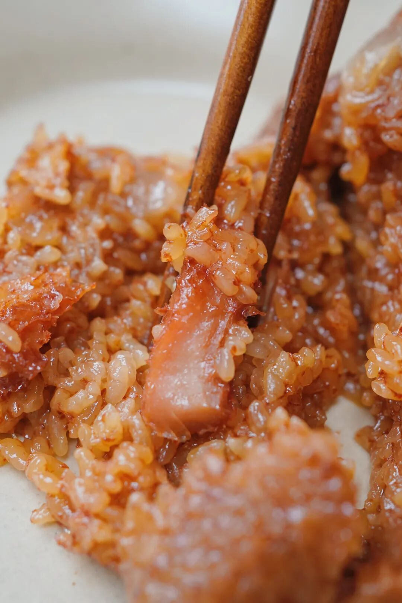
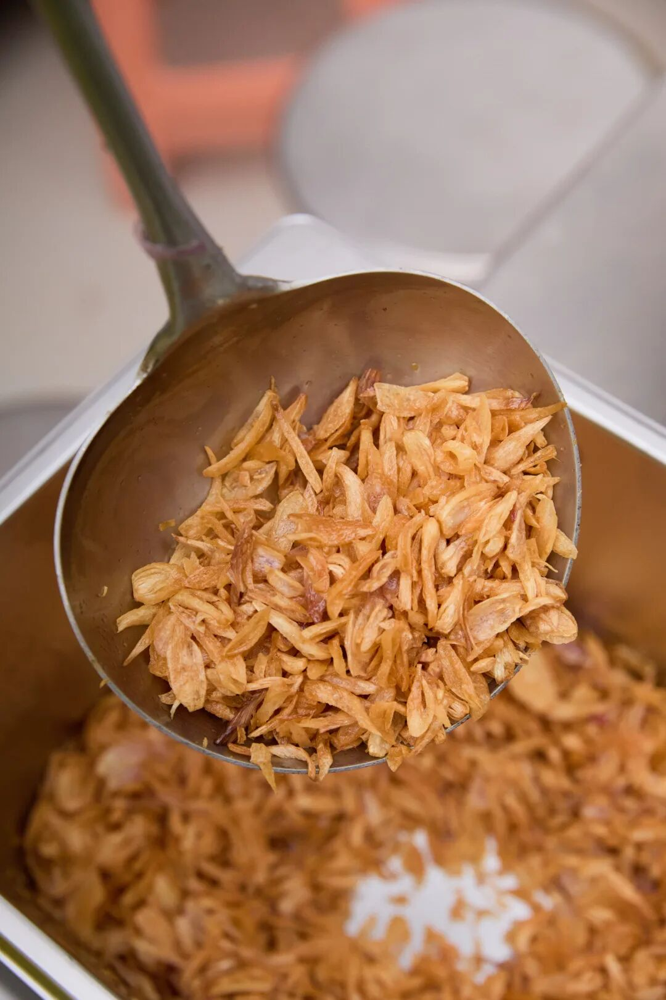
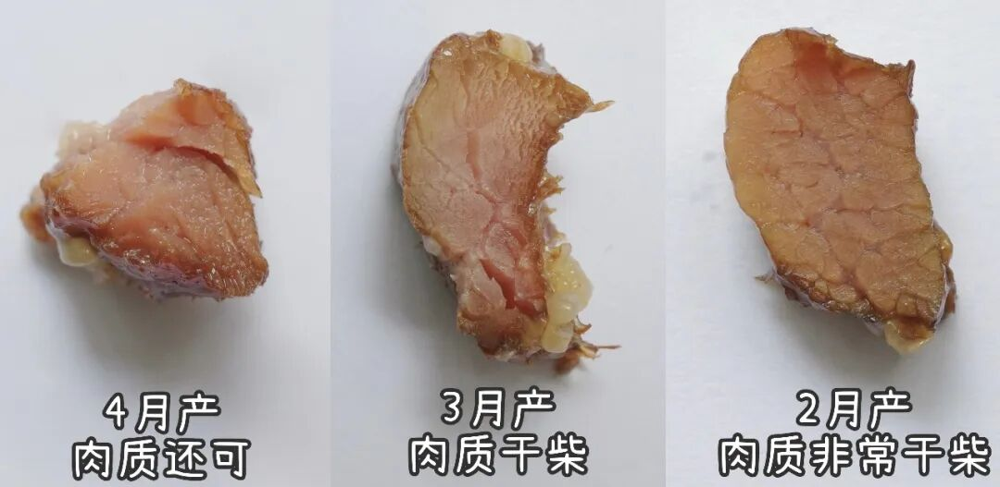
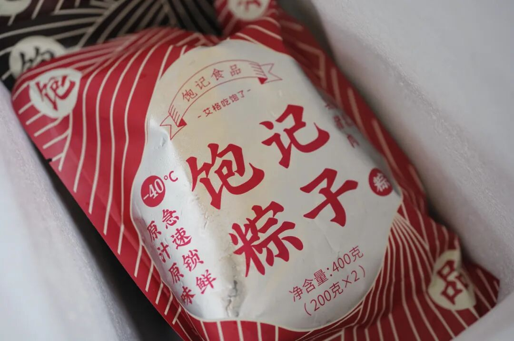
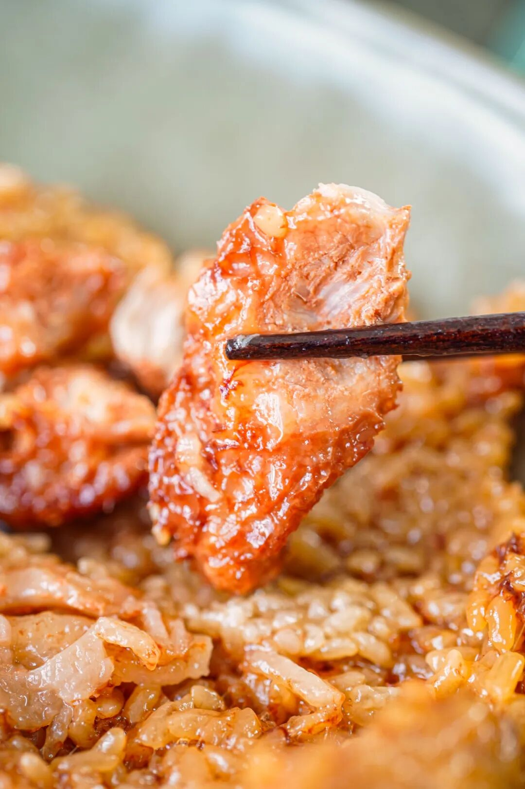
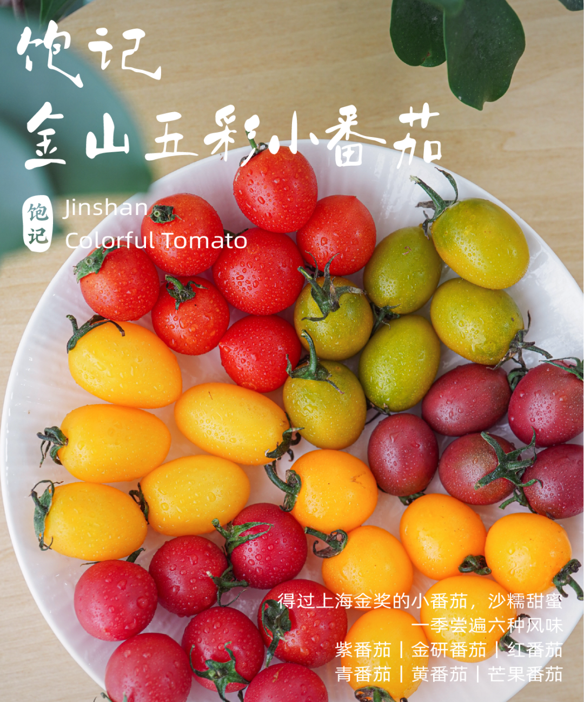

# 618 真正的便宜货。。。快买空了

- 原文链接: https://mp.weixin.qq.com/s?__biz=MjM5NTYxODQyMA==&mid=2653471262&idx=1&sn=580599f29cd4e31b7df451aee3d5efce&chksm=bcbaf31bfd431f14174e669f1b664a0bb6fe1cd027b23dbe91b4657f6133e56ae8d4887a7ee0&scene=27#wechat_redirect
- 浏览量: N/A
- 点赞数: N/A
- 评论数: N/A
- 转发数: N/A

## 正文

机会难得！

一个尽情安利自我的公众号

以下是没事干研究院的风物研究报告请放心食用
朋友们！！！最近因为 618 ，我司天🐱全场 85 折！！凑一凑就是全年地板价，这羊毛大家可别给老板落下啊！

再说今年这饱记口碑大粽

就剩最后一点点货，

快买快买快买！！

（你们是不想让我下班

限时清仓巨巨折！

真·便宜到地心！

你囤着早餐吃一只，

好吃有了，风味也有了

不是本薯吹，吃过饱记粽子的，好多都忍不住给好评了。我给大家摘抄点哈，省得我写。（全部来自真实吃过的，够真诚了吧

关于卖点，老粉可能都会背了：

咸蛋黄是高邮现挖的，豆沙粽里的陈皮专门托人到广东磨的，葱酥、葱油也是要跑去泉州现炸的，酱油要调三种，肉有黑猪腿肉，不干柴，浸润了肥膘。

我来总结下，

做了九年、卖了 90w+ 只，

一句话：比老字号的要好吃。反正嘛，有这个自信，随便比。真的香😭

他乡咸鸭蛋，实在瞧不上
首先是真材实料！包在粽子里的咸蛋黄，从高邮鲜挖的。每年坚持只用高邮本地品种麻鸭的鲜咸鸭蛋黄一年坚持鲜挖几十万只的，整个包邮区，也没听说有第二家！

这些蛋黄，还是从鸭子开始管起的！选高邮本地品种麻鸭，产的新鲜的鸭蛋，再用白酒和砂糖略为腌制：

不仅如此，饱记还要求咸蛋黄腌久腌透，普通咸鸭蛋腌 28 天左右即可，我饱记要求腌渍 45 天，一定要腌到蛋黄流油起沙：

因为腌得时间特别长，这批咸蛋直接吃非常咸，不能卖，只能给饱记包粽使用，咸蛋流油起沙，咸味渗入米里。。。

再说包在粽子里的陈皮，从广东新会现磨的。

正宗的广东新会三年陈皮，

每年端午前现磨包进粽子里。

这也是老板 2017 年自己搞了两三个月开发出来的！在包邮区，饱记是原创！（好多人不信气晕本薯

说当时，包邮区老字号们的豆沙粽，猪油总是打不细，吃到很油腻。老板觉得提升点不在打猪油上，
「人力有穷尽」。而在能不能学习广东人，加陈皮给豆沙解腻？

里外里试了几十次吧。最后忽然想起来！在广东江门吃过巨好吃的荔枝柴烧鹅。
当地好吃的秘诀就是：以当地产的新会陈皮，新鲜磨粉涂抹烧鹅，高温烤制后更香！

于是饱记找到这家五代传承的百年烧鹅老店，
请他们代我们新鲜磨制陈皮粉来包粽子！而且一定要正宗的广东新会三年陈皮哦～每年端午前现磨，运至江南：

陈皮豆沙粽的好处，就在于蒸过之后，香气格外清雅：足足一两豆沙馅料，细腻流心，三年陈皮唇齿留香！自此成为本薯最爱甜粽！

再说今年新做的闽南葱香烧肉粽，

红葱酥和红葱油，

跑去泉州现炸的，

就是闽南的红葱用油细细炸，

配料干净得不得了！

后两款给你们简单介绍下！一是传统酱香黑猪肉粽，用了三种酱油去浸米，其中一种是包邮区百年老字号日晒夜露的。
和蛋黄肉粽的米配方完全不同！老板说想要小时候土酱油的烟火气～

最后较为小众的古法南乳黑猪肉粽，南乳，就是红腐乳。好的南乳汁，饱记用来腌粽子肉，也是翻遍包邮区、华北和广东的南乳酱，最后：广东古法南乳酱赛高！

顺丰冷链，急冻锁鲜新鲜吃得出！
好原料包出来的粽子，风味不能浪费，所以我司坚持每一箱顺丰冷链上门。虽然这样运费成本很贵。

然后是我司多年的急冻锁鲜工艺！遥想当年，老板也曾尝试做真空粽。这种工艺相对便宜，而且保质期往往很长，可以常温储存。方便大家送礼。但也是真的，没急冻锁鲜好吃。某家老字号的真空粽能说明问题，来看图：

这图是 5 月同一天拍摄的，从左到右，生产日期逐渐拉远。
而坚持用-40℃ 急速冷冻锁鲜工艺，保质期内味道和口感几乎不会有改变，始终香，而迷人，相信你能吃得出来：）

普通 -18 度不能冻哦米会被冰晶撑破，要专门急冻设备做
总之，如果你想平时吃点好粽子，来吧，买饱记的急冻锁鲜粽没错。现在清仓 7 折！最后一点点，

本薯卖粽不易啊啊啊啊啊！

饱记·口碑湖州大粽预售中

现货中！！！

限时尾声 7 折！！！！

戳图买它👇

题 外

朋友们！！

本薯还有折扣奉上！

今年份的比鸡蛋大的海南荔枝王，

昨天刚上架！只能吃一周！

给大家限时早鸟 86 折！

此外天🐱618活动又又来了，

我司直截了当打折！

🍑平台全场 85 折！

以下为有赞折扣直通车！如果你还想趁此机会囤好茶，蒙顶甘露&梅家坞龙井，单件 86 折两件 8 折！突然熟了的云南西红柿，配鸭蛋炒正正好，是小时候阳光里长大的浓郁番茄味儿，
限时早鸟 86 折！！拿过上海金奖的金山小皇冠西瓜，

爆汁清甜还有瓜鲜味！

也拿过上海金奖的金山小番茄，

难得回归的泰国超甜多汁金柚，

卷中卷红玉芒果，

娇艳可人的雷州木瓜，

现在都有限时活动 86 折！

饱记·海南永兴火山荔枝王

现货中！！！

限时早鸟 86 折！！！

戳图买它👇

饱记·梅家坞龙井&蒙顶甘露限时单件 86 折！！！两件 8 折！！

戳图购买👇

饱记·金山小皇冠西瓜

购买方式如下

限时早鸟 86 折！！！！

戳图买它👇

饱记·云南西红柿

购买方式如下

限时早鸟 86 折！！

戳图购买👇

饱记·多汁泰国金柚

购买方式如下

限时吃水果 86 折！！

戳图购买👇

饱记·金山五彩小番茄购买方式如下限时 86 折！！
戳图购买👇

饱记·海南红玉芒果购买方式如下限时吃水果 86 折！！！
戳图购买👇

饱记·湛江雷州木瓜

购买方式如下

限时吃水果 86 折！！

戳图购买👇

本文的研究员

薯角我想我知道夏天的味道

用好吃的方式吃一生

祖国各地好风物

文章转载请加微信「baojiclub」

