# @所有艾格的朋友，明天来线下面基

- 原文链接: https://mp.weixin.qq.com/s?__biz=MjM5NTYxODQyMA==&mid=2653461317&idx=1&sn=9793819560f6b51a77e617e2b536a7ce&chksm=bc214873b0bc7b7f2afd1e64e79cdf2b36d823e7c9c926661e2f7b77b20fa1ca615a608fbc2e&scene=27#wechat_redirect
- 浏览量: N/A
- 点赞数: N/A
- 评论数: N/A
- 转发数: N/A

## 正文

最后一天

一个尽情安利自我的公众号

以下是没事干研究院的风物研究报告请放心食用

上海的秋天真好哇。。。

风和日丽，阳光明媚！

来通知一下，

我司为人气云南餐厅

浩海火烧云设计承办的

「香料花园」活动！

今明最后两天！！

快叫上好伙伴来逛来吃👇

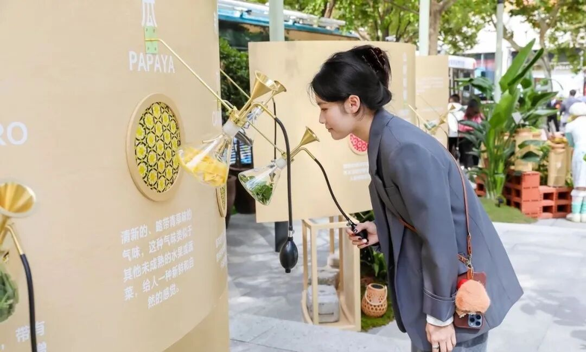

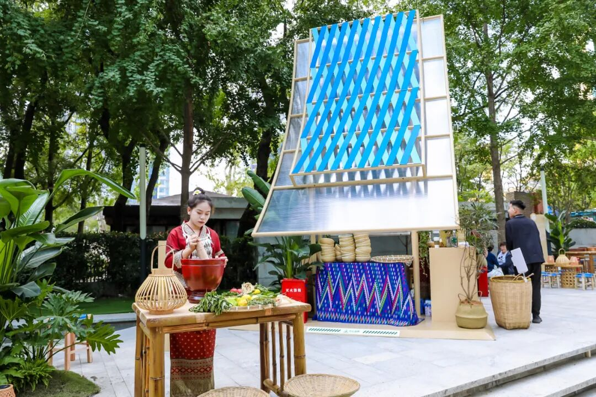

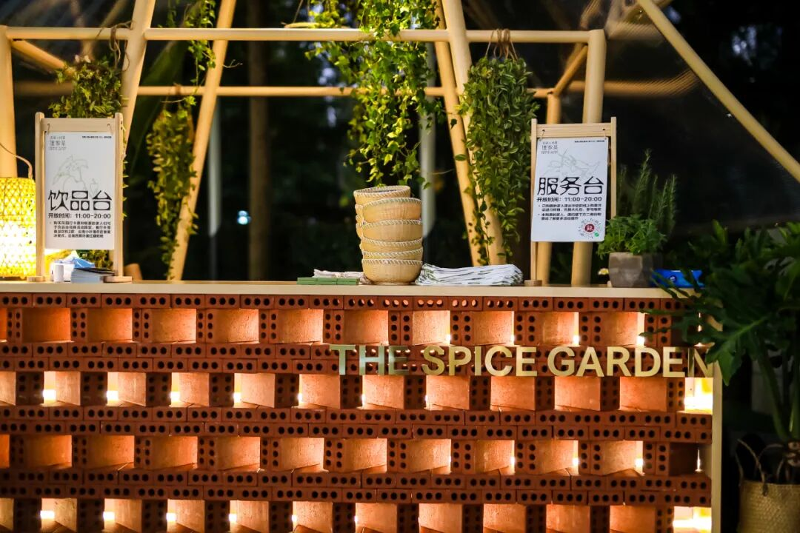

⏰时间：10月23日-10月30日，11:00-20:00

📍地址：上海市南京西路 1601 号芮欧百货风之溪谷；上海市南京西路 1601 号芮欧百货 4 层 4A 室内

本薯从不吹牛，

这花园你来了绝对不会后悔！

来来来，

这就给大家导览一番

第一弹：

云南香料美食·上海大都会版

此次活动，

我们直接把云南德宏最有特点的「市场生活」

搬到了静安公园毗邻。

（也是火烧云老板娘的故乡👆

且怀着对云南远方香料的敬意，

制作了云南香料美食的大都会版本！

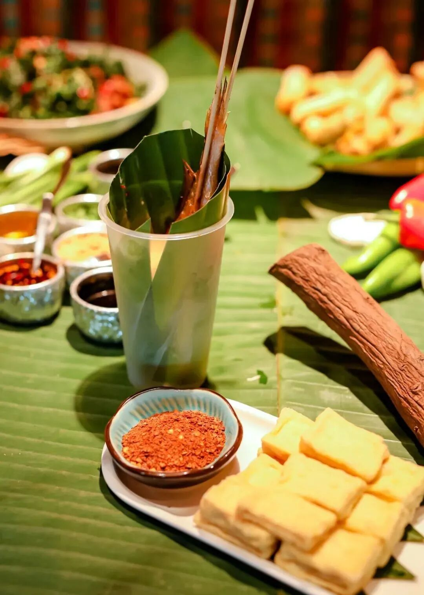

这个云南木姜子油 75% 黑巧克力，

味道惊喜得很！

用木姜子油融入黑巧克力块，

产品同事调试了无数次，

最后发现可可含量在 75% 的时候

吃起来醇厚、顺滑，

木姜子的清香在其中浑然天成，

打一个极妙配合！

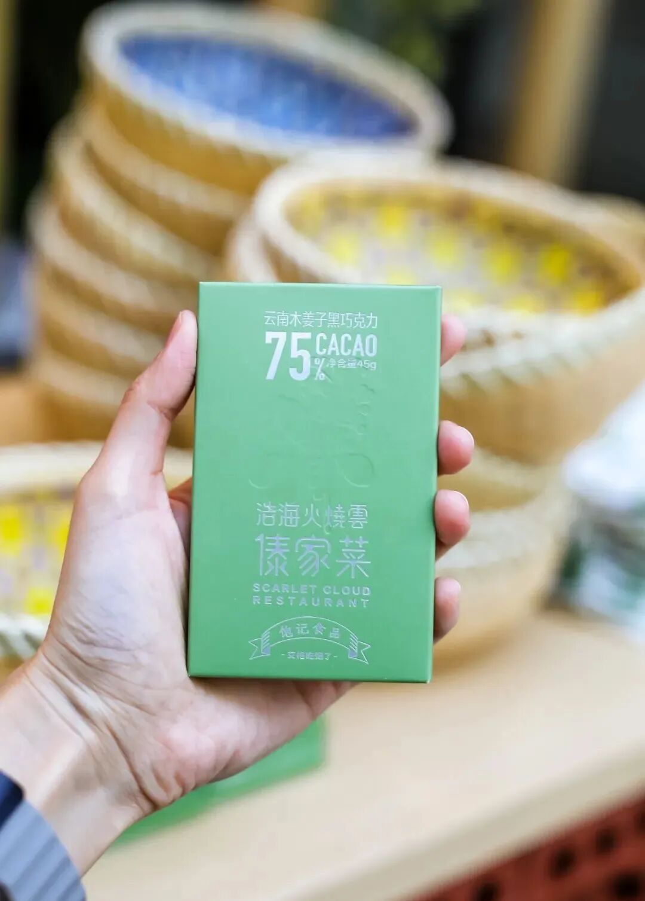

云南百香果小叶薄荷冰美式咖啡，

清爽，解腻！

入口有薄荷香气！

纯甜的热情果（云南百香果）和

清香的小叶薄荷均由云南运来，

咖啡豆由云南豆与哥伦比亚豆拼配，

是我们独家定制的浩海火烧云配方👇

德宏烤鱼。

火烧云后厨师傅特地为本次活动准备的美食之一！

在各色香草腌制而成的小黄鱼的鱼腹中，

塞入调制好的缅甸芫荽、香柳等云南香料，

直接放到炭火上，小半个钟头！

外焦里内、清香酥嫩。

双味包浆豆腐，

经炭火烧烤的豆腐一口爆浆。

分别配上招牌黑三剁、木姜子小肉干

做成的肉脯，

搭配新鲜帕玛森芝士与酸奶，

你品，你细品👇

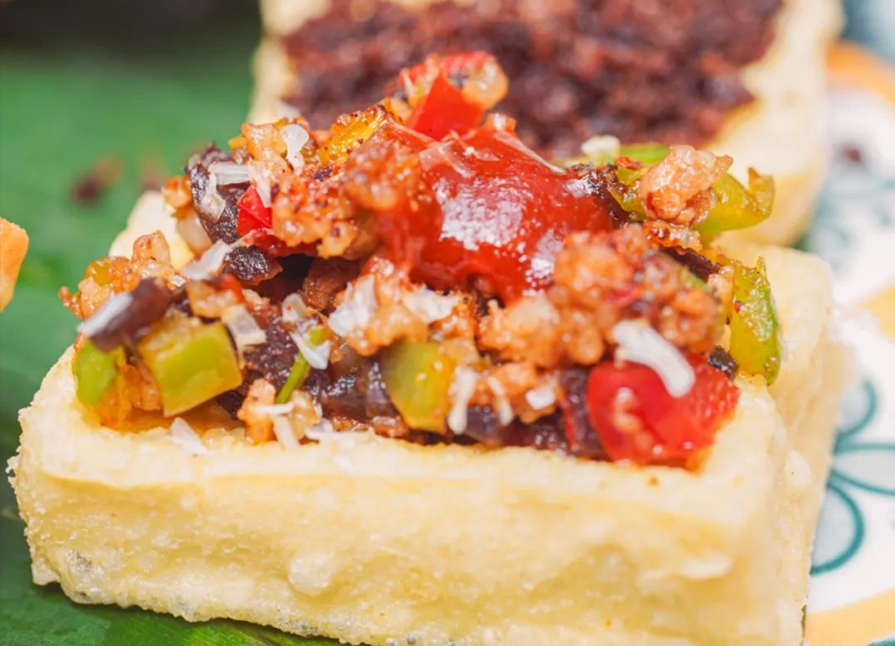

小春卷儿，

把兰州九年百合、新鲜马蹄等蔬菜，

拌入新鲜茴香。

佐以浩海火烧云招牌小吃稀豆粉，

还可以自己 DIY 蘸料，

浓香脆口！

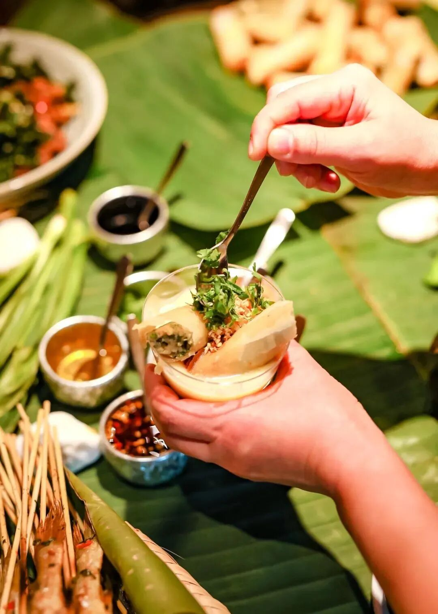

烤云南芭蕉叶裹红糖粑粑，

是纯正的德宏市场本土风味，

甜而不腻，又糯又香，

好适合降温的这个时节！

第二弹：

西南边陲小城·限定体验

夏天那会儿，

我司团队特地跑到了德宏州首府芒市，

进行此次活动所需的相应民族志采风！

傣族屋檐在芒市的运用，被我们借鉴搬到了活动上👆

芒市市场如同色彩天堂，

傣族当地布料的颜色与光泽成为此次设计的原点，

我们希望以时髦的方式在上海呈现

还有各种傣族家庭手工竹编家具，

纹样精致，

看着讨喜得很！

没想到吧，

此次也被我们空运到了上海！

供大家休闲小憩。

（还可以作为伴手礼带走

咖啡庄园里偶遇的红砖花坛，

亦被巧妙运用，

融入现场的打卡路线👇

回到上海，

看！西南边陲小镇的宁静与闲适，

在上海市中心一隅，

完美融入👇

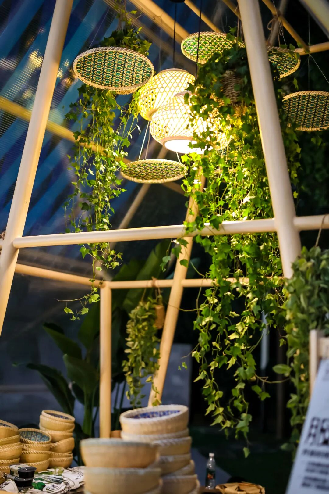

入口休息区

与静安寺限定打卡机位！

使用到了德宏地区常见的建筑及装饰材料红砖，

对面即是绿境中的静安寺机位打卡点。

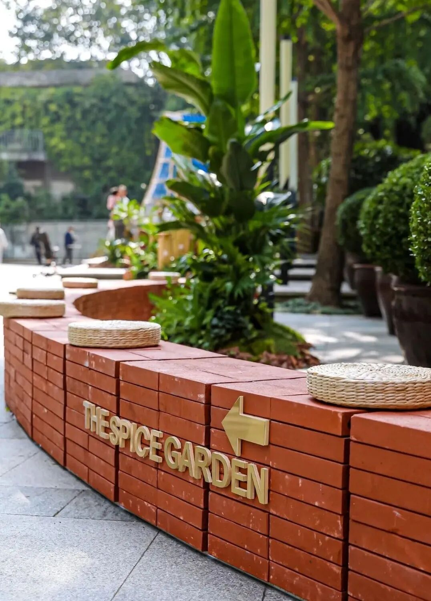

依据德宏当地传统烹饪习惯，

我们把云南人民日常生活中的九种香料一一展示。

从辛香到清香，

直观了解香料在烹饪中的实际应用。

趣味香料气味展示墙。

山胡椒根、木姜子、香茅草，

香柳、薄荷叶、白芹菜，

还有大香菜、荆芥、鱼腥草，

每个区域的编织图案暗示了香料的独特香气，

你能闻出它们之间的区别吗？

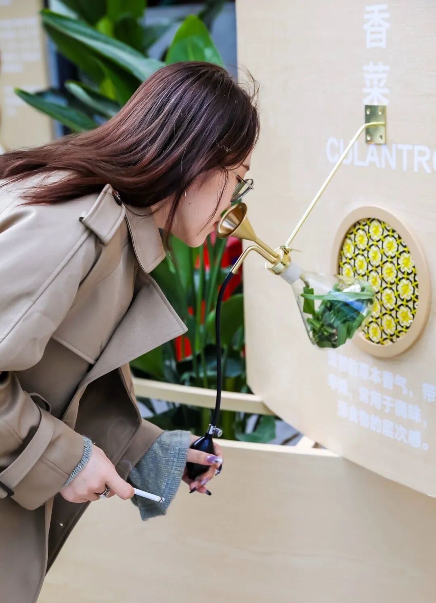

休息区。

从云南德宏空运过来的竹编桌椅，

实打实还原傣家风情。

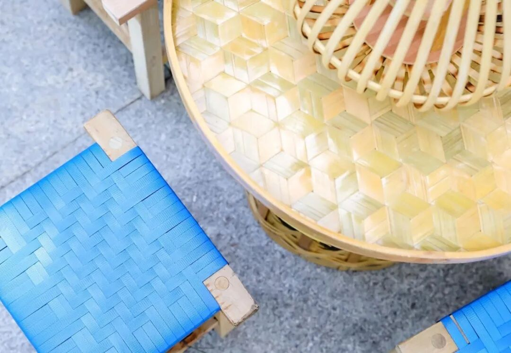

身穿傣族服饰的妹妹一坐下，

就像回到了芒市市场。

第三弹：

打卡与边境传统烹饪技法体验

特意设置的窥金之镜，

来都来了，

不如和隔壁的静安寺金顶合个影！

拿手托住👇

豌豆粉制作观赏点。

滇西南的功夫小吃豌豆粉，

经过搅拌、沉淀、过滤、熬煮四大工艺制成。

舂菜体验。

在德宏傣家，

家家户户都有一个舂桶，

蔬菜和烤制的肉类，皆可以当主菜，

加入新鲜香料后大力捣碎，

与食物融为一体。

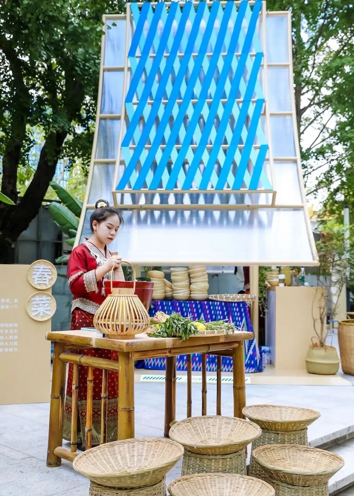

这道边境传统烹饪技法，

现场也会充分展现给大家👇

可以上手试试！

第四弹：

绝美活动限定伴手礼！

PS：还能抽 100% 中奖率的抽奖

既然来了就不会让大家空手而归！

除了现场兑换美食，

还有特别为大家准备的活动伴手礼！

样样有惊喜！

除了前面提到的云南木姜子油 75% 黑巧克力，

还有德宏最具盛名的

傣族竹编生活用品家庭，

为上海的客人们手工染色编制的

彩云竹编置物筐。

还能自取一袋木姜子香料，

带回家泡水、煮汤都香绝！

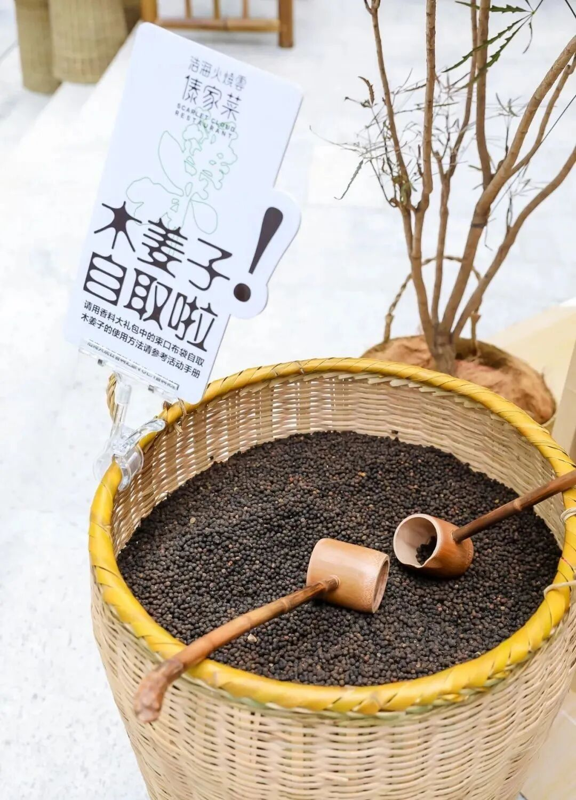

以上统统都带走，

就用本次的活动专属定制环保袋来装！

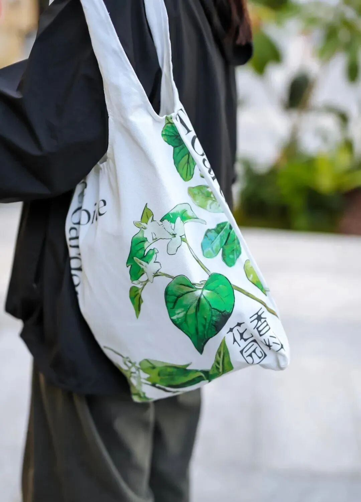

走之前千万别忘了，

还可以到隔壁的香料花园服务台，

抽个中奖率 100% 的奖。

有人随手就抽到了一张

「德宏七日游」！！！

机票住宿吃喝全包的那种游👌

（羡慕到变形

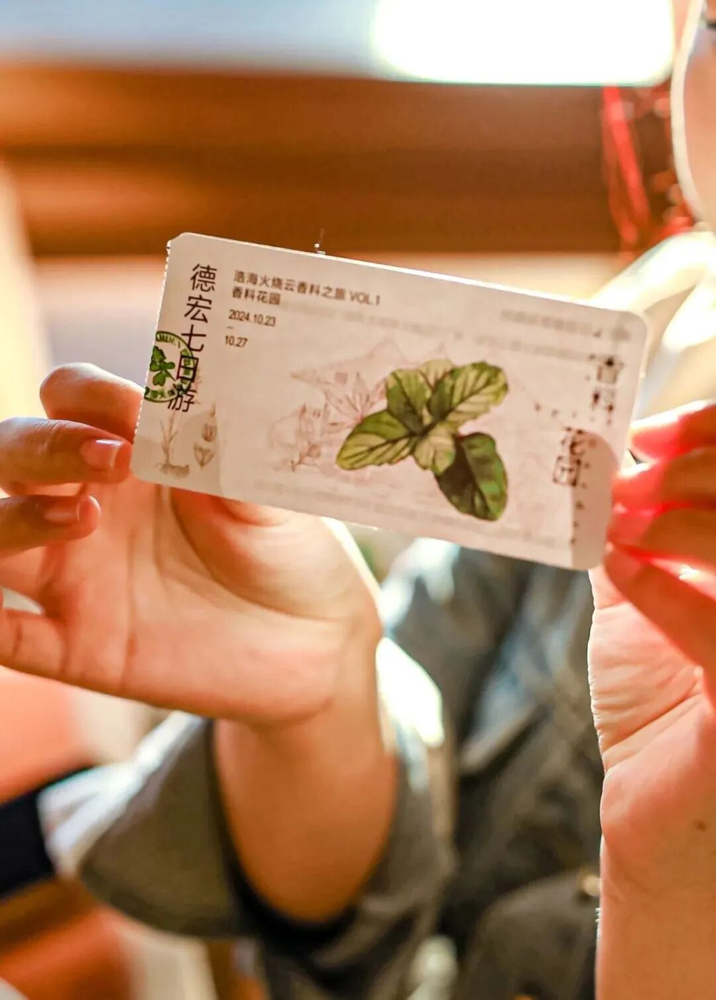

以上体验，

最低只要几十块，

能吃能喝能玩能拿！

三种类型门票，

都是成本价。

门票类型一：花园打卡票👇

门票类型二：

浩海火烧云现制活动限定小食体验票👇

门票类型三：

联票👇

畅享花园食品饮料 2 款及店内 3 种小食。

最后两天！

错过就不知等何时啦～

来见面吧！

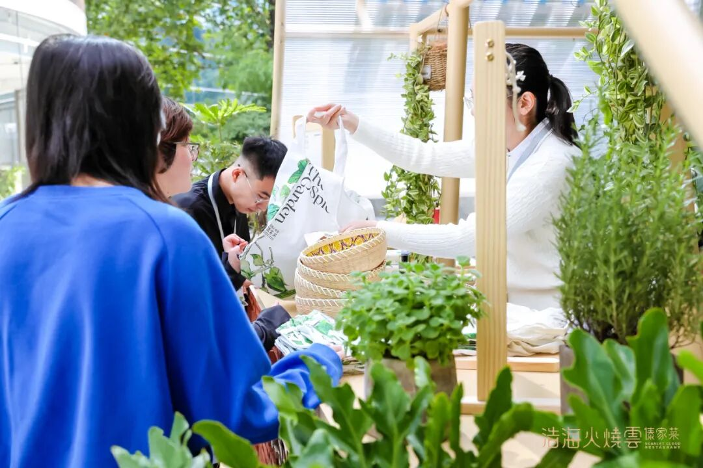

香料花园·超值门票

购买方式如下👇

戳图买它👇

本文的研究员

薯角秋天还很好

用好吃的方式吃一生

祖国各地好风物

文章转载请加微信「baojiclub」

