# @所有艾格的朋友，这周末来线下吃金奖羊肉

- 原文链接: https://mp.weixin.qq.com/s?__biz=MjM5NTYxODQyMA==&mid=2653464758&idx=1&sn=6bd0056b66bb0f93fe45cbcca68b3d8b&chksm=bc64a79dcf1d67bdd931c544b06509371348aad3567413bbf0cfde651c4e5b40c1fba7763ba6&scene=27#wechat_redirect
- 浏览量: N/A
- 点赞数: N/A
- 评论数: N/A
- 转发数: N/A

## 正文

提前过节了！

一个尽情安利自我的公众号

以下是没事干研究院的风物研究报告请放心食用
这么冷的天，大家休息时都爱干嘛啊？薯角我来分享一下，这周末不加班有空的话，

来瑞虹天地太阳宫与我司一年一度联手相伴的

「市市如意」年货集啊！

别的暂且按下不表，金奖羊肉保证大家吃到肚皮滚圆

还是中国特级烹饪大师配方！好逛好吃，不用吹冷风，叫上你最好的周末搭子一起来！！！！

看好时间地址，

别跑错了！！！！！！！！！！

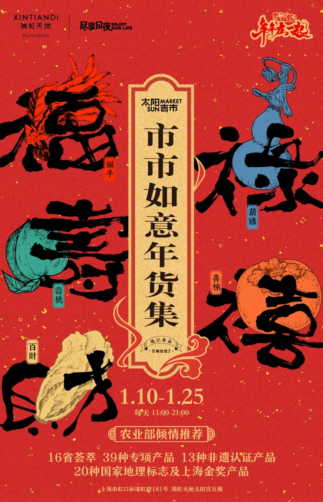

时间：1月10日-1月25日每天11点-21点 地址：上海市虹口区瑞虹路181号瑞虹天地太阳宫五楼。

第一弹：

外面吃不到的金奖羊肉·面/饭

不是我薯角吹，

这次市集上的羊肉面馆大有来头！

用的羊肉曾获

2020 上海地产优质羊肉品鉴评优活动金奖。

同时供应上海多家米其林餐厅！

我司特地邀请中国特级烹饪大师毛水生老师，

出了三个大师配方！

把这羊肉的独特奶花香味发挥得淋漓尽致！

大师菜单其一：

金奖羊肉·清汤面。

先说最重要的羊汤，

是用没有膻味的新鲜羊腿骨，

搭配九种香料熬煮整整两小时以上，

汤色油润清亮，

不是那种加了科技狠活的奇怪奶白👇

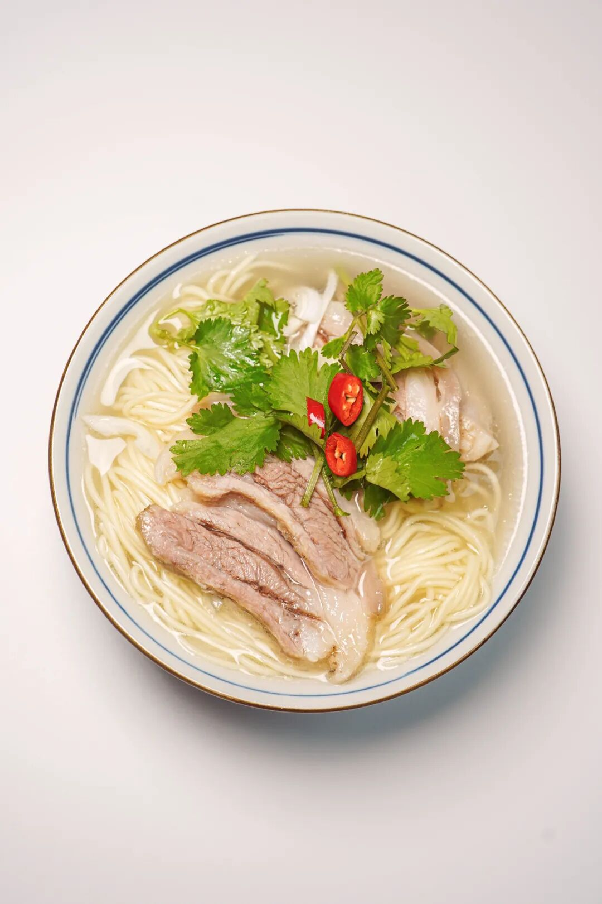

入口羊汤浓郁鲜甜，

带着油脂香和奶香，

切下来的厚片羊肉一点不老！

嫩而不膻。

配上韧性十足的苏式细面，

一碗下肚全身都暖和了！

大师菜单其二：

金奖羊肉·红汤面。

红汤面的浇头很重要！

所以毛水生老师的配方，

用了 12 种香料来炖大块羊肉，

放入高压锅大火煮，

揭开盖整个空间都香气四溢，

不是那种纯甜纯咸，

而是能吃到多层次的丰富香料风味，

不愧是他！

肉用到了羊腩和羊腿等部位，

切大块码在面上，

入口酥烂软糯，

肉筋相连的地方还 duang duang 的～

浓香的同时完全不油腻，

啊～本薯边回味边馋！

大师菜单其三：

金奖羊肉·手抓饭。

这一碗含金量十足的饭，

从选米开始有讲究。

用的闵行大米，

也是上海地产优质农产品！

胡萝卜和白洋葱，

都用乳白羊油煸炒过，

入口奶香味好浓好浓～

白切羊肉，

选用的羊腩和羊腿肉，

和羊汤一起熬煮出来，

肥美而不腻，

肉质细嫩多汁！

冬天里这一大口的幸福谁懂？？？

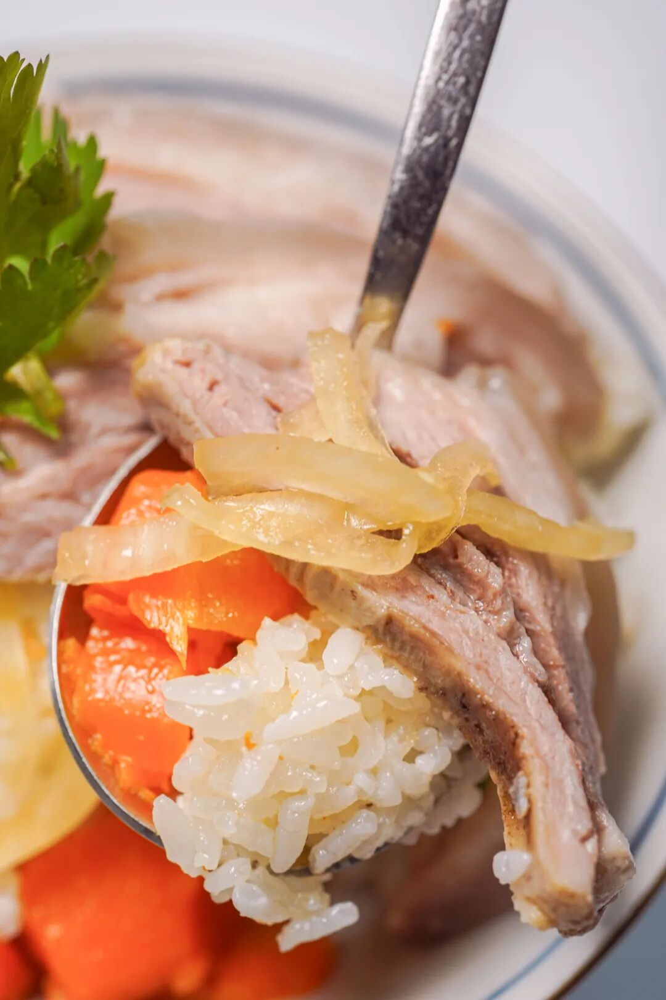

这面馆还在搭建中

先给大家看张示意图，

1.10-1.12，限时三天，

来市市如意年货集吃它！

来吃！

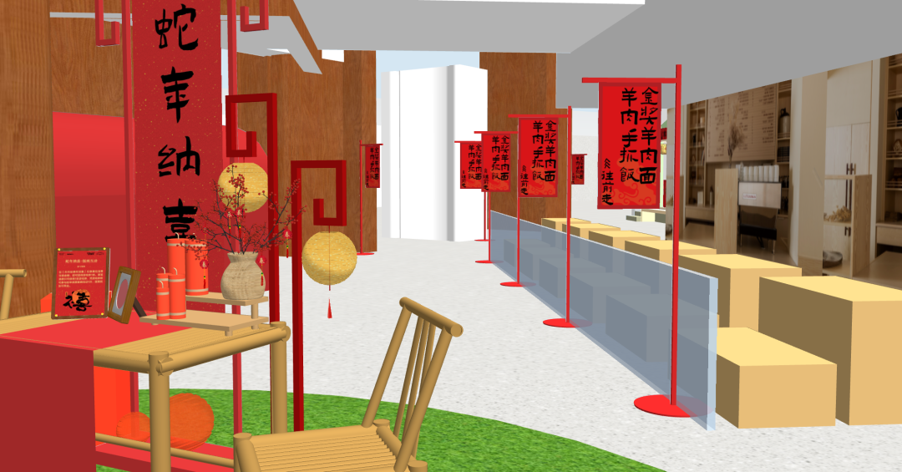

第二弹：

吃到昏厥的美食美酒

本薯不爱吹牛，

但这个市集你来了一定不会后悔。

（有吃有玩还有羊毛薅！

提前替你们看过活动和产品清单了，

怎么讲，

产品经理又没少熬大夜吧。。。。

真是搞来了各种新鲜玩意儿啊！！！！

先简单剧透一波。

温润爽口的潮州卤鹅，口感细腻的六安腐乳，

还有果大纯甜的黑籽石榴，

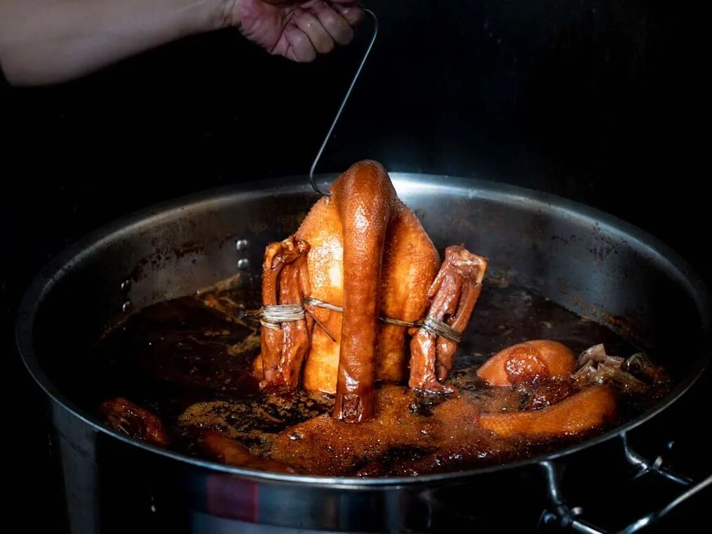

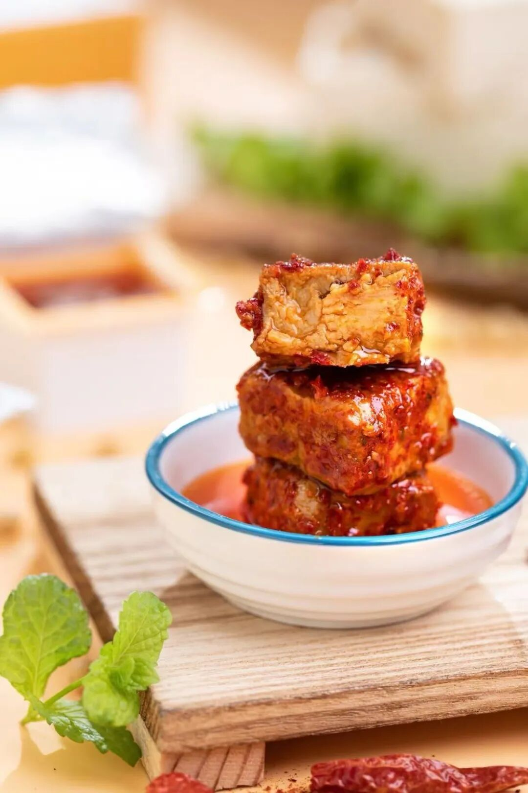

暖心暖胃的松江黑山羊肉～

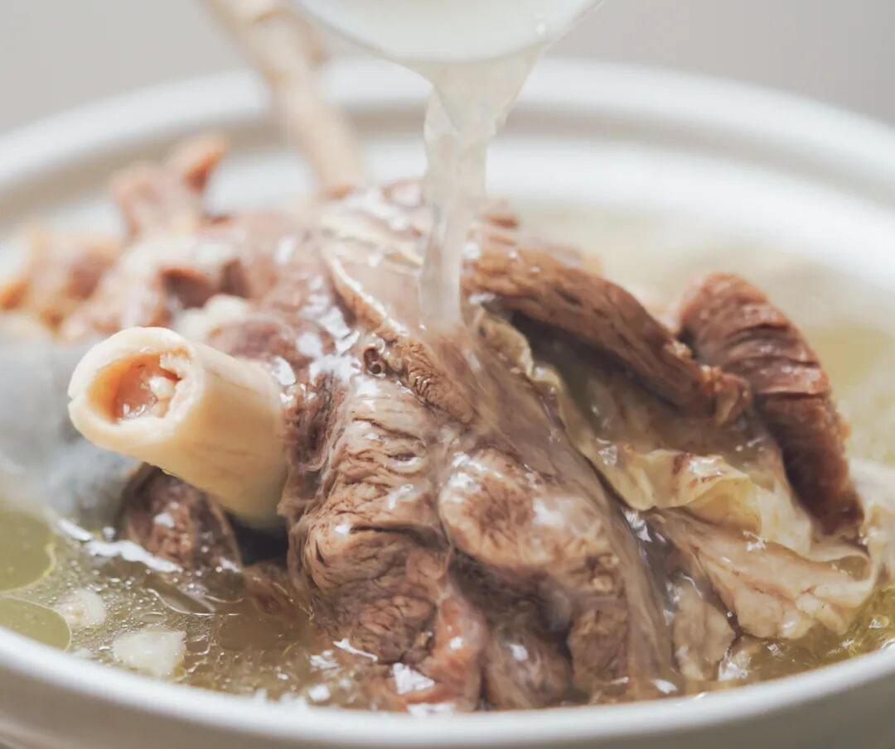

一年仅此一季的海南300日文昌老母鸡👇

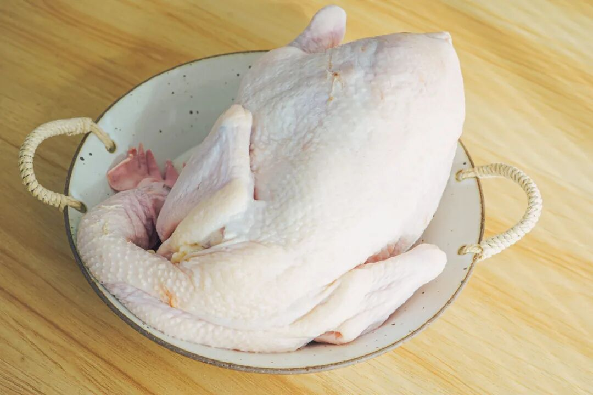

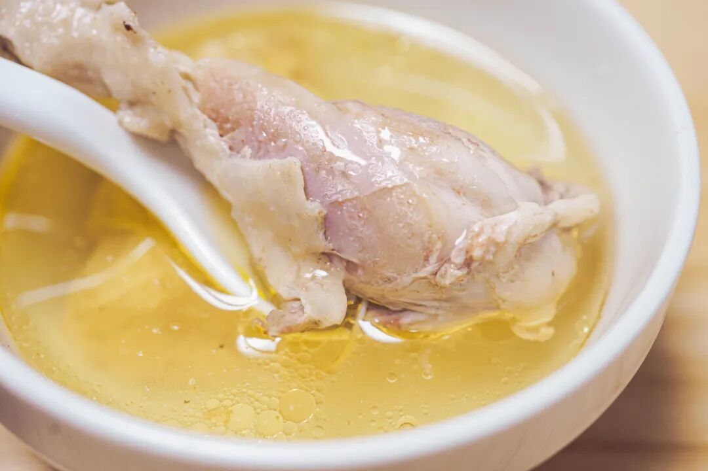

糯唧唧的富平流心柿饼，

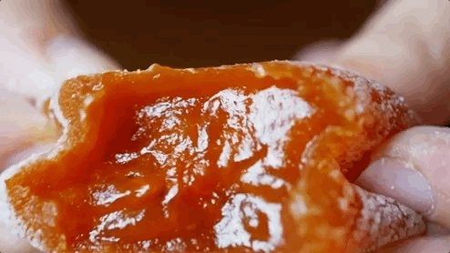

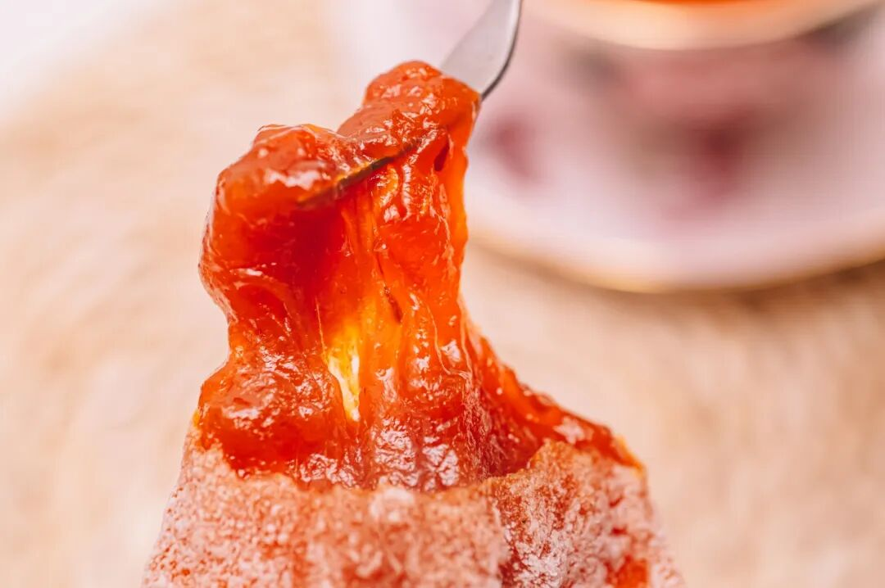

我司王牌生鲜水果也都拉到现场了，

上海金奖青浦草莓，

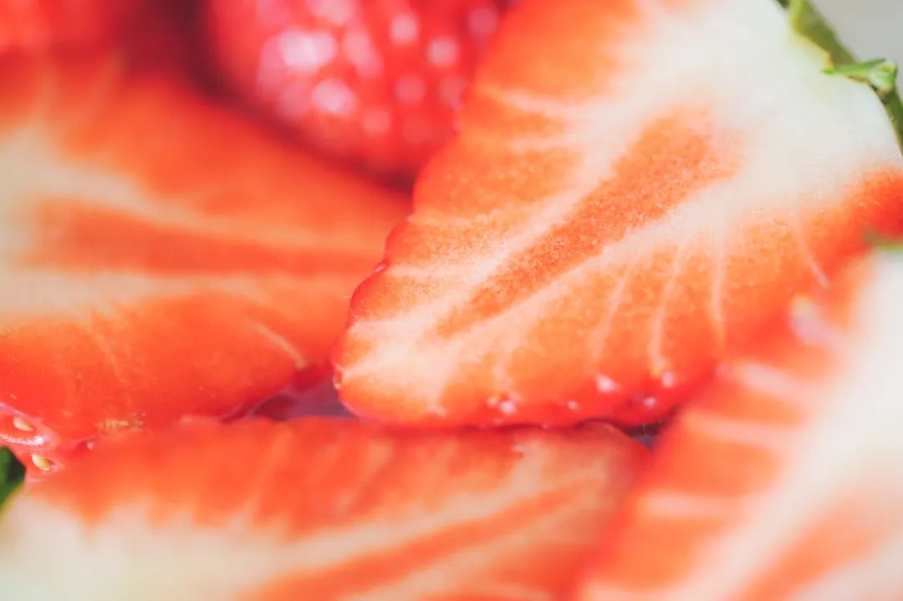

柑橘皇后台州红美人，

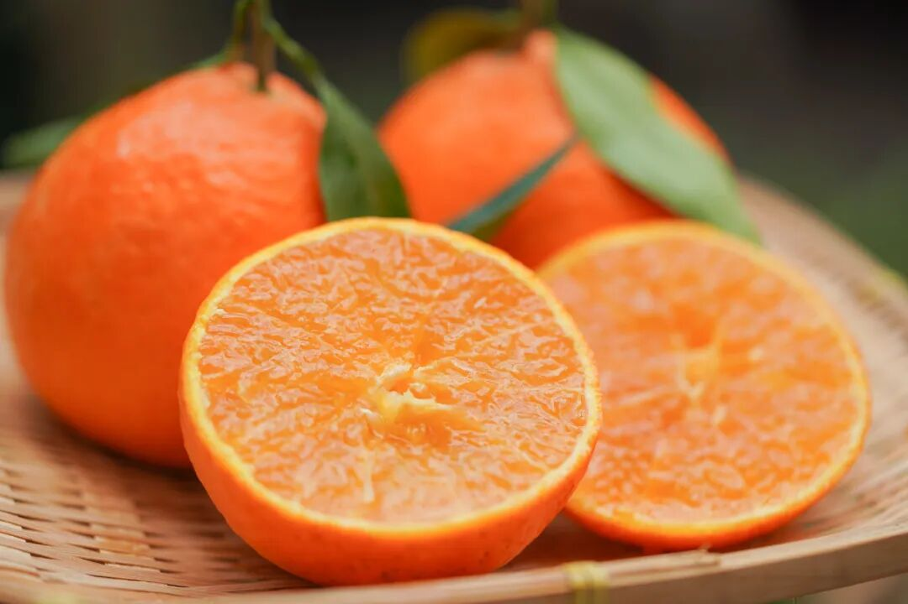

一口甜到心里的融安脆蜜金桔！

对不起暂时还没有现场图，

给大家一场氛围图先简单感受下👇

剧透完了，

这周五开始一直到本月 25 号，

就在太阳宫五楼！

大家人来就行！！

不要门票不要门票不要门票！！！

且，现场产品，可以免费试吃！

本文的研究员

薯角多吃点，好过冬

用好吃的方式吃一生

祖国各地好风物

文章转载请加微信「baojiclub」

