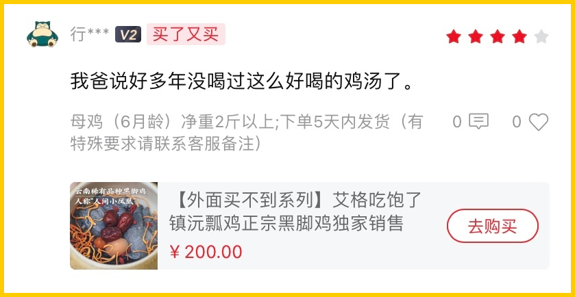
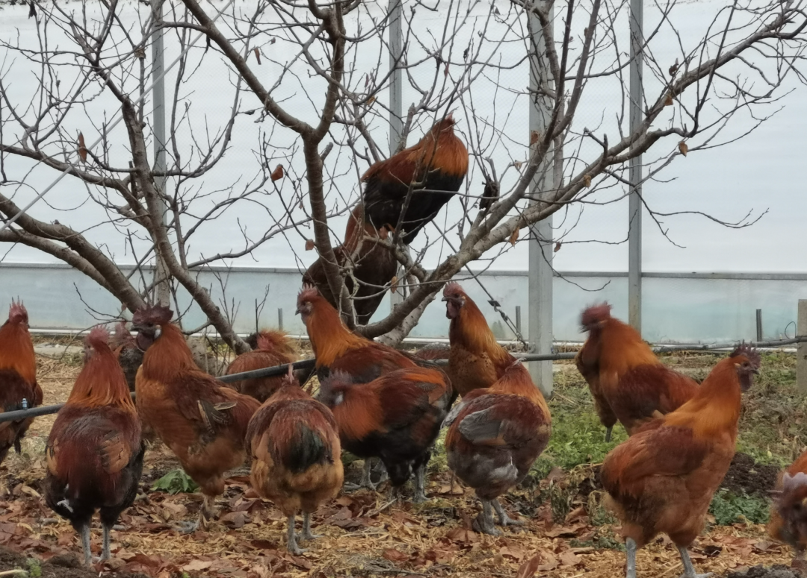
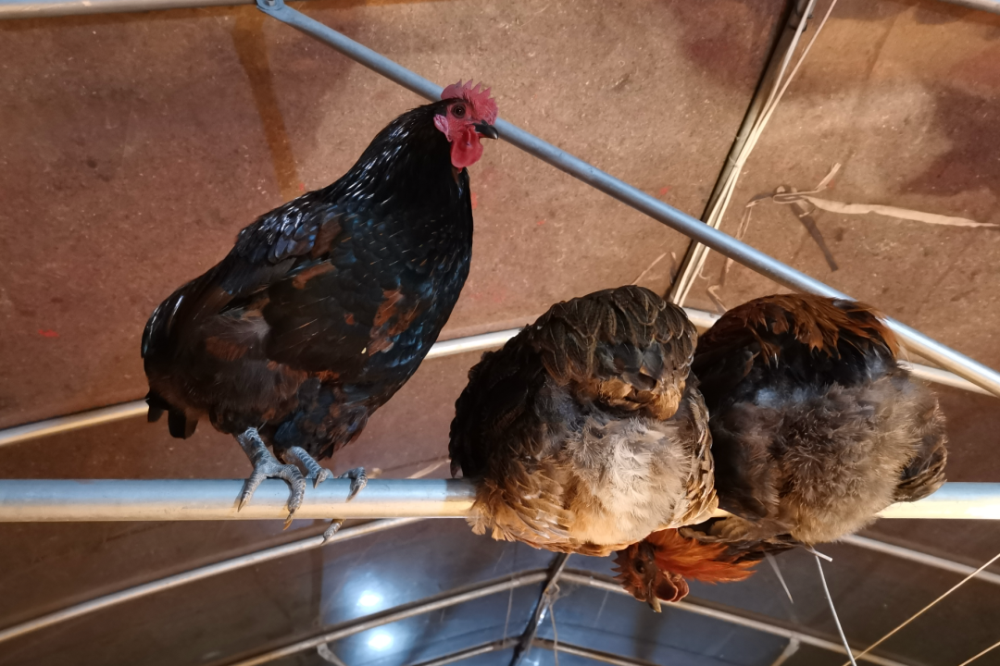
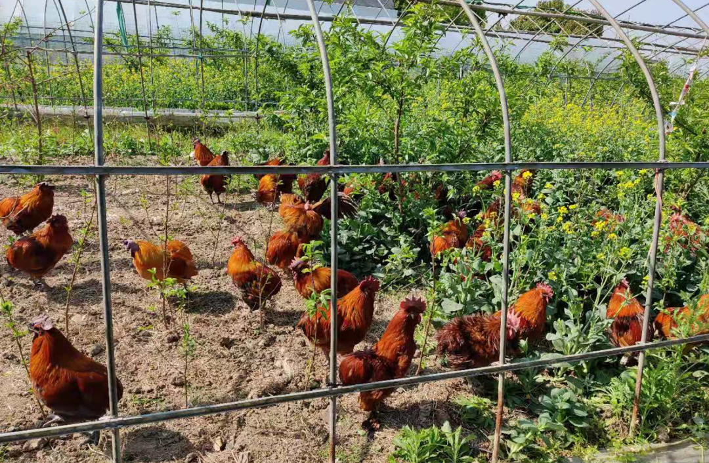
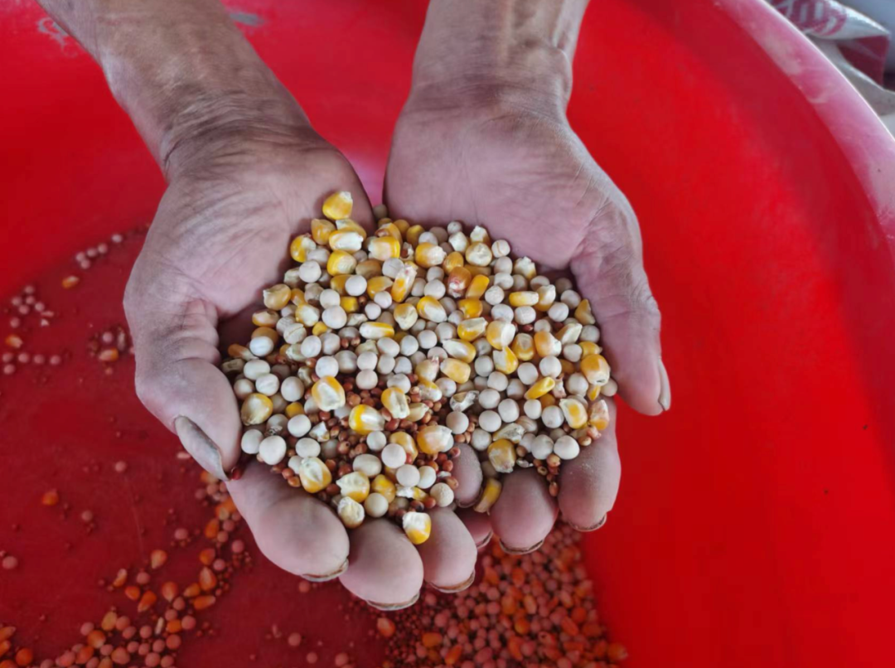
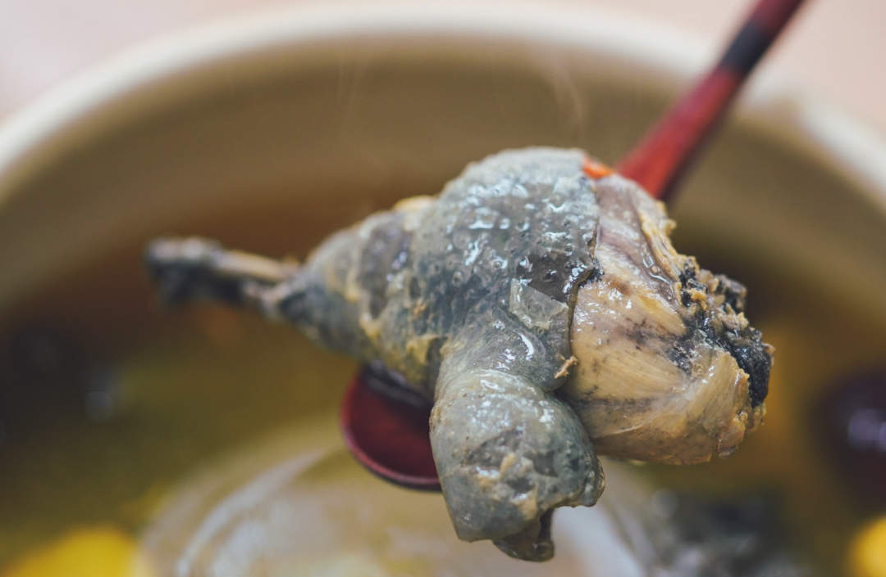
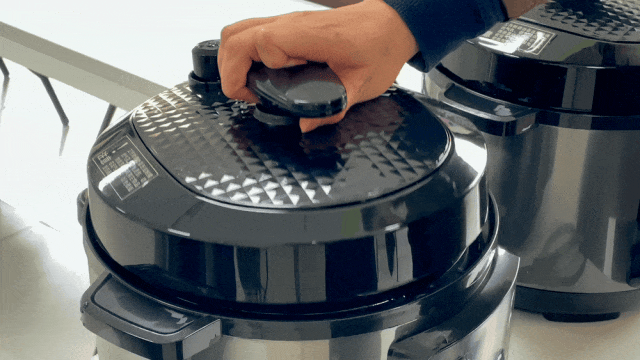

# 「我爸说好多年没喝过这么好喝的鸡汤了」

- 原文链接: https://mp.weixin.qq.com/s?__biz=MjM5NTYxODQyMA==&mid=2653463385&idx=1&sn=e8e7c796169ecd7f31154719798be6dd&chksm=bc16355bd3c83a07e6c92c4d34525611f01a558355395db2d383191eff1b5a7eeb5b800cc91e&scene=27#wechat_redirect
- 浏览量: N/A
- 点赞数: N/A
- 评论数: N/A
- 转发数: N/A

## 正文

缘来是你

一个尽情安利自我的公众号

以下是没事干研究院的风物研究报告请放心食用
众所周知，我司拥有一群神仙客人！在如此寒冷的冬日，
留下这么一条真情实感的好评，
只为温暖我薯角的心！👇（强行给自己贴金

啊啊啊啊啊，

夸的正是我司上上下下都在买的

云南稀有品种黑脚鸡！！！

上海金山区引进金尊玉贵地养着。

不过区里换了鸡场，小鸡新养，

这一批卖完，

要等半年后才能再吃上，

诚邀饱记用户给科技事业贡献一下！！

这鸡外面根本买不到。很荣幸我们饱记被选中，成为此鸡目前销售的前锋主力军！划一下重点：这一批分为两个档位，都只剩最后几十只！第一档：6 月龄公鸡净重 3.4 斤以上。6 月龄母鸡净重 2.5 斤以上。第二档：
6 月龄公鸡净重 3 斤以上。6 月龄公鸡净重 2 斤以上。

此鸡大有来头，老朋友直接拉底部复购，新朋友们继续往下看看啊！

👇

不知大家是否听过，

「鸡中龙妈」。

请听它的名片，

国家珍稀特色家禽品种·云南六大名鸡之一·被农业部列入国家级畜禽遗传资源品种保护名录·上过央视·闯荡过上海滩·营养价值极高·肉质极其鲜美·味道堪比山货·人称「人间小凤凰」的云南镇沅独有品种。

正是鸡中名品「瓢鸡」！！！！！！

事情是这样的，

其实，这个鸡，

我薯角从去年年底拿到产品资料，

就已经被它深深震憾了！

这么尊贵的出身？也是我配染指的么

后来吃过几次，

更是直接原地疯狂！

用来炖汤鲜甜不腥，有鸡味！

之前给家里人寄了两只，

他们直接搬出了花雕酒来做，说这样才不浪费。。。

它的故乡，

是美丽的云南普洱市镇沅县，

乃当地特有鸡种，

因为没有鸡翘，

且尾部形状似葫芦瓢，

所以叫做瓢鸡。

这都是产地实拍图，不精美但非常真实！

长相俊美，生性好斗，通体乌黑

（但不是乌鸡哦。。。

市面上极其少见，

是非常小众稀有的品种。

坊间还有爱称，“人间小凤凰”。

超级壮！

所以，

建议别轻易在家尝试剁鸡，

我是拿到菜市场找阿姨帮忙的。

并且，

还请阿姨拿了她摊头上最大的土鸡来对比，

完全不是一个量级。

感受一下差距。。。

为了保留瓢鸡的野性和肉质品质，

金山区可谓是全区齐上阵，

煞费苦心啊！

不仅在养殖区域内模拟了云南林地地貌，

搭建了高床供其跳跃、休息，

专门配置运动场和栖息架，

满足它喜欢运动和在树上休息的天性，

平时，还要搭配玉米、豌豆、高粱

等天然粗粮和青绿蔬菜，去喂。

这是什么神仙鸡生啊。。。。

（过的比我健康，吃的比我养生

同事说这图太粗糙了，我说你看这不是爱心吗！

总之，

此鸡威武雄壮，

每天锻炼健身，打架斗狠，

导致蛋白含量高，脂肪含量低。。，

也就是俗话说的肌肉多，肥肉少。

（我妈：这样的鸡才格外滋补

图片拍不出来，大腿真的很健硕！

养生的事我不懂，

但完全没有任何厨艺，

只用一只鸡，及水，

丢进高压电饭锅炖了40分钟，

出来的效果是这样的。。。

肉质极其弹牙紧实，

完全不是烂烂的口感。。。

解释一下，真是用电饭锅炖的，摄影师为了拍照好看转移到了砂锅中。。

汤，一发入魂的鲜。。。

油脂和胶原蛋白含量都非常丰富。

之前总有客人问，母鸡公鸡哪个好啊？公鸡能不能炖汤啊？我们给大家做完实验了，结论是完全可以啊！

上面的是母鸡，下面的是公鸡，一样是加矿泉水煮的，大家看汤色对比。

公鸡肉多！油少！还清甜！

强烈建议之前没试过公鸡的这次选它，炖汤一样无碍！(本薯作为年轻人，甚至更喜欢公鸡的汤hh

母鸡就不说了，肉眼可见的油脂含量丰富，

这是母鸡炖出来的汤色，金汤。。。

本薯吆喝的片刻，

同事已经纷纷拿起手机下单！

（没错，这种热门的好东西，

（我们也都是自己抢的

能让这群懒人愿意动手的，

好吃的含金量谁懂？？？

这大冬天的，就算自己懒得煮，

也可以寄回家当回大孝子啊！

公鸡母鸡都好，大家按需选择！本薯跟老板薅来了突破价 7 折！
现在买过个暖冬！！你们随意！

饱记·云南稀有品种瓢鸡

购买方式如下

限时突破价 7 折！！

规格第一档：6 月龄公鸡净重 3.4 斤以上。6 月龄母鸡净重 2.5 斤以上。规格第二档：
6 月龄公鸡净重 3 斤以上。6 月龄公鸡净重 2 斤以上。
下单前请注意：此鸡蛋白质含量丰富，宰杀时已尽量放血，但少量余血开包时气味仍会比较大，请冲洗再食用！鸡皮不发粘，就绝非变质～～～

戳图下单购买👇

或🍑🍑🍑搜索「艾格吃饱了」

题 外

还有还有！

昨天刚来的今年份的涌泉蜜桔，

大家买了吗？

米其林同款！但价格却帮大家打了下来！

真正的汁水如泉涌！空调房里吃正合适！

现在还有限时早鸟 86 折！买它！

此外还有今年份的象山红美人，

入口似果冻般嫩嫩滑滑～

苏南蟹标杆美味：太湖流域大闸蟹

苏北蟹宝藏性价比之选：洪泽湖大闸蟹现在都有吃蟹 9 折！！

有小时候番茄味的云南西红柿（快没了，

还有打遍天下无敌手的山核桃！我司卷中卷产品，拿到外面去都能打得很！具体你们看商详，再薅老板一回！冲！

饱记·涌泉蜜桔购买方式如下限时早鸟 86 折！！
戳图购买👇

饱记·象山红美人柑橘购买方式如下
戳图购买👇

饱记·云南西红柿购买方式如下限时 86 折！！
戳图购买👇

饱记·太湖流域大闸蟹

购买方式如下

限时 9 折

三种搭配：

满足装，

3-3.4 两母蟹，4-4.4 两公蟹，

吃过解馋。

劲爽装，

3.5-3.9 两母蟹，4.5-4.9 两公蟹，

可以拍照发朋友圈争奇斗艳。

尊享装，

4-4.4 两母蟹，5-5.4 两公蟹，

顶格水准，适合送礼。

人工精挑，

上岸后静养一两日更鲜美，

每日限量 50 箱。

拼的就是手速。

顺丰快递发货，

新鲜看得见。

戳图下单购买👇或🍑🍑🍑搜索「艾格吃饱了」

饱记·洪泽湖大闸蟹

购买方式如下

限时 9 折

满足装洪泽湖大闸蟹：

3 两母蟹，4 两公蟹。

性价比之选！

劲爽装洪泽湖大闸蟹：

3.5 两母蟹，4.5 两公蟹。

饱记热销款。

尊享装洪泽湖大闸蟹：

4 两母蟹，5 两公蟹；

或 5 两母蟹，6 两公蟹。

实际超重，量极极极少，送礼佳品。

人工精挑，

上岸后静养一两日更鲜美，

每日限量 100 箱。

顺丰快递发货，新鲜看得见。

戳图下单购买👇或🍑🍑🍑搜索「艾格吃饱了」

饱记·临安山核桃

购买方式如下👇

戳图买它👇

或到🍑🍑🍑

搜索「艾格吃饱了」

本文的研究员

薯角冻成了冰角

用好吃的方式吃一生

祖国各地好风物

文章转载请加微信「baojiclub」

