# 一个好逛的上海菜市场，只开到今晚

- 原文链接: https://mp.weixin.qq.com/s?__biz=MjM5NTYxODQyMA==&mid=2653462694&idx=1&sn=d2b47f349b444cbc4cc2a9aa386a7d84&chksm=bcf31e8b389d1927c049a97f65718198407cd7dab928df174fdffc243031550ff3f1ad5213d0&scene=27#wechat_redirect
- 浏览量: N/A
- 点赞数: N/A
- 评论数: N/A
- 转发数: N/A

## 正文

周末愉快！

一个尽情安利自我的公众号

以下是没事干研究院的风物研究报告请放心食用

来之不易的周末，

贴心如我薯角，

给上海的大家找了个好去处！

我司悄悄为上海农业展览馆准备的

「精致烟火菜市场」活动，

今天最后一天，就在鸿寿坊！

（西康路 1143 号

快来见面啊啊啊啊啊！！

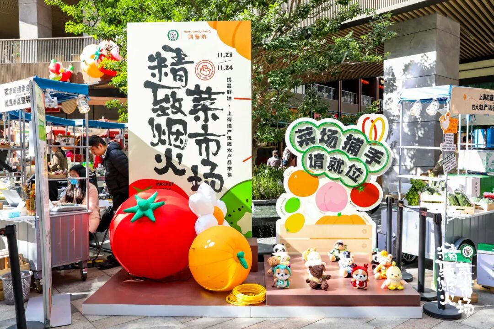

不得不夸夸，

这次活动无论是我司同事

还是参与的摊主们，

把氛围感和诚意都拉满！

每个摊位都有自己的陈列趣味👇

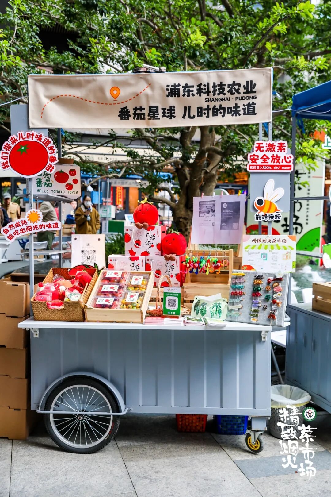

现场还准备了大量试吃试喝👇

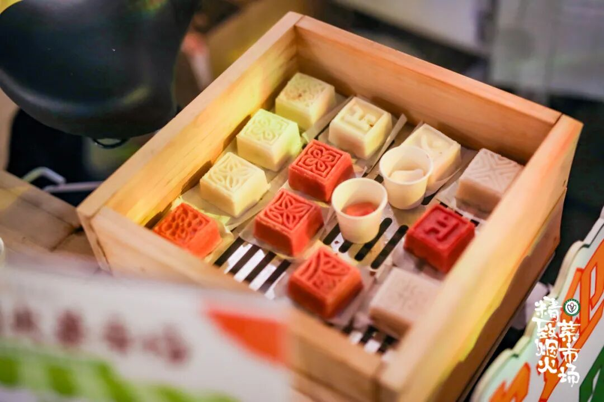

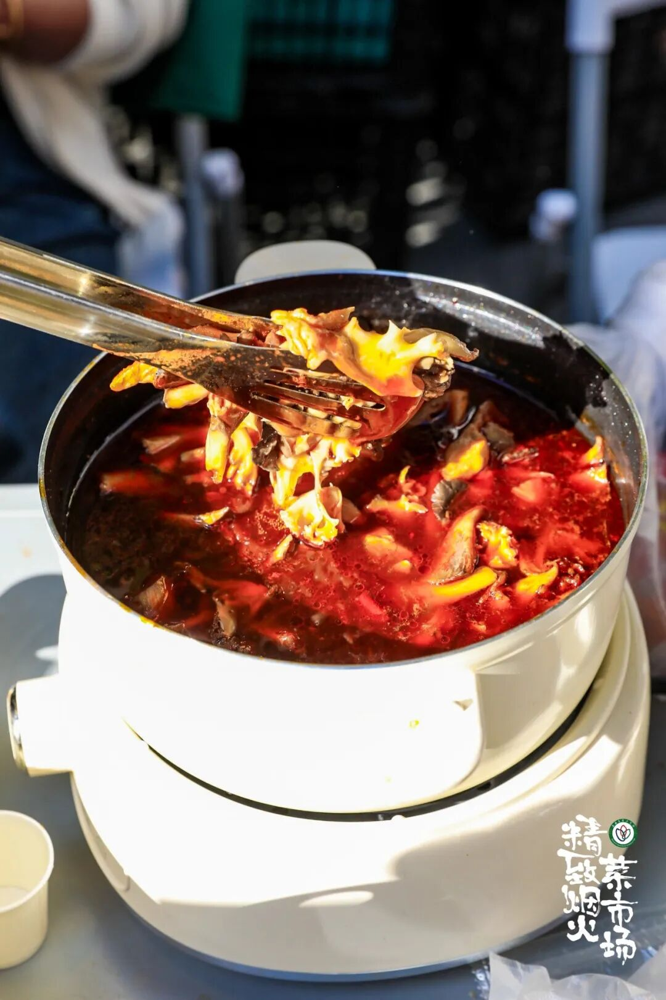

发小红书就给大家送鸡蛋👇

一周的早餐都有了！

或者当一回菜场捕手，
消费后和现场工作人员换取圈圈，套中了就可以兑换鸡蛋、腐乳等产品！

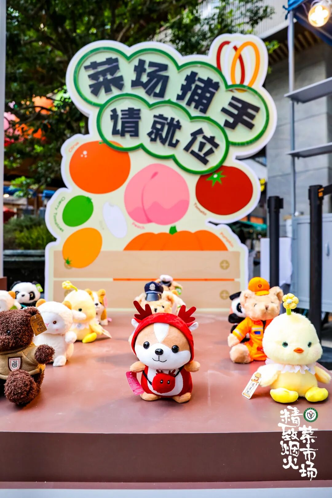

有吃有喝有玩有拿，现场还可以领取线下专属消费券！
当场兑换当场买！

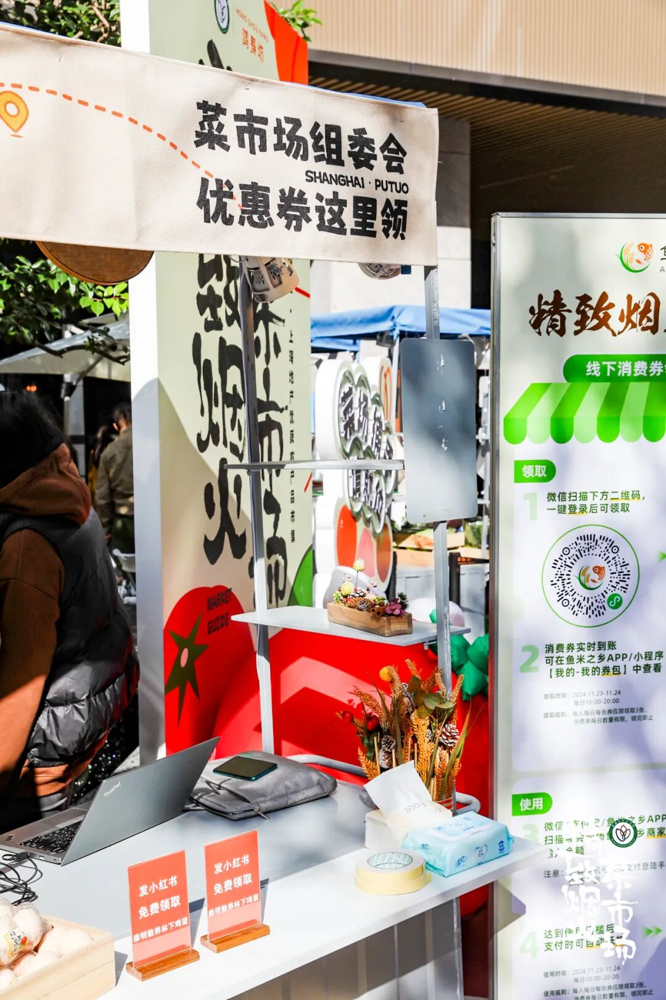

都是周边地区的好风味，一次性给大家找齐了！
比如曾获市长质量奖的松林猪肉，

上海第一个获得绿色食品 A 级认证的猪肉品牌，

据说是松江区 10 万多中小学生专用的猪肉，

老人小孩都放心吃！

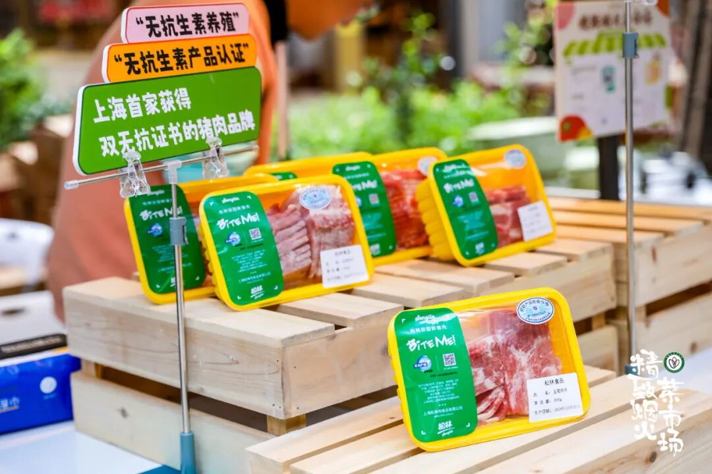

崇明白山羊，肉质鲜美多汁，油而不腻，肥而不膻，最适合红烧！撒上一把蒜叶，
啊～香晕～

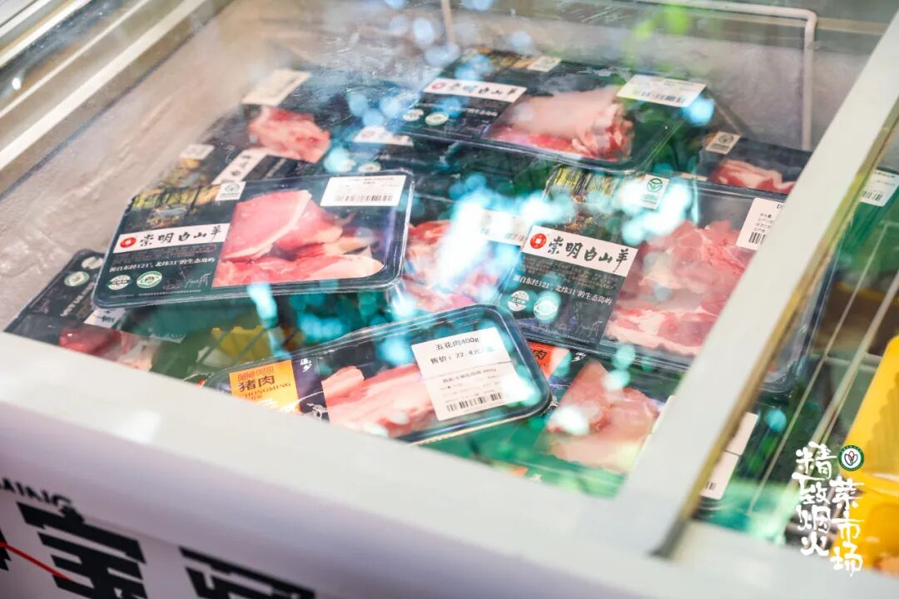

壳薄、腿长、鲜甜的

崇明清水大闸蟹也肥了！

青背白肚金爪黄毛，

肉质嫩，蟹膏肥，

香得不得了！

不仅是崇明特色农产品，

还入选全国名特优新农产品名录。

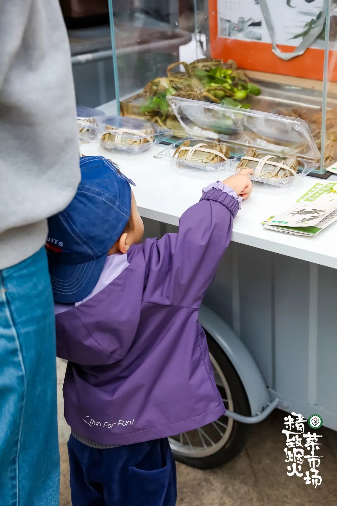

还有来自浦东的番茄星球，

就是小时候吃的那种番茄！

酸甜浓香有风味。

口感出众，饱满不空心，

无激素，所以吃起来更安全放心，

已入驻 Ole、city super 等精品超市。

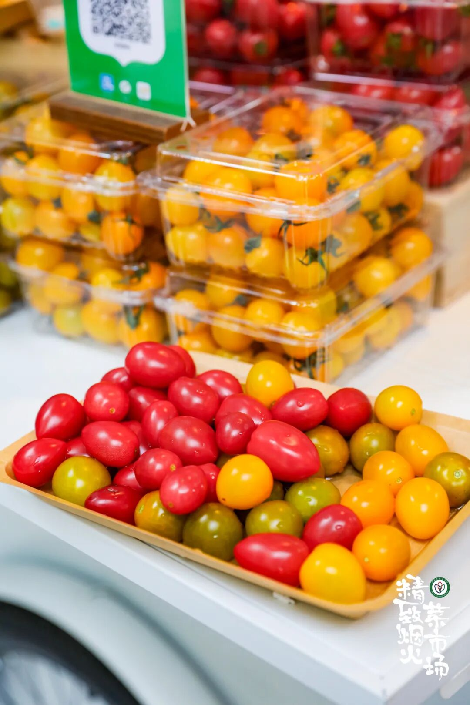

再到又鲜又脆的灰树花、绣球卷👇

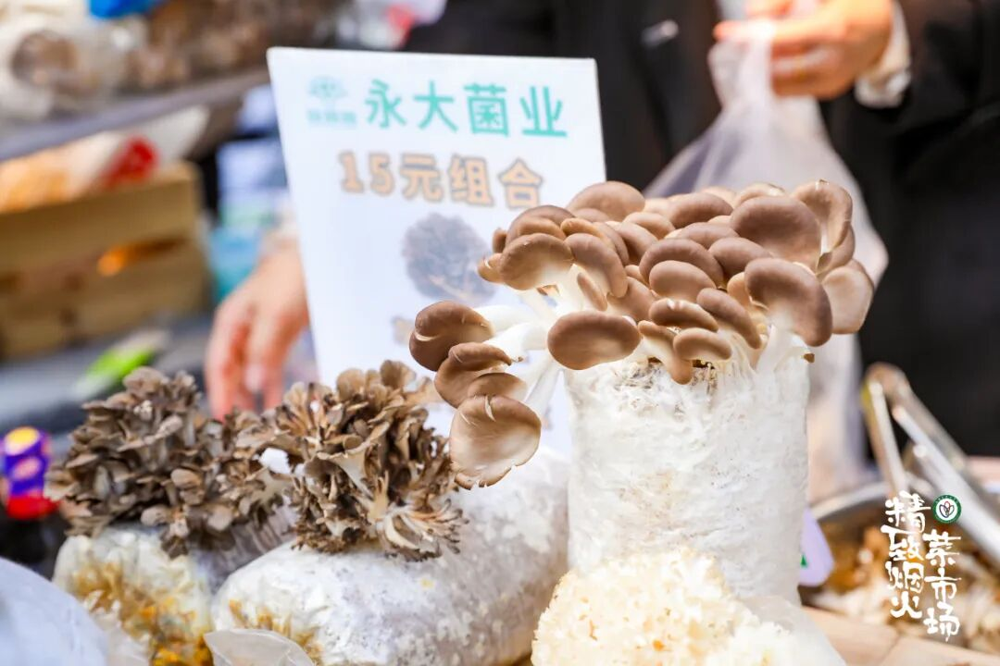

再到青浦的稻米和蔬果👇

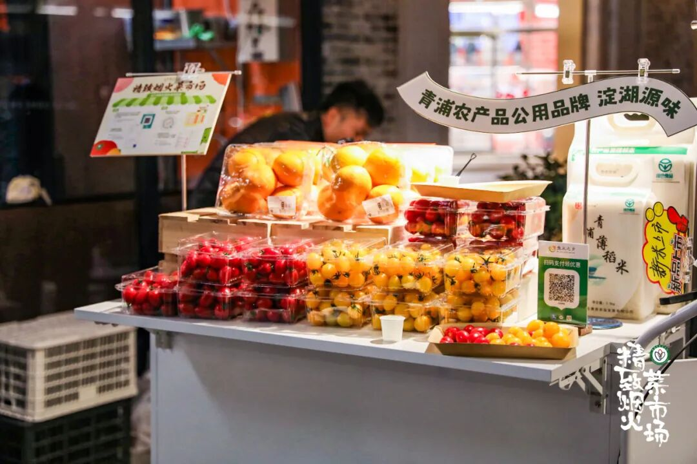

老上海都爱喝的地道酒酿👇

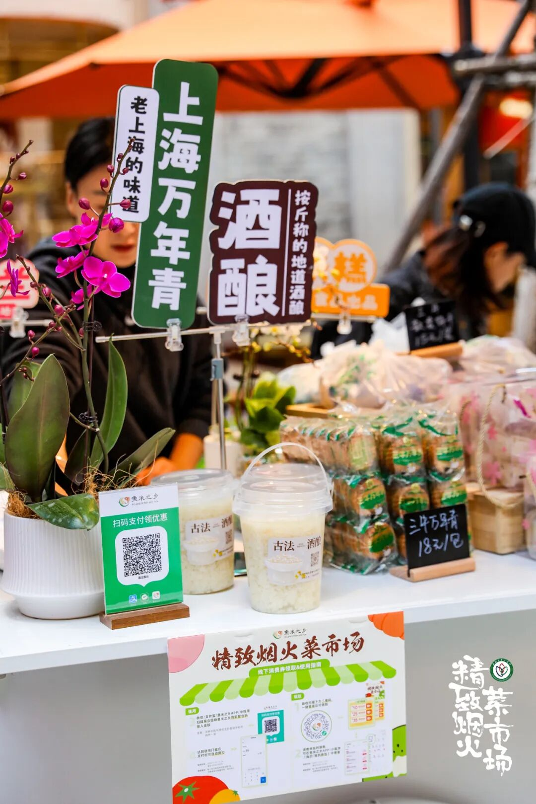

入口又糯又香甜的恋棠焋糕，配一瓶可以吨吨吨的柚子米酒👇

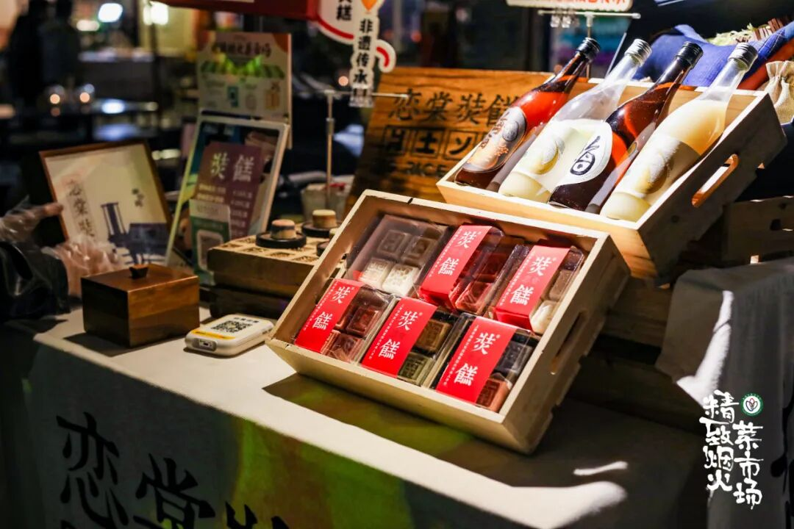

崇明林下散养的土鸡蛋👇

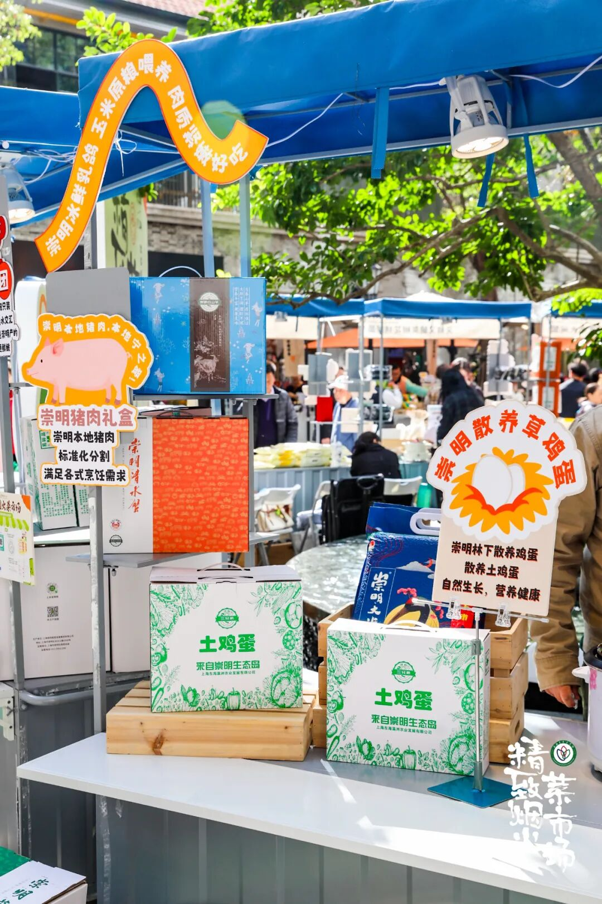

不用门票不用预约，轻松随意出门直接来！一直持续到今晚八点！
我们在线现场等你！冲！！

本文的研究员

薯角谢谢阳光

用好吃的方式吃一生

祖国各地好风物

文章转载请加微信「baojiclub」

