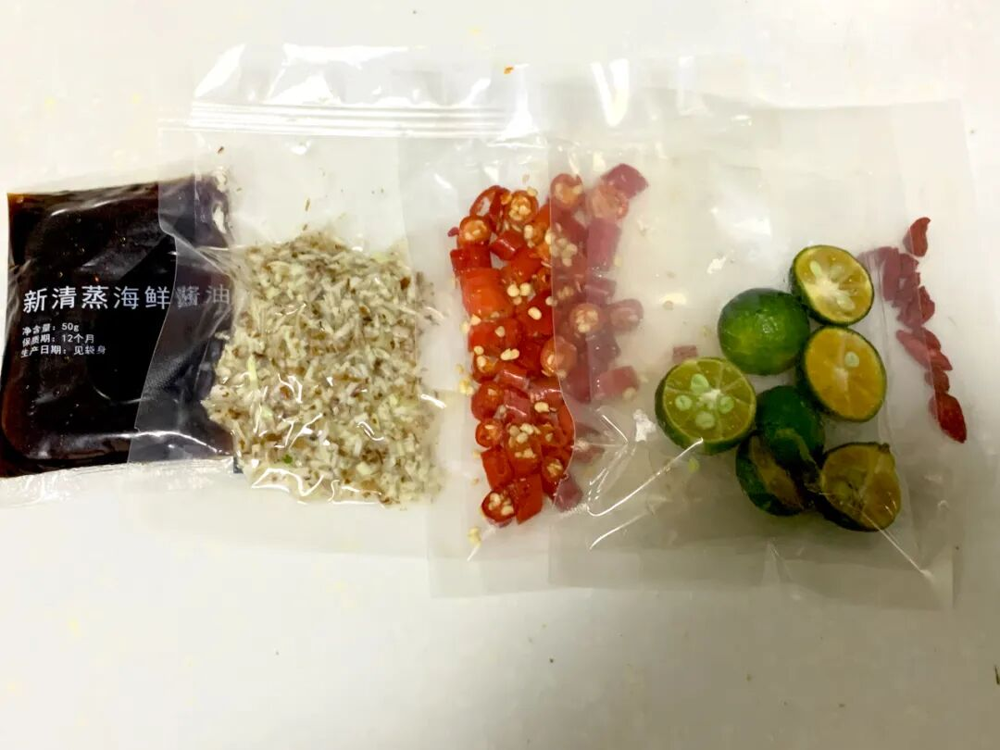
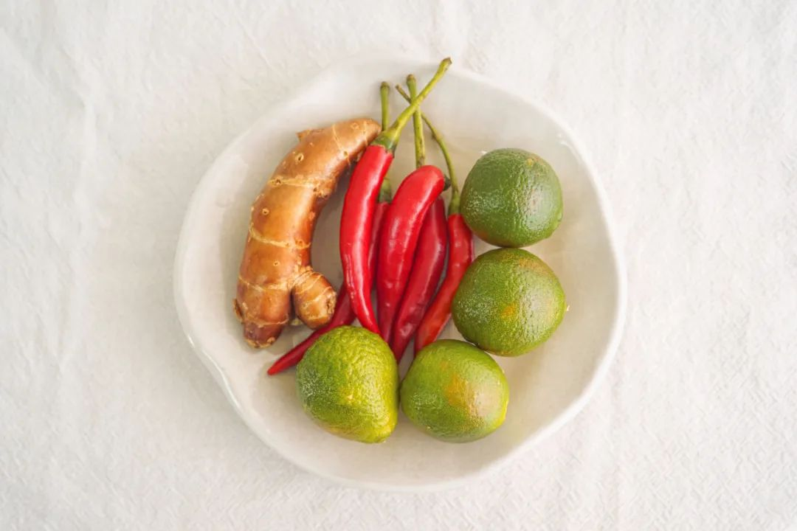
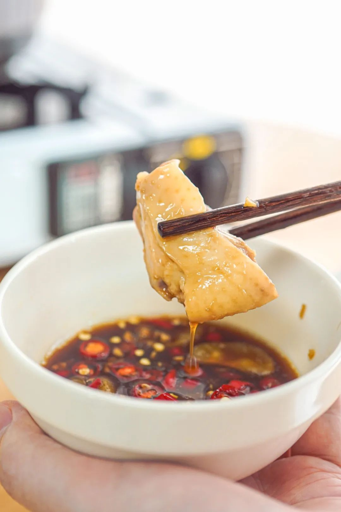
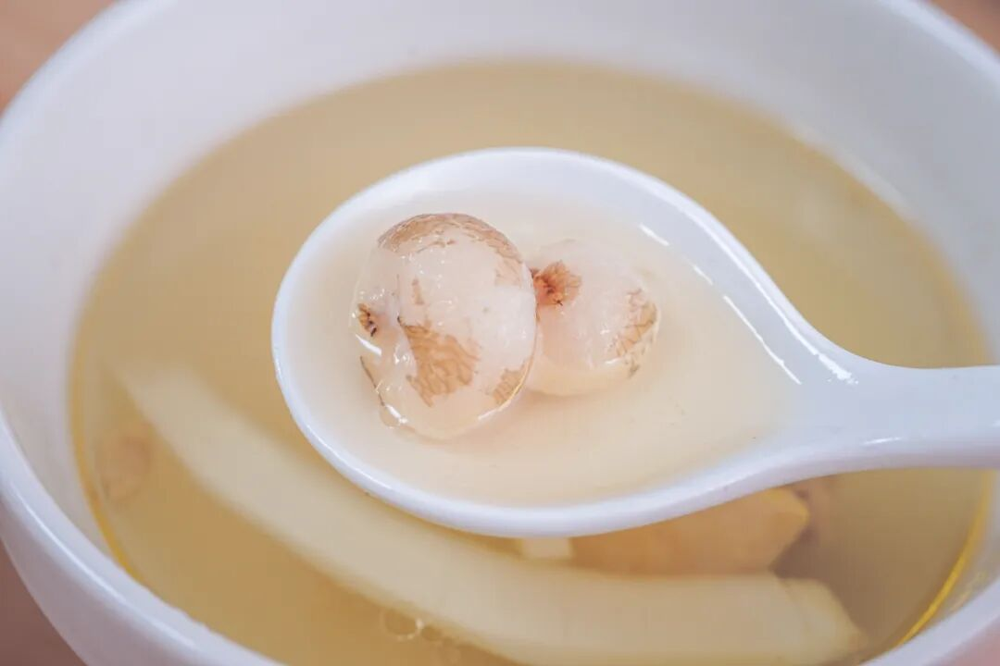
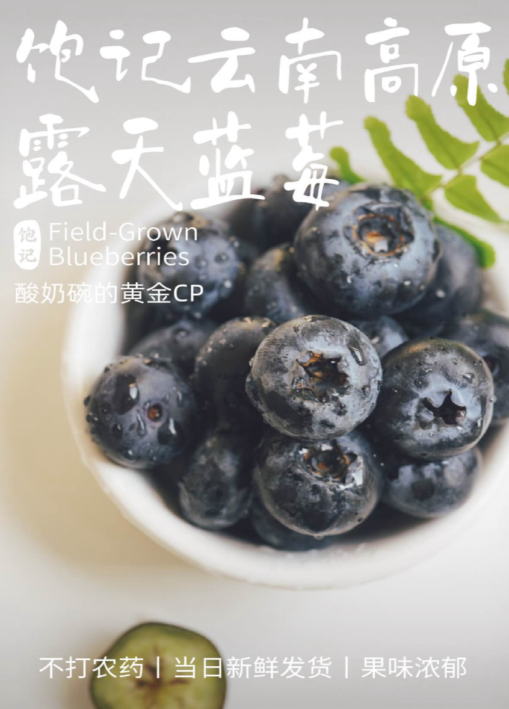

# 一个月仅开放一次，它它它终于回来了。。。

- 原文链接: https://mp.weixin.qq.com/s?__biz=MjM5NTYxODQyMA==&mid=2653467588&idx=1&sn=c961f5f39aefe6f348dbe88e13f00a4e&chksm=bc24922474bba4c68939b1e752c7eb673a3898f665605d9760ba9c59030a6c7e74ad3b9c672c&scene=27#wechat_redirect
- 浏览量: N/A
- 点赞数: N/A
- 评论数: N/A
- 转发数: N/A

## 正文

好久不见

一个尽情安利自我的公众号

以下是没事干研究院的风物研究报告请放心食用
嚯！转眼又是周五！（内心狂喜今天本薯分享好消息一则：它它它它回来了

数量有限，一个月仅开放一次！周末窝在家里就吃这个嘿嘿～

没错！就是这一锅——清甜得能连喝三五碗的饱记·海南椰子鸡！

此鸡作为我司不定期返场嘉宾，后台常有人问起，请看真情实感的好评👇

自己在家煮，比外面餐厅还要好吃👇

椰子鸡作为一种「天然去雕饰」的美食，要好吃无非看这三样：鸡新鲜吗？
椰子水清甜吗？调料正宗吗？

作为此鸡的铁粉，本薯曾将它与某马椰子鸡进行过一番比对！先说结论：赢得很全面！客官请往下看👇

先说某马，本薯特意下单了一份双人套餐，139 元，到手发现鸡只有 450g

倒是也吃得饱！只是感觉钱都花在了配菜上。（白菜、响铃卷、芋头、玉米什么的

最重要的是这鸡！
虽然也写的文昌鸡，但它是冰冻的。。。换句话说：不知道啥时候杀的，没那么新鲜。

这样的鸡有什么问题呢？就是煮出来像这样👇容易起沫，不够清亮，入口直接吃容易起腥气，
需要蘸调料盖一下。

而我饱记的鸡汤，
长这样嘿嘿👇泛着一层漂亮的油花～

毕竟这鸡，是产品同事在一个爱吃鸡的文昌大叔指导下，找到的本土正宗文昌鸡！

且给大家保证，

每一只都是活鸡现杀！

再送入 -38 度以下的冷库急速冷冻，

冻实后按顺序顺丰空运发出。

到手时还新鲜得不得了

文昌大叔扎根当地数十年，对小岛的鸡了如指掌，给产品同事推荐的这群，
外面的大路货根本比不了！这鸡生活在文昌的田野林间，

先是在外头散养上 100 天，

再关到笼子里养 20 天，

放养的时候增肌，

笼养的时候增肥。

（难道这就是传说中的脂包肌？

煮完后皮薄、肉嫩，

吃起来弹牙爽滑，有鲜美鸡味的同时没有腥气。直接空口吃，
也有淡香回甘的清甜味～

好的，

接下来到椰子水！

某马给到两个新鲜的椰青，

确实也是清甜的，

就是略重，且自己刮椰肉比较麻烦。

我司为了长途运输，

配的 100% 纯椰子水，

过滤好分装，直接冷冻保存，

开盖后很香很香很香～

白嫩嫩的椰子肉，给大家剥好了，在风味不减的同时，尽可能方便快捷

最后一步，调一个灵魂蘸料！某马的调料包长这样👇
看着很方便，但这一步其实省不得。。。尤其金桔和沙姜，切开后长时间放置，风味就有所减损！没有那股子扑面而来的清新劲儿～

所以我们给到大家的是需要自己切一下但超新鲜的版本👇

再给大家推荐一个地道调法！青金桔不切开挤汁，
而是剥开后整瓣丢进去！这样做妙在何处呢？就是减少了金桔直接的呛，又保留了果实带来的清新感～（谁发明的？快出来受本薯一拜！

配的酱油，同样大有来头！独家配方的减盐版本，
里面还混了沙姜汁哦～外面根本买不到！成本高，但更健康，且吃多了也不会有口渴感，一瓶体贴细心的好酱油！

好了，最后展示一下我饱记·海南椰子鸡
完整全家福👇

看！啥都给你备好了！

厨艺方面，0 难度！

准备好一口锅，四步就能完成。1.所有食材解冻沥干备用；2.倒椰子水，倒椰肉、马蹄煮开；3.倒鸡肉，煮 5-7 分钟即可食用啦～
4.调一个海南传统风味蘸料！

热腾腾、暖乎乎，清甜得能连喝三五碗～

还能吃到脆脆糯糯的珍珠马蹄，每一颗都清甜有滋味～

老规矩！为了保证新鲜，我司跟鸡场约定，给大家新鲜杀鸡发货！所以现在还是预售！
限时开放 5 天闪购！下一批预计 3 月 14 号能发，快，加入这个文昌吃鸡小队！

饱记·海南椰子鸡

限时早鸟 86 折！！！

限时闪购 5 天！

预计 3.14 发货

戳图买它👇

题 外

朋友们春天好啊！

没吃够的看这里👇早春糯唧唧顶流，上周刚上架的我饱记青团买了吗？

趁现在限时 85 折！

刚冒出来的临安天目山雷笋，

米其林餐厅师傅第三年回购，

不焯水就鲜甜！

现在也有限时 9 折！

刚好配真材实料的饱记腊肠，

限时地板价 8 折！

或者试试好吃不贵的

玫瑰露酒腊肉&腊排骨，

更是限时地板价 7 折！

回到童年的铁盒蛋卷，

产品经理卷出来的鸭舌、麻花、猪肉脯，

都给一个限时 7 折！！

还有些适合空调房吃吃的水果👇

昨天刚上的卷中卷红玉芒果，

抓住现在的限时早鸟 86 折！

口味浓甜的蒙自花长虹枇杷，

娇艳可人的雷州木瓜，

来自精品小果园的云南沃柑，

人称「水果冰淇淋」的凤梨释迦！

清新浓郁的万人迷上海金奖草莓👇

个头基本都在18mm+的云南露天蓝莓，

现在也有限时 9 折！

此外 90 天短保质期的大师凤梨酥，

也都有限时 9 折冲冲！

饱记·妈妈牌青团

现货中！

限时 85 折！！！

戳图或去🍑🍑🍑搜索

「艾格吃饱了」

下单购买👇

饱记·2025 临安天目山雷笋

购买方式如下

限时吃笋 9 折！！！

戳图购买👇

饱记·手工腊肠购买方式如下👇限时地板价 8 折！！！！
戳图下单购买👇或🍑🍑🍑搜索「艾格吃饱了」

饱记·玫瑰露酒腊肉&腊排骨购买方式如下👇限时地板价 7 折！！
戳图下单购买👇或🍑🍑🍑搜索「艾格吃饱了」

饱记·海南红玉芒果

购买方式如下

限时早鸟 86 折！！！

戳图购买👇

饱记·湛江雷州木瓜

购买方式如下

限时吃水果 9 折！！

戳图购买👇

饱记·蒙自花长虹枇杷购买方式如下限时吃水果 9 折！！！
戳图购买👇

饱记·云南晚熟沃柑购买方式如下限时吃水果 9 折！！！
戳图购买👇

饱记·凤梨释迦购买方式如下限时吃水果 9 折！！！
戳图购买👇

饱记·广西芭乐

双拼&奶油芭乐

限时吃水果 9 折！！

戳图购买👇

饱记·云南高原蓝莓限时吃水果 9 折！！！新年莓开眼笑！！！
戳图购买👇

饱记·红颜草莓限时吃水果 9 折！！！节日莓有烦恼！！
戳图购买👇

饱记·限定铁盒酥酥蛋卷

购买方式如下

限时 7 折！！！

戳图购买👇

饱记·年味零食7 折专区！！
购买方式如下
戳图购买👇

饱记·新鲜到货凤梨酥

限时 9 折！！！
戳图购买👇

本文的研究员

薯角啊！赞美春天！

用好吃的方式吃一生

祖国各地好风物

文章转载请加微信「baojiclub」

