# 一家小店，默默卖了八年

- 原文链接: https://mp.weixin.qq.com/s?__biz=MjM5NTYxODQyMA==&mid=2653461240&idx=1&sn=7bc56ac1ccce1032b12997752430eed5&chksm=bc066ca3bd61cf547440a2259462f562689b1eb67c229c41cb3cba60c8c409d077fffa27f4e4&scene=27#wechat_redirect
- 浏览量: N/A
- 点赞数: N/A
- 评论数: N/A
- 转发数: N/A

## 正文

蟹蟹您

一个尽情安利自我的公众号

以下是没事干研究院的风物研究报告请放心食用

常年蹲守包邮区，

在大闸蟹这一风物上，

我司有话要说！

为了搞蟹，

老板拎着同事各个产区不停比对，

默默整了八年之久，

一心想找那种只只都有品质保证的好螃蟹。

剥开后又鲜又甜，膏黄香气汹涌👇

就像这样👆

今年两个宝藏产区，

眼下都是最肥美的时候！

且不管平台什么活动，

我司小🍊序都给到一个地板价！

快@你那包邮区的朋友来看，

此时不薅，更待何时？

（薯角我只能帮到这了！

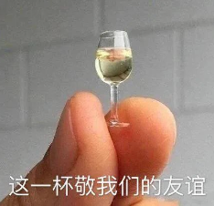

来自太湖流域的精挑大闸蟹！

村里书记不时就去帮咱们亲自视察，

给到大家品质保证。

「每一只都要挑选，确保万无一失」。

（书记原话👆

苏州吴江盛泽，

属历史悠久的太湖流域水面。

饱记指定 3000 亩湖面，

活溪入水，清水整湖放养。

这里的水深 2.5-2.8 米，平底锅型硬质湖底，

与阳澄湖底类型近似👇

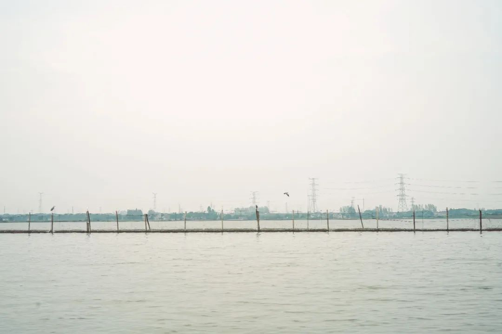

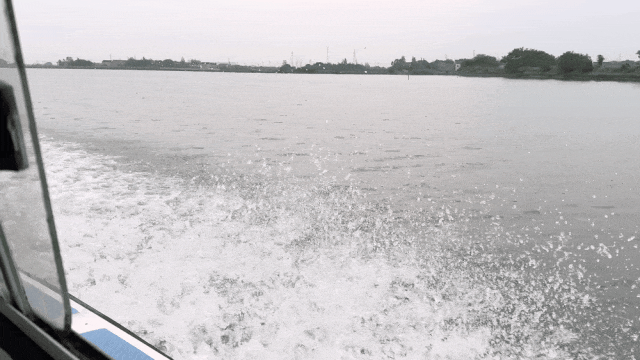

看👆这都是本薯为你包下的水面！

合作蟹农养了三十多年螃蟹，

经验丰富得很！

毕竟螃蟹要好，除了得天独厚的水质，

养殖技术也很关键。

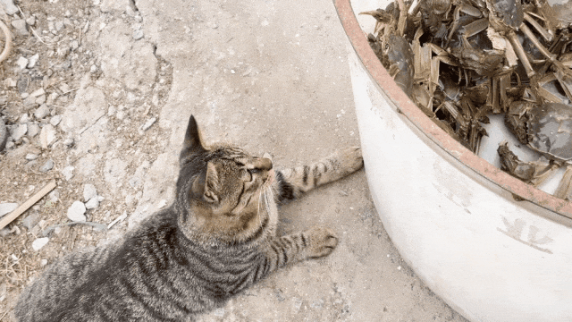

路边的小野猫也是馋上了

一是得吃好，

除了玉米、小鱼小虾，

这螃蟹居然还吃螺狮！

二是边上得种有水草，

方便螃蟹们蜕壳时躲藏。

长到秋天，个头饱满，

捞上来时还在不停吐泡泡👇

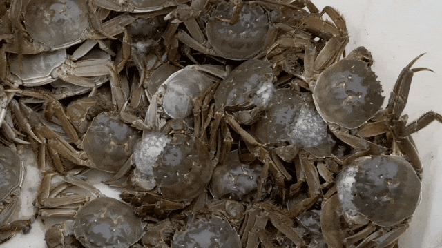

上岸的螃蟹，

每一只还要经 20 年经验挑蟹师傅

人工精筛两遍，

一看肚子，是不是已经微微透出黄色。

二捏蟹腿，蟹腿够硬，里面的肉才饱满鲜甜。

三掀盖看，看尾部是否已经被蟹黄填满。

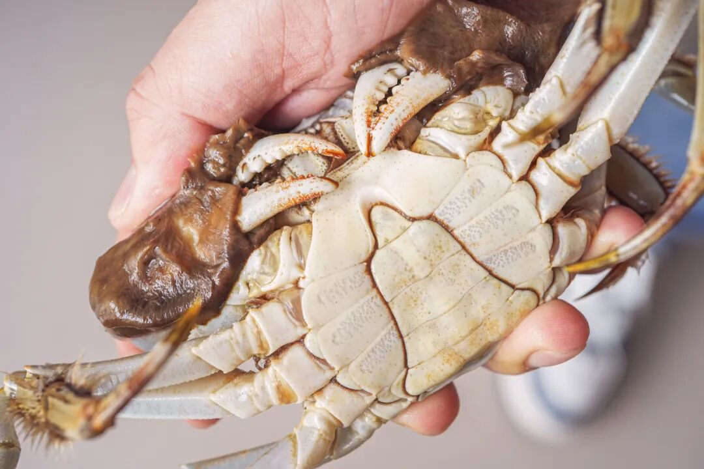

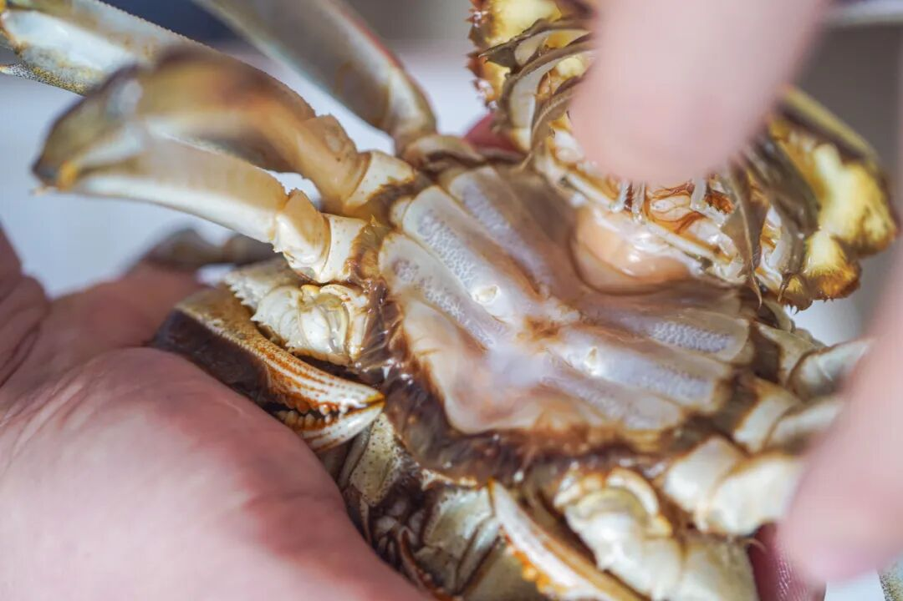

掀开时讲究经验技巧，掀少了看不清，掀多了螃蟹容易死。

这过程费时费力，

完全没法儿用机器协助，

只能人工一只只慢慢看。

确保每一只都腴美非常，

才能发货给到大家！

（像这样👇

母蟹的蟹黄金灿，

入口鲜美干香。

有点儿类似蛋黄的口感👇

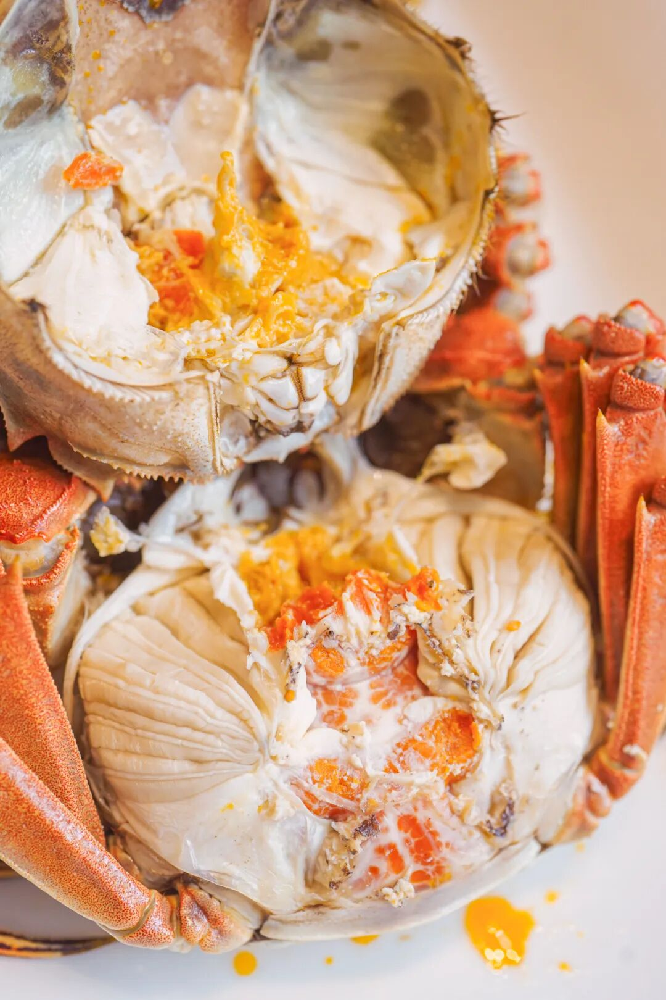

公蟹肉更多！

肉质甜嫩，

入口蟹膏糯而弹👇

蟹腿也是只只饱满，

软弹鲜甜！

啊～幸福到要晕倒！

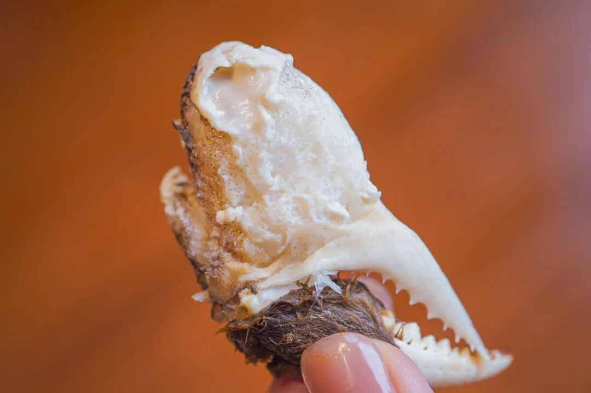

比起其他产区，

这蟹是阳澄湖、太湖蟹口味流派，

蟹肉微微带甜，

一股子清新的蟹腥气久久不散，

吃完后指尖闻得到！

（不过别担心，当地人教我们用牙膏洗一洗即可！

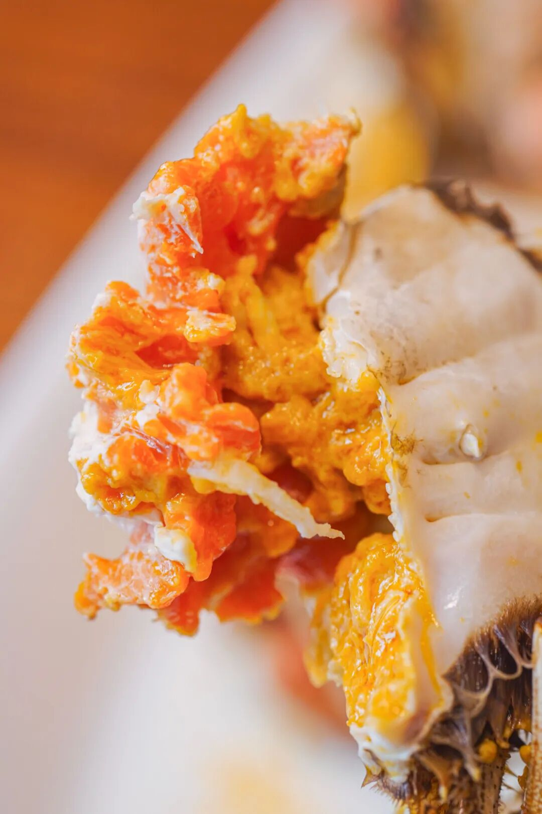

每箱 8 只，产地顺丰发货，

新鲜看得见～

运费都是实收，

给大家谈来了运费 9.2 折，

比自己叫划算些！

好了，

剩下的你们去看商详吧～

只只都是按去绳净重、足斤足两发货。

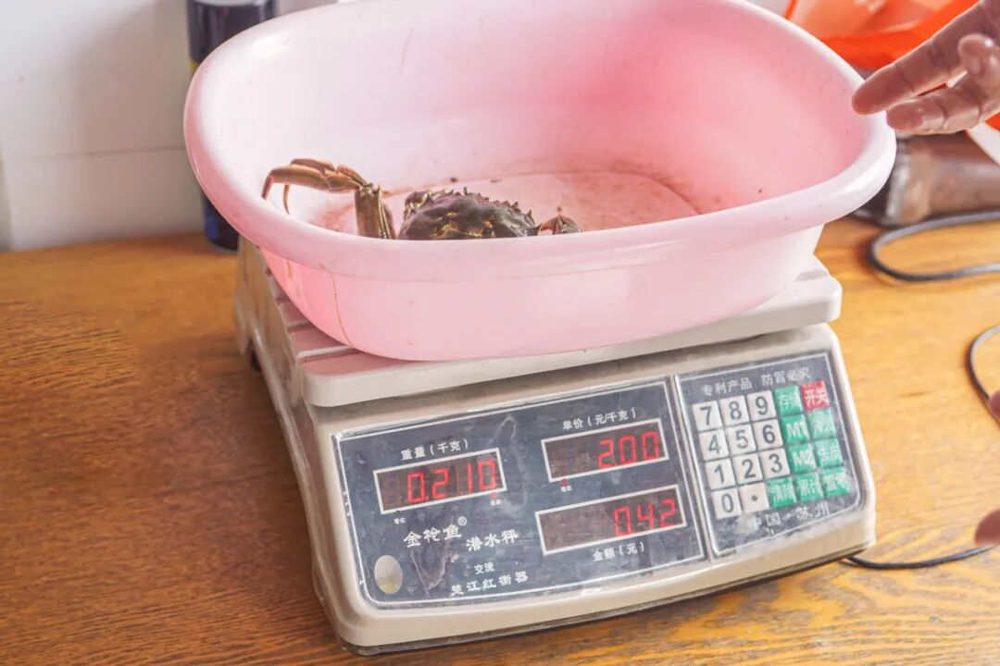

每日限量 50 箱。

拼的就是手速。

三个规格，

送礼自吃都有得选，

要的的就是排面～

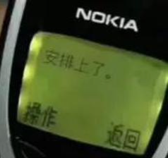

饱记·太湖流域大闸蟹

购买方式如下

双十一同价限时 86 折

三个规格：

满足装，

3-3.4 两母蟹，4-4.4 两公蟹，

吃过解馋。

劲爽装，

3.5-3.9 两母蟹，4.5-4.9 两公蟹，

可以拍照发朋友圈争奇斗艳。

尊享装，

4-4.4 两母蟹，5-5.4 两公蟹，

顶格水准，适合送礼。

人工精挑，

上岸后静养一两日更鲜美，

每日限量 50 箱。

拼的就是手速。

顺丰快递发货，

新鲜看得见。

戳图下单购买👇或🍑🍑🍑搜索「艾格吃饱了」

同样成熟了的，

还有宝藏小产区性价比之选！

淮安洪泽湖大闸蟹，

已经是口碑第七年啦！一贯的饱记标准，酒店级品质，20年挑蟹佬精选。

总结来说，就是好吃，不贵，猛吃不心疼！（保价双11，买贵退差

饱记·洪泽湖大闸蟹

购买方式如下

双十一同价限时 86 折

满足装洪泽湖大闸蟹：

3 两母蟹，4 两公蟹。

性价比之选！

劲爽装洪泽湖大闸蟹：

3.5 两母蟹，4.5 两公蟹。

饱记热销款。

尊享装洪泽湖大闸蟹：

4 两母蟹，5 两公蟹；

或 5 两母蟹，6 两公蟹。

实际超重，量极极极少，送礼佳品。

人工精挑，

上岸后静养一两日更鲜美，

每日限量 100 箱。

顺丰快递发货，新鲜看得见。

戳图下单购买👇或🍑🍑🍑搜索「艾格吃饱了」

还想再薅点，

可以来一只外面买不到的鸡！

每次一出现就断货。

天气热的时候只能发包邮区，

这次顺丰次日达能到的地方都给发，

且老板因双十一打来

全年最低地板价 65 折！

此鸡来头颇大，

有兴趣煲鸡汤的朋友戳👇复习。

什么鸡这么好吃？还要我亲自抢！！

这一批的母鸡、老公鸡已经卖光，

现在只剩下：

6 月龄公鸡：

肉更多油更少，鸡汤超清甜！

饱记·云南稀有品种瓢鸡

购买方式如下

双十一同价 65 折！！

一种规格，最后一点点：6 月龄母鸡净重 2.5 斤以上。

下单前请注意：此鸡蛋白质含量丰富，宰杀时已尽量放血，但少量余血开包时气味仍会比较大，请冲洗再食用！鸡皮不发粘，就绝非变质～～～
戳图下单购买👇或🍑🍑🍑搜索「艾格吃饱了」

题 外

双十一这个机制那个凑单，

一点开眼花缭乱，

薯角我搞不懂一点。。。

摆烂走起！

随便平台怎么整，

反正我司躺平开卖的好风物就那些！

现在通通给一个地板价！

直接戳图片即可购买！

不管怎么算，

总之现在买就是最划算！

卷里卷气的我司腊肠，

现在都是现货！打遍天下无敌手的山核桃，
都是今年刚炒的新货～

数量有限，先到先得！

还有一场我司为人气云南餐厅浩海火烧云设计承办的

的「香料花园」活动！

详情可戳👇

上海秋天最幸福的街区，来逛来玩！！！

在上海市中心的芮欧百货一楼的

风之溪谷区域（静安公园隔壁）。

来玩来见面！

饱记·手工腊肠

购买方式如下👇

双十一同价 9 折！！

三款口味，各有各的特点。

用的黑猪肉、天然肠衣、玫瑰露酒...

酒香腊肠，酒香浓郁，

有四六和二八这两个肥瘦比例可选。

滇式腊肠用了不少贵价的辛香料，

同事说超适合拿来做西班牙海鲜饭，

试过加辣肠后升华了。

戳图下单购买👇

或🍑🍑🍑搜索

「艾格吃饱了」

饱记·临安山核桃

双十一同价

单罐限时 9 折！

双罐限时 8.3 折！

戳图买它👇

或到🍑🍑🍑

搜索「艾格吃饱了」

香料花园·超值门票

购买方式如下👇

戳图买它👇

本文的研究员

薯角你好啊海绵宝宝

用好吃的方式吃一生

祖国各地好风物

文章转载请加微信「baojiclub」

