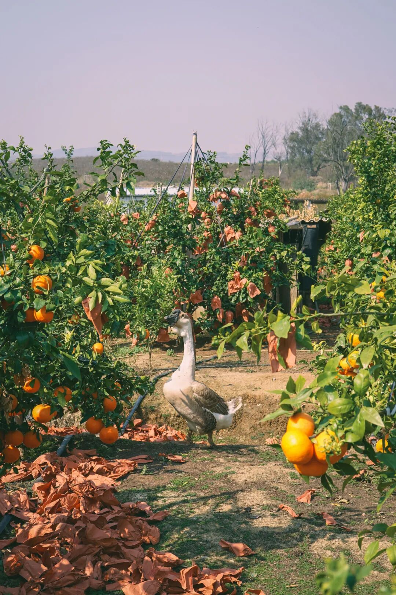
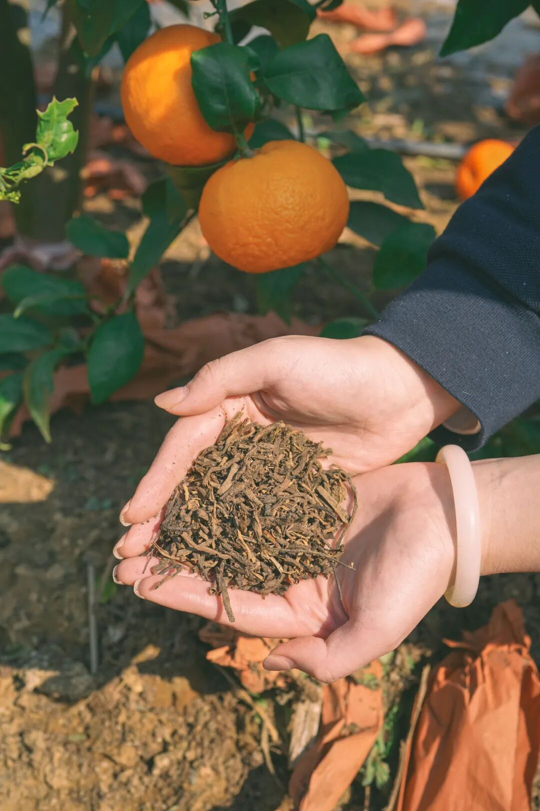
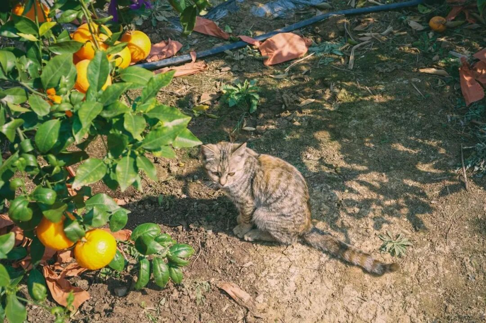

# 一家理想小果园，拿中药材去种甜甜水果

- 原文链接: https://mp.weixin.qq.com/s?__biz=MjM5NTYxODQyMA==&mid=2653467092&idx=2&sn=5bb958891585d10308d0a8bf28ee7811&chksm=bc4e2d2afb204893eb8b3c5f4b298723dfa394eba90ac6ba75a96a703a245b0a8071b99a89f7&scene=27#wechat_redirect
- 浏览量: N/A
- 点赞数: N/A
- 评论数: N/A
- 转发数: N/A

## 正文

多新鲜呐！

一个尽情安利自我的公众号

以下是没事干研究院的风物研究报告请放心食用
众所周知！我司生鲜水果一向卷到飞起！要知道，老板曾自己跑了五六十个小果园，果园主往往是某种种植技术一把手！

在精品小果园里，他们可以把果树修剪成盆景，让每一个枝条上的果子都晒足阳光；可以用苗家家传的土壤改良方法，在树根埋当地中药材……这样的果园，可能一年仅一季，一季仅千箱，但我们会包掉品质上好的数百箱，试下来，无论是农夫还是顾客，都非常开心！

比如今天要给大家分享的

巨好吃巨浓甜的云南沃柑！

鲜甜，爆汁，

浓浓的橘子味儿。

老板也吃了，当场表示：

开心，红美人有后了！

沃柑主产地在广西，

但是要我说，

云南种出来绝对不输！！！

得天独厚肥沃的红土地，

以及充足毒辣的阳光，

大家都知道，农作物靠天吃饭吧，

阳光强烈的地方，

长出来的果子才好吃。

不仅如此，

我们选用的还是沃柑里面的晚熟品种，

什么意思呢？

就是从结果到成熟，在树时间更长，

给它晒足晒透！果子自然更浓甜！

更让本薯震惊的是，

云南人也真的是有一些自己的种植技术

在身上的！

我们合作的果农来自苗族，

为了让果子更好吃，

他们甚至把中药药材都用上了！

图中这些有黄馑，重楼，白芨等中药药材，铺在树的根部。

我问这是什么原理？

果农大哥神秘一笑，我们自己研究的！

：）

哦懂了，秘方是吧。

中药啥的本薯不懂，

(猜测主要还是起保湿透气作用。。

总之这沃柑就是好吃，汁水巨多，

口感浓甜，还不是那种死甜，

九分甜中带一丝丝酸，

口感层次非常丰富。

果园里随意地养着鸡鸭鹅，

用来吃虫吃草，

这样就不用再人工化肥除草。

肥料也是用的当地的羊粪发酵肥，

比人工化肥丰富，土壤还不会板结，

果子根系吸收的营养更多，

还不会毁地。

这都是祖祖辈辈传下来的智慧啊。

环保，绿色，生态，健康，

既长出了好吃的果子，

还不伤害土地。

之前跟果农大哥还学到过，

表面发亮的沃柑，

其实是泡过保鲜剂的，

新鲜的沃柑表面应该是哑光的。

我一惊，

平时在超市里卖的不都是锃光发亮的吗？

像这样，图片来源@小红书用户小玲珑

所以这里再强调一下，

我饱记的沃柑，

除了种植过程绿色环保，

也都是现摘现发的新鲜果，

这种精品小果园

精心呵护的好东西。

不说外面绝对买不到吧，

但也是很难买到的品质了。

你们去买啊！

限时吃水果 9 折！！

饱记·云南晚熟沃柑

购买方式如下

限时吃水果 9 折！！！

戳图购买👇

题 外

没吃够的朋友看这里👇

月底就下架的富平柿饼，

再见就是下一个冬天！

尾声限时 85 折！

上周刚冒出来的临安天目山雷笋，

米其林餐厅师傅第三年回购，

不焯水就鲜甜！

现在也有限时 9 折！

刚好配真材实料的饱记腊肠，

限时地板价 8 折！

或者试试好吃不贵的

玫瑰露酒腊肉&腊排骨，

更是限时地板价 7 折！

还有上周刚到的

人称「水果冰淇淋」的凤梨释迦！

限时早鸟 86 折！

回到童年的铁盒蛋卷，

产品经理卷出来的鸭舌、麻花、猪肉脯，

都给一个限时 7 折！！

还有些适合空调房吃吃的水果👇

风味很浓的蒙自花长虹枇杷，

清新浓郁的万人迷上海金奖草莓👇

个头基本都在18mm+的云南露天蓝莓，

微甜饱腹、没啥热量的广西双拼芭乐，

现在也有限时 9 折！

此外 90 天短保质期的大师凤梨酥，

也都有限时 9 折冲冲！

饱记·富平柿饼购买方式如下尾声限时 85 折！！！
戳图购买👇

饱记·2025 临安天目山雷笋

购买方式如下

限时 9 折！！！

戳图购买👇

饱记·手工腊肠购买方式如下👇限时地板价 8 折！！！！
戳图下单购买👇或🍑🍑🍑搜索「艾格吃饱了」

饱记·玫瑰露酒腊肉&腊排骨购买方式如下👇限时地板价 7 折！！
戳图下单购买👇或🍑🍑🍑搜索「艾格吃饱了」

饱记·蒙自花长虹枇杷购买方式如下限时吃水果 9 折！！！
戳图购买👇

饱记·凤梨释迦购买方式如下限时早鸟 86 折！！！
戳图购买👇

饱记·限定铁盒酥酥蛋卷

购买方式如下

限时开门红 7 折！！！

戳图购买👇

饱记·年味零食7 折专区！！
购买方式如下
戳图购买👇

饱记·云南高原蓝莓限时吃水果 9 折！！！新年莓开眼笑！！！
戳图购买👇

饱记·广西双拼芭乐

限时吃水果 9 折！！

新年健康快乐！！！
戳图购买👇

饱记·红颜草莓限时吃水果 9 折！！！节日莓有烦恼！！
戳图购买👇

饱记·新鲜到货凤梨酥

限时 9 折！！！
戳图购买👇

本文的研究员

薯角啊！赞美春天！

用好吃的方式吃一生

祖国各地好风物

文章转载请加微信「baojiclub」

