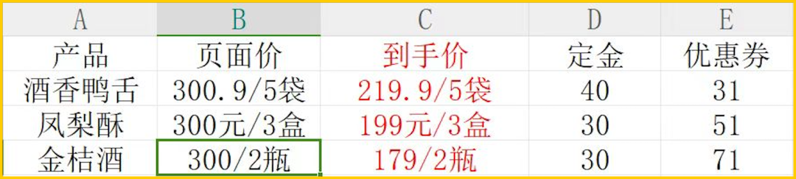
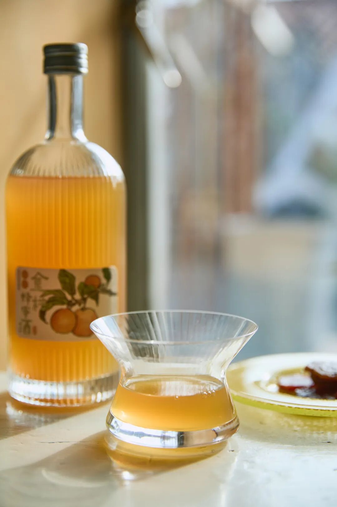
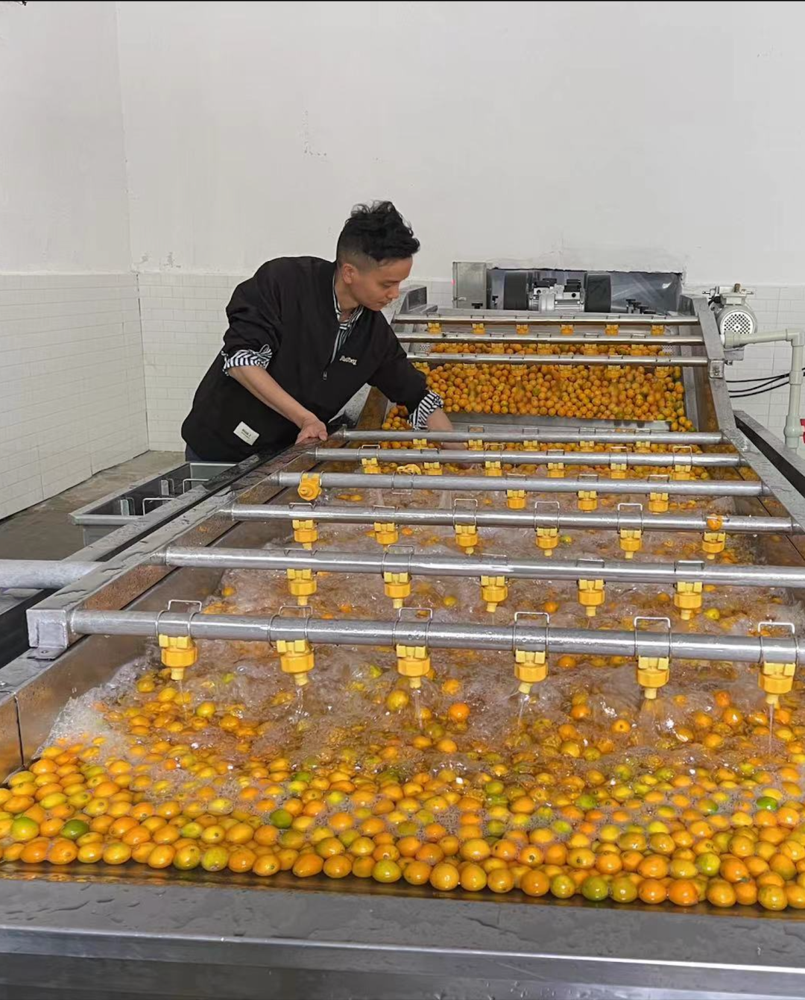
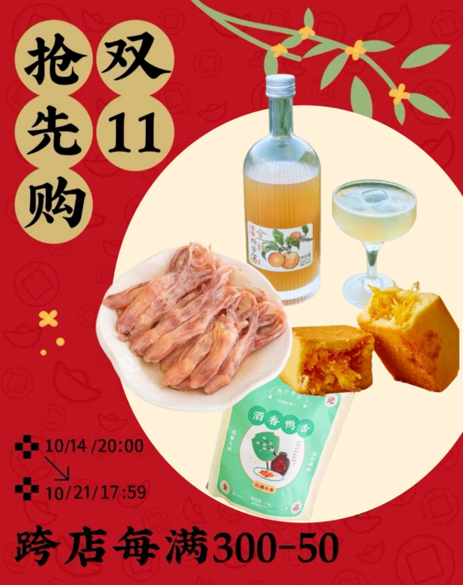
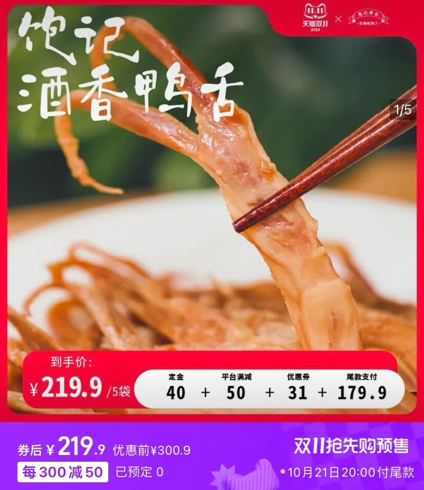
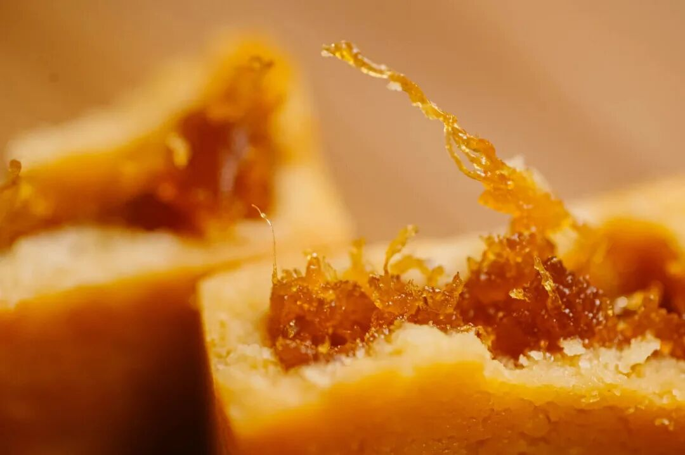

# 一斤金桔一斤酒，打工人越喝越有

- 原文链接: https://mp.weixin.qq.com/s?__biz=MjM5NTYxODQyMA==&mid=2653460389&idx=1&sn=3793b781c5ceee20b2043135572832f4&chksm=bc9c911f7bacc5af1118be94e68c99bfdbf695283064584fed042197e04d2ce75eb8cf5d40e9&scene=27#wechat_redirect
- 浏览量: N/A
- 点赞数: N/A
- 评论数: N/A
- 转发数: N/A

## 正文

三千斤换三千瓶

一个尽情安利自我的公众号

以下是没事干研究院的风物研究报告请放心食用

又一年双十一，

（不知道的现在也知道了🤷

薯角我人狠话不多，

直接地板价走起！

今年的 KPI 就是把这公司搬空！

从现在到下周，

双十一进入定金预售阶段，21 号尾款结算每满 300-50帮大家算过了，现在定金下单，肯定最便宜！都是地板价！

但不管什么机制，

我司运营同事表格直接看！

优惠得明明白白👇

来，先说这瓶金桔蜂蜜酒，

同事跑了多趟广西和四川才整出来，

一斤融安金桔才能换来一瓶酒，

真材实料，

外面根本买不到（叉腰

广西的融安滑皮金桔，

果脆、芯甜、籽少，

基本无辛辣味！

单颗糖度就能达 15 左右，

特别适合酿酒。

我司自采了 3000 斤，

再拉到四川酒厂去～

产品同事解释道，

四川酒厂常年温度保持在 20-25℃，

这条件，

尤其适宜酒体陈酿和香味成型。

他们还用上了传统葡萄酒酿法！

先将金桔浸皮萃取，

让果皮、果粒在发酵阶段提供风味。

相当于去掉了近一半重量来酿，

（所以配料表里金桔含量只有 50%

最终 3000 斤的金桔，

只换来了 3000 瓶的酒。

行吧，

难怪你这么好喝！

倒出来直接喝，有浓郁的柑桔香气，入口顺滑，回味悠长，唇齿间留有微辛。

绕在鼻尖的蜂蜜香气，来自四川本土产蜂蜜，甜而不腻。

老规矩，最后卷了一下包装，设计了定制束口袋，送礼自留皆适宜，酒喝完了收杂物也没问题！

这酒日常价 118 一瓶，

现在双十一第一波付定金，

200 就能拿下两瓶！

初秋小酌囤点！

饱记·金桔蜂蜜酒

购买方式如下

地板价 179/2瓶

尾款结算满 300-50

复制淘口令下单购买👇58🗝233U3l9dq2U🗝

双十一定金预售
现在开启

抢先购定金预售第一波，

本薯薅着运营同事，

给到销冠三样的

全年最低价，

有喝有吃！

（比早鸟价还要再便宜！！

酒香鸭舌，

包邮区糟卤口味！

灵感来自《红楼梦》里宝玉喜爱的下酒小菜～

秋冬里配杯小酒，

超惬意！

专门盯着南京的厂找，

因为全世界他们最懂鸭子。

最后定的是一家老师傅开的厂，

厂里有一锅 30 多年的老卤！

这个就叫家底儿～

日常价 49.9 才得一袋！

这次直接上五袋装，200 出头，

放零食柜里随时吃！

饱记·酒香鸭舌

购买方式如下

地板价 219.9/5袋

尾款结算满 300-50

复制淘口令下单购买👇29£BUaJ3l9X3tJ₴

这款好评如流水的大师凤梨酥！最新一批 9 月到货，用料实在，
所以只有 90 天短保质期哦。

用的是台湾凤梨酥盲品大赛冠军配方，
选的都是新鲜土凤梨馅，
果肉含量大于 40%！
你一入口就能吃到浓浓的凤梨本味。

日常价是 82.8 一盒，这次立省快 50 元，
再等尾款凑满减，超划算！

饱记·大师凤梨酥

购买方式如下

地板价 199/3盒

尾款结算满 300-50

复制淘口令下单购买👇18🗝Gi2y3l9W1jG₴

一年仅此一次，

地板价走起！

现在买了尝尝不亏，

喜欢下个月再续上啊！

题 外

懒得打开淘宝的，本薯也给你准备好了！今年新炒的山核桃，

直戳下方图片就有限时 9 折！！

还有上周新来的

丑苹果和库尔勒香梨，

来自云南的蒙自西北勒小苹果，
甜中带有酸度，果味极其浓郁，甚至还有溏心！喝天山雪水长大的新疆库尔勒香梨，又甜又润，嫩得连皮也能吃！

都薅来一个限时 9 折！！

下单后不用等！快冲！

饱记·临安山核桃购买方式如下👇限时 9 折！！
戳图买它👇或到🍑🍑🍑搜索「艾格吃饱了」

饱记·西北勒小苹果购买方式如下限时 9 折！！
戳图买它！！👇
或到🍑🍑🍑搜索「艾格吃饱了」

饱记·新疆库尔勒香梨
购买方式如下限时 9 折！！
戳图买它！！👇
或到🍑🍑🍑搜索「艾格吃饱了」

本文的研究员

薯角秋天该很好

用好吃的方式吃一生

祖国各地好风物

文章转载请加微信「baojiclub」

