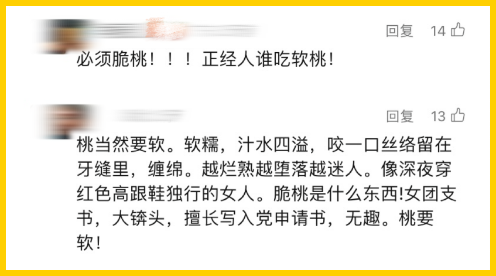
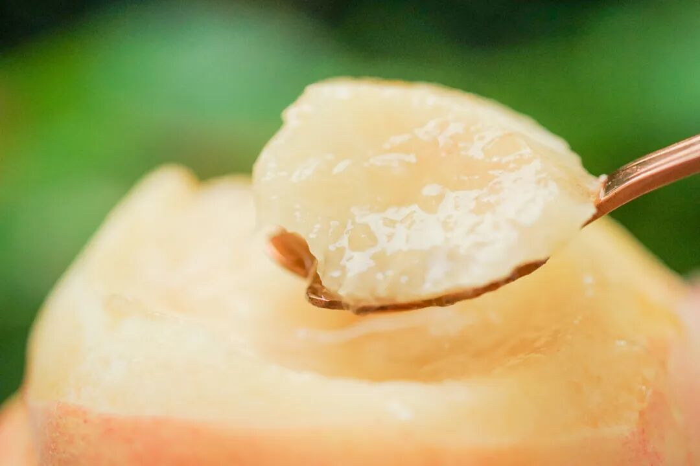
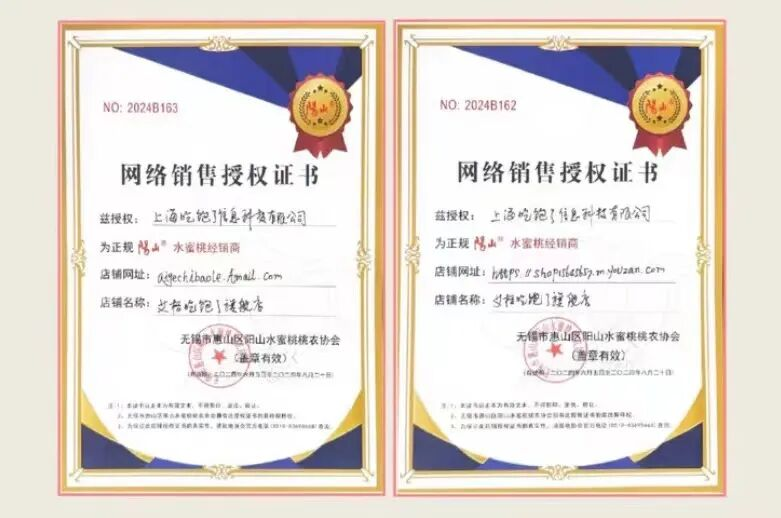
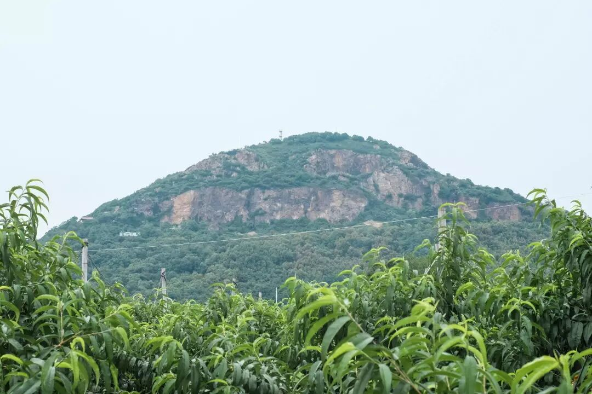
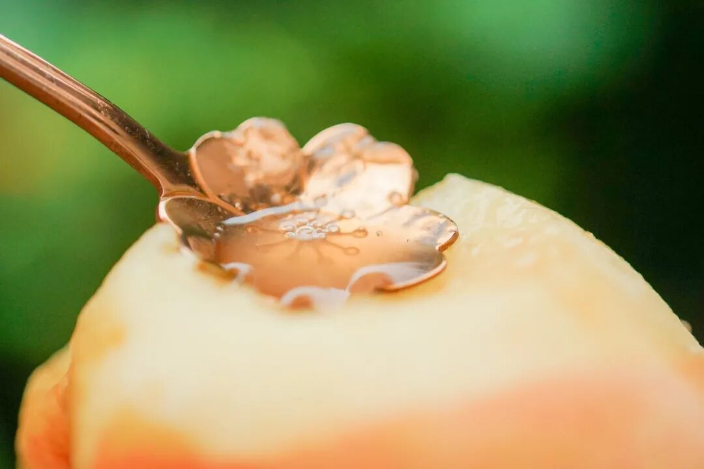
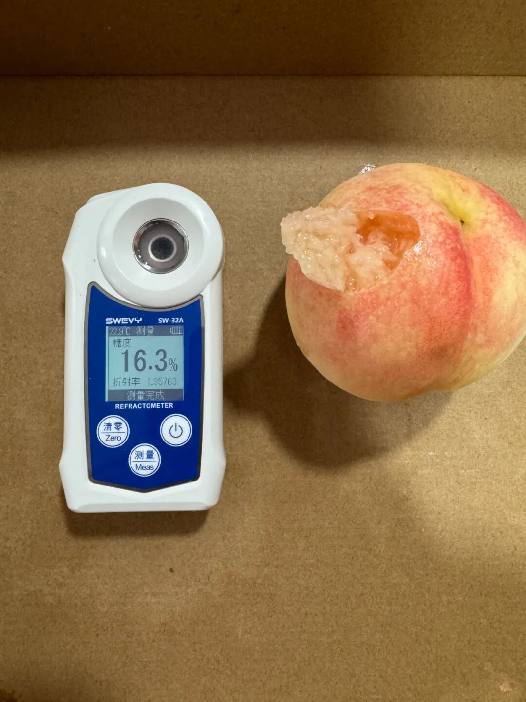
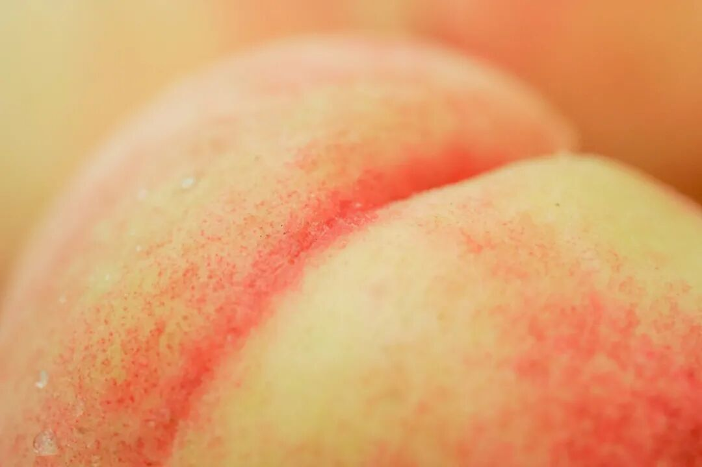
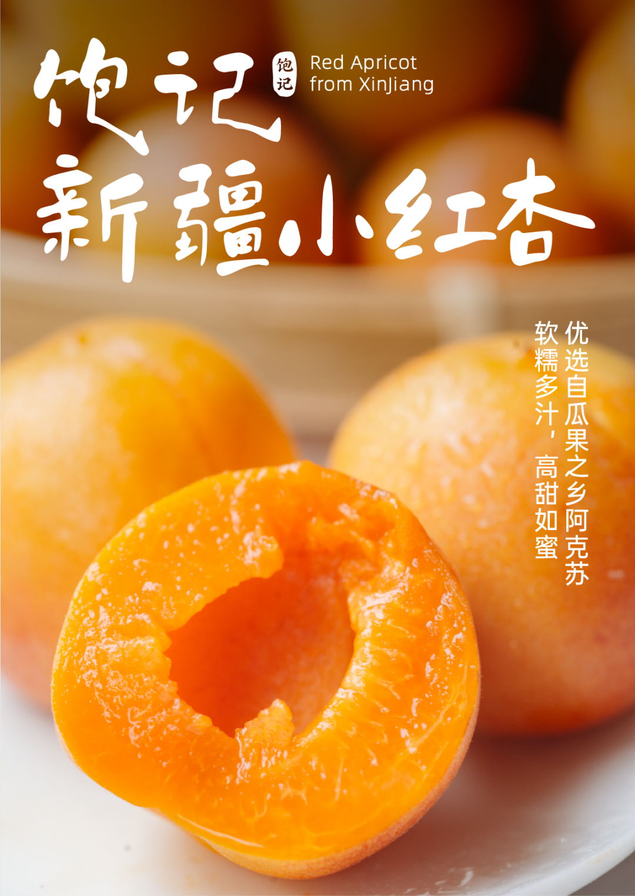

# 一旦吃过阳山湖景，你这辈子就定型了

- 原文链接: https://mp.weixin.qq.com/s?__biz=MjM5NTYxODQyMA==&mid=2653456297&idx=1&sn=e6f25d6964afef406cdfa2f391a4c137&chksm=bcd317571dca80d7023d9cc25549daeb0a50fcc4377cfa43dbe6e2b75b5346fcf298b7b13913&scene=27#wechat_redirect
- 浏览量: N/A
- 点赞数: N/A
- 评论数: N/A
- 转发数: N/A

## 正文

桃门永存！！

一个尽情安利自我的公众号

以下是没事干研究院的风物研究报告请放心食用

话说两日前，

只是和大家介绍了一番

果味香浓的广东连平鹰嘴桃。

（指路👉脆桃脆桃脆桃！！！！！甜！！！

谁曾想，竟引发了评论区的

软脆桃之争！

双方各执一词👇

既如此，

本着客观公正的原则，

本薯决定今天也来好好说一说

我司的软桃天花板

——阳山·湖景水蜜桃。

我司湖景，特点有三。

一产区正宗，

二晚熟甜如蜜，

三人工精挑。

卷产区，属于饱记舒适区。

首先亮出桃农协会的授权证书，

造不了半点假。

市面上的阳山桃鱼龙混杂，

未入口时其实很难分辨。

曾经的阳山水蜜桃

有大阳山、小阳山、长腰山和狮子山四个核心产区。

现在新的核心产区，

一律是以大阳山为中心，半径 5km 内的桃园。

而我们合作多年的果园，是核心产区的基地，离阳山最近的地方（之一）～

为了提升甜度，

果农牺牲了产量，

加宽了桃树的种植距离，

（相当于每棵树都有约 20 平的小单间！

尽可能地让每只桃子都能晒到充足的阳光～

其中，又属晚熟的湖景桃甜度更高，

大器晚成，

比起此前的白凤多积累了近半个月的糖分，

所以格外香甜多汁～

随手拿一颗测糖度，

就能达到 16 左右，

而白凤一般是 12-13～

还有那层浓郁的桃子香气，

难以复刻，一吃即知！

产品同事买来一些市面上大型商超的阳山桃，

反复测试了几轮，

发现即使糖度达到了标准，

香气及汁水也完全不如饱记～

本薯通常吃不懂细糠（不是，

但这次闭着眼也能稳稳猜中

哪一颗才是饱记的湖景桃！

（🍑吃起来对比真的超明显！好奇的话可以在家试试！

因为我们除了卷产区，

还卷人工！

每一颗桃都要由经验丰富的挑桃师傅，

经三道人工逐粒筛选～

（年年此时，师傅们挑完白凤挑湖景～

（PS：拍摄时挑的是白凤！

为了避免路上磕碰，

只选七八分熟的好果发货。

喜欢超软桃收到后可以酌情放两三天，

完熟时果皮乳白，桃缝红润，

每一颗又粉又萌！

限量好滋味，

只剩不到 10 天的好光景！

吃完就与今年的蜜桃说再见了～

今日还是早鸟价 86 折

最好一天！

（别说我没提醒你🙏

入我桃门，

刻不容缓！

饱记·阳山湖景水蜜桃购买方式如下早鸟 86 折！！最后一天！

阳山桃中比较晚熟的品种，
花了更多时间在果园里积蓄养分，接班白凤水蜜桃，更为香甜多汁！
🍑「无锡阳山·湖景水蜜桃」两个规格：特级·阳山湖景水蜜桃
单果 6～7 两，一箱共计 8 颗。优级·阳山湖景水蜜桃单果 5～6 两，一箱共计 8 颗。
不建议放入冰箱冷藏，会容易影响口感。阴凉通风处保存，优先食用软桃。

限时早鸟 86 折，只剩今天！

戳图买它👇

或🍑🍑🍑搜索

「艾格吃饱了」

题 外

软桃发言完毕，接下来是脆桃返场！

糖度能达 13 左右的广东连平鹰嘴桃，

是同事试了半年后挑出来的，

脆桃天花板！

「薯薯桃桃」限时早鸟价最后一天，

86 折！！

还有新疆阿克苏小红杏，

全国最甜的杏子（之一

最后的 9 折！！

以及一次可以尝到多种风味的

增城荔枝双拼、三拼，

（打不起折sorry

把这些时令风味收尾吃吃，

新鲜玩意儿即将来袭！！

饱记·广东连平鹰嘴桃

脆桃党福音！！

早鸟86 折！！最后一天！！

广东连平，

岭南有名蜜桃生产基地，

种植历史可以上溯到 400 多年前！

从 110 多种佳果中脱颖而出，

连平鹰嘴蜜桃于 2015 年获得

「岭南十大佳果」殊荣～

形似鹰嘴，小小可爱，

又脆又甜果味浓！

脆桃党抱住不撒手！

规格：

一箱 12 只装，

每只 3～4 两。

限时早鸟 86 折，只剩今天！！

戳图买它👇

或🍑🍑🍑搜索

「艾格吃饱了」

饱记·增城荔枝三种现货！！！购买方式如下
一骑红尘妃子笑，说的就是增城！自古以来的岭南荔枝名产地～
🍚想一颗就吃爽的选「糯米糍」；💦喜欢特别嫩多汁的选「仙进奉」；🌸忠于桂花香味的朋友直接选「桂味荔枝」～最后的数天，吃完一起许愿明年好天气！别那么贵了你！！！
五种规格：双拼：桂味 2 斤+糯米糍 1 斤三拼：桂味 1 斤+糯米糍 1 斤+仙进奉 1 斤单品种：桂味 3 斤装糯米糍 3 斤装
仙进奉 3 斤装
戳图即可购买👇

饱记·新疆阿克苏小红杏
购买方式如下最后的 9 折！！！
小白杏根正苗红的接班人！——新疆小红杏，熟成啦！软糯绵甜！！糖度 26 左右，小白杏通常是 19～
长在阿克苏核心产区的小红杏，喝着天山雪水长大，
连肥料都是羔羊粪便混合谷子发酵成的天然农家肥料。
两个规格，都是三斤。家庭装：果子颗数多，但是小一些，单果在 13g 左右；果王装：杏如其名，单果能到 20g！
戳图买它👇

本文的研究员

薯角

打起来打起来！

用好吃的方式吃一生

祖国各地好风物

文章转载请加微信「baojiclub」

