# 一种好吃香料，上海随便种

- 原文链接: https://mp.weixin.qq.com/s?__biz=MjM5NTYxODQyMA==&mid=2653457438&idx=1&sn=3fa67776162319d15fa0b3ca658879ba&chksm=bcdcbfb0aa64f3dd7cefecd103906450e69c8e8826ead45c530d494c3efa5365f7a53fee0956&scene=27#wechat_redirect
- 浏览量: N/A
- 点赞数: N/A
- 评论数: N/A
- 转发数: N/A

## 正文

吃上了又被我吃上了

一个尽情安利自我的公众号

以下是没事干研究院的风物研究报告请放心食用

也许是因为万物守恒，

薯角我虽是个生活废物

身边的朋友却都心灵手巧，

煎、炒、烹、炸样样在行～

其中一位，

最喜欢在自家天台上种些食材，

罗勒、薄荷都不在话下，

前阵子再去，

呃，怎么连紫苏都种上了

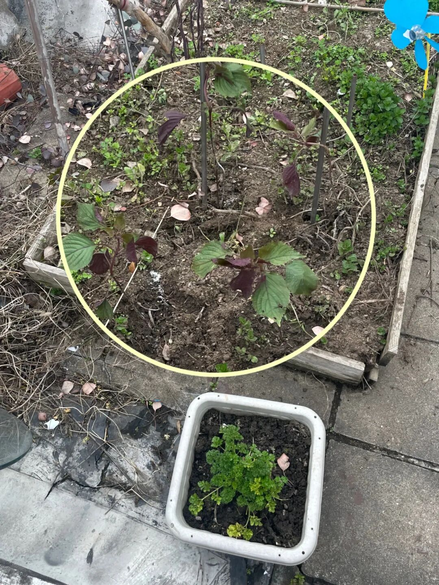

图中圈起来的便是紫苏 1、2、3、4 号选手

紫苏的叶子，

闻起来有一股特别的浓郁香气，

有点像......青草味的孜然？

嚼一口味道更为明显，

许多人吃不大惯。

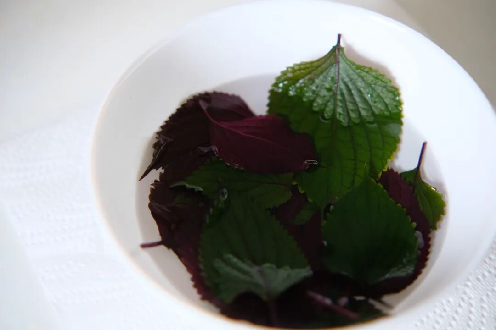

但湖南人超爱！

尤其是做成紫苏桃子姜。

据说没有一颗紫苏

逃得过长沙人的剪刀？

（长沙人展开说说！

某一年在长沙吃到👆正不正宗不知道，反正好吃！

原本以为湖南才有，

没想到在上海也能活！

放天台上不用管，

想起来才浇些水，

又过了一个月就长成这样👇

多么新手友好的作物植物啊！

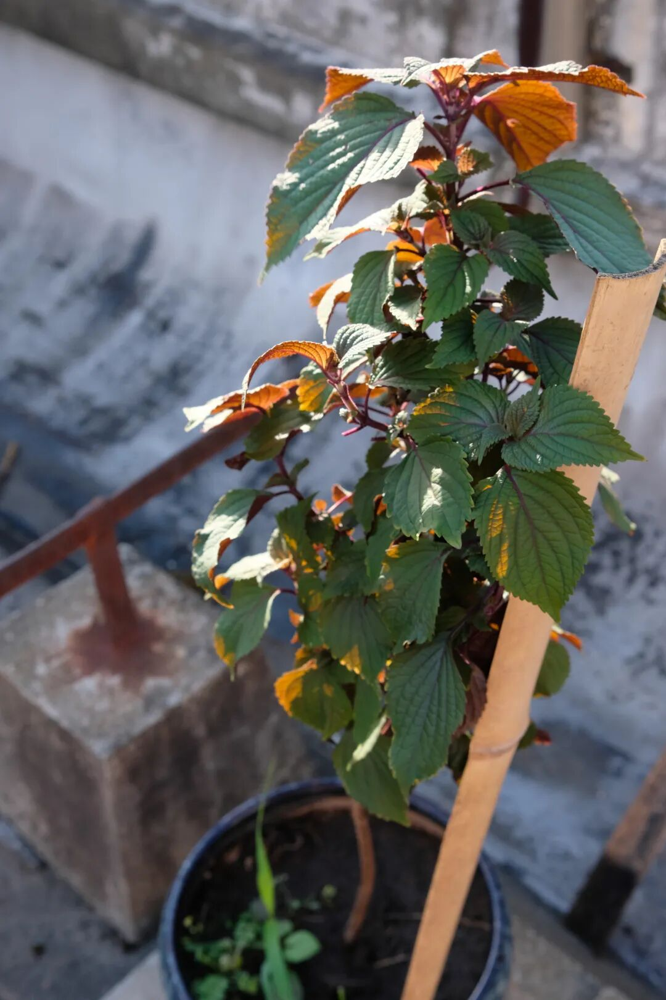

吃不过来，根本吃不过来！

你们知道的，

薯角我向来助人为乐，

于是直奔朋友家，

蹭了一次紫苏宴

首先是这道紫苏泡菜豆腐！

重度紫苏爱好者会爱，

朋友从一家韩国餐厅学来。

（指路👉 FULLUP 满尚·壹杯

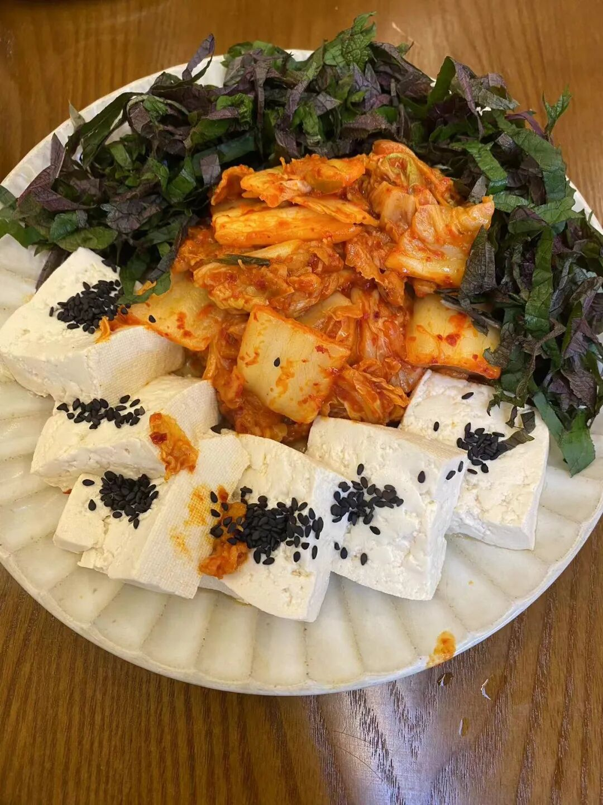

在店里长这样👆

难度 0 颗星，

菜如其名，

把切碎的紫苏叶和老豆腐、泡菜码在一起，

就做好了。

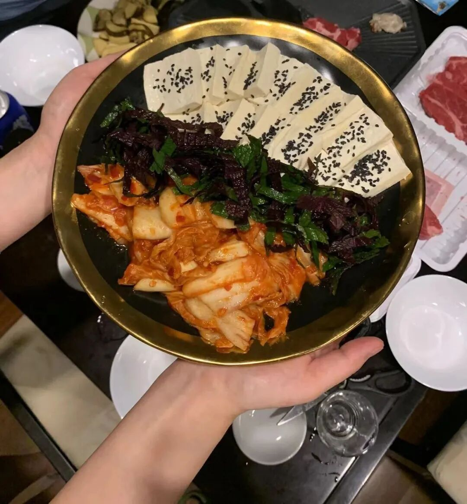

唯一需要注意的，

就是记得把老豆腐提前焯水，

让豆香味散出来。

（有时间的话泡菜也可以提前炒一下！

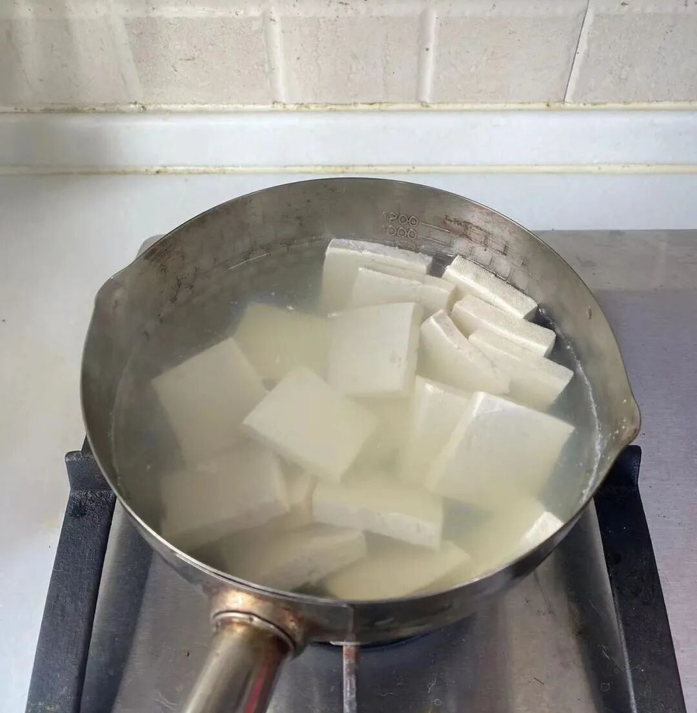

吃的时候把三个食材在盘里拌匀，

舀一勺到米饭上，

紫苏的香衬着泡菜的微微辣意，

在豆腐上得到了完美的承载！

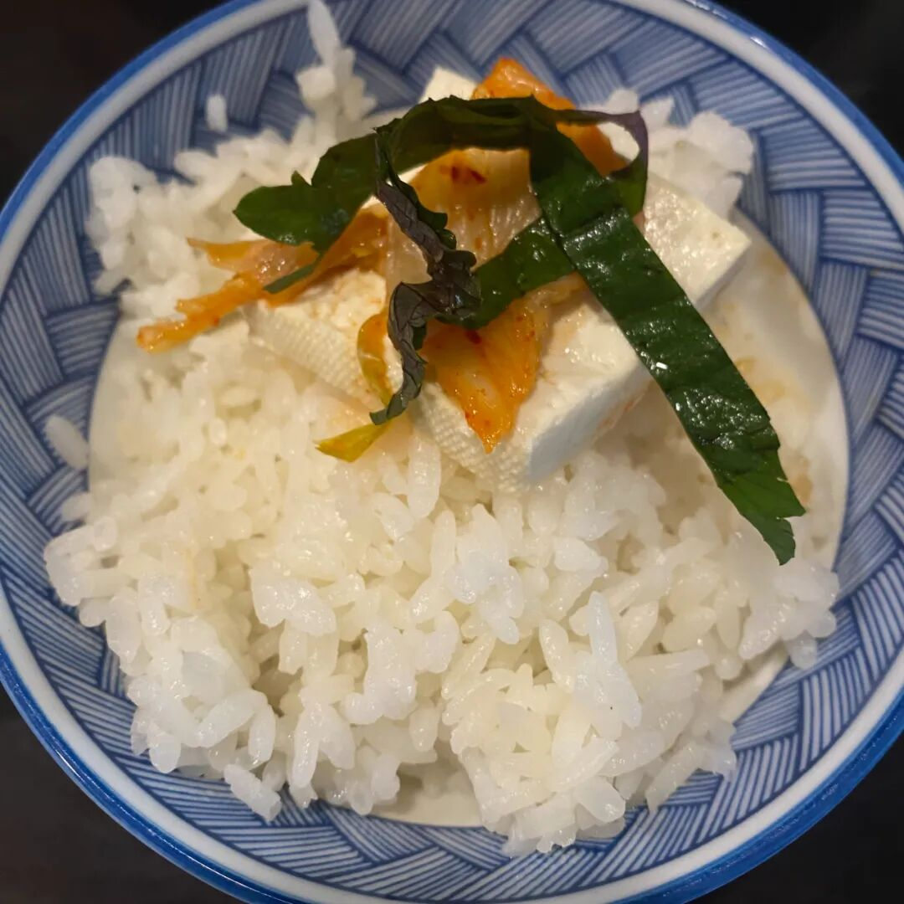

第二道，紫苏焗罗氏虾，

适合只喜欢紫苏香气的选手，

菜谱在小红书现学的，

（指路👉@广东师奶养成记

直接照着按步骤做即可。

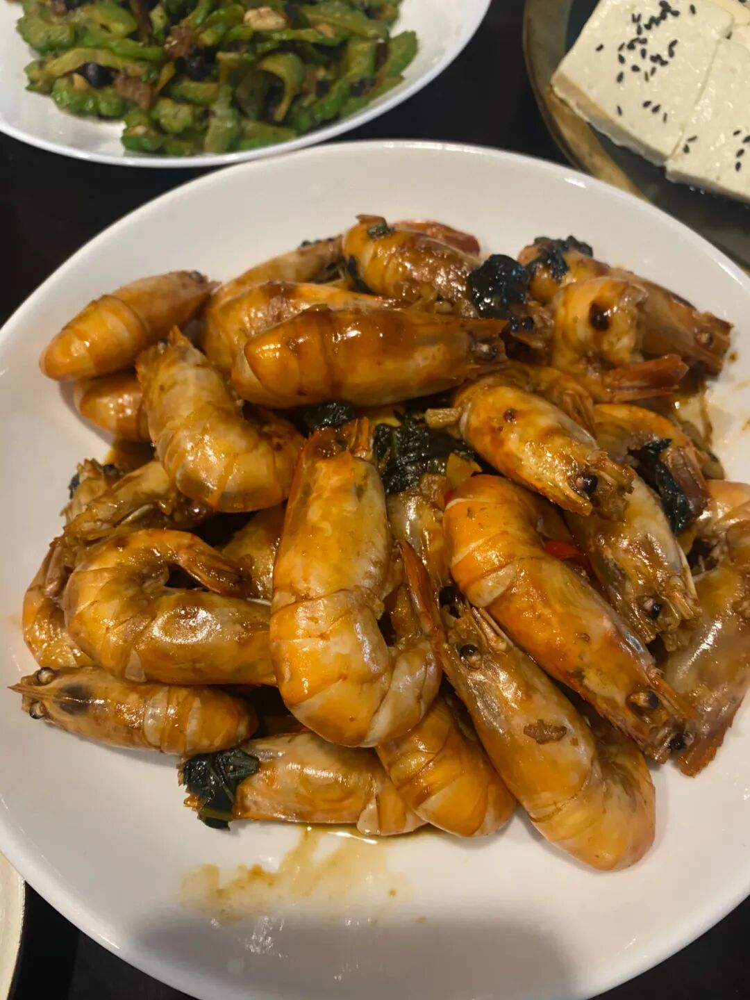

全部的材料都在这里了！

朋友根据口味微调了一下，

准备一些蒜、小米辣，

再调一碗混合生抽、蚝油、蜂蜜的酱汁👇

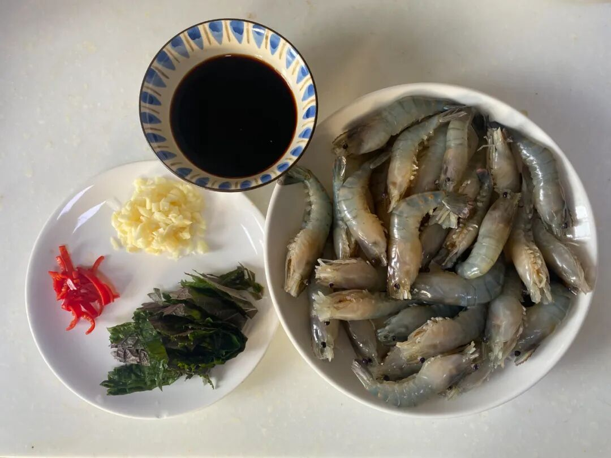

把虾煎到金黄，

再倒入小米辣、蒜及酱汁翻炒，

最后撒入一把切好的紫苏叶，

炒出香气👇

这道菜里，

如果想要紫苏完全入味，

必须提前把虾切开！

否则，紫苏便只存在于空气之中，

但别有一番若隐若现的妙意～

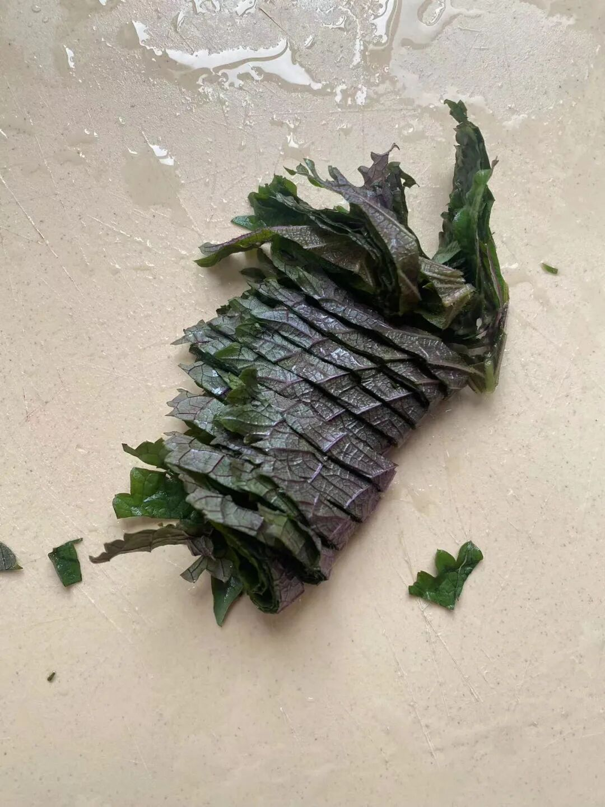

最后献上朋友的紫苏苗购买记录，

来自 pxx，

只需 8.79，

收获一个夏天的紫苏自由～

好了，

以上便是薯角我近期的蹭饭汇报！

除此之外你还可以：

紫苏炒黄瓜、紫苏气泡水，

紫苏焗鱼、紫苏煎鸡

......

让紫苏赶超薄荷，

从你我做起（？

题 外

立秋已过，该吃饼了！！

外面买不到的奶黄月饼，

半岛嘉某楼奶黄月饼的创始配方，

邀请米其林大厨调整减糖，

趁还在预售，早鸟 86 折！！

此外酥香四溢的滇式云腿小酥，用大颗宣威火腿肉，拌黑、白松露酱，还有新鲜的水果玉米，
免煮可生食，拿到直接开啃！来自新疆吐鲁番的三色葡萄，
全都没有籽，嘎嘣脆还爆汁！
趁老板旅行无心管它们，大方如我薯角，都给大家薅一个限时 9 折！！

饱记·奶黄月饼礼盒
预售中！！！限时早鸟 86 折！！
饱记独家配方，外面买不到！
🥮 新鲜手作，外皮酥脆，内里奶香浓郁～
每日限量 100 份。预计八月底按下单顺序发货～
戳图买它👇

饱记·滇式云腿小酥
现货！！！限时 9 折！！
传统滇味经典，新鲜手作，浓情四溢。
🥮四个口味：经典云腿、蛋黄云腿，黑松露云腿、白松露云腿。
🥮三种规格：云腿酥礼盒全家福（四个口味各 2 枚）云腿酥礼盒双拼（经典云腿小酥*4 枚+蛋黄云腿小酥*4 枚）
云腿酥礼盒囤货装
（经典云腿小酥*30 枚）

戳图买它👇

饱记·水果玉米购买方式如下限时 9 折！！！
剥叶即食，
亦可煮熟当粗粮！
🌽两个规格3 斤中果装，6-8 根（单果重200-250g净重2.8斤+）3 斤大果装，5-7 根（单果重250-300g，净重2.8斤+）
水果玉米自西双版纳采摘后
将优先冷链发往福建，经智能化专业包装处理，加入冰袋保鲜，再极速寄出，最大程度保证新鲜～
戳图或去🍑🍑🍑搜索「艾格吃饱了」下单购买👇

饱记·新疆三色葡萄
购买方式如下
限时 9 折！！！

来自新疆吐鲁番的甜，
三种葡萄，三重风味，一次拼配。玻璃翠·无核紫·无核白。
不吐皮不吐籽，嘎嘣脆还爆汁！

甜度从低到高，自酸甜过渡到纯甜，完整体验不同酸甜配比惊喜。

戳图下单购买👇或到🍑🍑🍑搜索「艾格吃饱了」

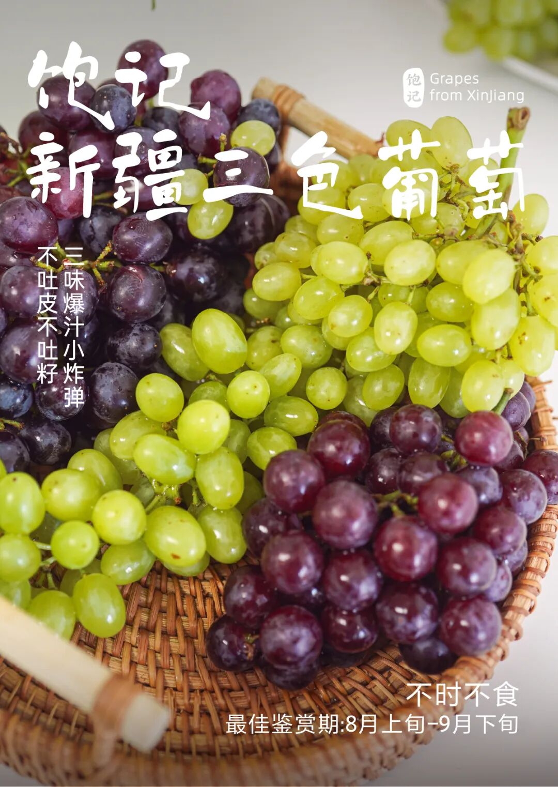

题 外 二

有时真为一些食物不平，
这么好吃怎么无人问津？？两个口味的招牌梅饼，
天然酸甜的黄桃干与空心山楂球，
越啃越香脆的圆墩墩玉米浪，还有扎扎实实的午餐肉片～以及招牌南乳香葱蛋卷等，含泪临期清仓，都是实打实的折扣！！无需凑满减！⚠️PS：清仓产品临近效期，介意慎拍～

饱记·临期清仓专区
5 折起！

清仓产品临近效期，所以巨折，但自家吃吃没问题！介意慎拍～
「临期清仓」专区，5 折起！！清仓产品临近效期，介意慎拍哦～戳图买它们！！👇

本文的研究员

薯角又被我学到了

用好吃的方式吃一生

祖国各地好风物

文章转载请加微信「baojiclub」

