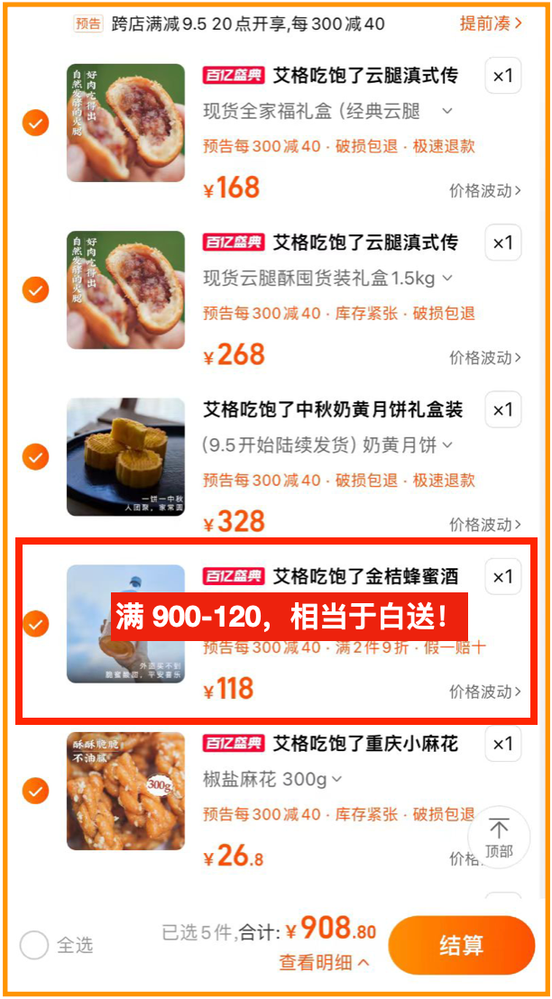
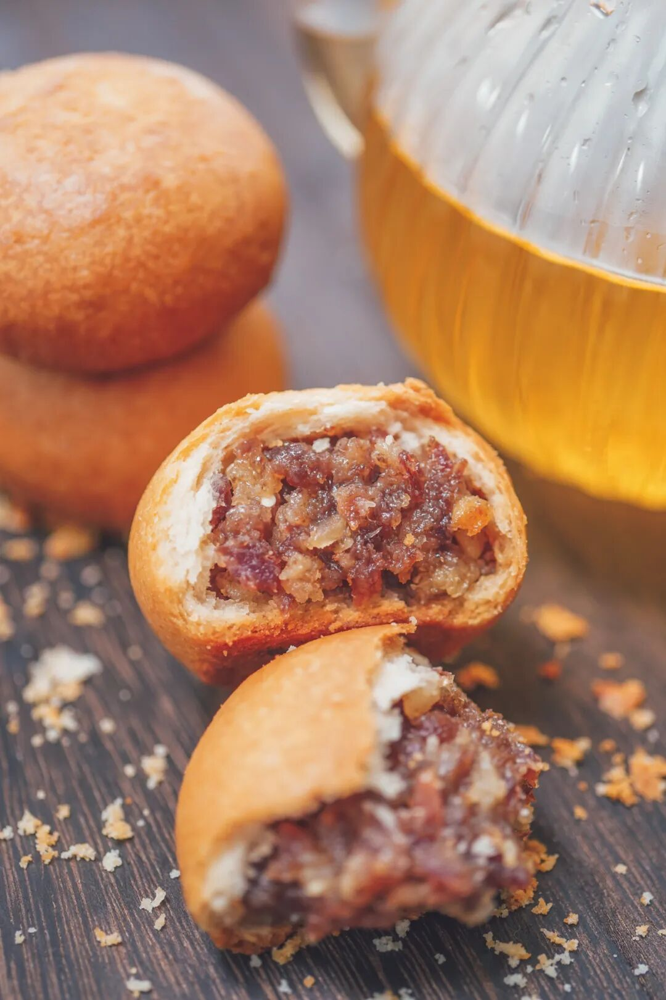
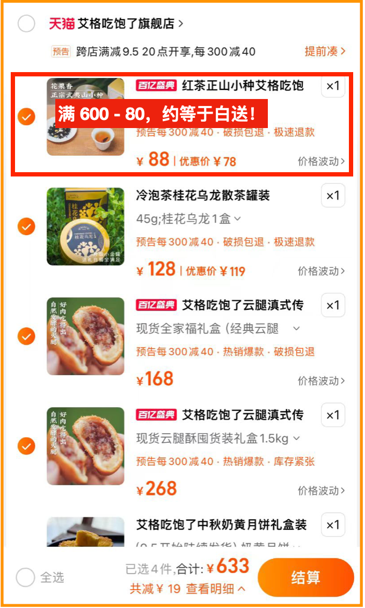
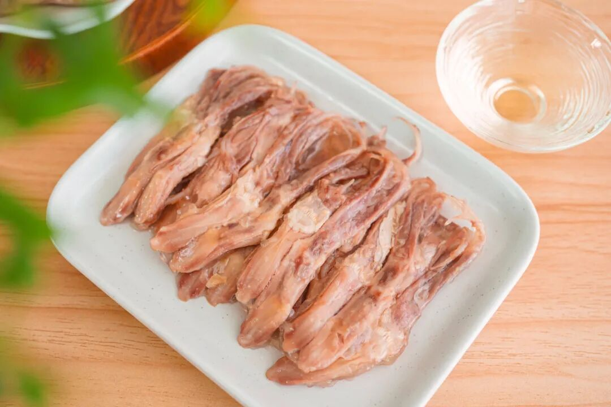
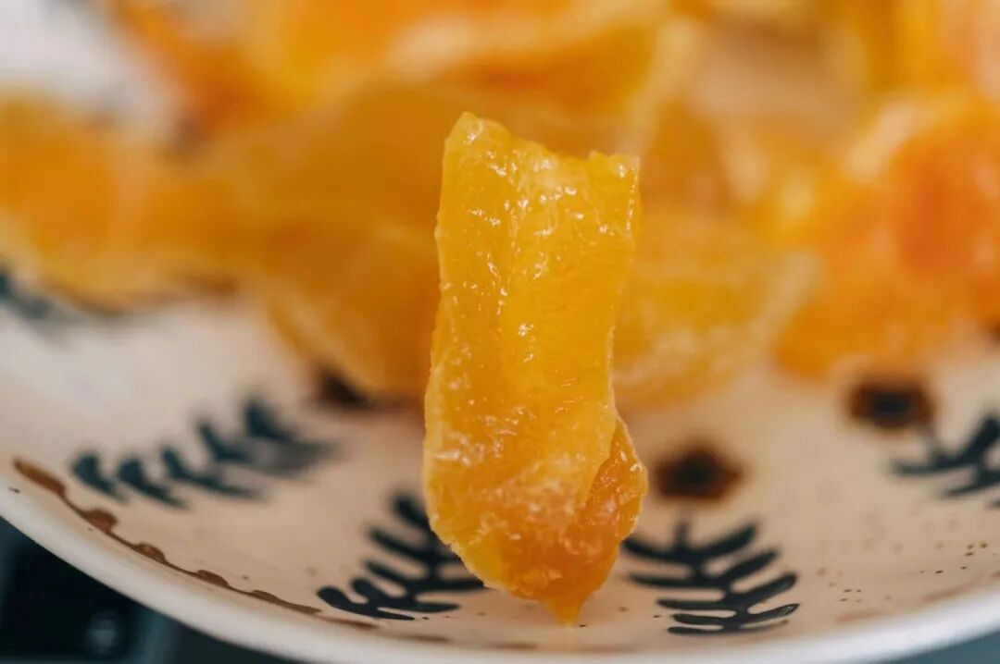
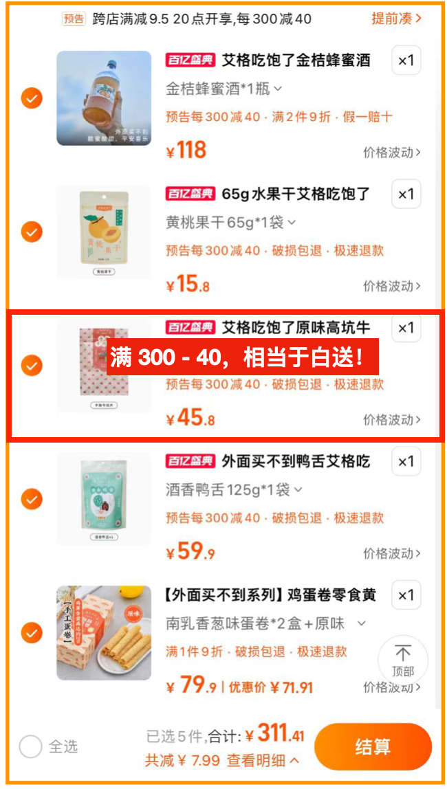
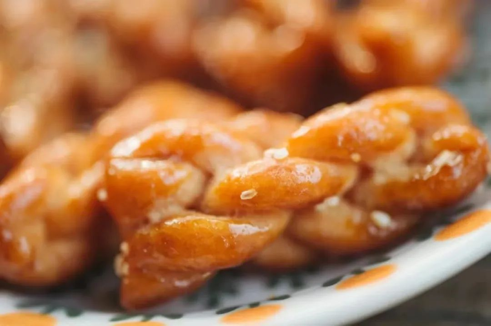
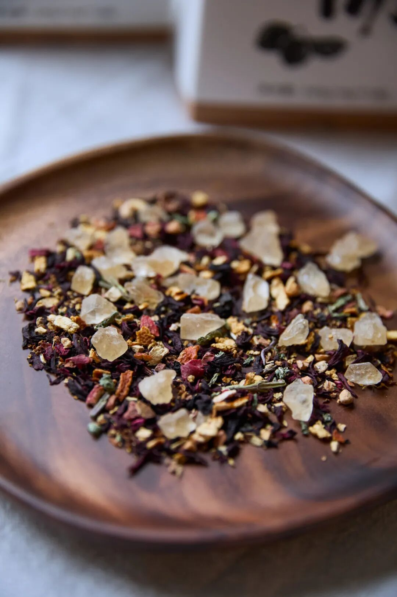
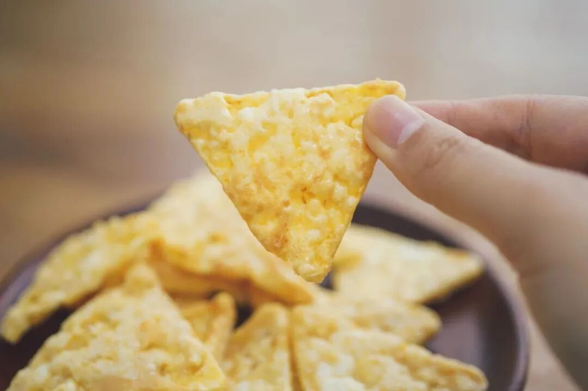
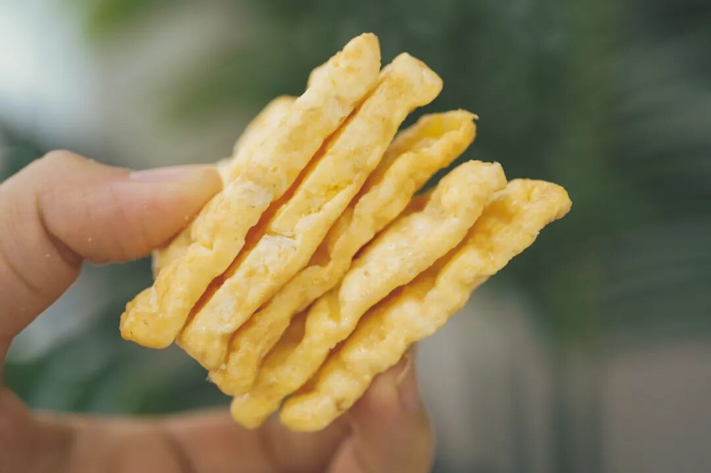

# 七个大便宜，呵呵

- 原文链接: https://mp.weixin.qq.com/s?__biz=MjM5NTYxODQyMA==&mid=2653458565&idx=1&sn=68176306eff3197ea63d221f0dd688aa&chksm=bc363650e4ad1a231984f3225b6d8783f427e37ae4d88eff53fb6038b98a66f5c32168136870&scene=27#wechat_redirect
- 浏览量: N/A
- 点赞数: N/A
- 评论数: N/A
- 转发数: N/A

## 正文

给我薅！

一个尽情安利自我的公众号

以下是没事干研究院的风物研究报告请放心食用
服啦！天猫今晚又开始大促。薯角我岂能不薅？即刻算了 7 个购物车出来，
你们意思意思，有些东西约等于不要钱！

PS：这里说的不要钱，只是相对于原价来说，指的是天猫大促凑单满减折扣，真正拍下还是会显示支付金额的～
1. 「金桔酒不要钱」购物车
这款「外面买不到」的金桔酒，是我司产品同事近期的得意之作。

从融安自采了 3000 斤

正宗融安滑皮金桔，

果脆、芯甜、籽少，

拉到四川酒厂酿制。

还用上了传统葡萄酒酿法，

整颗金桔浸皮萃取，

从而使更多果实风味向酒液转移，

带来浓郁柑桔香气。

入口回味悠长，带有微微辣意，

还有浓郁的柑桔清香，

好喝到停不下来啊！

初秋的好天气里，倒杯金桔酒，
搭配这司卷得没边的奶黄月饼、云腿酥，
或者零食销冠小麻花。
一整套搭下来约等于金桔酒不要钱，划算呀！（哦这个羊毛我发现的，呵呵呵呵

2. 「桂花乌龙不要钱」购物车

这款桂花乌龙，

包装升级！做成了小金罐，

有一说一真的很适合中秋送礼。

用的是六年陈炭焙铁观音，每年寒露前后新鲜打的金桂，然后请来福州当地家中五代制茶的老茶人，以传统古法窨制，一层金桂一层茶～

配我司美仑美奂的的奶黄月饼，半岛嘉某楼奶黄月饼的创始配方，邀请米其林大厨调整减糖，完全不甜腻，一口一个停不下来。

或是这卷了三年的云腿小酥，
卷到了，
宣威海拔 1800 米左右的高山里拌上欧洲米其林餐厅常用的黑、白松露酱，香呀～

下面这个购物车👇
约等于桂花乌龙不要钱。
都是适合秋日的好风味，九月闭眼入系列！！！

3. 「柚子小种不要钱」购物车
月饼不可能只买一盒，
茶当然也可以搭配多种。

柚子小种红茶，用的是武夷山的花香小种红茶。超香！！！传统手工精制，一芽一叶，
自带的鲜叶汁水也更丰富。

泡出来后，远远都能闻到饱满的柚子香气！

你还可以像董洁一样，

（是的它可是上了董洁直播间！

拿出喜欢的杯子品品，

总之优雅永不过时

搭上桂花乌龙，还有两盒云腿酥。
两种茶+两盒酥，一盒自留，一盒送礼。省了一盒柚子小种的钱，薯角我都给你算好了。

4. 「手撕牛肉不要钱」购物车
这台湾金门口味的手撕牛肉干，超大片！！！
味道是咸鲜浓郁中带点甜，好嚼过瘾。不像市面上又干又硬的牛肉干，
难嚼得像在啃橡皮筋。它是微微湿润的，一条一条撕着吃。选用南美洲进口草饲牛、特挑部位制炒，台湾老师傅传承手工艺，慢火焙炒烤，真材实料！重点！柔韧鲜香，老人和小孩子都能嚼得动！

配上这个酒香鸭舌，

江浙沪糟卤口味。

专门盯着南京的厂找，

因为全世界他们最懂鸭子。

最后定的是一家老师傅开的厂，

厂里有一锅 30 多年的老卤！

鸭舌原料舍近求远，

用的内蒙古的鸭，

吃草～鸭舌肥嫩没有腥气！

还有金黄果肉的「黄桃干」，桃子用得好！
很厚实的一块，塞进嘴里一股子浓郁的自然果香。

再加上极其香酥的手工蛋卷，
还有前面的金桔酒，省下一袋手撕牛肉的钱！正好趁此机会补补货👇

5. 「樱花虾片、甜青梅不要钱」购物车
透着光的虾饼，质地轻薄酥脆。选用来自台湾野生的樱花虾，自带的鲜味，加上潮汕特制的鱼露提鲜。

比薯片好吃，一口咬下去咔擦咔擦让人馋得不行！

甜青梅，非常妙的一款零食。青梅用的国家地理保护产品——广东普宁的梅子，用糖和盐调味，表层微微湿润，酸中带点咸，很清爽。

搭上必买的云腿酥、奶黄月饼，还有金桔酒，这俩等于白送👇

6. 「猪肉纸、小麻花不要钱」购物车
这个香脆肉纸，肉含量高达70%，自从有了它，我就用它替代薯片和猪肉脯，摸鱼想不出稿子的时候，啃几口，香哦，啧这小日子。。。

包装上写的话也很骚气，还好这个是非油炸的，别想骗我，哼。

这个小麻花，也必须要来说上一说。是好吃到让我们一个自家做糕点酥类的大厂供应商都好奇的程度。

确实是市面上少见，重点是酥，脆，甜却不腻口，面粉配比讲究得很，别看就卖你十几块，有功夫在身上的。一定要去买！

搭个「大师凤梨酥」，

果肉含量超 40%，

果味超浓郁，酸甜拉丝，

有肉眼可见的果肉纤维~

再买盒后台全是好评的云腿酥，

四件里

约等于两件不要钱！！👇

7. 「酸梅汤不要钱」购物车
免煮酸梅汤，

没有乱七八糟的硫熏和色素，

都是中药房里常见食材，

工工整整码了八味：

乌梅、橘皮、山楂、薄荷，

玫瑰茄（洛神花）、甘草、桂花，

再加点冰糖中和酸味～

考虑到打工人精力有限，

下班后估计锅都懒得拿，

（灵感来源：薯角

所以把原料切得比较细碎，

再装入三角茶包，

既干净卫生，又方便直接冲泡出味～

一秒出汁！

冲泡时有浓郁的乌梅与山楂香气，

咕咚咕咚大口灌下去，

唇齿都是果子的酸甜味儿！

配这个玉米脆，吃完就加入芝门！🧀🧀🧀🧀🧀🧀

非油炸，挤压膨化制成。用的椰子油，比较健康，还是减油的配方。（这下吃得更大胆了

搭着云腿酥、酒香鸭舌买，

有吃有喝，

酸梅汤约等于白送！👇

好了就这些。七个大便宜，不薅白不薅。走你！

题 外 一

薯角我呀，一步到位，

懒得打开淘宝的，

请看下方！链接直达！

外面买不到的奶黄月饼，

限时 86 折！！

卷了三年的云腿酥，

限时 9 折！！！

外面买不到的金山瓢鸡，

限时 9.5 折！！

还给大家整一个秋日时令专区！

天赐山珍云南野菌子四种（鲜的

生吃都鲜甜的香格里拉松茸，

蜜蜜甜的海南钦蜜 9 号百香果，

以及用正宗融安滑皮金桔，
融入四川本地土蜂蜜，浸皮萃取来的金桔蜂蜜酒！数不过来，吃得人心满意足！限时 86 折起！

冲吧！

饱记·奶黄月饼&云腿酥

购买方式如下👇

限时 86 折起！

提前看齐天猫大促，

外面买不到的奶黄月饼，

限时 86 折！！

半岛嘉某楼奶黄月饼的创始配方，

邀请米其林大厨调整减糖，手工烤出来的好吃！此外卷了三年的云腿酥，
限时 9 折！！！
戳图买它👇

饱记·云南稀有品种瓢鸡购买方式如下限时 9.5 折！！！
别说我薯角不惦记你们！这个所有人抢的【外面买不到】的金山瓢鸡，有最新的老母鸡高达 20 月龄！
也给你们安排！
戳图下单购买👇

饱记·秋日风味专区

购买方式如下

86 折起！

秋日里的时令好风味。

地下种的，

水里游的，

树上长的，

厨房里烤的。

应有尽有，

莫要辜负哦～

戳图买它们👇

题 外 二

有时真为一些食物不平，
这么好吃怎么无人问津？？天然酸甜的空心山楂球，
越啃越香脆的圆墩墩玉米浪，以及招牌南乳香葱蛋卷等，含泪临期清仓，都是实打实的折扣！！无需凑满减！⚠️PS：清仓产品临近效期，介意慎拍～

饱记·临期清仓专区
5 折起！

清仓产品临近效期，所以巨折，但自家吃吃没问题！介意慎拍～
「临期清仓」专区，5 折起！！清仓产品临近效期，介意慎拍哦～戳图买它们！！👇

本文的研究员

薯角凉风有信

用好吃的方式吃一生

祖国各地好风物

文章转载请加微信「baojiclub」

