# 上海人进，在上海的云南人更要进

- 原文链接: https://mp.weixin.qq.com/s?__biz=MjM5NTYxODQyMA==&mid=2653460480&idx=1&sn=ab1fce603c6e51fcb3b67853597fa327&chksm=bc1a5c04d4c73eb47ed91e5b78d71c92322ab259370b9d3035d1aaa952e54a5d65532eb5f64c&scene=27#wechat_redirect
- 浏览量: N/A
- 点赞数: N/A
- 评论数: N/A
- 转发数: N/A

## 正文

来玩啊！！！

一个尽情安利自我的公众号

以下是没事干研究院的风物研究报告请放心食用

天凉了！

上海渐渐有了入秋的样子，

梧桐区的叶子开始泛黄，

阳光和风都温和舒适，

于是我们好吃、好玩的活动又来啦！

本次活动是上海人气云南菜餐厅

浩海火烧云和我们共同举办的！

以云南食物的灵魂——「香料」为主题，

将云贵高原上的香料们搬到市中心的芮欧百货。

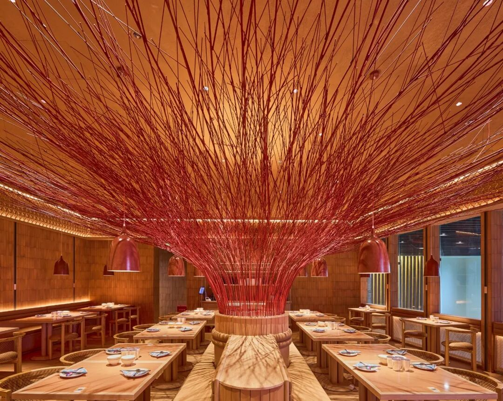

浩海火烧云芮欧餐厅，树包塔区域限时开放举办香料花园活动。树包塔，是德宏著名美景。

可吃！可赏！

还可抽那种百分百中奖率的奖😎

老规矩，先放一张活动海报👇

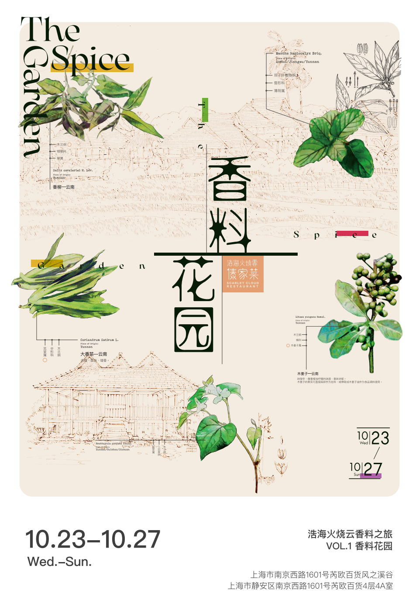

云南人做菜，

在香气上下了大功夫。

所谓「无香料，不成席」。

从常见的香茅草、薄荷叶，

到小众些的荆芥、木姜子，

各种香料复合出独特的迷人气味，

既包容又野性。

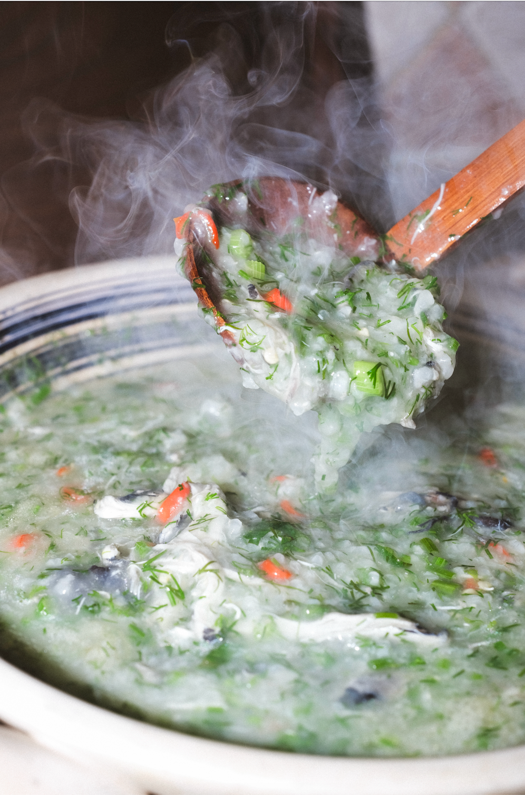

浩海火烧云的的食物，

正取材原汁原味的边境配方，调料繁多。

老板娘来自云南边陲德宏自治州，

她开餐厅，

致力于将当地特殊的香料与烹饪方式

带到大众视线里。

比如这山胡椒根，

江湖又称「人类猫薄荷」。

凑近就能闻到一股浓烈的柠檬草香气，

将表皮用火烤出香味、刮成粉末，

日常就可以放入菜品增香。

浩海火烧云拿它来做「冬阴功炒方便面」。

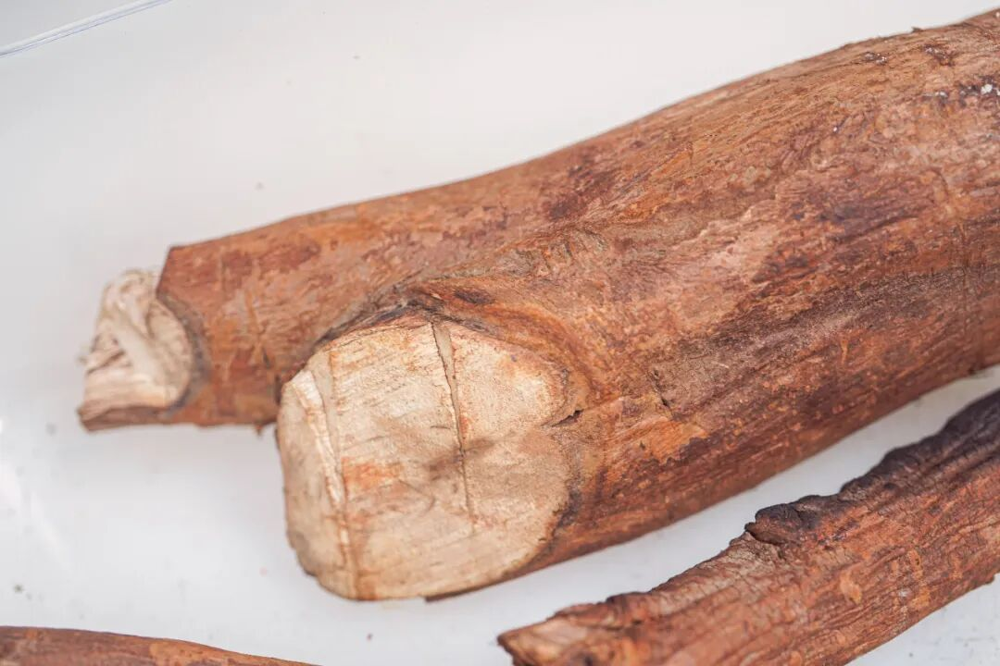

苤菜根，

长得张牙舞爪的，

实际上是葱蒜类蔬菜的辛香辣味。

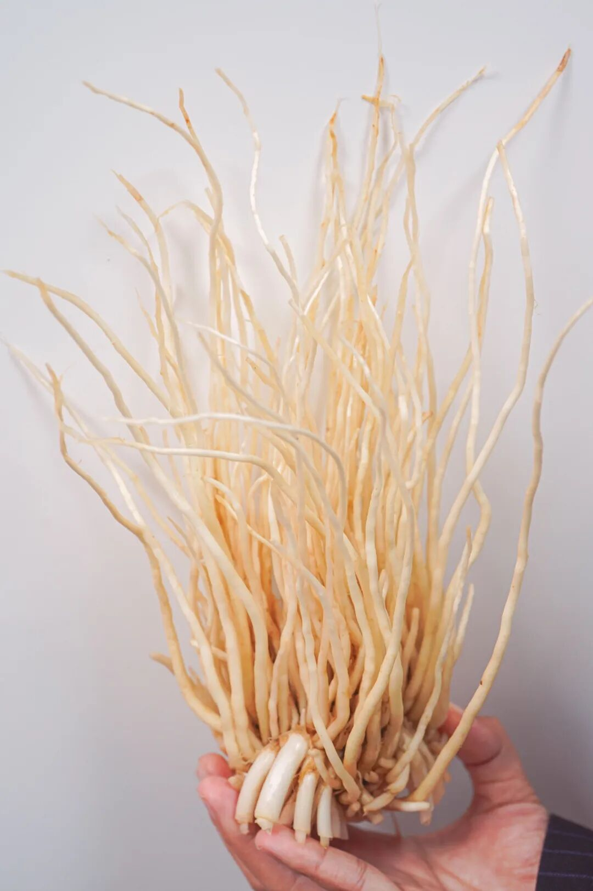

云南人拿来做酸腌菜、鸡脚，

也可以做炒菜，炖菜。

在浩海火烧云里点「臭臭美锅鱼」等菜，

就可以吃到它！

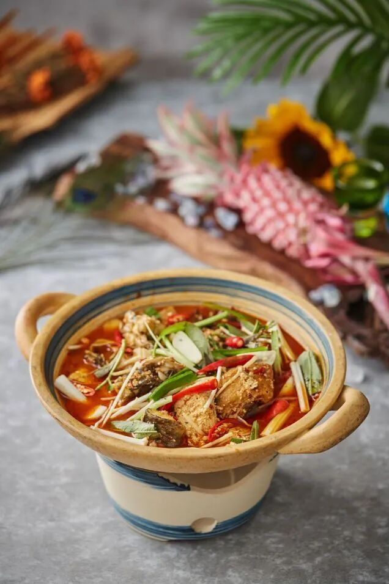

还有香柳，

长得像柳叶，

有淡淡的清香味，

适合和蒜末、小米辣、干辣椒一起爆炒，

好吃得不得了。

店里比如「薄荷碎炒五花肉末」、

「佤族鸡肉烂饭」、「酸笋肉末炒魔芋」等菜，

都有它的身影！

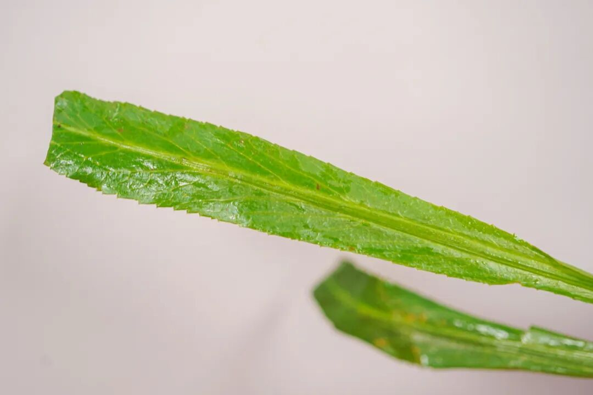

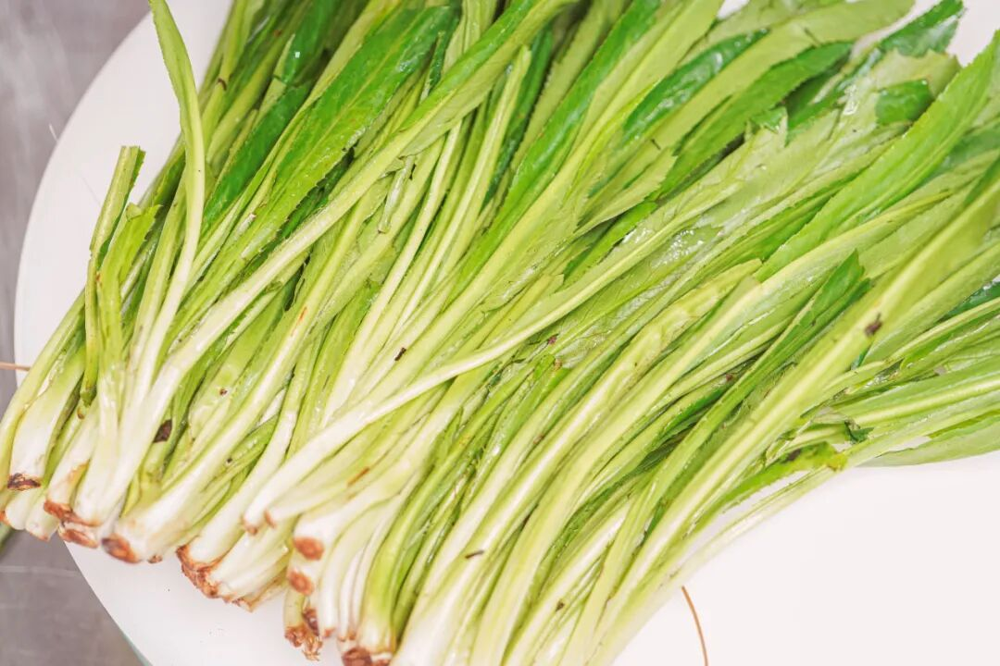

以上这些，

你在 23 号-27 号的活动上

都可以通过嗅觉、触觉来感受！

此外还有木姜子、大香菜、白芹菜、荆芥、

香茅草、鱼腥草、薄荷叶，

云南人民日常生活中的九种香料，

这次得以一一展示。

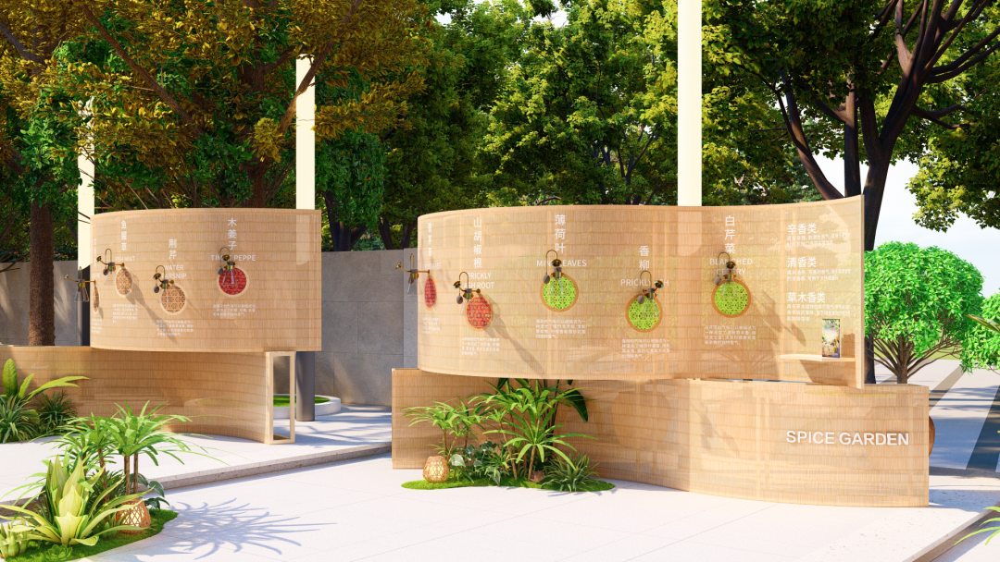

现场气味墙效果图👆

还可以现场体验和观赏，

浩海火烧云后厨的云南师傅

制作豌豆粉和舂菜的

手工过程。

舂菜和豌豆粉云南师傅手作区域👆

适逢浩海火烧云芮欧新店开业，

在当地傣族民居的「屋檐」下，

怀着对云南远方香料的敬意，

我们还制作了云南香料美食的大都会版本。

在傣式屋檐下喝一杯香料咖啡👆

云南百香果小叶薄荷冰美式咖啡，

纯甜的云南百香果和

清香的小叶薄荷均由云南运来，

咖啡豆由云南豆与哥伦比亚豆拼配，

是我们独家定制的浩海火烧云配方👇

云南木姜子油 75% 黑巧克力，

木姜子油的清香融入黑巧克力块，

浑然天成👇

烤云南芭蕉叶裹红糖粑粑，

是纯正的德宏市场本土风味👇

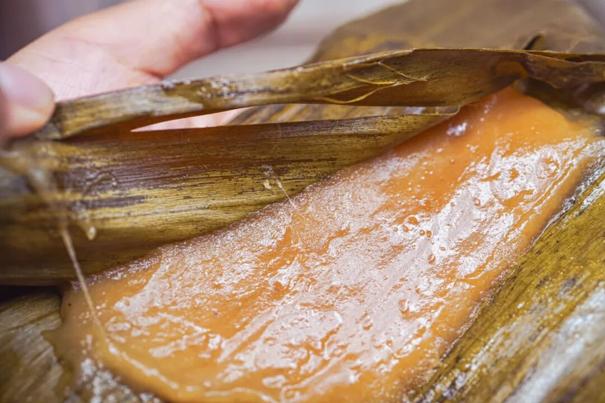

店里的云南师傅还在做菜品摆盘调整，最终出品以活动现场为准哦～

15:00-17:00 新店内限时提供的限定云式小食，

包含德宏冷烧烤云式烤鱼、双味包浆豆腐，

还有茴香春卷稀豆粉。

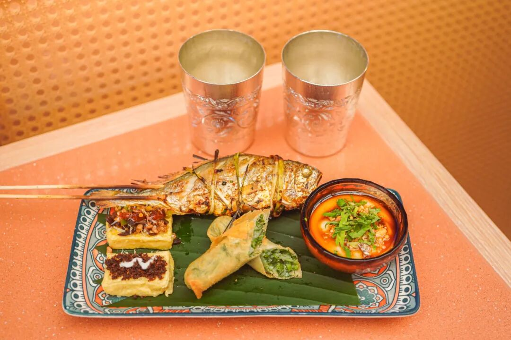

店里的云南师傅还在做菜品摆盘调整，最终出品以活动现场为准哦～

在各色香草腌制而成的小黄鱼的鱼腹中，

塞入调制好的缅甸芫荽、香柳等云南香料，

直接放到炭火上，小半个钟头，

就是外焦里内、清香酥嫩的德宏烤鱼。

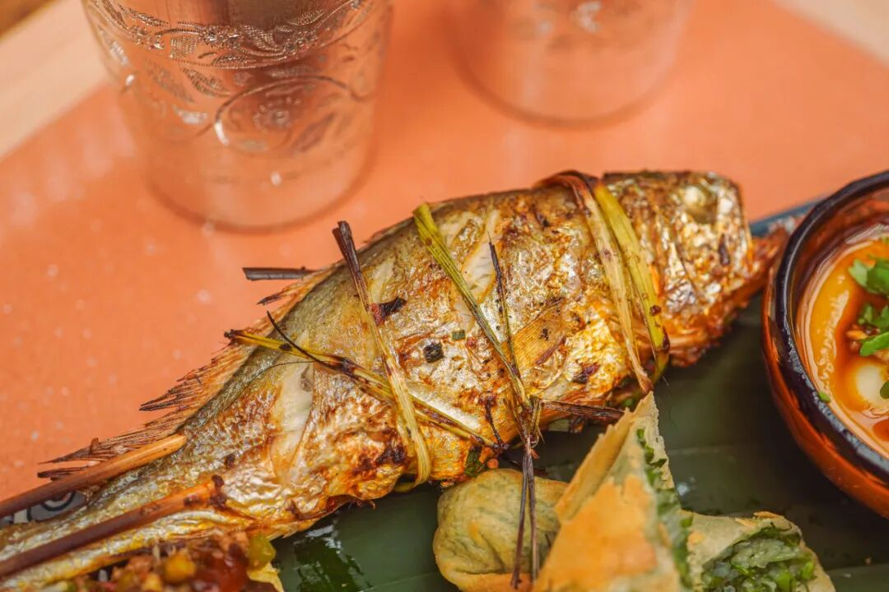

双味包浆豆腐，

经炭火烧烤的豆腐一口爆浆。

分别配上招牌黑三剁、木姜子小肉干

做成的肉脯，

搭配新鲜帕玛森芝士与酸奶，

细品不一样的云式风味👇

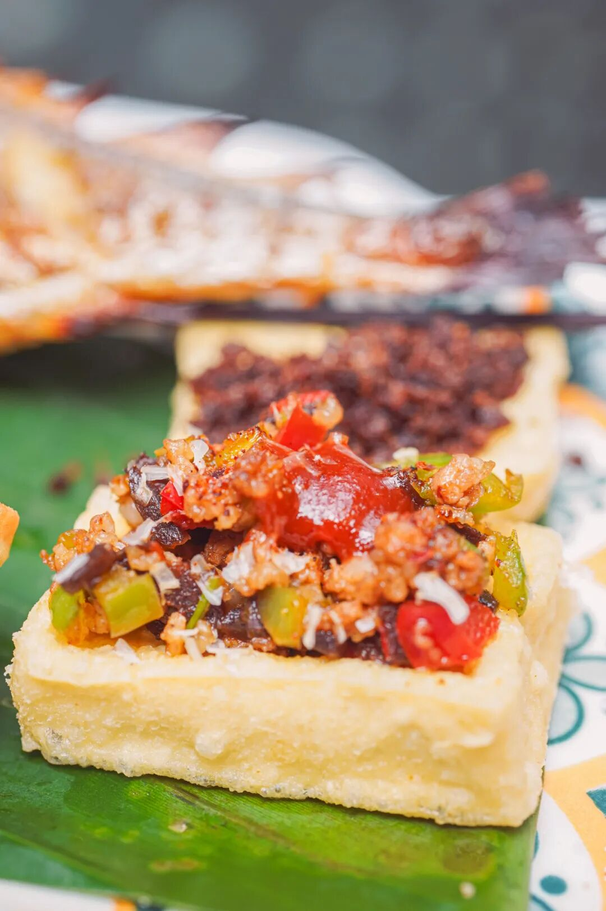

小春卷儿，

把兰州九年百合、新鲜马蹄等蔬菜，

拌入新鲜茴香。

佐以浩海火烧云招牌小吃稀豆粉，

浓香脆口！

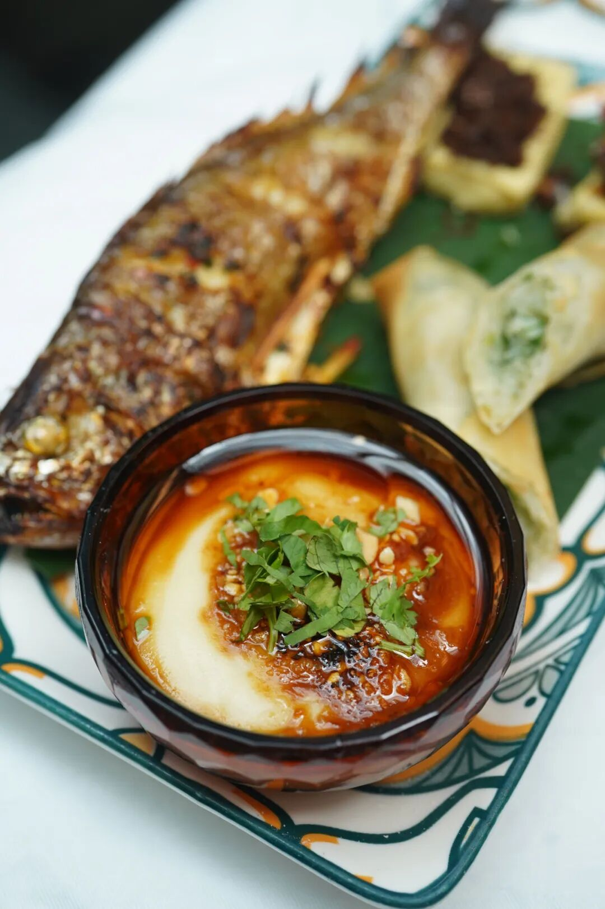

此外还有德宏最具盛名的

傣族竹编生活用品家庭，

为上海的客人们手工染色编制的

彩云竹编置物筐。

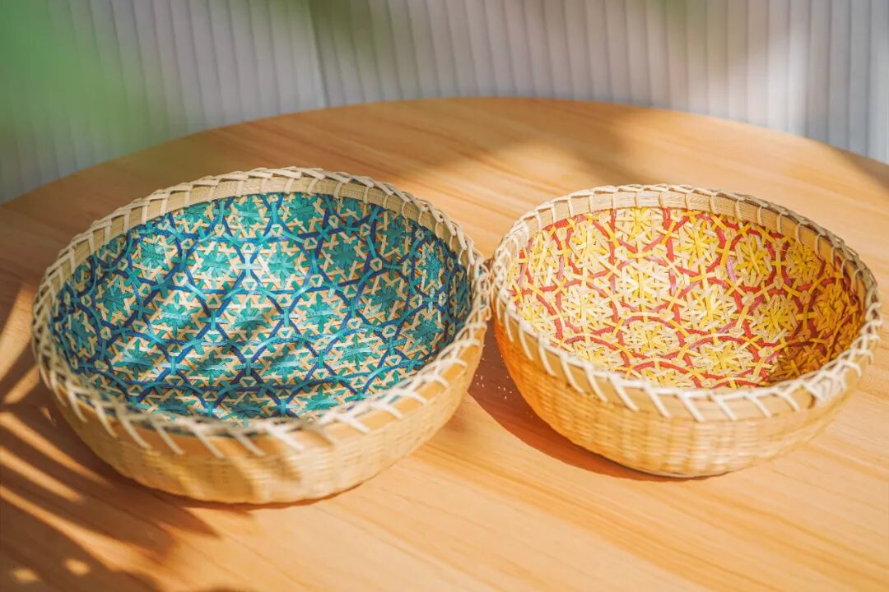

以及活动专属定制环保袋👇

现场还可带走

「干木姜子」香料一份哦！

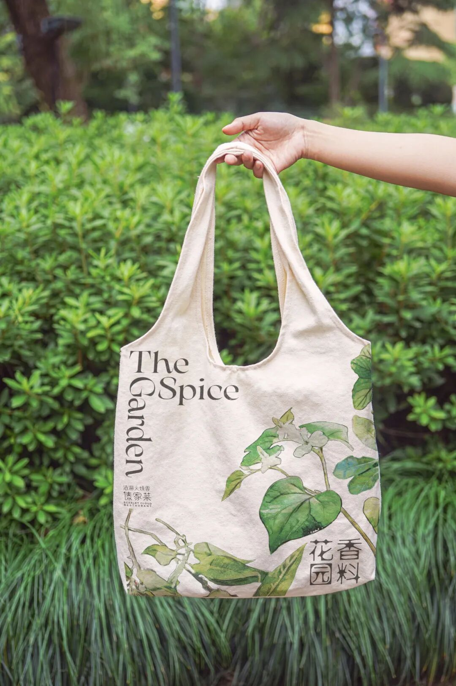

有吃，有喝，有赏，有玩。

一票即可收获

沉浸式的云南香料及风味体验。

门票类型一：

花园打卡票👇

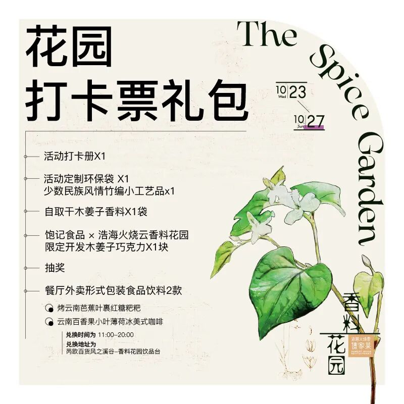

门票类型二：

浩海火烧云现制活动限定小食体验票👇

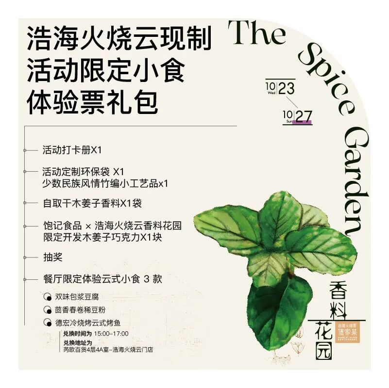

门票类型三：

联票👇

畅享花园食品饮料 2 款及店内 3 种小食。

香料花园·早鸟门票

购买方式如下👇

戳图买它👇

抽奖都是 100% 中奖率。

除了浩海火烧云免排队礼遇、丰富的赠菜体验，

还有 2 个重磅名额，

奖品是远赴云南参与香料之旅。

7 日包机票食宿市内交通！

活动第二站德宏由火烧云老板娘

亲自带队芒市深入体验。

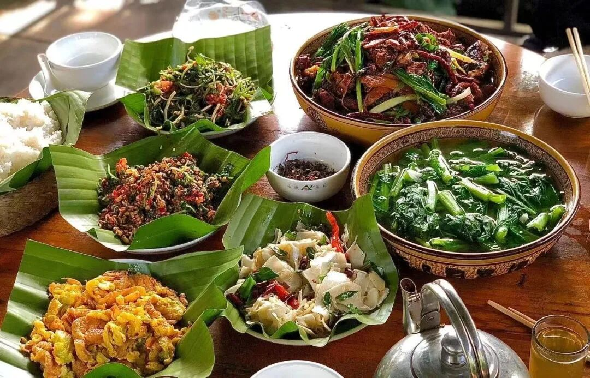

超值的机会，

速冲！

本文的研究员

薯角秋天该很好

用好吃的方式吃一生

祖国各地好风物

文章转载请加微信「baojiclub」

