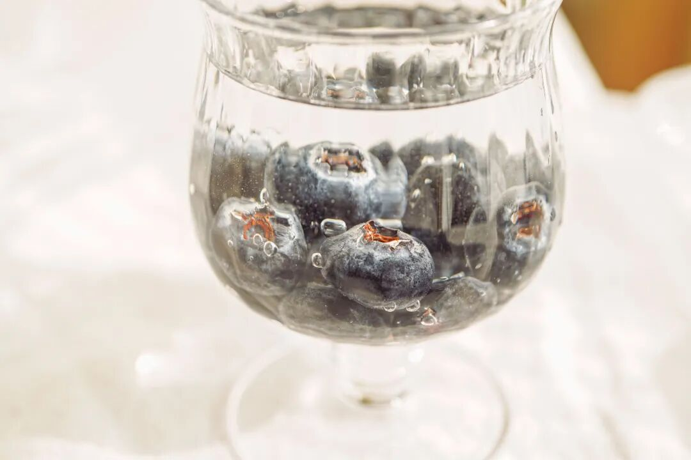
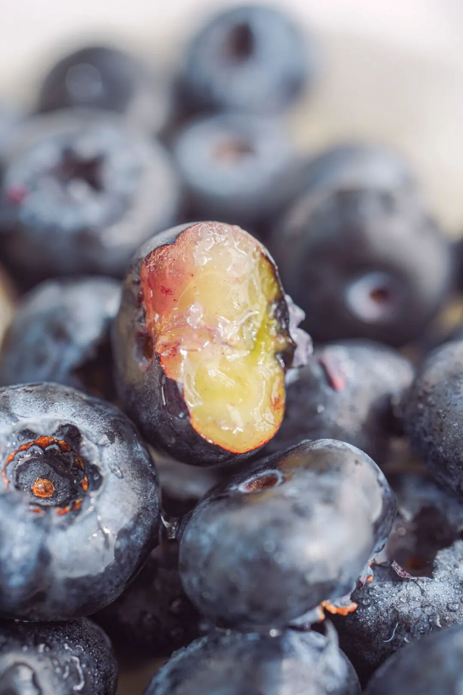
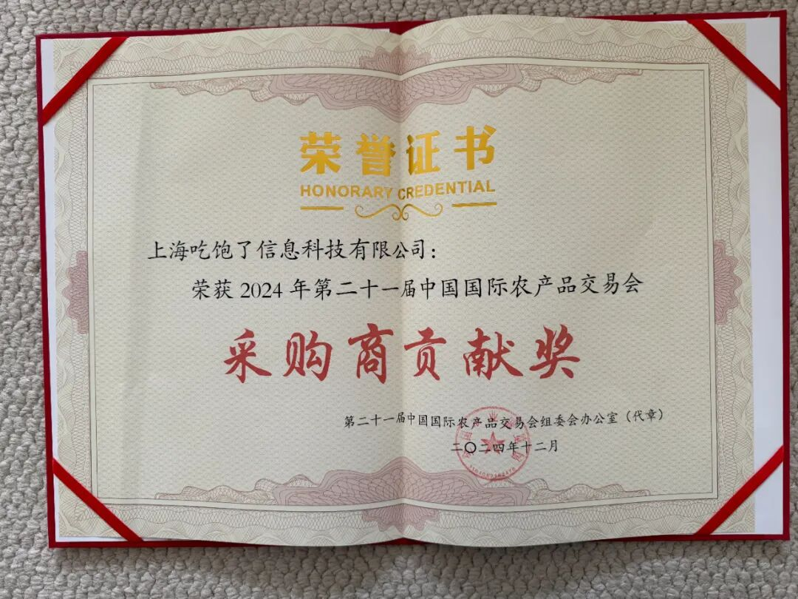
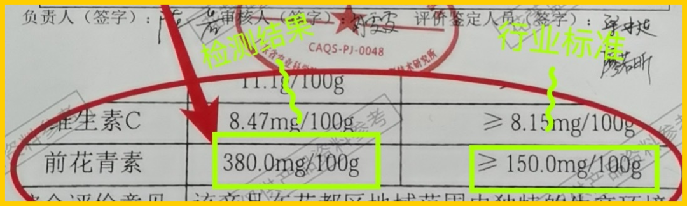
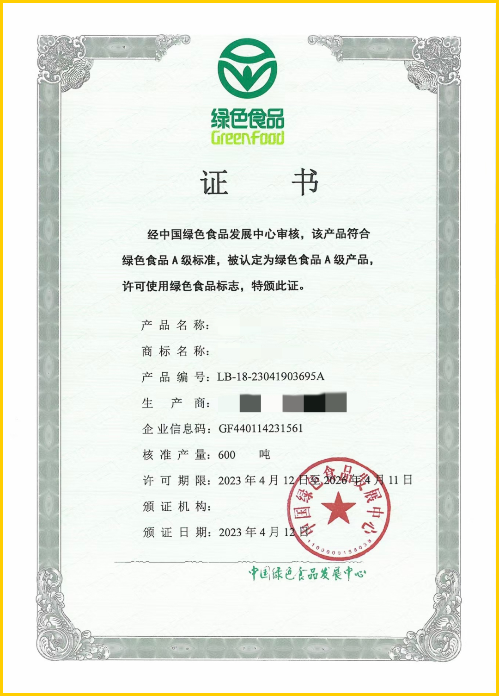
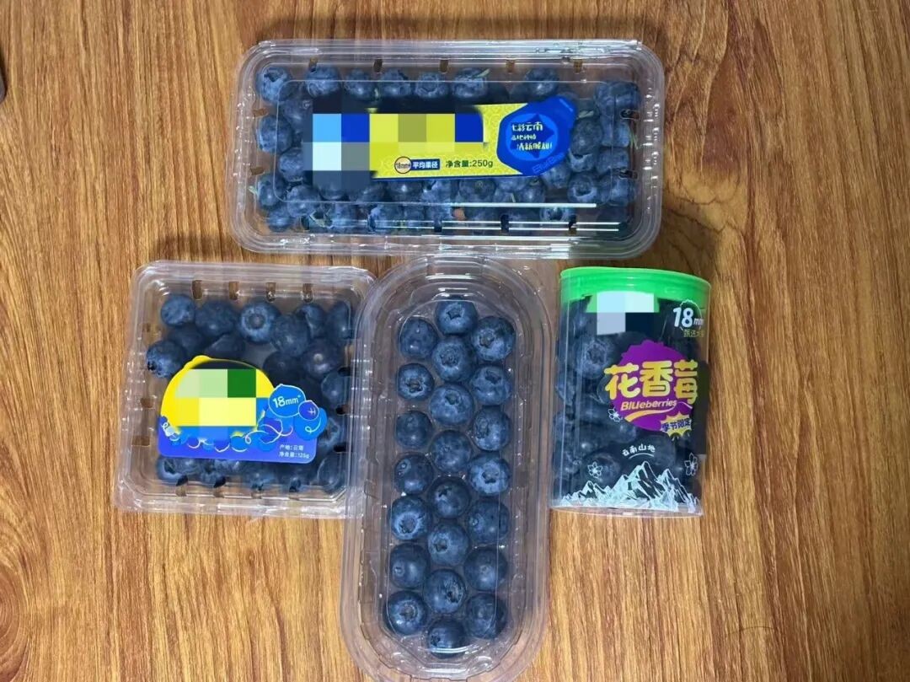
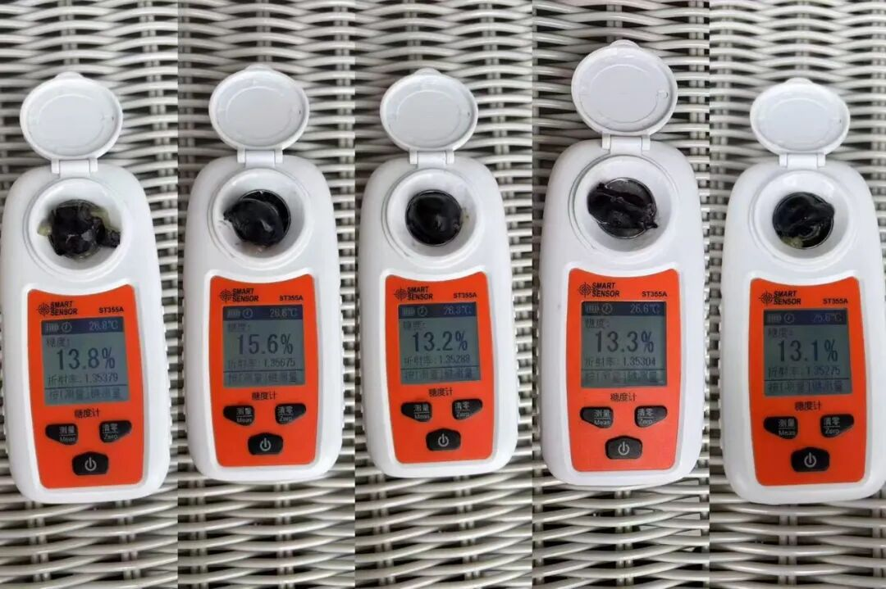
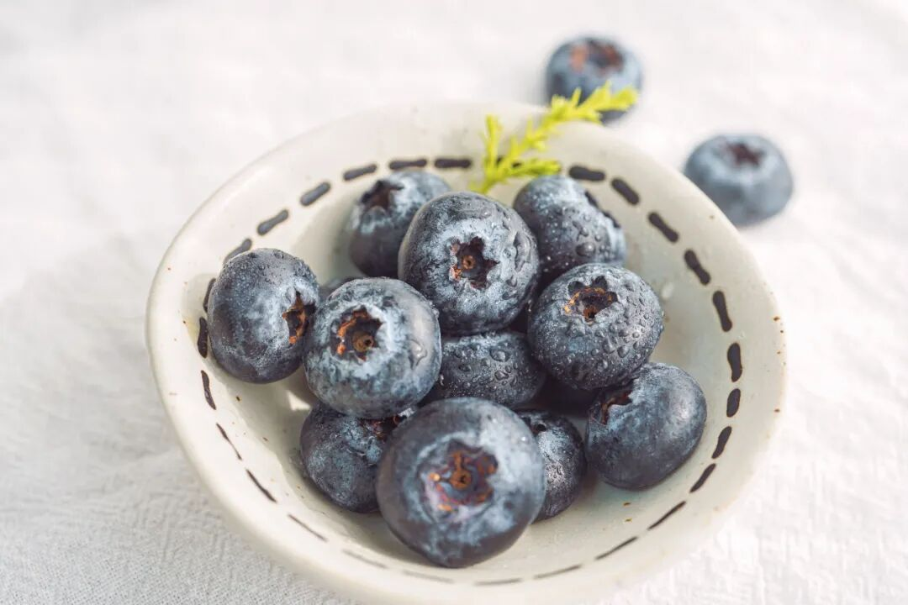
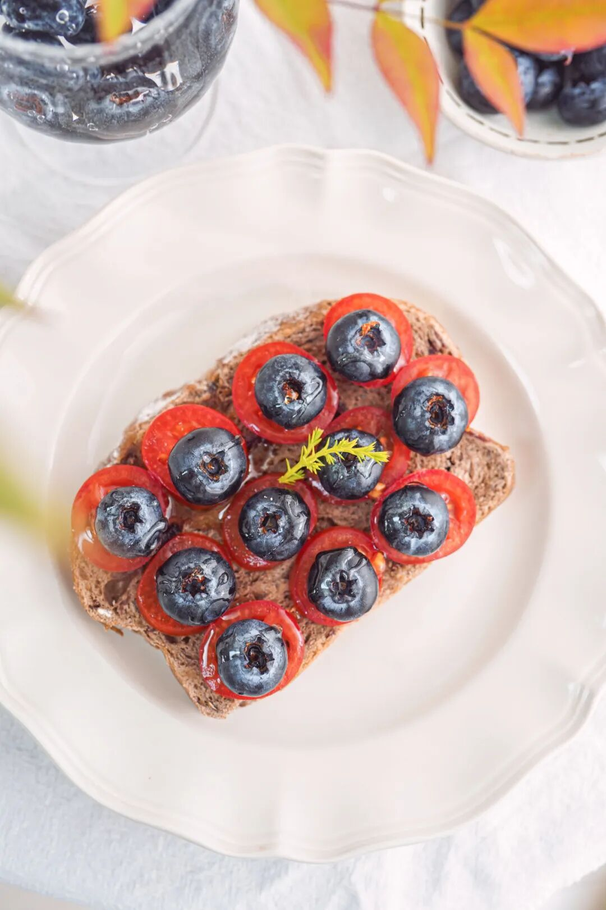
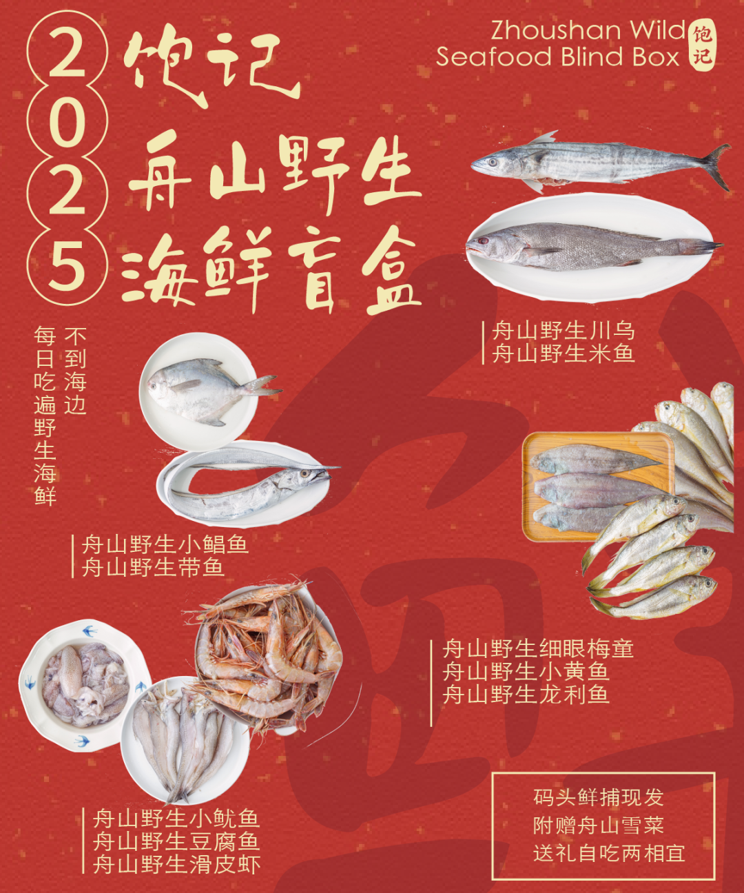

# 上班哪有不疯的，除非。。。

- 原文链接: https://mp.weixin.qq.com/s?__biz=MjM5NTYxODQyMA==&mid=2653470221&idx=1&sn=201505d0045d4ba420139e4a0e5b00bd&chksm=bc9a0a83a5c6f85219982c4a0b30296e981aa252e7972f0661ce57001448706dc3b0e41da310&scene=27#wechat_redirect
- 浏览量: N/A
- 点赞数: N/A
- 评论数: N/A
- 转发数: N/A

## 正文

嘴里甜心里苦

一个尽情安利自我的公众号

以下是没事干研究院的风物研究报告请放心食用

朋友们，

怎么又是工作日了啊！！！

今天本薯不想上班，

你们自己看着买买啊，

人不能打工，

除非吃点儿好的。。。

心里苦的时候，嘴里得甜！

（哪来的歪理？？？

就我司这花香脆甜蓝莓，糖度表现优秀，能达到 13，九分甜一分酸，且是那种均衡安心的甜。

入口脆、甜，几乎没有一丝涩味，（市面上的精品蓝莓一般后味都会涩还有很浓郁很浓郁的花香在口腔里直接爆开，不夸张地说，仿佛喷香水

我司蓝莓来自广州，打遍天下无敌手，我们找了很久，包括云南产区的，都没有这款好嘿嘿～

世人皆知云南 L25 蓝莓品种，

但实际上它并未尽善尽美！

因为大多是靠天吃饭，

所以经常是一颗甜一颗酸，

仿佛开盲盒！

后调还常留有涩味。。。

去年冬天，我司被上海农展馆邀请，自掏机票去广州看全国农交会，（我饱记还获得了大会的特别贡献奖

结果意外收获了这广州蓝莓！

广东有关方面投入十二年育种，

可以往外卖苗的那种！

搭建精品蓝莓基地，

大棚科学种植，

种出来的这果子是那种稳定的好吃！

颗颗脆甜，

且花青素是行业标准的 2 倍！

还有绿色食品证书，清水洗洗就能吃，老人小孩都放心吃

实不相瞒，某马、某颗莓、某沃的我们都买来吃过了。全都没什么花香，回味会涩，
糖度参差不齐，且皮子过厚存在感颇高！

尤其某马的，入口没啥果味，不时就能咬到一颗很酸涩。但也最便宜就是了。。。

我司糖度，
都在 13 以上，
部分还在 15 以上👇

这蓝莓一入口，最明显的就是那层花香，一咬爆浆，汁水四溢，像一颗颗紧实的小弹珠，入口嘎嘣脆！

总之，从品种卷到了种植管理，才有这种花香满口、均衡好吃的蓝莓，

成本摆在那里，

所以贵还是有贵的道理。。。

还是我饱记标准，不催熟、不打蜡，且用山泉水灌溉。最近天气好果子越来越大，每一盒都有人工精筛，保证果径 18mm 以上才给大家发。

和酸奶拌一起是黄金搭档，也可以像本薯这样，做个酸甜的开放三明治！一起生活方式起来哇～

为了让尊贵的饱记客人们都能尝个鲜，我们调整了规格，价格也相应地打了下来！现在还有限时 9 折！等你们试过来反馈！嘿嘿～这果子足以颠覆你对蓝莓的印象～

饱记·花香脆甜蓝莓购买方式如下限时吃水果 9 折！！
戳图购买👇

题 外

朋友们！！！

今年的饱记粽子！买了吗？？除了经典四个口味湖州大粽，还有用了现榨葱油、葱酥的闽南肉粽！泉州妈妈配方！地道得不得了～现在都有限时早鸟 88 折！回归的金山鸡这批还有最后几十只一年老母鸡，想当包邮区大孝子的速冲！限时 7 折！时令新鲜的春季茶中「梅家坞」和「蒙顶甘露」性价比高！自家喝不心疼！限时单件 86 折/双件 8 折！上好的「狮峰龙井」送人包体面！限时喝春茶 9 折

时令的饱记·舟山野生海鲜盲盒！

舟山码头鲜捕现发，都是冰鲜发货！

当地人都买不到的品质，

来自湛江的红膏青蟹。不仅有红膏，而且满到蟹壳角角落落。

其他的东海野生海鲜，

肥美银鲳和红膏梭子蟹，

都是高级餐厅水平！

限时吃海鲜 9 折！

还有些只有最近这一阵可吃的水果👇

拿过上海金奖的金山小番茄，

限时早鸟 86 折！

找了七八年才满意的大连蜜甜樱桃，

瓜肉软糯的翡翠冰淇淋甜瓜，

难得回归的泰国超甜多汁金柚，

无渣不麻嘴的海南金钻凤梨，

连盐水都不用泡。

卷中卷红玉芒果，

来自湖北的超甜晚熟红橙，

娇艳可人的雷州木瓜，

来自精品小果园的云南沃柑，

好吃不怕胖的广西芭乐，

现在也有限时 9 折！

饱记·口碑湖州大粽&闽南葱香肉粽

预售中！！

4.30 左右按顺序发货！

限时早鸟价 88 折！！！！

戳图买它👇

饱记·云南稀有品种瓢鸡限时吃鸡 7 折！！！
戳图下单购买👇

饱记·梅家坞龙井&蒙顶甘露

限时单件 86 折！！！

两件 8 折！！

戳图购买👇

饱记·狮峰头采明前龙井

购买方式如下👇

限时喝春茶 9 折！！！

戳图下单购买👇

饱记·金山五彩小番茄购买方式如下限时早鸟 86 折！！
戳图购买👇

饱记·大连蜜甜红樱桃购买方式如下限时吃水果 9 折！！
戳图购买👇

饱记·翡翠冰淇淋甜瓜购买方式如下限时吃水果 9 折！！
戳图购买👇

饱记·花香脆甜蓝莓购买方式如下限时吃水果 9 折！！
戳图购买👇

饱记·多汁泰国金柚购买方式如下限时吃水果 9 折！！
戳图购买👇

饱记·舟山野生海鲜盲盒购买方式如下限时吃海鲜 9 折！！！
戳图下单购买👇

饱记·湛江红膏青蟹购买方式如下限时吃海鲜 9 折！！！
戳图下单购买👇

饱记·东海冰鲜鲳鱼购买方式如下限时 9 折！！！
戳图下单购买👇

饱记·东海春季红膏梭子蟹购买方式如下限时 9 折！！！
戳图下单购买👇

饱记·海南金钻凤梨

购买方式如下

限时吃水果 9 折！！

戳图购买👇

饱记·海南红玉芒果购买方式如下限时吃水果 9 折！！！
戳图购买👇

饱记·晚熟超甜红橙购买方式如下限时吃水果 9 折！！！
戳图购买👇

饱记·湛江雷州木瓜

购买方式如下

限时吃水果 9 折！！

戳图购买👇

饱记·云南晚熟沃柑购买方式如下限时吃水果 9 折！！！
戳图购买👇

饱记·广西芭乐

双拼&奶油芭乐

限时吃水果 9 折！！

戳图购买👇

本文的研究员

薯角我想我知道春天的味道

用好吃的方式吃一生

祖国各地好风物

文章转载请加微信「baojiclub」

