# 不是瑞士去不起，是新疆更有性价比吗。。。。

- 原文链接: https://mp.weixin.qq.com/s?__biz=MjM5NTYxODQyMA==&mid=2653455115&idx=1&sn=3143222720562f6f2ba9e17e689f38cc&chksm=bcdeac80194a8f6f8067a215741226ad885e6c93475d22fcc5d1ebb875ce606230a7869a4315&scene=27#wechat_redirect
- 浏览量: N/A
- 点赞数: N/A
- 评论数: N/A
- 转发数: N/A

## 正文

每周写点消费笔记

以下是本人的日常消费笔记没有广告软文请放心食用

哈哈新疆回来了。

吃了一肚子水果羊肉hhh

本次出行，

首次尝试使用小红书当搜索引擎，

我来讲点体验～

首先，搜索要注意细化关键词。

比如带什么衣服，

你如果泛泛地查「新疆 衣服」的话，

你就会得到一个全面的建议：

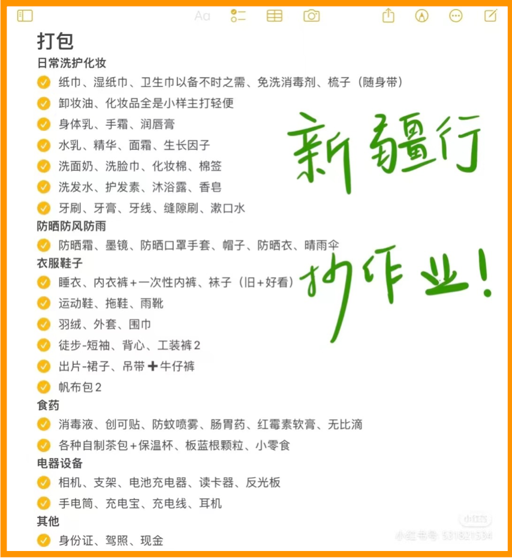

省流版：短袖、长袖、防风、

防晒、薄羽绒服都带上。

（而且只要搜新疆 衣服，内容都是这样的

但实际上，我们是去南疆和吐鲁番，

夏天热得不行。

我第一天就把所有厚衣服都寄回来了hhh

那边什么情况呢，

比如吐鲁番，又热又干。

连绵不断的火焰山，真的让人想起西游记！

我用了防晒衣、帽子和 SPF50+++的安耐晒，

一天喝八瓶水都能汗流完。。

晚上八点把衣服洗了挂在窗前：

是的这是晚上八点美好的阳光！

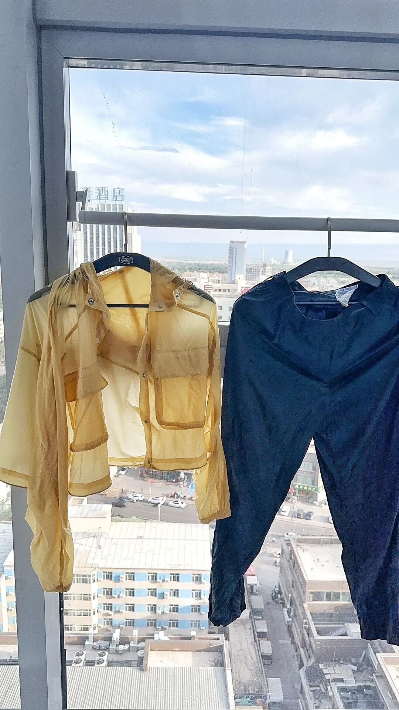

吃完饭回来就干透干透了。

令我想起统治我们所有人童年的阴影照片：

楼兰夫人。

感觉把我晾那，我也能干！

（哈哈哈哈图当然不放了！你懂的～

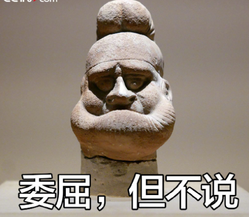

后续去了库尔勒和轮台，

也是完全不需要什么厚衣服。

城际间我们坐了绿皮火车。

强烈建议，几个小时那种，

也买硬卧，下铺。

硬座，估计坐惯高铁的朋友都坐不来。

坐绿皮火车一定要来标配的泡面！高铁是不允许售卖的hh

租车自驾，小红书上主要都是商家账号，

我试了到库尔勒当天搜点评，

便宜热情又好用！

不过租车就是坚持要看到车子的保单，

这个留意哦。

至于吃，那是真的非常非常好！

好到不需要小红书hhh

这个在轮台村里随便吃的烤羊肉串，

果园朋友说不好吃，太老。

可是，我吃出了老羊的草饲味！

在库尔勒，南疆巴州首府，

吃了自称「天山第一馕坑肉」。

这个按公斤称的小羊肋排，

哦真的，我在饱得不行的情况下吃了两根！

这大凉皮，

我跟着吃了两碗。。。。

当地华丽的大盘鸡：

里面的新疆土豆好吃就别提了！！！！

因为汉族饭馆子，鸡都不去皮，

用的是库尔勒香梨果园走地鸡。

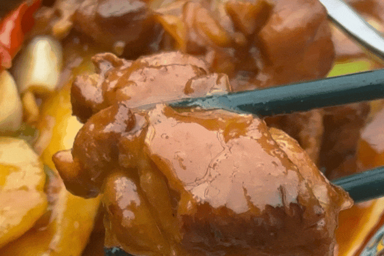

你看这鸡的大小，

据说是七八斤，

如果我跟它碰到。。。

估计不一定打得过它！

吃了一半居然下了大雨，

果园朋友说：这场大雨真的对梨好！

感谢你们带来大雨！

至于水果，

当地的种植水平并不算高。

轮台这里的小白杏基本上是两千年的野杏子，

近几年才有些果园管理，

但是就能像蜜一样甜。

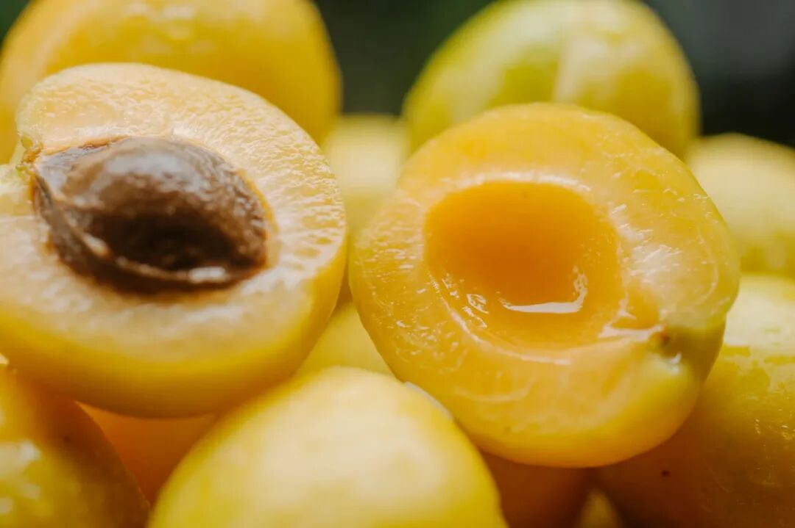

它厉害在于地处天山边的一片绿洲，

有很多雪水融化的地下暗河。

水源丰富，雪水又能在夜间降低地表温度，

因此昼夜温差大，

所以轮台产区的小白杏，

比新疆其它地方的都甜！

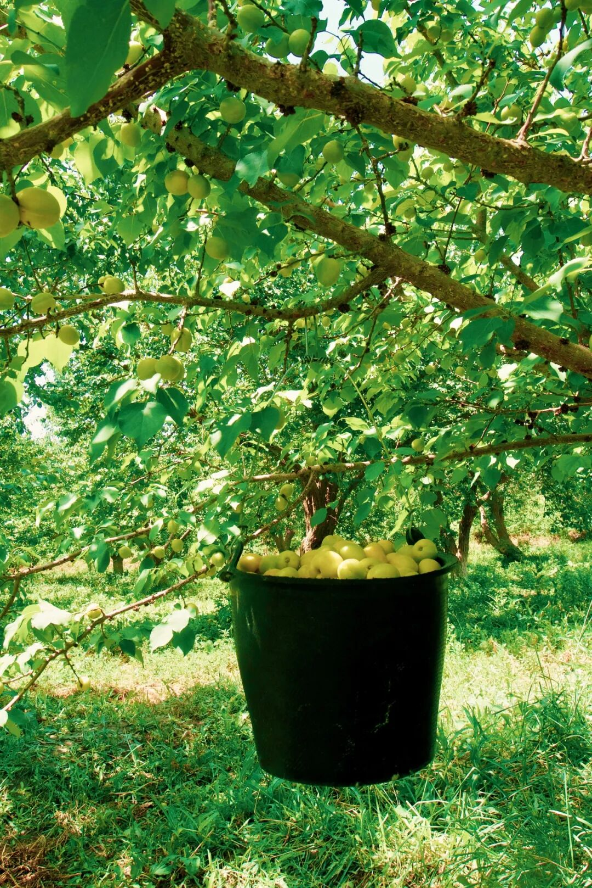

但这个完全靠天赋吃饭。

我试了他们大棚种的葡萄，

比上海的水平真的差很远。。。。

目前就很期待吐鲁番地区的露天葡萄，

他们叫「陆地葡萄」，

下个月才上市！

回到乌鲁木齐，

也感受了一把天赋的力量。

我看到一家砌了圆炉烤匹萨的店，

就去了。果然很棒！

面团都是自己发酵的，

想想新疆人民做馕的丰富经验！

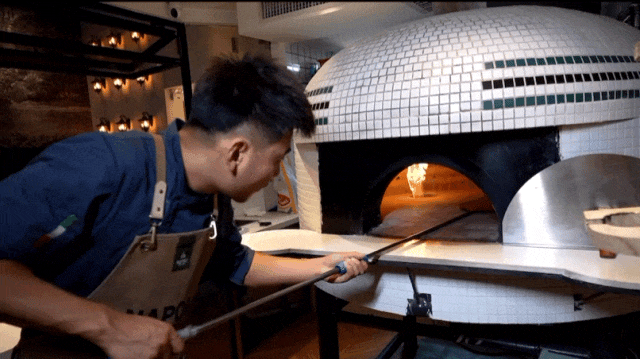

图源：点评商家上传视频

但是好吃到瞪眼睛的，

是一个当地水牛奶发酵的布拉塔芝士，

哦牛奶之地啊啊啊啊啊啊

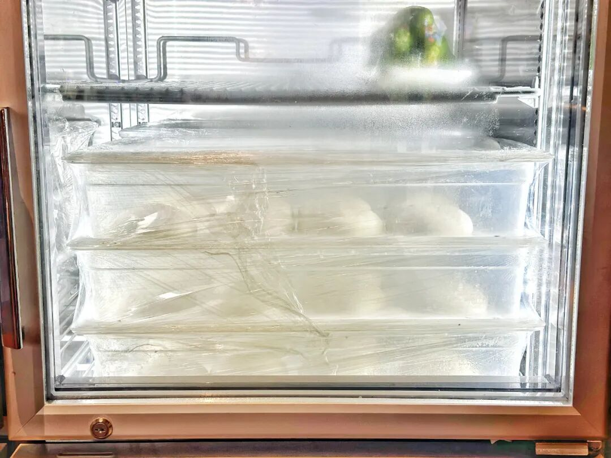

点评竟然没人传图。。是大家都没意识到的好吃吗？？？放个店内面团发酵柜吧

在酒店酒廊开了一瓶蒲昌酒庄

2018 年的 muscat，

超级天赋选手！

常温喝就有浓郁的奶油味和杏子味，

酸度也极佳。

反倒冰过了后味有点发苦。

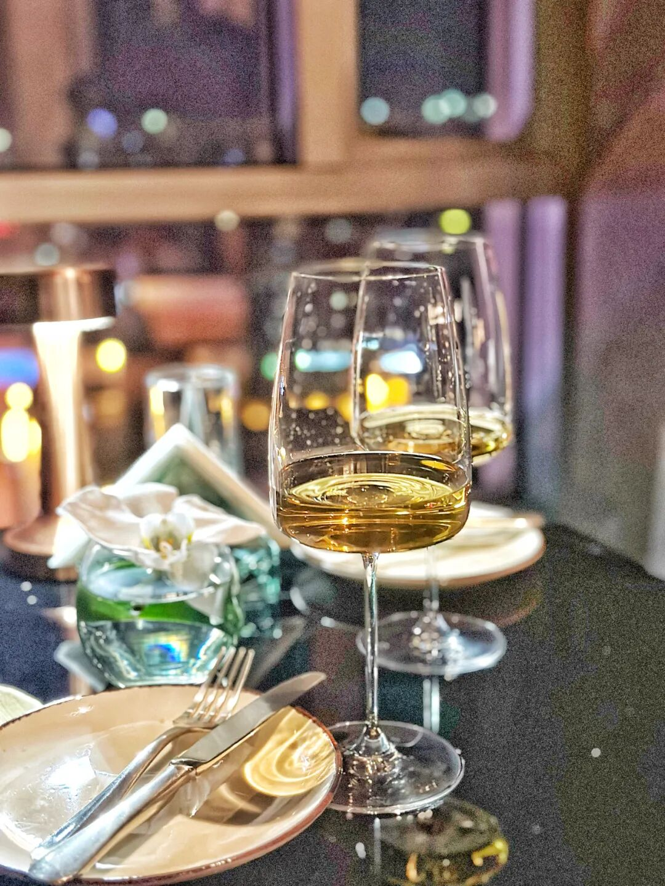

怎么这是适合田间地头掏出来的酒吗？

好向往，

这个酒庄下次想去！

薯角和我们分手后，

去了《我的阿勒泰》所在的伊犁州，

这个季节，北疆真是气候宜人！

而且确实很瑞里瑞气哈哈哈

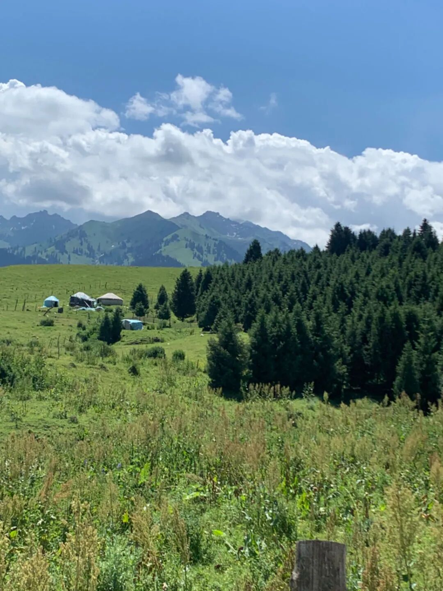

南疆沙土很大。。。

但伊犁这边随便一逛都是这种美景。

所以这个标题，大家也知道红里红气的，

实际上新疆很大大大大，

可能和瑞士媲美的就是一小带～

秋天还想来！

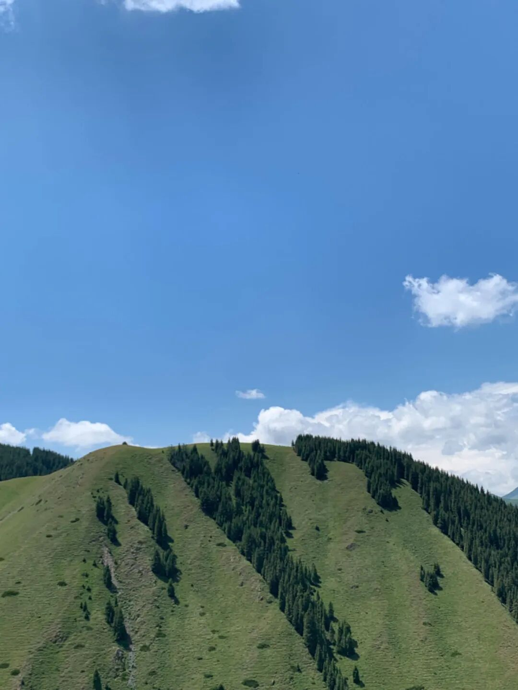

还是那句话，

小红书作为搜索引擎很合格，

但是大家务必小心标题党，

搜的时候一定要细化关键词哟～

题 外

哈哈哈哈本薯作为小红书受害者（不是要愤然检举，如果你搜「不是瑞士去不起」，可以在红书上搜到无数怪地方，包括北京郊外一处破公园。本薯被「小瑞士」骗去了，结果全是人造草皮和大黄山坡？？？？

但，公费出差新疆，还有老板写稿子，本薯有啥抱怨的？？？？？既然是新疆就卖小白杏呀～
替你们远赴果园看过了，天山脚下轮台核心产区，雪水流过这片土地，几乎是两千多年来野生的杏子，
这两年才有些种植管理。但是因为温差大，土壤肥，就是甜！
轮台小白杏，一包杏子一包蜜！

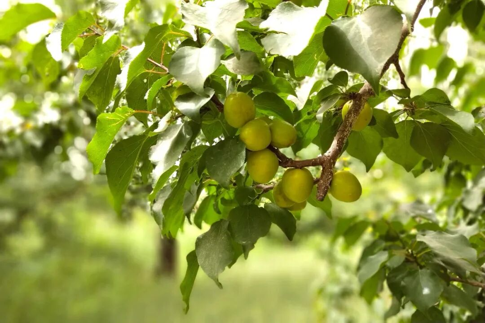

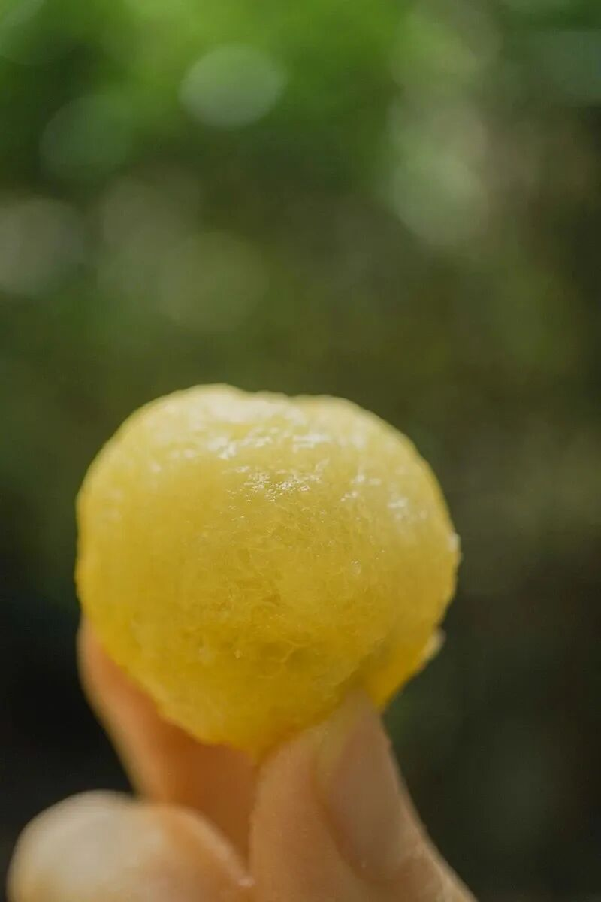

饱记·新疆空运轮台小白杏 86 折！！购买方式：点我点我点我

本文的研究员

闻 佳

就是那个研究院嘴里「挑剔的老板」。

关于食物，不是比你懂得更多一些，只是比你花了更多的冤枉钱。

用好吃的方式吃一生

祖国各地好风物

文章转载请加微信「baojiclub」

