# 不用算，双十一懒人清单直接买

- 原文链接: https://mp.weixin.qq.com/s?__biz=MjM5NTYxODQyMA==&mid=2653461432&idx=1&sn=77a99f4bba1a867a71aadedc087ee132&chksm=bcaa95d189b30d334378bf1761527f7204fd6f4c290632f9272908989c44214b1211dde89cd3&scene=27#wechat_redirect
- 浏览量: N/A
- 点赞数: N/A
- 评论数: N/A
- 转发数: N/A

## 正文

真刺激啊

一个尽情安利自我的公众号

以下是没事干研究院的风物研究报告请放心食用

朋友们，

这双十一它又来了！！！

最后一波，

不管平台咋整，总之：

天🐱：今晚 8 点满 300-50，

小🍊序：直接全年地板价！

现在买就是最划算！

你们要抓紧薅老板羊毛啊！

1.煲饭炒菜零食无所不能唇齿留香的「饱记手工腊肠」

要说最简单易得，
能让普通食材瞬间闪闪发光的厨房伴侣那我就得为饱记腊肠发声了。

做煲仔饭。
米粒被腊油浸染得油光水亮
咸鲜香喷喷，忍不住口水直流……

炒青椒。都不用放油，逼出黑猪肉的油脂，
把青椒炒得爽脆鲜香。也是妥妥的米饭刺客。

甚至简单蒸一下、煎一下，香料混合油脂香，不停地往你鼻子里钻👃入口微甜，咀嚼间肉汁喷涌！

果然啊~
肉肉就是全世界最美妙的食物！
(¯﹃¯)

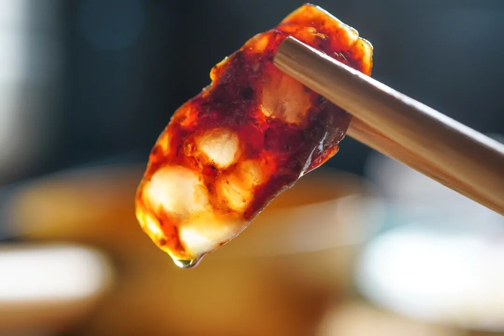

当然，饱记腊肠的好吃，
是有迹可循的。用的都是真材实料，吃过的老客都知道。

经过十几次调配后
才做出我司独有配方的广式腊肠广府糖酒风调味，吃起来有丰腴酒香，带着微微回甜。

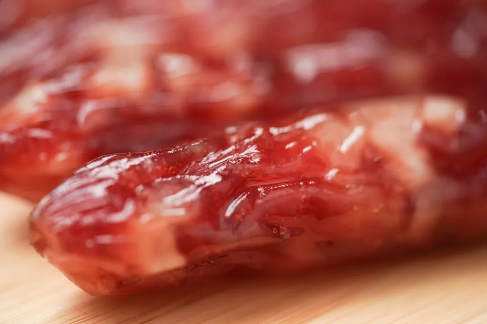

还能选肥瘦。
「酒香腊肠」是二八的肥瘦比例，瘦肉含量高，口感十分爽脆，酒香感也更浓郁。

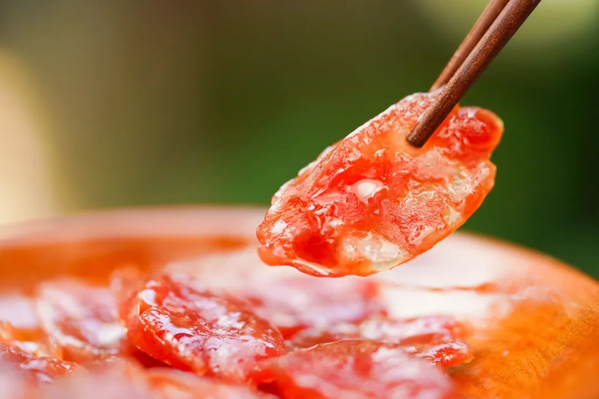

「油润腊肠」则是四六肥瘦比，油润不腻，炒菜或者焖饭都很棒。尤其配着锅巴吃，香到上头！

后来，我们又想吃得口味更重更辣一些，
就研发了一款滇味腊肠。自带鲜麻香辣，做煲仔饭都不用淋酱汁，只用撒上一把小葱就十分够味🌱

饱记·手工腊肠

购买方式如下👇

双十一同价 9 折！！

三款口味，各有各的特点。

用的黑猪肉、天然肠衣、玫瑰露酒...

酒香腊肠，酒香浓郁，

有四六和二八这两个肥瘦比例可选。

滇式腊肠用了不少贵价的辛香料，

同事说超适合拿来做西班牙海鲜饭，

试过加辣肠后升华了。

戳图下单购买👇

或🍑🍑🍑搜索

「艾格吃饱了」

卷生卷死的玫瑰露酒腊肉也回归啦~

用沁香的玫瑰露酒，腌制带软骨的五花肉排，各色风味平衡得恰到好处。
真不愧是广东人的心头好~

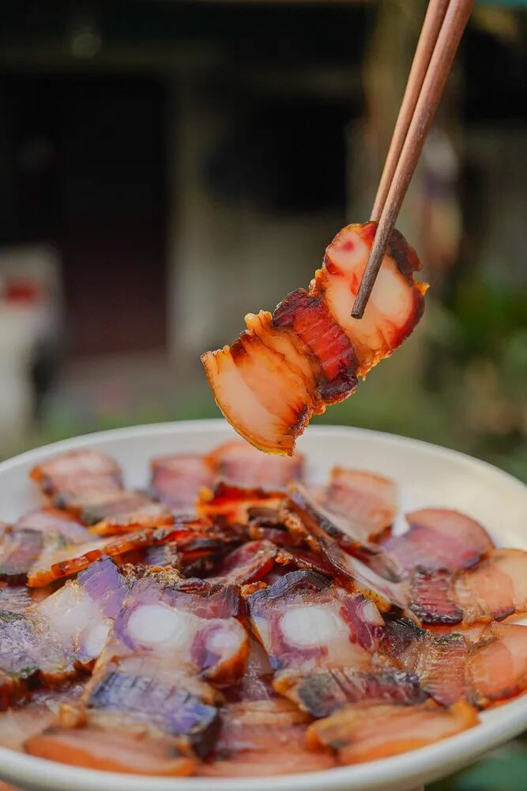

用来蒸米饭就足够好吃。
腊肉随着蒸汽，将咸香渗进颗颗饱满饭粒，轻松两碗打底。

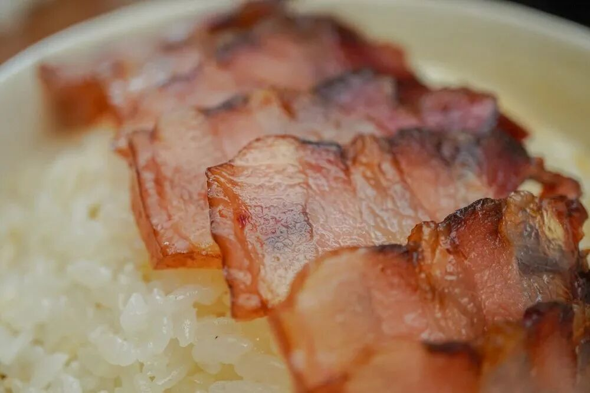

带着木质烟香的烟熏味，包裹着花香、肉香、酱香、酒香，好吃得让人频频点头。

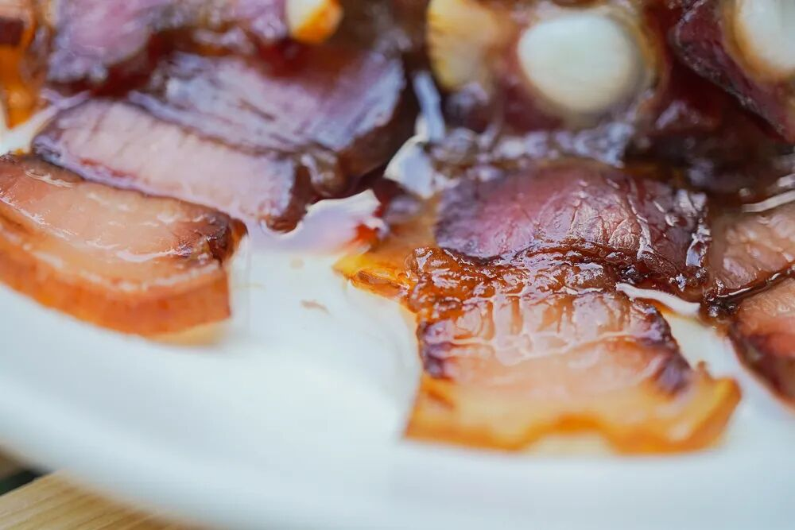

非常推荐把饱记的腊肠腊肉，
一起用来做双拼煲仔饭。那个迷人的香气和滋味啊，真的是好吃到想把头埋进锅里！（详细做法可以戳这里 👉🏻 一锅煲仔饭

为什么说饱记腊肉也很卷呢，重点就在于，腌肉用的玫瑰露酒。
找了好久，
才选中天津老字号金星的玫瑰露酒，花香酒香协调且纯正。同时也意味着，和市面上用普通白酒的商家相比，
饱记成本倍增。

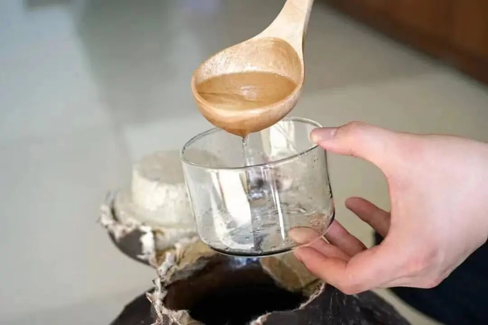

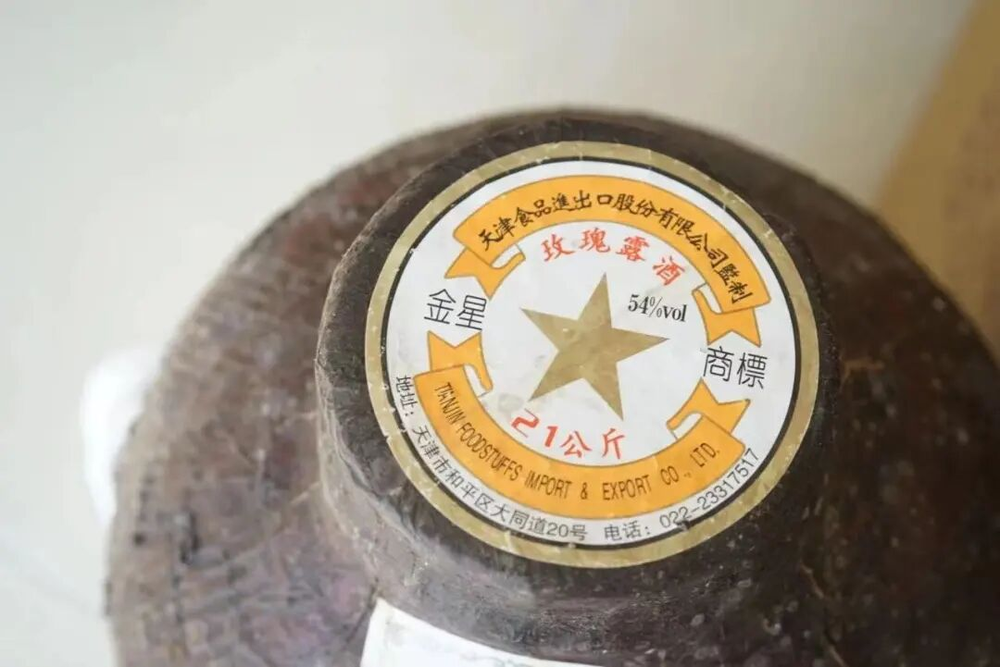

也是和广东白天鹅酒家叉烧增香用的同款。

深秋里第一份

地道云南腊排骨

云南丽江有专门吃腊排骨锅的店，

汤浓味鲜。

感觉可以和辣火锅、牛肉火锅

并为冬天的三大火锅

饱记的腊排骨，

是跑山土猪新鲜制作的。

肉质鲜嫩，经过手工细心蒸烤，

煮出汤来腊味十足。

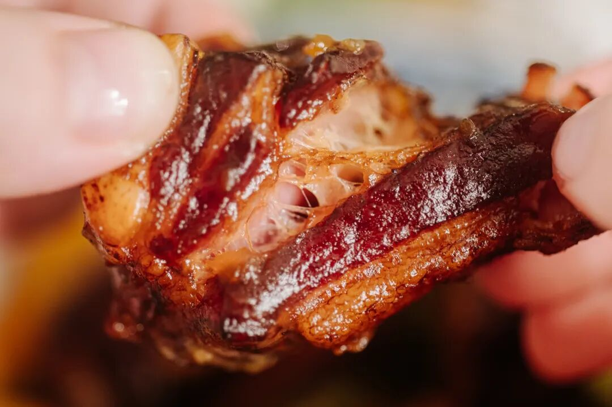

把腊排骨放锅里炖煮 1 个半小时，

直到炖煮到这样的浓汤。

加入韭黄番茄大葱玉米，

腊排骨的汤底就完成了！

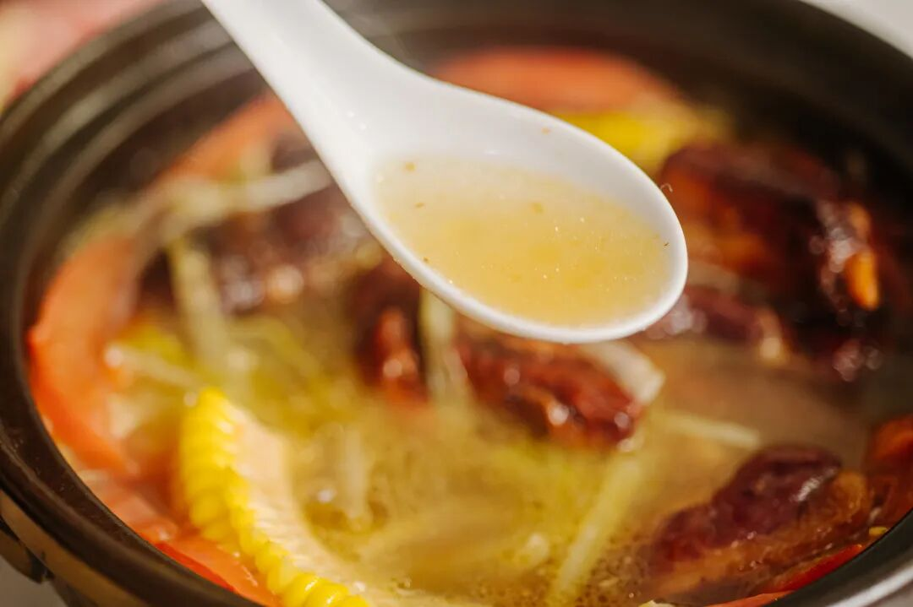

或者直接大蒜叶一炒，

和土豆刀豆一炖。

几个菜都大获成功，

简直日常下饭神器！

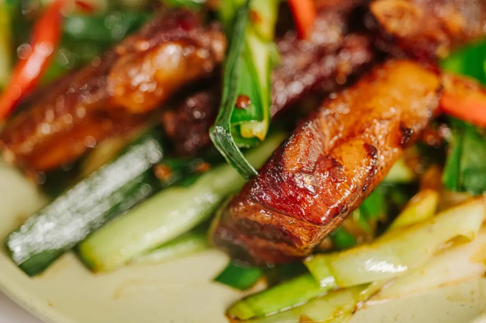

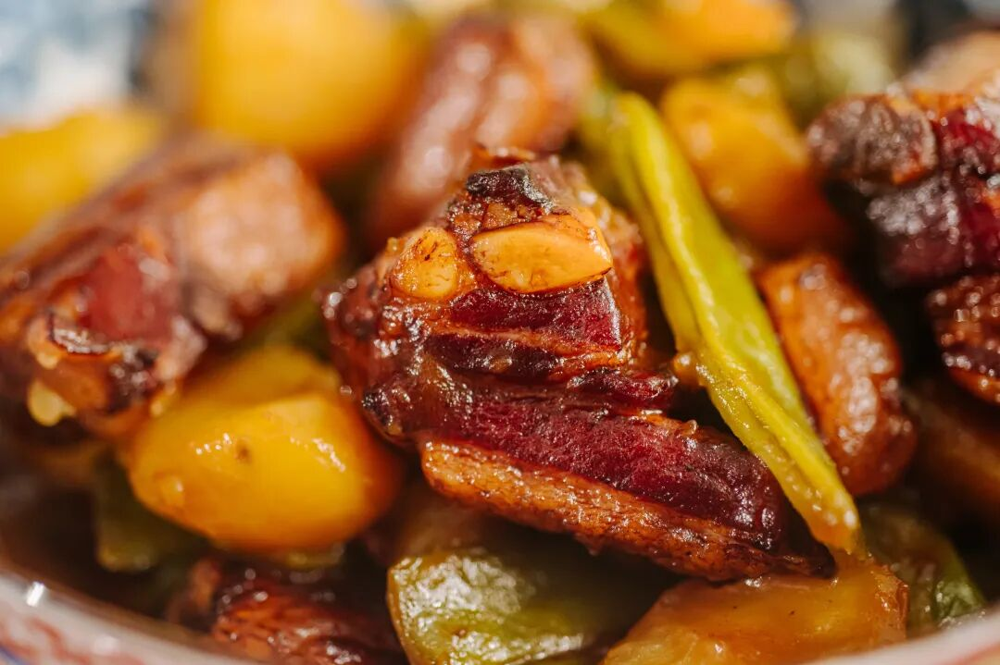

饱记·玫瑰露酒腊肉&腊排骨

购买方式如下👇

双十一同价 9 折！！

戳图下单购买👇

或🍑🍑🍑搜索

「艾格吃饱了」

太湖流域的精挑大闸蟹！

蟹肉微微带甜

常年蹲守包邮区，

在大闸蟹这一风物上，

我司有话要说！

为了搞蟹，

老板拎着同事各个产区不停比对，

默默整了八年之久，

一心想找那种只只都有品质保证的好螃蟹。

剥开后又鲜又甜，膏黄香气汹涌👇

来自太湖流域的精挑大闸蟹，

属包邮区顶流口味！

老板说，在江浙沪买蟹，

有时候看到的和收到的完全两码事。

我司的信誉，有盛泽当地村里的书记保证！

为了给村民谋福利，

书记不时就去帮咱们亲自视察和监督，

给到大家品质保证。

「每一只都要挑选，确保万无一失」。

（书记原话👆

苏州吴江盛泽，

属历史悠久的太湖流域水面。

要知道，

真正的太湖湖底已经禁养，

市面上所谓的阳澄湖大闸蟹

则很多都只是在岸边挖泥塘来养！

绝对没有这种天然湖面养出来的好吃！

饱记指定 3000 亩湖面，

活溪入水，清水整湖放养。

是正宗的清水大闸蟹，

不容易有土腥气！

这里的水深 2.5-2.8 米，平底锅型硬质湖底，

与阳澄湖底类型近似👇

上岸的螃蟹，

都得再养几天，

喂一喂玉米、小鱼，

让螃蟹把苦水都出来，

成本上去了，

但养出来的蟹就很有一番鲜甜滋味。

还得经过几番精挑！

我司只要最优秀的前 10%，

壳一定要硬，

证明脱壳已经有一阵时间了，

里面的肉才饱满鲜甜。

人工一只只慢慢看。

确保每一只都腴美非常，

才能发货给到大家！

（像这样👇

悄悄放句狠话：

即使是真正的阳澄湖底、太湖底大闸蟹，

也没在输的！

除了少量死蟹，

（签收时联系客服按只赔付

没有风味上的差评！

什么蟹王府、王宝和，老板通通试过，

我司挑的就是包邮区顶流大闸蟹美味，

蟹肉微微带甜，

包好吃！送人包体面！

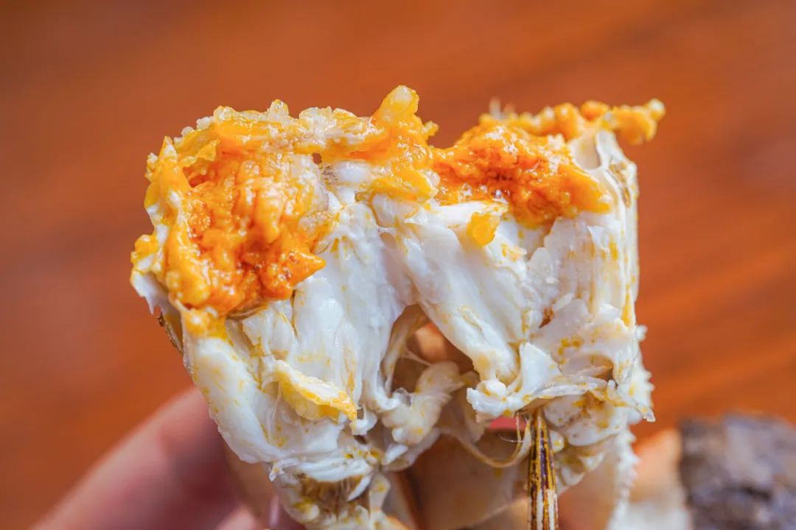

饱记·太湖流域大闸蟹

购买方式如下

双十一同价限时 86 折

戳图下单购买👇或🍑🍑🍑搜索「艾格吃饱了」

同样成熟了的，

还有宝藏小产区性价比之选！

淮安洪泽湖大闸蟹，

已经是口碑第七年啦！一贯的饱记标准，酒店级品质，20年挑蟹佬精选。

总结来说，就是好吃，不贵，猛吃不心疼！（保价双11，买贵退差

饱记·洪泽湖大闸蟹

购买方式如下

双十一同价限时 86 折

戳图下单购买👇或🍑🍑🍑搜索「艾格吃饱了」

口碑十一年！

打遍天下无敌手的山核桃

我司山核桃！

给它排到这里，

纯粹因为这产品稳到不必多说。

都是今年刚炒的新货，

数量有限，先到先得，

现在单罐 9 折双罐 8.3 折

好吃！靠谱！划算！

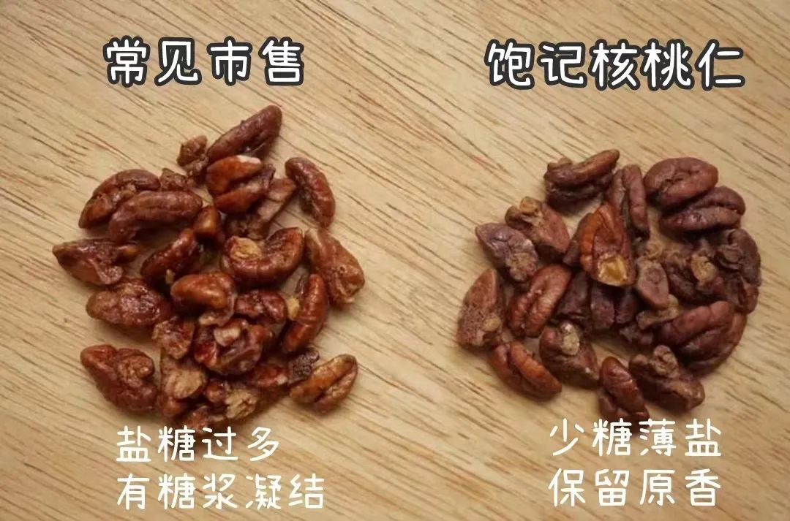

饱记·临安山核桃

双十一同价

单罐限时 9 折！

双罐限时 8.3 折！

戳图买它👇

或到🍑🍑🍑

搜索「艾格吃饱了」

外面买不到

一斤金桔一斤酒

这瓶金桔蜂蜜酒，

同事跑了多趟广西和四川才整出来，

一斤融安金桔才能换来一瓶酒，

真材实料，

外面根本买不到（叉腰

饱记·金桔蜂蜜酒购买方式如下双十一同价限时 76 折！！
正宗融安滑皮金桔，融入四川本地产土蜂蜜，
浸皮萃取，带来浓郁柑桔香气。
入口回味悠长，还有金桔的微微辛辣感，好喝得不得了！

戳图买它👇或到🍑🍑🍑搜索「艾格吃饱了」

还有水果三种！

正当季的丑苹果、青森苹果和库尔勒香梨，来自云南的蒙自西北勒小苹果。
甜中带有酸度，果味极其浓郁，甚至还有溏心！

喝天山雪水长大的新疆库尔勒香梨，又甜又润，嫩得连皮也能吃！

声名在外的青森苹果👇

源于日本青森县。

多亏了勤劳的山东人民，

成功将青森苹果引进种植！

风味不改，

但价格却实实在在打了下来

又水灵，又甘甜，

还像水蜜桃一般芬芳多汁，

一口咬下去汁水四溢～

都有双十一同价限时 86 折！！

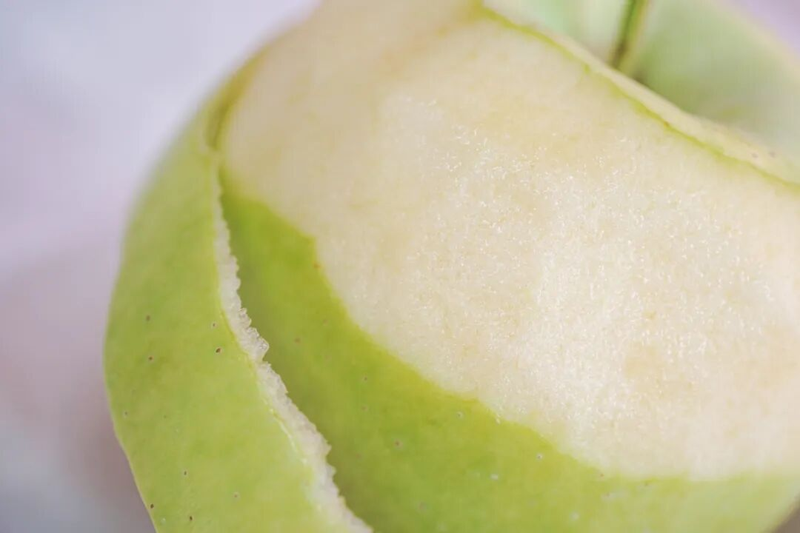

饱记·西北勒小苹果购买方式如下双十一同价限时 86 折！！
戳图买它！！👇
或到🍑🍑🍑搜索「艾格吃饱了」

饱记·新疆库尔勒香梨
购买方式如下双十一同价限时 86 折！！
戳图买它！！👇或到🍑🍑🍑搜索「艾格吃饱了」

饱记·青森苹果

购买方式如下

双十一同价 86 折！！

戳图下单购买👇

或🍑🍑🍑搜索

「艾格吃饱了」

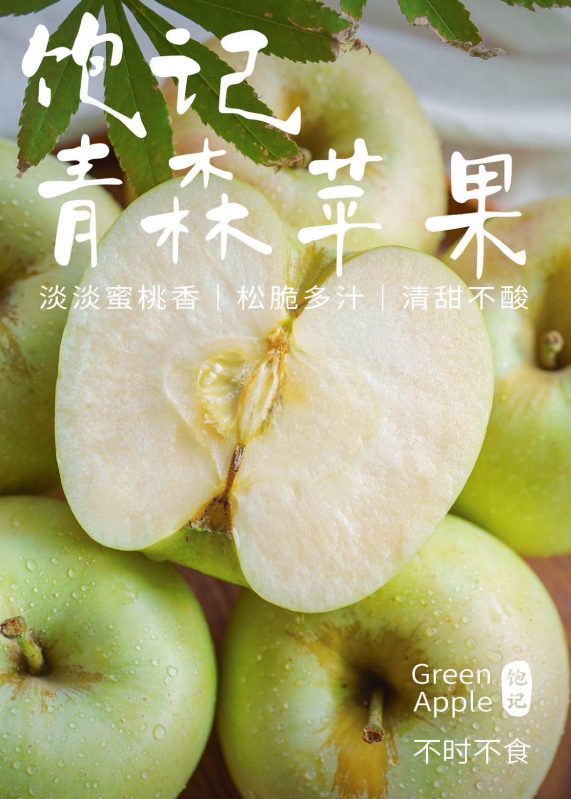

以上时令好风物，
直接戳图片就能买！不怕麻烦的就点开🍑🍑🍑趁满 300-50，薯角我之前就算了7 个购物车出来，今天再抄列一次！有些东西约等于不要钱，

PS：这里说的不要钱，只是相对于原价来说，指的是天猫大促凑单满减折扣，真正拍下还是会显示支付金额的～
1. 「山核桃不要钱」购物车

简单明了的优等生作业在此👇

搭配着买山核桃等于白送。

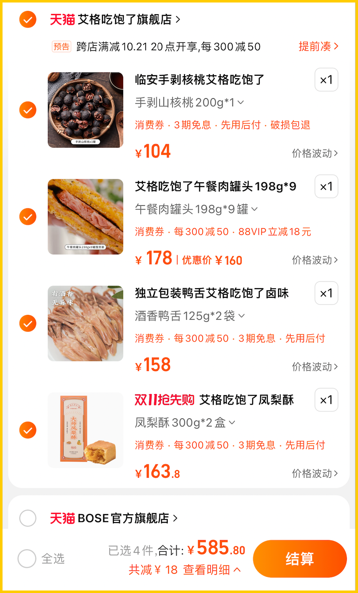

2. 「桂花乌龙不要钱」购物车

三款搭着买，

桂花乌龙等于白送👇

3. 「蒙自小苹果不要钱」购物车

配上厚切猪肉片、山核桃，

还有大师凤梨酥、桂花乌龙一起买，

优惠满减下来，

约等于蒙自西北勒小苹果不要钱👇

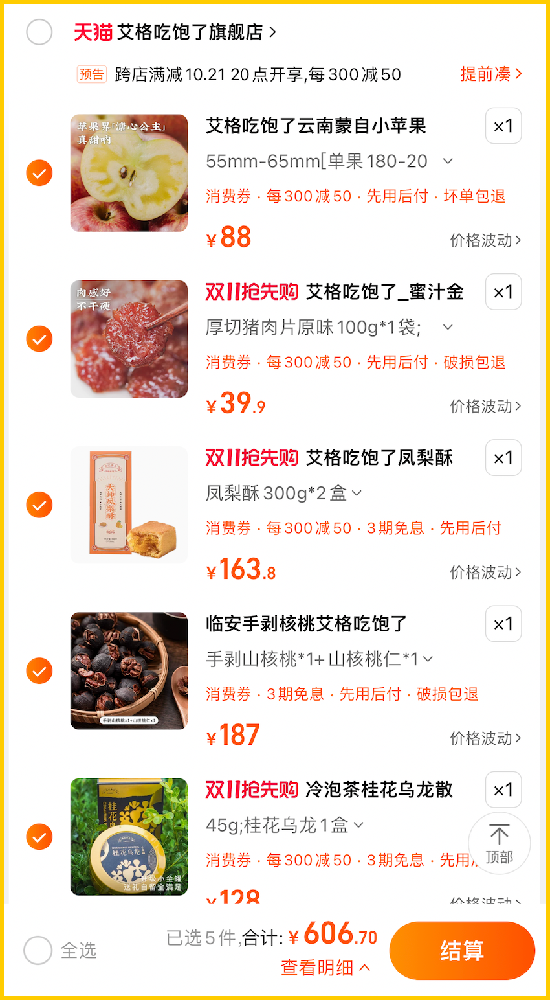

4. 「云南绿籽石榴不要钱」购物车

香脆得根本停不下来的猪肉纸和小麻花，

加上我们的老伙计山核桃、桂花乌龙，

以下这个购物车，

8 斤云南老树绿籽石榴不要钱！👇

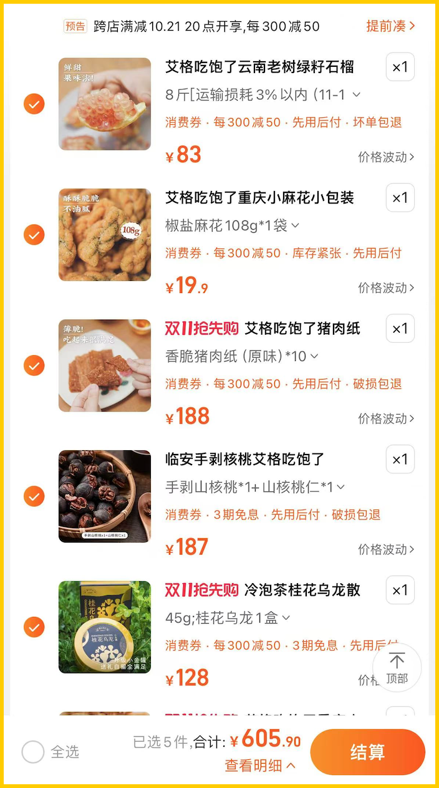

5. 「柚子小种红茶不要钱」购物车

搭上前面提到的厚切猪肉片、

桂花乌龙、山核桃还有大师凤梨酥，

直接省下一盒柚子小种的钱，薯角我都给你算好了👇

6. 「酥酥蛋卷、黄金柚条不要钱」购物车

正式进入我们的零食囤货环节！

搭配着必吃榜的山核桃一起买，

蛋卷和黄金柚条都不要钱！

爱零食的可以闭眼入！

7. 「两袋麻花不要钱」购物车

和山核桃、陈皮小话梅一起买，

都是无负担的小零食，

算下来两袋麻花不要钱👇

给你们指路完毕！

再说一次：

直戳小🍊序购买

或者去天🐱凑单都可以！

想在哪里买都行，

早买早享受！

本文的研究员

薯角腊味真香啊

用好吃的方式吃一生

祖国各地好风物

文章转载请加微信「baojiclub」

