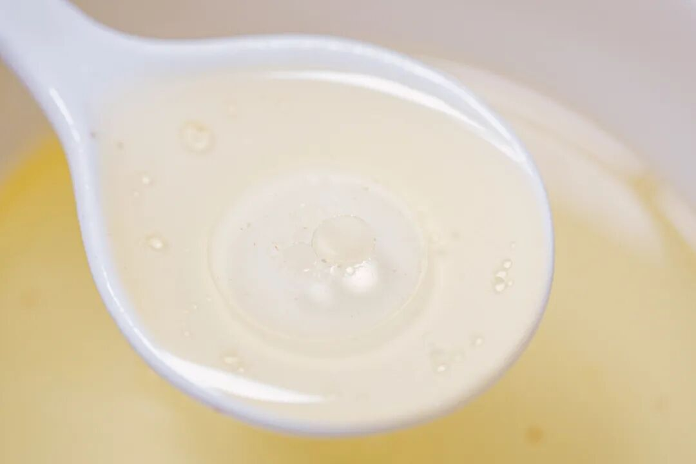
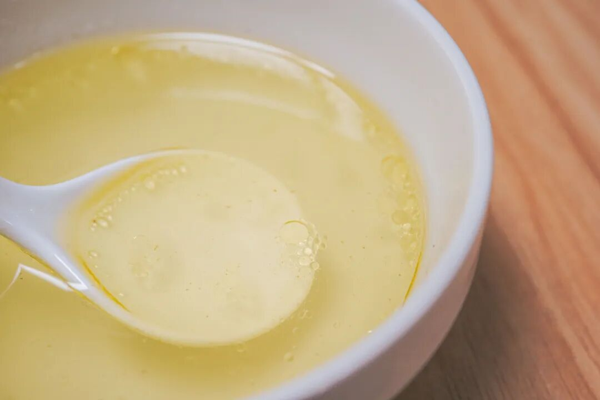
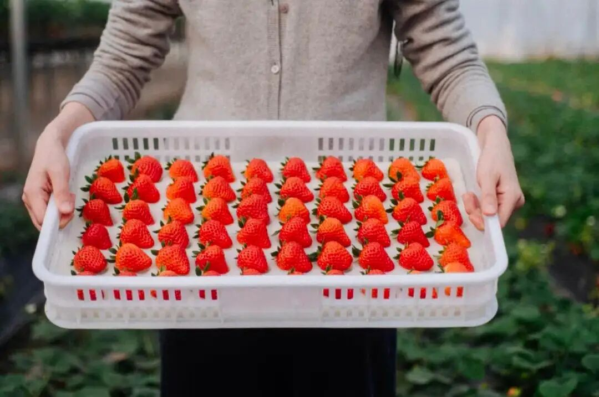
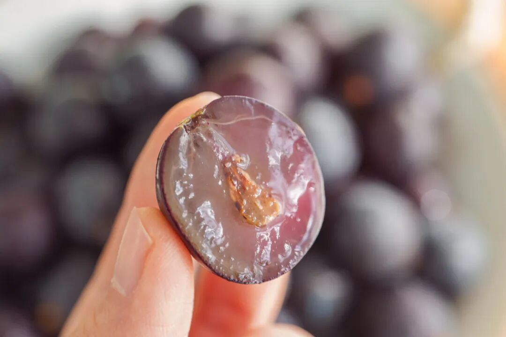

# 不管在哪里过年，这份清单都用得上

- 原文链接: https://mp.weixin.qq.com/s?__biz=MjM5NTYxODQyMA==&mid=2653465776&idx=1&sn=f3704d95fc02e79822cc4371125f8fb9&chksm=bc1dbaaa60e1df3b07625d06701663a8957bb034d749006438085a1a3a4d28a4ca2ec80a3eb4&scene=27#wechat_redirect
- 浏览量: N/A
- 点赞数: N/A
- 评论数: N/A
- 转发数: N/A

## 正文

放假倒计时

一个尽情安利自我的公众号

以下是没事干研究院的风物研究报告请放心食用
自打进入这周，
本薯每天都在工作日倒计时

年味越来越重，假期吃什么，差不多也是时候打算起来了！今天一鼓作气！（不摸鱼了给大家来个长串清单啊啊！

首先是！这只家人朋友都会满意的鸡！一年只此一季，逢年过节，煲鸡汤一绝！

年前最后一批！卖完就没啦！所以自今天开始，

限时开放三天闪购，

26 号起按顺序现杀发货！

抓紧再薅老板一次啊！！

这鸡是什么情况呢？平日里自在得很，田野林间放养长大，只只活蹦乱跳，0 厨艺要求，直接放进电饭煲就香绝，还可以一鸡三吃！

我们合作多年的海南文昌大叔！为了给家人补身体，专养了一批足足 300 日的老母鸡，在当地都少有，
直接用来炖汤，鲜得不得了！我司磨了许久，终于跟他薅来一批，希望全国人民过年都能喝上文昌老母鸡汤啊！

分享一下从文昌大叔那里抄来的
海南当地灵魂吃法！

鸡油捞一碗，可以炒小青菜👇

菜有鸡味，比肉还要甜！

鸡汤装碗里，吃一碗盛一碗，

可以依据口味加点盐哦👇

鸡肉可以手撕吃！

单独买点沙姜末和小金桔，

调一个海南风味蘸料！

吃多少撕多少，

大口又过瘾！

还是饱记标准，均为活鸡现杀，再给大家顺丰空运发货！没有长时间的冷冻和存储，吃的就是一个新鲜！

来！限时早鸟 86 折，这两天下单，

26 号起按顺序现杀发货！

信我！尝它！

饱记·海南文昌老母鸡26 号起按顺序发货！限时早鸟 86 折！！！
戳图购买👇

再到这一口熟悉的流心甜如蜜。

说的正是我司每年冬天销冠王，口碑第九年的饱记·富平流心柿饼是也！你看后台新鲜出炉的好评，
怎么比我薯角还敢写。。。

今年柿饼依旧饱满流心，三种规格，中果款延续了去年的设计，大果款和稀有的特大果款，
更换了新的礼盒装👇寓意好，红得饱满细致，送礼都显得咱大大方方儿的！

市面上富平柿饼众多，不夸张地说，
我饱记始终是第一梯队水平！

历史上也比遍了所有的网购货，

永远赢很大。

今年的对比请看这里👉做完这个测评，我大开眼界。。。

整个过程：挑选顶配柿果👉削皮👉晾晒👉古法揉捏，一共要经历 60 天，这样出来的柿饼才符合饱记标准！相比 40 天的汁肉混合更充分

一枚完美的富平柿饼，特别讲究这绵密的柿子糖霜！这也意味着时间与背后的人工。但我司一向卷生卷死，
力求「打遍天下无敌手」，成本上去了也没在怕的！

马上要过年了，

和家人好友的聚会少不了它，

怎么买，

都有设计同事卷出来的礼盒奉上，

送礼自留两相宜。

囤吧，记得放冰箱里！

上：中果款礼盒装；下：大果款、特大果款礼盒装

饱记·富平柿饼

购买方式如下

新春限时 85 折！！！

戳图购买👇

最后给大家安排一个

水果专场啊！

新年待客岂能没有水果！秉着过节沾沾喜气的原则，给大家薅来一个：

新春地板价 9折大福利！

现在买就是最划算！

1.融安脆蜜金桔
临近新年脆蜜金桔涨价了！主要原因就是我司果园选得太好，
就有渠道都动起来抢大哥的果了。。。

毕竟它是融安县第一个

成功种出脆蜜金桔的果园（母本园），

果园里都是 8+ 年老树，

保证品种纯正果味浓。

老树果园平时都得上锁，以防被盗，这枝条在外一斤能卖 ¥1000！因为非母本园的果子，

就有更大的可能性不甜麻嘴、无水分。

所以这一枚来自广西融安的脆蜜金桔。足以颠覆自小到大的金桔风味印象！不麻嘴，不涩口，
从皮到芯都纯甜！

饱记·融安脆蜜金桔限时吃水果 9 折！！！新年大桔大利！！！
戳图购买👇

2.上海金奖草莓
比丹东草莓还要卷的上海白鹤红颜草莓！
上周起终于降价啦！！

「白鹤草莓」，

乃上海草莓之代表，

被评为「中国农产品地理标志」，

青浦更是当下国内外主要的草莓产区之一。

我饱记选的，拿过上海地产优质草莓品鉴评优活动的金奖！

完全按评金奖要求挑的，

评委吃的啥我们也吃的啥～

（是的，就是这么骄傲！

这金奖草莓，还没有入口，就能闻到剧烈的香气。

咬一口，汁水在口腔里蔓延，

鼻腔同时又被弥漫的香气包裹。

真的会上头。

饱记·红颜草莓限时吃水果 9 折！！！新年莓有烦恼！！
戳图购买👇

3.冬日蜜蜜甜葡萄
来自秦岭脚下的冬日蜜蜜甜葡萄！这个季节里的自然恩赐，产品经理找到的时候超惊喜！

每一颗都是爆汁小炸弹！皮薄肉厚，汁水超级足。

甜度高！糖度可达 17 左右，入口除了葡萄本身的果香，还有一层淡淡的玫瑰香，仿佛往嘴巴里喷了花香水，且留香时间还更长

为了更好地运输，这次还采用了单粒包装，先整串修剪下来，
再人工一颗颗拣选，只挑好果、大果👇到手吃起来更方便啦！

饱记·冬日蜜蜜甜葡萄限时吃水果 9 折！！！新年紫气东来！！！
戳图购买👇

题 外

敲锣打鼓，

千呼万唤的饱记年货礼盒，

天🐱有赞同折扣！

限时单盒立减 58 元！

双盒立减 126 元！

儿时记忆里的年味蛋卷铁盒，

限时早鸟 86 折！

很厉害的海鲜礼盒，

舟山渔场野生海捕，

也有新年限时 86 折！

此外刚补货的 75% 木姜子黑巧克力，

90 天短保质期的大师凤梨酥，

还有补货新到的饱记腊味们，

也都有限时 9 折冲冲！

饱记·年货礼盒

单盒立减 58 元

双盒立减 126 元

戳图下单购买👇

饱记·2025 海鲜礼盒购买方式如下限时早鸟 86 折！！！

戳图购买👇

饱记·新春限定酥酥蛋卷

购买方式如下

限时早鸟 86 折！！！

戳图购买👇

饱记·新鲜到货凤梨酥

限时 9 折！！！
戳图购买👇

饱记·云南木姜子75%黑巧克力

购买方式如下

限时 9 折！！

戳图下单购买👇

或🍑🍑🍑搜索

「艾格吃饱了」

饱记·手工腊肠

购买方式如下👇

限时全年地板价

戳图下单购买👇

或🍑🍑🍑搜索

「艾格吃饱了」

饱记·玫瑰露酒腊肉&腊排骨

购买方式如下👇

限时全年地板价

戳图下单购买👇

或🍑🍑🍑搜索

「艾格吃饱了」

本文的研究员

薯角多吃点，好过冬

用好吃的方式吃一生

祖国各地好风物

文章转载请加微信「baojiclub」

