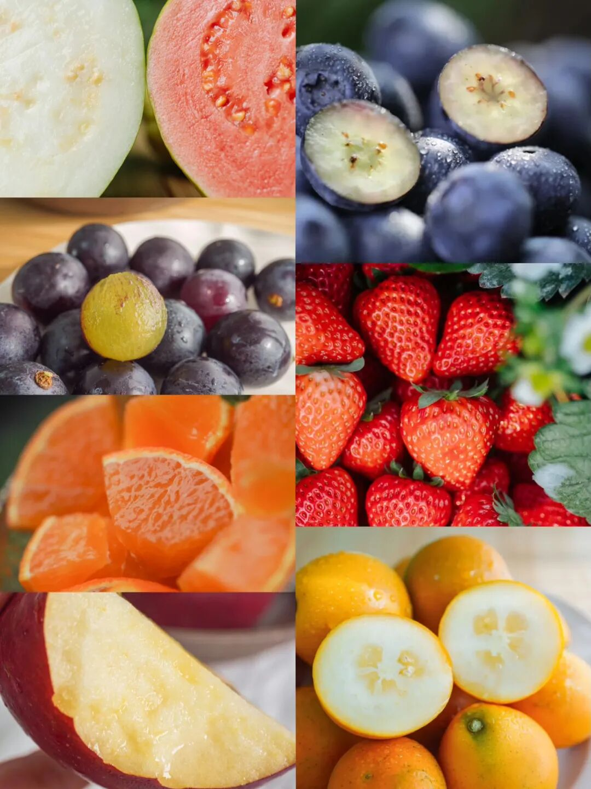
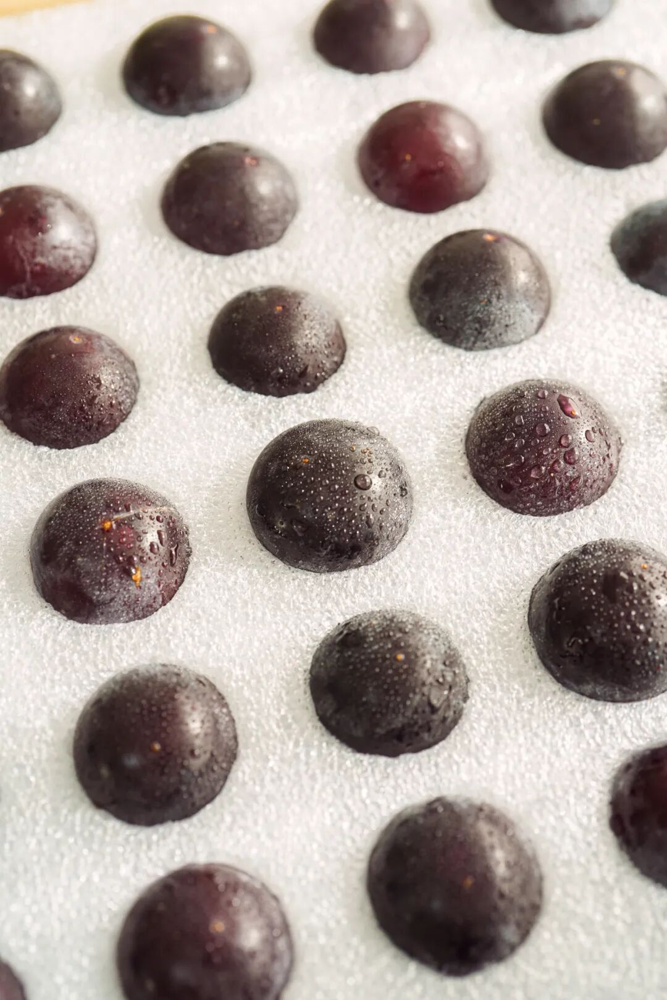
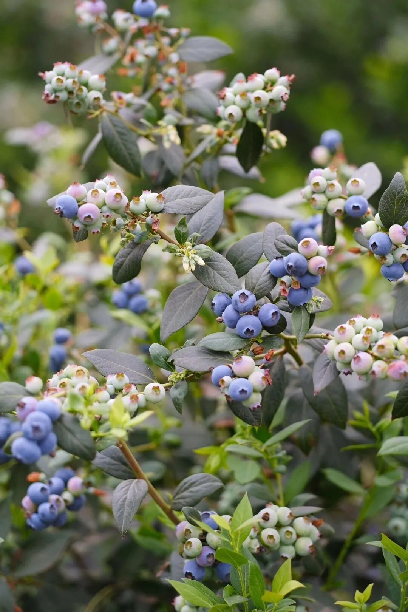
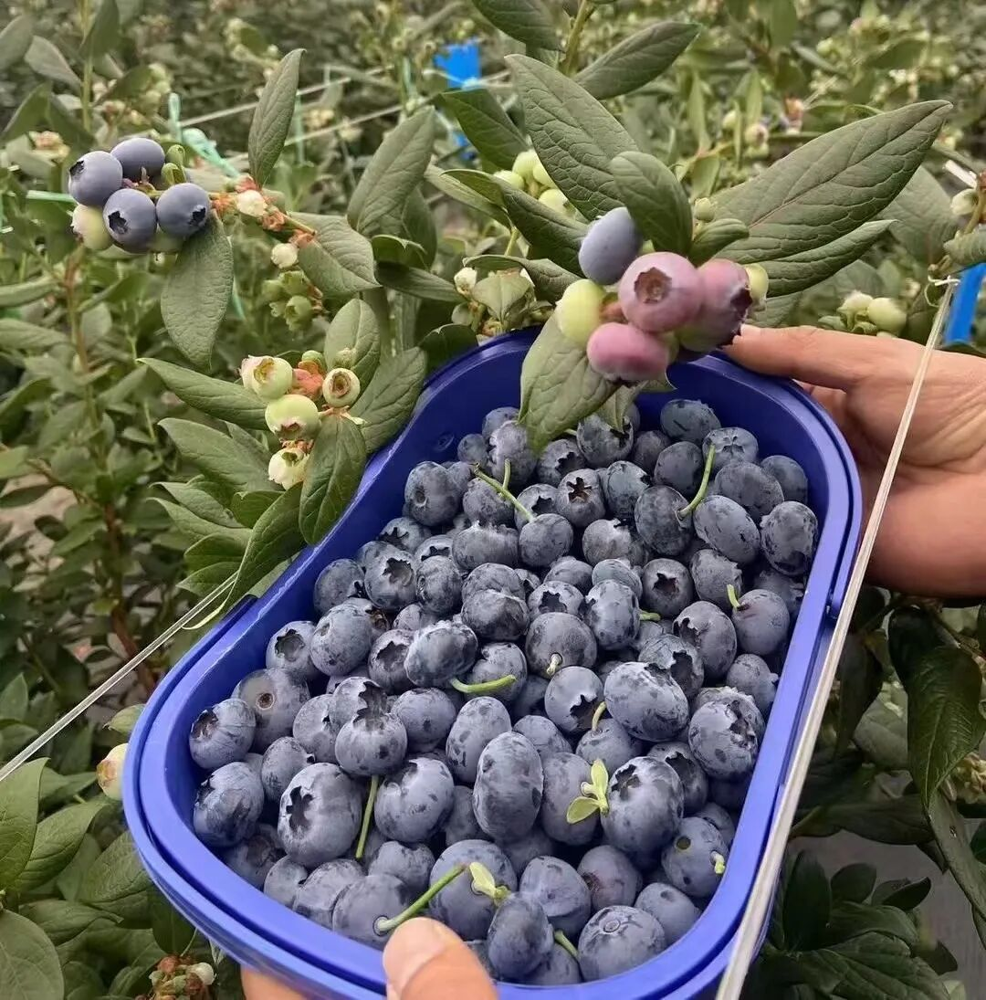
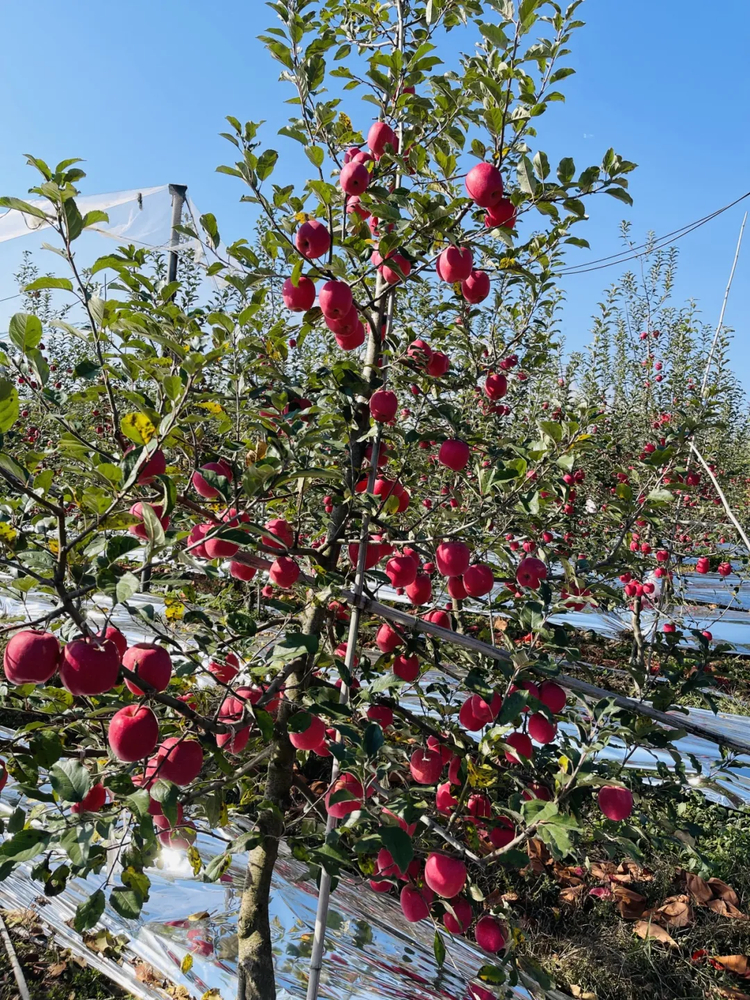
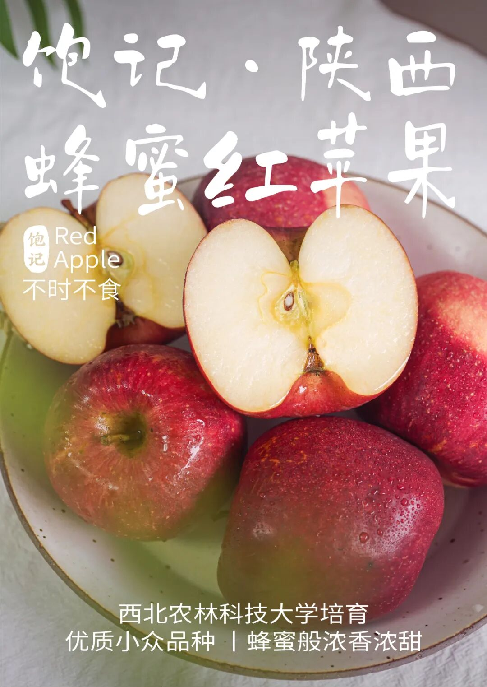
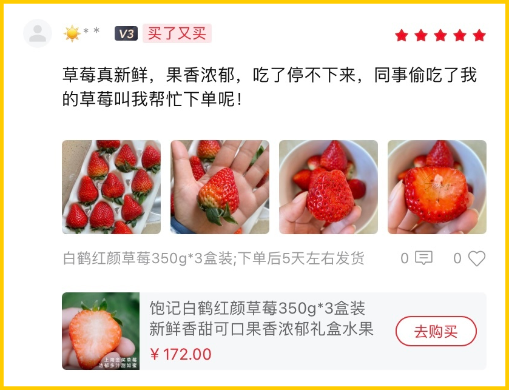
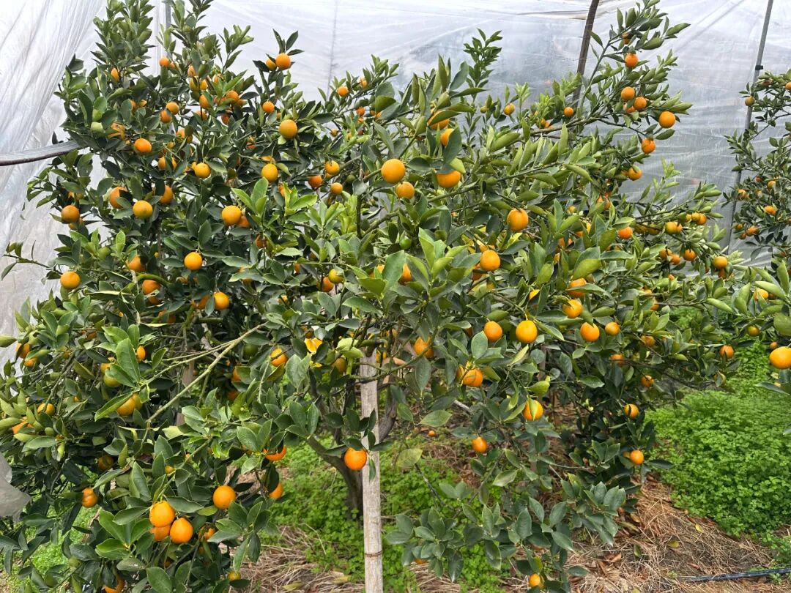
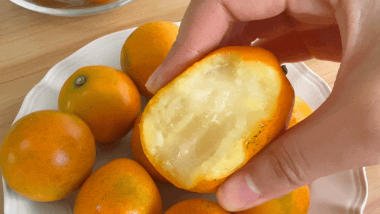
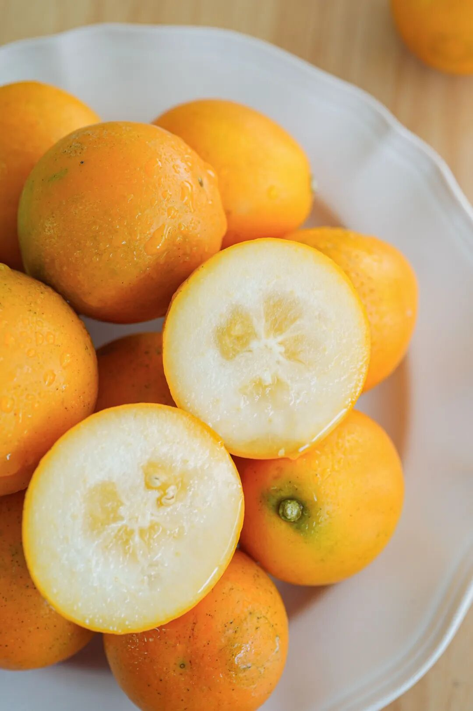

# 世界上最美好的冬日水果店之一（是的，可网购

- 原文链接: https://mp.weixin.qq.com/s?__biz=MjM5NTYxODQyMA==&mid=2653465467&idx=1&sn=a9b7b1cad10c5e80df93eb34fb255a8c&chksm=bc7b6a0691bcb34db70edb5efb410693928a824e841da3eb4bc6ff403c6a2fe5ed076789a4eb&scene=27#wechat_redirect
- 浏览量: N/A
- 点赞数: N/A
- 评论数: N/A
- 转发数: N/A

## 正文

谁给我点个好运来

一个尽情安利自我的公众号

以下是没事干研究院的风物研究报告请放心食用
亲爱的好朋友们，新年待客岂能没有水果！
今天分享欲上来了！给大家安排一个水果专场啊！本薯一举上了三个新

此外金桔涨价草莓降价，大家买起来买起来！

众多周知，我司生鲜水果一向卷到起飞。毕竟谁还不是一个米其林供应商？秉着过节沾沾喜气的原则，给大家薅来一个：

水果地板价 86 折/9折大福利！

现在买就是最划算！

都是倾情推荐，你们把握时机。

1.冬日蜜蜜甜葡萄
来自秦岭脚下的冬日蜜蜜甜葡萄！这个季节里的自然恩赐，产品经理找到的时候超惊喜！

每一颗都是爆汁小炸弹！皮薄肉厚，汁水超级足。

甜度高！糖度可达 17 左右，甜中又带着一丝酸，更显得果味浓郁且甜而不腻～

入口除了葡萄本身的果香，还有一层淡淡的玫瑰香，仿佛往嘴巴里喷了花香水，且留香时间还更长

要知道，冬天有这么好吃的葡萄不容易！感谢田间地头不断钻研的科学家和农人！
这葡萄全程采用科学种植，且施有机肥，老人小孩也可以放心吃哦！

为了更好地运输，这次还采用了单粒包装，先整串修剪下来，
再人工一颗颗拣选，只挑好果、大果👇到手吃起来更方便啦！

老规矩，九分熟发货，大家到手尽快吃！越新鲜越好吃！趁现在限时早鸟价 86 折！来吧！薅它！

饱记·冬日蜜蜜甜葡萄限时早鸟 86 折！！！新年紫气东来！！！
戳图购买👇

2.云南露天蓝莓

哦这蓝莓真的绝了，

我必须要好好说一下！

个头基本都在18mm+，

人工挑选过，

送人也拿得出手。

不过如果你那里气温低于零下三度

不建议拍哦！

首先，

在吃我饱记蓝莓之前，

我是不知道原来蓝莓

是有浓浓花香味儿的！

后来一问产品经理，

才知道我们都是露天树上熟，

当天现摘现发的。。

你们去商场买，

就不可能给到你这个熟度。

要考虑出货周期的。

这都是产地实拍图哦。。。

另外，种植大哥还说了，

蓝莓就算是带点生，摘下来捂个两三天，

一样是甜的，只是脆度上差一点，

普通客人也不会挑剔这么多。。。

但我饱记的客人，岂是普通客人！给大家的蓝莓，就要是外面买不到的新鲜

这款蓝莓来自日照充足的云南高原，

选的是露天果园，物理种植。

无膨大，无催熟， 无农药，

老人孩子都可以放心吃。

对了，新鲜蓝莓表面会有一层白霜。

相当于蓝莓的保护剂，

新鲜的蓝莓才会有哦～

吃之前洗洗就行，不碍事。

饱记·云南高原蓝莓限时早鸟 86 折！！！新年莓开眼笑！！！

戳图购买👇

3.陕西蜂蜜红苹果
这便是来自陕西的瑞香红苹果，嘎嘣脆！入口像在吃苹果味的蜂蜜！一股迷人的浓香和浓甜👇

来头不小，

是西北农林科技大学团队用 20 年时间

培育出来的优质晚熟苹果品种。

拿“富士”苹果和“粉红佳人”苹果杂交而来。

只挑双方的优点长！

所以每一颗都遍体通红，

一口下去果肉在唇齿间崩开！

之前给大家上过云南产区，
这个季节换到陕西产区。

饱记合作果园

由西北农林科技大学团队管理指导哦！

科学种植，物理防虫。

不催熟、不打蜡、不套袋，

让苹果在大自然里自在生长。

毕竟没什么狠活，

老人小孩才能放心吃啊！

入口是那种温柔的脆感，

略微带一点粉度。

所以完全不磕牙！

还是饱记标准，发货前要人工精筛数遍，

淘汰掉次果，

只留大果好果～

上海的干燥冬天，
这苹果薯角我一天炫俩，不怕上火不怕齁甜，润得人心满意足！同样限时早鸟 86 折！一起甜蜜过冬！

饱记·陕西蜂蜜红苹果限时早鸟 86 折！！新年苹苹安安！！！

戳图购买👇

4.上海金奖草莓
比丹东草莓还要卷的上海白鹤红颜草莓！
本周起终于降价啦！！

它又可称之为，看了就想偷吃、吃完就会下单的万人迷草莓👇

「白鹤草莓」，

乃上海草莓之代表，

被评为「中国农产品地理标志」，

青浦更是当下国内外主要的草莓产区之一。

我饱记选的，拿过上海地产优质草莓品鉴评优活动的金奖！

完全按评金奖要求挑的，

评委吃的啥我们也吃的啥～

（是的，就是这么骄傲！

这金奖草莓，还没有入口，就能闻到剧烈的香气。

咬一口，汁水在口腔里蔓延，

鼻腔同时又被弥漫的香气包裹。

真的会上头。

此外，它还品相极佳，个头秀丽，颗颗都饱满红艳，
因为还是饱记标准，每一颗都要经过人工精筛嘿嘿～

大家关心的草莓农残问题，

这一点，请放一百个心！

上海对地产草莓的监管很严格，

是要纳入上海市种植业生产信息管理系统的，

所以都是有据可查，几乎没什么农残。

合作社的果农们说，

自己平时在地里渴了，

也会随手吃点草莓当水喝。

（hhhhhh我一点都不羡慕

最重要的是，如果你和本薯一样生活在包邮区，
这草莓有压倒性的优势！丹东的草莓当然不差，

可能大家不知道，买草莓，

本地能吃到是最好的。

这里主要是运输上的损耗。。。

丹东草莓发货一般在六七成熟，

但是白鹤草莓可以做到八九成熟再采摘发货，

那当然是更软糯更浓郁啦。

（所以大家现在可以打开地图看看距离了。。。

这水果初上市最为矜贵，

现在价格已经帮大家打下来了

大过年的，

再加薅一个限时 9 折，

本薯要折扣不易！

应吃尽吃哇！！！

饱记·红颜草莓限时吃水果 9 折！！！新年莓有烦恼！！
戳图购买👇

5.融安脆蜜金桔
临近新年脆蜜金桔涨价了！主要原因就是我司果园选得太好，
就有渠道都动起来抢大哥的果了。。。

毕竟它是融安县第一个

成功种出脆蜜金桔的果园（母本园），

果园里都是 8+ 年老树，

保证品种纯正果味浓。

老树果园平时都得上锁，以防被盗，这枝条在外一斤能卖 ¥1000！因为非母本园的果子，

就有更大的可能性不甜麻嘴、无水分。

所以这一枚来自广西融安的脆蜜金桔。足以颠覆自小到大的金桔风味印象！不麻嘴，不涩口，
从皮到芯都纯甜！

不是薯角我自夸，看看评论区的真实评价👇（大家会写多写！！！

此乃金桔界的第三代稀有品种，
个头大，我司选定四种规格，最大的 0 号果王大过鸡蛋！
但现在已经卖空了。最小的 3 号中果都有乒乓球大小，自家吃吃或招待客人也没在输嘿嘿～

这果子不仅长得实诚，口感和以往吃过的也都不同，没有入口就让人龇牙咧嘴的桔皮味，从芯子到脆皮都是蜜蜜甜的，且无核化渣，一咬 biu 汁！随手一测糖度都能达 18！

还是骄傲地说，饱记的生鲜水果，是一定要保持所有渠道随便比的程度！我司永远会去卷产地，只卷核心产区的精品果园！

自家吃推荐乒乓球一般的 3 号果，性价比高！多啃不心疼！送礼可以考虑 1 号或 2 号，给朋友一点来自山里的震撼！
给大家吆喝来限时 9 折，买它！！！

饱记·融安脆蜜金桔限时吃水果 9 折！！！新年大桔大利！！！
戳图购买👇

题 外

敲锣打鼓，

千呼万唤的饱记年货礼盒，

天🐱有赞同折扣！

限时单盒立减 58 元！

双盒立减 126 元！

今年冬天的富平柿饼现货了！

年货节限时 85 折！

其他适合空调房吃吃的水果看这里👇

一次尝俩的广西双拼芭乐，

扎实的冰激凌球口感！

还有今年份的象山红美人，

入口似果冻般嫩嫩滑滑～

现在都有限时 9 折！

此外刚补货的 75% 木姜子黑巧克力，

90 天短保质期的大师凤梨酥，

还有刚补货新到的饱记腊味们，

也都有限时 9 折冲冲！

饱记·年货礼盒

单盒立减 58 元

双盒立减 126 元

天🐱有赞同折扣

戳图下单购买👇

或🍑🍑🍑搜索

「艾格吃饱了」

饱记·富平柿饼

购买方式如下

年货节限时 85 折！！！

戳图购买👇

饱记·象山红美人柑橘限时吃水果 9 折！！！
戳图购买👇

饱记·广西双拼芭乐

限时吃水果 9 折！！！

戳图购买👇

饱记·新鲜到货凤梨酥

限时 9 折！！！
戳图购买👇

饱记·云南木姜子75%黑巧克力

购买方式如下

限时 9 折！！

戳图下单购买👇

或🍑🍑🍑搜索

「艾格吃饱了」

饱记·手工腊肠

购买方式如下👇

限时全年地板价

戳图下单购买👇

或🍑🍑🍑搜索

「艾格吃饱了」

饱记·玫瑰露酒腊肉&腊排骨

购买方式如下👇

限时全年地板价

戳图下单购买👇

或🍑🍑🍑搜索

「艾格吃饱了」

本文的研究员

薯角多吃点，好过冬

用好吃的方式吃一生

祖国各地好风物

文章转载请加微信「baojiclub」

