# 东海野生春鲜，矜贵只得十余天（别错过

- 原文链接: https://mp.weixin.qq.com/s?__biz=MjM5NTYxODQyMA==&mid=2653468587&idx=1&sn=ebfff9e2ee08107be5e9ac4c85fa2f23&chksm=bca3f2256705bedae54d81638e991ea8886a60265f1aa87b2a89137f0c1f6af84b856d731f09&scene=27#wechat_redirect
- 浏览量: N/A
- 点赞数: N/A
- 评论数: N/A
- 转发数: N/A

## 正文

春日限时美味

一个尽情安利自我的公众号

以下是没事干研究院的风物研究报告请放心食用
每年春天，本薯都盼着合作多年的舟山船队鲜捕鱼货回港。蟹啊鱼啊只只肥美鲜甜，吃起来爽飞咯！！

春季的东海野生海鲜，真的强烈建议家人们都吃上一顿啊！尤其是包邮区的朋友，当天或隔天收到货吃，体验感甚至可能是超越某些米其林的。

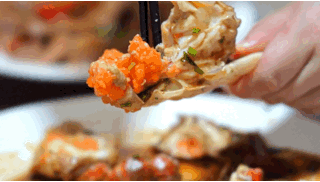

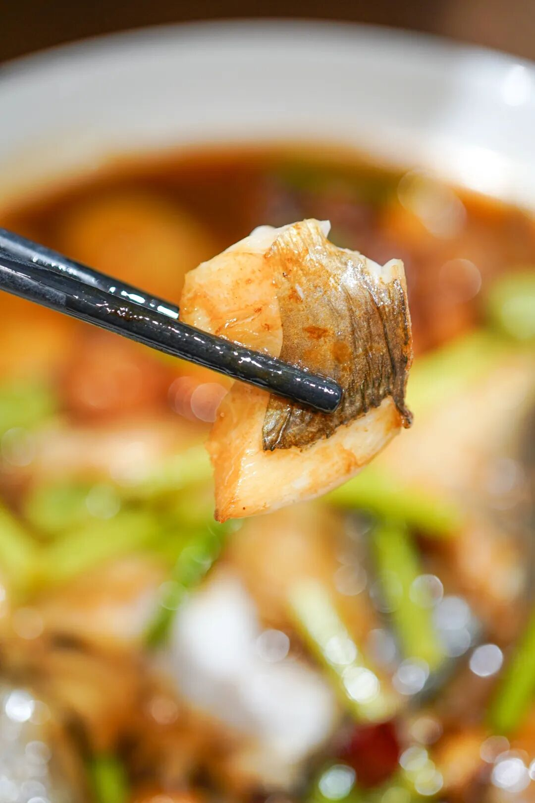

先说今天刚上架的银鲳！都说东海海鲜，三鲳四鳓。指的就是农历三月开春时的鲳鱼，孕藏了一冬的油脂，最为肥美。

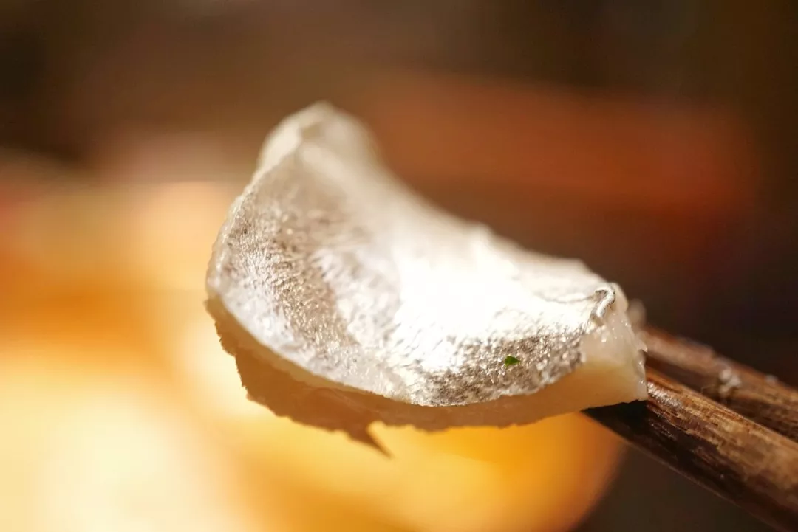

就是这种通体银白，折射着银光的。淡淡的银鳞闪耀，蒜瓣般洁白的肉，脂油在口腔化掉那一刻，啊～千金不换。

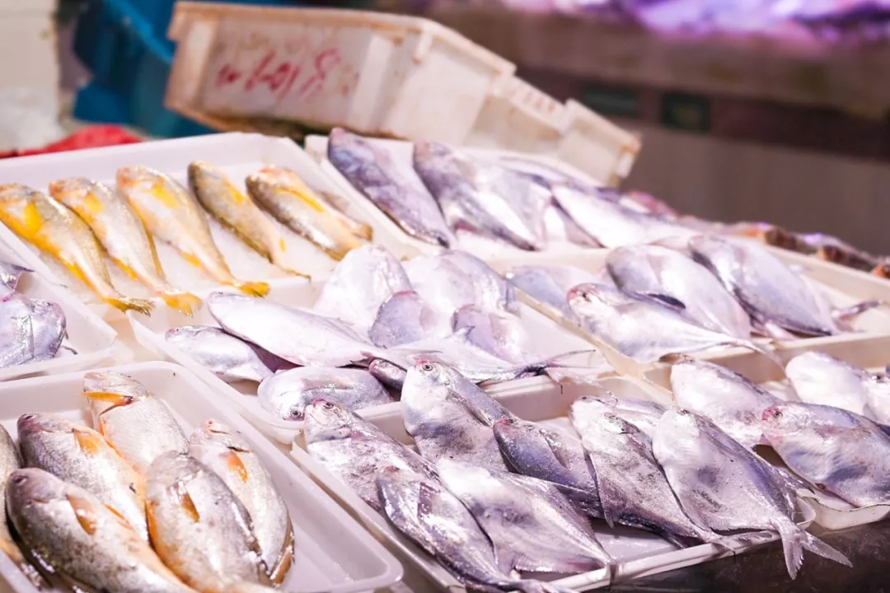

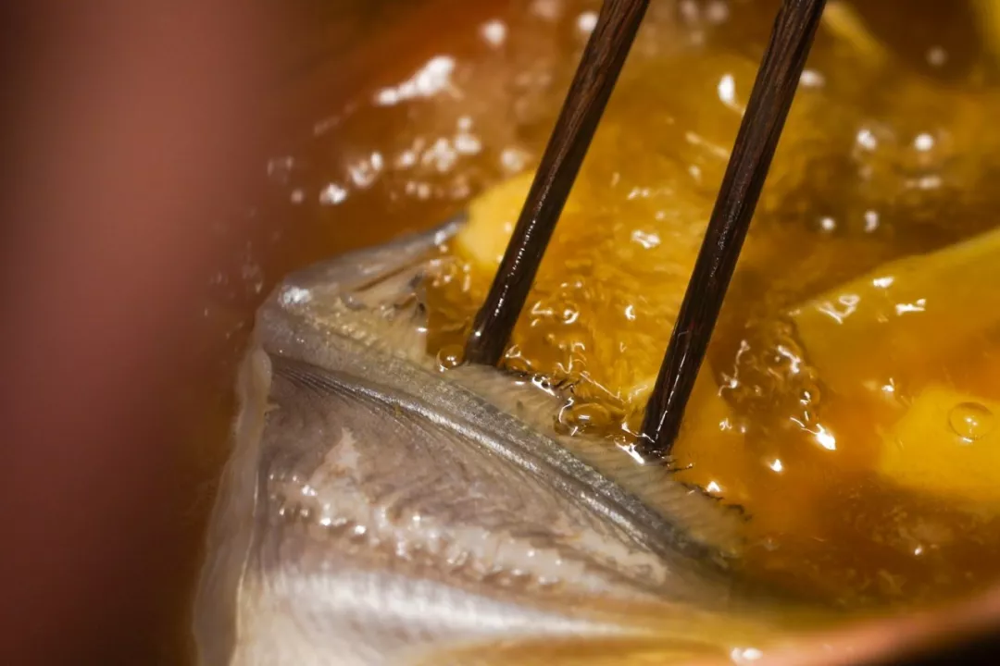

吃上一次，保准刷新你对鲳鱼肉的认知：原来它可以这么嫩、完全没有腥味还有鱼油香气!

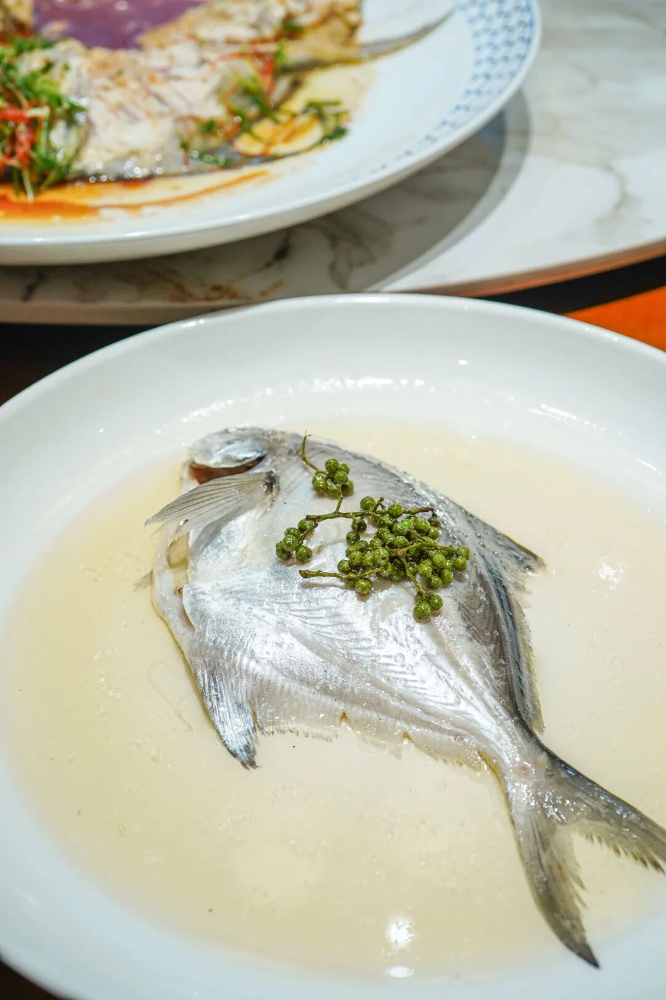

品质有多好呢？好到本薯敢放话：不怕和江浙沪地区任何贵餐厅比。因为我司鲳鱼冰鲜发货，一天一发，可以说，比很多贵价餐厅放在明档冰块上陈列的，都更新鲜！

实拍的图哦！这个也不是我随便说说，你收到即知，新鲜的鲳鱼，可以看到鱼身发亮、眼睛明亮。

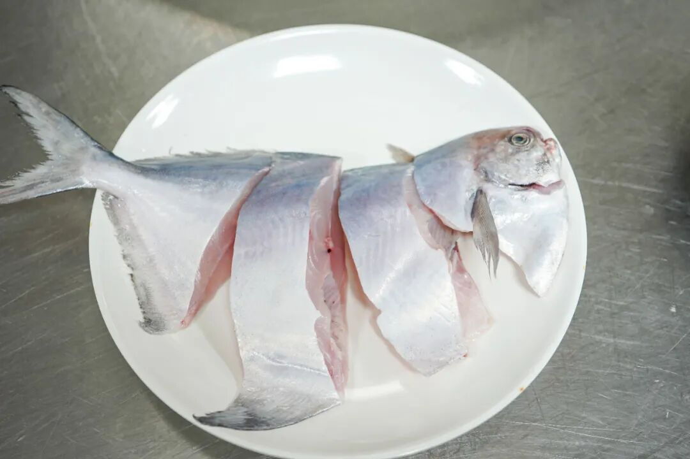

请看色泽！透骨新鲜！其次性价比极高。个头上，饱记只挑 6 两及以上的发，讲真，很多餐厅都舍不得用这么大的鲳鱼。或者说，真的很贵。老板说，有些米其林黑珍珠餐厅用到 5-6 两个头的，就已经卖五六百块了。这帐，你们会算吧！

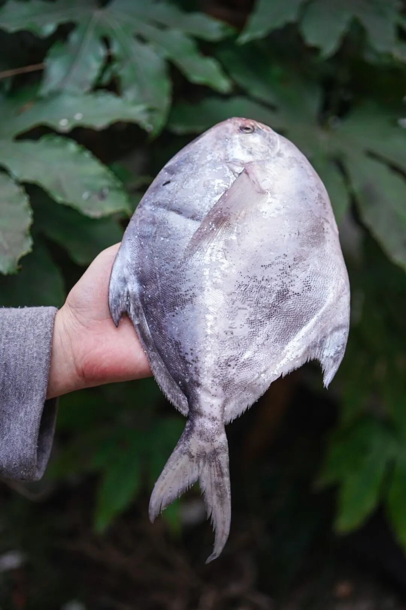

菜谱也有，见这篇。👇《东海人民三月吃鲳鱼的福气，算是被我想着了！》我们充分考虑到了厨房小白的需求，（虽然但是，这鱼实在太好了，真是随便弄弄都好吃请到了具有30 多年工作经验，前香格里拉酒店中餐厅大厨，目前「顺意顺德菜」餐厅老板李国维大厨，来教大家烧鲳鱼。

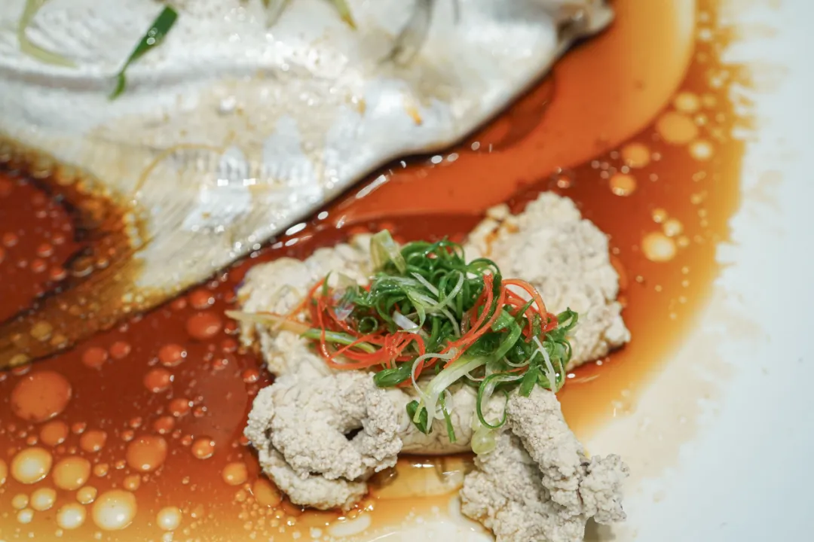

一道清蒸，一道盐油水蒸，还有一道新荣记同款，台州家烧年糕鲳鱼👇

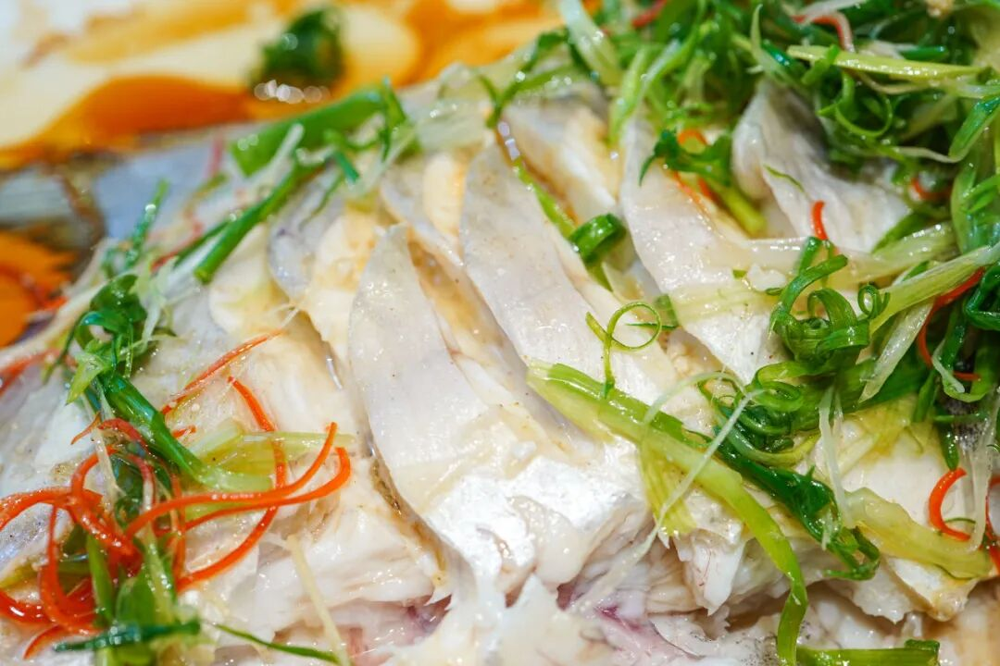

如果你们和我一样是炸厨房选手，还是推荐第一二两道，嘿嘿。周末回家，惊艳四方！

总之，把握时机，赶紧下手！就卖到四月哦。

饱记·东海冰鲜鲳鱼购买方式如下限时早鸟 86 折！！！
戳图下单购买👇

另外！老客人都在问的
东海红膏梭子蟹，也补货啦！！每年就这么几周可吃，价格是地板实价。

真的好多好多好多膏，比如你看这只，已经堆满了。。。。

捧起一只啃，

膏鲜而饱满，

肉甜而紧实，

不愧是海中霸主！

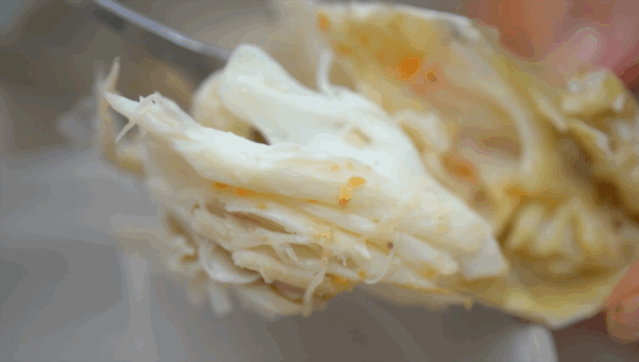

出水时尤其猛烈强壮，蒸它一只来吃，可想而知，爽到飞起了！

还是饱记合作惯了的老供应商，舟山渔场渔船野生海捕，可以和任何贵餐厅比品质比价格！

春季的梭子蟹本身数量少，所以这批我们只做半斤以上，8 两以下的规格。

解释一下，不是没有大个头的，之所以控制大小，主要是考虑到小点的蟹容易活，你们收到更新鲜。

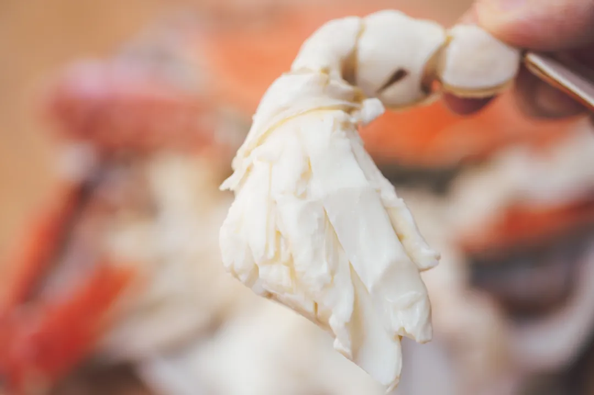

口味上绝对棒，本地人都不一定能搞到，肥，且鲜甜。

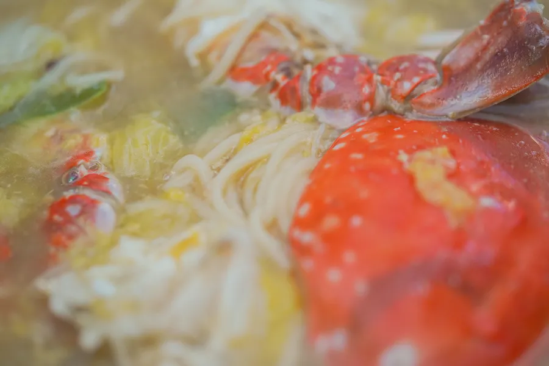

老板说，就能吃十几天，你们抓紧啊。。。。往期菜谱也有，点这里。👇《买买买一只梭子蟹：满满是膏》

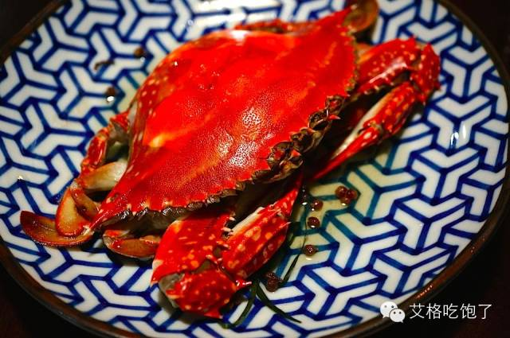

《极简极简便之花雕酒蒸梭子蟹》

最后强调！梭子蟹都是冰鲜发货，当天凌晨捕捞，渔船靠岸后就人工二次筛选出货，好吃程度，非其他生鲜渠道海水充氧的养殖蟹可比拟，（养殖蟹也很少有半斤以上的。。至于那种以次充好的冷冻海鲜商家，就更不稀的说了。。

不过梭子蟹由路途运输问题，总有磕碰，到手可能会活力不足，但依然是新鲜的，所以我们保鲜不保活。具体可见商详哦！

饱记·东海春季红膏梭子蟹购买方式如下限时早鸟 86 折！！！
戳图下单购买👇

题 外

朋友们江南已是春光好，

一些时令好风味，大家一起吃起来！我饱记青团买了吗？今年的全家福已经断货，为数不多的双拼大家吃起来！错过就等明年啦！

趁现在限时 85 折！

昨天刚回归的金山鸡，
这次有 12 个月龄滋补老母鸡，想当包邮区大孝子的速冲！限时早鸟 7 折！

还有 5 种适合早春喝喝的好茶，

限时 5 天折扣！

刚冒出来的临安天目山雷笋，

米其林餐厅师傅第三年回购，

不焯水就鲜甜！

现在有限时 9 折！

还有些只有最近这一阵可吃的水果👇

甜蜜嘎嘣脆的花香小弹珠蓝莓，

难得回归的泰国超甜多汁金柚，

卷中卷红玉芒果，

来自湖北的超甜晚熟红橙，

娇艳可人的雷州木瓜，

口味浓甜的蒙自花长虹枇杷，

来自精品小果园的云南沃柑，

好吃不怕胖的广西芭乐，

人称「水果冰淇淋」的凤梨释迦！

现在也有限时 9 折！

此外 90 天短保质期的大师凤梨酥，

也都有限时 9 折冲冲！

饱记·妈妈牌青团

快没了快没了！！

限时 85 折！！！

戳图或去🍑🍑🍑搜索

「艾格吃饱了」

下单购买👇

饱记·早春好茶专区

购买方式如下👇

限时五天折扣中！！

戳图即可购买👇

饱记·云南稀有品种瓢鸡本周四起按顺序发货！限时早鸟 7 折！！！
戳图下单购买👇

饱记·2025 临安天目山雷笋购买方式如下限时吃笋 9 折！！！
戳图购买👇

饱记·花香脆甜蓝莓

购买方式如下

限时吃水果 9 折！！

戳图购买👇

饱记·多汁泰国金柚

购买方式如下

限时吃水果 9 折！！

戳图购买👇

饱记·海南红玉芒果购买方式如下限时吃水果 9 折！！！
戳图购买👇

饱记·晚熟超甜红橙购买方式如下限时吃水果 9 折！！！
戳图购买👇

饱记·湛江雷州木瓜

购买方式如下

限时吃水果 9 折！！

戳图购买👇

饱记·凤梨释迦购买方式如下限时吃水果 9 折！！！
戳图购买👇

饱记·蒙自花长虹枇杷购买方式如下限时吃水果 9 折！！！
戳图购买👇

饱记·云南晚熟沃柑购买方式如下限时吃水果 9 折！！！
戳图购买👇

饱记·广西芭乐

双拼&奶油芭乐

限时吃水果 9 折！！

戳图购买👇

饱记·新鲜到货凤梨酥

限时 9 折！！！
戳图购买👇

本文的研究员

薯角我想我知道春天的味道

用好吃的方式吃一生

祖国各地好风物

文章转载请加微信「baojiclub」

