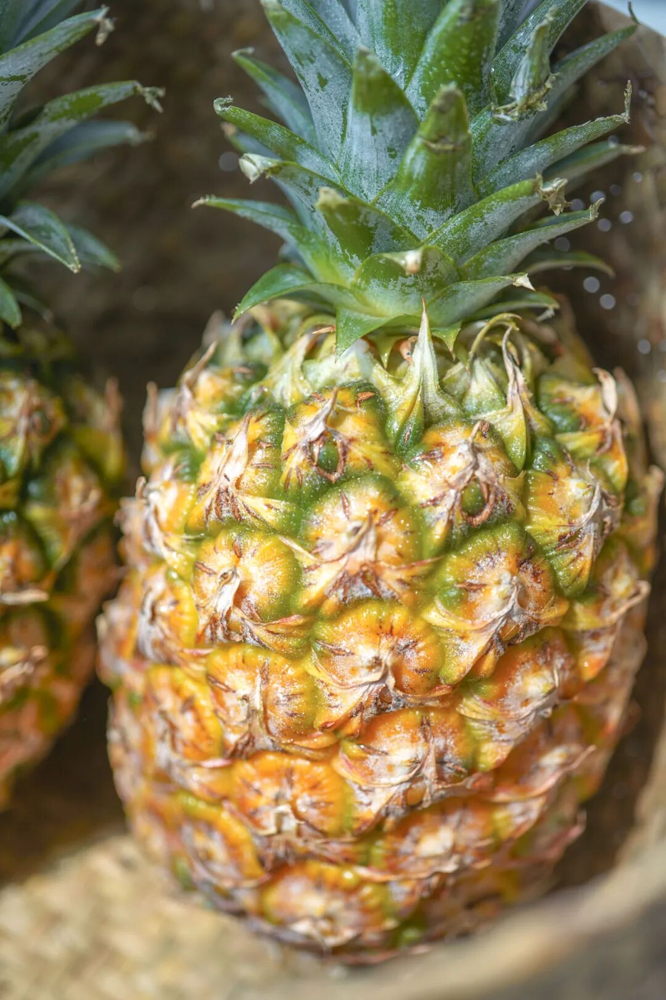
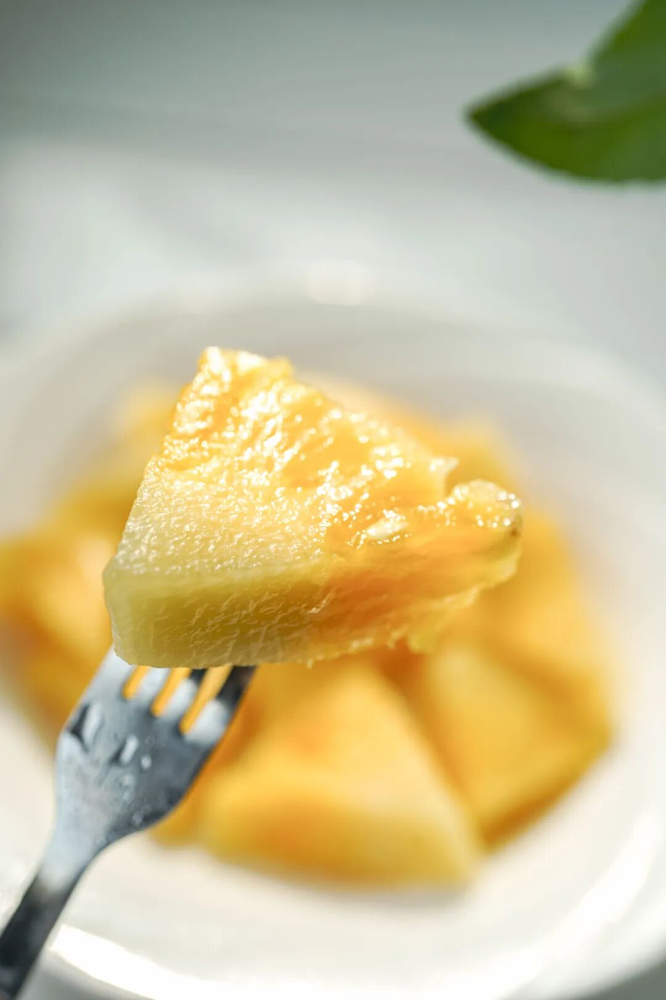
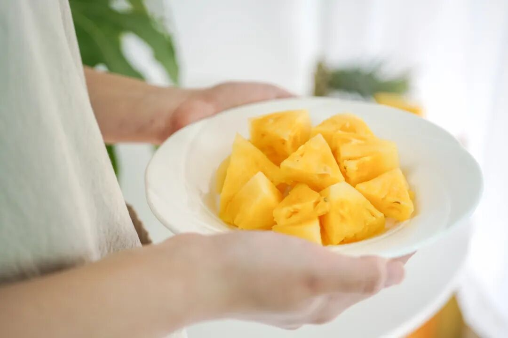

# 中国大陆最南端，甜蜜的秘密一则

- 原文链接: https://mp.weixin.qq.com/s?__biz=MjM5NTYxODQyMA==&mid=2653454829&idx=2&sn=c598ab99aa4d0b7bfb858acb3c858e89&chksm=bc9faec62f456a462cdc2d92d11207146c7002643aa0f2430369da7135da2f4c49d80b78f887&scene=27#wechat_redirect
- 浏览量: N/A
- 点赞数: N/A
- 评论数: N/A
- 转发数: N/A

## 正文

隐秘的凤梨

一个尽情安利自我的公众号以下是没事干研究院的风味研究报告请放心食用

头条里我说什么来着......

本薯自西吃到东，

又一路学到了——南国以南！

抵达大陆最南端的小城湛江

只为这一颗，

湛江徐闻·冬蜜凤梨～

小城一度因《隐秘的角落》而被熟知，

但更隐秘的应是，

这高甜，却小众难找得要命的，

冬蜜凤梨！

老板说，自青龙凤梨以后，

一直在找同等品质的厉害凤梨，

从云南顺着跑到海南，

发现还是徐闻种出来的最好！

湛江徐闻，

有一片菠萝的海，

只有我饱记在这片海里，

挖到了一些小众罕有的凤梨！！

之前上过的青龙凤梨，

今年因为严重歉收只有 70 箱，

早早卖空了。

我那坚持不懈的老板找啊找啊，

终于发现了第二个精品小果园，

种有非常少见的冬蜜凤梨～

老板说，小众到愿意种的都是为了情怀～

（吃到就是赚到嘿嘿

水多肉嫩，基本无渣，

还不麻嘴不用泡盐水！

切开满盈凤梨香气～

（菠萝的锅凤梨不背！！

甜，高甜，糖度能到 18 以上，

真真跟喝蜜一样～

（什么概念呢，就是比青龙还甜 2 度～

所以收到以后速速吃掉！

否则放坏了很容易招小虫～

缺点也有！就是果季非常短，

一不留神就错过啦～

短到我们甚至来不及印产品卡，

最后用 A5 纸打了一份说明hhhh

现货！！！

给大家薅来一个八六折！！

果期大概只有半个月～

拿到手的果子基本完熟，

直接开箱就可以吃！

收到的凤梨如果黄了，一定要马上吃！

剩下的常温（摄氏 10-23 度）保存，

避光通风处最多保存两三天，

一定要及时吃完～

但：

凤梨不以黄绿判断熟度，

所以我司要求有经验的采摘工人以敲打方式判断树上熟度，

很多绿色也是熟的～

收到后要是馋了，也可以直接切开吃看看！

（糖度仪实测！！高甜！！

饱记·徐闻冬蜜凤梨 86 折！！购买方式如下

冬蜜凤梨品种小众、果期短，

蜜蜜甜～

收到后凤梨如果黄了，

一定要马上吃！

剩下的凤梨常温（摄氏 10-23 度）

避光通风处最多保存两三天，

也要及时放冰箱或者吃完哦～～

不过凤梨不以黄绿判断熟度，

所以很多绿色的也可以直接吃！

到手可酌情判断一下，

实在馋了就切开尝尝hhh

总之尽量早点吃，

千万不要放坏了，还可能招小虫～

这么好吃，相信很快能吃完！！

戳图买它！👇

本文的研究员

薯角凤梨罐头会过期，但对凤梨的爱不会

用好吃的方式吃一生

祖国各地好风物

文章转载请加微信「baojiclub」

