# 中国老登有自己的小酒馆。。。。。。。

- 原文链接: https://mp.weixin.qq.com/s?__biz=MjM5NTYxODQyMA==&mid=2653470118&idx=1&sn=4b71dbe2b7394eb99a8051ad5cdd8697&chksm=bc5e07224b1e1935ab01cee2653e8c355993a2802436743232a9b47db52bf35035923e7a964e&scene=27#wechat_redirect
- 浏览量: N/A
- 点赞数: N/A
- 评论数: N/A
- 转发数: N/A

## 正文

好鲜好鲜

没有广告软文

所有消费笔记均经多次匿名测试请放心食用

其实我最开始是叫这家店外卖的。。。

结果没想到外卖袋上赫然写着：

「孔乙己小酒馆」。

对，就是那个孔乙己酒家，

1999 年一位绍兴老板在城隍庙文庙开了首店，

现在好几家连锁，

上过很多家上海日文杂志，

导致现在长宁的分店们都还有很多日本客人的

（确实也全是中年人

孔乙己。。。

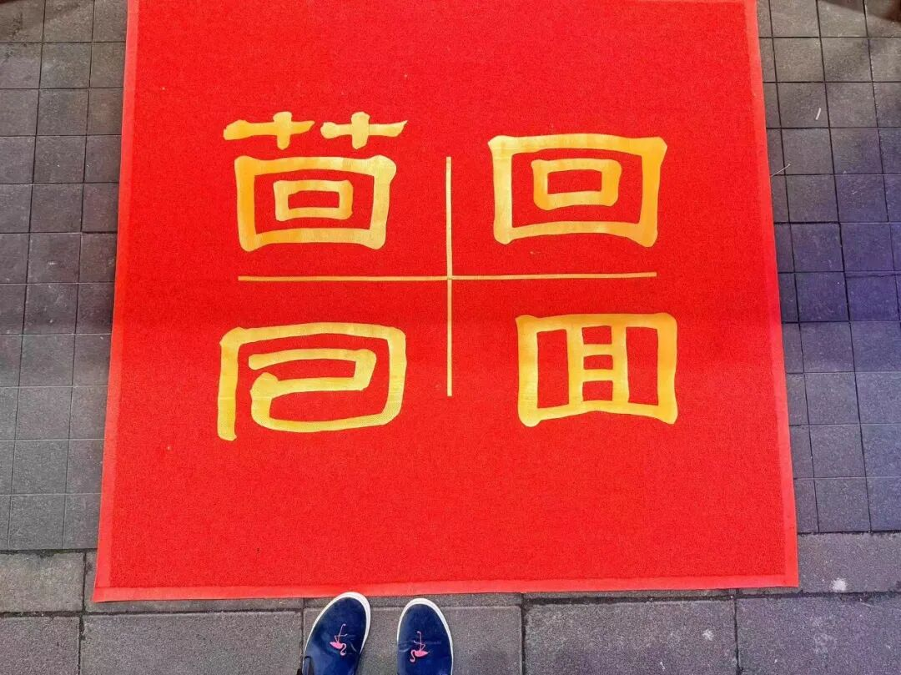

店门口的地垫是「茴」字的四种写法hhh

他们家师傅来路我不是很熟悉，

但吃得出是科班出身的大厨。

比如我外卖常点的这只熟醉膏蟹。

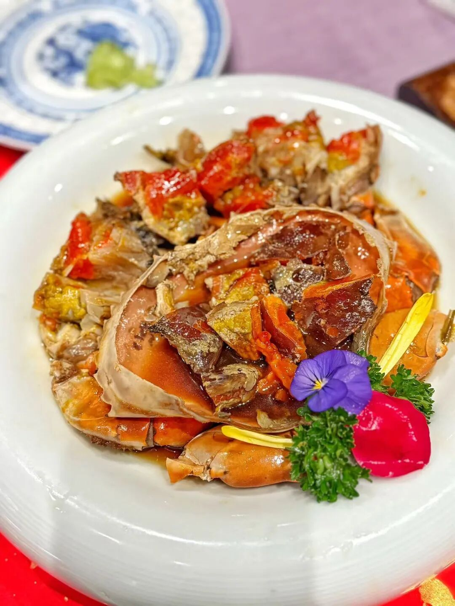

酒味极其浓郁，

调味咸鲜带甜颇为精准，

是大厨手艺。

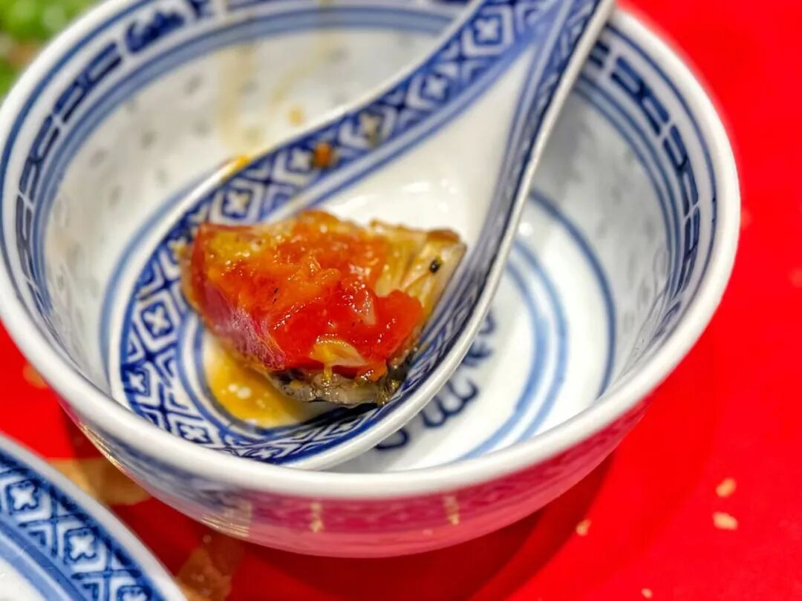

他们每家店，还有自己的时鲜，

比如上个月我去虹桥店，

吃到了调味和嫩度都准确优秀的葱油蚕豆。

这方子我们写过中国特级烹饪大师毛水生老师的，

菜谱看这里👉报告老板：明天不上班，辞职去摆摊

他们家就能做到基本一致。

而且三月里的大棚蚕豆舍得挑极嫩的，

相当难得。

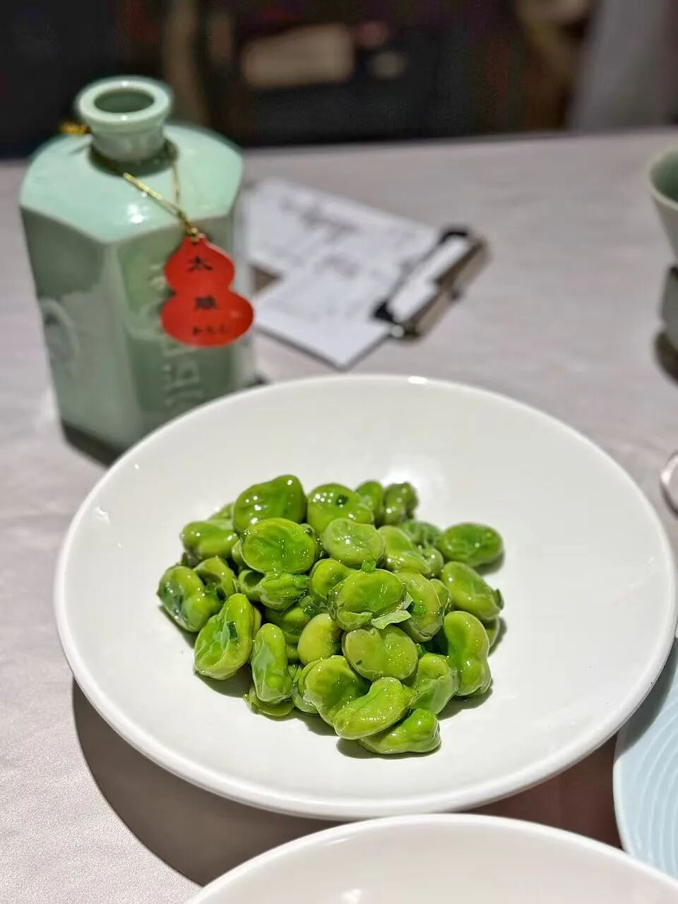

但这菜不上他们外卖菜单，

导致后来快一个月我都因为很馋，

努力在外卖里找葱油蚕豆，

没一个靠谱的

店里的白切鸡设绍兴大阉鸡。

可惜大阉鸡要老而塞牙才极鲜，

配合上海人喜欢三黄鸡软嫩的口感，

他家的阉鸡还是偏嫩，

不过这也不稀奇，

连广州人也吃不惯粤西超老的大阉鸡，

根据地方口味改良很正常。

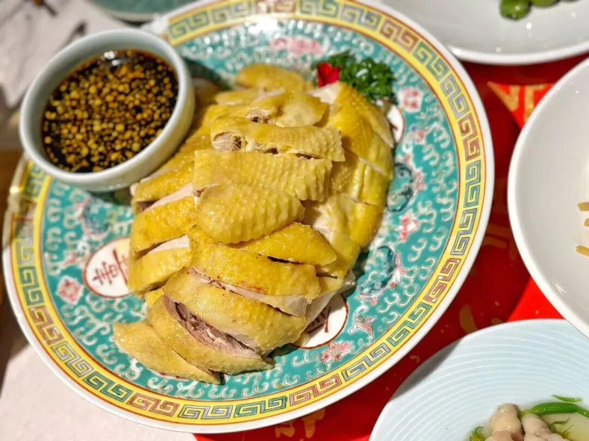

重点是他们店内的白切鸡骨里仍带一点血，

（外卖会全部烫熟

配白斩鸡的酱油，

则带一点绍兴酱油浓郁风味，

我可以～～

店内另一款名鸡则是花雕鸡，

这菜一般上海菜馆都有，

但他家因绍兴血统的关系，

酒味极浓，汤头咸鲜香浓，

黄澄澄的鸡油根本不撇，

浮在汤上香气直白又诱人，

我经常偷偷空口喝两口

（是的我们绍兴人血统就是吃盐不要命的，勿 cue！

臭豆腐，

他们的臭味（发酵程度）也轻了很多，

但仍然是上海较稀有的、值得一吃的臭豆腐！

我喜欢点炸的，

因为他们会给一碟甜面酱，

虽然有点稀。。。

但是也是我们绍杭人士的家乡味道～～

（杭州有很多绍兴移民的，包括我家

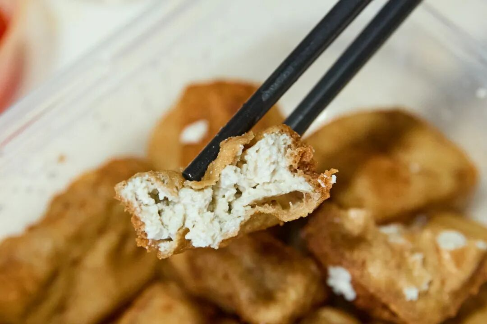

糟卤和酱系列，就还好，

反倒是上海大厨做得会更好。

前两天和苏州饭搭子讨论，

他也觉得比起苏州的糟溜

（比如新聚丰的名菜糟溜黄鱼片

他更喜欢上海版的。

（比如上周我写过的云和面馆

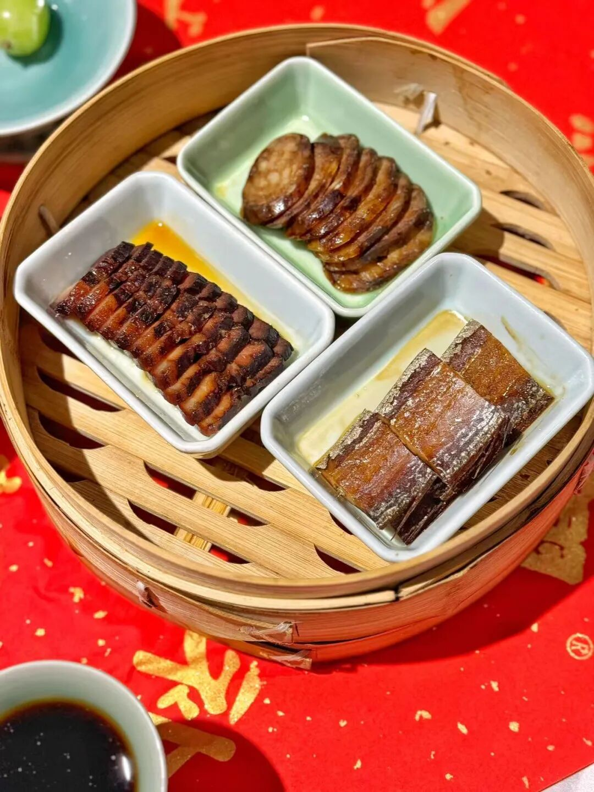

但这个糟卤鸭舌底，

因为食材有趣，

是完全值得一吃的！

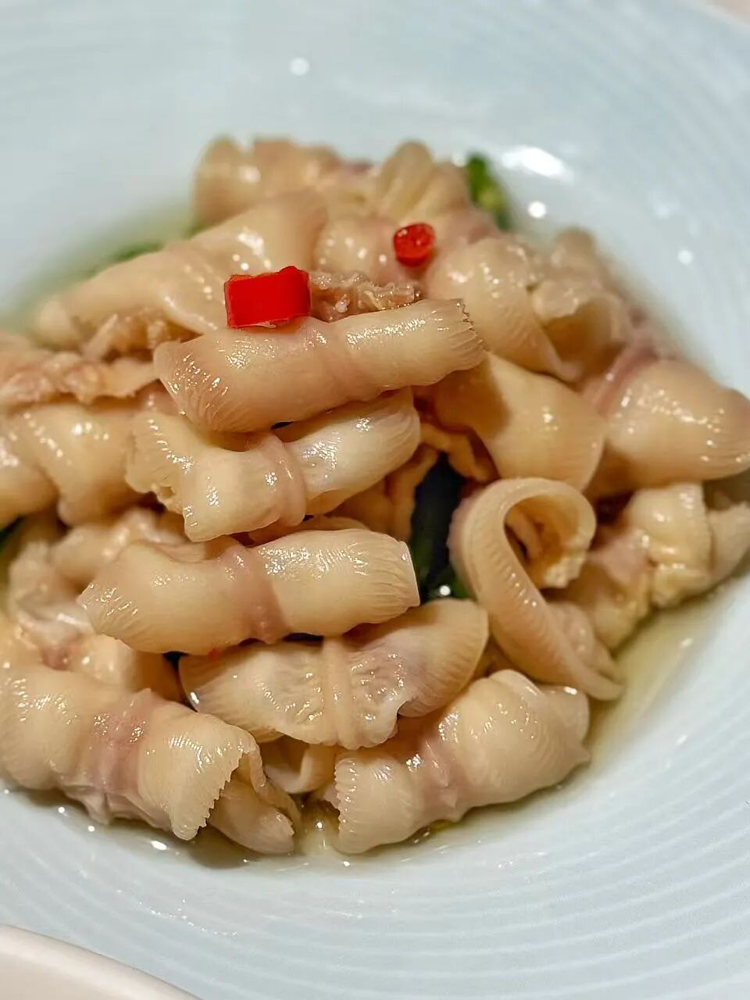

其它还有可吃的，

在熟醉膏蟹卖完时可以试试熟醉大闸蟹，

因为酒浸关系常年都有，

还可以！

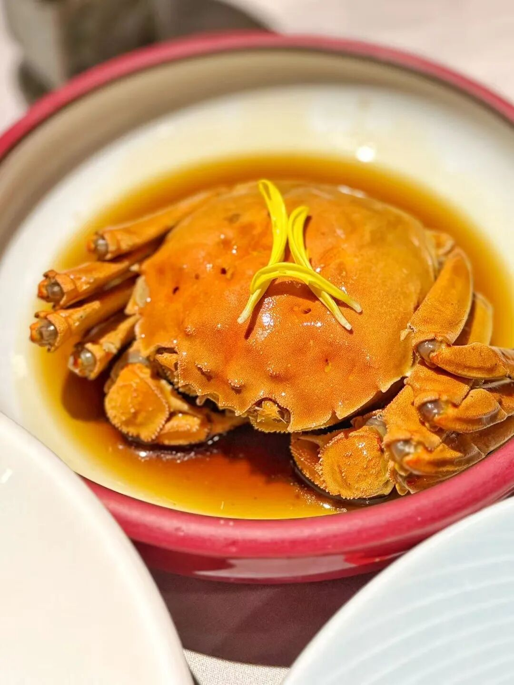

我觉得很亲切的绍兴佐菜汤，

笋干菜（正宗绍兴店必备

和小河虾 + 一点时令蔬菜

煮的清汤：这是非常正宗的绍兴家常汤，

但和我同去的朋友一般都感觉吃不懂。。

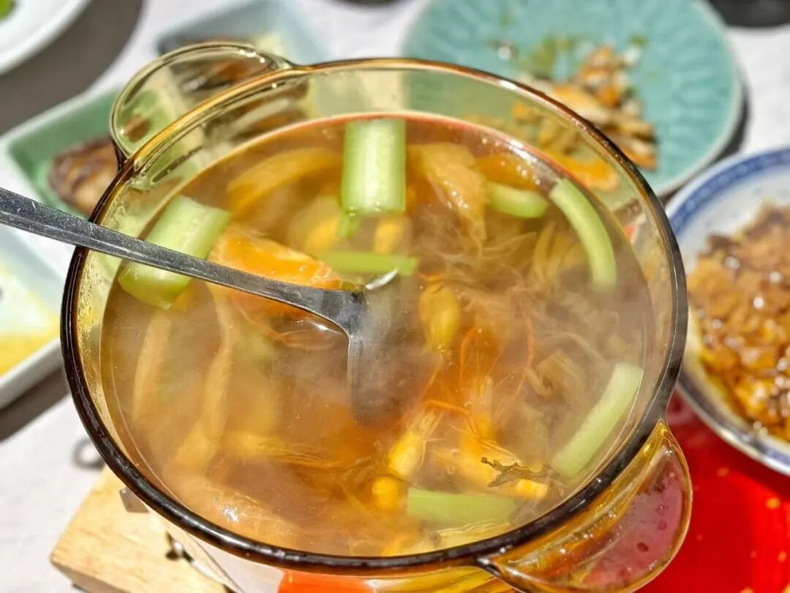

文庙店特有的甲鱼汤，

据我同事说相当可以！

不过我还没去吃过～

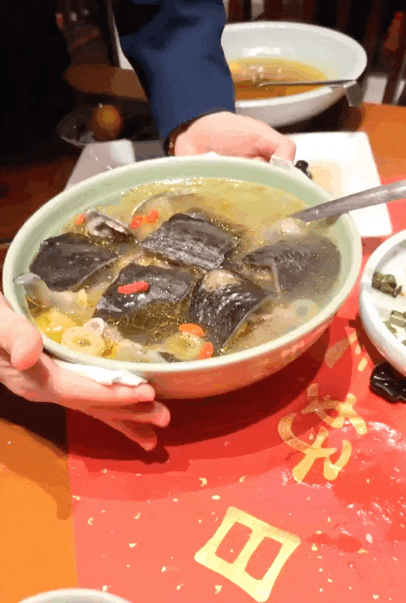

以及店内每桌必点的

甜甜太雕黄酒，

58 元半斤，也即 250ml，

比起外国小酒馆的葡萄酒

是超级划算，所以我看每桌都有。

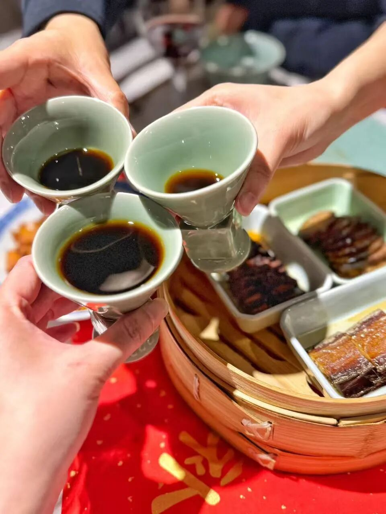

但酒水毛利仍然是很高的，

我有次和经营西班牙小酒馆的

老板夫妇同去孔乙己，

把他们羡慕死了，

说自己店明明是个 bistro，

只有 30% 点酒率hhh

最后，为啥说这店很老登呢？

当然主要是因为客户都是我这种中年人hh

孔乙己所有店的门头，

现在都是奇怪的赶时髦劲儿。

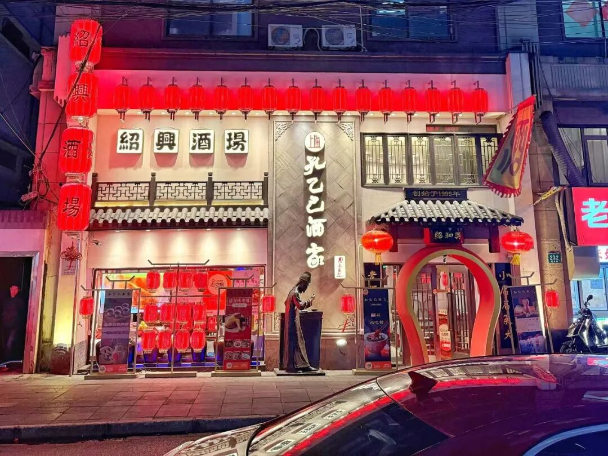

以及他们的客人，

经常在只有布帘的半包间里就大肆抽烟，

慢慢烟味就会漫到大堂

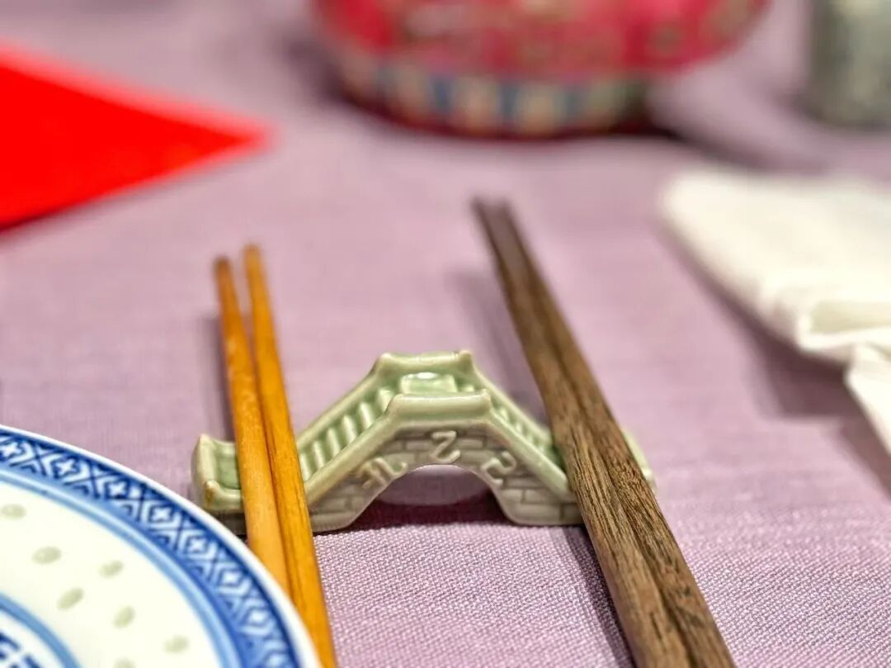

这筷架倒是蛮有趣的！

所以我就经常还是点外卖啦hhh

但无论如何，

它都是非常经典而成功的 bistro，

且是中国口味。

外卖盒子是新荣记的样式，

只比新荣记稍薄一点。

反正我家阿姨都是舍不得扔

全给我洗干净收起来的。

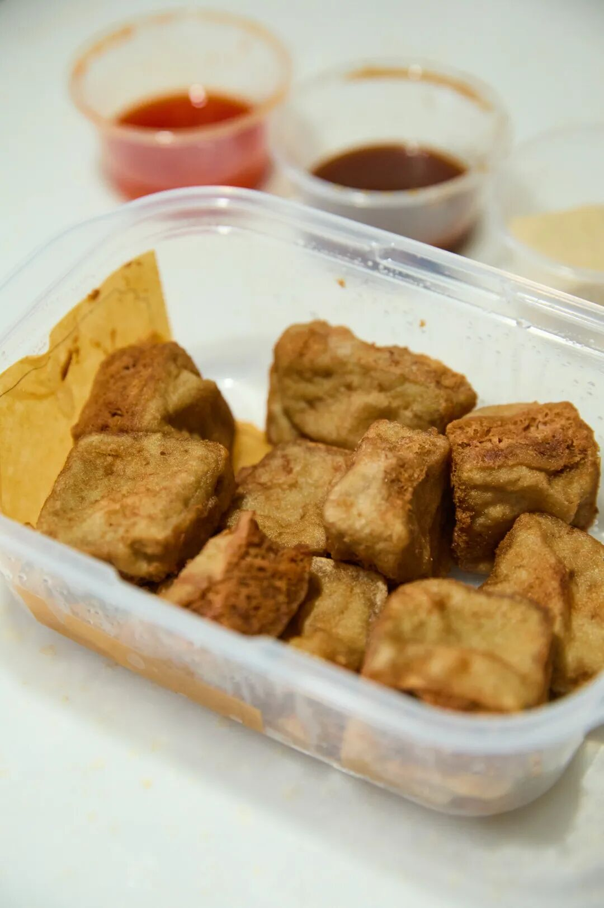

总之，他家各分店路过都能吃，

虹桥店和文庙店都很有自己特色，

走起！

题 外

朋友们！！又是我，

你们的朋友薯角！今年的饱记·湖州大粽！买了吗？？还是那四个经典口味，现在还有限时早鸟 88 折！回归的金山鸡这批还有最后几十只一年老母鸡，想当包邮区大孝子的速冲！限时 7 折！时令新鲜的春季茶中「梅家坞」和「蒙顶甘露」性价比高！自家喝不心疼！限时单件 86 折/双件 8 折！上好的「狮峰龙井」送人包体面！限时喝春茶 9 折

时令的饱记·舟山野生海鲜盲盒！

舟山码头鲜捕现发，都是冰鲜发货！

当地人都买不到的品质，

来自湛江的红膏青蟹。不仅有红膏，而且满到蟹壳角角落落。

其他的东海野生海鲜，

肥美银鲳和红膏梭子蟹，

都是高级餐厅水平！

限时吃海鲜 9 折！

还有些只有最近这一阵可吃的水果👇

拿过上海金奖的金山小番茄，

找了七八年才满意的大连蜜甜樱桃，

限时早鸟 86 折！

瓜肉软糯的翡翠冰淇淋甜瓜，

甜蜜嘎嘣脆的花香小弹珠蓝莓，

难得回归的泰国超甜多汁金柚，

无渣不麻嘴的海南金钻凤梨，

连盐水都不用泡。

卷中卷红玉芒果，

来自湖北的超甜晚熟红橙，

娇艳可人的雷州木瓜，

来自精品小果园的云南沃柑，

好吃不怕胖的广西芭乐，

现在也有限时 9 折！

饱记·口碑湖州大粽预售中

4.28 左右按顺序发货！

限时早鸟价 88 折！！！！

戳图买它👇

饱记·云南稀有品种瓢鸡最后几十只老母鸡！限时 7 折！！！
戳图下单购买👇

饱记·梅家坞龙井&蒙顶甘露

限时单件 86 折！！！

两件 8 折！！

戳图购买👇

饱记·狮峰头采明前龙井购买方式如下👇限时喝茶 9 折！！！
戳图下单购买👇

饱记·舟山野生海鲜盲盒购买方式如下限时吃海鲜 9 折！！！
戳图下单购买👇

饱记·湛江红膏青蟹购买方式如下限时吃海鲜 9 折！！！
戳图下单购买👇

饱记·东海冰鲜鲳鱼

购买方式如下

限时吃海鲜 9 折！！！

戳图下单购买👇

饱记·东海春季红膏梭子蟹

购买方式如下

限时吃海鲜 9 折！！！

戳图下单购买👇

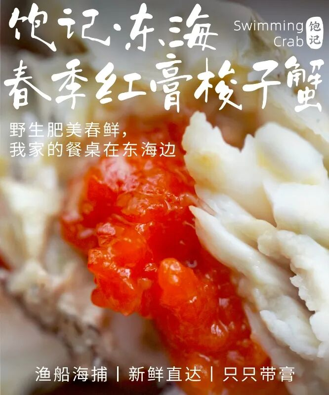

饱记·金山五彩小番茄购买方式如下限时早鸟 86 折！！
戳图购买👇

饱记·大连蜜甜红樱桃购买方式如下限时早鸟 86 折！！
戳图购买👇

饱记·花香脆甜蓝莓

购买方式如下

限时吃水果 9 折！！

戳图购买👇

饱记·海南金钻凤梨

购买方式如下

限时吃水果 9 折！！

戳图购买👇

饱记·多汁泰国金柚购买方式如下限时吃水果 9 折！！
戳图购买👇

饱记·海南红玉芒果

购买方式如下

限时吃水果 9 折！！！

戳图购买👇

饱记·晚熟超甜红橙购买方式如下限时吃水果 9 折！！！
戳图购买👇

饱记·湛江雷州木瓜

购买方式如下

限时吃水果 9 折！！

戳图购买👇

饱记·广西双拼芭乐

限时吃水果 9 折！！

戳图购买👇

本文的研究员

闻 佳就是那个研究院嘴里「挑剔的老板」。关于食物，不是比你懂得更多一些，只是比你花了更多的冤枉钱。

用好吃的方式吃一生

祖国各地好风物

文章转载请加微信「baojiclub」

