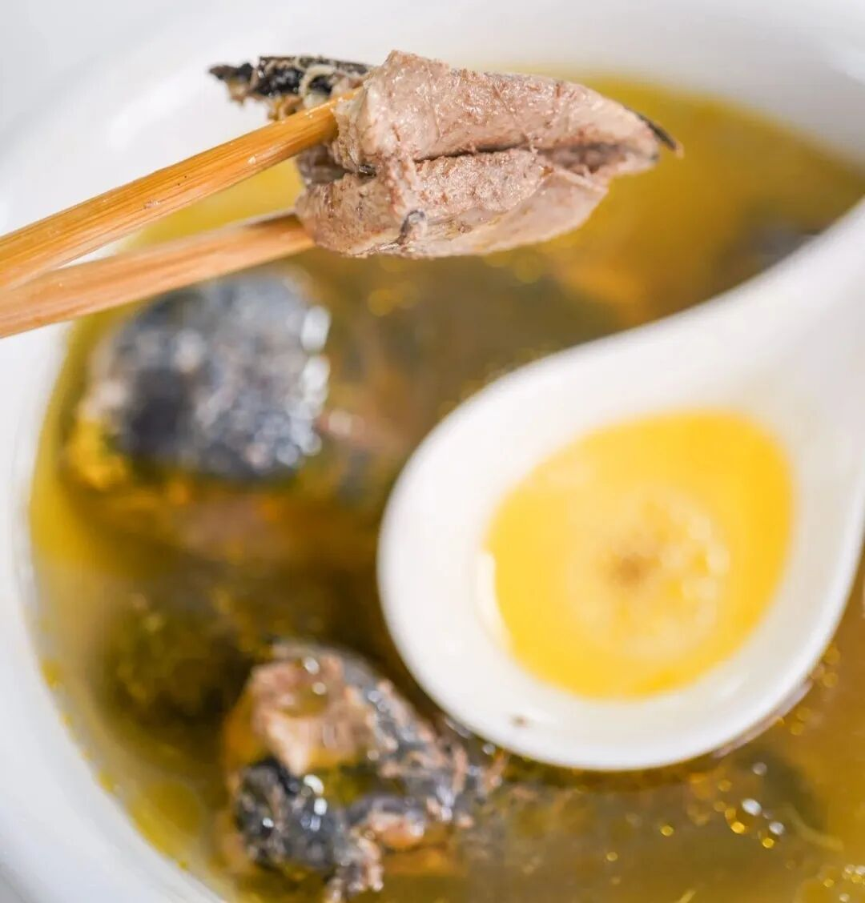
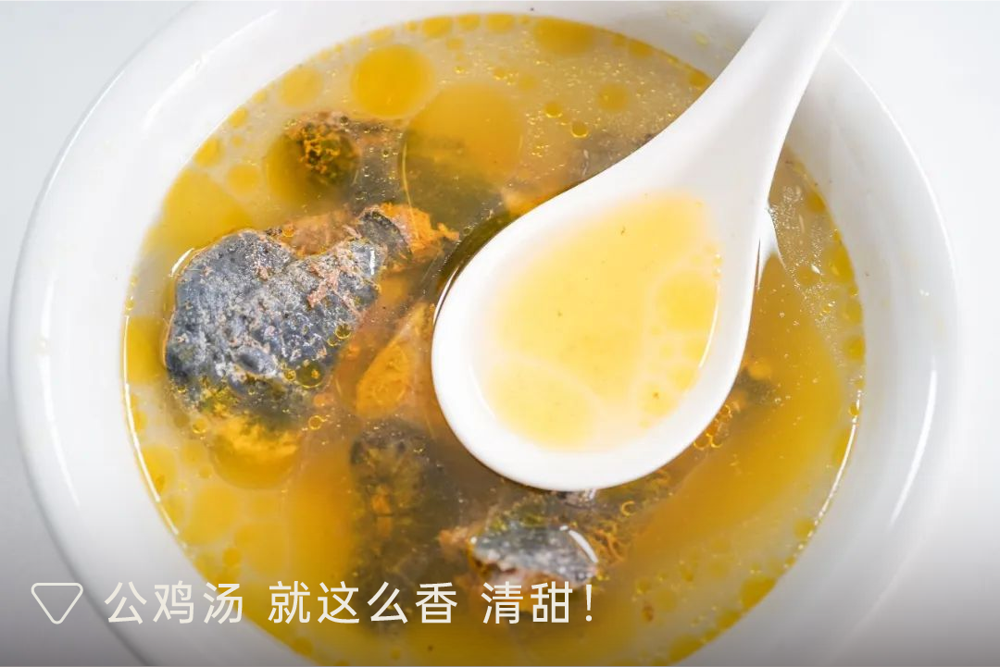
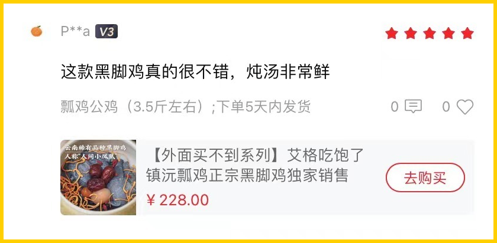
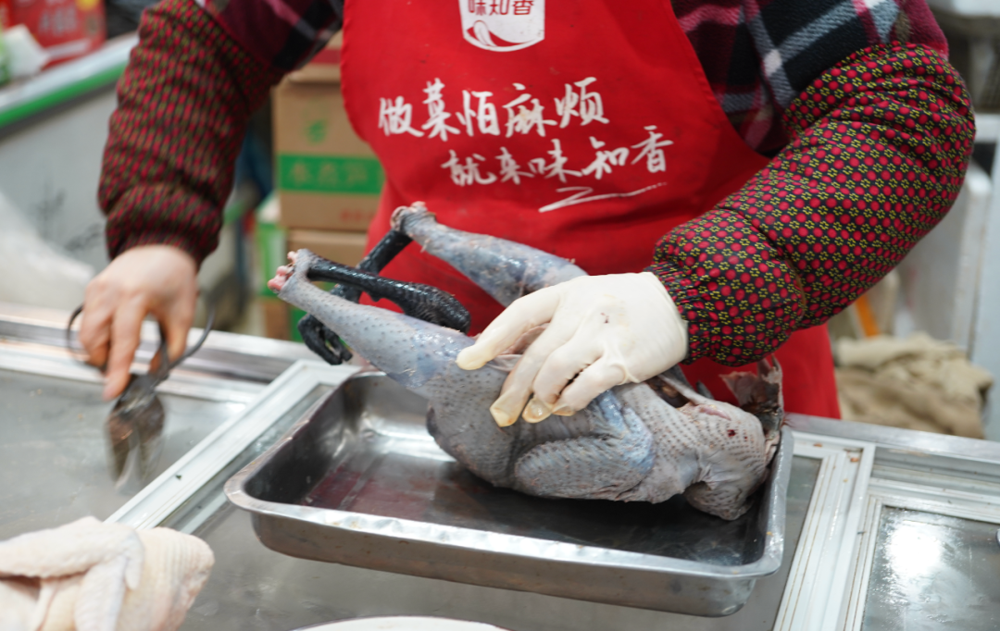
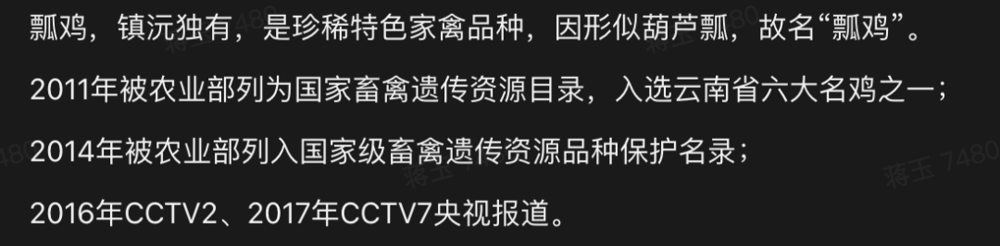

# 为什么歧视公的啊。。。。。。。

- 原文链接: https://mp.weixin.qq.com/s?__biz=MjM5NTYxODQyMA==&mid=2653461317&idx=2&sn=94e2aa75bafa1f5464552d445e3096e3&chksm=bc1206dbfecc4908f450c808e31bcc45da3050d17c7a0070077afa3556cd8db24b3eab9678f1&scene=27#wechat_redirect
- 浏览量: N/A
- 点赞数: N/A
- 评论数: N/A
- 转发数: N/A

## 正文

限量供应！

一个尽情安利自我的公众号

以下是没事干研究院的风物研究报告请放心食用

熟悉的朋友会知道，

我司有一只，

外面买不到的鸡。

每次一出现就断货，

尤其是母鸡。

本薯今天看了眼库存，

不禁想喊一声：

为什么歧视公的啊！！！

物种有别！

公鸡很好啊啊！！（尖叫脸

肉多！油少！还清甜！

强烈建议之前没试过公鸡的这次选它，炖汤一样无碍！(本薯作为年轻人，甚至更喜欢公鸡的汤hh，

今天本薯就来为公鸡正名！

客官请看👇

此鸡五六个月才能长成一批，

所以每次都数量有限。

本次三种规格：

6 月龄公鸡净重 3.4 斤以上，还有 100 只。

1 年 10 个月老公鸡净重 4 斤以上，补了 3 只。

6 月龄母鸡净重 2.5 斤以上，补了 10 只。

顺丰次日达能到的地方都给发，

且老板受双十一气氛感染，

打来全年最低地板价 65 折！

不容错过！

非常适合秋天进补，

或者给爸妈家人送一只，

即刻晋升为当地较有名气的大孝子啊！

来，第一次见它的朋友，可以和本薯简单抄复习一下，
此鸡曲折的前世今生。～～～

👇

它长相俊美，生性好斗，通体乌黑

（但不是乌鸡哦。。。

市面上极其少见，

是非常小众稀有的品种。

坊间还有爱称，“人间小凤凰”。

长得壮！

所以，

建议别轻易在家尝试剁鸡，

我是拿到菜市场找阿姨帮忙的。

并且，

还请阿姨拿了她摊头上最大的土鸡来对比，

完全不是一个量级。

感受一下差距。。。

其实，这个鸡，

我薯角从去年年底拿到产品资料，

就已经被它深深震憾了！

这么尊贵的出身？也是我配染指的么
本在云南逍遥，2020 年成了上海援滇对口协作的产物！「飞出大山、落户金山」。四年的时间里，金山区一直是满心满眼地扑在养殖和育种技术上，「没有怎么关注销售」。

这鸡来了金山，全区上下是金尊玉贵地养着：比如为了保留它的野性和肉质，金山区直接在养殖区域内模拟了云南林地地貌，搭起了高床，让它能撒欢，打架，睡觉。

比如这鸡在老家喜欢呆在树上，就专门搞了运动场和栖息架，满足它喜欢运动打架的天性。（哈哈哈哈哈哈是战斗鸡一枚呀

比如平时，还要搭配玉米、豌豆、高粱这种天然粗粮和青绿蔬菜去喂。

光是这样还不够！金山区又进行了一系列努力，比如筛除致病基因，提高蛋白百分点，经过一轮一轮地淘汰，最终，把它养得比在云南老家还好吃！

实地看过了，真活力十足！
所以这鸡，吃起来一点腥味都没有！

油脂和胶原蛋白含量都非常丰富。

区里自己拿回家做过实验，这鸡完全可以支持加水烧上六次，到了后期，汤色会变白，冷却之后，QQ弹弹，duang~duang~duang~

养生的事我不懂，

总之，完全没有任何厨艺，

只用一只鸡，及水，

丢进高压电饭锅炖了40分钟，

出来的效果是这样的。。。

肉质极其弹牙紧实，

完全不是烂烂的口感。。。

解释一下，真是用电饭锅炖的，摄影师为了拍照好看转移到了砂锅中。。非我薯角自夸，看看此前后台的真实评价👇你看！公鸡也很多人夸！

大家收到后拿电饭锅炖炖，出来汤色就漂亮得不得了👇

图片来自后台用户评论返图
很荣幸我们饱记被选中，成为此鸡目前销售的前锋主力军！这鸡没货了就是没货了，想要再吃，就得再等上五六个月。

总之，公鸡肉更多很清甜，老公鸡肉更有韧劲，比普通公鸡含有更多蛋白质，母鸡油多脂肪厚。炖汤都鲜得很！好了说完了，我去抢库存了！（是的由于过于紧俏，本薯自己也是要抢的！看齐双十一的限时 65 折！请吧！

饱记·云南稀有品种瓢鸡

购买方式如下

双十一同价 65 折！！

三种规格：
6 月龄公鸡净重 3.4 斤以上；1 年 10 个月老公鸡净重 4 斤以上；6 月龄母鸡净重 2.5 斤以上。
下单前请注意：此鸡蛋白质含量丰富，宰杀时已尽量放血，但少量余血开包时气味仍会比较大，请冲洗再食用！鸡皮不发粘，就绝非变质～～～

戳图下单购买👇

或🍑🍑🍑搜索「艾格吃饱了」

题 外

双十一这个机制那个凑单，

一点开眼花缭乱，

薯角我搞不懂一点。。。

摆烂走起！

随便平台怎么整，

反正我司躺平开卖的好风物就那些！

现在通通给一个地板价！

直接戳图片即可购买！

不管怎么算，

总之现在买就是最划算！

卷里卷气的我司腊肠，

现在都是现货！打遍天下无敌手的山核桃，
都是今年刚炒的新货～

数量有限，先到先得！

还有两个宝藏产区的大闸蟹，来自太湖流域的精挑大闸蟹！新增 6 只装！给大家把价格打下来！淮安洪泽湖大闸蟹，宝藏小产区性价比之选！冲！

饱记·手工腊肠

购买方式如下👇

双十一同价 9 折！！

三款口味，各有各的特点。

用的黑猪肉、天然肠衣、玫瑰露酒...

酒香腊肠，酒香浓郁，

有四六和二八这两个肥瘦比例可选。

滇式腊肠用了不少贵价的辛香料，

同事说超适合拿来做西班牙海鲜饭，

试过加辣肠后升华了。

戳图下单购买👇

或🍑🍑🍑搜索

「艾格吃饱了」

饱记·临安山核桃

双十一同价

单罐限时 9 折！

双罐限时 8.3 折！

戳图买它👇

或到🍑🍑🍑

搜索「艾格吃饱了」

饱记·太湖流域大闸蟹

购买方式如下

双十一同价限时 86 折

人工精挑，

上岸后静养一两日更鲜美，

每日限量 50 箱。

拼的就是手速。

顺丰快递发货，

新鲜看得见。

戳图下单购买👇或🍑🍑🍑搜索「艾格吃饱了」

饱记·洪泽湖大闸蟹

购买方式如下

双十一同价限时 86 折

戳图下单购买👇或🍑🍑🍑搜索「艾格吃饱了」

本文的研究员

薯角秋天该很好

用好吃的方式吃一生

祖国各地好风物

文章转载请加微信「baojiclub」

