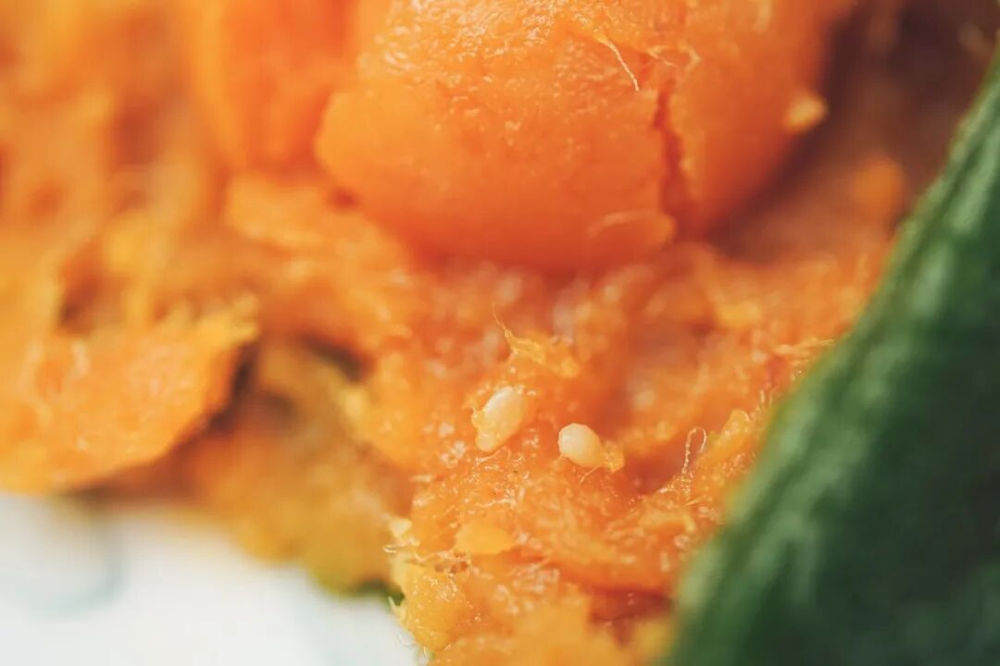
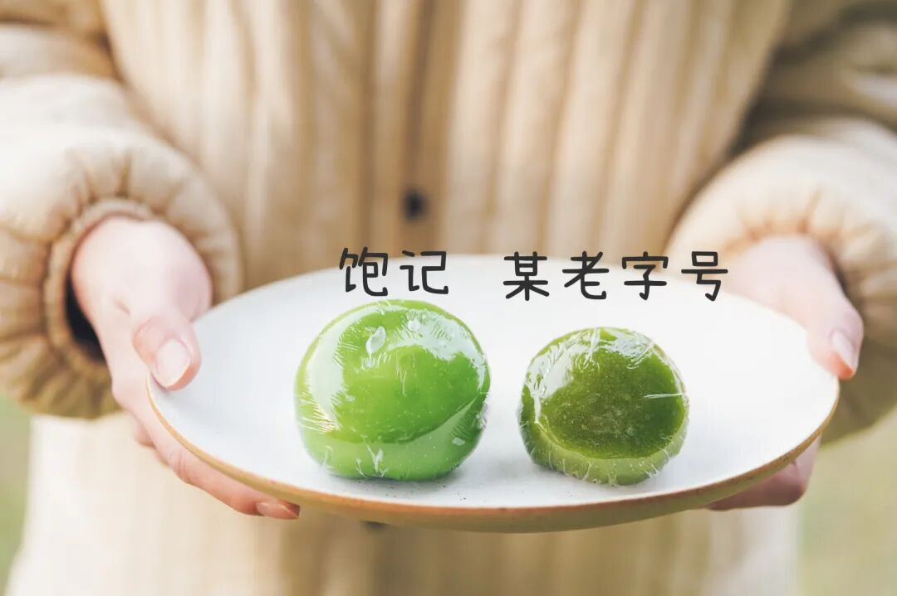
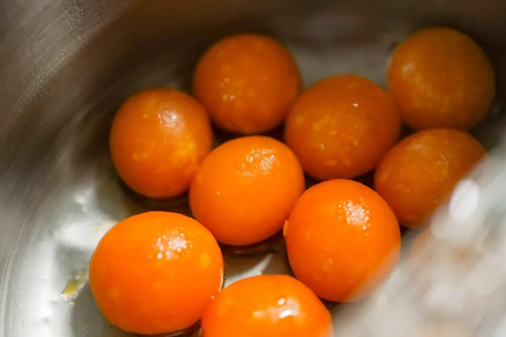
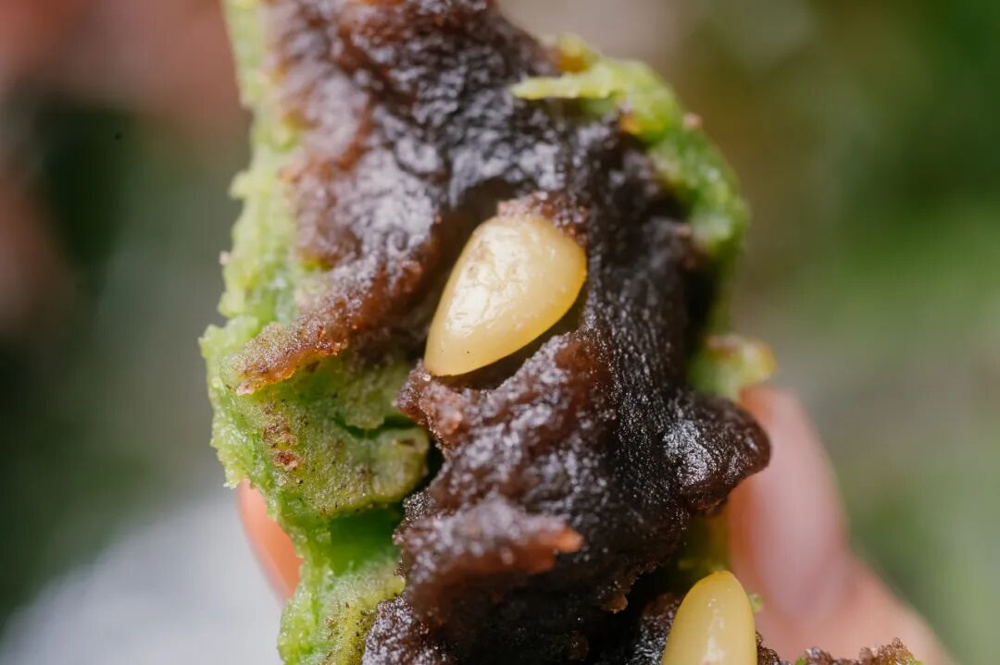
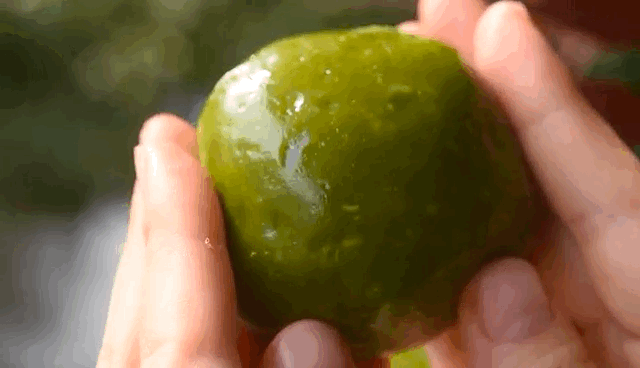
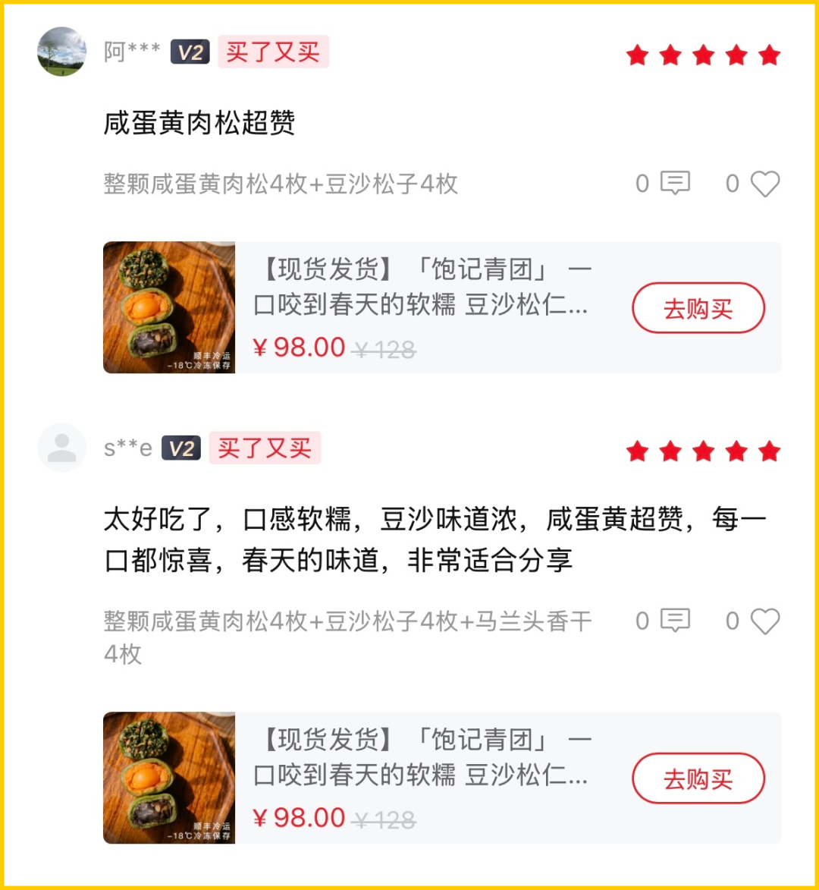
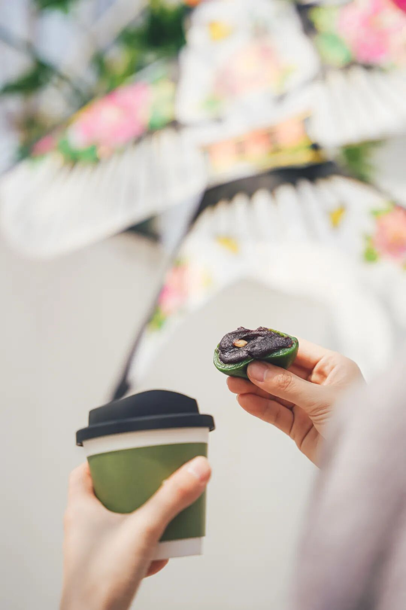
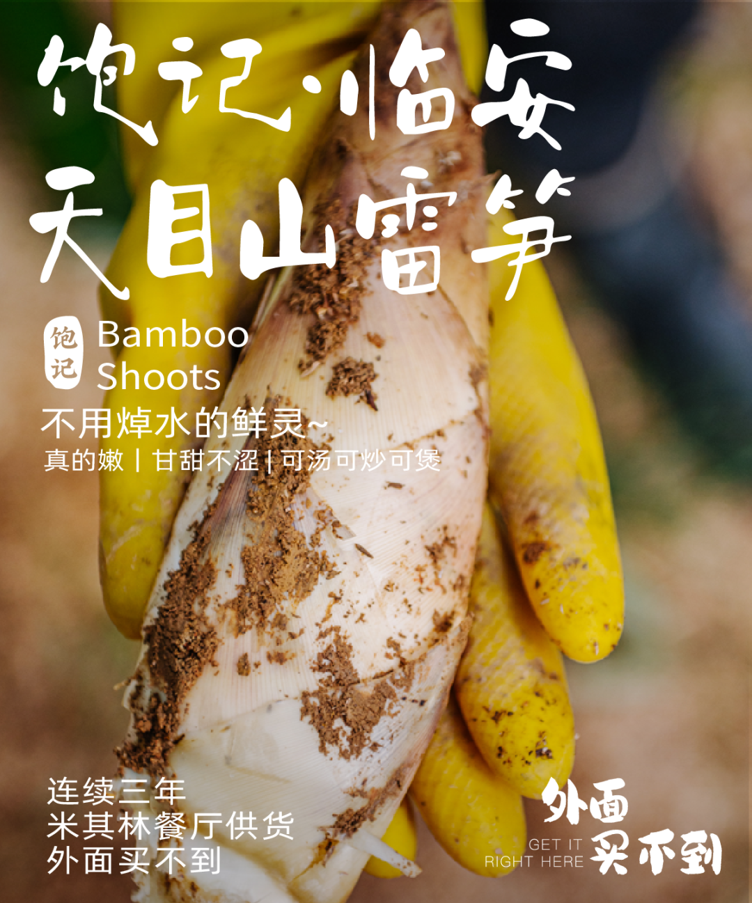

# 为什么歧视经典款啊。。。

- 原文链接: https://mp.weixin.qq.com/s?__biz=MjM5NTYxODQyMA==&mid=2653468732&idx=1&sn=b00d97bc4df5be760aed906eb0b4ba27&chksm=bcf3aed546a0225921b914aca9845bfd44d28aa0c18234111110179108f5d90e320aef54bda6&scene=27#wechat_redirect
- 浏览量: N/A
- 点赞数: N/A
- 评论数: N/A
- 转发数: N/A

## 正文

就挺秃然的

一个尽情安利自我的公众号

以下是没事干研究院的风物研究报告请放心食用
啊啊啊啊啊！今天本想躺着摸鱼，结果一看青团，怎么还赫然在架啊？？？？我看大家就是不想让我薯角下班！

今年份的我司青团，全家福彻底卖空了！（后台好多人问，客官明年再来～现在只剩「咸蛋黄肉松+豆沙松子」双拼，断码出！！错过就真的明年见啦！

大家别歧视经典款啊！经典口味更考验配方和手艺，看着长一样，吃起来千差万别。本薯自信地说，我司这两款，测评起来那些老字号都比不过。

先看皮馅比，市面上有的青团个头不大，皮倒是占了一半。其中对比最明显的是，咸蛋黄肉松口味，饱记会塞一整个咸蛋黄，

吃起来油沙沙的。

再说大小，看图。我司青团是大到 4 个就能装一笼的哦：

有朋友问：这青团甜吗？油吗？大家放心！我们充分考虑了这两个需求，用油和糖都很克制，亲测吃完一整个都不腻。

热乎乎的整颗咸蛋黄肉松，名副其实，肚子里有一整颗咸蛋黄！搭配猪肉松 + 白芝麻，塞得圆滚滚，软糯咸香！有趣。

市面少见的整颗咸蛋黄还是从洞庭湖现运现蒸的！

再来一枚豆沙松子，哟呵，皮儿又薄又弹，豆沙细腻爽滑，松子香喷喷，一口流心，又是另外一种滋味。爽滑。

豆沙需提前炒制好，再搭配上饱满的东北松仁。

当然皮子这一块也没放过，上海传统青团的皮子偏软粘嘴，不如江浙一带青团更带劲儿，糯糯的又不失嚼劲。

所以特别加入了泰国糯米粉，吃起来，QQ弹弹能拉丝。。。。

后台总有人问：这青团一定要蒸吗？没错没错！且一定要蒸个二十分钟左右。因为我饱记青团还是热加工工艺，需冷冻保存，相比市面冷加工青团，蒸好后皮子更为软糯有韧劲！

掀开一锅热气，才敢说是亲妈味道呀～～

本薯在这里吐血推荐诚挚邀请，所有爱吃青团的朋友们，来品品我司亲妈青团。。。你不相信我，也要相信我们尊贵的饱记客人

总之，数量不多！吃完就没！限时断码 85 折！！

收到货之后，

强烈建议大家尽快吃掉！

怎么吃？

无需解冻，无需拆保鲜膜，

蒸锅水开上锅蒸 20 分钟左右就行。

如果不立即吃，

收到后请立即放入冰箱冷冻（-18℃以下）保存，

冷冻保存60天。

饱记·妈妈牌青团断码现货！！限时 85 折！！！
戳图或去🍑🍑🍑搜索「艾格吃饱了」下单购买👇

题 外

朋友们江南已是春光好，

一些时令好风味，大家一起吃起来！春季的东海野生海鲜，

现在有肥美的银鲳和红膏梭子蟹，

都是高级餐厅水平！

限时吃海鲜 9 折！

上周刚回归的金山鸡，

这次有 12 个月龄滋补老母鸡，想当包邮区大孝子的速冲！限时 7 折！

再不吃就没了的临安天目山雷笋，

米其林餐厅师傅第三年回购，

不焯水就鲜甜！

现在有限时 9 折！

还有些只有最近这一阵可吃的水果👇

甜蜜嘎嘣脆的花香小弹珠蓝莓，

难得回归的泰国超甜多汁金柚，

卷中卷红玉芒果，

来自湖北的超甜晚熟红橙，

娇艳可人的雷州木瓜，

口味浓甜的蒙自花长虹枇杷，

来自精品小果园的云南沃柑，

好吃不怕胖的广西芭乐，

人称「水果冰淇淋」的凤梨释迦！

现在也有限时 9 折！

此外 90 天短保质期的大师凤梨酥，

也都有限时 9 折冲冲！

饱记·东海冰鲜鲳鱼

购买方式如下

限时 9 折！！！

戳图下单购买👇

饱记·东海春季红膏梭子蟹

购买方式如下

限时 9 折！！！

戳图下单购买👇

饱记·云南稀有品种瓢鸡本周四起按顺序发货！限时 7 折！！！
戳图下单购买👇

饱记·2025 临安天目山雷笋购买方式如下限时吃笋 9 折！！！
戳图购买👇

饱记·花香脆甜蓝莓

购买方式如下

限时吃水果 9 折！！

戳图购买👇

饱记·多汁泰国金柚

购买方式如下

限时吃水果 9 折！！

戳图购买👇

饱记·海南红玉芒果购买方式如下限时吃水果 9 折！！！
戳图购买👇

饱记·晚熟超甜红橙购买方式如下限时吃水果 9 折！！！
戳图购买👇

饱记·湛江雷州木瓜

购买方式如下

限时吃水果 9 折！！

戳图购买👇

饱记·凤梨释迦购买方式如下限时吃水果 9 折！！！
戳图购买👇

饱记·蒙自花长虹枇杷购买方式如下限时吃水果 9 折！！！
戳图购买👇

饱记·云南晚熟沃柑购买方式如下限时吃水果 9 折！！！
戳图购买👇

饱记·广西芭乐

双拼&奶油芭乐

限时吃水果 9 折！！

戳图购买👇

饱记·新鲜到货凤梨酥

限时 9 折！！！
戳图购买👇

本文的研究员

薯角我想我知道春天的味道

用好吃的方式吃一生

祖国各地好风物

文章转载请加微信「baojiclub」

