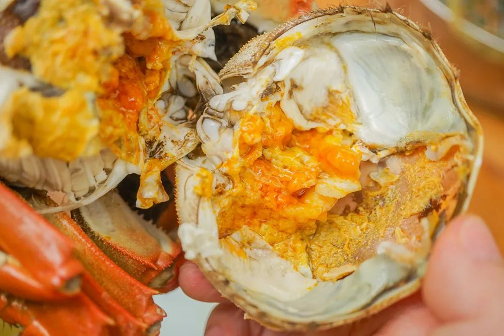
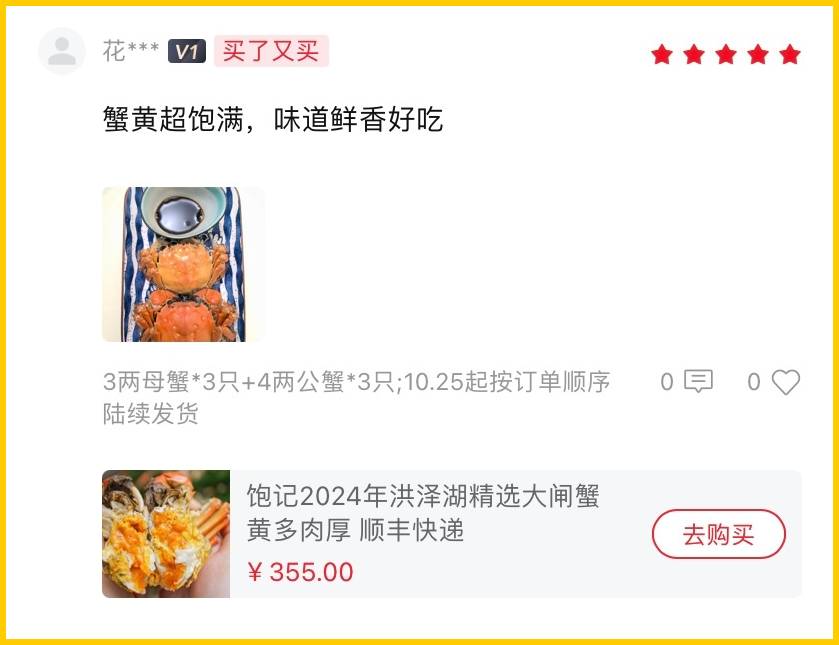
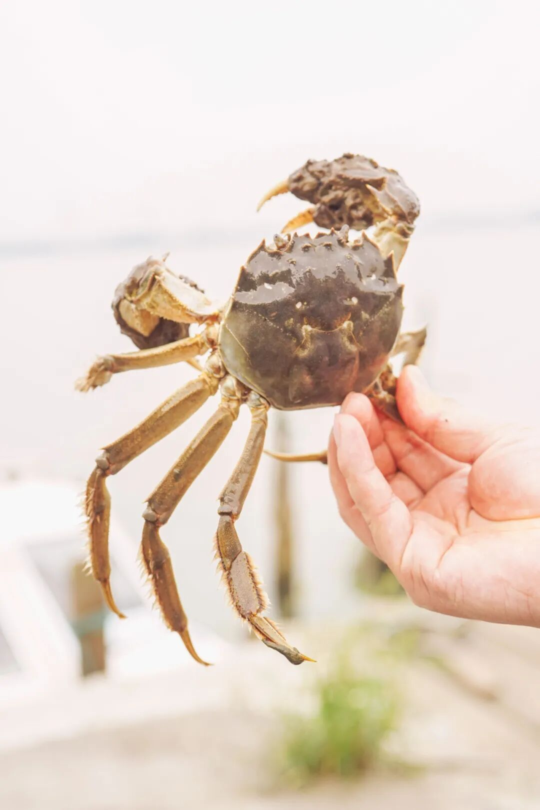
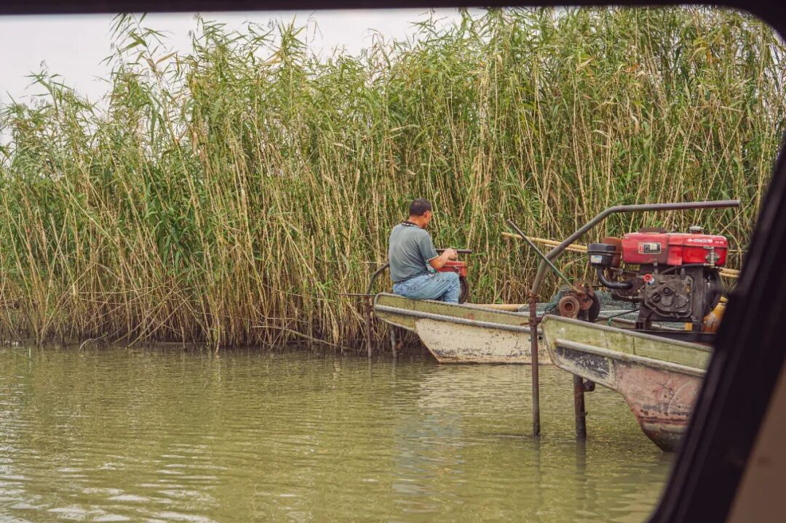
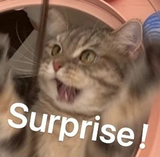

# 为什么歧视苏北啊。。。

- 原文链接: https://mp.weixin.qq.com/s?__biz=MjM5NTYxODQyMA==&mid=2653461483&idx=1&sn=50903a857894d3f817a1933c5ce5095c&chksm=bc3764178195abb444a0d05d37665dcfe5e00a0a91dea55ad65a159d4610361715eedcf5387f&scene=27#wechat_redirect
- 浏览量: N/A
- 点赞数: N/A
- 评论数: N/A
- 转发数: N/A

## 正文

实名反对地域歧视

一个尽情安利自我的公众号

以下是没事干研究院的风物研究报告请放心食用
每年此时，我司洪泽湖大闸蟹上线，后台又要有人说了：
啊，可是这是苏北蟹啊。

我：。。。苏北蟹也不行？？

本薯今天就来实名反对地域歧视！！

口碑第七年，

宝藏小产区性价比之选！

只只都有品质保证的

淮安洪泽湖好螃蟹。

像这样👇

先来说说饱记为啥挑中洪泽湖呢？

原因很简单，

比起南北问题，

水质问题才是我们最关心的。

图源@洪泽政府网

洪泽湖，中国五大淡水湖里排第四位。

这个产区，湖大水深，风高浪急，

所以这蟹生存不易，

基本上是半野生的状态。

吃起来自带微咸，

蟹味是汹涌的鲜浓。

（苏南蟹则会偏甜一点

当然了，

每个湖里其实都有好吃的螃蟹。

关键还是得精挑！

我司只要湖里顶尖蟹的前 10%。

合作伙伴同时供货上海国营大酒店，

是行业内专业人士认可的货源！

且饱记要的发货品质比酒店还要更好（骄傲脸

每一只上岸后还要再养几天，

让蟹把苦水吐出来，

滋味更纯粹。

顺丰直发，收到会吐泡泡嘞。

承诺足斤足两发货。规格说是多重，到手一定多重，甚至超重！
你们吃过就知道了，拿在手里都是沉甸甸的。

总之，溢价少，肉质好，性价比高。苏北蟹风味顶流！比那种乱七八糟渠道买的死贵玩意儿，
真是靠谱多了。

看看后台今年真情实感的好评👇

好吃，不贵，猛吃不心疼！（保价双11，买贵退差
推荐搭配镇江香醋，把鲜味简单钓出来，就很香很香很香！

这种只只开出来都爆黄的快乐，我也想让你体验到！

满黄流心啥的都是常规操作！

不多说了👇🏻👇🏻👇🏻

饱记·洪泽湖大闸蟹

购买方式如下

双十一同价限时 86 折

满足装洪泽湖大闸蟹：

3 两母蟹，4 两公蟹。

性价比之选！

劲爽装洪泽湖大闸蟹：

3.5 两母蟹，4.5 两公蟹。

饱记热销款。

尊享装洪泽湖大闸蟹：

4 两母蟹，5 两公蟹；

或 5 两母蟹，6 两公蟹。

实际超重，量极极极少，送礼佳品。

人工精挑，

上岸后静养一两日更鲜美，

每日限量 100 箱。

顺丰快递发货，新鲜看得见。

戳图下单购买👇或🍑🍑🍑搜索「艾格吃饱了」

那么问题来了，

我司为什么不挑挑苏南蟹呢？

有的！！

今年终于找到符合饱记标准的，

老板下乡调研时所得👇

来自太湖流域的精挑大闸蟹，

属包邮区顶流口味！

至于为什么不是赫赫有名的「阳澄湖」，

原因很简单，

阳澄湖不给养啊。。。

现在很多自称阳澄湖的，

其实都是岸上塘养的，

虽然有标，但根本就是塘蟹啊。

一个热知识：大闸蟹分两种——湖蟹和塘蟹，

湖蟹是在天然湖泊中围网养殖，

塘蟹是在人工水塘中养殖。

味道根本比不了。

很多米其林黑珍珠餐厅也都因为阳澄湖禁养，

在用各个流域的蟹，

比如金湖，「太湖流域」等。。。

（因为真正的太湖湖底也禁养了

所以苏州吴江盛泽这块，

就是苏南蟹的标杆美味！

连上海老牌吃蟹国营大店王宝和也说

自己的蟹是「太湖流域」。

比起洪泽湖的浓郁鲜浓，

太湖流域的蟹蟹肉微微带甜～

推荐你在醋里加点糖，

搭配起来风味有惊喜！

饱记指定 3000 亩湖面，

活溪入水，清水整湖放养。

是正宗的清水大闸蟹，

不容易有土腥气！

这里的水深 2.5-2.8 米，平底锅型硬质湖底，

与阳澄湖底类型近似👇

上岸的螃蟹，

都得再养几天，

喂一喂玉米、小鱼，

让螃蟹把苦水都出来，

成本上去了，

但养出来的蟹就很有一番鲜甜滋味。

还得经过几番精挑！

我司只要最优秀的前 10%，

壳一定要硬，

证明脱壳已经有一阵时间了，

里面的肉才饱满鲜甜。

老板还说，在江浙沪买蟹，

有时候看到的和收到的完全两码事。

我司的信誉，有盛泽当地村里的书记保证！

为了给村民谋福利，

书记不时就去帮咱们亲自视察和监督，

给到大家品质保证。

「每一只都要挑选，确保万无一失」。

（书记原话👆

人工一只只慢慢看。

确保每一只都腴美非常，

才能发货给到大家！

（像这样👇

悄悄放句狠话：

即使是真正的阳澄湖底、太湖底大闸蟹，

也没在输的！

除了少量死蟹，

（签收时联系客服按只赔付

没有风味上的差评！

什么蟹王府、王宝和，老板通通试过，

真的不如我们嘿嘿～

现在太湖流域大闸蟹新增6 只装，

帮大家把价格打下来！

送礼自吃都大大方方、体体面面！

努力了八年，终于可以自信地说，

不管苏北还是苏南，

我司挑的都是顶流美味！

滋味外面的根本比不了！

洪泽湖的蟹味鲜浓，

太湖流域的微微带甜，

两种口味大家各取所需！

Peace&love!

饱记·太湖流域大闸蟹

购买方式如下

双十一同价限时 86 折

三种搭配：

满足装，

3-3.4 两母蟹，4-4.4 两公蟹，

吃过解馋。

劲爽装，

3.5-3.9 两母蟹，4.5-4.9 两公蟹，

可以拍照发朋友圈争奇斗艳。

尊享装，

4-4.4 两母蟹，5-5.4 两公蟹，

顶格水准，适合送礼。

人工精挑，

上岸后静养一两日更鲜美，

每日限量 50 箱。

拼的就是手速。

顺丰快递发货，

新鲜看得见。

戳图下单购买👇或🍑🍑🍑搜索「艾格吃饱了」

题 外

感觉大家在歧视公的。。。

本薯说的是公鸡！

我司外面买不到的云南黑脚鸡，

还剩几十只 6 月龄公鸡！

物种有别！

公鸡很好啊啊！！（尖叫脸

肉多！油少！还清甜！

现在还给 65 折地板价！

此外还有我司卷里卷气的手工腊肠&腊肉&腊排骨，今年份的也都上架啦！煲饭、炒菜、下酒无所不能！
双十一 9 折地板价！

饱记·云南稀有品种瓢鸡

购买方式如下

双十一同价 65 折！！

一种规格，最后一点点：6 月龄公鸡净重 3.4 斤以上。

下单前请注意：此鸡蛋白质含量丰富，宰杀时已尽量放血，但少量余血开包时气味仍会比较大，请冲洗再食用！鸡皮不发粘，就绝非变质～～～
戳图下单购买👇或🍑🍑🍑搜索「艾格吃饱了」

饱记·手工腊肠

购买方式如下👇

双十一同价 9 折！！

三款口味，各有各的特点。

用的黑猪肉、天然肠衣、玫瑰露酒...

酒香腊肠，酒香浓郁，

有四六和二八这两个肥瘦比例可选。

滇式腊肠用了不少贵价的辛香料，

同事说超适合拿来做西班牙海鲜饭，

试过加辣肠后升华了。

戳图下单购买👇

或🍑🍑🍑搜索

「艾格吃饱了」

饱记·玫瑰露酒腊肉&腊排骨

购买方式如下👇

双十一同价 9 折！！

戳图下单购买👇

或🍑🍑🍑搜索

「艾格吃饱了」

本文的研究员

薯角你好啊海绵宝宝

用好吃的方式吃一生

祖国各地好风物

文章转载请加微信「baojiclub」

