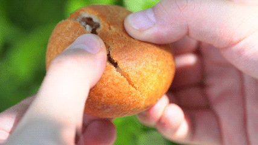
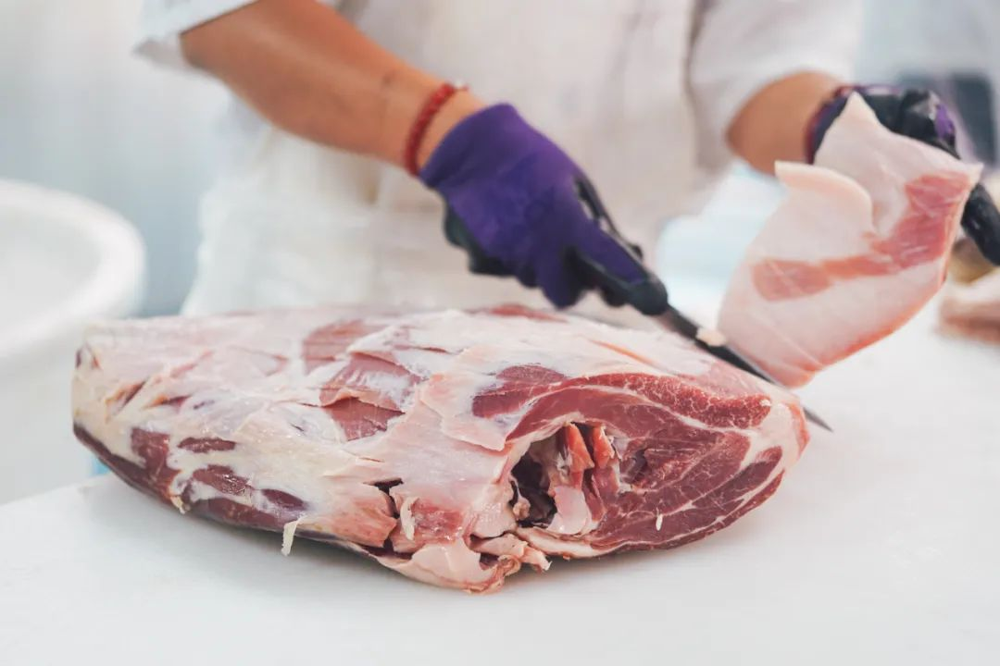
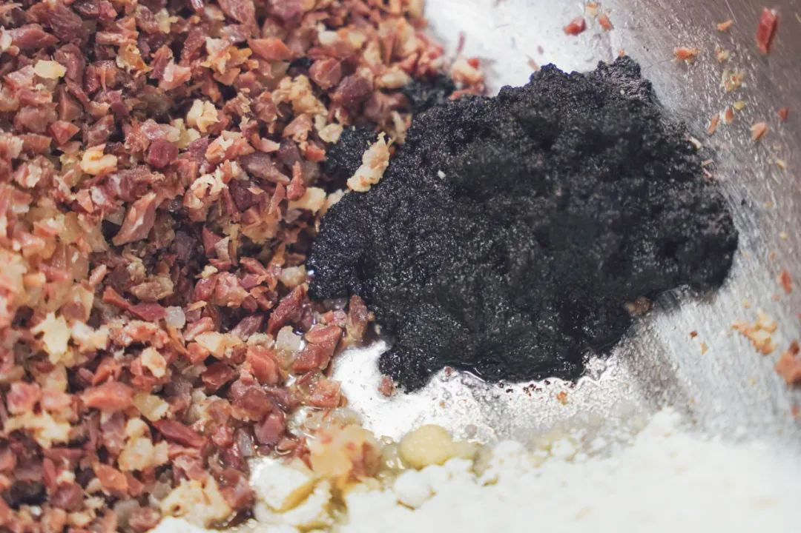
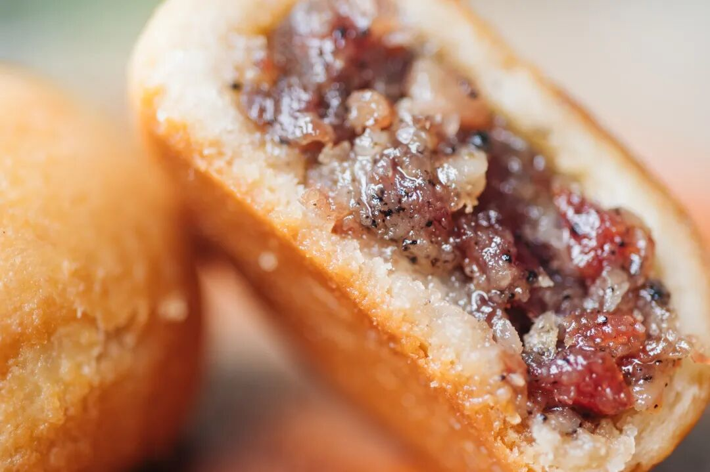
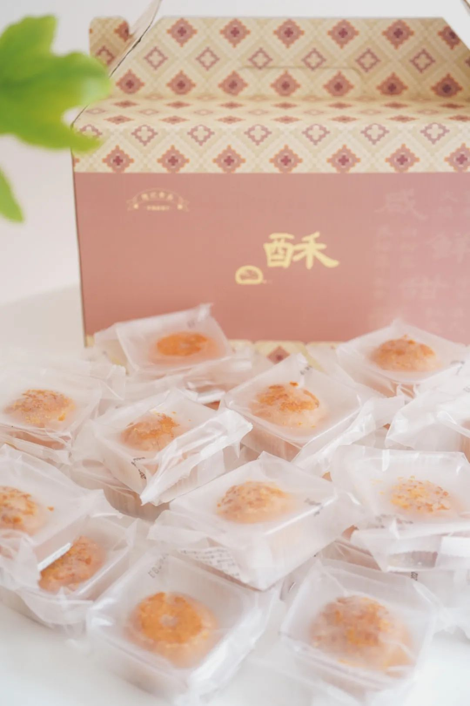

# 云南老师傅的要求，吃完你就理解了

- 原文链接: https://mp.weixin.qq.com/s?__biz=MjM5NTYxODQyMA==&mid=2653458127&idx=1&sn=76d05923ae323ef3168e1dbde08c4473&chksm=bc2d844d46183f96999bcbe52538f9a5ddaa7a5903331e8796bb2359755cccf7d5698977f6c2&scene=27#wechat_redirect
- 浏览量: N/A
- 点赞数: N/A
- 评论数: N/A
- 转发数: N/A

## 正文

酥酥服服

一个尽情安利自我的公众号

以下是没事干研究院的风物研究报告请放心食用

有的食物好吃，

全靠背后百里挑一的老师傅，

带着几十年经验上场，就算给了一样的配方，也复刻不出来同样的味道。

比如我们合作的云南老师傅，

和了二十多年的面，

烤出来的云腿小酥，

市面上随便比～

按老师傅反复说的：

一颗地道完美的云腿小酥，

要从皮、馅、调味三方面一起抓。

皮是熟手的老师傅揉的👇

反复搅拌，

再人工手揉上劲。

馅就更有来头了，

老师傅说，

关键要用「自然发酵陈宣威火腿」。

肉用得好，酥才够香，且油润而不肥腻。所以我们卷到了，
宣威海拔 1800 米左右的高山里！在高海拔环境自然发酵的腿，和平地上催熟腌制的腿，绝不可同日而语！

选用其中三七分的火腿，有香香的油脂～又能嚼到肉的鲜甜～

最后是调味，

一定要用云南当地采的杂花蜂蜜，

真 · 自带花香，
浓郁地去炒云腿馅儿。

最后拌上欧洲米其林餐厅常用的黑、白松露酱，用料超级舍得，香味浓郁得能直接穿透皮子～

不是我薯角自夸，看看后台的真实评价👇

囤货装礼盒长这样👇量大实惠，一盒足足 30 枚！掐指一算，一枚只花个位数！

全家福礼盒与双拼礼盒，则是一盒 8 枚，精致中带着东方韵。

薯角我把好评怼到老板眼前，
薅来限时 9 折！！大家速速下单，给我冲！！！！

饱记·滇式云腿小酥
现货！！！限时 9 折！！！
传统滇味经典，新鲜手作，浓情四溢。
🥮四个口味：经典云腿、蛋黄云腿，黑松露云腿、白松露云腿。
🥮三种规格：云腿酥礼盒全家福（四个口味各 2 枚）云腿酥礼盒双拼（经典云腿小酥*4 枚+蛋黄云腿小酥*4 枚）
云腿酥礼盒囤货装
（经典云腿小酥*30 枚）
戳图买它👇

题 外 一

又到了一年里最好的金秋，

本薯给大家整个时令风味专区！

外面买不到的奶黄月饼，

半岛嘉某楼奶黄月饼的创始配方，

邀请米其林大厨调整减糖，

这周已经开烤，限时 9 折！！

卷了三年的云腿酥，

米其林级别的舟山月岙梭子蟹，

天赐山珍云南野菌子四种（鲜的

生吃都鲜甜的香格里拉松茸，

蜜蜜甜的

新疆三色葡萄及海南钦蜜 9 号百香果，

以及用正宗融安滑皮金桔，
融入四川本地土蜂蜜，浸皮萃取来的金桔蜂蜜酒！数不过来，吃得人心满意足！限时 86 折起！

冲吧！

饱记·奶黄月饼礼盒
购买方式如下👇限时 9 折！！
饱记独家配方，外面买不到！
🥮 新鲜手作，外皮酥脆，内里奶香浓郁～
每日限量 100 份。下单后按顺序发货。
戳图买它👇

饱记·秋日风味专区
购买方式如下
86 折起！

秋日里的时令好风味。
地下种的，
水里游的，树上长的，
厨房里烤的。
应有尽有，莫要辜负哦～
戳图买它们👇

题 外 二

有时真为一些食物不平，
这么好吃怎么无人问津？？天然酸甜的空心山楂球，
越啃越香脆的圆墩墩玉米浪，以及招牌南乳香葱蛋卷等，含泪临期清仓，都是实打实的折扣！！无需凑满减！⚠️PS：清仓产品临近效期，介意慎拍～

饱记·临期清仓专区
5 折起！

清仓产品临近效期，所以巨折，但自家吃吃没问题！介意慎拍～
「临期清仓」专区，5 折起！！清仓产品临近效期，介意慎拍哦～戳图买它们！！👇

本文的研究员

薯角很高兴为您服务！

用好吃的方式吃一生

祖国各地好风物

文章转载请加微信「baojiclub」

