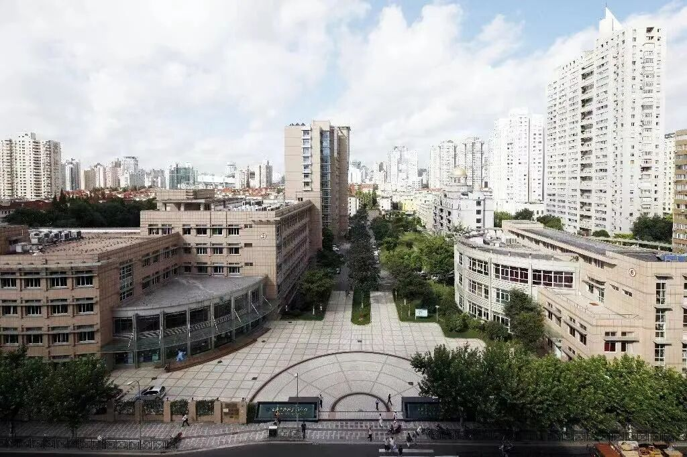
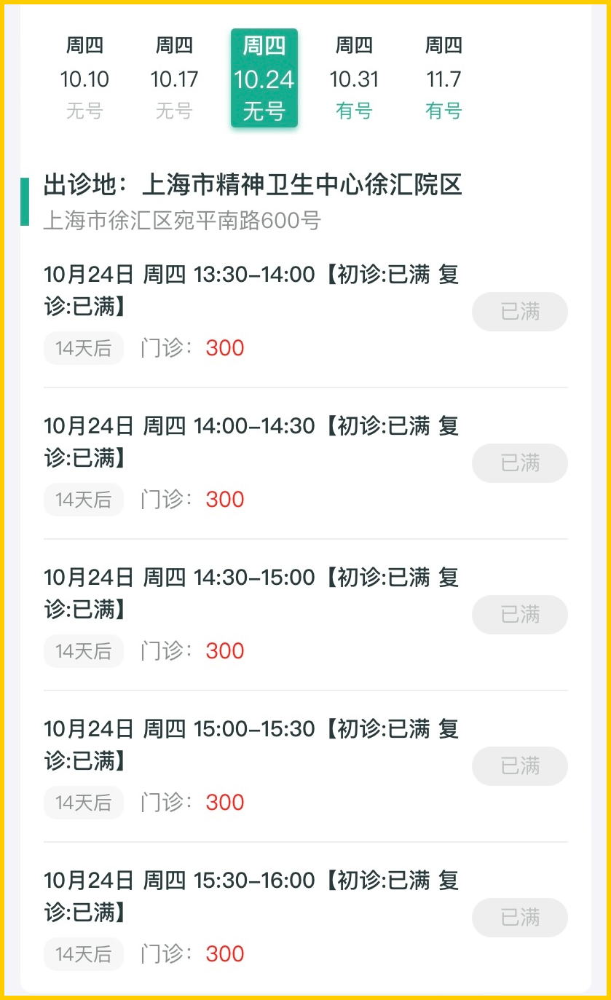
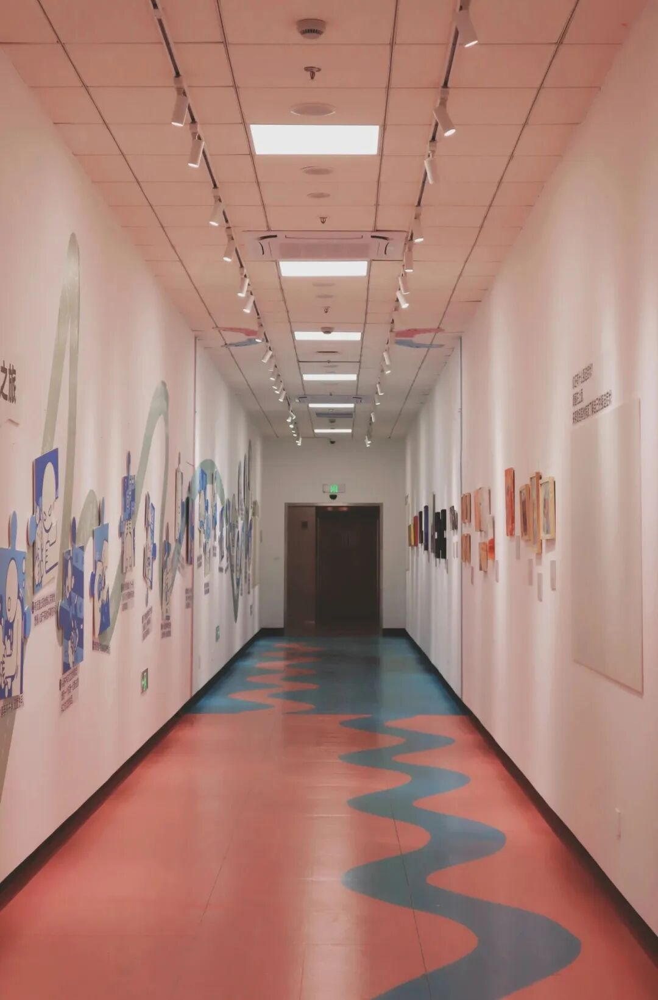
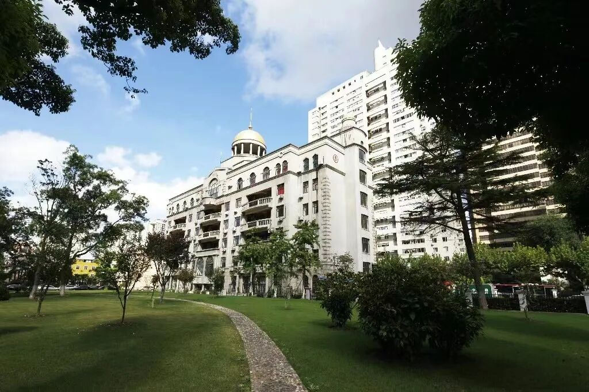

# 他从精神病院回来了。。。

- 原文链接: https://mp.weixin.qq.com/s?__biz=MjM5NTYxODQyMA==&mid=2653460084&idx=1&sn=03962b152bffe7496e91a4f12db2f3ce&chksm=bce40e92cd2f143fbd841fcf8632e03c9596cb1c3aae8d50c57f1ddfa8e4f38751e806a1f360&scene=27#wechat_redirect
- 浏览量: N/A
- 点赞数: N/A
- 评论数: N/A
- 转发数: N/A

## 正文

真的有病

每周消费报告
均没有广告软文请放心食用

哈哈哈今天是世界精神卫生日。

这篇稿子我想写有大半年了！

看下去，有点意思。

去年陪朋友的妈妈，

每月去一次宛平南路 600 号

看特需门诊问诊配药，

持续了一年。

图源上海市精神卫生中心官方公众号

最大的收获是，

如果你平时想骂插队超雄大爷「你有病啊」，

可能他真的是有病

比如我朋友的妈妈，

单位业务先进，根本没啥问题，

只是有口皆碑的完美主义。

但医生诊断为中度焦虑，

确实有个风吹草动，她就失眠，

连续几晚睡不好。

没看一两次，

就说睡眠就变得好多了，

生活质量提升了一个台阶，

把我朋友笑得嘎嘎香，

说这辈子最英明的决定，

就是科普和说服了妈妈来看病！

图源上海市精神卫生中心官方公众号

医院里的患者永远人山人海，

男女老少全都齐全，

看 300 元一位的特需，

都要等上一个半小时。

随便点开一个主任号已经挂到月底了

然后各种插队且完全不理你的大爷，

满医院都是哈哈哈哈

我现在才知道他们是真有病

图源上海市精神卫生中心官方公众号

另一个大爷，

看见我穿的衬衫（内有吊带）解开了四颗扣，

滑着太空步倒退着回来看我胸口

啊啊啊啊啊当时确实正好是春天

还有一次，

我朋友妈妈刚排到队准备推门进诊室，

有一个全身羊绒加蒙口羽绒服的体面大叔，

看起来像小企业主，

突然斜插一步，抢先插队进了门。

为了假装没看到我们，

他还特意像一条鱼一样斜斜扭着滑了进去？？？

我当时怒：你有病啊？

结果一想咦他是有病。。。。

青春期的小朋友，

背着沉重的书包，

老远就感觉满脸写着不开心，

后面跟着明显控制感很强的妈妈，

有些还大声数落他们。。。

但医生说也未必全是家庭环境，

我排队时也见过一些小朋友，

父母非常耐心有爱，

但小朋友是惊恐症发作，可怜。

图源上海市精神卫生中心官方公众号

医生说现在看病的，

大量都是焦虑和抑郁。

这么一说，其实我有不少在大司上班的中年朋友，

年薪一百多万的，

不少都经历过抑郁症发作，

就诊吃药，康复。

有个朋友说，偶然在公司里交流了下，

居然其它那些年薪一百多万的，

很多都吃过抗抑郁药。

更绝的是老板，

现在看来，有些明显是疯的！！！！

体面五百强外企，有老板能把下属

关在会议室里不停嘴高分贝

以「你是猪脑子吗」这种词骂上一个钟头？？？

我：你们应该也说服老板去看病啊？

答：老板才不去。老板不吃药，只好我吃药了：）））

所以，写这个文章，首先是告诉你，

不要怀疑，

当你想说「你有病啊」的时候，

这人可能真的有病。。。。

第二就是，焦虚啦失眠啦抑郁啦，

可以去看看。

现在药的剂量都很小，

而且半衰期短。我周围朋友问下来，

都说吃的时候缓解症状，

没啥其它不适。

图源上海市精神卫生中心官方公众号

最后，

老年人的焦虑抑郁，更值得关注。

他们的身体调节机能更差，

有机会，多了解看看。

好啦，我的精神病院观察笔记，

希望对人有帮助。

题 外

今天的话题稍有些沉重，

薯角我来带大家轻松一下！

一些十月的时令好风味，

眼下都是 9 折起！

比如今年新炒的山核桃，

和农大合作的第 11 年，

打遍天下无敌手！

来自云南石林核心产区的

不一样人参果，

云南 30 年老树上的绿籽石榴，

以及今年换了更卷果园的秋月梨，

都果味极浓且多汁！

还有东海的梭子蟹与野生大黄鱼，

云南的野生菌及鲜松茸，

即将说再见。

十月风物，限时 9 折起！

不时不食！快吃！

饱记·临安山核桃

购买方式如下👇

限时 9 折！！

戳图买它👇

或到🍑🍑🍑搜索「艾格吃饱了」

饱记·十月时令风物

购买方式如下限时 9 折起！！！
戳图买它！！👇

本文的研究员

闻 佳就是那个研究院嘴里「挑剔的老板」。关于食物，不是比你懂得更多一些，只是比你花了更多的冤枉钱。

用好吃的方式吃一生

祖国各地好风物

文章转载请加微信「baojiclub」

