# 仙居东魁最后一天，相见时难别亦难

- 原文链接: https://mp.weixin.qq.com/s?__biz=MjM5NTYxODQyMA==&mid=2653455564&idx=2&sn=bf45e676b228210e2d4338abb0a015b4&chksm=bc04dd3c9d1eb01e216fa978b459639e436dd817c38e904398a57a8f813eea8399866488b415&scene=27#wechat_redirect
- 浏览量: N/A
- 点赞数: N/A
- 评论数: N/A
- 转发数: N/A

## 正文

恭喜你！末班车！

一个尽情安利自我的公众号

以下是没事干研究院的风物研究报告请放心食用

转眼又到，

说再见的时候！

今年的仙居东魁杨梅，

细数下来也只有短短的半个月果季～

果农大哥说，

由于最近仙居阳光太好，

杨梅成熟得太快，

所以今天卖完，再吃就要等明年啦～

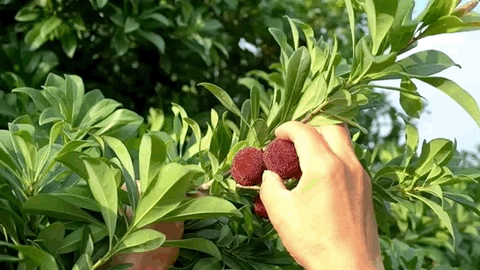

关于东魁，本薯此前已经把话说尽，

这就搬出来之前的稿子，

最后再抄发一次，

如果你是第一次看，

那。。。你也是幸运的！

这一粒粒，

大如乒乓球的朱红色果子，

色紫，多汁，味鲜灵，

实在是最近沉闷时节里为数不多的开胃惊喜！

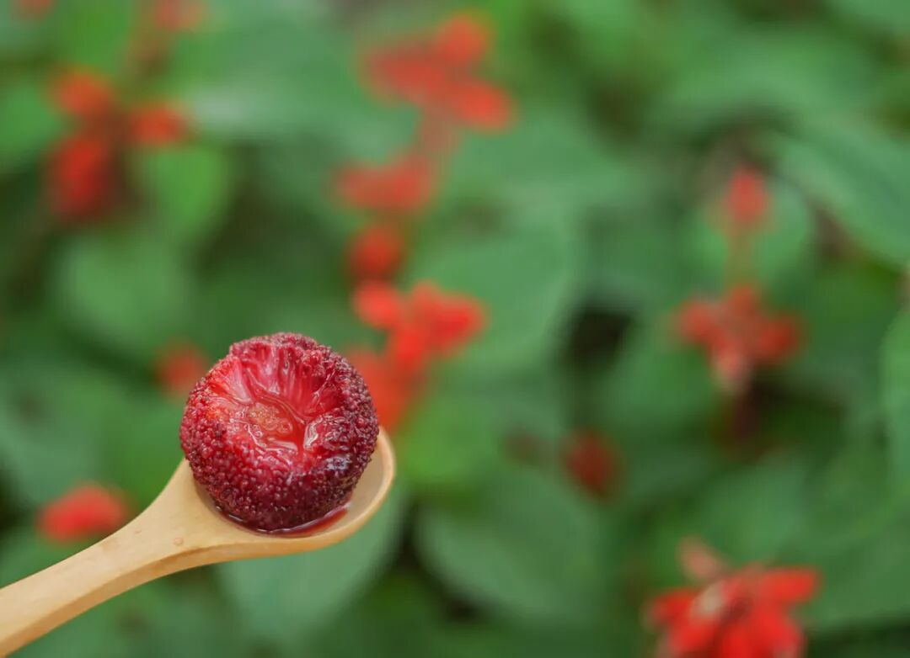

山间小盆地的杨梅已经吃光！

还好海拔一千米的高山杨梅熟得晚些～

更能淋漓尽致地展现东魁的鲜味，

所以现在摘的是更高的山区杨梅。

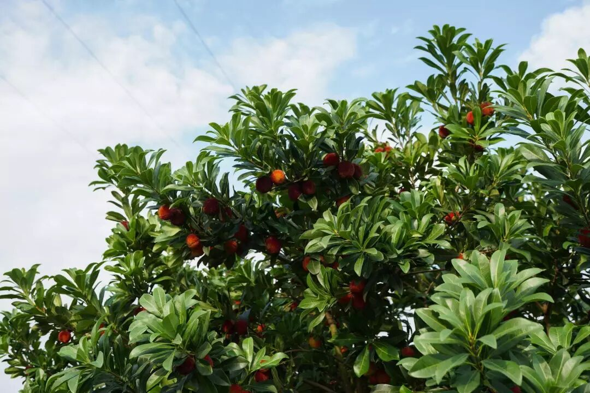

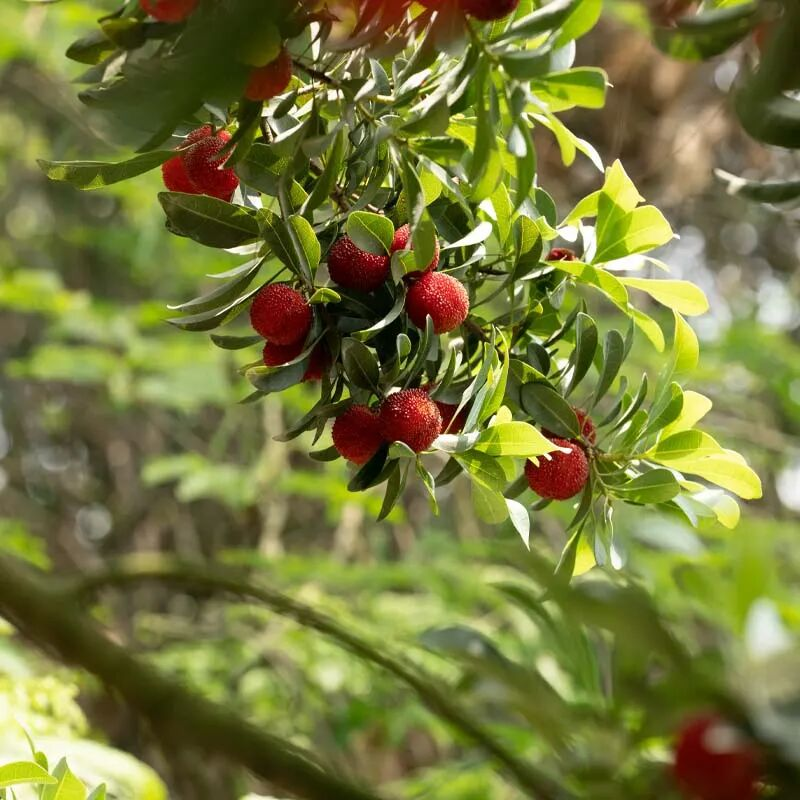

平均每枚 27 克的「优选大梅」，

便是大家熟悉的仙居大东魁。

但要强调的一点是！！！

大东魁的入口滋味，

甜中带有一点酸度骨架，

不是纯甜！不是纯甜！

所以很多第一次吃的朋友甚至会觉得偏酸～

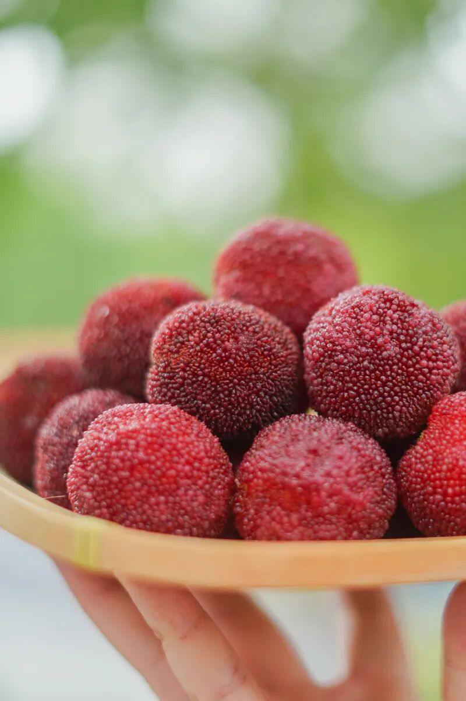

如果只想要甜的，

可以尝一下顶梅，即长在树顶的东魁杨梅。

个头稍小，大小也不统一，

但日晒更充足，甜度更高。

顶梅要阳光好的时候晒足一两天方能采摘，

发货时间更看天气，得等～

还有贡品级「特大杨梅王」，

限量没几份～

每枚则达 35 克，

看！比乒乓球还大上一圈！

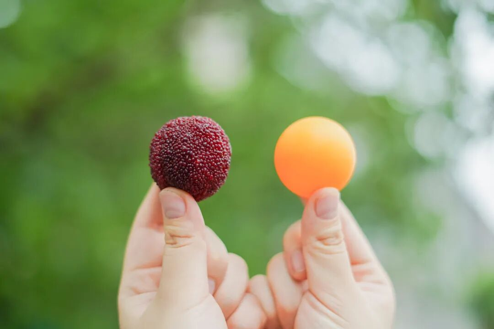

最高等级的好吃，也是最稀有的矜贵，

一筐筐的都是钱。。。

本来老板说别推了，

架不住好评来袭！！👇

本薯岂能忍住不炫耀？

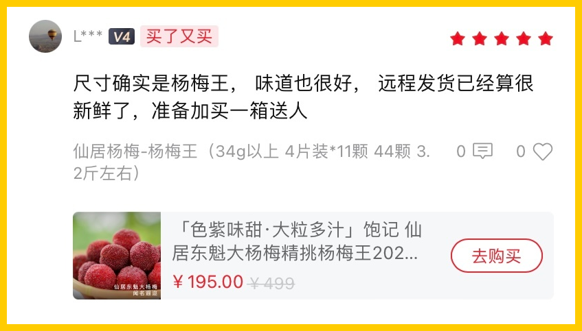

总之，包邮区顶流名不虚传，

每一年后台好评无数👇

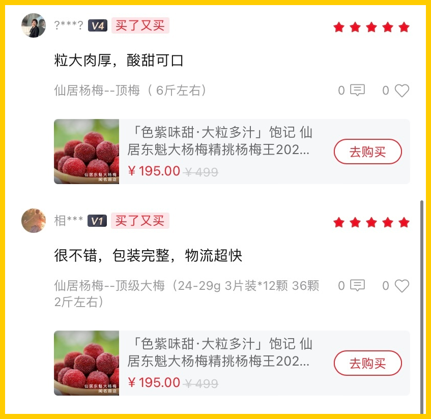

我司的仙居东魁，

即使要送包邮区里最挑剔的朋友也不怵的～

特点有三：产区正宗，个头大，果味浓。

每日凌晨，太阳出来前即刻采摘，下雨天不摘，不忽略每一个让果味变淡的可能～（但拍照还是有光才好看嘿嘿

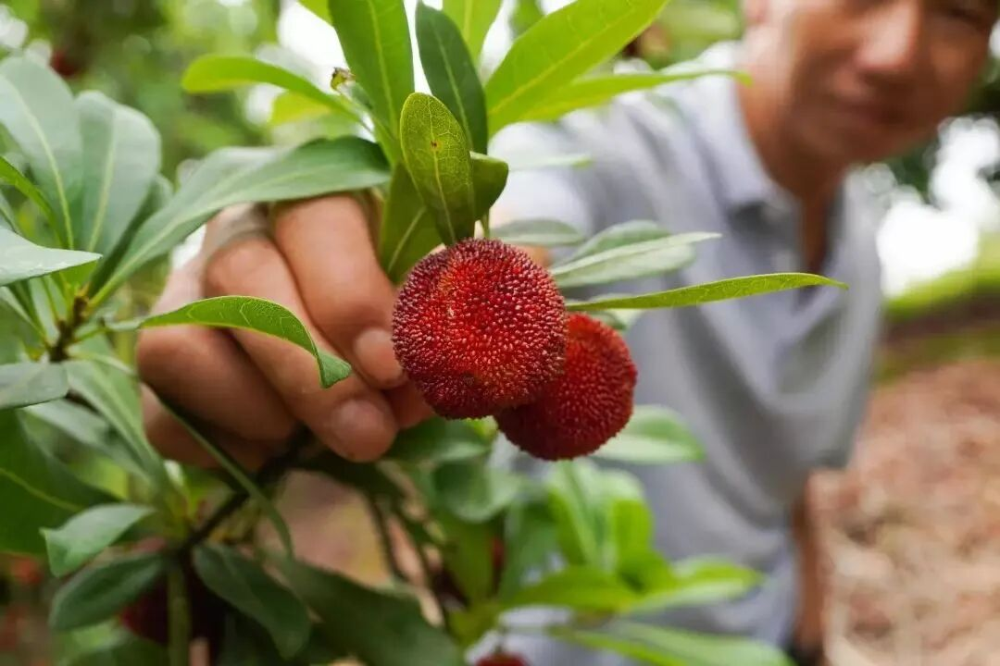

发出前要经过两轮人工筛选，一树杨梅，能过关发货的，一斤只得十数枚。

（一个枝头仅留一两粒大果，太小的人工摘除。

（有经验的梅农再进行筛选，个头匀称。

当天顺丰冷链发货。

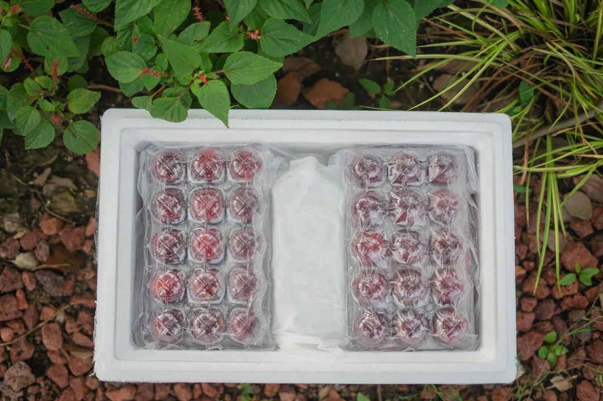

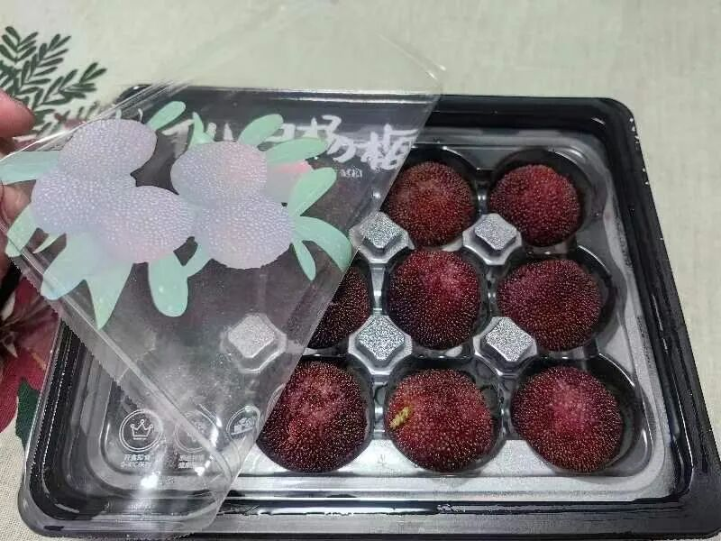

（优选大梅今年首次尝试了充氮气调包装，长这样👆
有人问：这杨梅怎么吃？

本薯在山里的时候，

看当地人都是直接吃的。说泡水会影响风味。

保险起见，大家可以用淡盐水略泡一下，

但不宜太久！出色味淡酒可惜了。

总之收到后尽快吃完！

如果实在吃不完的话，可以加点冰糖同煮～

虽然我实在想不出，

这么好吃还能吃不完吗？？

饱记·仙居东魁杨梅购买方式如下👇最后的 9 折！！！！
共有四种规格：优质大杨梅，单枚在 23-29g，两种重量可选，颗粒包装，2.3 斤装，共计 45 枚；4.6斤装，共计 90 枚。首次尝试充氮气调包装！更大程度锁住新鲜！甄选顶梅，6 斤篮装，个头稍小，但早熟、风味浓，很受喜欢。特大杨梅王，市面稀有、比乒乓球还大，每棵树上就一两颗左右，量少，2.7斤装，共计36枚，单枚在 35g 以上。

戳图买它！！！👇

题 外

比东魁更矜贵的的增城荔枝，今年本就产量低，眼下也是吃一日少一日因为天气原因，价格比往年翻了一倍，
虽然贵得有道理，但还是觉得好贵呵呵！！还是饱记的桂花乌龙更有性价比！限时早鸟 86 折中！
福州老茶人窨制，一层金桂一层茶，随手冷泡一杯，清凉且满口桂花香！
饱记·增城荔枝购买方式如下
一骑红尘妃子笑，说的就是增城！自古以来的岭南荔枝名产地～桂味、糯米糍和仙进奉，3 个品种，都是 3 斤装，小家庭吃吃正适合！
桂味、糯米糍、仙进奉，都是下单后 5 天内发，
饱记多年合作果园，只让有经验的老农采摘，只选树上熟！甜度高！滋味更饱满！
凌晨采摘，放冷藏预冷，当天直接从果园冷链车运输到机场，
减少荔枝脱温时间，为的就是新鲜！
戳图即可购买👇

饱记·桂花乌龙（小金罐）

购买方式如下

限时早鸟 86 折！！

安溪戴云山脉深处的六年陈炭焙观音，寒露前后打的新鲜金桂，饱记请来家中五代制茶的福州老茶人，以传统古法窨制，一层金桂一层茶，100 斤的茶要用 300 斤桂花分三次窨制。
观音茶染有花香，金桂衬着茶意～冷泡、热泡皆适宜！升级版小金罐，送礼自留都满足。
限时 86 折！！到这周五～

戳图即可购买👇

本文的研究员

薯角

再见吧朋友今晚我就要远航

用好吃的方式吃一生

祖国各地好风物

文章转载请加微信「baojiclub」

