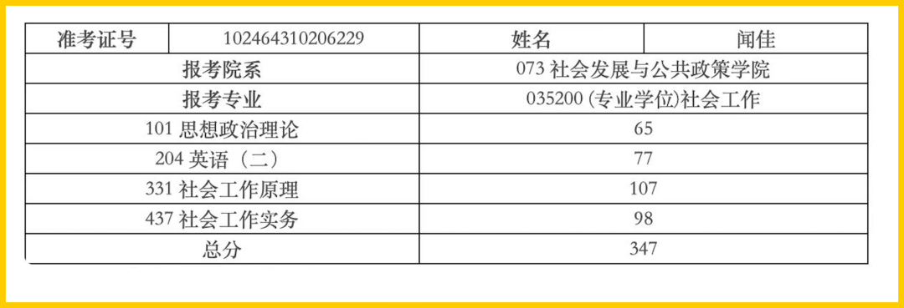
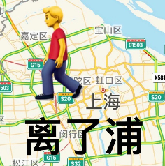
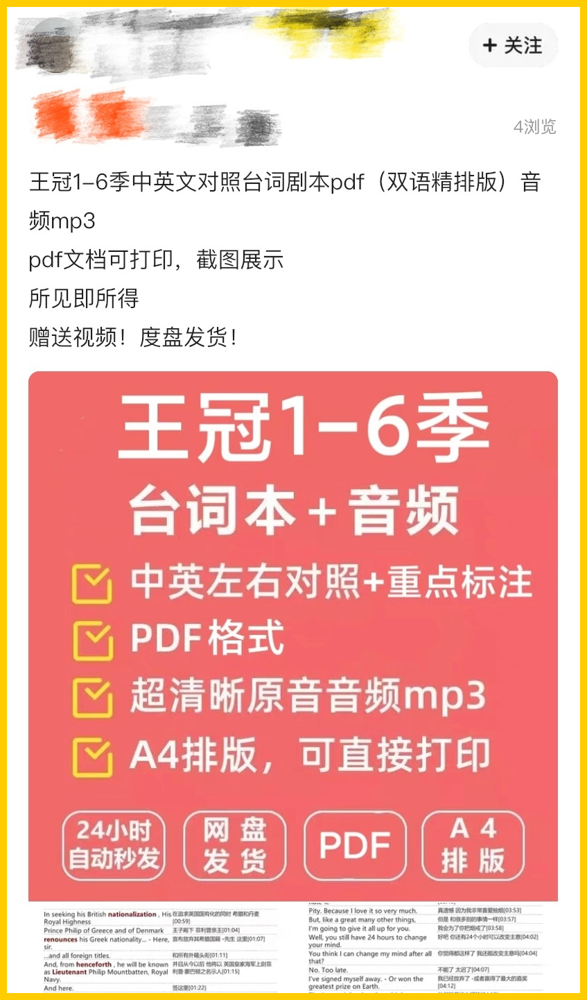
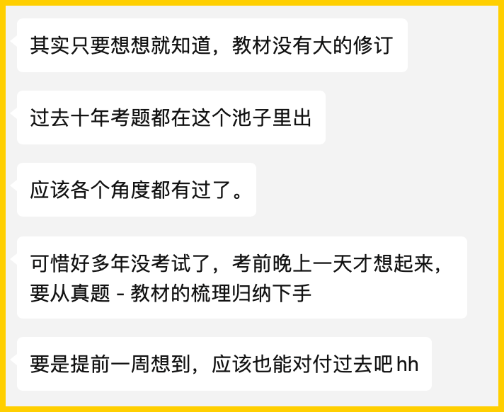

# 低分学姐考研心得【65折】

- 原文链接: https://mp.weixin.qq.com/s?__biz=MjM5NTYxODQyMA==&mid=2653455408&idx=1&sn=8d65191a857531f93f3cd90381ced7cb&chksm=bc98265c4e6de3b93117ce44868b68f8703c2ef62b51158de5b1442fa3cbfa6f50c62e34913a&scene=27#wechat_redirect
- 浏览量: N/A
- 点赞数: N/A
- 评论数: N/A
- 转发数: N/A

## 正文

老板不努力谁努力？

一个尽情安利自我的公众号

以下是没事干研究院的风物（学习）研究报告请放心食用

众所周知我老板去年考了一次研！

她复习了两个月，

共计四门课，

然后勇得 347 分！！

离复旦社会工作系去年面试分 370 分，

足足差了 23 分！

撒花！！！

但是老板毕竟是老板，

高考拿了本省第 29 的学霸。

她这么只整了两个月，

还只是上班之余复习下。。。

政治 65 分，大题全部押准，

比很多认真背诵的理科学霸都厉害。

英语她考的是【英语二】，

77 分，考过研的都知道。。。

这个就叫底子真的好。

然后我问她要了一下考研心得，

果然，她说，两个月时间，

至少一半花在研究怎么考试上

先讲她拿手的英语，她说首先是看单词。

不是直接背单词，而是大声朗诵例句，

红宝书 30 个 unit，

每天一个 unit 所有例句朗诵两遍，

一轮结束就再来一轮，早晚当放松就行。

（学霸的放松方式好特别哦。。。

复习单词的重点是朗诵，

读的时候就要把从句、断句分清楚，

这样可以大大提升阅读理解的效率。

「毕竟，卷子大部分分数是阅读」，

她轻描淡写地说。

（谢邀，光看到封面我已经睡着🙏

今年她不是还想考一次吗，

这次她找了新的语料来读。

一开始读复旦英文系的精读课本，

后来觉得程度太深，考试用不上。

结果发现奈飞的《王冠》台词特别好，

很多考研用词都是书面词。

（六季《王冠》的海报都美得不得了！

红宝书例句是中国人写的，

很多词用法都是引申义。

但《王冠》里的贵族，

则在日常生活中用这些词的原义。

举例来说，agitate，红宝例句是

「政治家的演讲 agitate 了听众」。

而《王冠》里的台词是：

侍从首领向被激怒的英王乔治六世说，

「我们不能让这样的小事

agitate 我们，do we？」

「英语本身是一种非常 reasonable 的语言，

理解原意，会对我们的阅读理解

大有帮助」。

（请解👆

作为一生要链接的中国女人，

本薯立即问：台词 pdf 哪里整？

老板：闲鱼。。。

英语试卷三部分，阅读就靠读单词，

翻译只能靠功底，好在分数不多。

作文，老板说题型都是一样的。

她在知乎找了考研专栏，

挑了两个她认为功底不错的，

在考前三天默写下大约七八个例句。

然后说这样就好了。

这，行吧。那政治是怎么考的？

老板：大题，高考时老师就说，

本届领导新提出的理念，肯定会在大题体现。

不同名师出的真题卷，

其实就是在给到相同考点的素材。

政治的客观题，

很多看起来考得很细，

好像要背很多。

老板这次考试的策略是：基本放弃。

她只花力气在研究本届领导

各个主张内部的逻辑关联上，

把大题做深做透。

（所以就这样也拿了 65 哦。。。

今年要提升分数，

她说就等名师们卷子出来之后，

把客观题涉及到的所有素材，

尤其是时事部分的，

都拿出来整理归类，

「看看能不能在不怎么花精力的

情况下，再提个 5 分吧。」

至于专业课，老板认为，

基础知识课，

她差在没有逐字背，

只是撸了遍凭印象去考了。

「因为找了两个 400 分以上的高分学弟，

都说是逐字背的。」

呵呵。这女人。

本薯不作评价。

现在回答一个问题：为什么老板一定要考研？

是中年危机了吗？？？

答：想读博。

对农业政策方面感兴趣，

工作里接触到大量实务，

希望能真切地找一个领域，

以学术研究的框架去解决实际的问题。

但是申博需要全日制硕士学历，

老板表示：能考就考一下，最省钱。

为上山下乡还不忘努力学习的老板鼓掌！！！

行！

本薯认为，既然低分学姐这么有决心，

本薯就拿几样考研零食给大家打个折，

分数就照老板考的政治 65 分，

给大家打 65 折 限时 24 小时！！！！！

我跟你说这个羊毛真的只因为老板才有，

一生一次！

毕竟我们要祝愿她今年考高分，

而不是再考打对折不是？？？？

爱的 65 折，启动！

从老板那儿薅来的考研零食！限时 24 小时 65 折！！戳图即可购买👇

题 外

老板推荐低分考研零食，本薯自有追剧专区！（学是学不了一点儿）梅雨季的周末窝在家里沙发，打开《王冠》（字幕版🙏）美滋滋泡一杯茶或吸溜果冻，健康又惬意！折扣，也是我们对老板的考试祝愿嘛～
饱记·0卡吸吸果冻临期购买方式如下👇亏本 5 折出！！
冰凉凉的 0 卡吸吸果冻，桃子、青提两种口味，
清甜不腻，真实还原果味～
目前库存效期还有一个月，临期折扣，索性打了一个骨折。。。吃完这一批就没啦～
适合想吃甜又想减肥的朋友，
直接吃或者搭配冷泡茶，一小包就能拥有快乐！便宜得像不要钱一样！
戳图或去🍑🍑🍑搜索「艾格吃饱了」下单购买👇

饱记·梅家坞西湖龙井购买方式如下👇8 折！！！！
明前头采（今年采摘时间为3月20日左右）、全手工炒制、除了典型的豆香，还有十分罕见的花香～
性价比高的西湖龙井，在杭州，任找一个茶馆，先不说有没有这种茶，即使有，一杯一两百不为过的。
适合日常囤货喝春茶，铁罐纸盒装。
戳图或去🍑🍑🍑搜索「艾格吃饱了」下单购买👇

饱记·惠明茶购买方式如下👇8 折！！！！

拿奖无数，可惜只有少数人知道

好喝了一千多年，来自丽水景宁

是中国国家地理标志产品，不错的口粮茶

生长在高山，鲜甜好喝有花香

来自非物质文化遗产继承人，品质请放心

戳图或去🍑🍑🍑搜索「艾格吃饱了」下单购买👇

本文的研究员

薯角

识食物者为俊杰

用好吃的方式吃一生

祖国各地好风物

文章转载请加微信「baojiclub」

