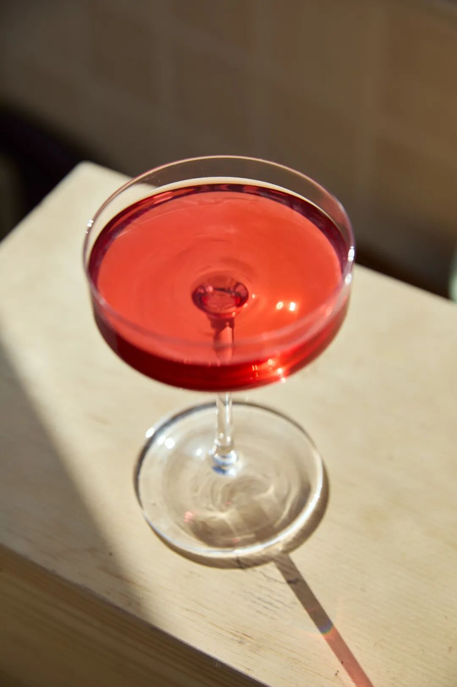
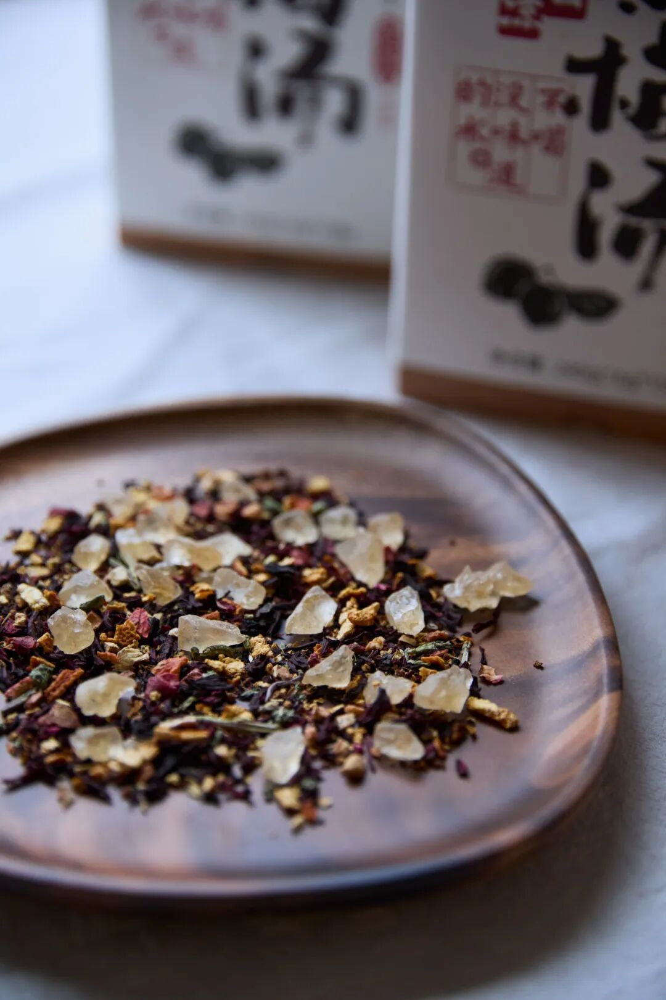
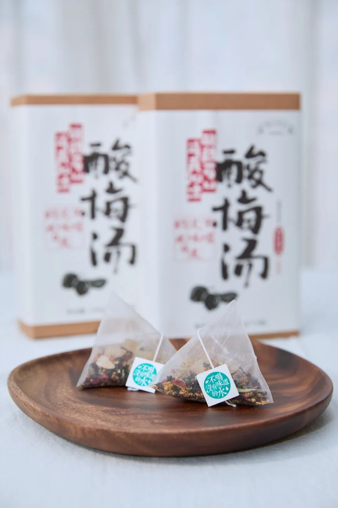

# 你一单，我一单，今天早早就下班

- 原文链接: https://mp.weixin.qq.com/s?__biz=MjM5NTYxODQyMA==&mid=2653456899&idx=1&sn=1826d31d9f93495c9f373b3a98c53bd8&chksm=bc5e884e005a46432f8e81c00968198f29c4d8003413de1f1ab98b281c6561e3eab867e01ecd&scene=27#wechat_redirect
- 浏览量: N/A
- 点赞数: N/A
- 评论数: N/A
- 转发数: N/A

## 正文

备战2048？

一个尽情安利自我的公众号

以下是没事干研究院的风物研究报告请放心食用

是谁 39 度的天气里还在打工？

哦原来是努力到快破防的

薯角我呀

要是奥运哪天举办卖货比赛，

本薯凭借在座各位的大力支持，

争个铜牌不过分吧？？？

（道德绑架我是真有一套啊

很好！今天依然是积极“训练日”！

来力荐一下，

这一杯摇晃的红酒饱记·酸梅汤，

给大家伙儿降降火！

酸梅汤，咱们中华儿女都熟。

产品同事说，

这次用到了八味配料：

乌梅、橘皮、山楂、薄荷，

玫瑰茄（洛神花）、甘草、桂花，

还加了一点冰糖中和酸味！

其他没啦！配方干净得很～

细致如产品同事，

呃，以本薯为灵感，

考虑到或许世界上也有人如我一般

连火都懒得开呢？

所以做了免煮的三角包设计👇

原料切得比较碎，

便于直接冲泡出汤，

有浓郁的乌梅及山楂香气，

猫闻了都说好！

（拒绝「动物表演」，它自愿的🙏

操作难度零颗星，

加热水让冰糖融化，

再静候几分钟即可。

可浓可淡，任君左右～

这么热的天还是更推荐冷泡！

冰镇后加点冰块，

酸甜清爽，

咕咚咕咚一大杯！

茶汤是透亮的红，

凉到心里去，

一秒解暑降温！

包装上的「酸梅汤」大字，

老板专门找了书法家题写的，

没办法，卷习惯了，

常规产品也收不住

八月了，

大家快买起来！

再不喝夏天都要过完了～

你一单，我一单，

薯角 2048 打女单（？

饱记·免煮酸梅汤

清爽解暑气

购买方式如下

乌梅、橘皮、山楂、薄荷，

玫瑰茄（洛神花）、甘草、桂花，

只佐以冰糖中和酸味，

配方干净用料足。

三角茶包设计，

免煮冲饮！

热泡回甘足，冷饮透齿凉！

戳图买它👇

或🍑🍑🍑搜索

「艾格吃饱了」

题 外 一

云南专场来袭！

山里的松茸，地上的瓢鸡，

还有厨房里酥香脆的云腿酥，

本薯一个都没落下！

肉质紧实的瓢鸡已经落户金山，

因为太热仅限上海地区购买，

限时 82 折！！

加野松茸一起炖汤，

可谓鲜的二重奏！

（不过松茸太贵打不起折）

还有

拌着黑、白松露酱的云腿酥，

越嚼越香！

早鸟 86 折！！

饱记·云南稀有品种瓢鸡和松茸一起炖鸡汤只发上海地区限时 82 折！！！

云南稀有品种黑脚鸡，
人称“人间小凤凰”。上海定向引进，吃天然粗粮长大。
目前只有公鸡，目前只发上海，（因为太热上海地区半日达。
PS：瓢鸡蛋白质高血气味大，宰杀时已经尽量放血，但收到有可能还会有气味，冲洗干净即可不影响食用！

戳图下单购买👇

饱记·香格里拉野生鲜松茸

一口价！打不起折！

购买方式如下

饱记的鲜松茸，

采自海拔 3500 米以上原始松木林。

只发 1-2 级符合出口标准的松茸。

新鲜采下送冷库保鲜，

冰袋+吸水纸保鲜，顺丰发出。

戳图买它👇

或🍑🍑🍑搜索

「艾格吃饱了」

饱记·滇式云腿小酥

预售中！！！

早鸟 86 折！！！

传统滇味经典，

新鲜手作，浓情四溢。

🥮四个口味：

经典云腿、蛋黄云腿，

黑松露云腿、白松露云腿。

🥮三种规格：

云腿酥礼盒全家福

（四个口味各 2 枚）

云腿酥礼盒双拼

（经典云腿小酥*4 枚+蛋黄云腿小酥*4 枚）

云腿酥礼盒囤货装

（经典云腿小酥*30 枚）

现在是预售！

预计 8 月初发货！

戳图买它👇

题 外 二

今年的夏黑葡萄吃了吗？

刚到不久，

又至尾声，

来自上海马陆镇，

拿过铜奖，是高甜的爆汁小炸弹，

肉质细脆，基本无籽，

尾声 9 折！！

吃完就没！！

饱记·马陆夏黑葡萄购买方式如下尾声 9 折！！

马陆是上海的王牌葡萄产地，
获得了国家农产品地理标志，
饱记选择的果园曾于 2021 年获葡萄评比铜奖。
果肉饱满，风味浓郁。外皮紫黑，皮薄少籽。高甜！！！
🍇「饱记·马陆夏黑葡萄」两个规格：两串装·2.5 斤四串装·5 斤

建议放入冰箱冷藏，3 天内食用完。

戳下图购买👇

题 外 三

有时真为一些食物不平，
这么好吃怎么无人问津？？两个口味的招牌梅饼，
天然酸甜的黄桃干与空心山楂球，
越啃越香脆的圆墩墩玉米浪，还有扎扎实实的午餐肉片～含泪临期清仓，都是实打实的折扣！！无需凑满减！⚠️PS：清仓原味梅饼效期仅到8.6，介意慎拍～

饱记·临期亏本清仓4 折起！！戳图买它👇或🍑🍑🍑搜索「艾格吃饱了」

本文的研究员

薯角周五了！快跑！！

用好吃的方式吃一生

祖国各地好风物

文章转载请加微信「baojiclub」

