# 你人真好，但好离谱啊。。。。。

- 原文链接: https://mp.weixin.qq.com/s?__biz=MjM5NTYxODQyMA==&mid=2653466372&idx=1&sn=efb8c23209772c1930a0c222bfb94592&chksm=bcb144b878c8f66863510c9e29ac8dc729121cc5a83d17f04020fe92147cb04b8a2da94cb5af&scene=27#wechat_redirect
- 浏览量: N/A
- 点赞数: N/A
- 评论数: N/A
- 转发数: N/A

## 正文

神奇的餐厅

没有广告软文

所有消费笔记均经多次匿名测试请放心食用

Cala，

一家位于西班牙世界文化遗产格兰纳达的

米其林餐盘推荐餐厅。

只有 4 张桌子 16 个座位。

大厨在法国出生，

父母分别是西班牙和葡萄牙人。

他家 9 岁回到格兰纳达。

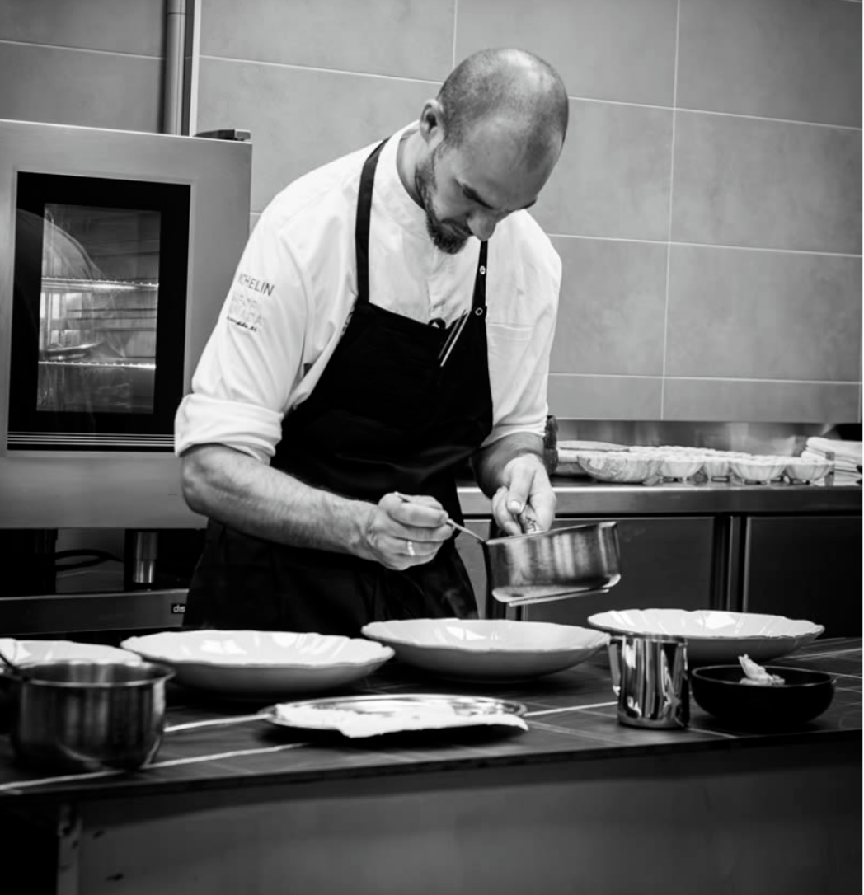

此地垂直地形复杂，蔬菜水果肉类均极佳，

又有格兰纳达临近安达卢西亚所产海鲜。

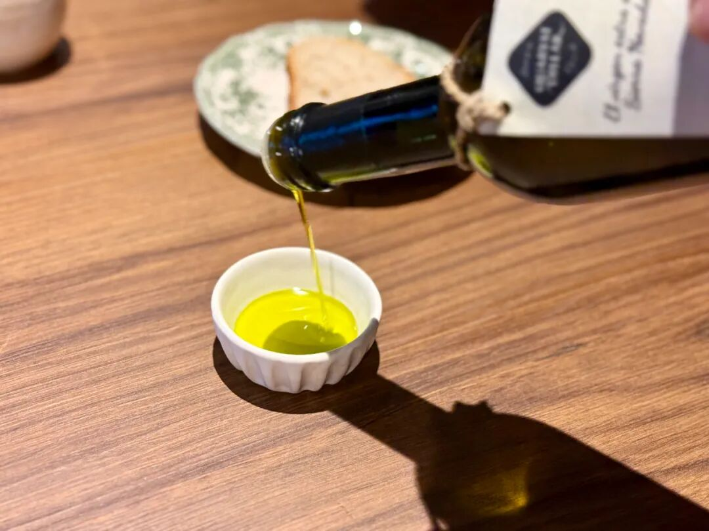

开头给的本地橄榄油，香得不行

大厨在西班牙酒店学校学厨，

毕业后在西班牙各大星级餐厅工作，

最终带着「对伟大大师的学习」

回故乡开了这家店，

并连续六年勇夺米其林餐盘奖。

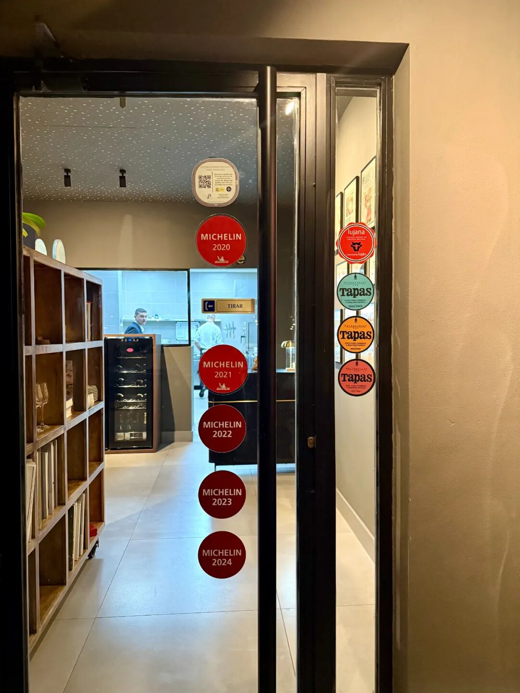

其实就是米其林一星餐厅未满，

而值得为游客推荐的 fine dining 料理。

你看大厨这餐厅规模，

这工作经验，

这本地丰富的食材，

是不是怎么样都不能踩坑？？？？

结果哈哈哈，只能说一句：

你人真好，但好离谱啊！！！！！！

比如有道虾，

满满的海腥味。

我在 UV 的一个套餐里吃到过「海腥味」，

但那的确是大师的调味手笔，

微微一点腥，吊出极美的鲜味。

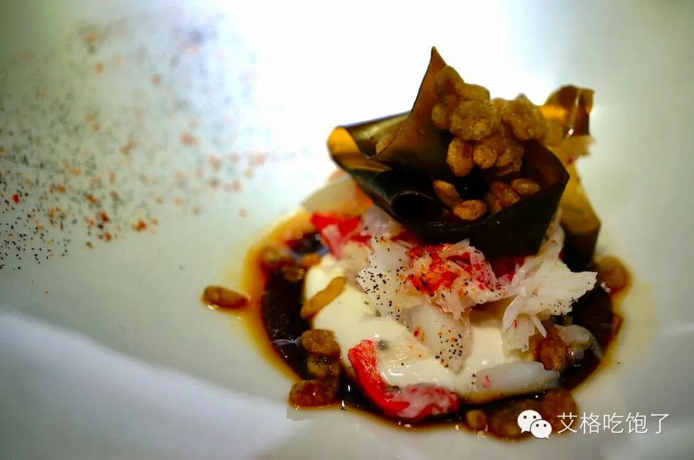

Cala 的这位，

显然是在哪家大师后厨工作后学到过，

但他调出来的味道，

是真的海腥！！！！

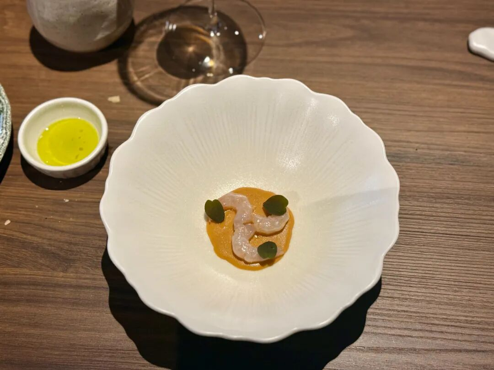

下面的酱汁不错，

但是牛肉高汤！！

咱也不知道生虾配牛肉汁加海腥是什么情况。。。

反正肉和虾糊成一团，不知道他要干嘛。

后面的扇贝，很新鲜。

但是扇贝调味不对，还是腥。

浇的还是牛肉汁（我知道这里牛肉好啊。。。

配上一堆极嫩的，

没焯熟有生腥气的小豌豆，

三者不能算没有关系，只能说毫无关联！！！

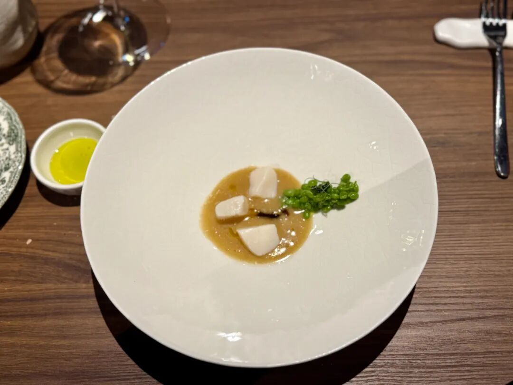

以及希望他到上海福和慧学习一下素菜的处理。。

按照餐厅的自述，

每季的菜单都是主厨写给故乡土地的一封信。

本季的信要么主题是海腥？

因为在这片美美又好吃，

还烟熏过的马鲛鱼旁边，

又出现了巨型海腥味！

中间是好吃的鱼，左边是莫名其妙的南瓜汤，

右边是鱼的高汤，被调成了奇腥的，

大海的泡沫。。。。。

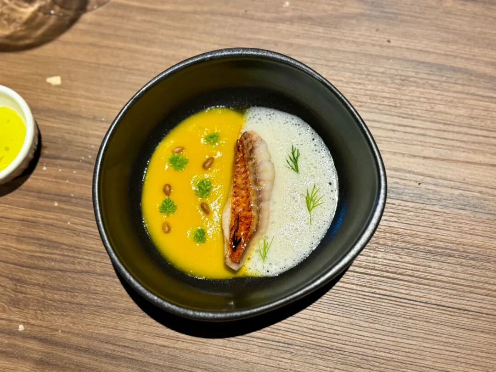

如果要说这位主厨是个做题家，

我可算是吃了几百家米其林餐厅，

第一次碰到了hhh

他非常用功地把菜拆解成了各个部分，

——如同他在名店后厨学到的那样。

比如上来的第一个前菜，

左边的这个小食，就有最下面提供脆感的饼，

可以调味；

当中有海鲜高汤味的 jelly，

可以调味；

上面有分子料理壳加一包海鲜高汤汁，

也可以调味！

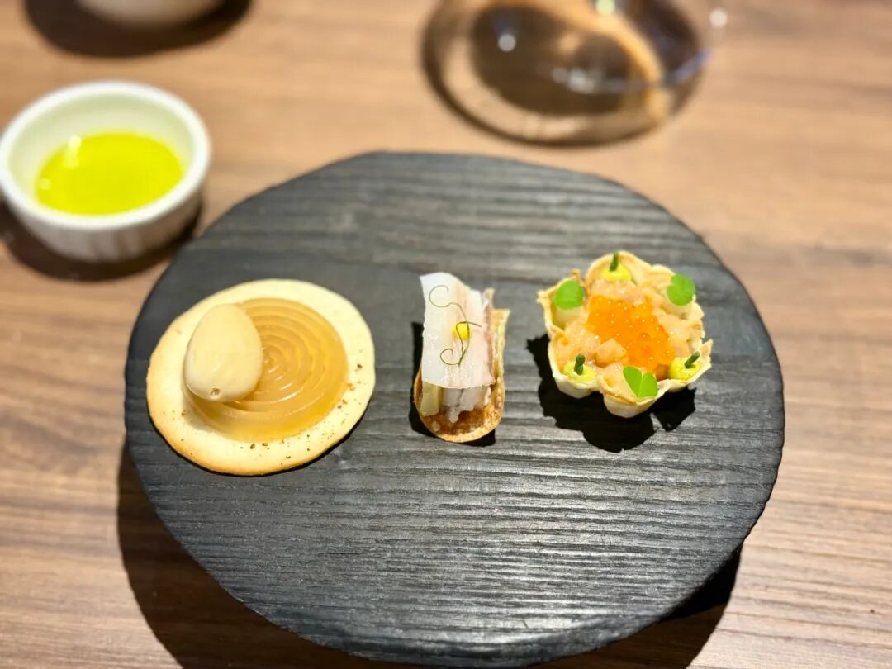

制作工艺你看出来了，非常复杂。

因为每一部分都有它的食材处理和调味，

而最后合在一起吃呢，

就应该是所有的味道和部分一口咬下，

像料理鼠王里说的，

芒果，和熟酱油，加上梅粉，一口咬下

进嘴里，放烟花！

但是 Cala 的这位大厨，

就是有本事把每个部位的味道，

合起来全都冲突（比如虾和牛肉汁

或者糊成一片，毫无印象。

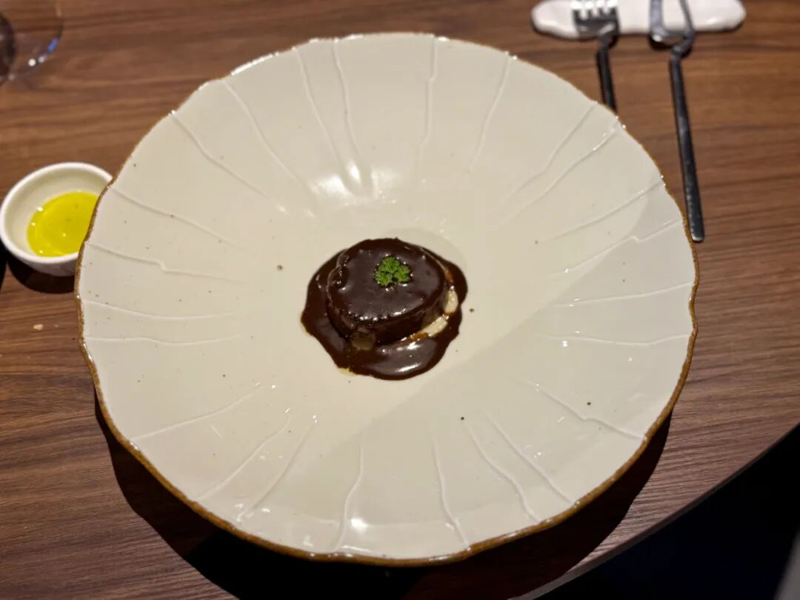

比如这道家乡伊比利亚猪肉饼，

调味很家乡，咸鲜嫩。但外面的黑汁，

是巧克力。。。。。。。。。。。。

虽然不甜，有可可苦，

但加上了这么大块的欧洲黑松露，

还是。。。松露、酱汁和肉

三者毫不相关的黑暗料理hhhh

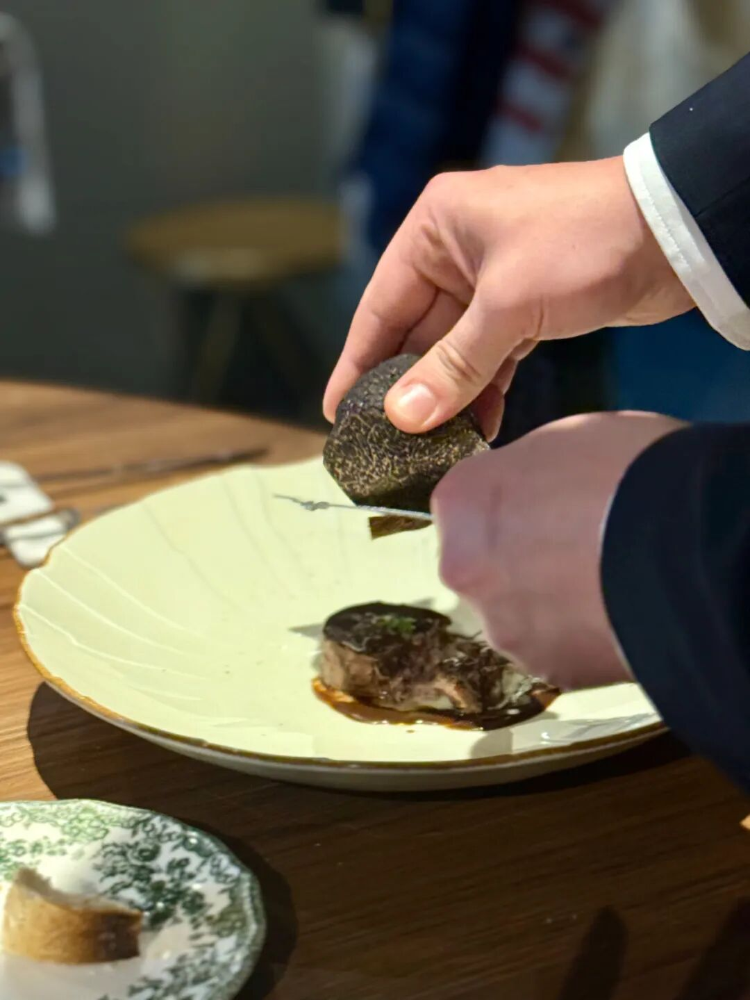

最搞笑的是我们点了一支店酒，

马家婆和维欧尼混酿。

开瓶一股子酱油味儿？？

我以为是坏了，前厅尝了一口，

说这就是我们挑选的味道。

乃末好来，酱油味白葡萄酒

加海腥味、牛肉汁，

吃得人真是欲仙欲死啊。。。

发朋友圈吐槽有朋友说是十三幺，

十三张牌没一张搭的哈哈哈

精准！

整个套餐最好吃的是这碗洋葱汤，

本地新鲜甜甜的洋葱瓣犹如我们的九年百合：

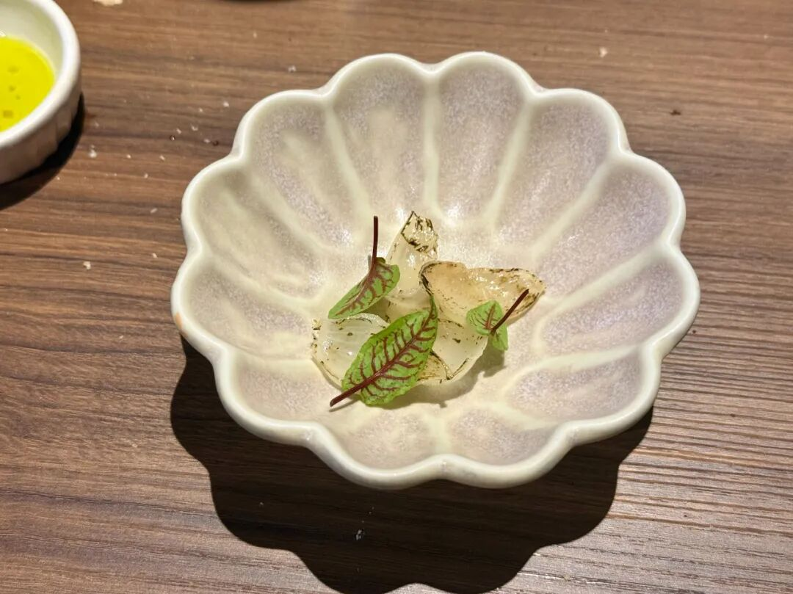

配上壶中洋葱肉汁高汤，

上桌香气就直冲上来，

美味到不行！

香料用得不错，

也就是主厨本人的料理基本功是过关的。

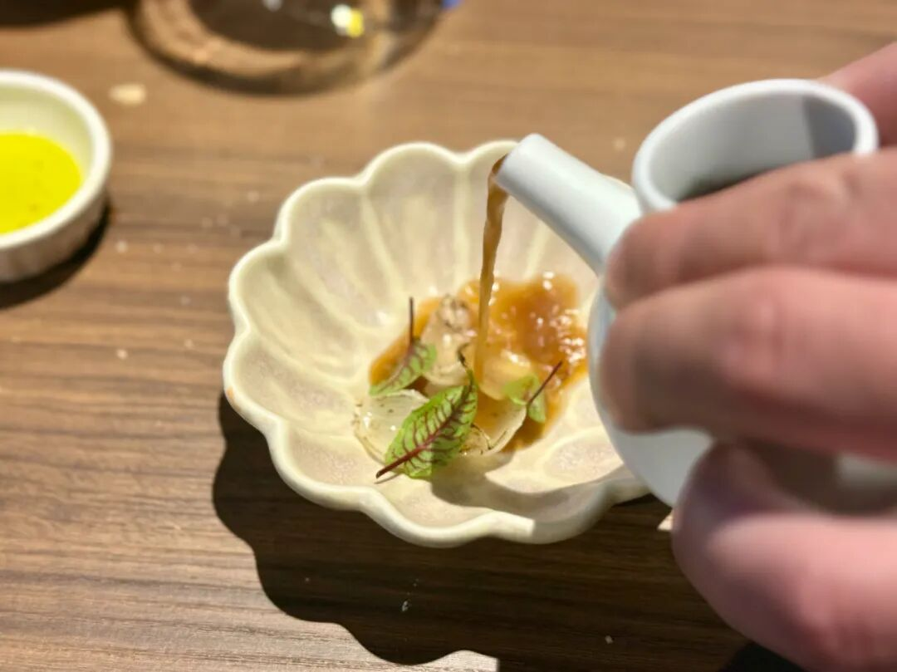

再看米其林推荐时的照片，

看起来料理也没有这套这么复杂，

（我们是活生生被这个生鱼片加酱汁吸引来的hhh

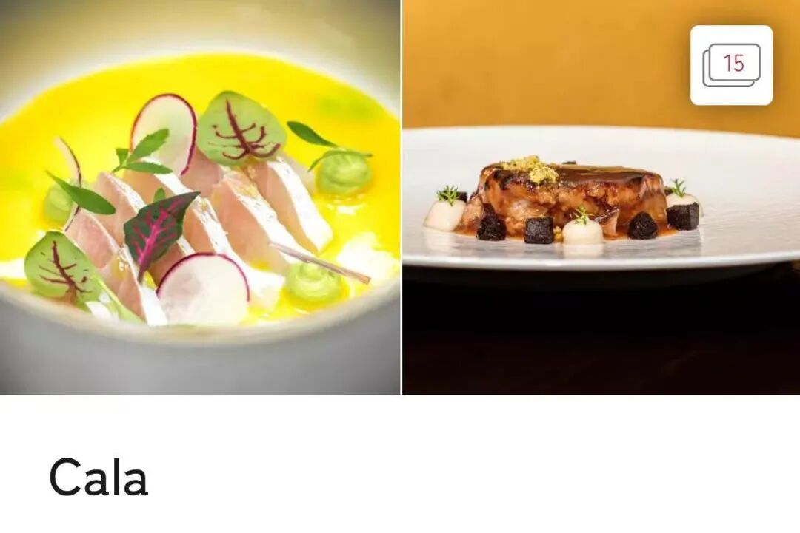

难道是他本人是近是在想往大师发展？

料理复杂，但凑在一起嘴瞎？？？

往大师发展可以的！毕竟大厨人真的很好！

因为他确实一直派前厅经理在关心我们的表情hhh

感觉大厨当晚很郁闷。。。

（而且整个套餐才收 80欧每位！良心价！

可是真别太离谱了55555

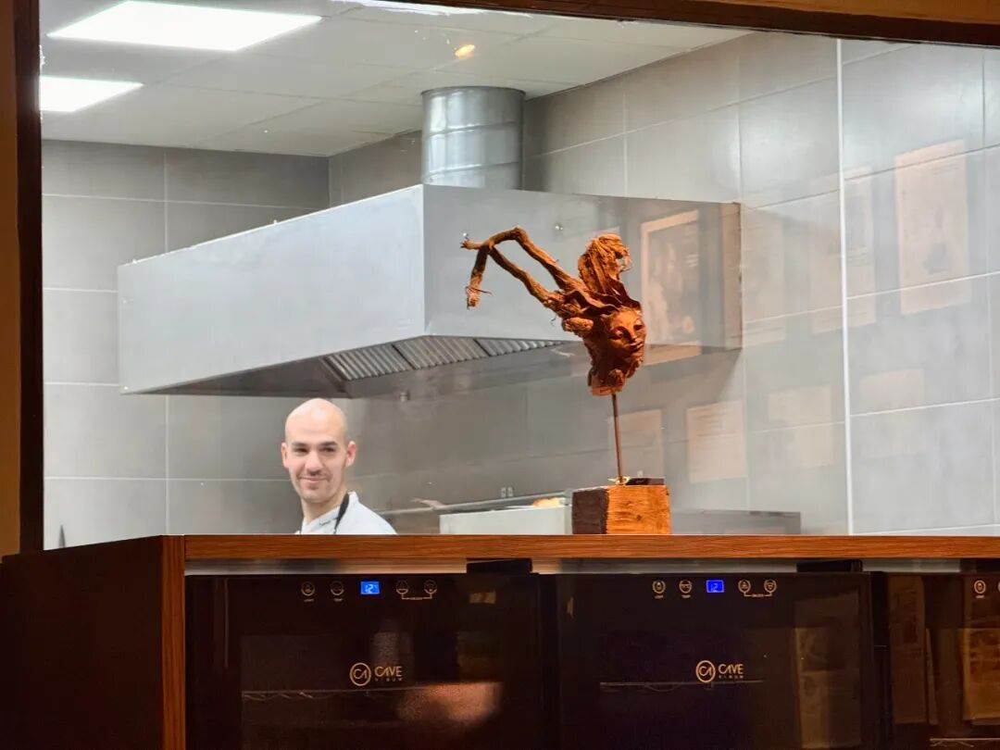

不过，他家的甜点都极佳，

很用了功夫的。

一家餐厅有好的甜点师，

确实是很想冲星的配置。

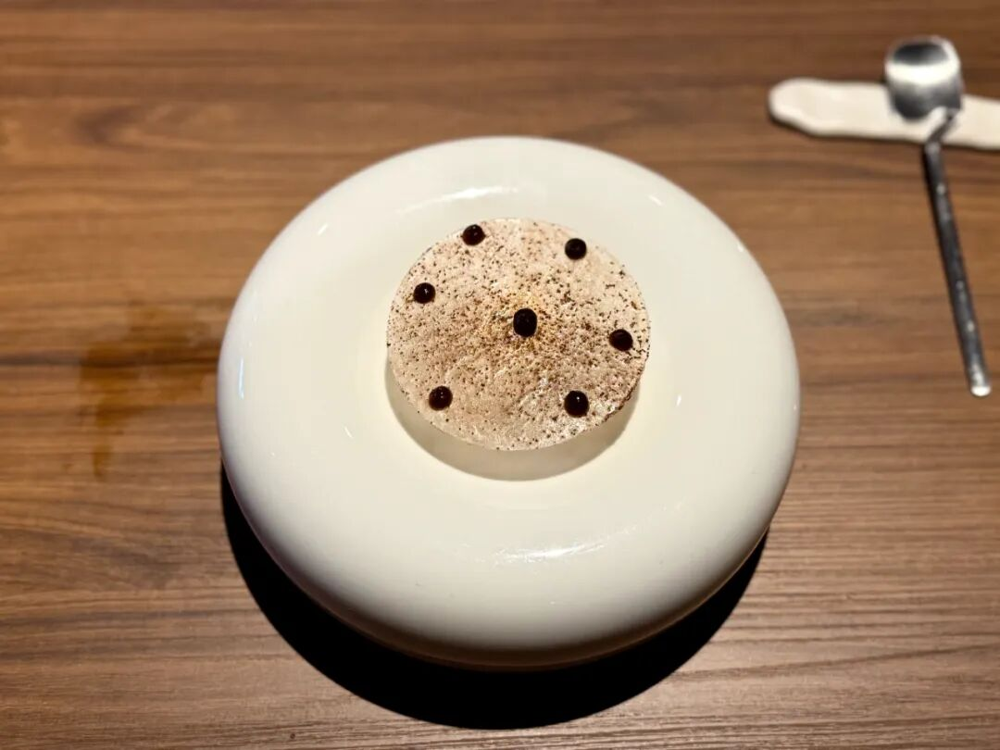

比如这个双色冰沙雪芭，

用了本地的水果，

白巧克力壳子里有安达卢西亚柠檬雪芭。

这个肯定是料理手段整过的白巧克力，

抽掉了甜味，有很好的可可苦与香。

很花工夫，但相当好吃。

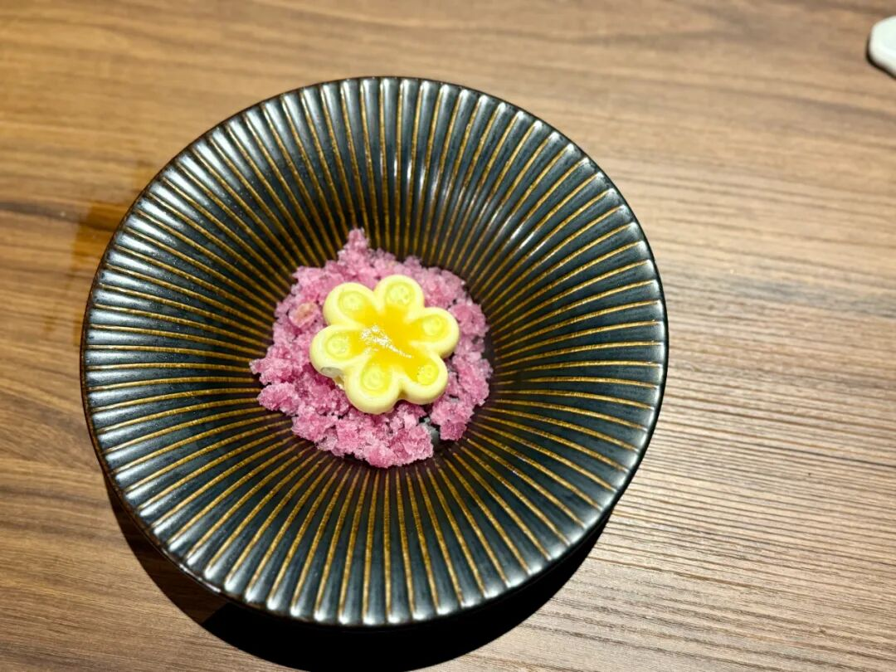

总之希望主厨早日想明白，

从此入门或者放弃成为大师。

毕竟他是我吃了几百家，

第一家味道不好非常离谱的米记餐厅hhh

你看看 Google 地图上他家这些菜的照片，

感觉没有一个像我们吃的料理这么奇葩啊！！！

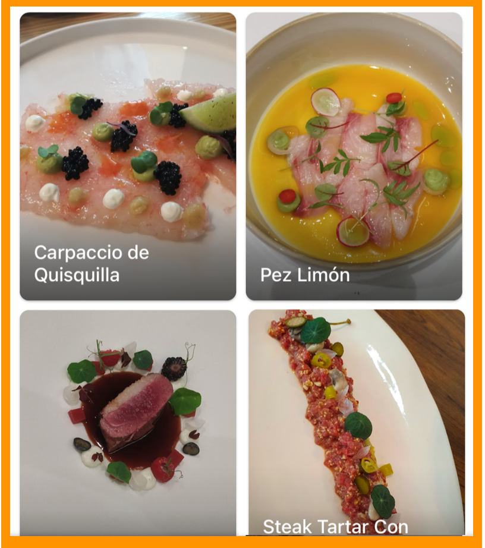

哈哈下次来写这次在格兰纳达吃到的

超级平价

而且应该是世界最好牛排（之一的餐厅吧！

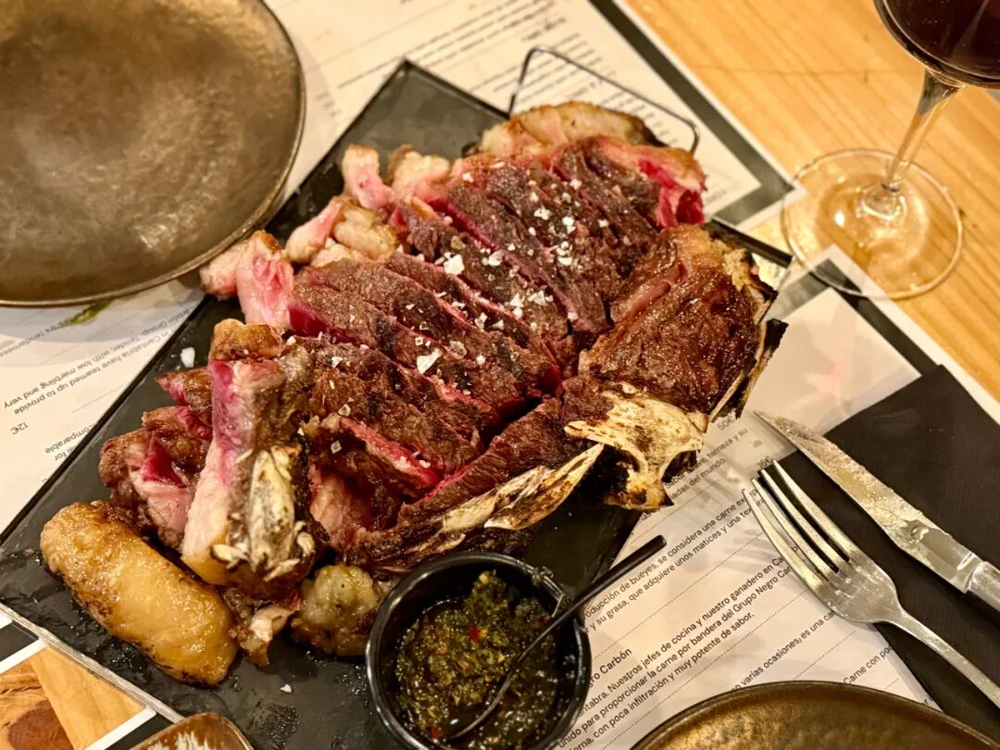

题 外

看完老板的欧洲寻餐记，

轮到我薯角敲锣打鼓啦！

吃到元宵没问题的饱记年货礼盒，

天🐱有赞同折扣！

限时开门红限时 85 折！

即将尾声的富平柿饼，吃完就没！

尾声限时 85 折！

回到童年的铁盒蛋卷，

产品经理卷出来的鸭舌、麻花、猪肉脯，

都给一个限时 7 折！！

适合空调房吃吃的水果看这里👇

清新浓郁的万人迷上海金奖草莓👇

个头基本都在18mm+的云南露天蓝莓，

微甜饱腹、没啥热量的广西双拼芭乐，

现在都有限时 9 折！

此外稀奇货 75% 木姜子黑巧克力，

90 天短保质期的大师凤梨酥，

也都有限时 9 折冲冲！

饱记·年货礼盒

购买方式如下

开门红限时 85 折！！

戳图下单购买👇

饱记·富平柿饼

购买方式如下

尾声限时 85 折！！！

戳图购买👇

饱记·限定铁盒酥酥蛋卷

购买方式如下

限时开门红 7 折！！！

戳图购买👇

饱记·年味零食7 折专区！！
购买方式如下
戳图购买👇

饱记·红颜草莓限时吃水果 9 折！！！新年莓有烦恼！！
戳图购买👇

饱记·云南高原蓝莓限时吃水果 9 折！！！新年莓开眼笑！！！
戳图购买👇

饱记·广西双拼芭乐

限时吃水果 9 折！！

新年健康快乐！！！
戳图购买👇

饱记·新鲜到货凤梨酥

限时 9 折！！！
戳图购买👇

饱记·云南木姜子75%黑巧克力

购买方式如下

限时 9 折！！

戳图下单购买👇

或🍑🍑🍑搜索

「艾格吃饱了」

本文的研究员

闻 佳就是那个研究院嘴里「挑剔的老板」。关于食物，不是比你懂得更多一些，只是比你花了更多的冤枉钱。

用好吃的方式吃一生

祖国各地好风物

文章转载请加微信「baojiclub」

