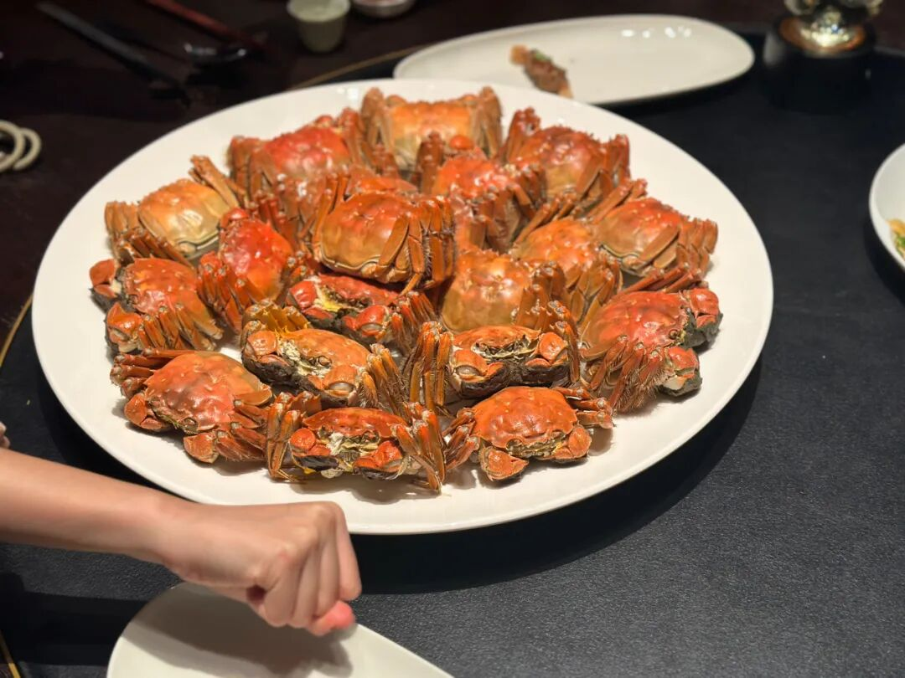
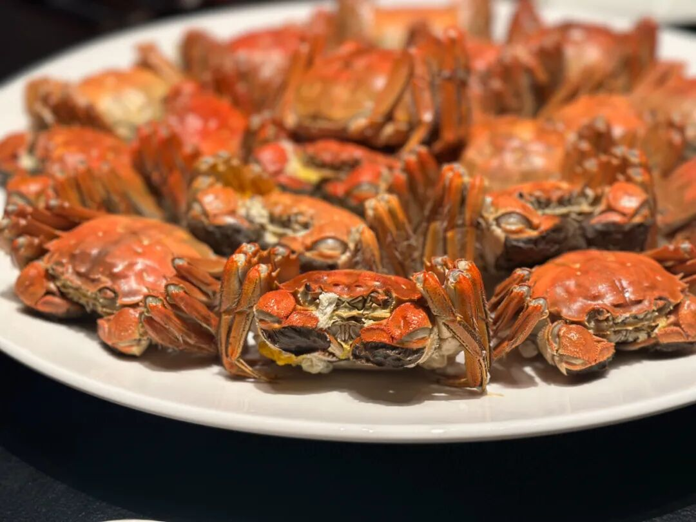
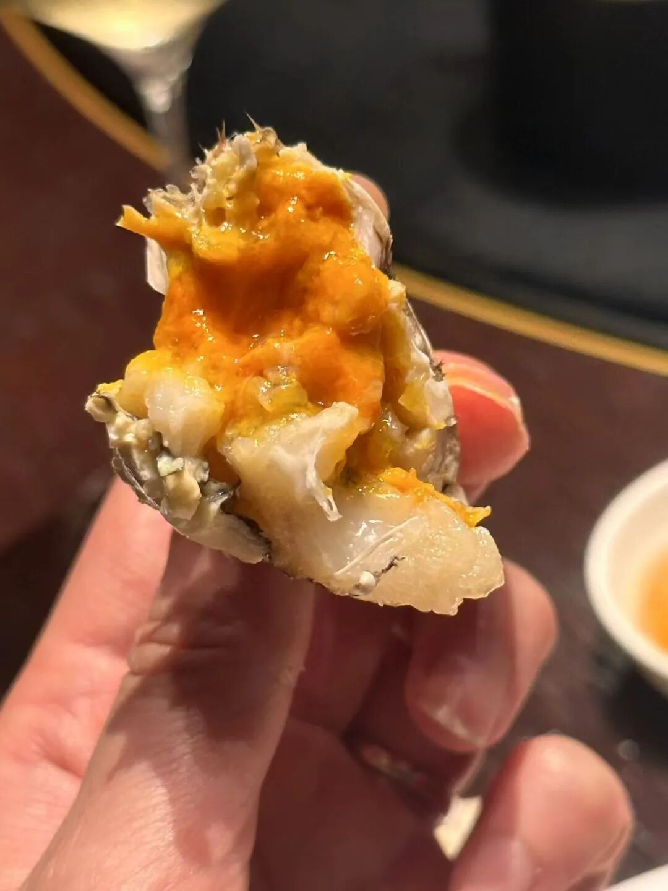
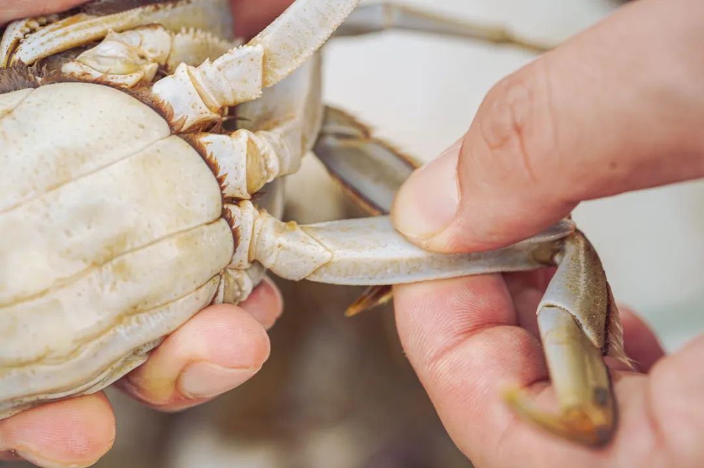
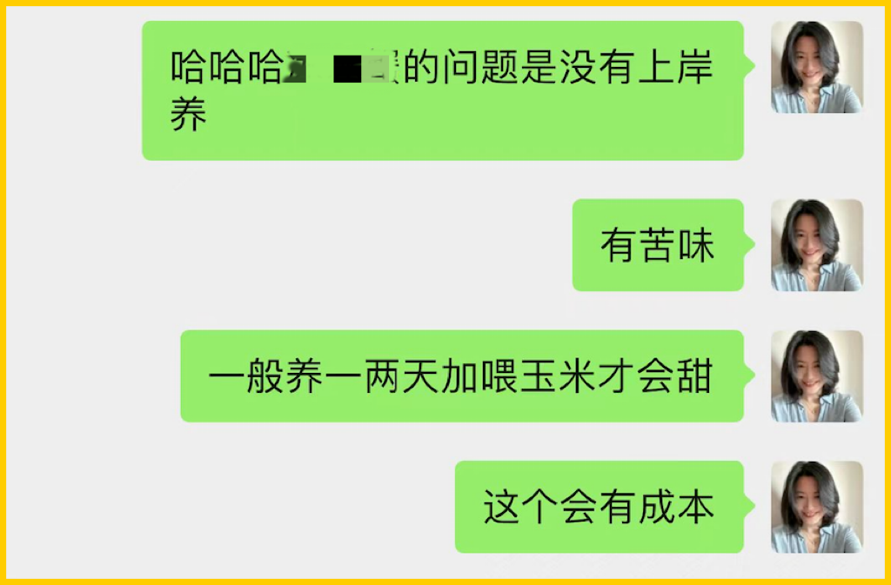
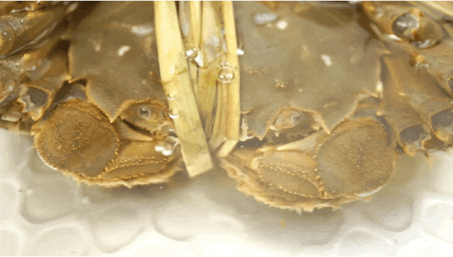

# 你们包邮区啊，真是富贵迷人眼。。。

- 原文链接: https://mp.weixin.qq.com/s?__biz=MjM5NTYxODQyMA==&mid=2653461857&idx=1&sn=3037f60d31e8021707af5ab384b42028&chksm=bcd7e5e0aac3fe1661d7c288d262af0cab23cb06a4cc4e85920438d85b74b52759040094083e&scene=27#wechat_redirect
- 浏览量: N/A
- 点赞数: N/A
- 评论数: N/A
- 转发数: N/A

## 正文

馋是真馋

一个尽情安利自我的公众号

以下是没事干研究院的风物研究报告请放心食用
前阵子我老板请朋友吃蟹，发来以下照片👇

啊啊啊啊啊啊，你们包邮区真是富贵迷人眼，
要不是这蟹大家伙儿也能吃上，那本薯真是要闹了啊啊啊！！！

嘿嘿，这等只只都黄多油丰的美味，岂能让老板独享！发出来薯友们一起买啊！！！（看到这里的都是薯角的朋友💅

我司努力了八年之久，才在包邮区里挑出了两个宝藏大闸蟹产区！
比那种乱七八糟渠道买的死贵玩意儿，
都靠谱多了！

🦀🦀🦀

1.苏南蟹标杆美味：

太湖流域精挑

🦀🦀🦀

苏州吴江盛泽这块，

产正宗的清水大闸蟹，

如今乃苏南蟹的标杆美味！

送礼包体面的！

连上海老牌吃蟹国营大店王宝和也说

自己的蟹是「太湖流域」。

为什么不追赫赫有名的「阳澄湖」呢？

原因很简单，

阳澄湖不给养啊。。。

现在很多自称阳澄湖的，

其实都是岸上塘养的，

虽然有标，但根本就是塘蟹啊。

一个热知识：大闸蟹分两种——湖蟹和塘蟹，

湖蟹是在天然湖泊中围网养殖，

塘蟹是在人工水塘中养殖。

味道根本比不了。

很多米其林黑珍珠餐厅也都因为阳澄湖禁养，

在用各个流域的蟹，

比如金湖，「太湖流域」等。。。

（因为真正的太湖湖底也禁养了

这蟹在我司指定的 3000 亩湖里长大，

活溪入水，清水整湖放养。

湖底与阳澄湖底类型近似👇

所以不容易有土腥气！

蟹肉、蟹黄吃得出明显的清甜滋味。

其实呢，
每个湖里都可以有好吃的螃蟹，关键还是得人工精挑！

我司的信誉，有盛泽当地村里的书记保证！

为了给村民谋福利，

书记不时就去帮咱们亲自视察和监督，

大家现在看到的和最后收到的没啥区别！

「每一只都要挑选，确保万无一失」。

（书记原话👆

当地经验丰富的蟹农挑 2 遍以上，

饱记只要最优秀的前 10%！

壳一定要硬，黄一定要满，

人工一只只掀开看，

确认了膏黄油丰才发货嘿嘿～

而且！

上岸的螃蟹，还会再养几天！

喂一喂玉米、小鱼，

让螃蟹把苦水都出来，

才给大家发哦！

这样收到的螃蟹蒸出来就是甜的！

不苦不腥！

虽然成本又上去了呵呵。。。。。。

卖了这阵子，

除了少量死蟹，

（签收时联系客服按只赔付

没有风味上的差评！！

什么蟹王府、王宝和，老板通通试过，

真的不如我们嘿嘿～

老板朋友让她鉴定某品牌蟹她的回复👇

这阵子正是一年里最肥的时候，

新增 6 只装，

帮大家把价格也打了下来！！

送礼自吃都大大方方、体体面面！

双十一打限时 86 折，已经是全年地板价！快！蟹宴吃起来！

饱记·太湖流域大闸蟹

购买方式如下

双十一同价限时 86 折

三种搭配：

满足装，

3-3.4 两母蟹，4-4.4 两公蟹，

吃过解馋。

劲爽装，

3.5-3.9 两母蟹，4.5-4.9 两公蟹，

可以拍照发朋友圈争奇斗艳。

尊享装，

4-4.4 两母蟹，5-5.4 两公蟹，

顶格水准，适合送礼。

人工精挑，

上岸后静养一两日更鲜美，

每日限量 50 箱。

拼的就是手速。

顺丰快递发货，

新鲜看得见。

戳图下单购买👇或🍑🍑🍑搜索「艾格吃饱了」

🦀🦀🦀

2.宝藏性价比产区：

淮安洪泽湖大闸蟹

🦀🦀🦀

来自淮安洪泽湖的苏北蟹，总的来说就是，好吃！不贵！猛吃不心疼！

比起太湖流域大闸蟹的甜，洪泽湖更明显的是鲜！

吃起来自带微咸，

蟹味是汹涌的鲜浓。

推荐搭配镇江香醋，把鲜味简单钓出来，就很香很香很香很香很香！

为啥呢？因为洪泽湖本身湖大水深、风高浪急，（不查不知道，一查竟在中国五大淡水湖里排第四位！所以这蟹生存不易，

基本上是半野生的状态。

图源@洪泽政府网
和太湖流域那边一样的是，
我司同样要求精挑+吐苦水！

合作伙伴同时供货上海国营大酒店，

是行业内专业人士认可的货源！

但饱记要的发货品质比酒店还要更好（骄傲脸

只要湖里顶尖蟹的前 10%。

每一只上岸后精养几天吐苦水，

顺丰直发，

收到没苦味，鲜甜得嘞～

总之，溢价少，肉质好，性价比高。在苏北蟹里，品质更高，规格更大，口碑更硬。

不过呢，这螃蟹本周微调了一次价！因为最近的天气原因，洪泽湖的死蟹比较多一些，且最近螃蟹长太快了。。。蟹农那边就会有价格压力，等下一波看情况！我们会随时根据生鲜情况下调价格的！

死蟹我们是绝对不会发的，吃了少说也会拉肚子。今年增加了很多包邮区外的客人，也跟大家嘱咐一嘴啊！第一收到怎么判断螃蟹还活着呢？就是戳它的眼睛！哪怕是在冰箱冰过，只要眼睛动了就还活着！

第二螃蟹必须带着绳子去蒸，要不然它会在锅里挣扎，然后断腿的地方就会流出很多精华，
这个就太可惜了！！

同样双十一打限时 86 折，已经是全年地板价！

洪泽湖的蟹味鲜浓，

太湖流域的微微带甜，

两种口味大家各取所需！

Peace&love!

饱记·洪泽湖大闸蟹

购买方式如下

双十一同价限时 86 折

满足装洪泽湖大闸蟹：

3 两母蟹，4 两公蟹。

性价比之选！

劲爽装洪泽湖大闸蟹：

3.5 两母蟹，4.5 两公蟹。

饱记热销款。

尊享装洪泽湖大闸蟹：

4 两母蟹，5 两公蟹；

或 5 两母蟹，6 两公蟹。

实际超重，量极极极少，送礼佳品。

人工精挑，

上岸后静养一两日更鲜美，

每日限量 100 箱。

顺丰快递发货，新鲜看得见。

戳图下单购买👇或🍑🍑🍑搜索「艾格吃饱了」

题 外

双十一那些机制眼花缭乱，

贴心如本薯，

折扣直接来！不用凑单不用研究！

用了正宗现杀海南文昌鸡的椰子鸡套餐，

终于回归的有小时候番茄味的云南西红柿，

坚持真材实料、天然肠衣的手工腊肠，
能做煲仔饭和火锅的玫瑰露酒腊肉&腊排骨还有打遍天下无敌手的山核桃！我司卷中卷产品，
拿到外面去都能打得很！具体你们看商详，最重要是这些地板价折扣过几天就没！

饱记·海南椰子鸡

双十一同价 86 折！！！

限时闪购三天！

预计 11.14 起发货

戳图买它👇

饱记·云南西红柿购买方式如下双十一同价 86 折！！
戳图购买👇

饱记·手工腊肠购买方式如下👇双十一同价 9 折！！
三款口味，各有各的特点。用的黑猪肉、天然肠衣、玫瑰露酒...酒香腊肠，酒香浓郁，
有四六和二八这两个肥瘦比例可选。
滇式腊肠用了不少贵价的辛香料，同事说超适合拿来做西班牙海鲜饭，
试过加辣肠后升华了。
戳图下单购买👇或🍑🍑🍑搜索「艾格吃饱了」

饱记·玫瑰露酒腊肉&腊排骨购买方式如下👇双十一同价 9 折！！
戳图下单购买👇或🍑🍑🍑搜索「艾格吃饱了」

饱记·临安山核桃

双十一同价

单罐限时 9 折！

双罐限时 8.3 折！

戳图买它👇

或到🍑🍑🍑

搜索「艾格吃饱了」

本文的研究员

薯角你好啊海绵宝宝

用好吃的方式吃一生

祖国各地好风物

文章转载请加微信「baojiclub」

