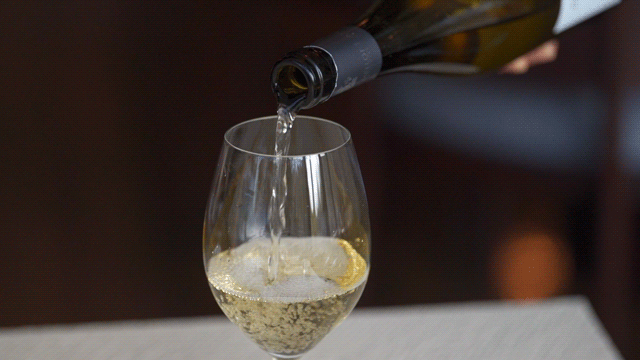
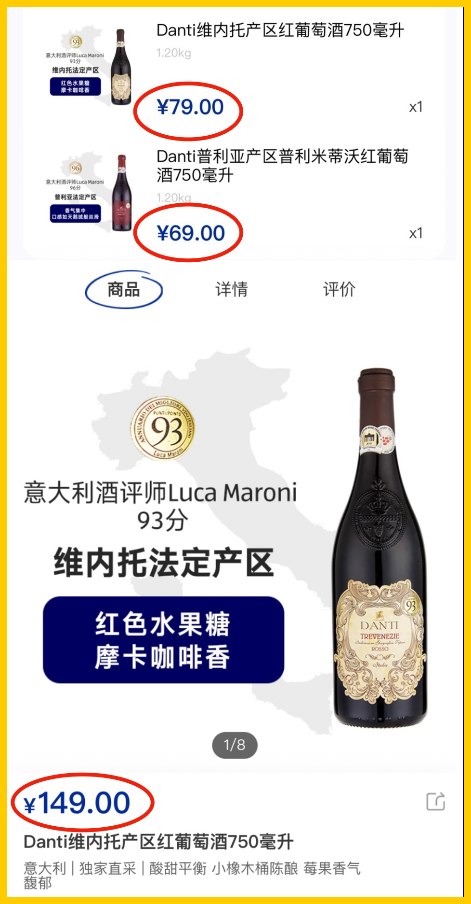
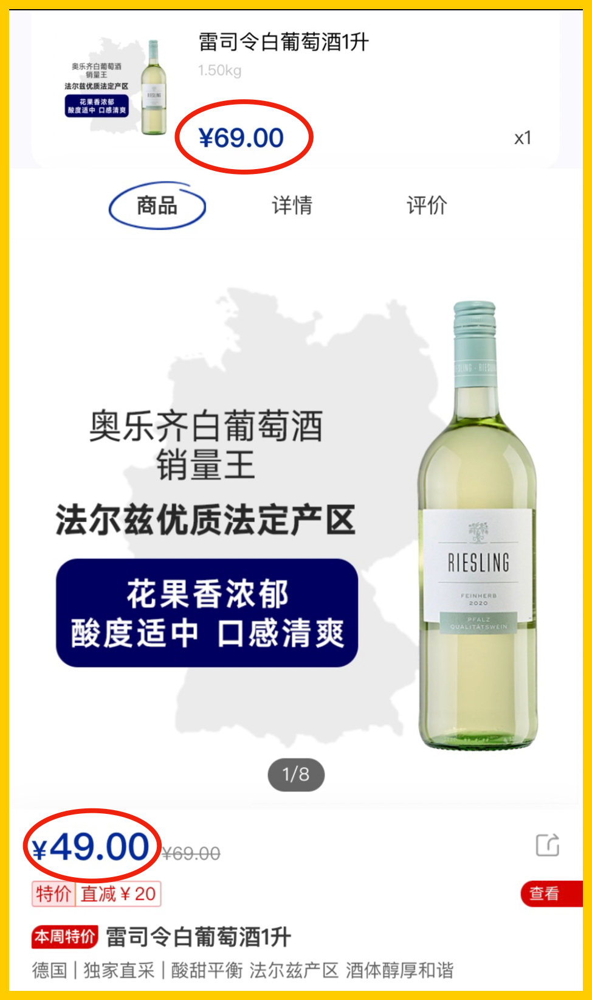
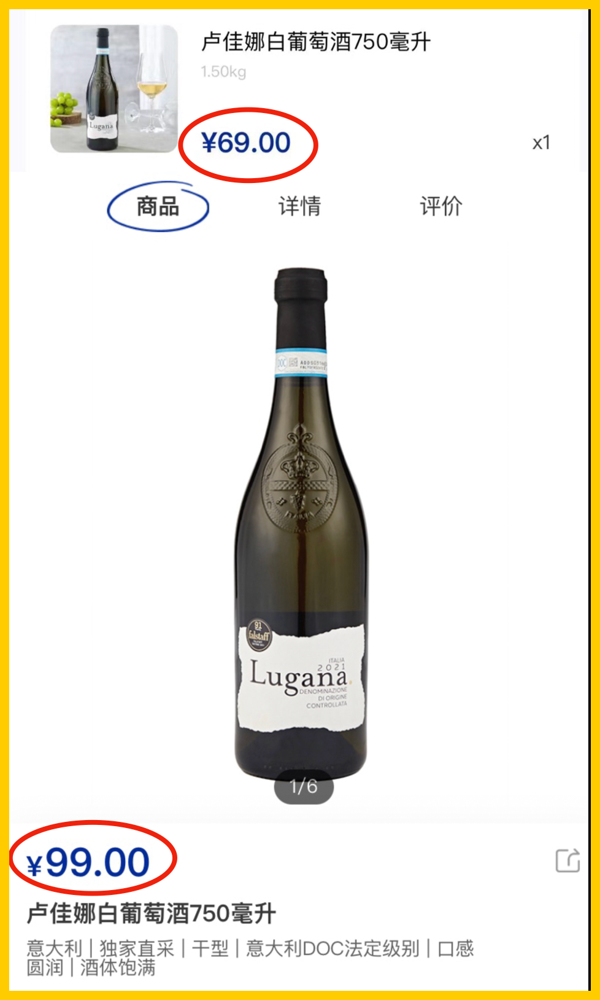
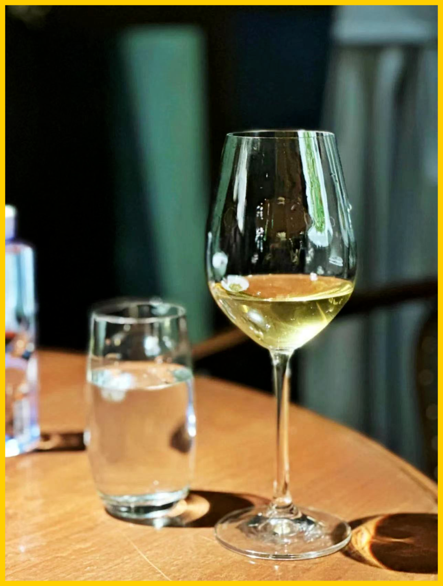
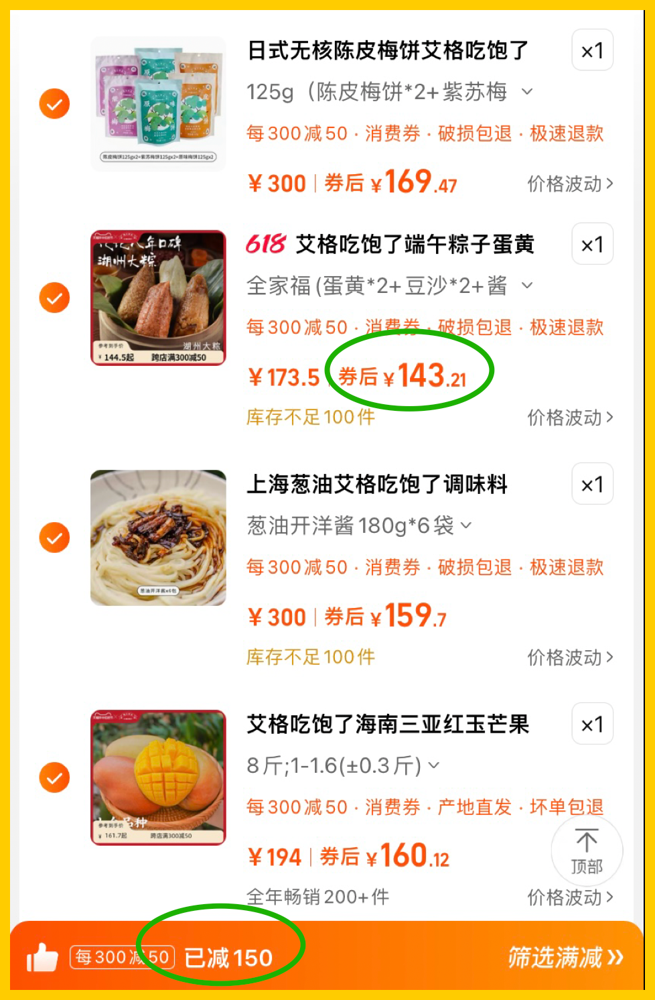

# 你们要的葡萄酒百年老店，闭眼买不踩坑

- 原文链接: https://mp.weixin.qq.com/s?__biz=MjM5NTYxODQyMA==&mid=2653453904&idx=1&sn=e808e03d66226ec20d2d06bf52f0e6be&chksm=bca0f92aed0b6609b0b2b765cf1f9b1ad46ea69702ba532972e0fcfe80d5d9007f6e7cd0f384&scene=27#wechat_redirect
- 浏览量: N/A
- 点赞数: N/A
- 评论数: N/A
- 转发数: N/A

## 正文

每周写点消费笔记

以下是本人的日常消费笔记没有广告软文请放心食用

上周写了下减肥，

没想到随便带的一句说我在买葡萄酒，

引来大量催稿

其实说穿了很简单：

我一直从奥乐齐买酒。

（上次很多人问奥乐齐怎么买，可以先在官方小程序上定位附近门店，线下逛逛或者线上外送都可以～

这家德国廉价超市，卷成百年老店，

在欧洲经常是包下整个葡萄园的出品，

并以低廉的价格出售。

（艾格资料图片，图文无关

他们的每周特价，

是绝对不能错过的羊毛！

而且从来不是便宜没好货，

而是要产区有产区，要风味有风味，

甚至要打分就有打分～

是的，44 块的法国霞多丽，

微微奶油味、花香味和杏子味齐全，

酸度结构好到常温都能喝！

平衡感、余味也都很好。

评酒师高分的意大利维内托和普利亚的两瓶，

很甜，但是因为 13.5-15 的酒精度，平衡得极好，

打开就果香扑鼻，是葡萄干的香气，

它是有评酒师 Luca Maroni 打分的，

（意大利知名评酒师/侍酒师，个人网站一直在更新行业小知识以及自己对各种葡萄酒的打分hhh，感兴趣的话可以去搜看看～

平时 149 块，特价 69 和 79 块，一定要薅！

（Luca Maroni 给普利亚那瓶打了 96 分，维内托那瓶是 93 分

至于在德国奥地利产区，

德国佬奥乐齐根本就是无敌的存在，

这个原价 69 块一升的法尔兹雷司令，

我一直在买。

除了略甜一些、平衡度略逊于以上几款之外，

没有缺点，尤其在它特价 49 块的时候！！！

（我买的时候原价 69 元，今天随手打开已经是特价 49，坐标上海

而且以上这些酒，都很皮实，

一瓶喝不完冰箱里至少还能放一两天，

都还有酒的结构在！

（没有最好，但能喝～

（这款也蛮好，原价 99 元打折时候买 69 元，意大利法定产区级～

所以总结一下：

1、德国和奥地利产区，他家可以闭眼买

2、每周特价酒绝对不会错！

3、不需要什么我这种去考个 WSET 三级，也不需要什么靠谱酒商，奥家这种死德国佬可以秒杀所有人。

4、顺手捎一件的话，他家有 49.9 元 180 克的冰鲜澳洲三文鱼，首先价格很离谱了，而且确实好吃。

PS：澳洲一带水质和养殖条件

是优于北大西洋的，

尤其是防寄生虫方面

当初新西兰前总理来上海卖自家帝王鲑，

我采访她时，她就一直拉踩挪威hhh

（女爵士 Dame Jenny Shipley，曾在 1997-99 年担任新西兰总理，那次采访她说我“我们的鱼种从来没有寄生虫的困扰

然后感慨一下：

某马也是吵闹了这么多年的，

现在看来并没有在采购和供应链上下工夫，

不知道他们在干啥。

我司努力了 8 年，已经有些小东西在了。

所以我们就像德国佬一样卷下去好了～

最后要强调一下：

根据我某大三甲心外大主任朋友

（在我朋友圈评论的）苦口婆心，

饮酒没有安全剂量！

本文绝非鼓励大家饮酒！！

正如我回答评论这位朋友所说，

每个人的命运都来自自己的选择，

请保持健康生活！

相关链接在这里：

吃这些，我瘦了 6 斤（应季，无广

一个私藏超市，好买赛过菜市场！

那些三文鱼腩，肥得令人心花怒放 | 和新西兰前总理聊聊家乡土特产

题 外

好了，老板交稿了！接下来压力给到我薯角！！618 第二波活动已经开始，速速去薅饱记的羊毛！
饱记·口碑大粽 86 折！！购买方式如下
首先是，外面买不到的饱记大肉粽！！！！！！
4种口味共计8枚，3种组合可选，顺丰陆运包邮，发货时会用保温箱，宁波发货（到货后务必及时冷冻保存哦
618 第二波活动，看齐早鸟价！！现货 86 折！！！买衣服零食凑一凑等于不要钱！
戳图或去🍑🍑🍑搜索「艾格吃饱了」

天🐱·零食大折扣全部可凑单！！！
下面来给大家实际演示一下，这样买，粽子白送！

树上自然熟成的红玉芒果是当季限定，

葱油开洋酱和梅饼，

则是我司有口皆碑的老牌畅销品。

开洋酱和同行比不便宜，但你试试就知道。。

包邮区传统手艺，三种不同葱混合熬的葱油香，

不是福建产大路货能比的。。。

夏天了，这时候入手正好！

本文的研究员

闻 佳

就是那个研究院嘴里「挑剔的老板」。

关于食物，不是比你懂得更多一些，只是比你花了更多的冤枉钱。

用好吃的方式吃一生

祖国各地好风物

文章转载请加微信「baojiclub」

