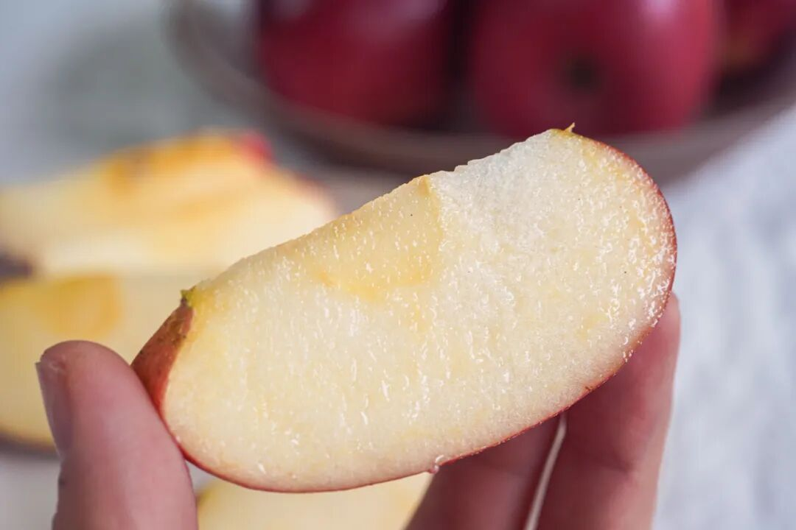
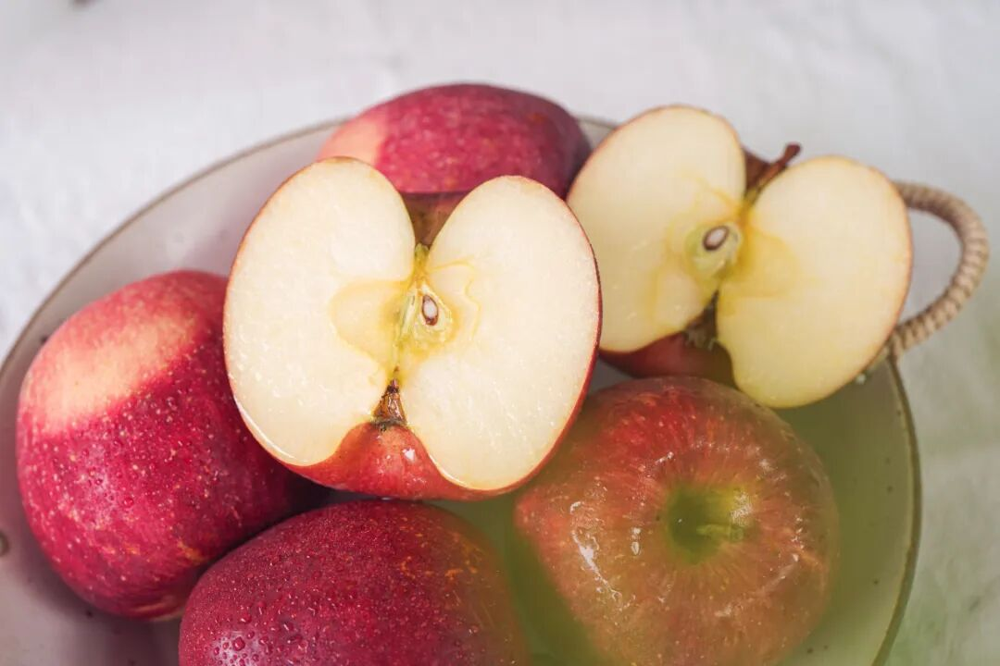
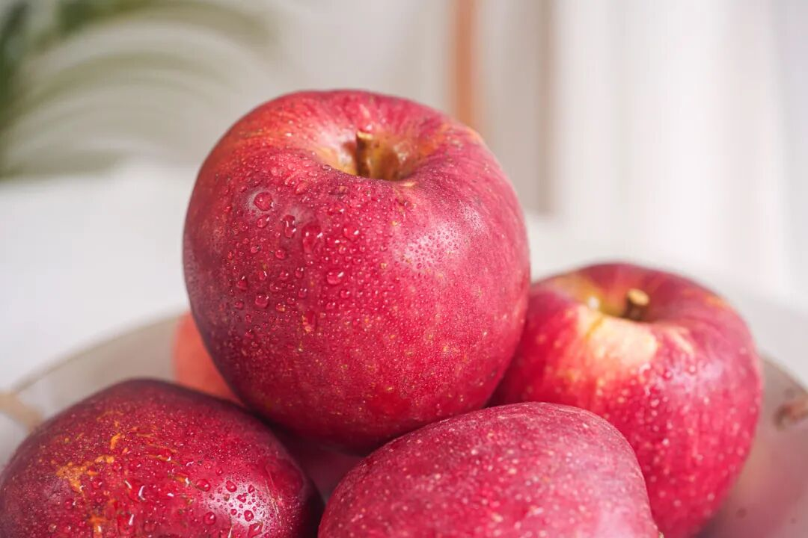
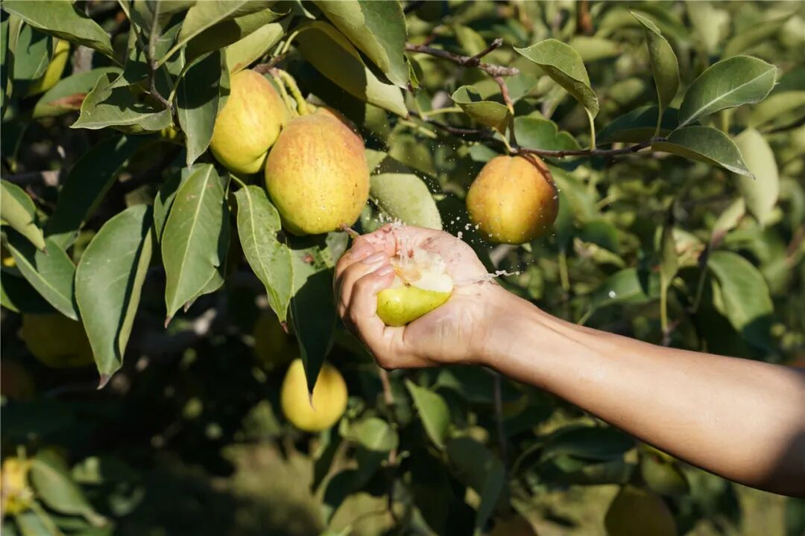
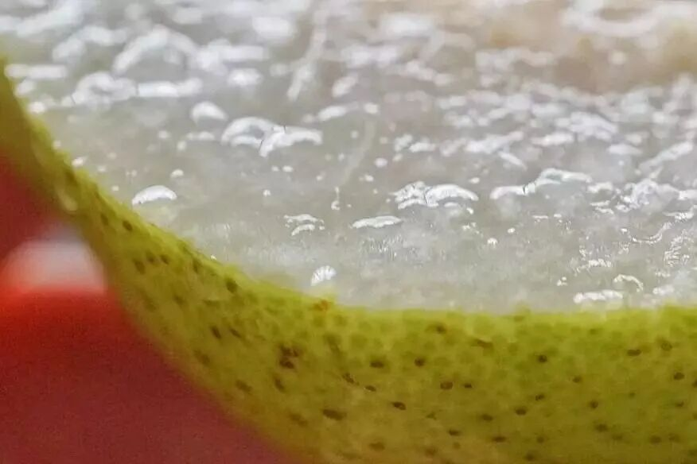

# 你这么好吃，却又这么小众

- 原文链接: https://mp.weixin.qq.com/s?__biz=MjM5NTYxODQyMA==&mid=2653462867&idx=1&sn=ca21c82a5c95a796146138c5d85798c4&chksm=bcf3b558439353d85114d7788a38ab1d65a0d01b374660de8dfd3e9daa77867189fb89ccab45&scene=27#wechat_redirect
- 浏览量: N/A
- 点赞数: N/A
- 评论数: N/A
- 转发数: N/A

## 正文

缘，妙不可言

一个尽情安利自我的公众号

以下是没事干研究院的风物研究报告请放心食用
如题。今天分享欲上来了！薯角我停下摸鱼的手，给大家推荐一款从产品同事那里薅来的宝藏好物啊！小众难找，能吃上全看缘分！

先说这嘎嘣脆的云南·瑞香红苹果。入口像在吃苹果味的蜂蜜！一股迷人的浓香和浓甜👇

来头不小，

是西北农林科技大学团队用 20 年时间

培育出来的优质晚熟苹果品种。

拿“富士”苹果和“粉红佳人”苹果杂交而来。

只挑双方的优点长！

所以每一颗都遍体通红，

一口下去果肉在唇齿间崩开！

这苹果种在云南曲靖，
园区一半精养，一半放养。类似于那种只想你健康但不需要你努力的家长？

比如基地会自己配制农家肥，

给果树提供充足的营养，

每棵树都保持合理的种植间距，

全程机器化操作。

与此同时，

却又不催熟、不打蜡、不套袋，

让苹果在大自然里自在生长。

毕竟没什么狠活，

老人小孩才能放心吃啊！

入口是那种温柔的脆感，

略微带一点粉度。

所以完全不磕牙！

糖度能到 15 左右，

但回味又有清新的果香气，

甜而不腻。

还是饱记标准，发货前要人工精筛数遍，

淘汰掉次果，

只留大果好果～

最近上海彻底入冬，
这苹果薯角我一天炫俩，不怕上火不怕齁甜，润得人心满意足！老规矩，今天给大家薅一个早鸟 86 折！一起甜蜜过冬！

饱记·云南蜂蜜红苹果购买方式如下限时早鸟 86 折！！
戳图购买👇

我司水果，从来就是卷！秉持来都来了的传统精神，再给大家推荐两种入冬好果！吃出甜蜜，吃出滋润！

一是在大漠里，

长出来的库尔勒小香梨。

喝天山雪水长大，
四面环绕的是塔里木盆地、孔雀河，才形成这独有风味。（全国其他几十个产区都没法比肉质细嫩，汁水超充足所以当地人又称它为「落地碎」，

新鲜的嘞，杆子还是青的。
（当然果子是树上熟，完全成熟才采摘哦

清甜、细腻，嫩得连皮也能吃！

干燥的日子里当然要吃梨！润润的嘛～也薅来一个限时 9 折！就这么几天，冲！

饱记·新疆库尔勒香梨
购买方式如下限时三天 9 折！！
戳图买它！！👇

还有这个六两一颗大胖梨，

也就是大名鼎鼎的

秋月梨，饱记做了几年了。

今年改了更卷的果园！

来自山东莱西，

又一个著名梨乡！

讲究自然环境+科学种植，

当地果农种植技术成熟，

全程都有合作社进行技术指导哦～

白白胖胖，

冰糖甜风味，

咬开都是一汪汪的甜汁儿，

随手抽一颗测测，

糖度 12 以上。

主要是脆嫩，

吃起来多汁，几乎无梨渣。

这个品质，

产地新鲜直发，

和水果店超市的随便比吧。。。

同样给大家呈上限时 9 折呀！

你看看多适合上班吃！

赶紧润润那骂老板的嗓子（？

饱记·秋月梨
购买方式如下限时三天 9 折！！
戳图买它！！👇

题 外

大家好，

这个时节好东西不少（单押

今天的心意折扣直接来！

不用凑单不用研究！

外面买不到的金山瓢鸡，

这批卖完下次得等半年了！

苏南蟹标杆美味：太湖流域大闸蟹苏北蟹宝藏性价比之选：洪泽湖大闸蟹现在都有吃蟹 9 折！！
坚持真材实料、天然肠衣的手工腊肠，
能做煲仔饭和火锅的玫瑰露酒腊肉&腊排骨

有小时候番茄味的云南西红柿（快没了，

还有打遍天下无敌手的山核桃！我司卷中卷产品，拿到外面去都能打得很！具体你们看商详，最重要是还有些限时返场折扣再薅老板一回！冲！

饱记·云南稀有品种瓢鸡

购买方式如下

限时早鸟价 7 折！！

规格第一档：6 月龄公鸡净重 3.4 斤以上 70 只，6 月龄母鸡净重 2.5 斤以上 140 只。规格第二档：
6 月龄公鸡净重 3 斤以上 160 只，6 月龄公鸡净重 2 斤以上 140 只。
下单前请注意：此鸡蛋白质含量丰富，宰杀时已尽量放血，但少量余血开包时气味仍会比较大，请冲洗再食用！鸡皮不发粘，就绝非变质～～～

戳图下单购买👇

或🍑🍑🍑搜索「艾格吃饱了」

饱记·云南西红柿购买方式如下限时 86 折！！
戳图购买👇

饱记·太湖流域大闸蟹购买方式如下👇限时 9 折
戳图下单购买👇或🍑🍑🍑搜索「艾格吃饱了」

饱记·洪泽湖大闸蟹购买方式如下👇限时 9 折
戳图下单购买👇或🍑🍑🍑搜索「艾格吃饱了」

饱记·手工腊肠

购买方式如下👇

戳图下单购买👇

或🍑🍑🍑搜索

「艾格吃饱了」

饱记·玫瑰露酒腊肉&腊排骨

购买方式如下👇

戳图下单购买👇

或🍑🍑🍑搜索

「艾格吃饱了」

饱记·临安山核桃

购买方式如下👇

戳图买它👇

或到🍑🍑🍑

搜索「艾格吃饱了」

本文的研究员

薯角冻成冰角了

用好吃的方式吃一生

祖国各地好风物

文章转载请加微信「baojiclub」

