# 公司即将被我卖光：））））

- 原文链接: https://mp.weixin.qq.com/s?__biz=MjM5NTYxODQyMA==&mid=2653455667&idx=1&sn=1b945cc5fff6d396847491f8bc636fa7&chksm=bcefb2ba040ae19ff6c647e15b383f43468e8c10a9946c292ce38c5c57e7f828b56f692c23ab&scene=27#wechat_redirect
- 浏览量: N/A
- 点赞数: N/A
- 评论数: N/A
- 转发数: N/A

## 正文

有我是老板的福气

一个尽情安利自我的公众号

以下是没事干研究院的风物研究报告请放心食用

周五摸鱼冲浪呢，发现远在云南的老板兢兢业业发了篇小红书，（指路👉：一只艾格吃饱了正打算再督促催更一番，结果打开评论区👇

看看！这公司没了我是真不行！不经夸的本薯被一激，今天斗胆给大家来点贵的！贵到想放手，贵得我转身就走

还记得初次见面，它莹白如玉，清甜冰凉，入口宛若琼浆，剥开就是爱的形状～

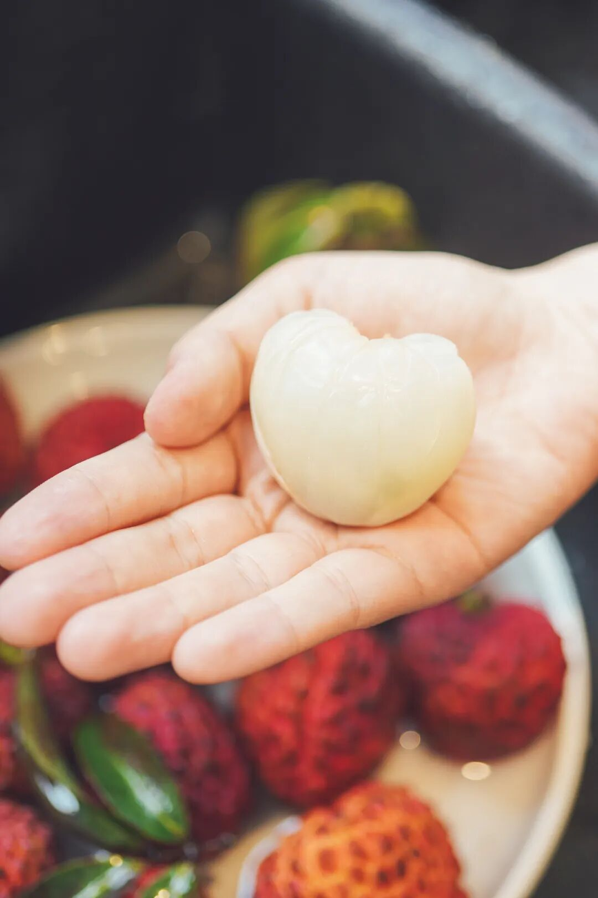

就是这一颗颗红亮的——增城荔枝！夏日里永远的白月光！雅致而清幽～历经久久等待，终于迎来现货～

北回归线刚好穿过的广东增城，有着 1700 多年的种植荔枝历史，纬度高，日照时间更长，成熟时间更晚，
又因有着土层深厚、排灌良好的酸性沙土，所以增城荔枝香气更浓郁，甜度也更高。

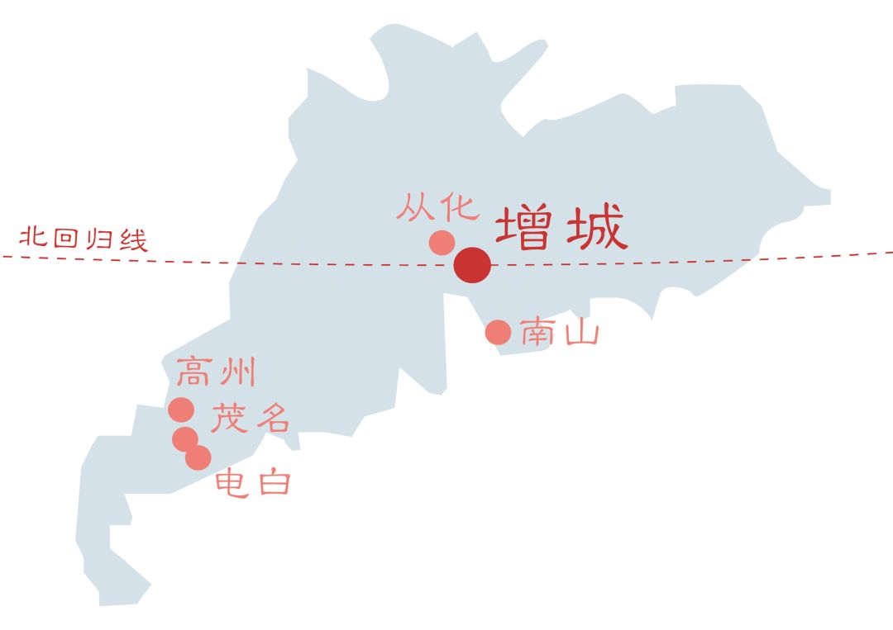

外皮一窝就开，
水嫩嫩的果肉，轻轻一揪就出水了。芜湖～好绝～（都炫我嘴里！

增城荔枝品种繁多，
本薯邂逅的佳丽主要有三～

第一种，桂味，
摸起来比较尖锐，
果壳薄而脆，中间有一道明显的缝隙，吃的时候，从尖顶沿中间的缝隙剥开，就是一颗完整的荔枝。

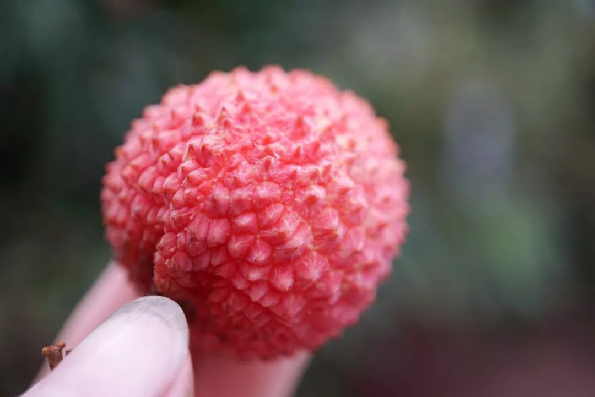

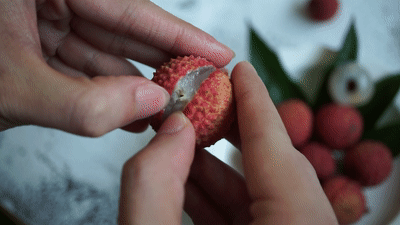

带着悠悠桂花香，入口后盈满唇齿，
清甜的汁液流淌到舌尖。

第 2 种，糯米糍，味如其名，果肉尤其软糯厚实，清新甘甜，风味饱满，
吃上去特别甜！

产自增城 40 年以上树龄老树，整体果型更大，吃起来就是爽！

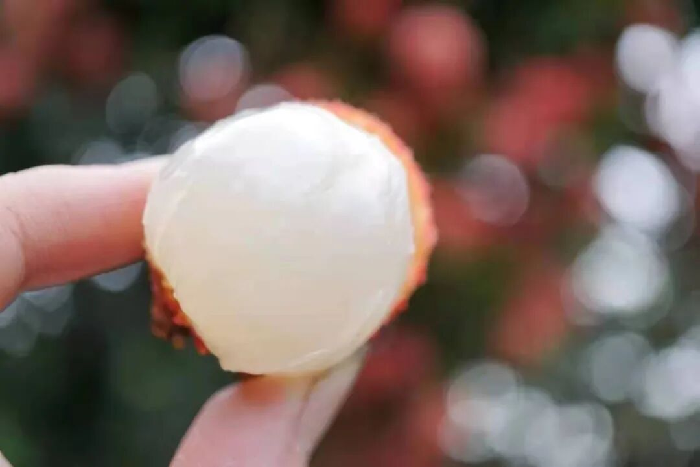

第 3 种小众些，仙进奉，肉眼可见的通透，入口就像玉子豆腐一般，来不及嚼就爆汁了！

荔枝品种中的优等生，清新甘甜，风味饱满。增城本地人超爱，就是更贵些～

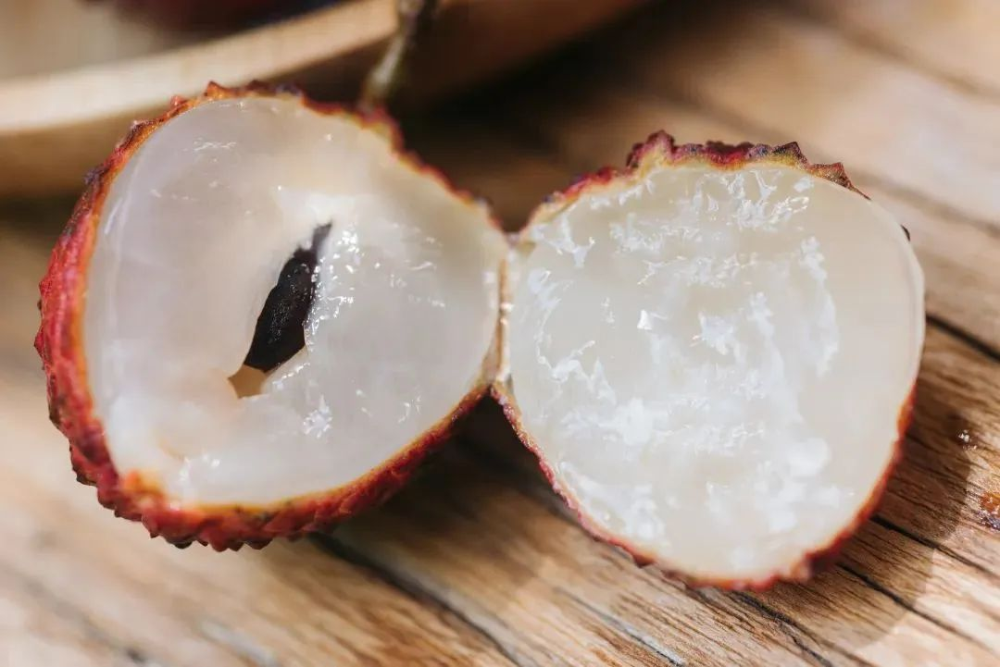

往年与增城荔枝一期一会，总带着初恋般的纯粹心情，谁曾想，今年再相见，它变了，它价格直接翻一倍了。。。（黛玉拭泪.jpg

身价突涨，主要还是受天气影响。四五月份的增城突发冰雹，临近的茂名又刮起了龙卷风，果树受灾，直接大幅减产。

再加上饱记合作的果园都是蜜蜂纯天然授粉，

没有人工干预，

但去年冬天是暖冬，本就不利于成花，

到了成花期又阴雨绵绵，不利于授粉～

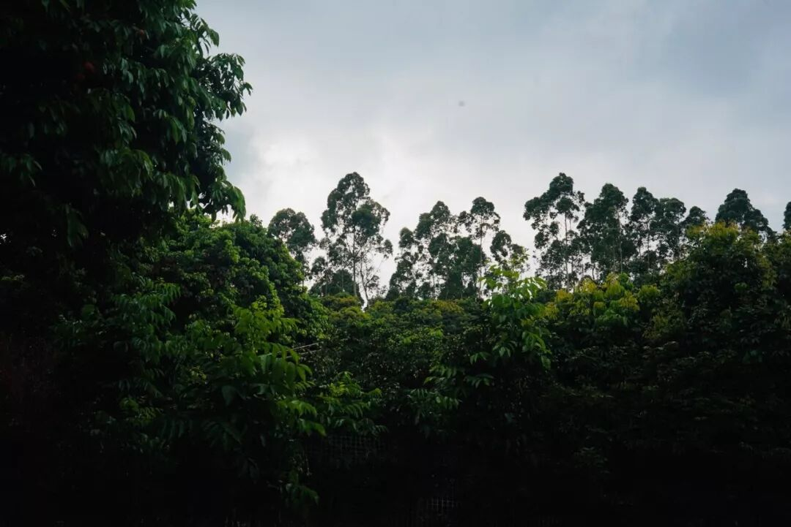

最后果农也说了，此前已经连续四年是中大年了，按照荔枝的生长规律，今年本就是要小年的！

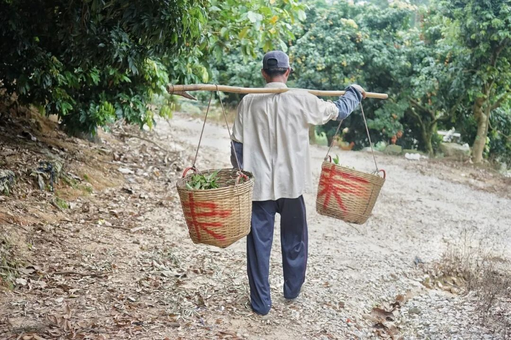

是贵得有点道理，
但我怎么感觉有点爱不起！！
不过没关系，
过去一周它还是收到了很多表白👇

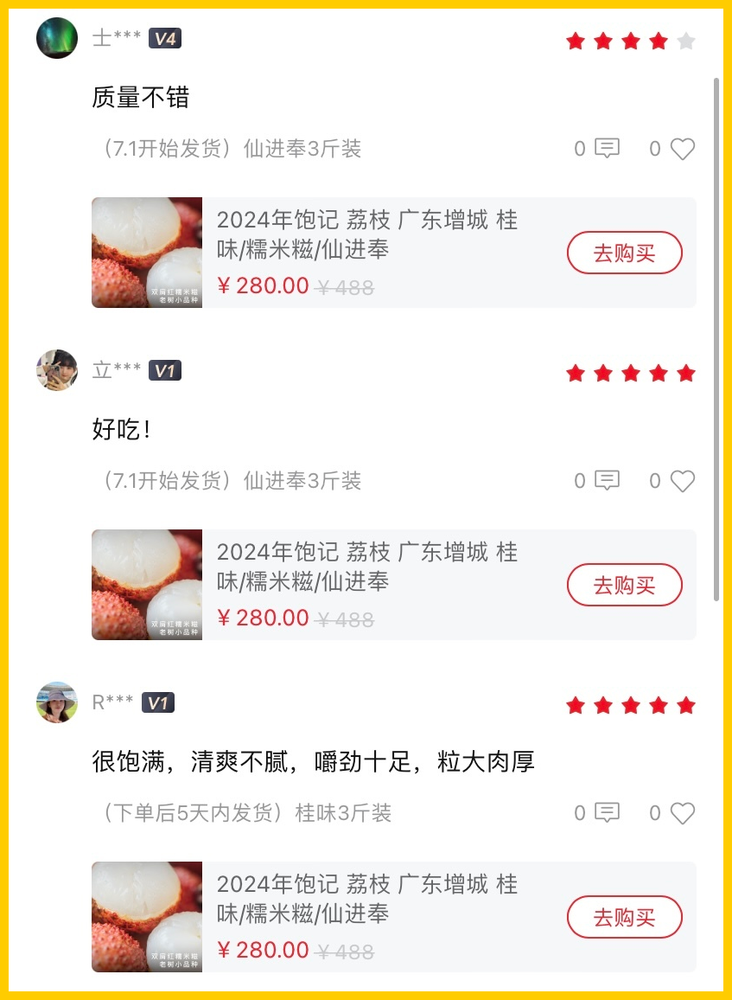

增城荔枝，去吧，再送你这一程，
总有人比我更适合你

（降key版：我给你最后的疼爱是手放开

饱记·增城荔枝三种现货！！！购买方式如下
一骑红尘妃子笑，说的就是增城！自古以来的岭南荔枝名产地～桂味、糯米糍和仙进奉，3 个品种，都是 3 斤装，小家庭吃吃正适合！
桂味、糯米糍、仙进奉，都是下单后 5 天内发，
饱记多年合作果园，只让有经验的老农采摘，只选树上熟！甜度高！滋味更饱满！
凌晨采摘，放冷藏预冷，当天直接从果园冷链车运输到机场，
减少荔枝脱温时间，为的就是新鲜！
戳图即可购买👇

题 外

敲锣打鼓，喜迎（高温）周末，本薯以两个早鸟 86 折给大家降降温！（且都是现货嗷！！）离得近的话这两天呆空调房里就能吃到～水灵灵的阳山白凤蜜桃，晒足了阳光，迎来今年的第一个发货日。还有接班小白杏的新疆阿克苏小红杏，
全国最甜的杏子（之一折扣最后一天！快把老板薅光！
饱记·无锡阳山白凤水蜜桃现货！购买方式如下👇限时早鸟 86 折！！
一年一季，久别重逢。
纯正无锡阳山核心产区，
一个枝头只结一只果。
每日清晨壮年树上现采，7-8 分熟，
挖一勺，像吃浓郁冰淇淋！
两种规格：特级·阳山白凤，单果约 6 两，一盒 8 颗装，适合分享送礼。优级·阳山白凤，单果 5-6 两，一盒 8 颗装，留家自己尝尝。
限时 86 折！！就到今天！

戳图买它！！！👇

饱记·新疆阿克苏小红杏
购买方式如下限时早鸟价！86 折！
小白杏根正苗红的接班人！——新疆小红杏，熟成啦！软糯绵甜！！糖度 26 左右，小白杏通常是 19～
长在阿克苏核心产区的小红杏，喝着天山雪水长大，
连肥料都是羔羊粪便混合谷子发酵成的天然农家肥料。
两个规格，都是三斤。家庭装：果子颗数多，但是小一些，单果在 13g 左右；果王装：杏如其名，单果能到 20g！
限时 86 折！！就到今天！

戳图买它👇

饱记·0卡吸吸果冻临期购买方式如下👇亏本 5 折出！！
冰凉凉的 0 卡吸吸果冻，桃子、青提两种口味，
清甜不腻，真实还原果味～
目前库存效期还有将近一个月，临期折扣，索性打了一个骨折。。。吃完这一批就没啦～
适合想吃甜又想减肥的朋友，
直接吃或者搭配冷泡茶，一小包就能拥有快乐！便宜得像不要钱一样！
戳图或去🍑🍑🍑搜索「艾格吃饱了」下单购买👇

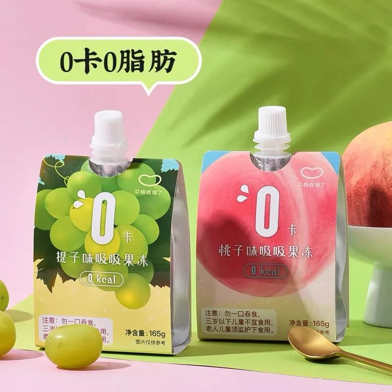

本文的研究员

薯角

穷穷der很安心

用好吃的方式吃一生

祖国各地好风物

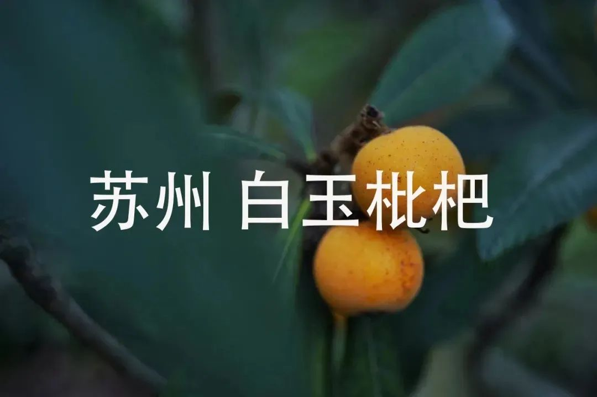

文章转载请加微信「baojiclub」

