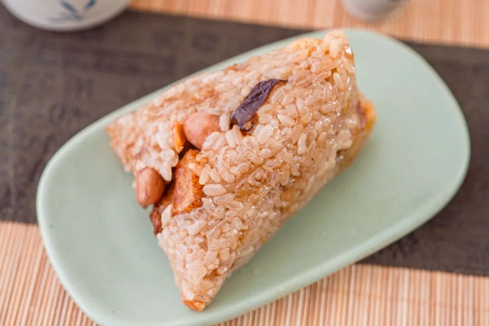
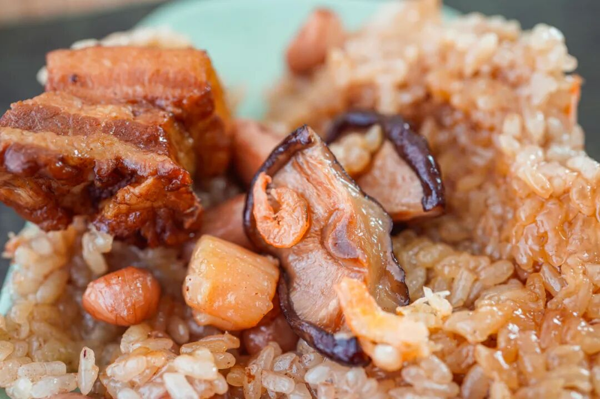
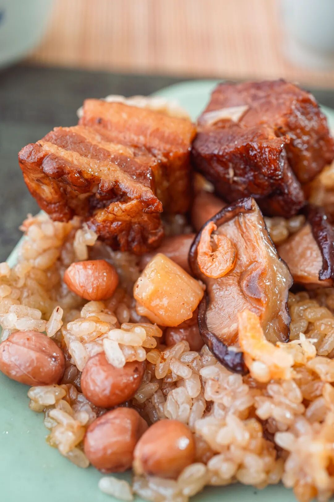
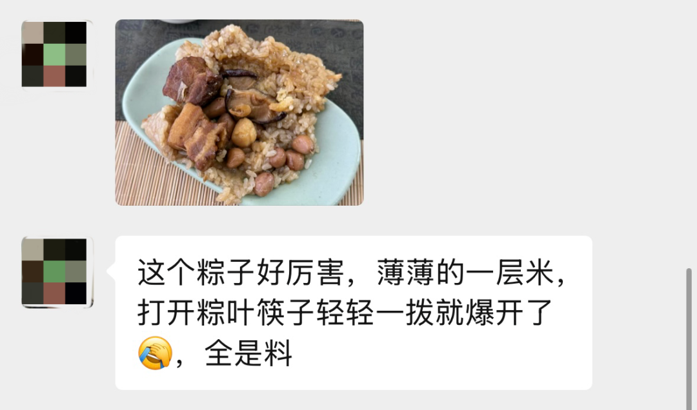
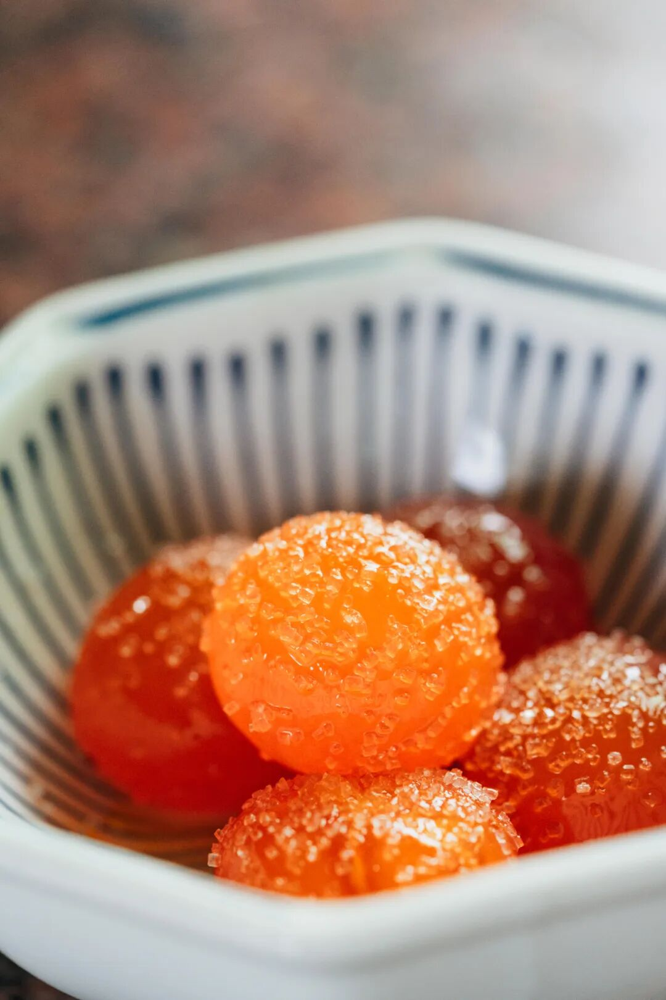

# 公司要裁员了。。。。。。

- 原文链接: https://mp.weixin.qq.com/s?__biz=MjM5NTYxODQyMA==&mid=2653471039&idx=1&sn=168dea11c75b5b8bd22706f014245e58&chksm=bc3dc496cb732978f317a23d230130e21ae9de47f08b890afb40785a918c62f3ac13585e81a7&scene=27#wechat_redirect
- 浏览量: N/A
- 点赞数: N/A
- 评论数: N/A
- 转发数: N/A

## 正文

昏古七

一个尽情安利自我的公众号

以下是没事干研究院的风物研究报告请放心食用
啊啊啊啊啊啊！大周五的，本薯早早等着下班，一看我司闽南粽怎么还赫然在架啊？？？

去年本薯跑了趟泉州，
回来大力提议做香喷喷葱香闽南肉粽！结果大家居然毫不欣赏吗？？我看你们就是想让我被裁员

（你看它料这么多馅这么足！

端午快到了，现在还趁着天🐱 618活动持平早鸟价 88 折！大家都带两件回去啊！平时爱吃闽菜的，或者喜欢葱香和花生的朋友，你们应该都会超爱啊啊啊啊！

这款今年新做的闽南葱香烧肉粽。先是找泉州妈妈要了正宗闽味配方。里头的红葱油和红葱酥，都是泉州厂子里新鲜现炸的，就是油和红葱下去炸到金黄酥脆，没有什么科技狠活。

炸好的红葱油、红葱酥，

拿去炒糯米，

（怕大家吃不惯还是用的包邮区糯米哦～

把葱香和酱油香直接炒到米里。

闽南都是这样的熟米粽，

和包邮区不一样，更像在捏饭团。

这款主打一个料超多，

包了猪五花肉、干贝、

虾米、卤香菇、卤花生粒！

（快给我数不过来了

筷子轻微一挑，料就大块抖落出来～

请看摄影师之前

边拍边吃边赞叹👇

真吃不惯闽南粽也没事！看看我司经典湖州大粽啊！有甜有咸，和和美美

做了九年、卖了 90w+ 只，

攒下来的好口碑，

收获很多年年买的老客户～

首先是包邮区的王：

高邮咸蛋黄黑猪肉粽！

用高邮鲜挖的咸蛋黄，再称 40 克黑猪后腿瘦肉，10 克腰间肥膘，咸蛋流油起沙，油香混着肉香，市面上完全买不到！！

我饱记从 2016 年开始鲜挖蛋黄，直到 9 年后的现在，每年都坚持只用高邮本地品种麻鸭的鲜咸鸭蛋黄一年坚持鲜挖几十万只的，整个包邮区，也没听说有第二家！

这些蛋黄，还是从鸭子开始管起的！选高邮本地品种麻鸭，产的新鲜的鸭蛋，再用白酒和砂糖略为腌制：

不仅如此，饱记还要求咸蛋黄腌久腌透，普通咸鸭蛋腌 28 天左右即可，我饱记要求腌渍 45 天，一定要腌到蛋黄流油起沙：

因为腌得时间特别长，这批咸蛋直接吃非常咸，不能卖，只能给饱记包粽使用，咸蛋流油起沙，咸味渗入米里。。。

紧接着就是本薯今年的最爱：

新会三年陈皮豆沙粽！

今年四个口味里的唯一甜粽，甜而不腻。

因为取了正宗的广东新会三年陈皮，

每年端午前现磨包进粽子里。

看不见陈皮，但每一口都能感受到它的存在！

蒸过之后，香气清雅得想吟诗：啊～江南～

这也是老板 2017 年自己搞了两三个月开发出来的！在包邮区，饱记是原创！（好多人不信气晕本薯现在包邮区到处有的陈皮豆沙粽，确实都是跟风饱记的！往往用很廉价的陈皮粉，猪油味完全盖不住。

别的不多说！

老客人的留言写得比我好👇

还有传统酱香黑猪肉粽，

用了三种酱油去浸米，其中一种是包邮区百年老字号日晒夜露的。
和蛋黄肉粽的米配方完全不同！老板说想要小时候土酱油的烟火气～（我只看得见一大块肉🙏

最后走一下小众复古路线：古法南乳黑猪肉粽，是想致敬包邮区南乳大肉的味道～南乳，就是红腐乳。翻遍包邮区、华北和广东的南乳酱，最后：广东古法南乳酱赛高！米和肉都能吃到咸香带微甜的腐乳味儿：（你看这个红！它是不是寓意着鸿运当头！！（我疯了

最后说下包装，每个口味两只一装，粽子煮熟后，再以 -40℃ 急冻锁鲜技术保存，粽子复煮后完全保留好食材的原汁原味。

普通 -18 度不能冻哦米会被冰晶撑破，要专门急冻设备做
因为天🐱618，现在持平早鸟价！

限时吃粽 88 折！

超划算的！之前催我的朋友们，

立刻给我下单啊啊啊！！

饱记·口碑湖州大粽预售中

现货中！！！

限时吃粽 88 折！！！！

戳图买它👇

题 外

朋友们！！！

天🐱618开始了！

我司🍑平台全场 85 折！大家速冲！

但如果你懒得去🍑下单，

以下为我司小🍊序直通车！

果期极短的苏州东山白玉枇杷，饱记已是第七年！市面上的品质你随便比！限时早鸟 86 折！突然熟了的云南西红柿，小时候阳光里长大的浓郁番茄味儿，
限时早鸟 86 折！！

还有些只有最近这一阵可吃的水果👇

拿过上海金奖的金山小皇冠西瓜，

爆汁清甜还有瓜鲜味！

也拿过上海金奖的金山小番茄，

难得回归的泰国超甜多汁金柚，

瓜肉软糯的翡翠冰淇淋甜瓜，

无渣不麻嘴的海南金钻凤梨，

连盐水都不用泡。

卷中卷红玉芒果，

娇艳可人的雷州木瓜，

现在也有限时 86 折！

饱记·苏州东山白玉枇杷

购买方式如下

限时早鸟 86 折！！

戳图购买👇

饱记·梅家坞龙井&蒙顶甘露限时单件 86 折！！！两件 8 折！！

戳图购买👇

饱记·金山小皇冠西瓜

购买方式如下

限时早鸟 86 折！！！！

戳图买它👇

饱记·云南西红柿

购买方式如下

限时早鸟 86 折！！

戳图购买👇

饱记·多汁泰国金柚

购买方式如下

限时吃水果 86 折！！

戳图购买👇

饱记·金山五彩小番茄购买方式如下限时 86 折！！
戳图购买👇

饱记·翡翠冰淇淋甜瓜购买方式如下限时吃水果 86 折！！
戳图购买👇

饱记·花香脆甜蓝莓购买方式如下限时吃水果 86 折！！
戳图购买👇

饱记·海南金钻凤梨

购买方式如下

限时吃水果 86 折！！

戳图购买👇

饱记·海南红玉芒果购买方式如下限时吃水果 86 折！！！
戳图购买👇

饱记·湛江雷州木瓜

购买方式如下

限时吃水果 86 折！！

戳图购买👇

本文的研究员

薯角我想我知道夏天的味道

用好吃的方式吃一生

祖国各地好风物

文章转载请加微信「baojiclub」

