# 六个大便宜，真刺激啊

- 原文链接: https://mp.weixin.qq.com/s?__biz=MjM5NTYxODQyMA==&mid=2653467331&idx=1&sn=2193816720dcb3a2014ada9bce8c4925&chksm=bc149ce3b24d00d7ea4e5f495993622249644f48b21a6981cc4e071c106f58571f6400e9fb51&scene=27#wechat_redirect
- 浏览量: N/A
- 点赞数: N/A
- 评论数: N/A
- 转发数: N/A

## 正文

薅啊，还等啥

一个尽情安利自我的公众号

以下是没事干研究院的风物研究报告请放心食用
服了。又大促。今晚 8 点天🐱满 200-30，薯角我算了 6 个购物车出来，有些东西约等于不要钱，
不薅白不薅，走你！

PS：这里说的不要钱，只是相对于原价来说，指的是天猫大促凑单满减折扣，真正拍下还是会显示支付金额的～
1. 「青团不要钱」购物车
一年一度，后台千呼万唤的江南时令风物，饱记亲妈牌青团，不用本薯多说了吧。。。

皮这么薄，馅这么大，一整颗蛋黄吃到上头，还有新鲜马兰头！（单押每年还只能吃几十天！试问这谁能顶得住啊？？？

一共三个口味！整颗咸蛋黄肉松，名副其实，肚子里有一整颗咸蛋黄！搭配猪肉松 + 白芝麻，软糯咸香！

再来一枚豆沙松子，豆沙需提前炒制好，细腻爽滑，松子香喷喷，一口流心，

最绝的是春季限定马兰头香干，（本薯强推！！！
就是江南春天那一盘经典的时鲜菜，比肉都好吃！马兰头不用多说，春天新鲜采摘，再同卤香干一起，切碎凉拌。

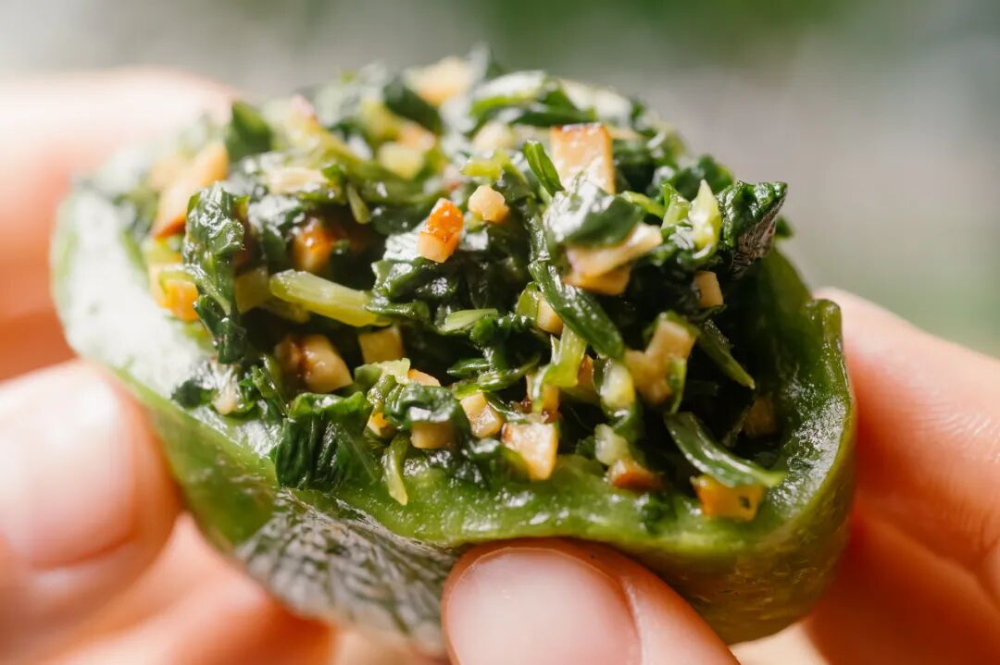

早春这会儿，这青团搭配种在蒙自海拔 1600 米的高原上的花长虹枇杷！

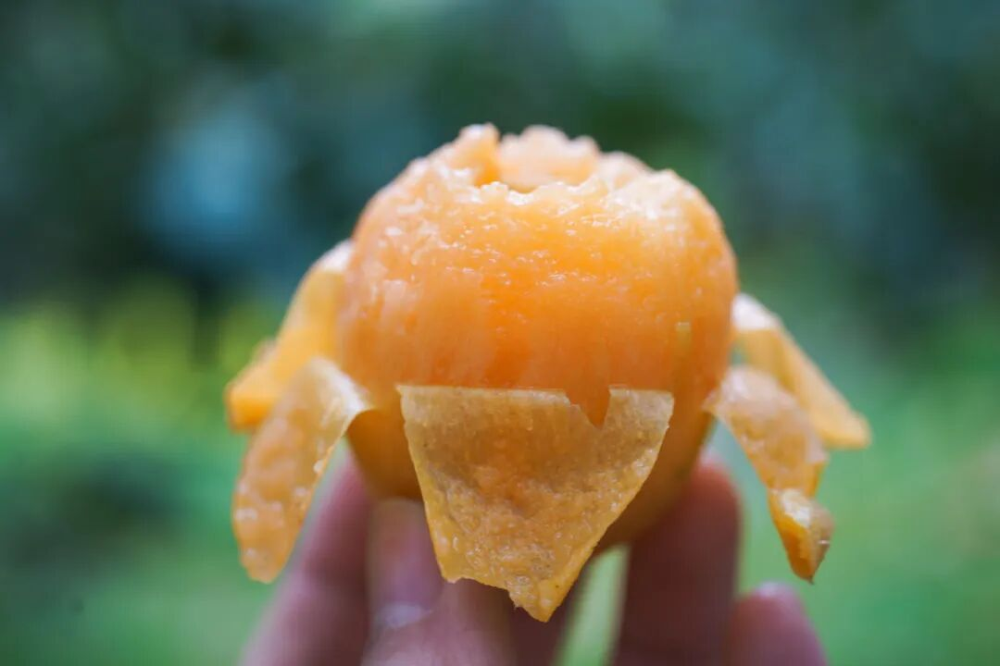

15 年高山老树结出来的果子。

生态种植，不打农药，

也就是说，

每颗枇杷都是树上挂果，自然成熟！

老人小孩放心吃！

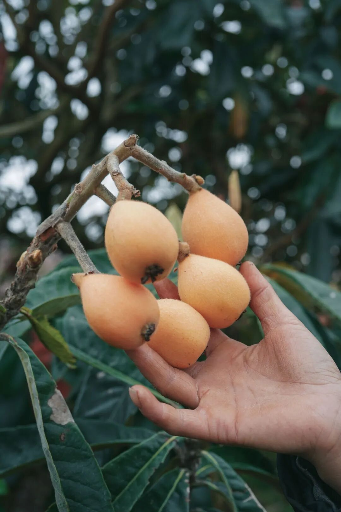

再配盒入口化沙的手工蛋卷、

果肉含量超 40%的

「大师凤梨酥」👇

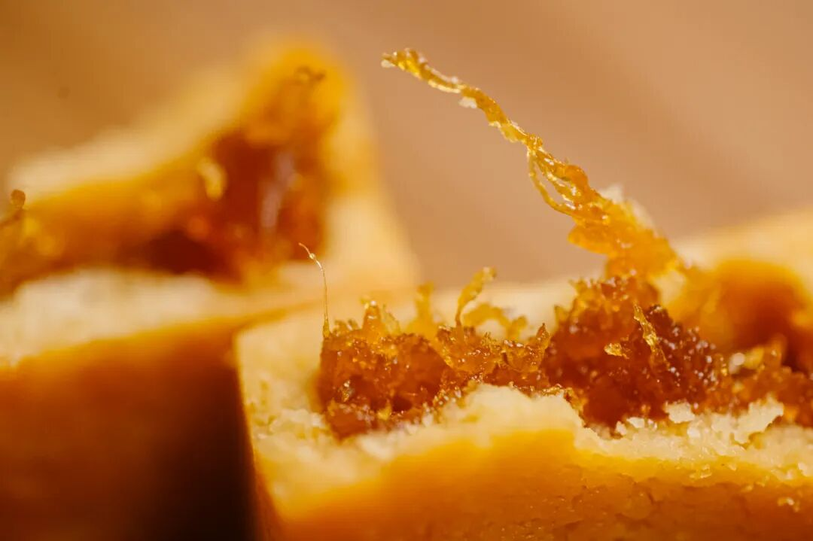

凑下来约等于「青团白送」，

爱尝鲜的朋友们闭眼入！

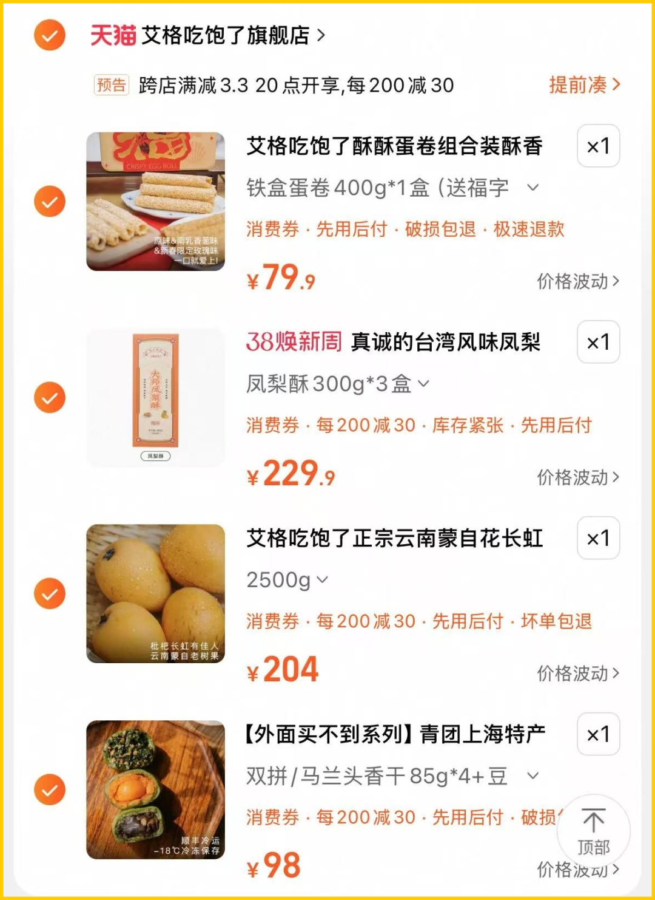

2. 「柚子小种红茶不要钱」购物车
这款柚子小种红茶，本薯自己都囤着当待客茶！一个字：香。清新柚果香混着茶香，恨不得把它变成室内香薰使！

用的是武夷山的花香小种红茶。传统手工精制，一芽一叶，
自带的鲜叶汁水也更丰富。

泡出来后，远远都能闻到饱满的柚子香气！

你还可以像董洁一样，

（是的它可是上了董洁直播间！

拿出喜欢的杯子品品，

总之优雅永不过时

加一盒入口有冰糖韵的小金罐·六窨茉莉花茶👇

我司特地委托了

家中五代制茶的福州老茶人，

以传统古法窨制正宗茉莉花茶！

精选明前茶坯，

六窨一提传统窨制，

下花量高达 350 斤

鲜灵得让人神清气爽，

甘爽醇和，舌尖回甘，

饭后喝喝正合适啊！

再搭配这个江湖人称「水果冰淇淋」的凤梨释迦！软糯又绵密，咬一口在唇齿间慢慢融化～

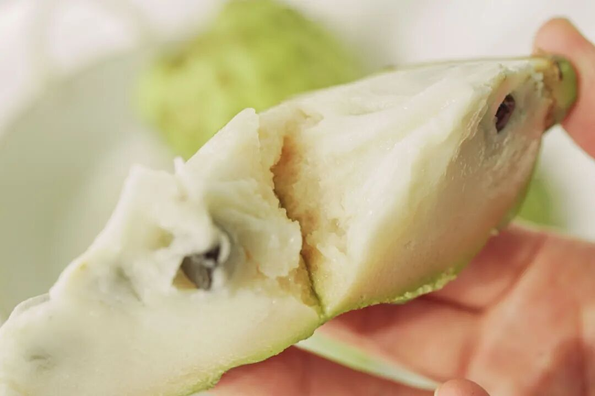

以及来自精品小果园的巨好吃巨浓甜的云南沃柑！

鲜甜，爆汁，

浓浓的橘子味儿。

除了种植过程绿色环保，

还是现摘现发的新鲜果！

搭着前面说的时令花长虹枇杷买买，约等于「柚子小种红茶白送」！有吃有喝，都是春天里的好滋味嘿嘿！

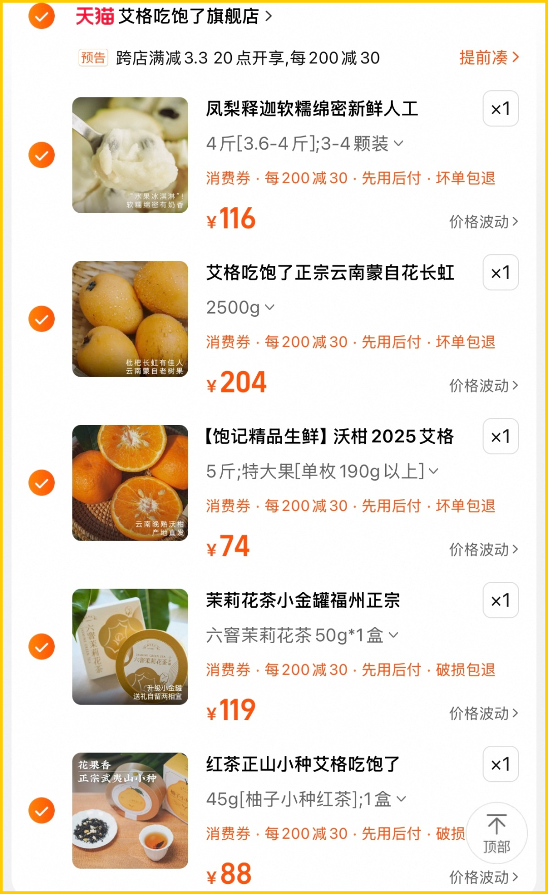

3. 「凤梨酥不要钱」购物车

好评如流水的

大师凤梨酥！最新一批 2 月中旬才到货，选的都是新鲜土凤梨馅，
果肉含量大于 40%！
只有 90 天短保质期哦。

可搭配又鲜又灵又脆又甜的我饱记雷笋！今年照旧有米其林餐厅师傅问过来，早早向我司预定了一批。有多好吃呢？照之前的经验，每周餐厅客人都要吃掉七八十斤！

无需任何厨艺，

炒，煲，蒸，焖！

随便糊弄熟就好吃！

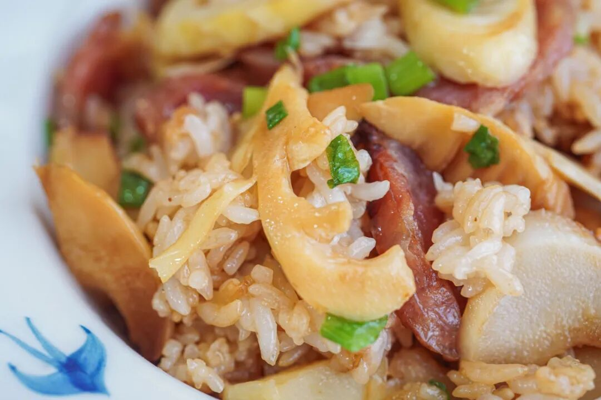

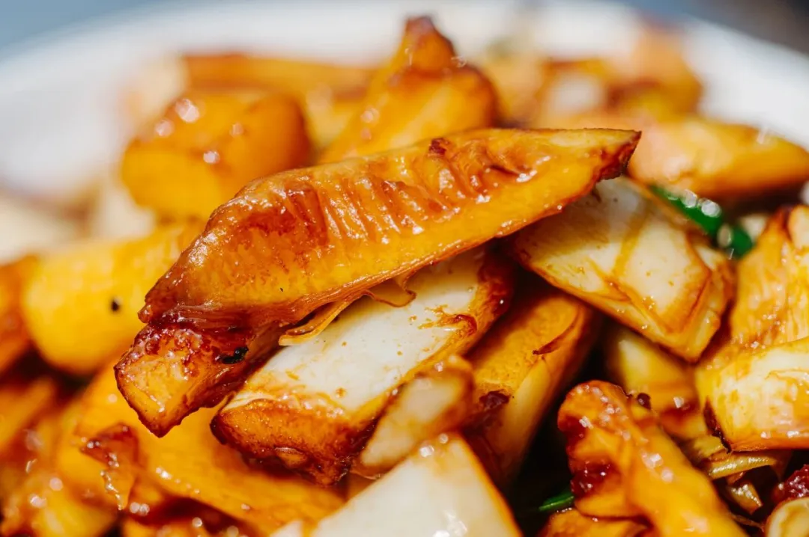

毕竟这自然笋实在难得！

在临安天目山核心产区

捂了一整个寒冬腊月。

老板只要那几个周边村子的笋，亲自跑到产区去挑的。

拒绝外地笋哦。

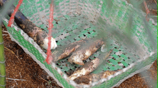

山核桃，想必不用多说。

我司每年的必买好物，

打遍天下无敌手。

都是刚炒的新货。

一是超新鲜，都是当季新货。

二是农大合作出品，靠谱。

三是调味轻，保留原香：

有人每 100 斤加 4 斤糖就在讲自己好了，我们是 1.5 斤糖。十一年前就这样。

酸酸甜甜的陈皮小话梅，

裹满清香橘子粉：

传统工艺腌制而成，

回味悠长生津。

是小时候爱吃的那种话梅～

这几样配一份前面提的

「蒙自花长虹枇杷」，

约等于「凤梨酥白送」👇

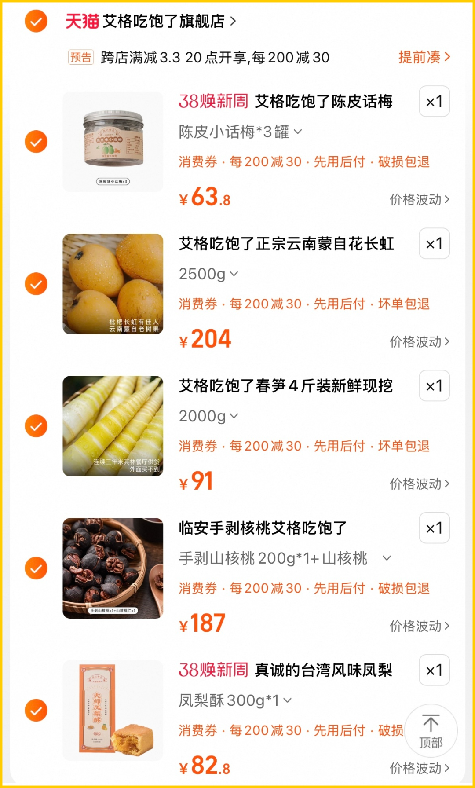

4. 「酥酥蛋卷不要钱」购物车

还是我们的零食囤货环节！

酥酥蛋卷，

香酥，极其香酥，

好吃的秘诀无它，

就是舍得下料，手工制作！

新鲜鸡蛋含量高达 27 %，入口化沙。

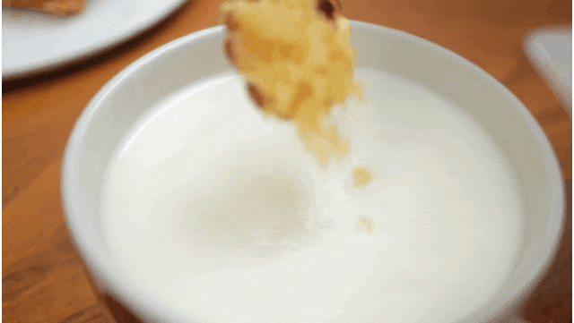

也可以尝试一下南乳葱香味！

独家定制的口味，入口葱香浓郁，

然后是南乳的咸香，

味道平衡得刚刚好。

搭配台湾金门口味的手撕牛肉干，超大片！！！
味道是咸鲜浓郁中带点甜，好嚼过瘾。不像市面上又干又硬的牛肉干，
难嚼得像在啃橡皮筋。它是微微湿润的，一条一条撕着吃。选用南美洲进口草饲牛、特挑部位制炒，台湾老师傅传承手工艺，慢火焙炒烤，真材实料！重点！柔韧鲜香，老人和小孩子都能嚼得动！

还有娇艳可人的雷州木瓜啊！是我们在水果缺缺的春天，遍访祖国南部产区定下的，已有四年，口碑极佳。

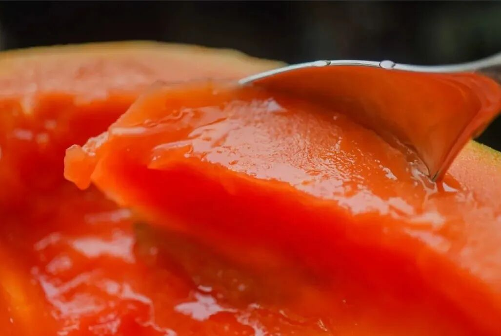

最终选中的果园位于广东湛江雷州产区。果子皮薄肉厚，内里橙红，刚切开，扑面而来一股浓郁奶香。。咬一口，超甜超糯超多汁，而且完全不发苦。（随便比，有这个自信，嘿嘿！

再来一份汁水巨多不死甜的云南沃柑！四舍五入「酥酥蛋卷白送」👇

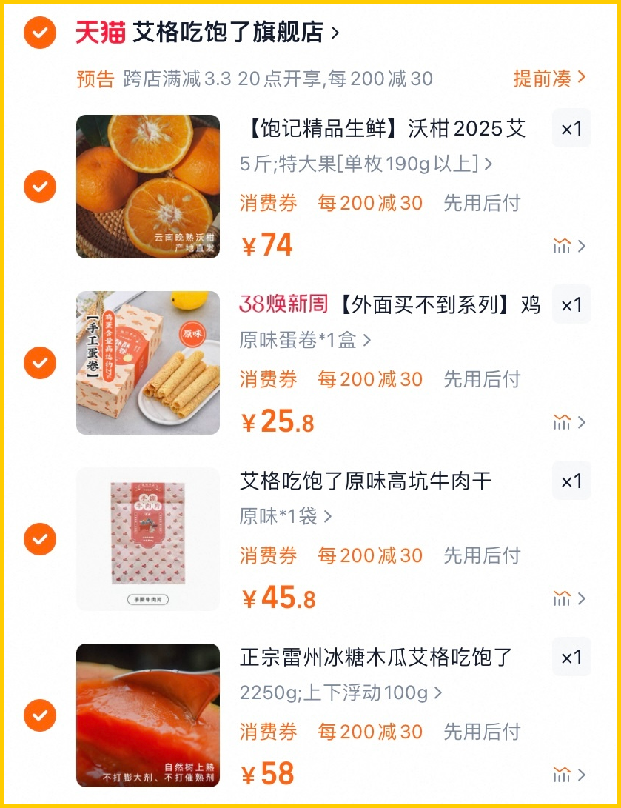

5.「黄金柚条不要钱」购物车
这个黄金柚子条，我愿称之为柚子口香糖！适合揣兜里随时来一根。初入口是淡淡的柑橘味，越嚼越浓烈的柚香直冲大脑，各种风味在味蕾上瞬间脱缰，爆发后，只留下满口的清新余味。

春天嘛，还可以加点蜂蜜泡柚子茶，柔滑甜蜜，清新！选用高品质沙田柚，采用低温真空原汁、原糖浸糖工艺制作而成，柚香十足，回味无穷。

馋嘴牛肉，

五香的咸香味浓，

麻辣的香辣爽口。

打游戏爱吃！

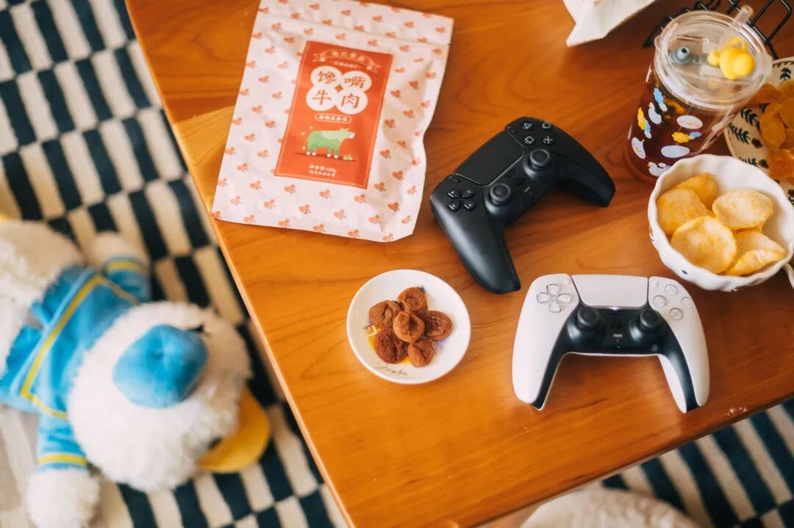

配上老朋友陈皮话梅、正当季的蒙自花长虹枇杷、以及春日必吃的饱记雷笋！「三盒黄金柚子条白送」👇

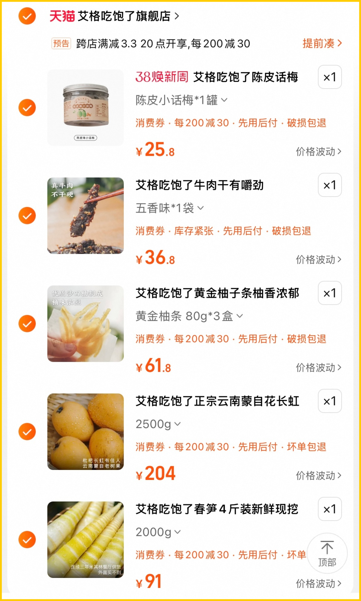

6. 「金桔酒不要钱」购物车
这款「外面买不到」的金桔酒，是我司产品同事的得意之作。

从融安自采了 3000 斤

正宗融安滑皮金桔，

果脆、芯甜、籽少，

拉到四川酒厂酿制。

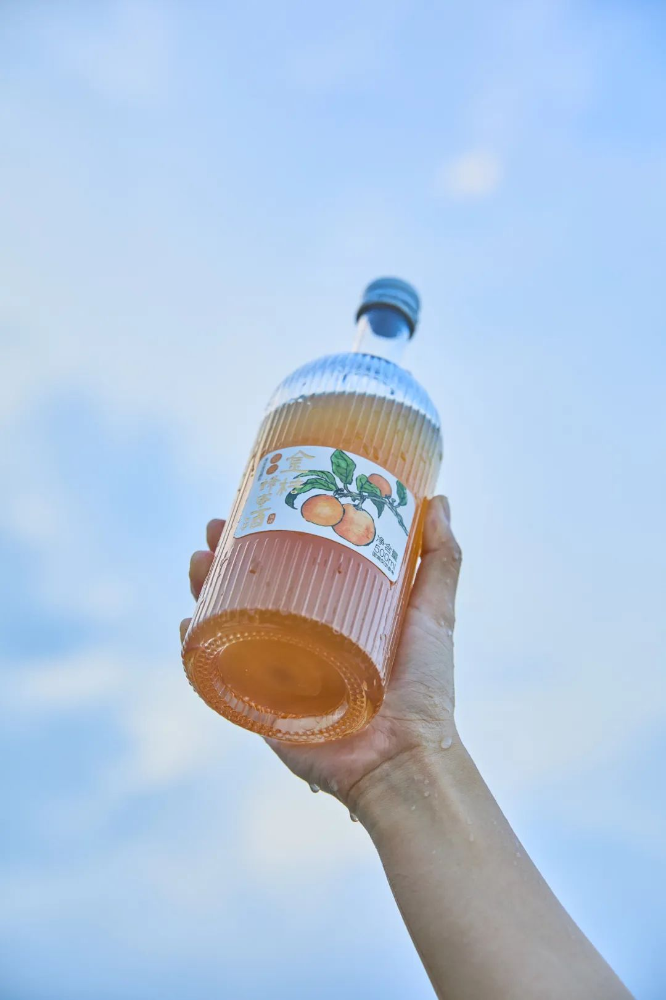

还用上了传统葡萄酒酿法，

整颗金桔浸皮萃取，

从而使更多果实风味向酒液转移，

带来浓郁柑桔香气。

入口回味悠长，带有微微辣意，

还有浓郁的柑桔清香，

好喝到停不下来啊！

桂花乌龙！

按福州同事的原话，

这茶完全经得起盖碗的考验！

和市面上都是细末的调味茶不是一回事，

必须细细品味！

茶底好得很，翻出家里的盖碗，怎么泡铁观音就怎么泡它。揭盖一闻，哇～桂花的香气完全被激发，直窜入鼻尖！带着一点花的自然甜味～

入口茶汤微稠，舌侧香气余韵不绝，观音茶的回甘源源不断！总之，闻起来是甜的，喝起来却有烤过的醇厚滋味！本当它是办公茶叶，没想到茶底这么好，还耐泡得很！
立即决定囤几罐在家！

我司有口皆碑的葱油开洋酱，

五分钟就能完成几道快手菜！

这酱好吃，

在于葱本身就挑得很好。

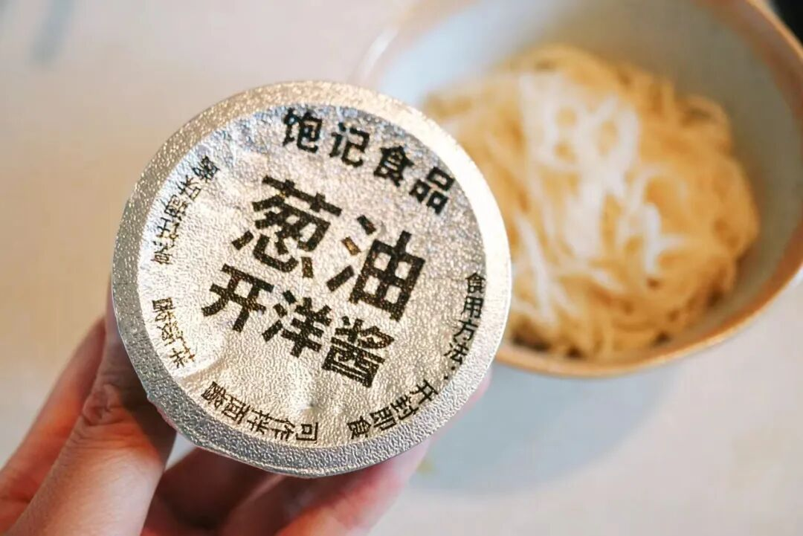

面下锅焯熟后捞出，

直接拿葱油酱拌开。

吸饱酱汁的葱油拌面，谁看不流口水啊！

（半夜里看真的会饿

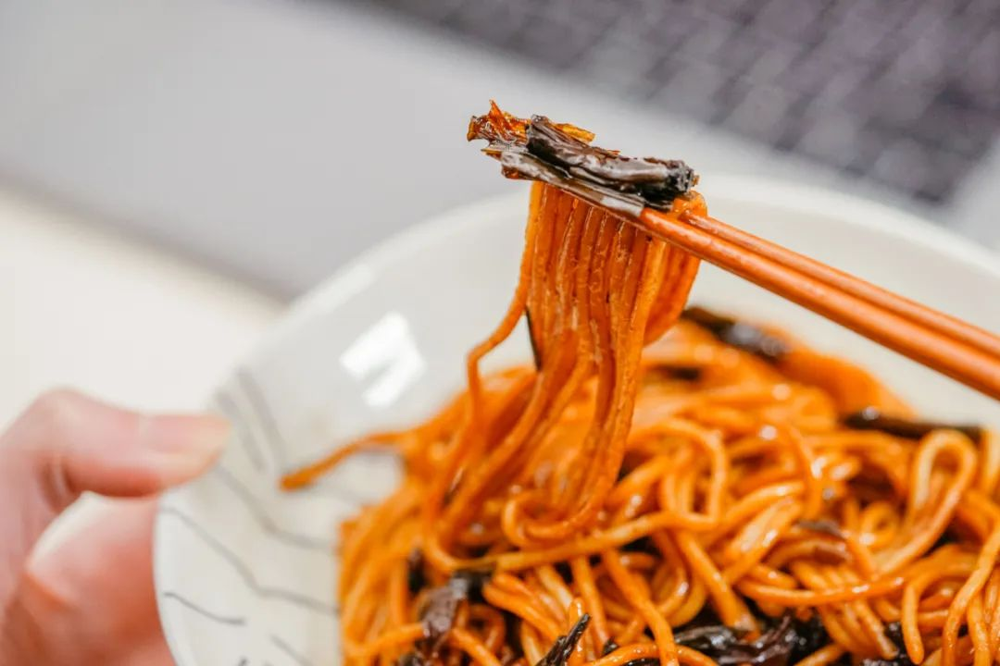

早春的好天气里，倒杯金桔酒，
煮碗葱油拌面。午后再泡壶桂花乌龙茶，
搭配这司卷得没边的牛肉干、枇杷，一整套搭下来约等于「金桔酒白送」，划算呀！（哦这个羊毛我发现的，呵呵呵呵

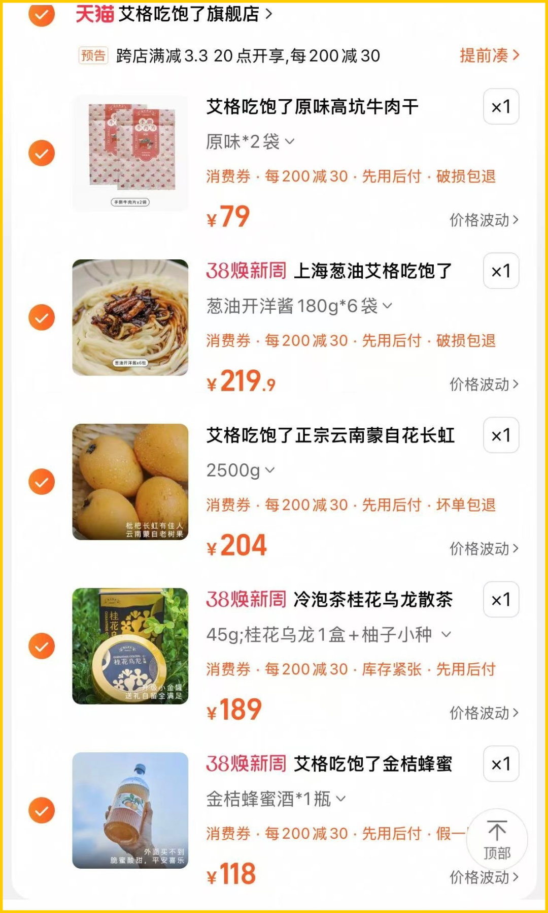

好了！以上仅为凑单思路参考，价格差不多都可以抄！大家随机应变啊！打开🍑🍑🍑搜索「艾格吃饱了」，还有木姜子巧克力、腊肉、鸭舌可凑单！六个大便宜，不薅白不薅！

题 外

朋友们春天好啊！

懒得凑单的直接下方买👇早春糯唧唧顶流，上周刚上架的我饱记青团买了吗？今天起正式发货啦！

趁现在限时 85 折！

刚冒出来的临安天目山雷笋，

米其林餐厅师傅第三年回购，

不焯水就鲜甜！

现在也有限时 9 折！

刚好配真材实料的饱记腊肠，

限时地板价 8 折！

或者试试好吃不贵的

玫瑰露酒腊肉&腊排骨，

更是限时地板价 7 折！

回到童年的铁盒蛋卷，

产品经理卷出来的鸭舌、麻花、猪肉脯，

都给一个限时 7 折！！

还有些适合空调房吃吃的水果👇

娇艳可人的雷州木瓜

限时早鸟 86 折！

口味浓甜的蒙自花长虹枇杷，

来自精品小果园的云南沃柑，

人称「水果冰淇淋」的凤梨释迦！

清新浓郁的万人迷上海金奖草莓👇

个头基本都在18mm+的云南露天蓝莓，

微甜饱腹、没啥热量的广西双拼芭乐，

现在也有限时 9 折！

饱记·妈妈牌青团

现货！！

限时 85 折！！！

戳图或去🍑🍑🍑搜索

「艾格吃饱了」

下单购买👇

饱记·2025 临安天目山雷笋

购买方式如下

限时吃笋 9 折！！！

戳图购买👇

饱记·手工腊肠购买方式如下👇限时地板价 8 折！！！！
戳图下单购买👇或🍑🍑🍑搜索「艾格吃饱了」

饱记·玫瑰露酒腊肉&腊排骨购买方式如下👇限时地板价 7 折！！
戳图下单购买👇或🍑🍑🍑搜索「艾格吃饱了」

饱记·湛江雷州木瓜购买方式如下限时早鸟 86 折！！
戳图购买👇

饱记·蒙自花长虹枇杷购买方式如下限时吃水果 9 折！！！
戳图购买👇

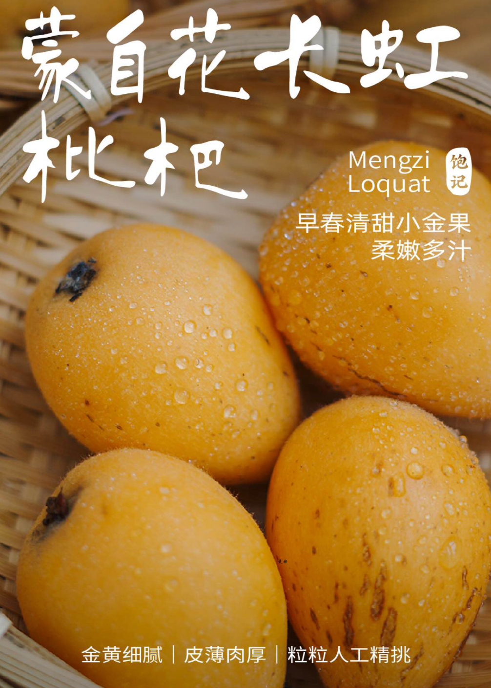

饱记·云南晚熟沃柑购买方式如下限时吃水果 9 折！！！
戳图购买👇

饱记·凤梨释迦购买方式如下限时吃水果 9 折！！！
戳图购买👇

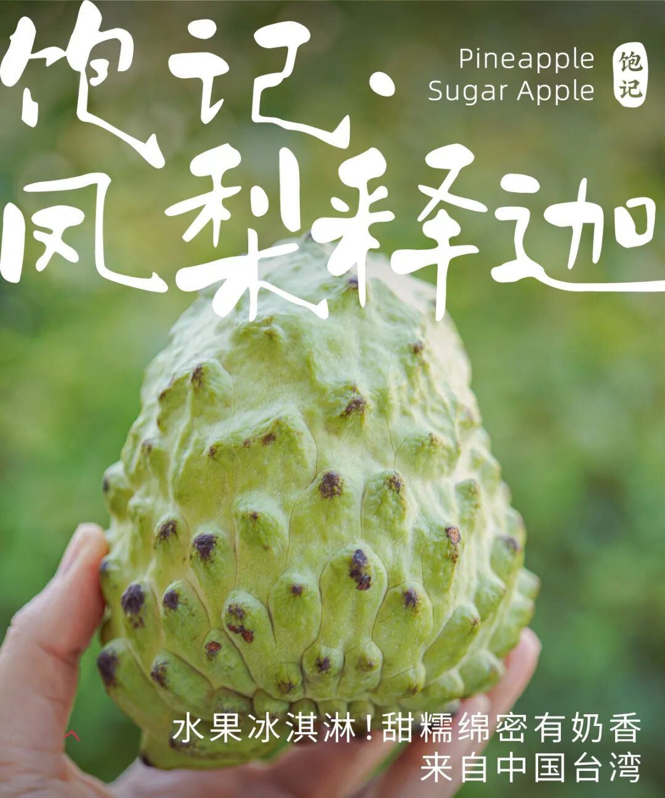

饱记·限定铁盒酥酥蛋卷

购买方式如下

限时开门红 7 折！！！

戳图购买👇

饱记·年味零食7 折专区！！
购买方式如下
戳图购买👇

饱记·云南高原蓝莓限时吃水果 9 折！！！新年莓开眼笑！！！
戳图购买👇

饱记·广西双拼芭乐

限时吃水果 9 折！！

新年健康快乐！！！
戳图购买👇

饱记·红颜草莓限时吃水果 9 折！！！节日莓有烦恼！！
戳图购买👇

本文的研究员

薯角啊！赞美春天！

用好吃的方式吃一生

祖国各地好风物

文章转载请加微信「baojiclub」

