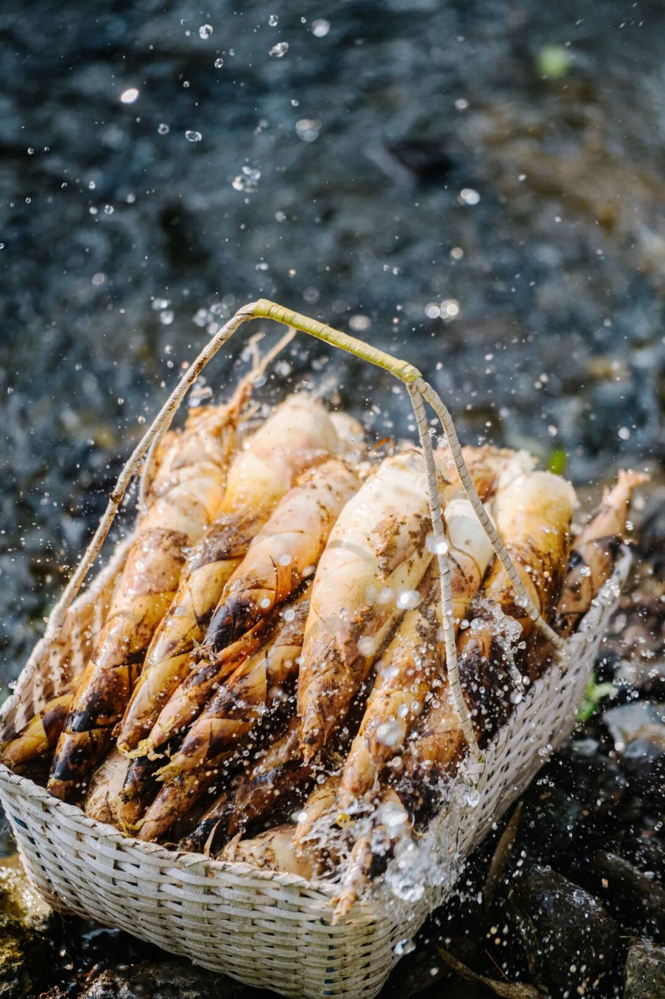
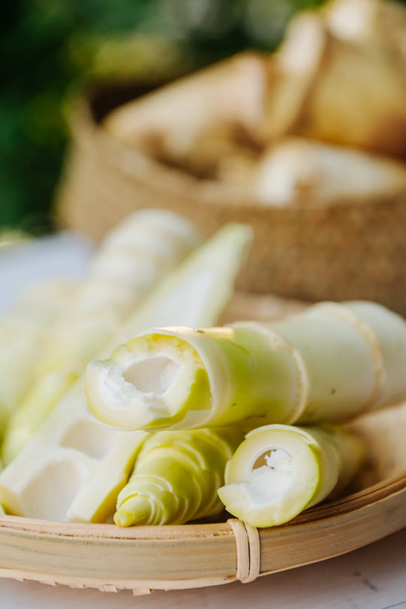
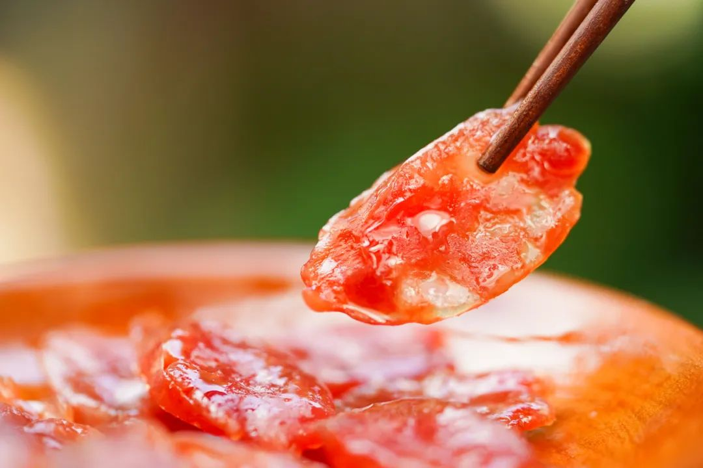
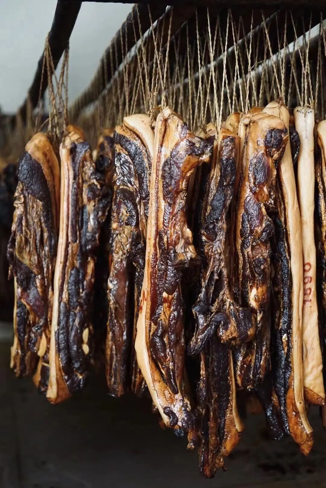
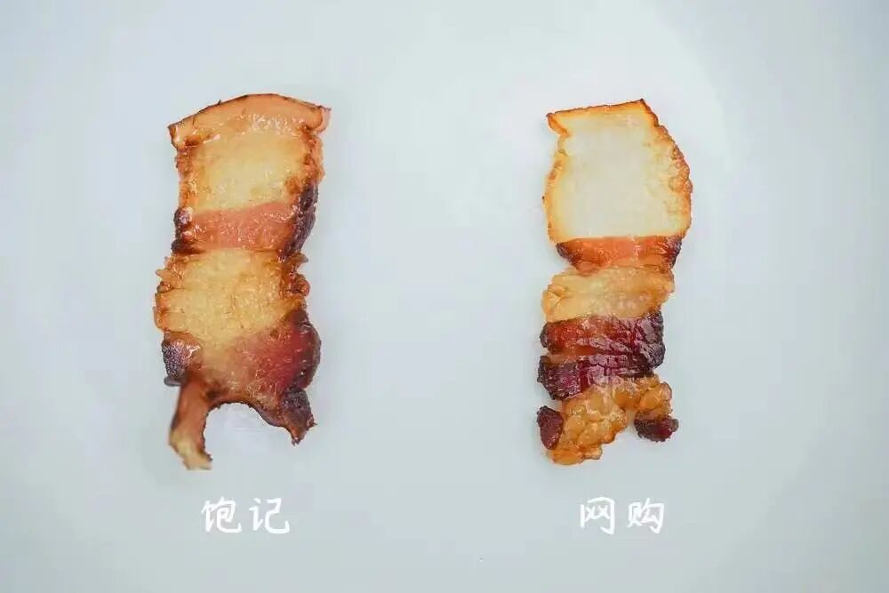
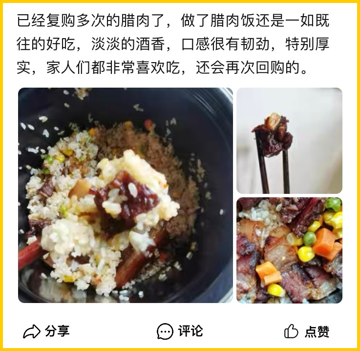
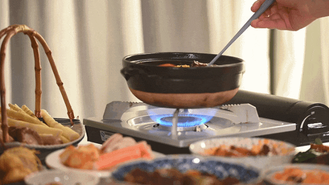
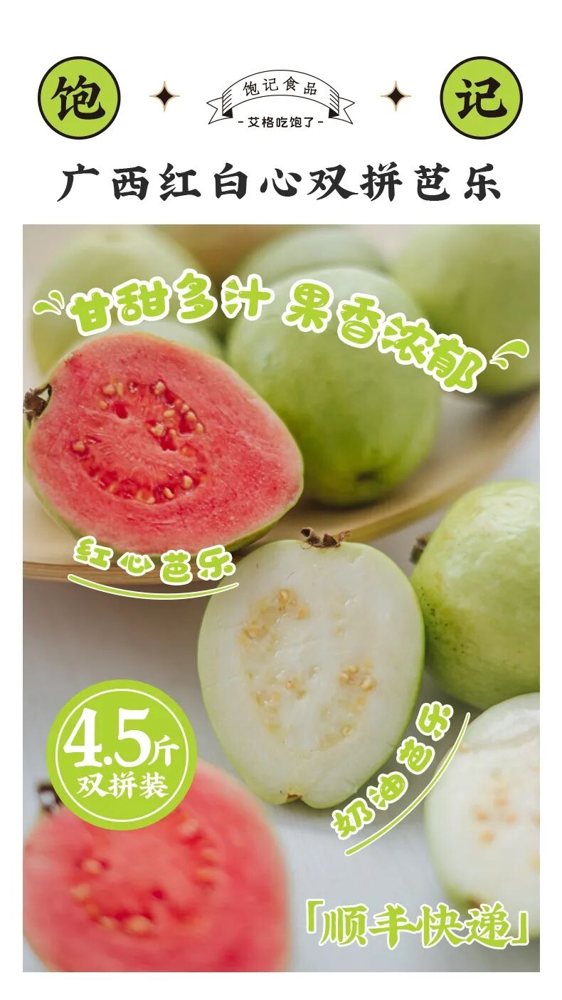

# 再不抢，山上的春笋要被夺完了。。。

- 原文链接: https://mp.weixin.qq.com/s?__biz=MjM5NTYxODQyMA==&mid=2653466676&idx=1&sn=73f38fe84873e2366e26daeb80b1bc3b&chksm=bc887587c534aabecb14a2c78b8e54c349021c54cc8bb0800a1ecead9e712adb9573f71d36a3&scene=27#wechat_redirect
- 浏览量: N/A
- 点赞数: N/A
- 评论数: N/A
- 转发数: N/A

## 正文

春天就等着一口！

一个尽情安利自我的公众号

以下是没事干研究院的风物研究报告请放心食用
话说！最近后台的常见问题是这样的👇

问得早不如问得巧啊！我司每年千呼万唤的临安天目山雷笋，终于熟啦！
今天起大家趁早吃啊！

一夜之间，这些小家伙们手拉着手kuku它就往外冒，根本拦不住。。。

老客人或许还记得，我饱记春笋一向非常出息。今年照旧有米其林餐厅师傅问过来，早早向我司预定了一批。有多好吃呢？照之前的经验，每周餐厅客人都要吃掉七八十斤！

然后吃过的客人表示，这笋真脆甜，感觉还没长大，就被从土里薅出来了吧。。。

事实确实如此，我司春笋就只选临安天目山核心产区那几个周边村子的笋，老板亲自跑到产区去挑的。

拒绝外地笋。

因为笋的品质好不好，

和土壤质地直接相关。

腐质高的土才能长出好笋。

所以，哪怕只是20公里之外，

就已经不一样了。

农产品非常玄妙，就算差一点点的位置，土壤和水文就会差很多，产出的笋就是不一样。

产区选对了，还要精挑！据说运用了「妈妈去菜市场挑笋」的家传智慧，只选大小、嫩度适中的青年笋，一开始都是拿尺子直接量，这几年下来阿姨们熟练了，才开始人手精挑，属于是笋中精品的存在了。。

所以我司春笋，外面根本买不到！即使是同一个产区，也不是同一层次的品质嘿嘿～

它几乎不用处理，

就有原汁原味的鲜甜感，

细嫩无渣，

跟市面上大多数笋都不同！

每年就卖一两个月，卖完就没了！想吃的，快冲啊！！

总之，

焯水一分钟，

（其实不焯水也不麻嘴

尝尝早春江南时鲜的味道，

真的很鲜甜，

是外面买不到的那种鲜甜。

现在还有难得的限时早鸟 86 折！

去买。

饱记·2025 临安天目山雷笋购买方式如下限时早鸟 86 折！！！

戳图购买👇

不知道这笋还能咋做的，本薯也给你们安排好了！配我司这米其林餐厅师傅都年年订货的饱记·手工腊肠，直接往电饭煲里一焖就完事儿！现在这肠还有限时地板价 8 折！！

这腊肠一共三种选择！口味一：手工广式腊肠，

有四六和二八这两个肥瘦比例可选。

口味二：滇式腊肠

用了不少贵价的辛香料，各种香味在唇齿间乱窜。亲测怕辣的人也能吃！

都是真材实料！用的纯黑猪肉，产品同事说现在外面很多电商腊肠，都会加入部分大豆蛋白，和猪肉比起来简直成本可忽略不计。而这种添加甚至可以在配料表上并不体现。。。

除了猪肉，腊肠的肠衣也有讲究！饱记就是用中国人民几百年晒腊肠用的，猪肠衣。成本高，但是架不住口感好！嚼起来 Q 弹有韧劲，最后又会在口腔里化开。而便宜货可以用科技品：胶原蛋白肠衣。就是蒸完嚼不大烂可以整条脱下来吐出来的那种！

天然肠衣一眼就能看出来，比较薄和透
两种手工广式腊肠是甜口的，

即大家更熟悉的广府糖酒风调味。

滇式腊肠则偏咸辣，肉香&麻香&辣香&酒香交织。

总之入口都爽脆，

直接煎了吃或者煲饭香绝👇

如我一般懒惰的干饭人看这里，三种肠煮饭的时候都可以随意放几根，再切点春笋下去，就是一绝！

饱记·手工腊肠

购买方式如下👇

限时地板价 8 折！！！！

戳图下单购买👇或🍑🍑🍑搜索「艾格吃饱了」

除了腊肠，
产品同事老藏着掖着的还有我司卷生卷死的

玫瑰露酒腊肉👇

这腊肉用料实在，但好吃不贵！
腌肉用的玫瑰露酒。
找了好久，
才选中天津老字号金星的玫瑰露酒，花香酒香协调且纯正，可以给肉带来一股自然的玫瑰香！

肉呢，用的带软骨的猪肋排，每头猪仅能产出两条，非常矜贵。

每 100 斤肉就要用掉 7-8 斤玫瑰露酒，并用草绳一一吊挂，腌制 4 小时以上。最后用当地特有的长竹竿整排吊挂，经过 3 天的风干锤炼，才变成了一条条成色隽美的腊肉。

如果你跟本薯一样，不喜欢很重的糖度或略呛人的白酒味，买饱记的这款腊肉就是有福了！我司相应减少了糖的比例，更能突出肉的原香👇

饱记：酒肉与肉香交织，能尝到猪肉的原香。网购：酒味盖住了肉香，调味整体偏甜。

随手甩一张好评图！

很难不自信👇

今天也给到一个限时地板价 7 折！

这肉原本定价就实在得很，

方便大家煲饭吃啊！

别急，还有！

这道腊排骨火锅，

是地道的云南丽江美食。

热气腾腾中带着肉的原香和烟熏味，

我愿将其与辣火锅、牛肉火锅

并为早春冷空气里的三大火锅

不到百元，教你在家复刻！

就是把腊排骨放锅里炖煮 1 个半小时，

直到炖煮到这样的浓汤。

加入韭黄番茄大葱玉米，

腊排骨的汤底就完成了！

其他和吃火锅一样，

想涮什么下什么，

菌类啦蔬菜啦都很好，

还能带来一点甜味。

最好再调一个蘸水！

云南风味的灵魂！

蒜泥+香菜+辣椒粉+腐乳+线椒，

最后淋上一点腊排骨的汁即可。

提醒一下，

排骨提前浸泡 3-4 个小时再下锅煮，

否则会太咸。总之，

不需要任何厨艺，

不到一百块钱，

你就能做出这样的冬日暖锅！

同样限时地板价 7 折！

冲！

饱记·玫瑰露酒腊肉&腊排骨

购买方式如下👇

限时地板价 7 折！！

戳图下单购买👇

或🍑🍑🍑搜索

「艾格吃饱了」

题 外

没吃够的朋友看这里👇

即将尾声的富平柿饼，吃完就没！

尾声限时 85 折！

回到童年的铁盒蛋卷，

产品经理卷出来的鸭舌、麻花、猪肉脯，

都给一个限时 7 折！！

昨天刚到的有小时候味道的云南露天番茄，

现在还有限时早鸟 86 折！！

还有些适合空调房吃吃的水果👇

七彩玲珑的四色小番茄，

清新浓郁的万人迷上海金奖草莓👇

个头基本都在18mm+的云南露天蓝莓，

微甜饱腹、没啥热量的广西双拼芭乐，

现在也有限时 9 折！

此外 90 天短保质期的大师凤梨酥，

也都有限时 9 折冲冲！

饱记·富平柿饼购买方式如下尾声限时 85 折！！！
戳图购买👇

饱记·限定铁盒酥酥蛋卷

购买方式如下

限时开门红 7 折！！！

戳图购买👇

饱记·年味零食7 折专区！！
购买方式如下
戳图购买👇

饱记·云南西红柿

限量 500 箱！

下单后 5 天内发货！

限时早鸟 86 折！！
戳图购买👇

饱记·甜郁四色小番茄

购买方式如下

限时 9 折！！！

戳图购买👇

饱记·云南高原蓝莓限时吃水果 9 折！！！新年莓开眼笑！！！
戳图购买👇

饱记·广西双拼芭乐

限时吃水果 9 折！！

新年健康快乐！！！
戳图购买👇

饱记·红颜草莓限时吃水果 9 折！！！节日莓有烦恼！！
戳图购买👇

饱记·新鲜到货凤梨酥

限时 9 折！！！
戳图购买👇

本文的研究员

薯角啊！赞美春天！

用好吃的方式吃一生

祖国各地好风物

文章转载请加微信「baojiclub」

