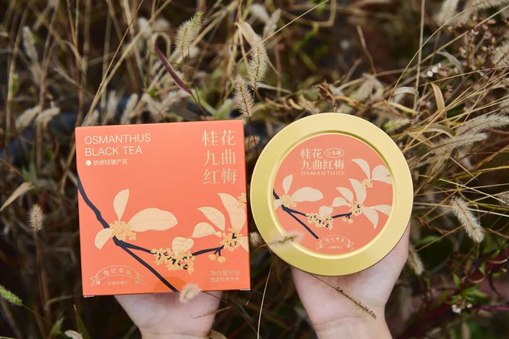
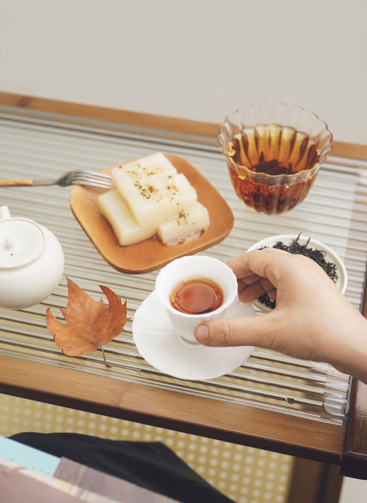
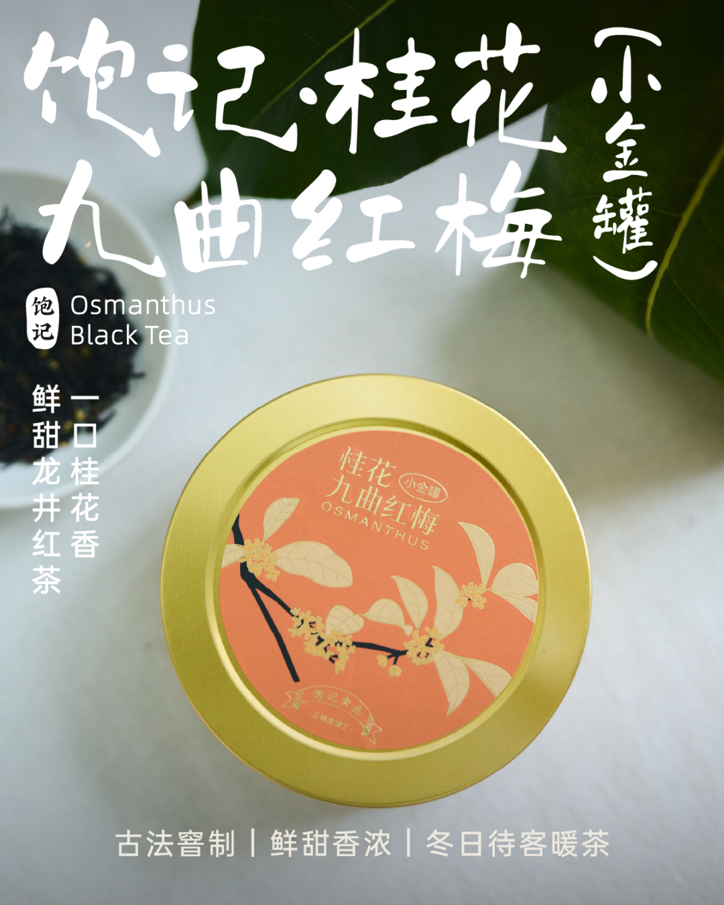
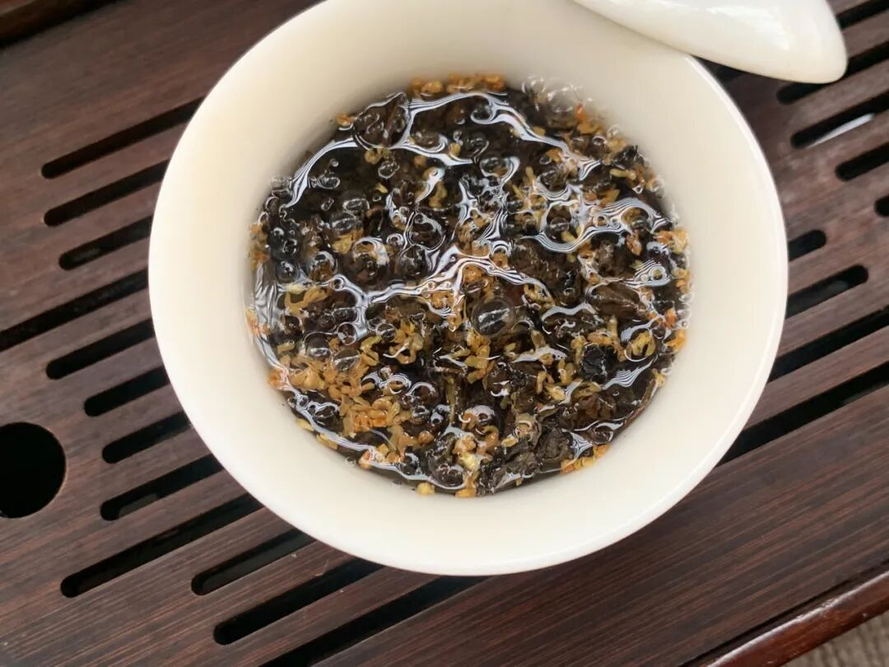
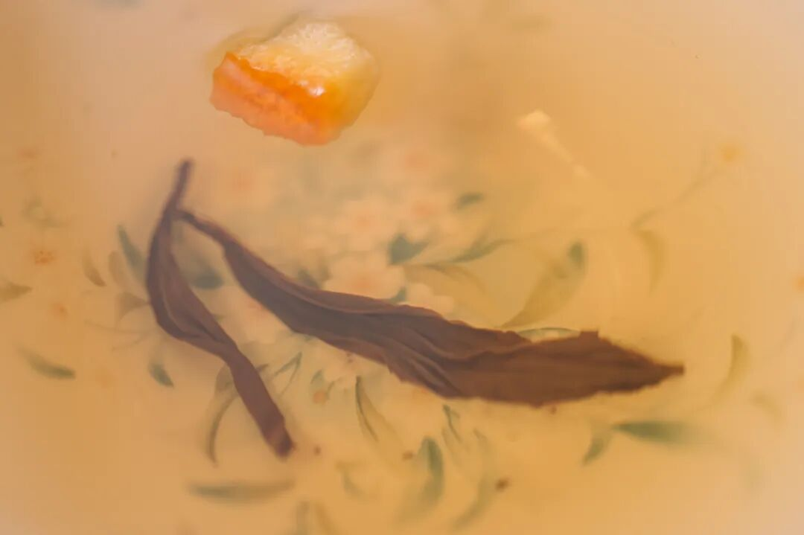

# 冬天多喝热水，又甜又润又美

- 原文链接: https://mp.weixin.qq.com/s?__biz=MjM5NTYxODQyMA==&mid=2653463271&idx=1&sn=b6e61fa09dc535bc485e528a21384646&chksm=bc9b41ffdff987da4b102f4f001de6b538e4d94ee909e8814fb0d34b448787cabd1ec8a28641&scene=27#wechat_redirect
- 浏览量: N/A
- 点赞数: N/A
- 评论数: N/A
- 转发数: N/A

## 正文

你品你细品

一个尽情安利自我的公众号

以下是没事干研究院的风物研究报告请放心食用
啊啊啊啊啊啊，十二月的温度，降得和我打工的心一般冷。（老板别看是恶评此情此景，本薯不禁想为大家献上好茶二种，又香又甜又润，冬天了一起多喝热水啊！！

有一说一，我司茶真的不错，
都是自己卷自己的傲人成果。「好喝热水」其一，上过亚运会国宴茶清单的饱记·桂花九曲红梅，升级了小金罐！

这茶喝起来，就一个词，鲜甜！是那种水润、嗓子非常舒服的甜。
桂花巨巨巨香，暖而不涩，
一杯能泡四五泡，
像我这种人就能喝一天！

平时不大喝茶的摄影师直接被俘获，当场拎了一罐走，这就是那种不需要你多懂茶就能品出来的简单直接的好喝！

可以直接拿喜欢的杯子冲，也可以和本薯一样取盖碗泡，更能激出茶叶本身的甜香韵。茶汤红亮，空气里到处是花香和茶香👇

九曲红梅是红茶的一种，属于杭州人民的口粮茶！我饱记这款，
用钱塘产区鲜采龙井发酵制作的红茶，再采杭州市花银桂，1小时内送去窨制。

有 30 年制茶经验的老师傅，

以 2 斤桂花、10 斤茶的配比，

古法窨制 24 小时，

所以比普通窨制的花香更浓！

配料表超级干净，仅有九曲红梅和桂花！

大家放心喝起来啊！

由于此茶风味接受度颇高，

喝过的人都喜欢！

尤其推荐拿它当冬日里的待客暖茶。

老规矩！

给大家薅来限时早鸟 86 折！

趁现在入手正正好啊！

桂花花期短暂，每批产量不大，

错过今年，

就要等明年的桂香啦～

饱记·桂花九曲红梅（小金罐）购买方式如下👇限时早鸟 86 折！！
戳图即可购买👇或打开 🍑🍑🍑 搜索「艾格吃饱了」

「好喝热水」其二：

我司回购率极高的桂花乌龙小金罐！

福州同事的原话：

这茶完全经得起盖碗的考验！

和市面上都是细末的调味茶不是一回事，

必须细细品味！

来自后台用户的

真实反馈👇

茶叶用的是六年陈炭焙铁观音，

同事专程跑到福建安溪，在平均海拔超过 1200 米的戴云山脉深处卷出来。茶农分三次焙火逼出茶香，最后陈放六年，耐心等待火气褪去，把蜜韵养足～

金桂，是每年寒露前后新鲜打的，早上五六点日出前打下来，运回后剔除花梗树叶，仔细拣选后才可与茶叶拼和。

然后请来福州当地家中五代制茶的老茶人，以传统古法窨制，一层金桂一层茶～

早期刚开始，我们做的是一窨一提（下花量 70 斤），后来再到两窨一提（下花量 230 斤），这次老板下了血本，直接做了三道窨制的（下花量300斤）！100 斤的茶要用300 斤桂花分三次窨制！！

（洒的不是花，是钱。。。
但懂的都懂，老福州人做花茶，讲究见花香不见花，饱记也是同样标准，桂花萎蔫后都会以手工挑除，只在烘干后额外洒入干桂花～费时费力得很！

（这么好看，不要命啦？
用盖碗泡，哇～桂花的香气完全被激发，直窜入鼻尖！带着一点花的自然甜味～入口茶汤微稠，舌侧香气余韵不绝，观音茶的回甘源源不断！

总之，闻起来是甜的，喝起来却有烤过的醇厚滋味！本当它是办公茶叶，没想到茶底这么好，还耐泡得很！立即决定囤几罐在家！

还可以搭着柚子小种红茶买！组合更划算！用的是武夷山的花香小种红茶。茶叶鲜度很高，传统手工精制，一芽一叶。

泡出来是这样的，远远都能闻到饱满的柚子香气！冷热皆可。但同样最推荐盖碗泡法！

当然你也可以像董洁一样，（是的它可是上了董洁直播间！一个人的时候拿出喜欢的杯子品品，给自己小小的仪式感？总之优雅永不过时

总之，
桂花九曲红梅鲜甜有花香，
桂花乌龙入口更醇厚，柚子小种红茶有浓郁的果香气！都又润又好喝，
且现在还有地板价 86 折！大家各取所需！大人们！请用茶吧！

饱记·桂花乌龙（小金罐）购买方式如下👇限时地板价 86 折！

升级版小金罐，送礼自留都满足。
两种规格：单罐装：桂花乌龙（1盒）组合装：
桂花乌龙（1盒）+柚子小种红茶（1盒）
戳图即可购买👇或打开 🍑🍑🍑 搜索「艾格吃饱了」

题 外

还有还有！

上周刚来的今年份的象山红美人，

大家买了吗？

我不允许任何人错过它啊啊啊啊！

堪称整个冬天最好吃的水果（之一

现在还有最后两天的限时早鸟 86 折！买它！

此外外面买不到的金山瓢鸡，

这批卖完下次得等半年了！

苏南蟹标杆美味：太湖流域大闸蟹苏北蟹宝藏性价比之选：洪泽湖大闸蟹

有小时候番茄味的云南西红柿（快没了，

还有打遍天下无敌手的山核桃！我司卷中卷产品，拿到外面去都能打得很！具体你们看商详，最重要是还有些限时返场折扣再薅老板一回！冲！

饱记·象山红美人柑橘购买方式如下限时早鸟 86 折！！
戳图购买👇

饱记·云南稀有品种瓢鸡

购买方式如下

限时突破价 7 折！！

规格第一档：6 月龄公鸡净重 3.4 斤以上 70 只，6 月龄母鸡净重 2.5 斤以上 140 只。规格第二档：
6 月龄公鸡净重 3 斤以上 160 只，6 月龄公鸡净重 2 斤以上 140 只。
下单前请注意：此鸡蛋白质含量丰富，宰杀时已尽量放血，但少量余血开包时气味仍会比较大，请冲洗再食用！鸡皮不发粘，就绝非变质～～～

戳图下单购买👇

或🍑🍑🍑搜索「艾格吃饱了」

饱记·云南西红柿购买方式如下限时 86 折！！
戳图购买👇

饱记·太湖流域大闸蟹

购买方式如下

限时 9 折

三种搭配：

满足装，

3-3.4 两母蟹，4-4.4 两公蟹，

吃过解馋。

劲爽装，

3.5-3.9 两母蟹，4.5-4.9 两公蟹，

可以拍照发朋友圈争奇斗艳。

尊享装，

4-4.4 两母蟹，5-5.4 两公蟹，

顶格水准，适合送礼。

人工精挑，

上岸后静养一两日更鲜美，

每日限量 50 箱。

拼的就是手速。

顺丰快递发货，

新鲜看得见。

戳图下单购买👇或🍑🍑🍑搜索「艾格吃饱了」

饱记·洪泽湖大闸蟹

购买方式如下

限时 9 折

满足装洪泽湖大闸蟹：

3 两母蟹，4 两公蟹。

性价比之选！

劲爽装洪泽湖大闸蟹：

3.5 两母蟹，4.5 两公蟹。

饱记热销款。

尊享装洪泽湖大闸蟹：

4 两母蟹，5 两公蟹；

或 5 两母蟹，6 两公蟹。

实际超重，量极极极少，送礼佳品。

人工精挑，

上岸后静养一两日更鲜美，

每日限量 100 箱。

顺丰快递发货，新鲜看得见。

戳图下单购买👇或🍑🍑🍑搜索「艾格吃饱了」

饱记·临安山核桃

购买方式如下👇

戳图买它👇

或到🍑🍑🍑

搜索「艾格吃饱了」

本文的研究员

薯角冻成了冰角

用好吃的方式吃一生

祖国各地好风物

文章转载请加微信「baojiclub」

