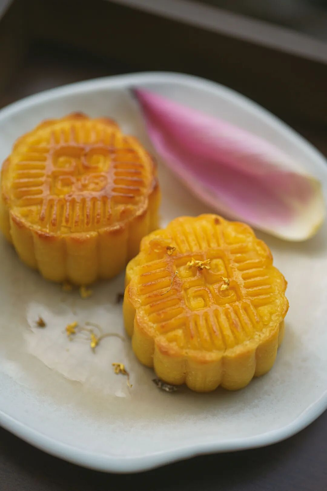
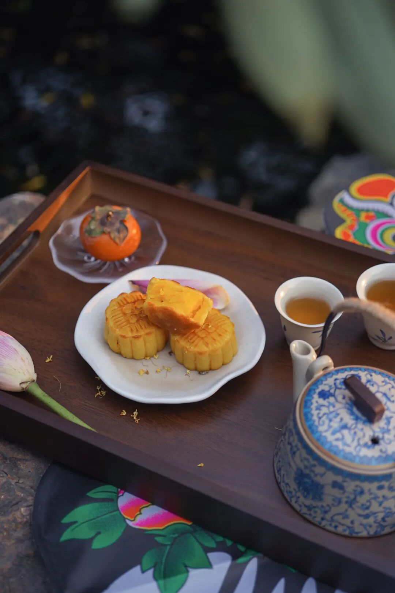
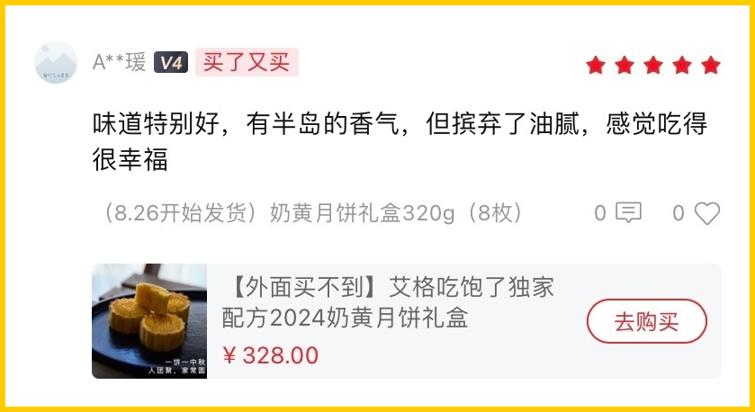
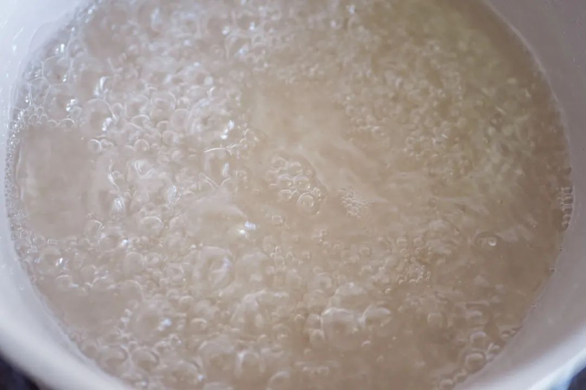
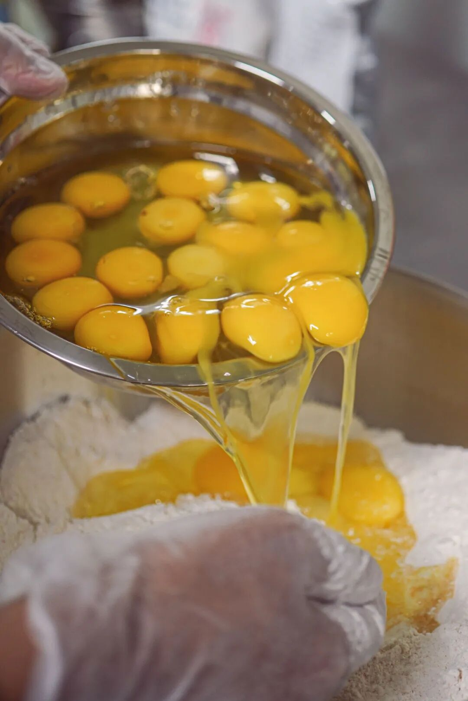
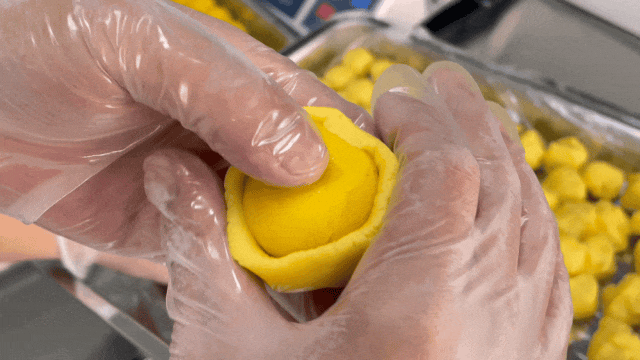
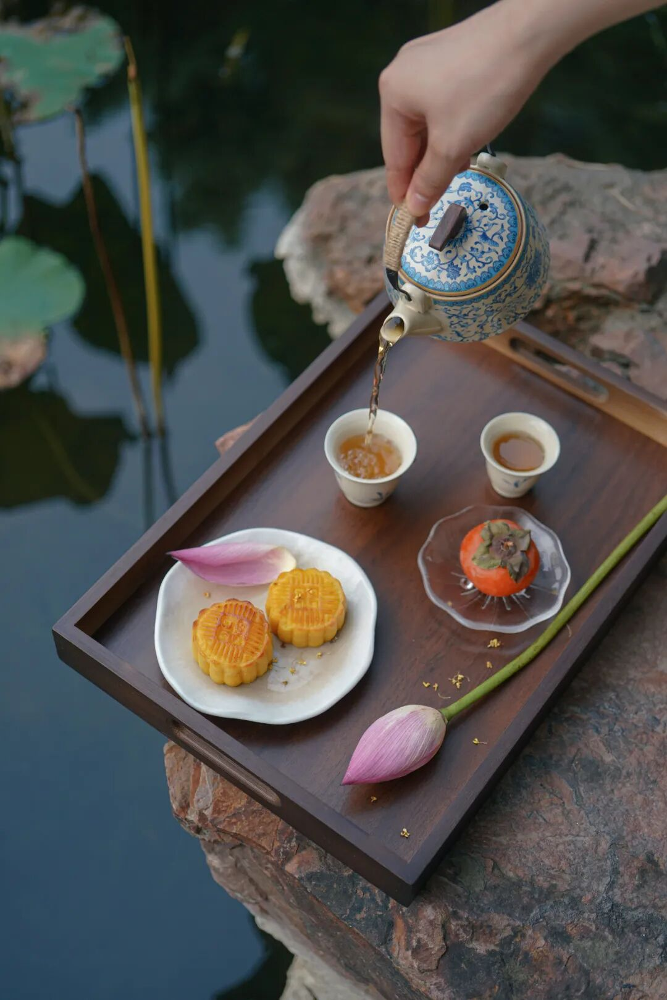

# 到底是谁有品牌溢价啊。。。

- 原文链接: https://mp.weixin.qq.com/s?__biz=MjM5NTYxODQyMA==&mid=2653458242&idx=1&sn=7e52582ef623e38edcf12ad3c0ef74b3&chksm=bc4c08f9cfa4ba131ed6e16cce9eedf6cf6c496bd3adecf12bb3b56e5597f5b69a398370d2a1&scene=27#wechat_redirect
- 浏览量: N/A
- 点赞数: N/A
- 评论数: N/A
- 转发数: N/A

## 正文

外面买不到

一个尽情安利自我的公众号

以下是没事干研究院的风物研究报告请放心食用

这司最近，

安分守己得很，

上上下下都在卷今年的奶黄月饼！

结果有用户跑来说，

「你们这是品牌溢价！！！

你们还真以为自己是半 dao 美 xin？？？？」

听完此言我薯角涕泪横流，

（卖力演给老板看一看，大家放心

啊啊啊啊啊冤枉啊！！！

奶黄流传于世的创始配方，

专门请米其林大厨帮我们调整减糖，

升级了食材原料，

配了更有仪式感的包装，

加上车间设备从广东请一队熟练师傅，

又有一队阿姨包我饱这美仑美奂的手工包装！

开工就哗啦哗啦都是钱啊，，，，

而且不要说半啊美啊的，

我买了他们家的啊。都是常温保存，

顺丰陆运。

就这样，我司产品加外省空运的邮费，

市面上有些也比我饱贵出一百多块去。。。

而且比我司贵 100 多块的的奶黄，

饼皮还有麦芽糖浆。

咋说呢，糖浆不是不能用，

但用了多半就是为上机器准备的

在奶黄上，确实是要坚持全手工工序，

这样才会真 · 好吃啊。。。

本薯空降我司之前，一向认为这种好评都买的吧哈哈，现在知道，不是，客服传回好评的那天，全群欢呼啊。。。

来看我司，不使用成品预拌原料，

糖浆也是车间烤饼师傅每日现煮，

跟自家烘焙一样，

其实就是轻轻煮个糖水，

所以不会甜腻。

配着鲜鸡蛋、安佳黄油、太古砂糖、

欧洲进口稀奶油，

这些家常食材，

没有科技与狠活，星级餐厅厨房什么样，

我们就什么样。。。

广东飞来的熟手师傅们，

这次可是个顶个的绝活儿。

每日手工现做现烤。

保质期非常短，

常温放 5 天，

冷藏也只有 15 天。

这个改良过的配方好吃，

但每天损耗就 15%。

工厂阿姨：真是打过最幸福的工，

每天都带回家很多！

麦芽糖浆的优点是增加韧性，可以上机器，但在奶黄界，确实没有手作的好吃。而煮糖水使饼皮烤完容易裂，我们都会挑出来报损

手作工序繁琐，

所以产能有限，每天限量 100 份。

卖得出也做不了。

大品牌出货量大，机器做的常温月饼，

味道，和成本上都不是一个量级的。。。

你说人家师傅是不会做好吃的吗？

肯定不是。

但一年出货十万盒，肯定要上机器。

包装也只是简单的纸盒。

就这样还比我们贵一百多块。。。。

衷心希望老板百年老店了（也就是她 135 岁那年

也开这个价？？？

最后看一下给大家

特别定制的竹木中式食盒，

再裹上定制小兔奔月包袱布，

（盒子还可以环保再利用。

（装首饰、装袜子都可以！

又美又好吃，

送礼自留两相宜！

离中秋还有段时间，

本薯还跟老板薅来了一个

限时 86 折！

提前看齐 5 号开始的

天猫满 300-40 大促！

目前下单的订单生产排到 5 号。

现在的订单接下来会依次发送！

饱记·奶黄月饼礼盒
购买方式如下👇限时 86 折！！
饱记原创配方，外面买不到！
🥮 新鲜手作，外皮酥脆，内里奶香浓郁～
每日限量 100 份。下单后按顺序发货。
戳图买它👇

题 外 一

一步到位，

本薯给大家整个秋日时令风味专区！

卷了三年的云腿酥，

很多朋友是买了又买，

限时 9 折！！

还有米其林级别的舟山月岙梭子蟹，

天赐山珍云南野菌子四种（鲜的

生吃都鲜甜的香格里拉松茸，

蜜蜜甜的

新疆三色葡萄及海南钦蜜 9 号百香果，

以及用正宗融安滑皮金桔，
融入四川本地土蜂蜜，浸皮萃取来的金桔蜂蜜酒！数不过来，吃得人心满意足！限时 86 折起！

冲吧！

饱记·滇式云腿小酥
现货！！！限时 9 折！！！
传统滇味经典，新鲜手作，浓情四溢。
🥮四个口味：经典云腿、蛋黄云腿，黑松露云腿、白松露云腿。
🥮三种规格：云腿酥礼盒全家福（四个口味各 2 枚）云腿酥礼盒双拼（经典云腿小酥*4 枚+蛋黄云腿小酥*4 枚）
云腿酥礼盒囤货装
（经典云腿小酥*30 枚）
戳图买它👇

饱记·秋日风味专区
购买方式如下
86 折起！

秋日里的时令好风味。
地下种的，
水里游的，树上长的，
厨房里烤的。
应有尽有，莫要辜负哦～
戳图买它们👇

题 外 二

有时真为一些食物不平，
这么好吃怎么无人问津？？天然酸甜的空心山楂球，
越啃越香脆的圆墩墩玉米浪，以及招牌南乳香葱蛋卷等，含泪临期清仓，都是实打实的折扣！！无需凑满减！⚠️PS：清仓产品临近效期，介意慎拍～

饱记·临期清仓专区
5 折起！

清仓产品临近效期，所以巨折，但自家吃吃没问题！介意慎拍～
「临期清仓」专区，5 折起！！清仓产品临近效期，介意慎拍哦～戳图买它们！！👇

本文的研究员

薯角凉风有信

用好吃的方式吃一生

祖国各地好风物

文章转载请加微信「baojiclub」

