# 南海光风霁月，浓甜仅得十一枚

- 原文链接: https://mp.weixin.qq.com/s?__biz=MjM5NTYxODQyMA==&mid=2653453260&idx=1&sn=98ebb0cd72501fdb97a1a932e2f7c006&chksm=bcf6bf5205035554d314ecd355374937db8de5579f500e6aee6f73dab2475964a6bb7c89b6ff&scene=27#wechat_redirect
- 浏览量: N/A
- 点赞数: N/A
- 评论数: N/A
- 转发数: N/A

## 正文

南海十一芒

一个尽情安利自我的公众号
以下是没事干研究院的风物研究报告请放心食用

今天要上一个新的芒果组合，

老规矩，早鸟价 86 价～～～

但打折真的不是重点！

（我尊贵的饱记用户：咱缺你这点儿折扣吗

而是为了这 11 枚顶顶香甜的【南海十一芒】，

全司上下，包括果园，折腾了两个月！

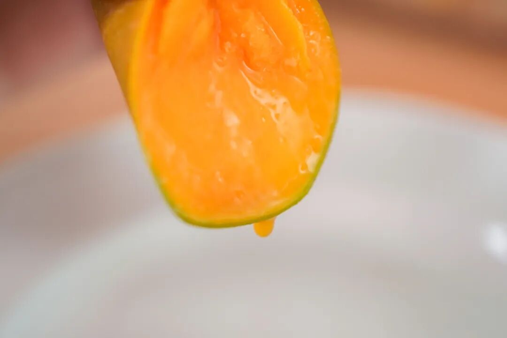

起因是，本薯在海南果园田间地头，

吃得膘肥体壮盆满肚满，

那份树上熟的香甜，

是即使饱记用顺丰陆运的海南红玉，

也只能得其九分的！

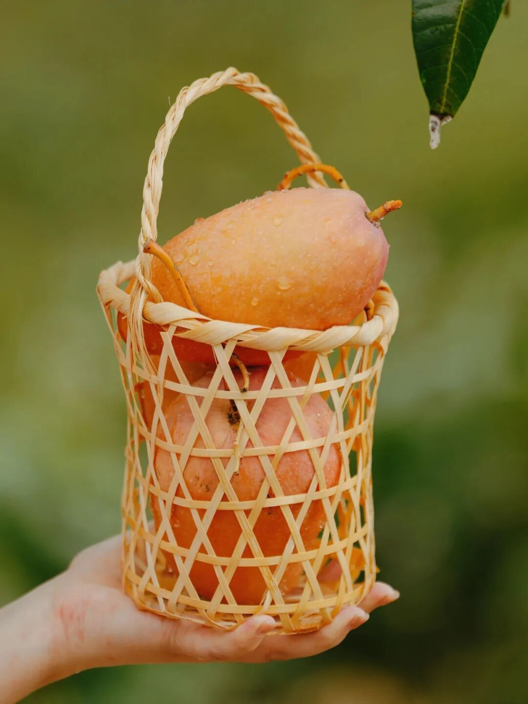

至于网上买的，

本薯试过无数，都是五六分熟就发货

驴粪蛋子外面光外表好看，

里面不熟，只比上海买的好吃点。

但，这样的好处，是绝不会带来

因为熟果运输磕碰的售后！！！

‍

本薯和老板、果园都提了这个问题：

如果做浓缩海南全岛精华的

红玉 + 贵妃

（金煌不要来碰瓷，风味差远了

有没有可能让全国的饱记用户，

吃到真正地头采摘、树上熟的双拼？

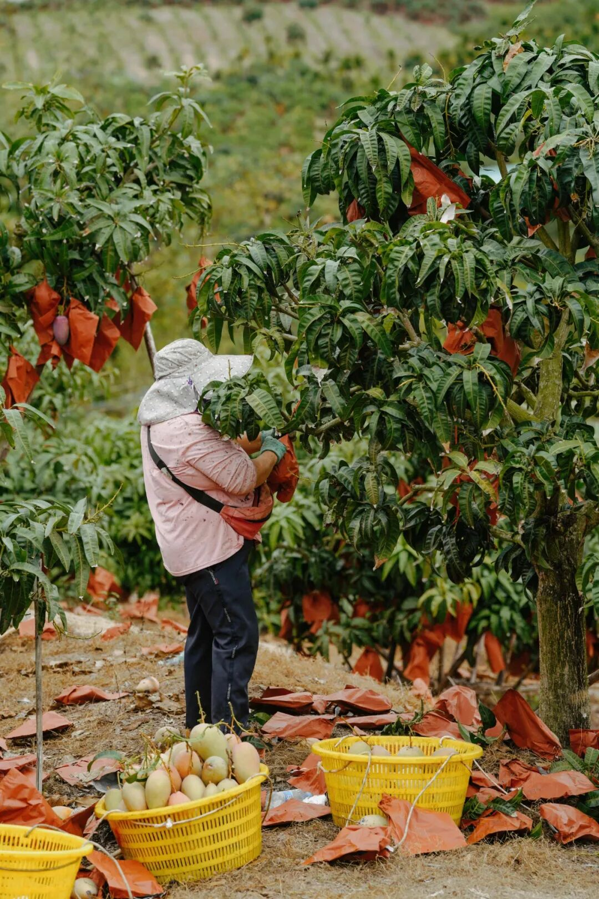

为此，全司在本薯的动员下，

努力了两个月，

终于拿出了这个办法：

按照 2 枚红玉（每枚净重 1.3-1.5 斤）

9 枚贵妃（每枚净重 0.3-0.4 斤）

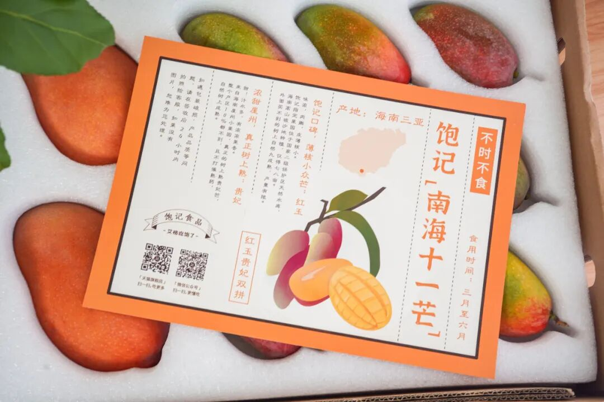

给它定制专属的珍珠棉格子，

果园给严格挑选外观，

只有身长瘦美、黄金比例的

美人芒果才能入选！

当时接受物流测试的本薯朋友收到说：

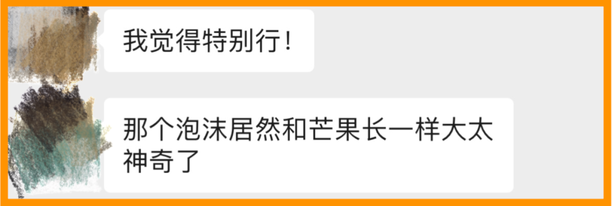

啊不是芒果懂事，

是我们全体都很努力啊～～

除了外观，珍珠棉还能给予芒果最大的保护，

这样，我们就可以采摘果园

95 熟的芒果！！！

也就是说，你吃到的，比本薯只差 5 分！

比饱记好评无数的顺丰陆运红玉芒果，

还高 5 分！！！！

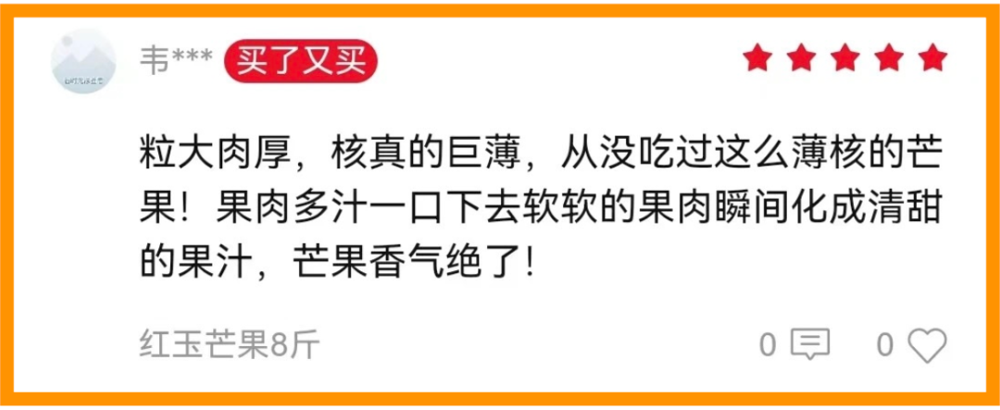

最后了，整盒 5 公斤的南海十一芒，

全部顺丰空运～

我矜贵的饱记用户绝不会失望。

因为我老板说了，

新某记餐厅的芒果，

首先就比不上我司的陆运红玉，

更不用说这盒因为基本完熟，

开箱就香气四溢：

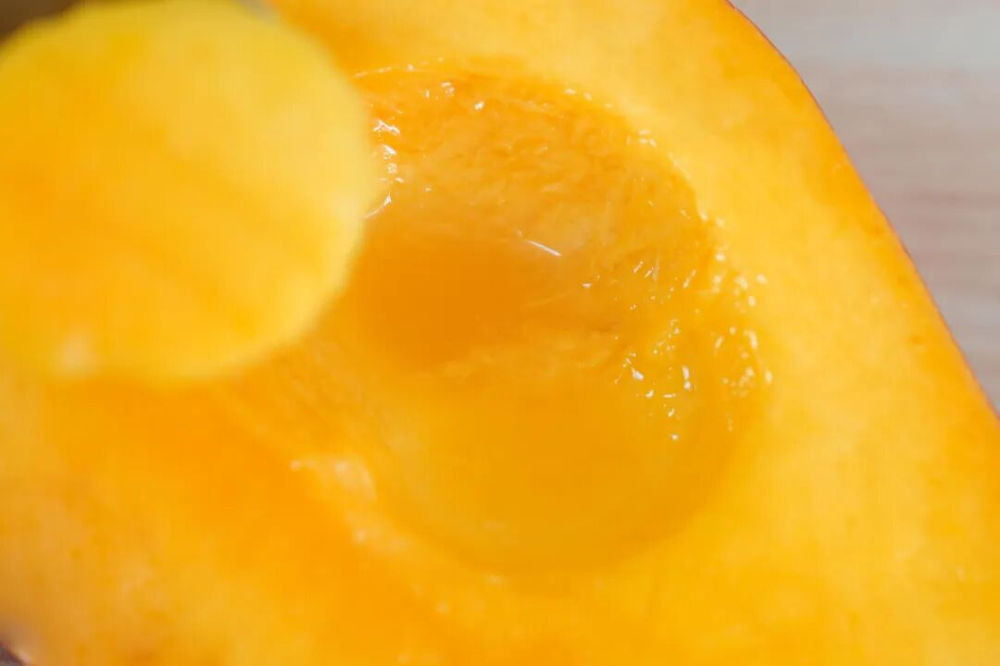

糖度到手就14 和 15:

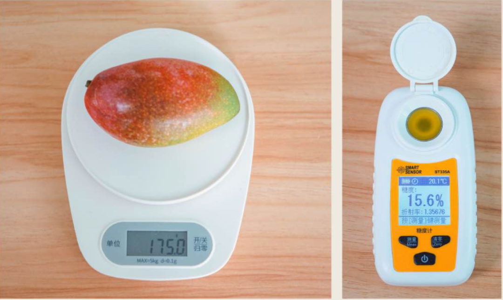

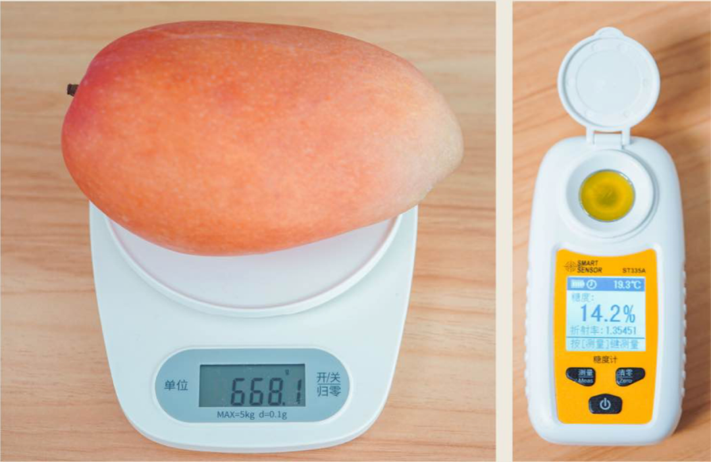

贵妃 2 天后更可达到丧心病狂的 19！！！

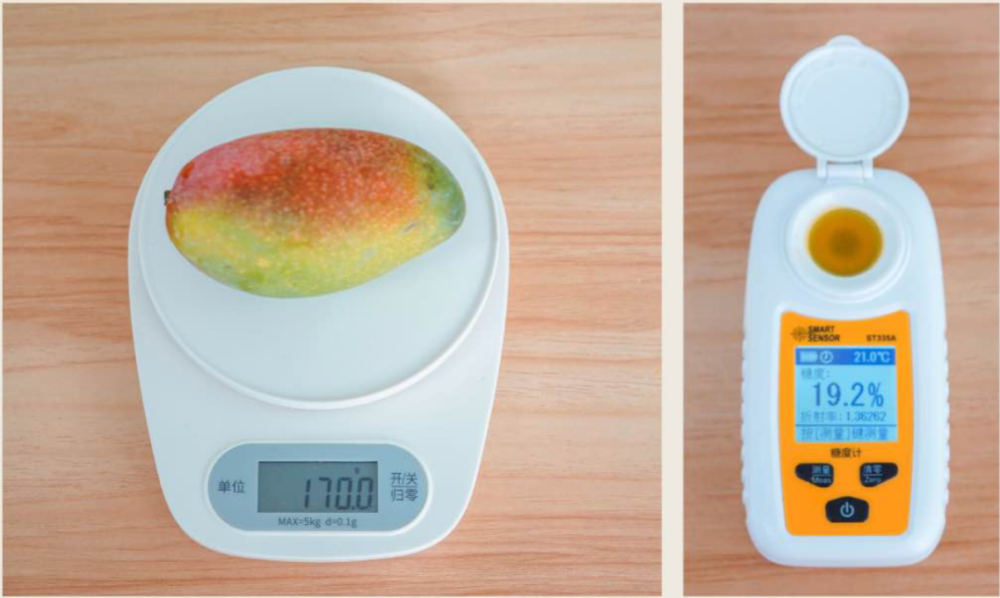

因为基本完熟，

所以绝对不要放冰箱，

常温最多两三天要吃完～

贵妃芒不以颜色判断熟度，

绿的也甜！（抬头看，上面那枚绿 shai 的糖度！！！

就本薯来说，

虽然贵妃放两天更美更甜，

但还是喜欢到手那一刻的浓香！

这是红玉，真的核薄！！！

大家到手就吃，

这一盒南海光风霁月，

请勿辜负！

红玉，照例是我司指定的小果园，

位于国家二级水库，

30 年老树，只用羊肥等天然肥，

在树上挂足 120 天才下树！

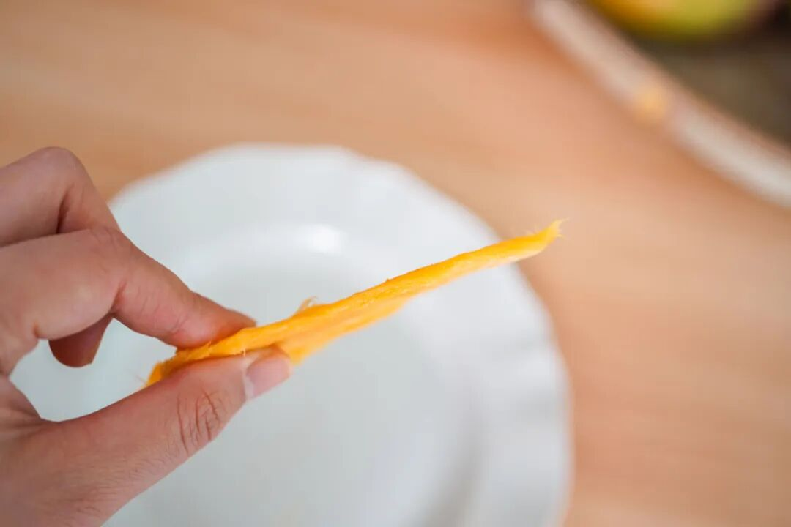

哈哈哈还是红玉的超薄核，这芒果太懂事儿了给你们多看几张

贵妃，来自崖州小果园，

不打催熟药，

因空运 + 人手精挑，

真 · 树上熟贵妃芒。

本薯可以豪气万丈地说，

你试试，有更好的算我老板输！

让她赔你饱记生鲜吃！！！！！

因为前面做箱子物流反复试验熟度

拖得太久，

今年果期只剩 2-3 周了！

大家吃起来～～～～～～

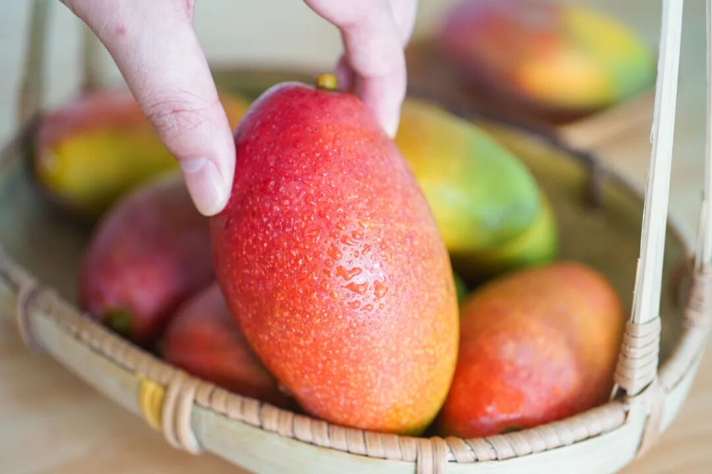

箱子是饱记设计师精心手绘的，

可作送礼使用！

售价需另加 5KG 顺丰全国空运费用，

（但比你直接叫便宜不少。。。。

海南岛内陆运，东北西北地区加邮费，

新疆西藏不发。。。

（这里统一解释下：是全国最靠谱的物流

顺丰不给出单，我们总得让他运。。。。

南海光风霁月

【南海十一芒】早鸟86 折！！！

戳下图

最近 618 折扣

有赞粽子 + 水果全场

86 折！！点它！！！！

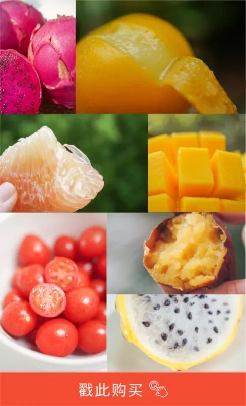

天猫的全体茶包零食，

都是满 300- 50，

相当于 83 折！！！！

有淀粉含量不超过 3.5% 的大肉块午餐肉！！！

微辣很香、30 年老卤出来的无骨鸭掌～

【外面买不到】原创配方的

柚子小种红茶、南乳香葱蛋卷和红楼酒香鸭舌～

由玉米制成、真玉米香的玉米脆浪！

当然还有我饱记销冠王牌黑糖小麻花！！！

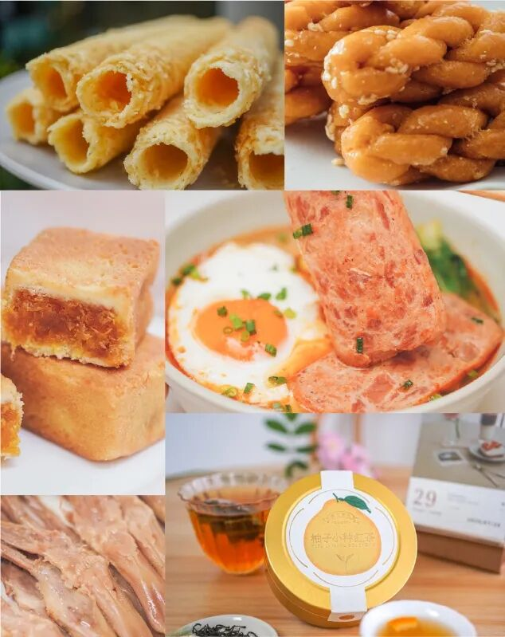

金奖惠明茶和梅家坞龙井茶，

还剩少量，趁这次赶紧冲哦！！

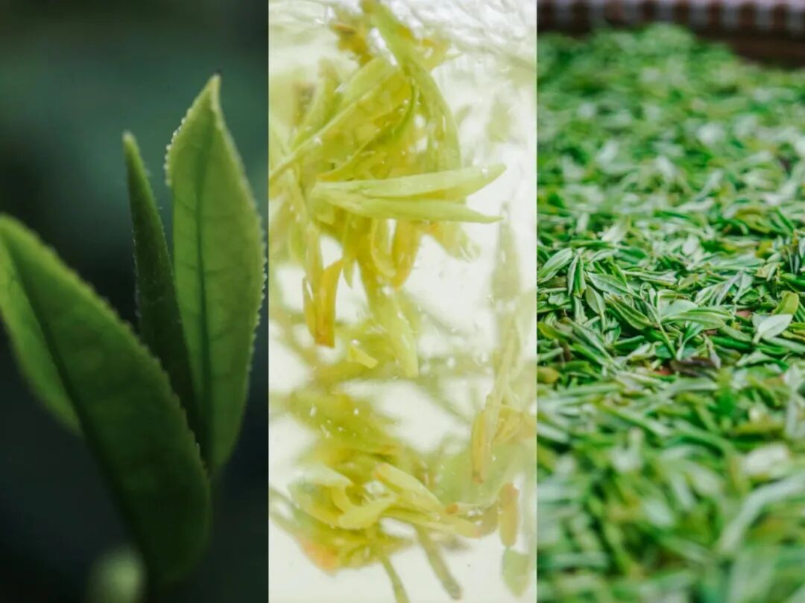

请去 🍑🍑🍑 搜索「艾格吃饱了」

不好意思微信不让贴链接。。。

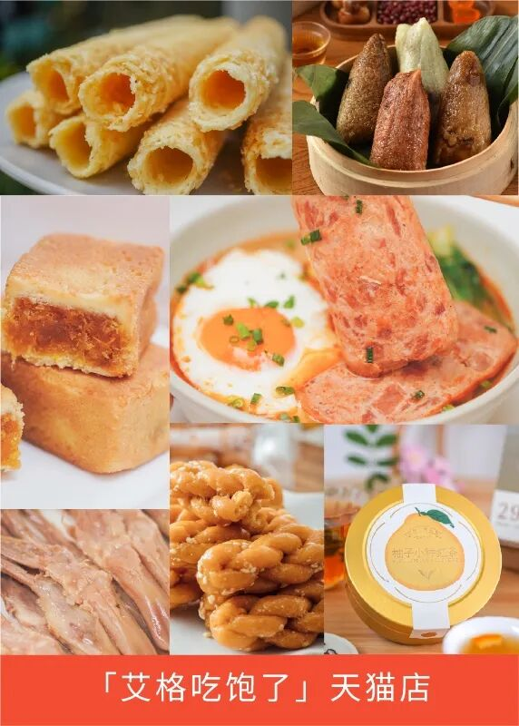

啊想到这样的折扣要断断续续搞一个月，

本薯就觉得这班上得太爽了！！！！！

你们感觉怎么样？

上啥班，给我摸鱼买起来！！！

本文的研究员

薯角我妈辣评：
好吃，多来点！

用好吃的方式吃一生

祖国各地好风物

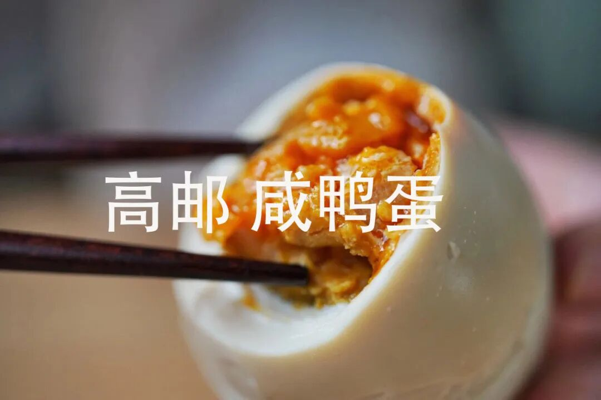

文章转载请加微信「baojiclub」

