# 双十一捡了七个大便宜，真刺激啊

- 原文链接: https://mp.weixin.qq.com/s?__biz=MjM5NTYxODQyMA==&mid=2653460667&idx=1&sn=ec2ac0ff6a0c97397785ac169973dfa0&chksm=bc7940ebf04968618dab394479db6887c56d2f5443ae07d92e9511573bb3900a694706df2417&scene=27#wechat_redirect
- 浏览量: N/A
- 点赞数: N/A
- 评论数: N/A
- 转发数: N/A

## 正文

全年最低价

一个尽情安利自我的公众号

以下是没事干研究院的风物研究报告请放心食用

好早，今年双十一真的好早。
上周抢先购定金预售第一波，

本薯薅着运营同事，

给到销冠三样的

全年最低价，

抢到的今晚可以冲去付尾款了！

没抢到的也没关系，趁今晚 8 点满 300-50，薯角我算了7 个购物车出来，有些东西约等于不要钱，
快来帮我一起把这个公司搬空！！

PS：这里说的不要钱，只是相对于原价来说，指的是天猫大促凑单满减折扣，真正拍下还是会显示支付金额的～
1. 「山核桃不要钱」购物车

这一期一会的山核桃，

想必不用多说。

我司每年此时的必买好物，

打遍天下无敌手。

都是今年刚炒的新货，

数量有限，先到先得。

因为觉得市面上的临安山核桃不行，

十一年前，老板自己也还在打工时，就找到浙江农林大学山核桃研究所一起开发这款山核桃。

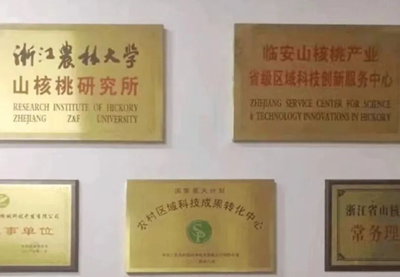

一是超新鲜，都是当季新货。

产品经理严格把每个批次生产日期，控制在最新鲜的 45 天内！

二是农大合作出品，靠谱。

三是调味轻，保留原香：

有人每 100 斤加 4 斤糖就在讲自己好了，我们是 1.5 斤糖。十一年前就这样。

两种选择！

可以买手剥版一颗一颗剥着吃，

又原始又清香！

当然也可以直接上懒人版，

简单省事的山核桃仁，

一把一把往嘴里丢！

再搭着酒香鸭舌一起买。

这鸭舌包邮区肯定爱！

灵感来自《红楼梦》里宝玉喜爱的下酒小菜～

专门盯着南京的厂找，

因为全世界他们最懂鸭子。

最后定的是一家老师傅开的厂，

厂里有一锅 30 多年的老卤！

这个就叫家底儿～

还有好评如流水的

大师凤梨酥！最新一批上周才到货，选的都是新鲜土凤梨馅，
果肉含量大于 40%！
只有 90 天短保质期哦。

以及有大颗肉粒的午餐肉罐头，

用的西式火腿制作工艺，

几乎每个试过的用户都会回购。

劝你现在买最划算，

囤着冬天煮各种锅时总能用上！

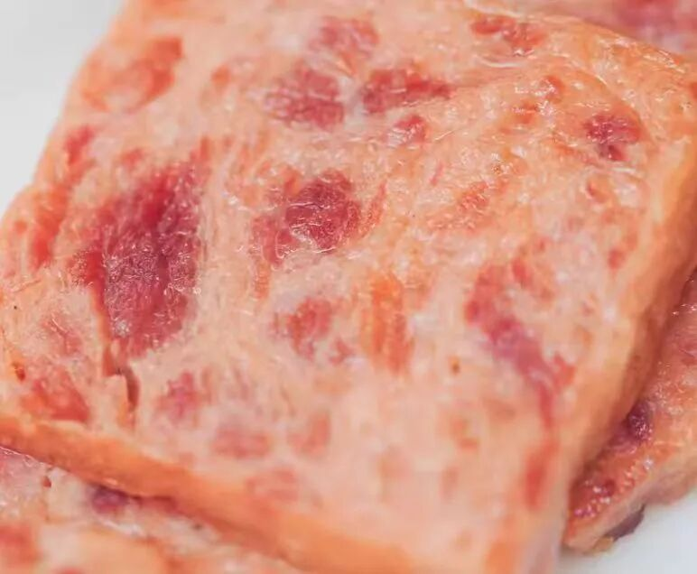

简单明了的优等生作业在此👇

搭配着买山核桃等于白送。

且抄去吧！

2. 「桂花乌龙不要钱」购物车

非常适合秋日的桂花乌龙！

按福州同事的原话，

这茶完全经得起盖碗的考验！

和市面上都是细末的调味茶不是一回事，

必须细细品味！

这茶茶底好得很，翻出家里的盖碗，怎么泡铁观音就怎么泡它。揭盖一闻，哇～桂花的香气完全被激发，直窜入鼻尖！带着一点花的自然甜味～

入口茶汤微稠，舌侧香气余韵不绝，观音茶的回甘源源不断！总之，闻起来是甜的，喝起来却有烤过的醇厚滋味！本当它是办公茶叶，没想到茶底这么好，还耐泡得很！
立即决定囤几罐在家！

再囤上几盒山核桃，

有茶有小点，

几乎是秋日午后的最佳搭配。

免煮酸梅汤，

没有乱七八糟的硫熏和色素，

都是中药房里常见食材，

工工整整码了八味。

适合配辣火锅一起，

三角茶包设计，

既干净卫生，又方便直接冲泡出味～

三款搭着买，

桂花乌龙等于白送👇

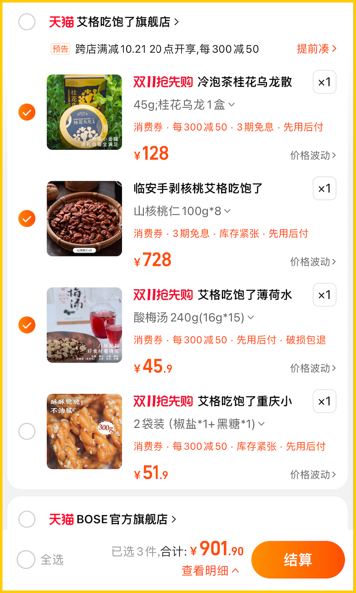

3. 「蒙自小苹果不要钱」购物车

好吃的时令水果，

本薯也时刻放在心上。

这款长得超丑，

但是果味极其浓郁，甚至赢过新疆的蒙自西北勒小苹果！

长在云南红河州，

又称苹果界「溏心公主」，

果味好浓，还多汁皮薄肉脆，不绵，不打蜡，自然全熟发货

爽脆，多汁，除了丑之外没有任何缺点，是新鲜与阳光的苹果本果。

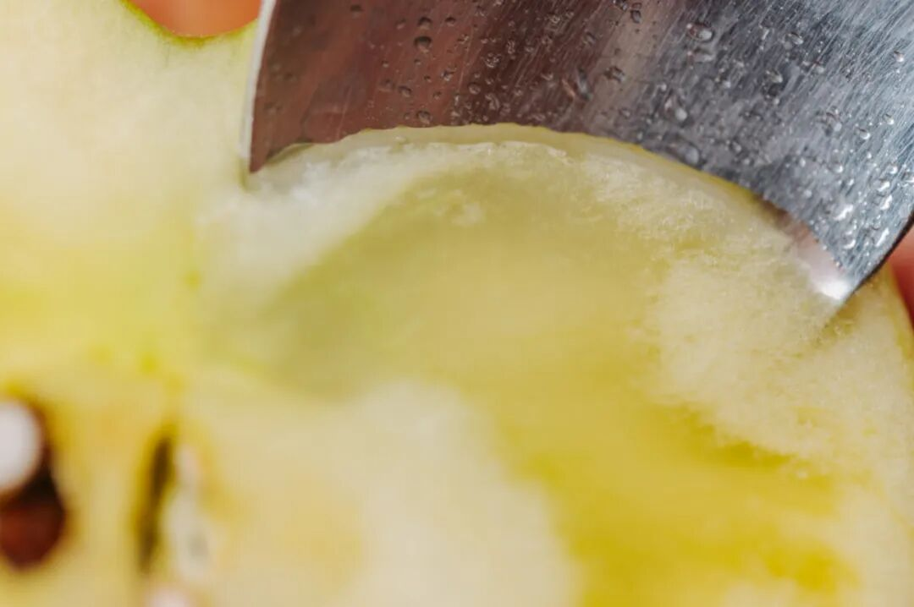

搭这款福建漳州口味的厚切猪肉片，精选福建土猪肉，

配料干净只用鱼露冰糖调味，

现烤般香气扑鼻，

醇香有嚼劲。

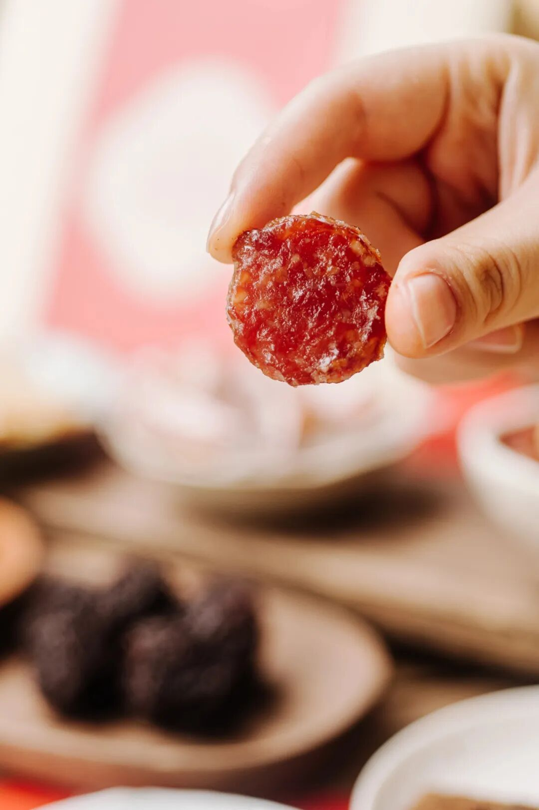

再配上山核桃、大师凤梨酥、桂花乌龙一起买，

优惠满减下来，

约等于蒙自西北勒小苹果不要钱👇

4. 「云南绿籽石榴不要钱」购物车

饱记·云南老树绿籽石榴～

Buff 特别多：云南红沙土 + 30年老树 + 绿籽石榴。说点人话，这品种是个稀奇玩意儿，果味浓的哇，还多汁，我的嘴就是榨汁机本机！

甜度跟突尼斯软籽石榴差不多，

但是果味更浓，且有层次感，

吃完不回涩。

不是我薯角自夸，

看看后台真情实感的好评👇

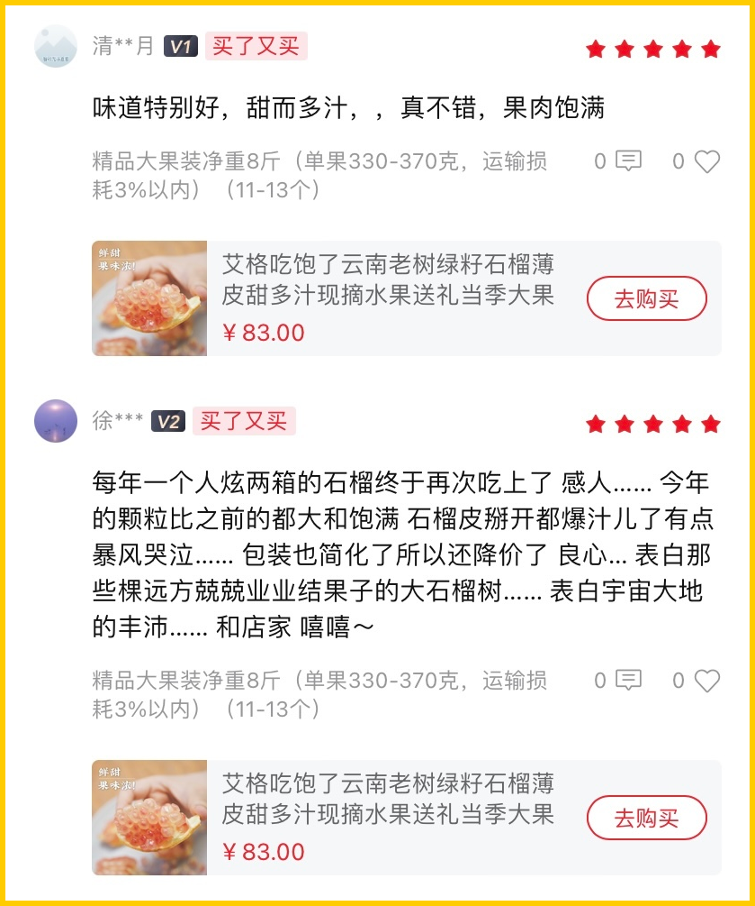

配这个香脆肉纸，

肉含量高达70%，

自从有了它，我就用它替代薯片和猪肉脯，摸鱼想不出稿子的时候，啃几口，香哦，啧这小日子。。。

还有好吃到让我们一个自家做糕点酥类的大厂供应商都好奇的小麻花。重点是酥，脆，甜却不腻口，面粉配比讲究得很，别看就卖你十几块，有功夫在身上的。一定要去买！

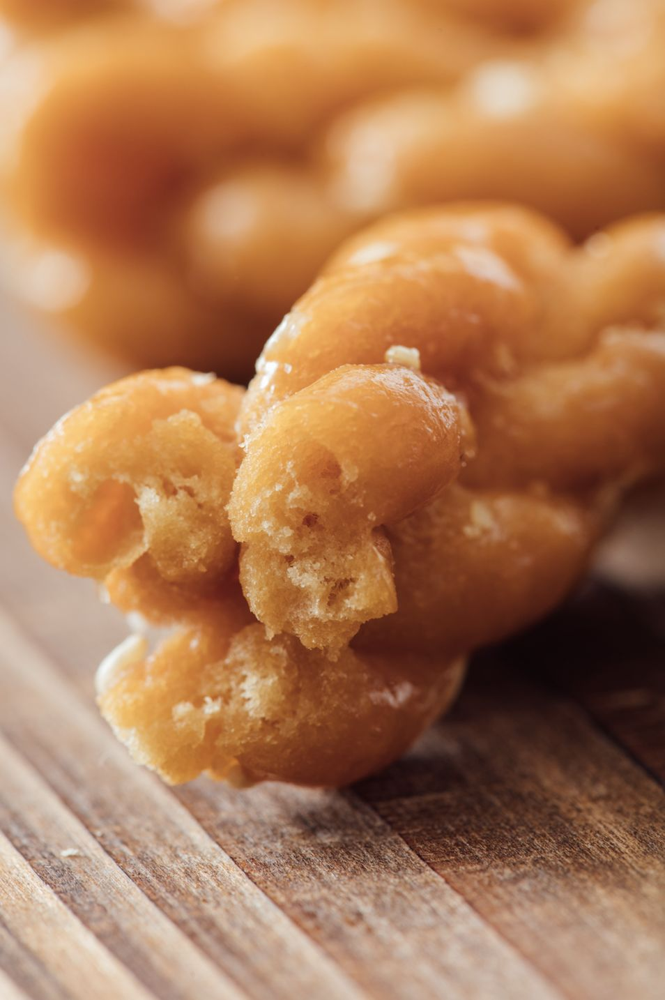

加上我们的老伙计山核桃、桂花乌龙，

以下这个购物车，

8 斤云南老树绿籽石榴不要钱！👇

5. 「柚子小种红茶不要钱」购物车

这款柚子小种红茶，一个字：香。清新柚果香混着茶香，恨不得把它变成室内香薰使！

用的是武夷山的花香小种红茶。传统手工精制，一芽一叶，
自带的鲜叶汁水也更丰富。

泡出来后，远远都能闻到饱满的柚子香气！

你还可以像董洁一样，

（是的它可是上了董洁直播间！

拿出喜欢的杯子品品，

总之优雅永不过时

搭上前面提到的厚切猪肉片、

桂花乌龙、山核桃还有大师凤梨酥，

直接省下一盒柚子小种的钱，薯角我都给你算好了👇

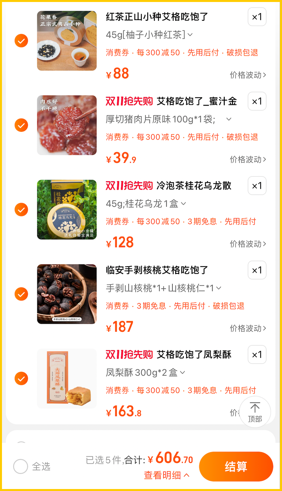

6. 「酥酥蛋卷、黄金柚条不要钱」购物车

正式进入我们的零食囤货环节！

酥酥蛋卷，

香酥，极其香酥，

好吃的秘诀无它，

就是舍得下料，手工制作！

新鲜鸡蛋含量高达 27 %，入口化沙。

强烈推荐一下南乳葱香味！

独家定制的口味，入口葱香浓郁，

然后是南乳的咸香，

味道平衡得刚刚好。

二是这款

广东沙田柚：黄金柚条。

我愿称之为柚子口香糖！

初入口是淡淡的柑橘味，

越嚼越浓烈的柚香直冲大脑，

各种风味在味蕾上瞬间脱缰。

选用高品质沙田柚，

采用低温真空原汁、原糖浸糖工艺制作而成，

柚香十足，回味无穷。

却又不会有柚子蜜饯容易出现的苦味。

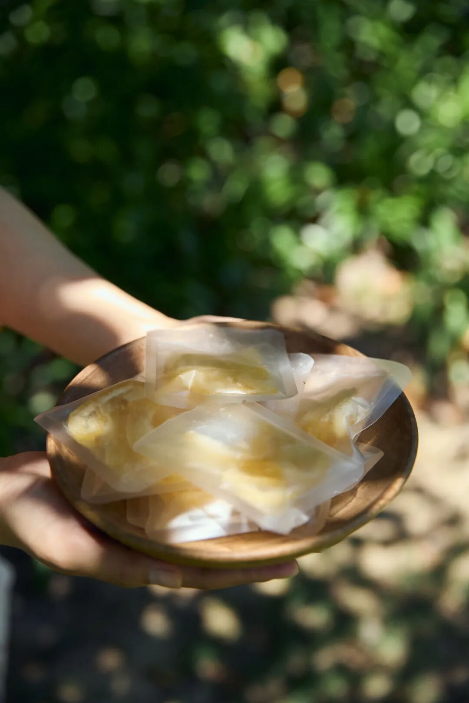

酸酸甜甜的陈皮小话梅，

裹满清香橘子粉：

传统工艺腌制而成，

回味悠长生津。

是小时候爱吃的那种话梅～

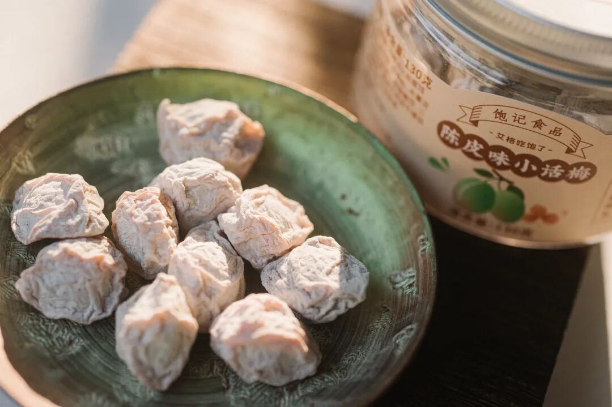

搭配着必吃榜的山核桃一起买，

蛋卷和黄金柚条都不要钱！

爱零食的可以闭眼入！

7. 「两袋麻花不要钱」购物车

前面提到的四川传统小零食：小麻花，进口一级大豆油，特制高筋粉。

一共四个口味：
用手工熬黑糖裹制的黑糖麻花，
用好花椒入味的椒盐麻花，挂着白芝麻的芝麻麻花，撒满海苔粉的咸甜海苔麻花，都不硬不腻不粘牙！

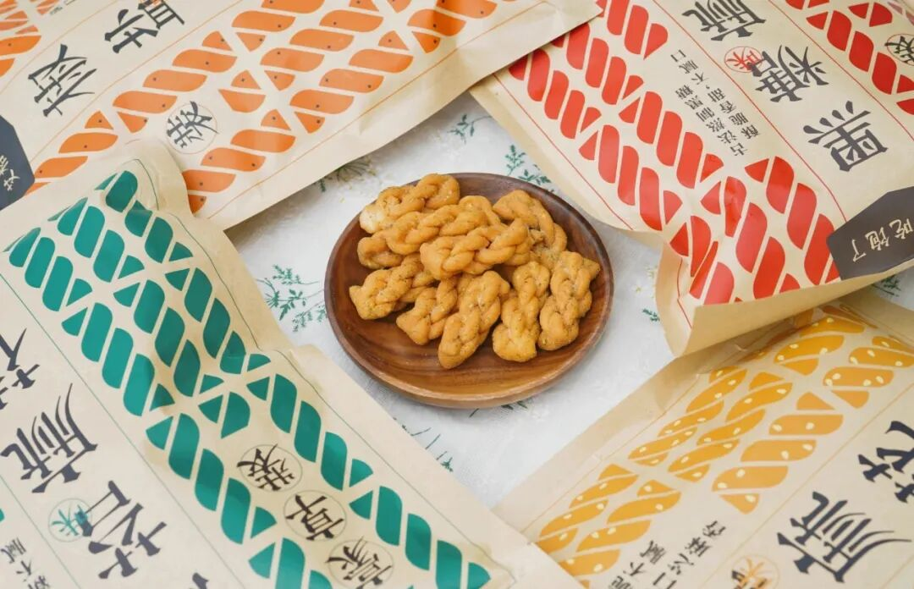

和山核桃、陈皮小话梅一起买，

都是无负担的小零食，

算下来两袋麻花不要钱👇

以上仅为凑单思路参考，价格差不多都可以抄！大家随机应变啊！打开🍑🍑🍑搜索「艾格吃饱了」，还有库尔勒香梨，云南野生菌子可凑单！七个大便宜，不薅白不薅！

题 外

懒得打开淘宝的，以下是本薯的贴心直通车！一出现就断货的金山瓢鸡，

五六个月才能长成一批，

所以每次都数量有限。

本次三种规格，加起来只剩 100 来只，卖完就没！还有卷里卷气的我司腊肠，终于上线！三种口味都是真材实料，做煲仔饭、清蒸或爆炒都好吃。金山瓢鸡和腊肠，今天公众号给到天🐱双十一同价，也是全年地板价！下方戳图片直达！冲！
饱记·云南稀有品种瓢鸡购买方式如下双十一同价 65 折！！

三种规格：

6 月龄公鸡限量 110 只；1 年 10 个月老公鸡限量 57 只；6 月龄母鸡限量 19 只。
下单前请注意：此鸡蛋白质含量丰富，宰杀时已尽量放血，但少量余血开包时气味仍会比较大，请冲洗再食用！鸡皮不发粘，就绝非变质～～～
戳图下单购买👇或🍑🍑🍑搜索「艾格吃饱了」

饱记·手工腊肠购买方式如下👇双十一同价 9 折！！
三款口味，各有各的特点。用的黑猪肉、天然肠衣、玫瑰露酒...酒香腊肠，酒香浓郁，
有四六和二八这两个肥瘦比例可选。
滇式腊肠用了不少贵价的辛香料，同事说超适合拿来做西班牙海鲜饭，
试过加辣肠后升华了。
戳图下单购买👇或🍑🍑🍑搜索「艾格吃饱了」

本文的研究员

薯角先抢为敬

用好吃的方式吃一生

祖国各地好风物

文章转载请加微信「baojiclub」

