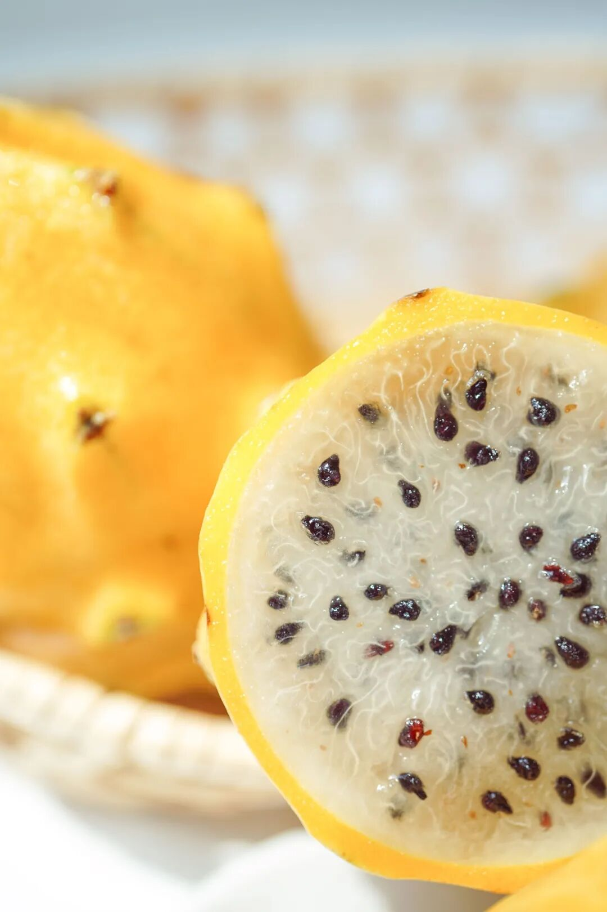
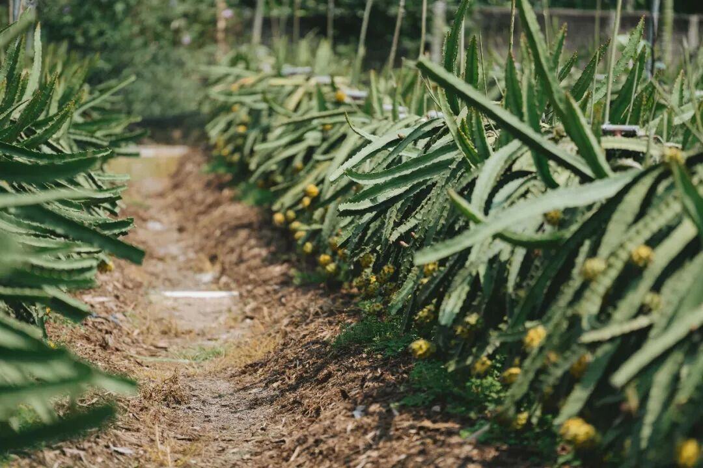
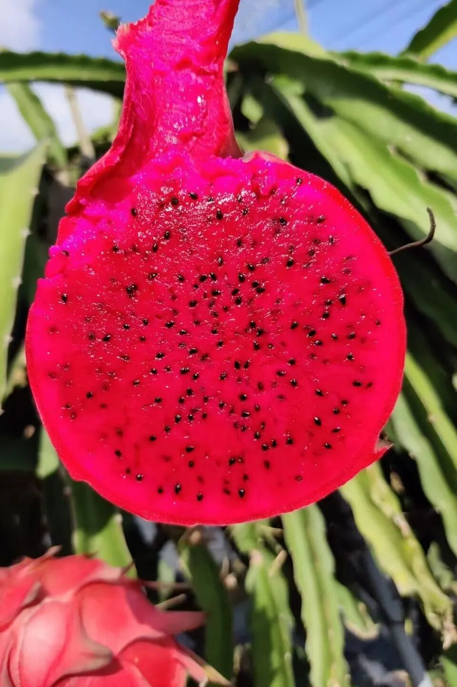
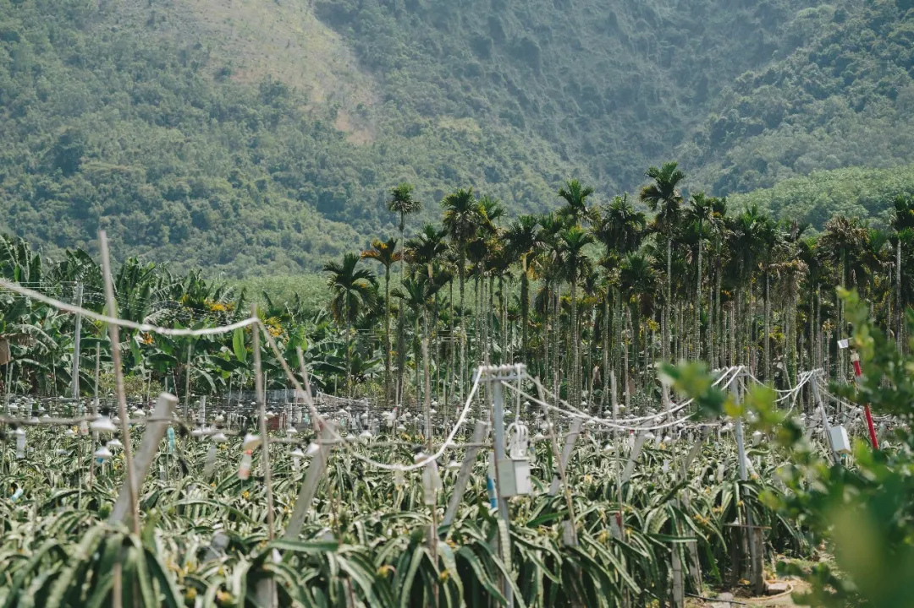
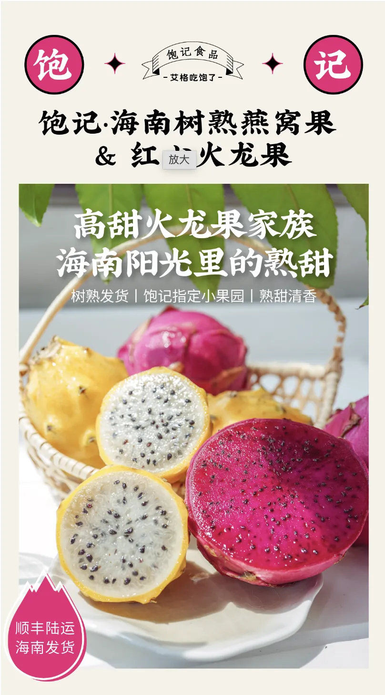
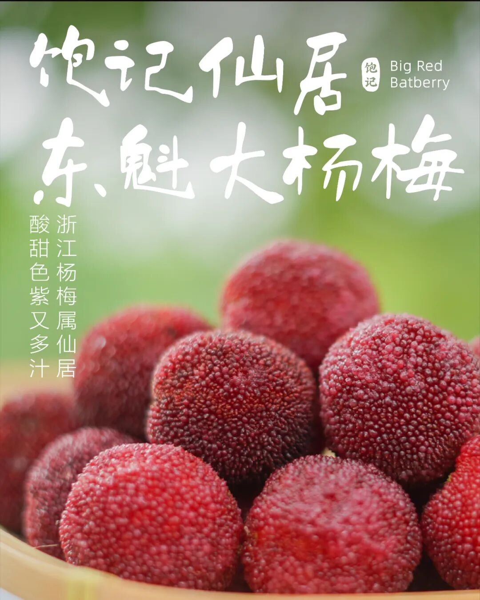

# 吃它，我瘦了 1 斤（应季，有广

- 原文链接: https://mp.weixin.qq.com/s?__biz=MjM5NTYxODQyMA==&mid=2653455268&idx=1&sn=87824b4b3aa33b7c3684dd2376553548&chksm=bcf70f8c2d3cd73b3a3da63972668dbc8f85b9ae628aa46e8b3365cf433bb827a743448c8472&scene=27#wechat_redirect
- 浏览量: N/A
- 点赞数: N/A
- 评论数: N/A
- 转发数: N/A

## 正文

你的电子燕窝已上线

一个尽情安利自我的公众号

以下是没事干研究院的风物研究报告请放心食用

在这司上班，多少是有点风险在的：吃不过来，真吃不过来！！一旁的摄影师同事边拍边发言：你知道我来这之前多少斤嘛？？

这让本薯不禁想重新抄一抄讲一讲！曾于我司风靡一时的两位「减肥圣果」！（没有科学依据🙏只是，呃，你懂的看似平平无奇，实则深藏不露！光看图：就这？
真正拿到手：怎么这么厉害！总之主打一个：不吃不知道，一吃吓一跳

（多重意义上的吓一跳

喏，先说这个稀奇货，长得像佛头似的的燕窝果，老家在南美的厄瓜多尔，近几年才开始在海南种植。

面苦心甜，
长得刺人，其实甜度高得吓人！！（你这为人处事很不讨喜呀我说～

虽然外表猎奇，但口感甚好，尝起来像滑嫩嫩的燕窝，入口有冰糖甜味～（本薯觉得有点像荔枝的香甜感

比起常规的火龙果，更上一层楼。

之所以没有大面子推广开来，单纯因为非常难种，损耗率极高！

我饱记给大家找到的这家生态小果园，
产量也极其有限，卖完就没啦！

就这么些！吃完就没！
再到这个红艳艳的、高饱和的海南红心火龙果！一开始，本薯对老板的选择是不屑一顾的：啊？这我们家楼下也有啊？尝一口：嚯～也是没想到火龙果还能这么糯甜！！糖度居然也有 20 以上啊啊啊～（老板：呵呵

原来它是非常规商超进口货，
纯正海南树上熟！

产自我司冲到海南实地考察，跑遍几个山头卷出来的小产地生态高山果园！

为啥要强调这一点呢，因为你在超市常见的进口火龙果往往五分熟就摘了，经历长途运输，再上架喷水。

而我饱记的这颗海南红心火龙果，九分树熟鲜采发货。特点是叶薄皮皱，（这是树熟独特的标志，不是不新鲜哈!且是高山生态种植，

入口水分好足！强烈建议大家买它一买，尝上一尝！仙品！

不过大家知道的，火龙果嘛，膳食纤维含量高得吓人。请看专业文献👇
火龙果是一种热带水果，含有一般水果少有的植物性白蛋白及花青素，丰富的维生素和水溶性膳食纤维,因此又被誉为长寿果。火龙果还是一种低能量、高纤维水果，其水溶性膳食纤维含量十分丰富，具有很好的减肥、降低胆固醇、润肠作用。高血脂患者及便秘的人可常食用。文献来源：《心血管病防治知识》 · 2010年第4期81-81,共1页
所以这俩的 CP 名就叫：打工人王炸组合hhhh,原因不多展开了！
你们自行想象！我看所有上班族以及久坐不动的开车族，以及家里有老人的！都应该买回去，调理一番！

不过我看也有网友提醒，「千万不要全家一起吃」！好有道理！建议采纳！

饱记·高甜火龙果家族购买方式如下9 折！！限时 3 天！

打工人你我，惺惺相惜！上班族之间，互帮互助！薯角我先瘦了一步，不忘跟老板薅来一个福利，9 折！！限时 3 天！！（拿来吧你！
膳食纤维小能手！打工人王炸组合！！！
高甜火龙果家族！饱记指定小果园，海南阳光里养出来的熟甜！
戳图下单购买👇

题 外

如果你不喜欢其貌不扬的火龙果！没有关系！看看我司官方门面：仙居东魁大杨梅！增城荔枝：桂味、糯米糍、仙进奉！
（怎么这名字都雅了这么多？？实力与美貌兼备！都是应季的好滋味！
饱记·仙居东魁杨梅购买方式如下👇9 折！！！！
共有四种规格：优质大杨梅，单枚在 23-29g，两种重量可选，颗粒包装，2.3 斤装，共计 45 枚；4.6斤装，共计 90 枚。首次尝试充氮气调包装！更大程度锁住新鲜！甄选顶梅，6 斤篮装，个头稍小，但早熟、风味浓，很受喜欢。特大杨梅王，市面稀有、比乒乓球还大，每棵树上就一两颗左右，量少，2.7斤装，共计36枚，单枚在 35g 以上。
下单后 5 天内发！但如果下雨天不发货～

戳图买它！！！👇

饱记·增城荔枝购买方式如下
一骑红尘妃子笑，说的就是增城！自古以来的岭南荔枝名产地～桂味、糯米糍和仙进奉，3 个品种，都是 3 斤装，小家庭吃吃正适合！
桂味、糯米糍，下单后 5 天内发，仙进奉，7.1 开始按顺序发货～
饱记多年合作果园，只让有经验的老农采摘，只选树上熟！甜度高！滋味更饱满！
缺点就是贵！！今年因为天气原因，再加上本就是小年，价格直接翻了一倍。。。

虽说贵得有些道理吧～

但还是觉得好贵！！

戳图即可购买👇

本文的研究员

薯角

识食物者为俊杰

用好吃的方式吃一生

祖国各地好风物

文章转载请加微信「baojiclub」

