# 吃完这枚东山白玉，才感觉其它都是将就。

- 原文链接: https://mp.weixin.qq.com/s?__biz=MjM5NTYxODQyMA==&mid=2653452687&idx=1&sn=c41b7de31d208485ef4ef04470acd7ad&chksm=bc7c1767f90ac673b0e474c75a2fa520d45c833eb4865d7b3f7c64c6057242910170b5c574f7&scene=27#wechat_redirect
- 浏览量: N/A
- 点赞数: N/A
- 评论数: N/A
- 转发数: N/A

## 正文

枇杷界的小精灵

尽量安利自我的公众号以下是没事干研究院的枇杷产地报告请放心食用
据说每年都被狂问：东山白玉枇杷什么时候来？？？

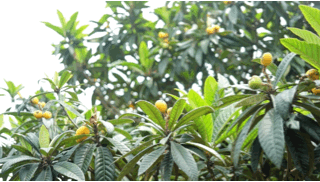

但无论小红书上怎么喊怎么卖。。（今年红书卖家还众口一词说什么大丰收大减价？？？饱记都要熬到五月下旬才发货！！！

我司包邮区的同事众口一词：以前觉得东山白玉名气大，但市面买来也不过如此。。。直到吃上饱记的，才知道？？？哇真的名 不 虚 传！！！！

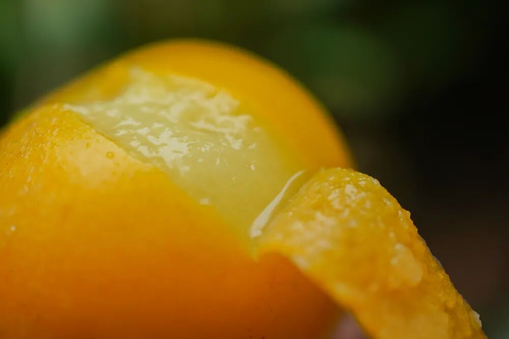

连一位苏州同事都说，比她爸辛苦从果园买来的好吃！！！

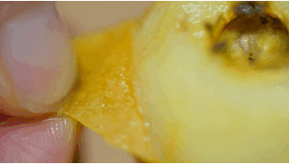

饱记的东山白玉老树枇杷，第一，甜，浓甜。饱记承诺糖度在 12 以上。一般我们选无雨的日子发货，很多都在 13、14 以上！

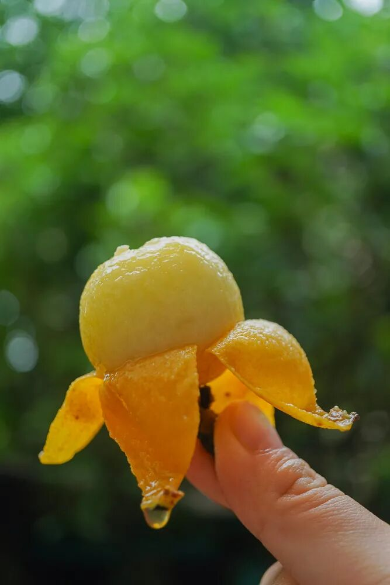

第二就是果味浓，多汁，而且带着浓郁的鲜灵感！这是外面随手买的枇杷（随便他们怎么讲是正宗东山白玉都没有的～～～

白玉枇杷到处有卖，为什么我饱记的值得等？

我来给你掰掰！
原因一：苏州枇杷数东山

东山枇杷，

因其得天独厚的自然地理条件

苏州人本来就觉得更好。

原因二：东山枇杷，又以山坡为佳

枇杷园产区还分山坡上与山脚下，

饱记只选山坡传统枇杷园。

它们产量更低，仅有固定的约两千亩

苏州当地称山脚下的平地果园为「池塘枇杷」

是填平原来鱼塘而改，

数量十倍山上甚至更多，

但土质、阳光、树龄都远远不及山坡果园。

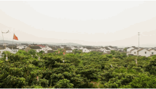

原因三：东山枇杷数双湾，

只给老客户，饱记第六年！

双湾村又是整个东山

最闻名遐迩的产区。

每年水果商贩都大量往村里跑，

但全村这一点点产量，

都给到了老客户，

饱记已是第六年！

原因四：老树枇杷才好吃！

饱记只用 20 年树龄以上的老树！

叠加原因一二三。。。

我饱记的东山枇杷品质，

确实苏州人都不一定买得到！

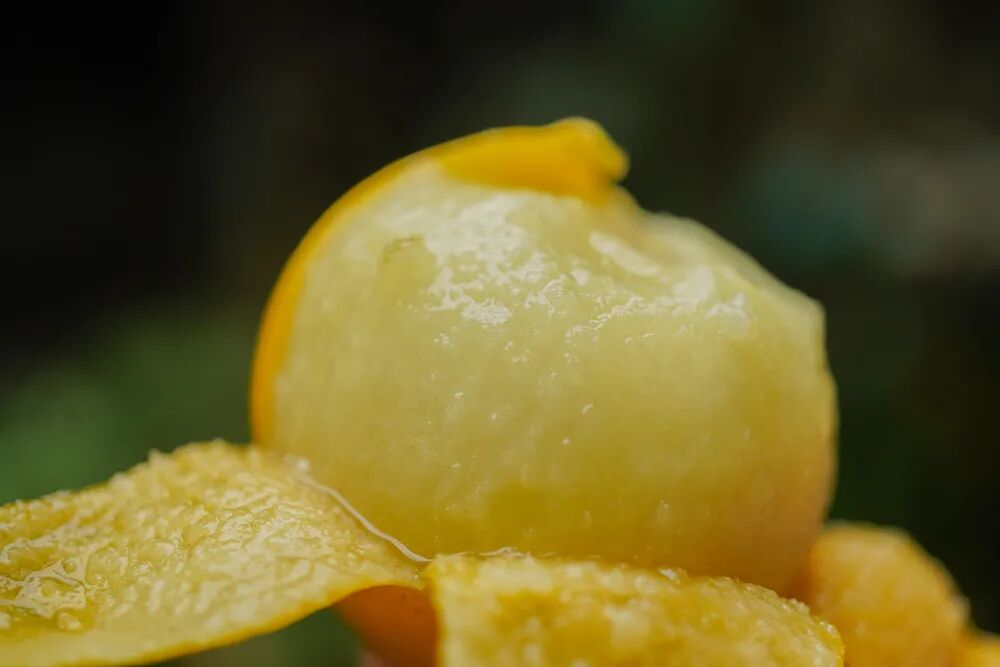

好了。不多说。今年准备了 3 个规格：中果尝鲜，大果满足，特大王炸！

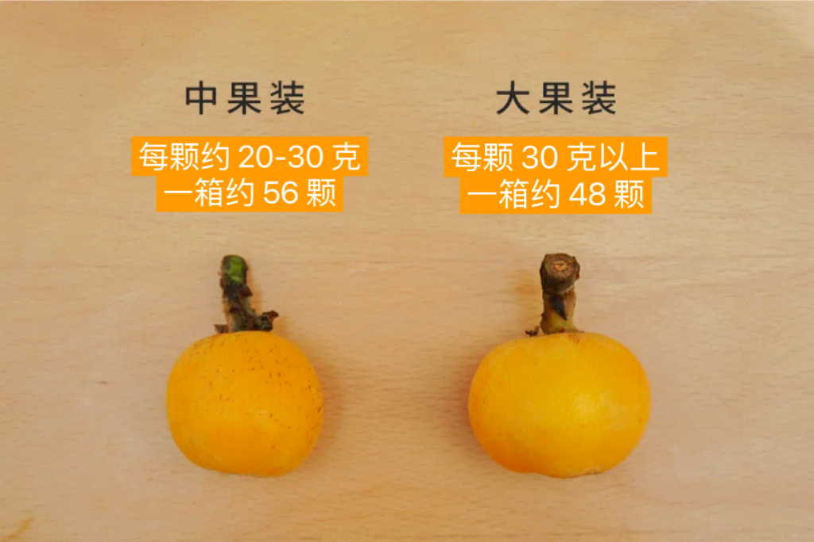

特大果 38 克以上，一箱约 36 颗。我翻了下我司资料居然没拍？行了今年到手拍，这公司真的没我不行。。。每箱称重净重 3 斤± 0.2 斤，一颗颗都给你放在这种格子里。
如果格子没满，不是没装满，是净重已达！

最近苏州在下大雨，枇杷味淡。
饱记绝不发货！目前预售，5 月 25 日起，够甜了，开始发第一批货！介意勿拍！

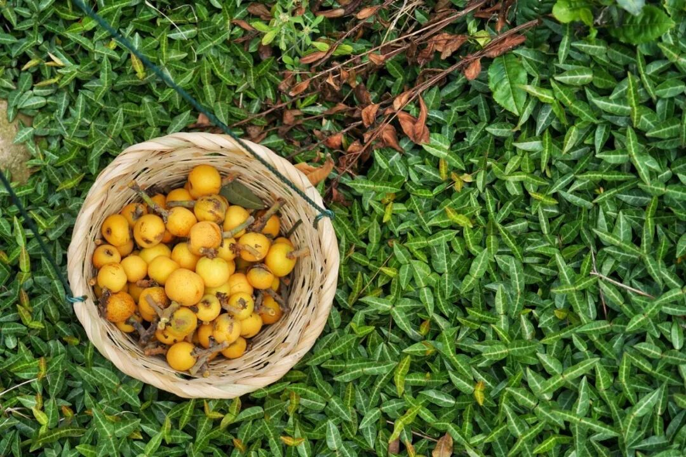

最后讲一下存储：饱记照例要求按熟度阶梯发货。
最熟的，像这样颜色深黄，到手就吃！

不要多洗，剥皮就吃！枇杷沾水味道会淡！！

熟枇杷到手就吃，最多放一天。其它在避光常温（摄氏 15-23 度）通风处保存，整箱 3-4 天吃完！！！
如果表面还有小绒毛，不是发霉，是枇杷本身的哦～

有一些枇杷表面会有褐色斑点，这叫日晒斑。是糖分累积的表现，只会更加甜！不售后～～～～～

行了行了，我就看不惯这么努力。。。
买起来！！！！

我照例给你们早鸟价 86 折！！！戳下图购买！
预售 25 日发货，顺丰快递，邮费实付～

1. 不能下单的，是因为太远苏州顺丰快递不保时效不给打单。。。2. 预售关系，只上有赞。3. 有尊贵顾客爸爸想要发境外的，私聊客服，顺丰能到的地方都行，国内外都行！
（其它水果不行，因为我饱记合作枇杷果园有出口资质

用好吃的方式吃一生

祖国各地好风物

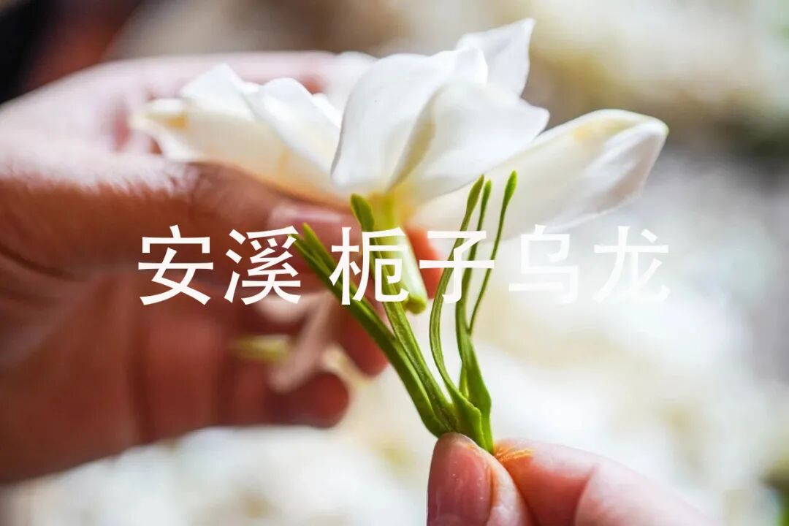

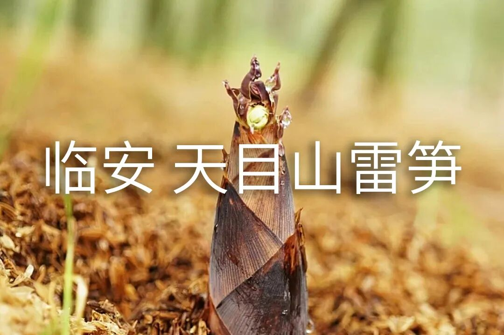

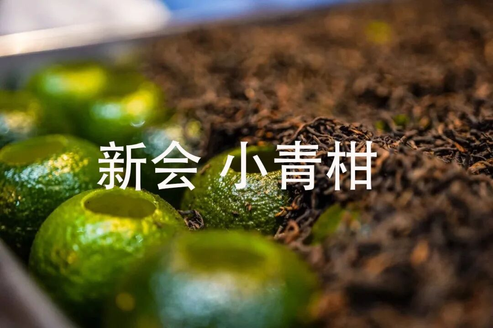

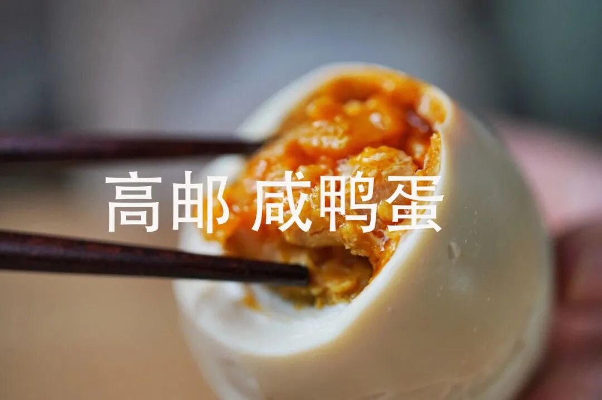

文章转载请加微信「baojiclub」

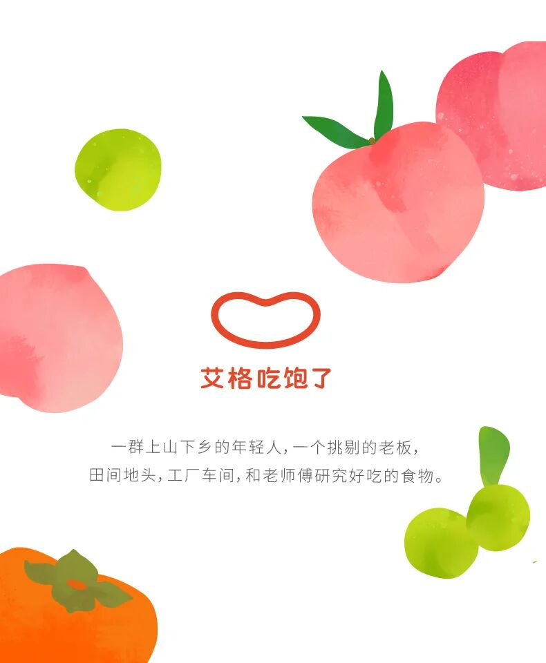

n