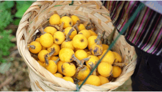
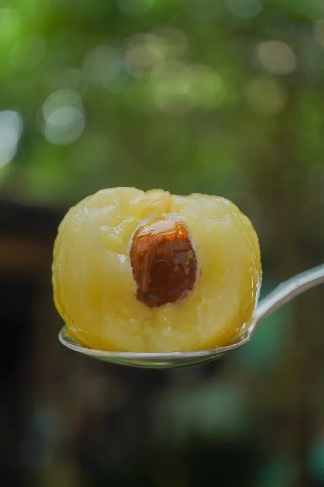
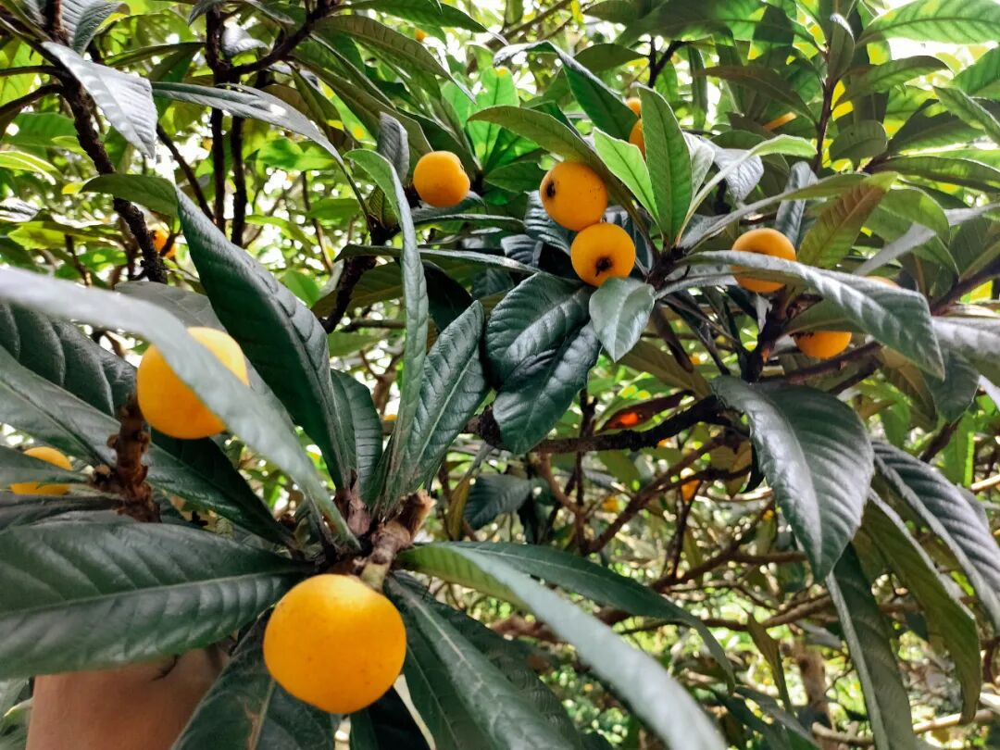
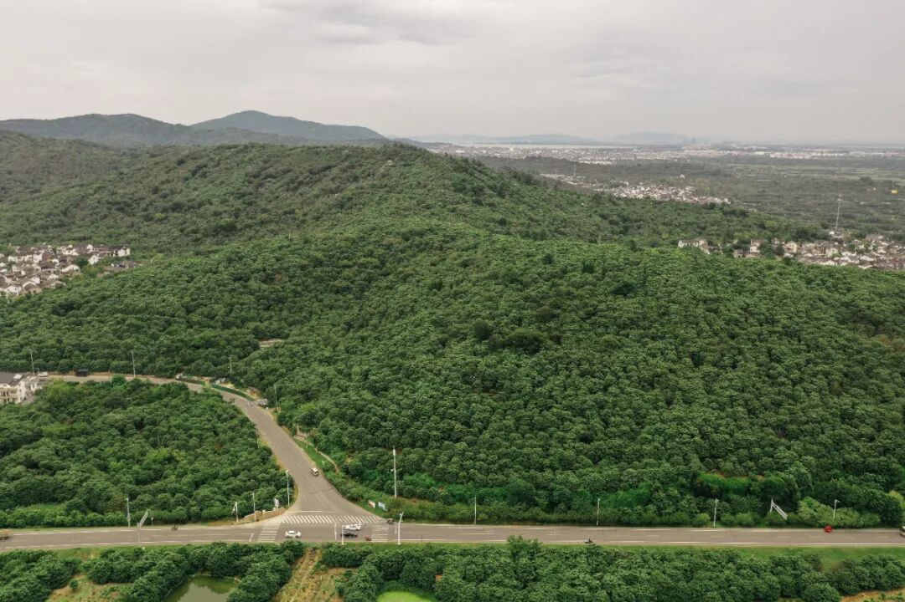

# 吃完这枚东山白玉，才感觉其它都是将就。。。

- 原文链接: https://mp.weixin.qq.com/s?__biz=MjM5NTYxODQyMA==&mid=2653470991&idx=1&sn=e6342e45fa49ddc547b0ce3f365ae5b5&chksm=bcf1b731272d49200734f814827407fd0e6faf90671b81de026772c15baa7a6c59672f7a940f&scene=27#wechat_redirect
- 浏览量: N/A
- 点赞数: N/A
- 评论数: N/A
- 转发数: N/A

## 正文

枇杷界的小精灵

一个尽情安利自我的公众号

以下是没事干研究院的风物研究报告请放心食用
后台被追问的苏州白玉枇杷，今年份的终于可以上啦！！（一盼就是一整年先说缺点：果期极短，每年就吃这么一小阵子，老客人可以直接拉到底部下单

以前觉得东山白玉名气大，市面上买来也不过如此。。。直到吃上我饱记的，才知道？？？哇真的名 不 虚 传！！！！

饱记的东山白玉老树枇杷，第一，甜，浓甜。饱记承诺糖度在 12 以上。一般我们选无雨的日子发货，很多都在 13、14 以上！

第二就是果味浓，多汁！而且带着浓郁的鲜灵感！这是外面随手买的枇杷（随便他们怎么讲是正宗东山白玉都没有的～～～

今年果园减产，果子普遍偏小一些，最小的中果规格，果味最鲜浓！送人的话特大果则包体面！PS：25g+的特大果是果园独家留给我司的，产量极为有限，再往后几天可能就没了～珍惜！

白玉枇杷到处有卖，为什么我饱记的值得等？

接下来本薯来给你掰掰！
原因一：苏州枇杷数东山

东山枇杷，

因其得天独厚的自然地理条件

苏州人本来就觉得更好。

原因二：东山枇杷，又以山坡为佳

枇杷园产区还分山坡上与山脚下，

饱记只选山坡传统枇杷园。

它们产量更低，仅有固定的约两千亩

苏州当地称山脚下的平地果园为「池塘枇杷」，

是填平鱼塘而改，

数量十倍山上甚至更多，

但土质、阳光、树龄都远远不及山坡果园。

原因三：东山枇杷数双湾，

只给老客户，饱记第六年！

双湾村又是整个东山

最闻名遐迩的产区。

每年水果商贩都大量往村里跑，

但全村这一点点产量，

都给到了老客户，

饱记已是第七年！

原因四：老树枇杷才好吃！

饱记只用 20 年树龄以上的老树！

叠加原因一二三。。。

我饱记的东山枇杷品质，

确实苏州人都不一定买得到！

好了。不多说。今年准备了 3 个规格：中果尝鲜，大果满足，特大送礼最佳！再强调一下，今年减产果子普遍比往年小，但风味不减哦～～

每箱称重净重 1400g±100g，一颗颗都给你放在这种格子里。
如果格子没满，不是没装满，是净重已达！

最后讲一下存储：饱记照例要求按熟度阶梯发货。
最熟的，像这样颜色深黄，到手就吃！

不要多洗，剥皮就吃！枇杷沾水味道会淡！！

熟枇杷到手就吃，最多放一天。其它在避光常温（摄氏 15-23 度）通风处保存，
整箱 3-4 天吃完！！！如果表面还有小绒毛，不是发霉，是枇杷本身的哦～

有一些枇杷表面会有褐色斑点，这叫日晒斑。是糖分累积的表现，只会更加甜！不售后～～～～～

行了行了，为了让大家早点吃上，本薯真是太努力了。。。老规矩限时早鸟 86 折！总之，果子越小越浓甜！果子越大越饱满！大家按需挑选抓紧吃！

饱记·苏州东山白玉枇杷

购买方式如下

限时早鸟 86 折！！

戳图购买👇

题 外

朋友们！！！

天🐱618开始了！

我司🍑平台全场 85 折！大家速冲！

但如果你懒得去🍑下单，

以下为我司小🍊序直通车！

今年的饱记粽子！限时吃粽 88 折！这周刚上的海南椰子鸡，限时闪购 7 天！早鸟 86 折！突然熟了的云南西红柿，小时候阳光里长大的浓郁番茄味儿，
限时早鸟 86 折！！

还有些只有最近这一阵可吃的水果👇

拿过上海金奖的金山小皇冠西瓜，

爆汁清甜还有瓜鲜味！

也拿过上海金奖的金山小番茄，

难得回归的泰国超甜多汁金柚，

瓜肉软糯的翡翠冰淇淋甜瓜，

无渣不麻嘴的海南金钻凤梨，

连盐水都不用泡。

卷中卷红玉芒果，

娇艳可人的雷州木瓜，

现在也有限时 86 折！

饱记·口碑湖州大粽预售中

现货中！！！

限时吃粽 88 折！！！！

戳图买它👇

饱记·海南椰子鸡

限时早鸟 86 折！！！

限时闪购 7 天！

预计 5.23 发货

戳图买它👇

饱记·金山小皇冠西瓜

购买方式如下

限时早鸟 86 折！！！！

戳图买它👇

饱记·云南西红柿

购买方式如下

限时早鸟 86 折！！

戳图购买👇

饱记·多汁泰国金柚

购买方式如下

限时吃水果 86 折！！

戳图购买👇

饱记·金山五彩小番茄购买方式如下限时 86 折！！
戳图购买👇

饱记·翡翠冰淇淋甜瓜购买方式如下限时吃水果 86 折！！
戳图购买👇

饱记·花香脆甜蓝莓购买方式如下限时吃水果 86 折！！
戳图购买👇

饱记·海南金钻凤梨

购买方式如下

限时吃水果 86 折！！

戳图购买👇

饱记·海南红玉芒果购买方式如下限时吃水果 86 折！！！
戳图购买👇

饱记·湛江雷州木瓜

购买方式如下

限时吃水果 86 折！！

戳图购买👇

本文的研究员

薯角我想我知道夏天的味道

用好吃的方式吃一生

祖国各地好风物

文章转载请加微信「baojiclub」

