# 吃着吃着，就到了尾声

- 原文链接: https://mp.weixin.qq.com/s?__biz=MjM5NTYxODQyMA==&mid=2653459581&idx=1&sn=6ecceeffc0e90b25199291df5e4e4acd&chksm=bcb14fba2f962303d9e41f687eedc6f7bf20d393ee25279388f37e0452a07b89965529446ff1&scene=27#wechat_redirect
- 浏览量: N/A
- 点赞数: N/A
- 评论数: N/A
- 转发数: N/A

## 正文

挥手自兹去

一个尽情安利自我的公众号

以下是没事干研究院的风物研究报告请放心食用

伤春悲秋，

乃人类之通病。

眼瞧着十月将近，

薯角我近来也有些感怀，

只因一些好吃的，

嗖一下又到了尾声🥹

靠天吃饭的好东西，

这回下架，

再见就不知道何时了，

大家抓紧时间吃吧！

先说这个晶莹剔透的奶绿宝石，被香甜到眩晕。。。呵呵这绝对是工伤！

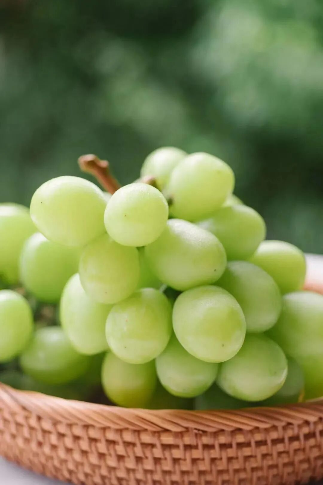

来自多年合作的上海马陆铜奖果园。

几乎没有涩味，

而且有很好的玫瑰的香气。

遥想 40 多年前，“葡萄不能过长江”，还是南方果业的共识。而马陆葡萄，率先打破了这个壁垒。

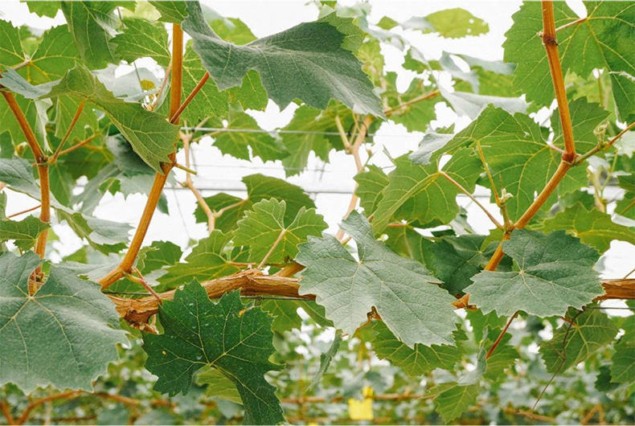

靠的就是厉害的科学技术。什么品种多元化啦、果穗套袋啦、控产栽培啦，一套一套都给安排上。

我们把新疆和云南产区都看过了一遍，

种植管理都跟不上上海。

尤其是新疆，

主打一个得天独厚的美艳。

但种植管理不好的葡萄，

后味都会发涩。

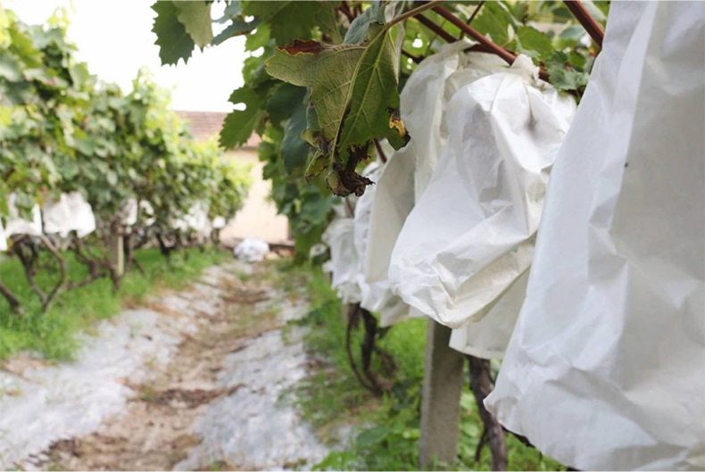

而马陆的阳光玫瑰，

皮薄多汁，

爽脆又清新，

口感一级棒，

基本上是全国的天花板👍

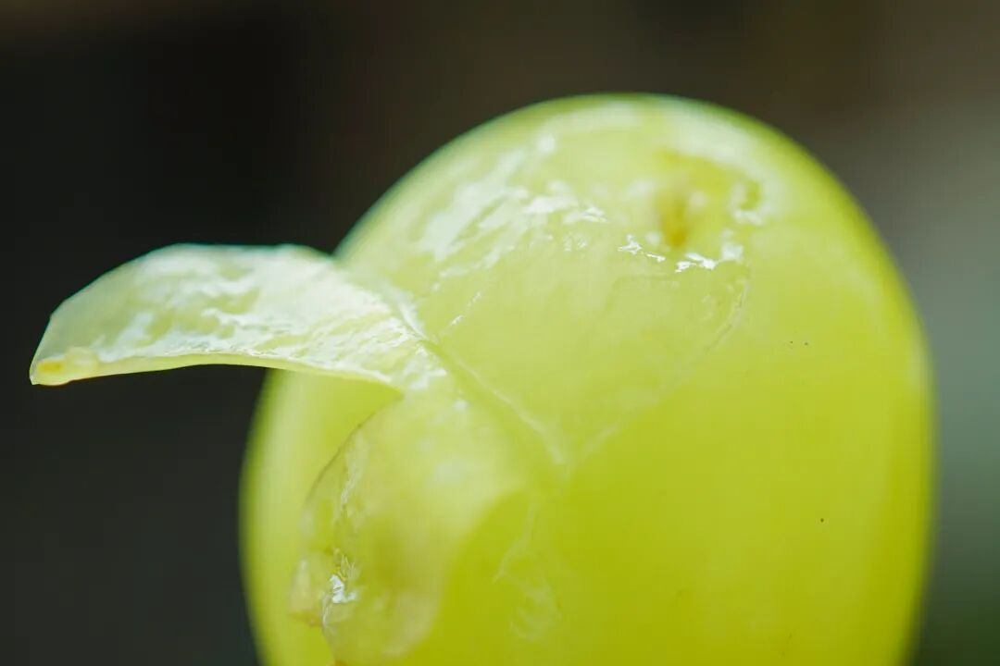

盲选了生鲜平台和水果店的阳光玫瑰，

测试甜度，随便比，

差异明显得很👇

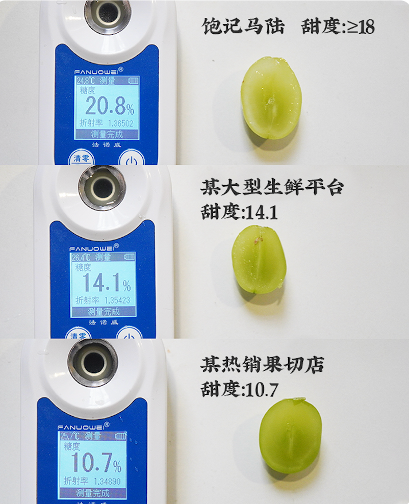

好了，
剩下的你们自己看商详吧。比的就是手速！开买！

饱记·马陆阳光玫瑰
购买方式如下👇限时尾声 9 折！
戳图买它👇

再来还有完全靠老天爷赏着吃的
饱记·云南野生菌子礼盒！

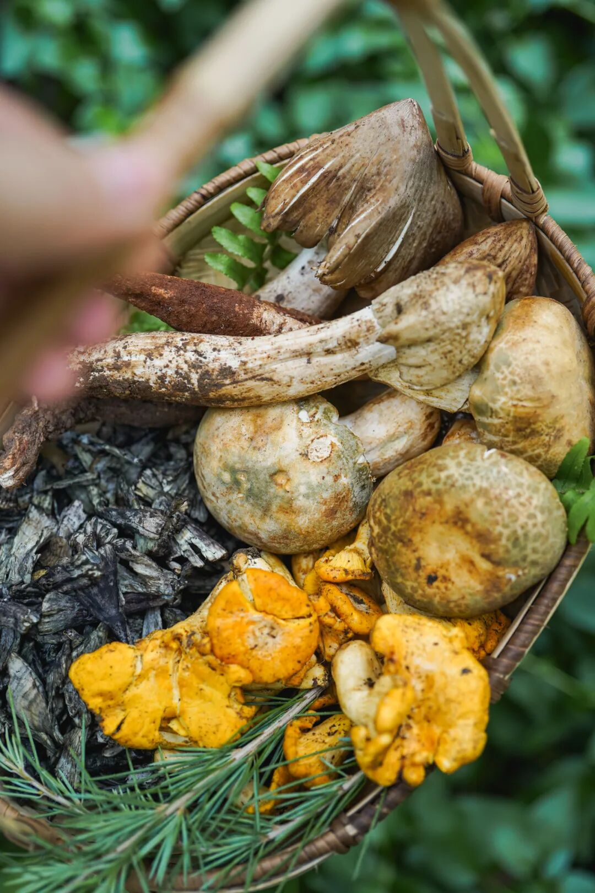

共四种：

干巴菌、鸡枞菌，

鸡油菌、青头菌。

都安全无毒，

非云南人也可以安心吃！

来自云南最大的高端野生菌批发商

包下来的私家菌山。

此山每年要卖出 2 亿多的菌子和云南特产，

客户都是米其林餐厅们。

我司和它们品质完全一样

但价格却是店里吃的一半甚至 1/3！

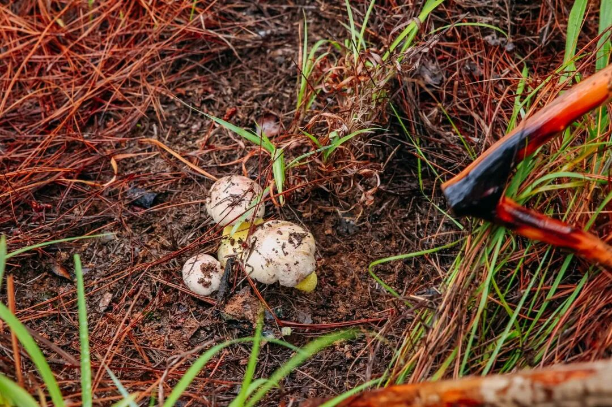

不用担心厨艺问题！菌子烹饪起来也可以极其简单。

我司请了国内云南菜天花板

——泓 0871 的大厨飞哥，

来教大家做菌子宴！

每道菜最多三步！

看了就会！！会了显贵！

（发货时每箱都附赠了火腿和螺丝椒！给你配好了！

🍃🍃🍃干巴菌云南菌中的王者

长得像枯木的干巴菌，

一直属于云南菌里最贵的一档。

看上去皱巴巴的，

其实内里藏着汁水。

闻起来有一股浓烈的干香。

最好还是拿来干炒，

炒鸡蛋、炒饭都行，

大厨飞哥直接拿来炒火腿。

两步到位，毫无难度。

第一步，先将干巴菌用猪油

煸炒出香味。

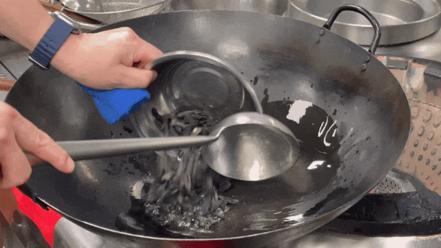

第二步，把火腿和蒜切丝，

（还可以加点螺丝椒、大红椒增味

一起倒进去炒熟就好！

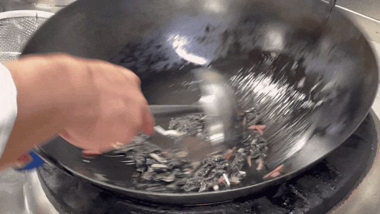

成品长这样👇

浓香微辣，

一次能下两碗饭！

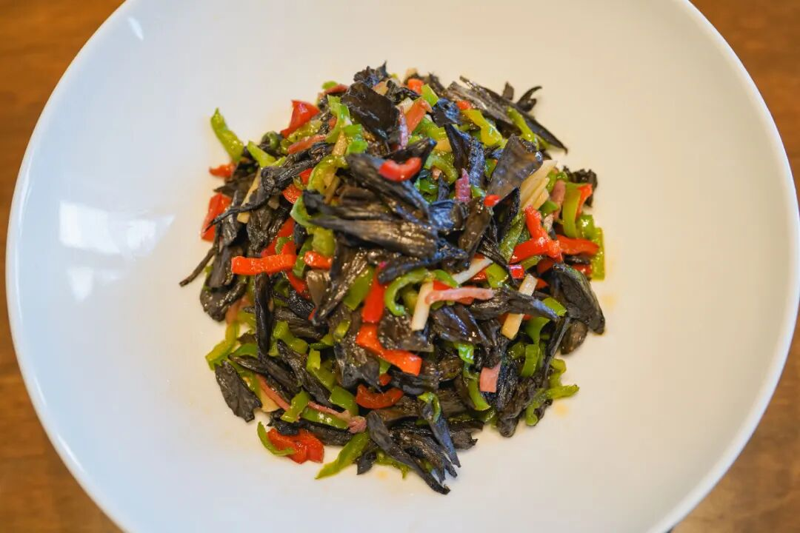

🍃🍃🍃鸡枞菌嫩鸡肉般的鲜甜

选手二，鸡枞菌，

肉感很强，

鲜甜得仿佛嫩鸡肉，

与此同时汁水充盈。

做起来也简单得很，一共三步，清蒸就行！吃的完全是食材的本味。

第一步，

150g 左右的鸡枞菌撕成条，

（不要太太细，否则蒸完会缩水。

第二步，

往菌上淋一勺鸡汤，

（或者肉汤、菇汤也行！

（都没有的话给一点点盐、白糖也可！

第三步，

铺一层肥瘦相间的火腿片👇

上锅蒸 5-6 分钟。

🍃🍃🍃鸡油菌天然的金黄
鸡油菌，

口感同样类似于鸡肉，

特别香，

吃起来又甜又嫩。

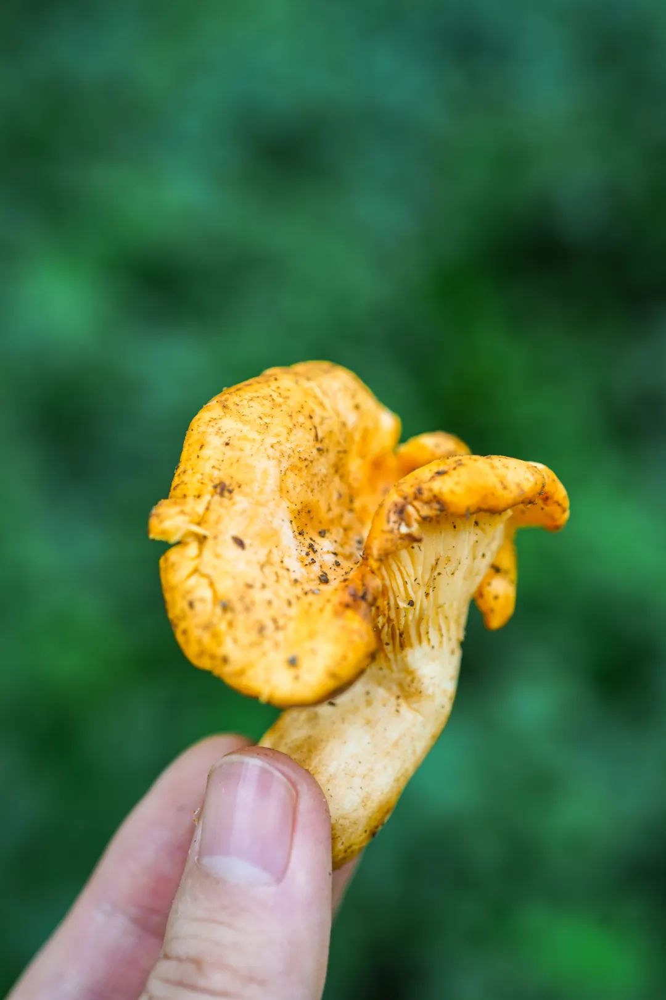

拿来做一个鸡油菌豆腐煲。看着是道了不得的大菜，其实两步完成！

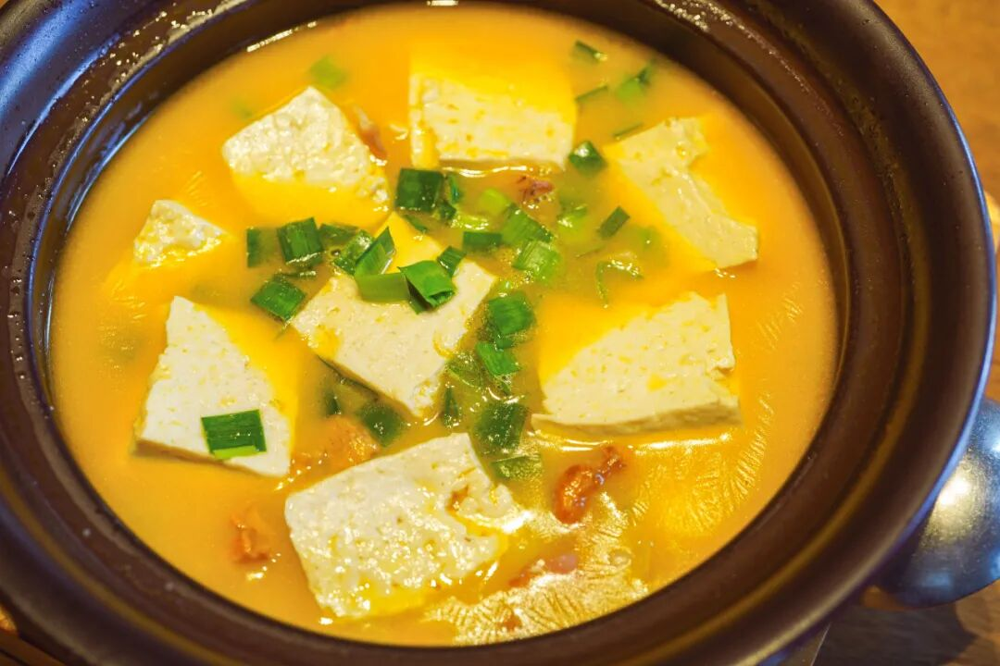

第一步，50g 左右的鸡油菌，加适量大蒜、火腿片、柴火豆腐，炒个 2 分钟左右，炒出香味。

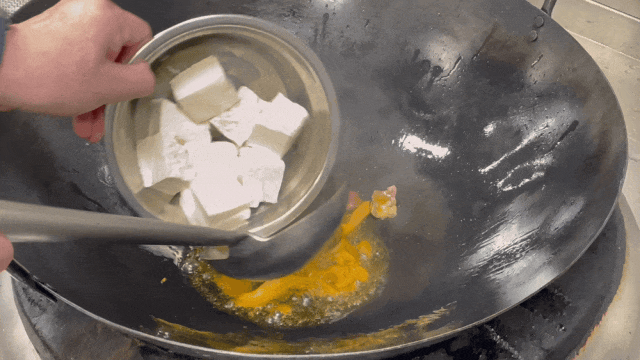

第二步，

炒完后盛出放入砂锅，

小火炖煮 10 分钟左右即可。

（本薯喜欢炖到豆腐中间有蜂窝孔！

吸满了鲜甜的汤汁！

🍃🍃🍃青头菌家常好食材
青头菌，

肥肥圆圆似一把小伞，

吃起来又脆又甜。

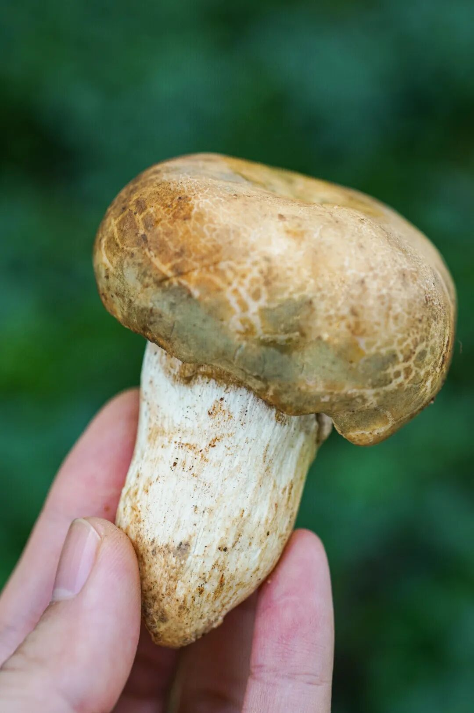

大厨拿它配丝瓜吃！也是一通炒就好了！第一步，下猪油，炒青头菌、蒜、火腿，炒香后加入丝瓜！（大厨还放了很云南的鹰嘴豆和辣椒，没有的话可以不加！

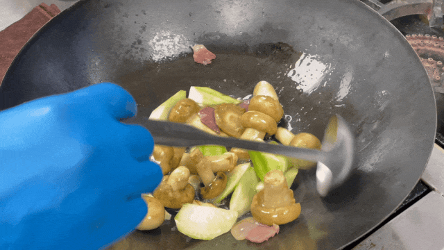

第二步，有浓汤倒一点浓汤，没有的话加水也行！烩个 3-4 分钟，调味出锅！

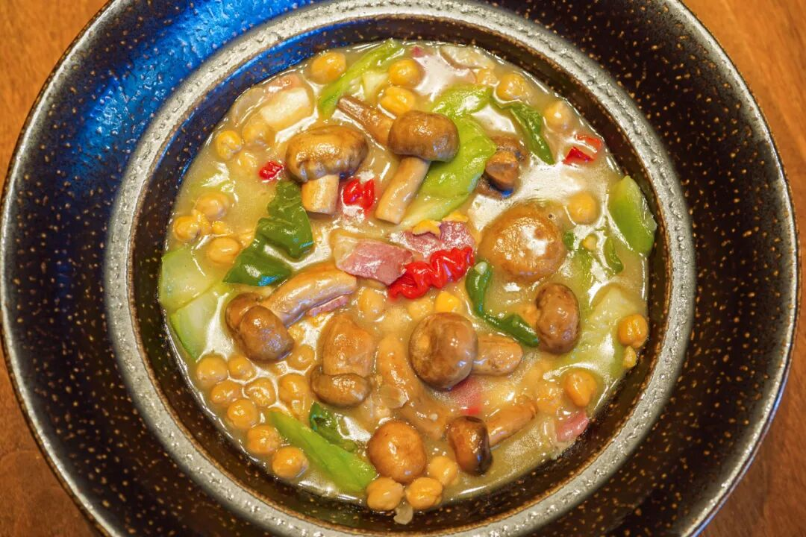

本薯经过大厨指点，发现做菌子也不难嘛～只要谨记都用猪油去炒，再来点火腿、螺丝椒，（贴心如我司发货时给你一箱配好了
食材好怎样都好吃，
看起来还厉害得很！

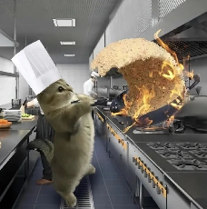

饱记·野生菌子礼盒
购买方式如下

100g 体验装

野生菌四拼

（干巴菌/青头菌/鸡油菌/鸡枞菌各 100g）

野生菌三拼

（青头菌/鸡油菌/鸡枞菌各 100g）

200g 分享装

野生菌四拼

（干巴菌/青头菌/鸡油菌/鸡枞菌各 200g）

野生菌三拼

（青头菌/鸡油菌/鸡枞菌各 200g）

顺丰空运次日达，

看得见的新鲜！

戳图买它👇或到🍑🍑🍑搜索「艾格吃饱了」

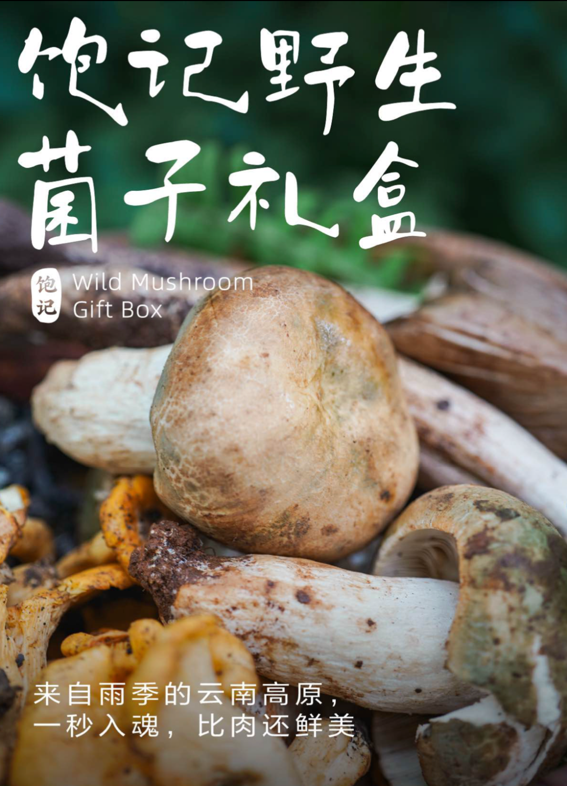

题 外

昨天新上的紫薯吃了吗？

来自云南建水！在沙土地里长大，

带一点微微的红枣香气！

还有来自云南石林核心产区的

不一样人参果，

清甜多汁，还带着浓郁奶香。

最后是云南30年老树上的

绿籽石榴，

果味极浓且层次丰富！

都还有限时早鸟 86 折！

最后两天！快吃！

饱记·云南沙地紫薯

购买方式如下限时早鸟 86 折！！！
戳图买它！！👇

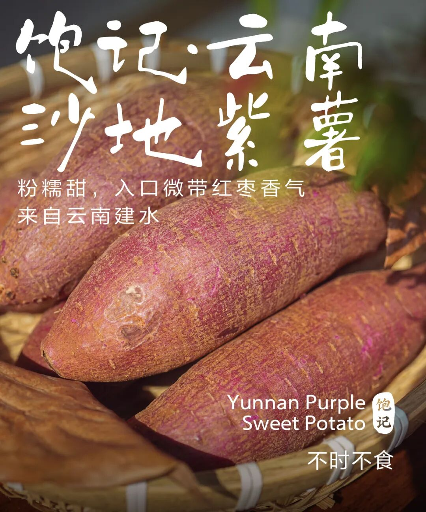

饱记·云南不一样人参果

购买方式如下限时早鸟 86 折！！！
戳图买它！！👇

饱记·云南老树绿籽石榴
购买方式如下限时早鸟 86 折！！！
戳图买它！！👇

本文的研究员

薯角相见时难别亦难

用好吃的方式吃一生

祖国各地好风物

文章转载请加微信「baojiclub」

