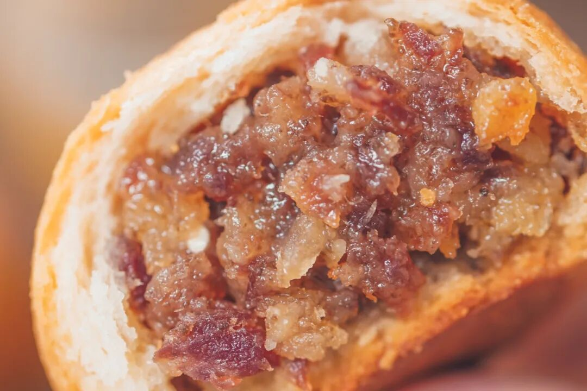
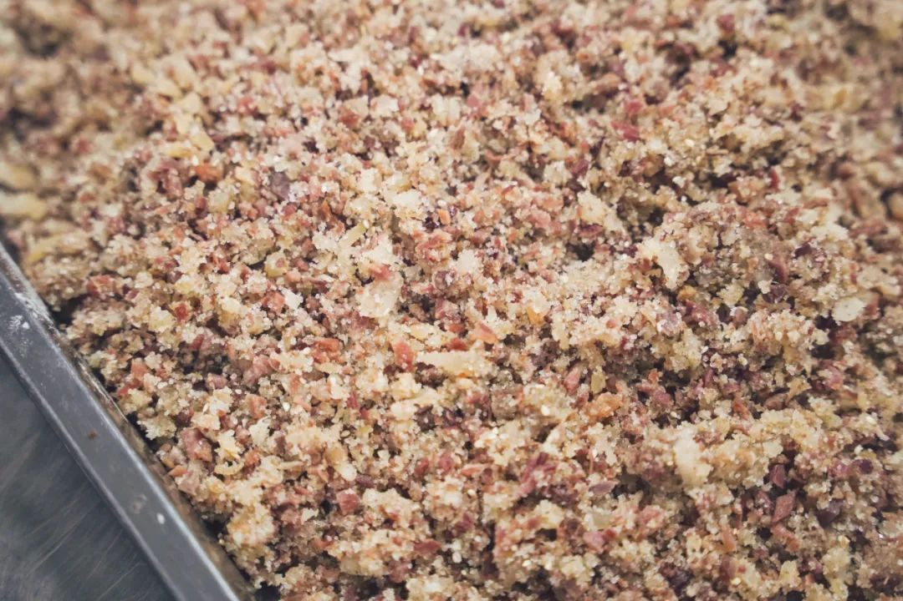
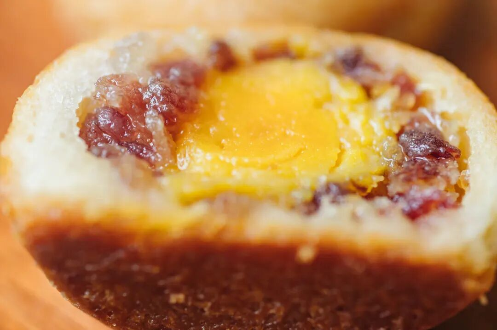
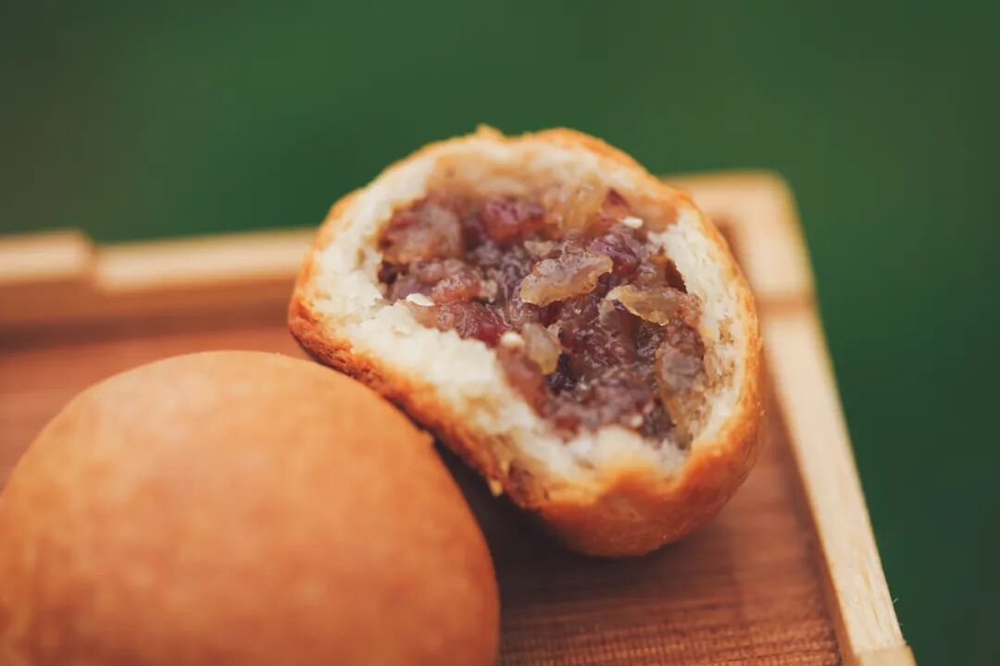
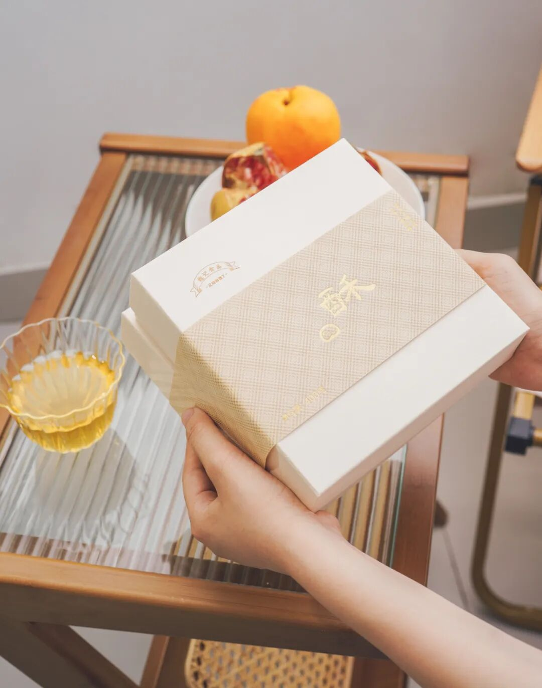
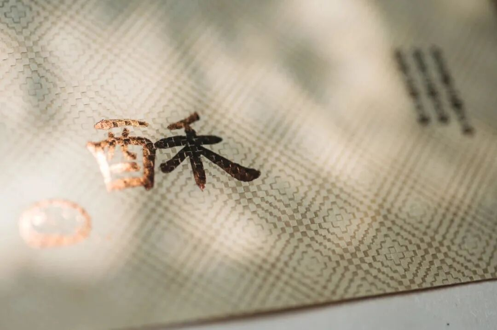

# 周末吃什么，我们帮你想好了

- 原文链接: https://mp.weixin.qq.com/s?__biz=MjM5NTYxODQyMA==&mid=2653457922&idx=1&sn=74becedd67f28c4cf7a598e12402ce2a&chksm=bcd693d136df2c2a339d3801b67e0e7369305ffcc5c1d2578fbc22d8a5a75edb5c45dbe2beb5&scene=27#wechat_redirect
- 浏览量: N/A
- 点赞数: N/A
- 评论数: N/A
- 转发数: N/A

## 正文

谢谢云南老师傅

一个尽情安利自我的公众号

以下是没事干研究院的风物研究报告请放心食用

啊啊啊啊啊！！

还有人不知道

这司卷了三年的云腿酥，

已经烤了好几批吗？

本薯不允许任何人在周末之前错过它！

肉，好多肉。

真的，最新生产日期的云腿酥大货，细细嚼，就知道火腿好肉好，
一口吃得出。

云腿小酥，

在云南当地又叫「火腿四两坨」，

其中最关键的用料就在于火腿。

肉用得好，酥才够香，且油润而不肥腻。这一步完全省不得！所以我们卷到了，宣威海拔 1800 米左右的高山里！在高海拔环境自然发酵的腿，和平地上催熟腌制的腿，绝不可同日而语！

选用其中三七分的火腿，有香香的油脂～又能嚼到肉的鲜甜～

然后一定要用云南当地采的杂花蜂蜜，我去厂里替你们喝过了，真 · 自带花香，浓郁地炒个云腿馅儿。

再以欧洲米其林餐厅常用的黑白松露酱，浓郁拌个馅儿。

或者塞一个

云南当地现挖新鲜的咸鸭蛋，

配上火腿肉，

更为油润咸香～

这样的云腿酥，约等于在吃肉。越嚼越香，周末就该吃点儿好的！

以上最后一句代表我的心声。大家多买点，有礼盒和囤货装两种。送礼自用都实惠啊！

作为一名正直的打工人，从老板那里薅来了 9 折！超划算，大家趁现在多买点啊！

饱记·滇式云腿小酥
现货！！！限时 9 折！！
传统滇味经典，新鲜手作，浓情四溢。
🥮四个口味：经典云腿、蛋黄云腿，黑松露云腿、白松露云腿。
🥮三种规格：云腿酥礼盒全家福（四个口味各 2 枚）云腿酥礼盒双拼（经典云腿小酥*4 枚+蛋黄云腿小酥*4 枚）
云腿酥礼盒囤货装
（经典云腿小酥*30 枚）
戳图买它👇或到🍑🍑🍑搜索「艾格吃饱了」

题 外 一

以下风味也是过周末首选，

休息日让我们对自己好点。

外面买不到的奶黄月饼，

半岛嘉某楼奶黄月饼的创始配方，

邀请米其林大厨调整减糖，

趁还在预售，早鸟 86 折！！

非常懂事的
海南黄金百香果，正宗钦蜜 9 号，蜜蜜甜！限时早鸟 86 折！还有打工人好搭档，
来自海南的高甜火龙果家族！吃完立刻瘦一斤（不是限时回归 86 折！

饱记·奶黄月饼礼盒
预售中！！！限时早鸟 86 折！！
饱记独家配方，外面买不到！
🥮 新鲜手作，外皮酥脆，内里奶香浓郁～
每日限量 100 份。预计八月底按下单顺序发货～
戳图买它👇

饱记·海南黄金百香果购买方式如下限时早鸟 86 折！！
正宗钦蜜 9 号，来自海南热带水果原产地
不同于紫皮品种，吃的就是这口甜。
戳图买它👇

饱记·高甜火龙果家族购买方式如下限时回归 86 折！！
膳食纤维小能手！打工人王炸组合！！！
高甜火龙果家族！饱记指定小果园，海南阳光里养出来的熟甜！
戳图下单购买👇

题 外 二

有时真为一些食物不平，
这么好吃怎么无人问津？？两个口味的招牌梅饼，
天然酸甜的黄桃干与空心山楂球，
越啃越香脆的圆墩墩玉米浪，还有扎扎实实的午餐肉片～以及招牌南乳香葱蛋卷等，含泪临期清仓，都是实打实的折扣！！无需凑满减！⚠️PS：清仓产品临近效期，介意慎拍～

饱记·临期清仓专区
5 折起！

清仓产品临近效期，所以巨折，但自家吃吃没问题！介意慎拍～
「临期清仓」专区，5 折起！！清仓产品临近效期，介意慎拍哦～戳图买它们！！👇

本文的研究员

薯角很高兴为您服务！

用好吃的方式吃一生

祖国各地好风物

文章转载请加微信「baojiclub」

