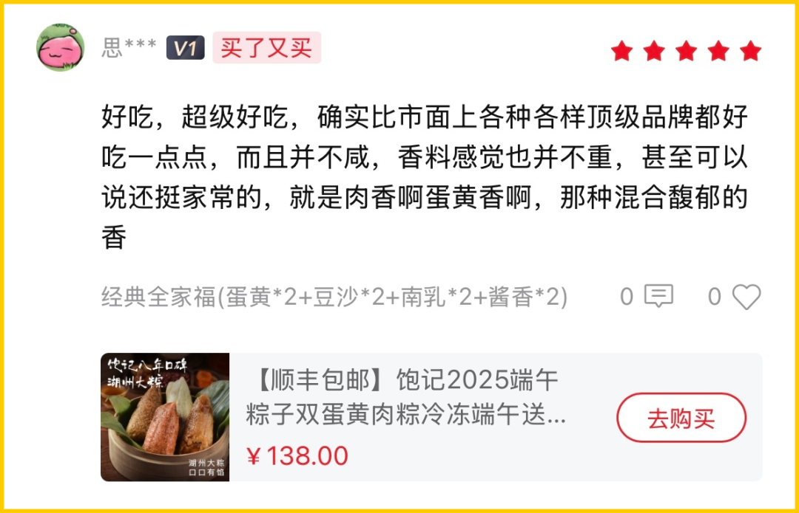
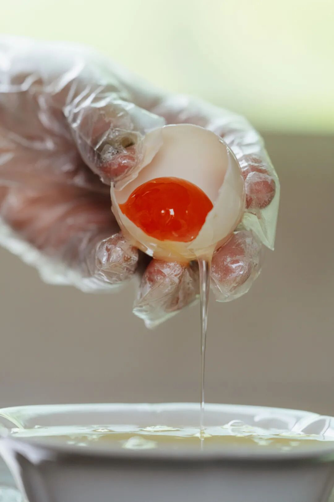
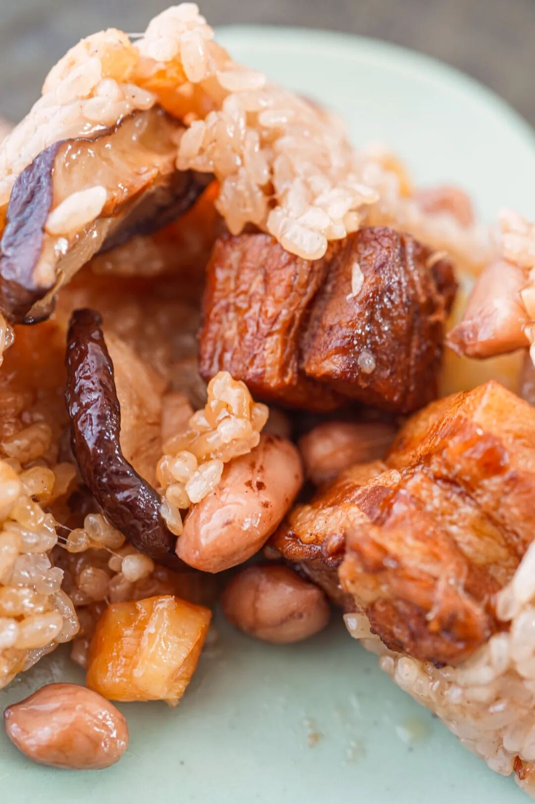
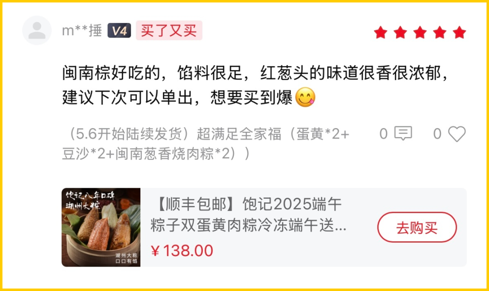

# 呵呵，老板也有今天。。。

- 原文链接: https://mp.weixin.qq.com/s?__biz=MjM5NTYxODQyMA==&mid=2653471189&idx=1&sn=d277094ff3986775f122ff66fc735754&chksm=bc0bb4dd87d5f16391396d13e32d4e6b7fdf4480767810f7ea0aaeae872af80d5c916a4c5d7a&scene=27#wechat_redirect
- 浏览量: N/A
- 点赞数: N/A
- 评论数: N/A
- 转发数: N/A

## 正文

真诚推荐

一个尽情安利自我的公众号

以下是没事干研究院的风物研究报告请放心食用
端午节快过啦！！！今年份的饱记粽子还有最后一点点。来，今天本薯直接打巨折，囤着当早餐或下午茶吃吃！也很精彩啊啊啊啊！

要我说，还不是因为这司老板原料、工艺卷起来都不看成本，然后，然后就下不来了。。。今年端午过得早，剩下这点随便清清！大家看着买啊！

这粽子好在何处？今天本薯就给大家摘抄点哈，省得我写。首先是直截了当的顺丰冷链！每一箱都是实打实的冷链上门。其次是我司多年的急冻锁鲜工艺！很贵！但是好吃！（冷冻后加热后还是如此弹嫩油润👇

遥想当年，老板也曾尝试做真空粽。这种工艺相对便宜，而且保质期往往很长，可以常温储存。方便大家送礼。但也是真的，没急冻锁鲜好吃。某家老字号的真空粽能说明问题，来看图：

这图是 5 月同一天拍摄的，从左到右，生产日期逐渐拉远。然后老板被指名道姓骂说忘了初心。。。从此留下阴影hhhh坚持用-40℃ 急速冷冻锁鲜工艺，保质期内味道和口感几乎不会有改变，始终香，而迷人，相信你能吃得出来：）

普通 -18 度不能冻哦米会被冰晶撑破，要专门急冻设备做
原料，在这司是必卷的。咸蛋黄是高邮现挖的，豆沙粽里的陈皮专门托人到广东磨的，葱酥、葱油也是要跑去泉州现炸的，酱油要调三种，肉有黑猪腿肉，不干柴，浸润了肥膘。

总之到现在，

做了九年、卖了 90w+ 只，

攒下来好口碑，

收获很多年年买的老客户～

后台新鲜好评一波接一波，都在夸好吃嘿嘿～

我司粽子五君子，不走花里花哨路线，讲究亲妈配方，就是家常的、舍得放料的好吃～接下来给大家一一介绍下啊！

湖州大粽，经典四个口味，

首先是包邮区的王：

高邮咸蛋黄黑猪肉粽！

用高邮鲜挖的咸蛋黄，再称 40 克黑猪后腿瘦肉，10 克腰间肥膘，咸蛋流油起沙，油香混着肉香，市面上完全买不到！！

我饱记从 2016 年开始鲜挖蛋黄，直到 9 年后的现在，每年都坚持只用高邮本地品种麻鸭的鲜咸鸭蛋黄一年坚持鲜挖几十万只的，整个包邮区，也没听说有第二家！

这些蛋黄，还是从鸭子开始管起的！选高邮本地品种麻鸭，产的新鲜的鸭蛋，再用白酒和砂糖略为腌制：

不仅如此，饱记还要求咸蛋黄腌久腌透，普通咸鸭蛋腌 28 天左右即可，我饱记要求腌渍 45 天，一定要腌到蛋黄流油起沙：

因为腌得时间特别长，这批咸蛋直接吃非常咸，不能卖，只能给饱记包粽使用，咸蛋流油起沙，咸味渗入米里。。。

紧接着就是本薯今年的最爱：

新会三年陈皮豆沙粽！

今年四个口味里的唯一甜粽，甜而不腻。

因为取了正宗的广东新会三年陈皮，

每年端午前现磨包进粽子里。

看不见陈皮，但每一口都能感受到它的存在！

蒸过之后，香气清雅得想吟诗：啊～江南～

这也是老板 2017 年自己搞了两三个月开发出来的！在包邮区，饱记是原创！（好多人不信气晕本薯现在包邮区到处有的陈皮豆沙粽，确实都是跟风饱记的！往往用很廉价的陈皮粉，猪油味完全盖不住。

别的不多说！

老客人的留言写得比我好👇

还有传统酱香黑猪肉粽，

用了三种酱油去浸米，其中一种是包邮区百年老字号日晒夜露的。
和蛋黄肉粽的米配方完全不同！老板说想要小时候土酱油的烟火气～（我只看得见一大块肉🙏

再走一下小众复古路线：古法南乳黑猪肉粽，是想致敬包邮区南乳大肉的味道～南乳，就是红腐乳。翻遍包邮区、华北和广东的南乳酱，最后：广东古法南乳酱赛高！米和肉都能吃到咸香带微甜的腐乳味儿：（你看这个红！它是不是寓意着鸿运当头！！（我疯了

最后是新做的闽南葱香烧肉粽。红葱油和红葱酥，都是泉州厂子里新鲜现炸的，就是油和红葱下去炸到金黄酥脆，没有什么科技狠活。

炸好的红葱油、红葱酥，

拿去炒糯米，

（怕大家吃不惯还是用的包邮区糯米哦～

把葱香和酱油香直接炒到米里。

闽南都是这样的熟米粽，

和包邮区不一样，更像在捏饭团。

这款主打一个料超多，

包了猪五花肉、干贝、

虾米、卤香菇、卤花生粒！

（快给我数不过来了

筷子轻微一挑，料就大块抖落出来～

平时喜欢闽菜风味的人，或者喜欢葱香和花生的朋友，你们应该都会超爱！

如果你想囤点好吃的粽子，来吧，买饱记的急冻锁鲜粽没错。今年最后一点点！限时吃粽 7 折！老板不懂事，家人们下单助力本薯啊啊啊啊！

饱记·口碑湖州大粽预售中

现货中！！！

限时尾声 7 折！！！！

戳图买它👇

题 外

朋友们！！！

天🐱618活动今晚又开始了！

我司直截了当打折！

🍑平台全场 85 折！

限时早鸟 86 折！突然熟了的云南西红柿，配鸭蛋炒正正好，是小时候阳光里长大的浓郁番茄味儿，
限时早鸟 86 折！！

还有些只有最近这一阵可吃的水果👇

拿过上海金奖的金山小皇冠西瓜，

爆汁清甜还有瓜鲜味！

也拿过上海金奖的金山小番茄，

难得回归的泰国超甜多汁金柚，

瓜肉软糯的翡翠冰淇淋甜瓜，

无渣不麻嘴的海南金钻凤梨，

连盐水都不用泡。

卷中卷红玉芒果，

娇艳可人的雷州木瓜，

现在也有限时 86 折！

饱记·梅家坞龙井&蒙顶甘露限时单件 86 折！！！两件 8 折！！

戳图购买👇

饱记·金山小皇冠西瓜

购买方式如下

限时早鸟 86 折！！！！

戳图买它👇

饱记·云南西红柿

购买方式如下

限时早鸟 86 折！！

戳图购买👇

饱记·多汁泰国金柚

购买方式如下

限时吃水果 86 折！！

戳图购买👇

饱记·金山五彩小番茄购买方式如下限时 86 折！！
戳图购买👇

饱记·翡翠冰淇淋甜瓜购买方式如下限时吃水果 86 折！！
戳图购买👇

饱记·海南金钻凤梨

购买方式如下

限时吃水果 86 折！！

戳图购买👇

饱记·海南红玉芒果购买方式如下限时吃水果 86 折！！！
戳图购买👇

饱记·湛江雷州木瓜

购买方式如下

限时吃水果 86 折！！

戳图购买👇

本文的研究员

薯角我想我知道夏天的味道

用好吃的方式吃一生

祖国各地好风物

文章转载请加微信「baojiclub」

