# 和看不起我的英国人吵架。。。。

- 原文链接: https://mp.weixin.qq.com/s?__biz=MjM5NTYxODQyMA==&mid=2653458298&idx=1&sn=f1fab5e3360bfab068a5b4b454a7b0c9&chksm=bcb4c7c5811567c2f8be750a92e5a0ac2a1293442cad14af7e486dc8d9320e791d42b7d97d43&scene=27#wechat_redirect
- 浏览量: N/A
- 点赞数: N/A
- 评论数: N/A
- 转发数: N/A

## 正文

哈哈哈哈哈

每周消费报告
均没有广告软文请放心食用

上周被催了说要看吵架，

那就讲讲吧。。。

当时去吃了伦敦最古老的餐厅（详情点左边

Aka 伦敦黑暗料理的发祥地。

吃完饱得不行只想挺着肚子走两步，

一查，伦敦著名的 Ritz 酒店就在附近啊！

去看看～

伦敦的 Ritz ，我是听上回讲到的，

一直给女王搞下午茶搞宴会的大厨说的。

当时我很详细地采访了他，

英女王的下午茶，

Aka 正宗地道英式下午茶

应该是怎么样的。

就这大爷哈，伦敦米其林二星，后来关了餐厅为女王服务了 22 年

感兴趣可以戳这篇👇

与女王的厨师聊天：英式下午茶怎样才算靠谱呢？

当时我就理解了。。。

女王的下午茶，

是像唐顿庄园这样

在自家城堡花园子里摆一桌的。

然后我就问他，

那我们普通人到伦敦，

没法去贵族的花园，

什么地方可以替换的呢？

大厨：Ritz 还可以吧。

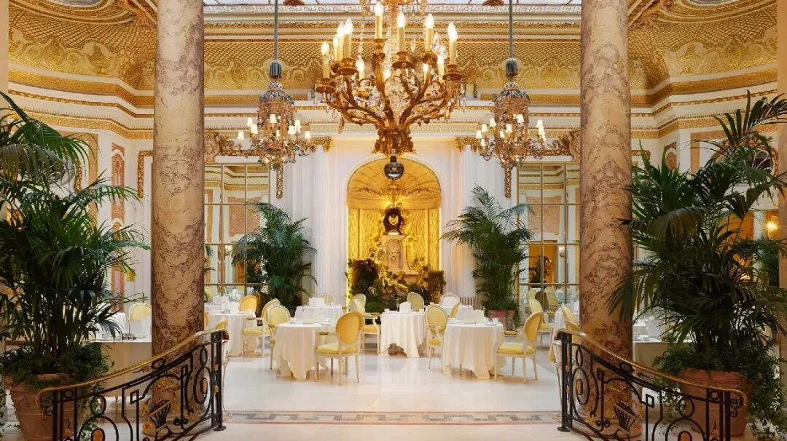

图源：酒店官网

看到了哇，所以 Ritz 的下午茶，

最初就是中产的平替。

自家没大厨，所以只能去高级餐厅。

（上次说到《王冠》里借演员之口

说女王最讨厌 fine dining

自家没花园，那就去酒店呗。

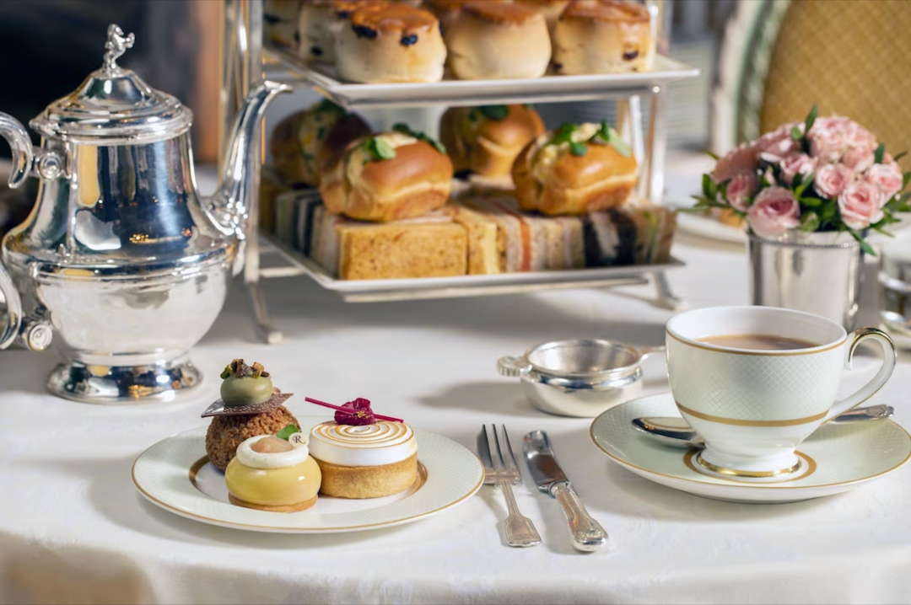

结果我一到门口

就被体面的制服保安大爷给拦了，

问我们干嘛的？

？？？？

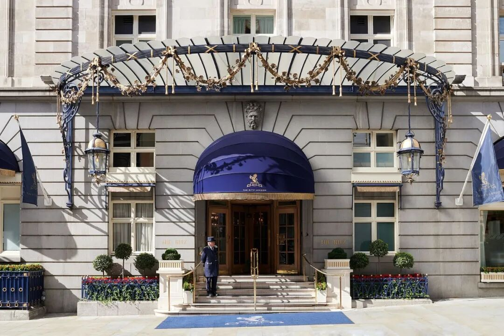

图源：酒店官网

我：（很客气的英文造句）我们没有预订，

但是听说贵酒店的下午茶非常著名，

想来看看有没有机会可以试一下？

大爷面色稍霁，

跟我们说牛仔裤（我本人

肯定是不行的，

但是可以去前台问一下预订。

好，总算进去了。

但这酒店说真的确实很老派，

灯也不亮墙地老旧，

我看这也不是贵族的高级传统吧，

单纯地年久失修加过气。。。。

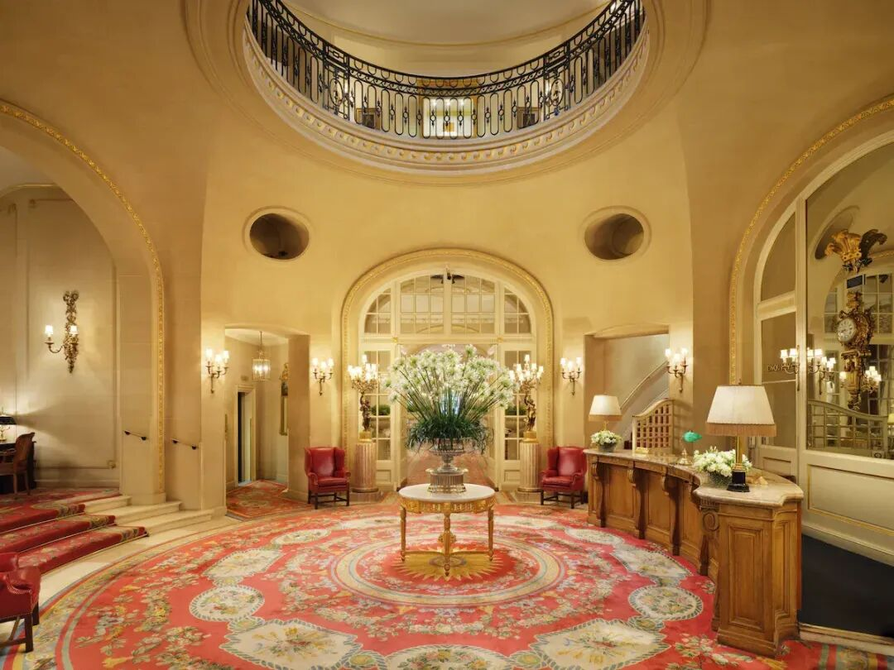

图源：酒店官网。但实物绝对昏暗无比。。。

到了前台，前台女孩比外面大爷更高傲，

上上下下地打量我，

仰着下巴跟我们说话。

问题是。。。

她也就是一个劳工阶级英文口音啊

我：哦那我解释一下我的失礼吧，

我是一名来自上海的记者，

之前采访过女王的大厨，

他说伦敦您这儿最棒，

所以今天慕名而来，

非常抱歉没有预订。

姑娘：我们确实也服务过很多王室家庭啊。

今天您这牛仔裤肯定不行，

要预订可以，三个月后您要吗？

我：不要了不要了。

必须当面和你订吗？

她：哦那网上也可以。

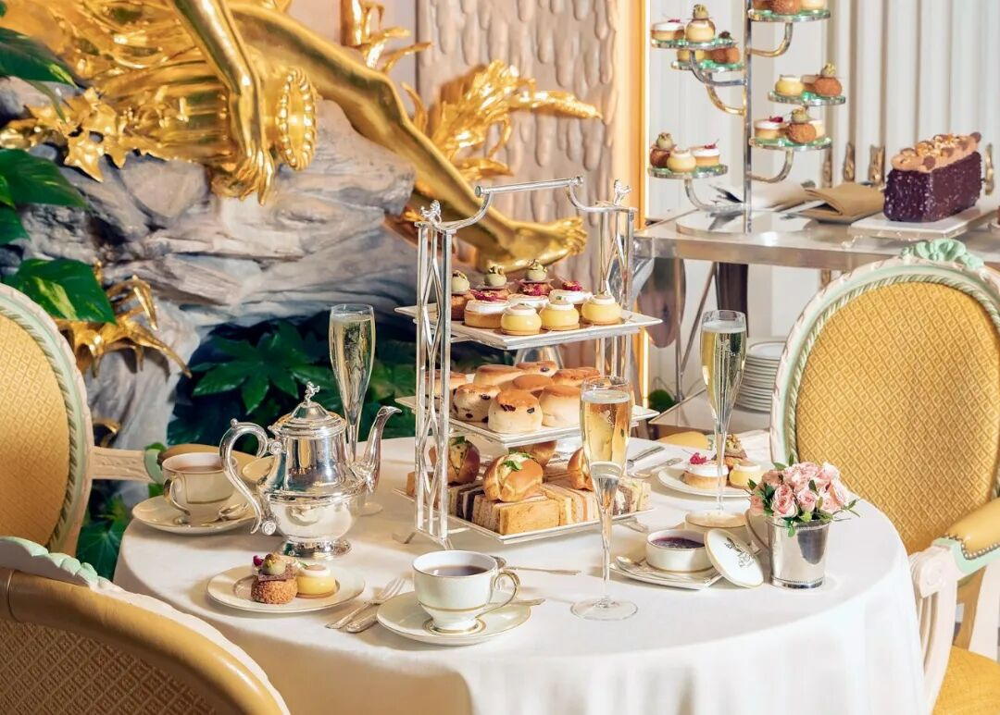

图源：酒店官网

说完我就撤了，

到门口一看，

窄得要死的大堂边硬塞了一架钢琴，

演奏者全身起伏地弹奏，

正对他的下午茶客人，

穿着华丽的西服套装和礼服，

被满满当当地塞在一个小区域里。

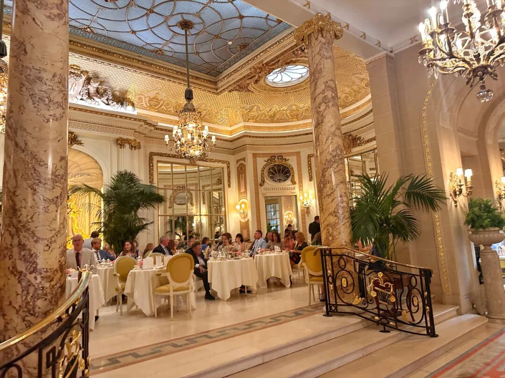

但就算这样，

这些客人也跟着钢琴师在起伏啊？？？？？？

晚上去朋友家聊天儿，

朋友大笑，说上次和人约那边，

结果该伦敦科技创业精英白人新贵

穿得像个乔布斯似的就去了，

也被酒店用很难看的态度赶出来了。

气得我朋友大骂：

你们这种过气老旧的酒店，

现在谁还要来？？？

确实。如果给我塞在这个破大堂里

吃他们 600 多人民币一位的下午茶。

还要穿上小礼服，

还要陪钢琴师一起全身起伏地演，

真的太不可了。。。。

从 Ritz 出来我在这个伦敦的南京东路上，

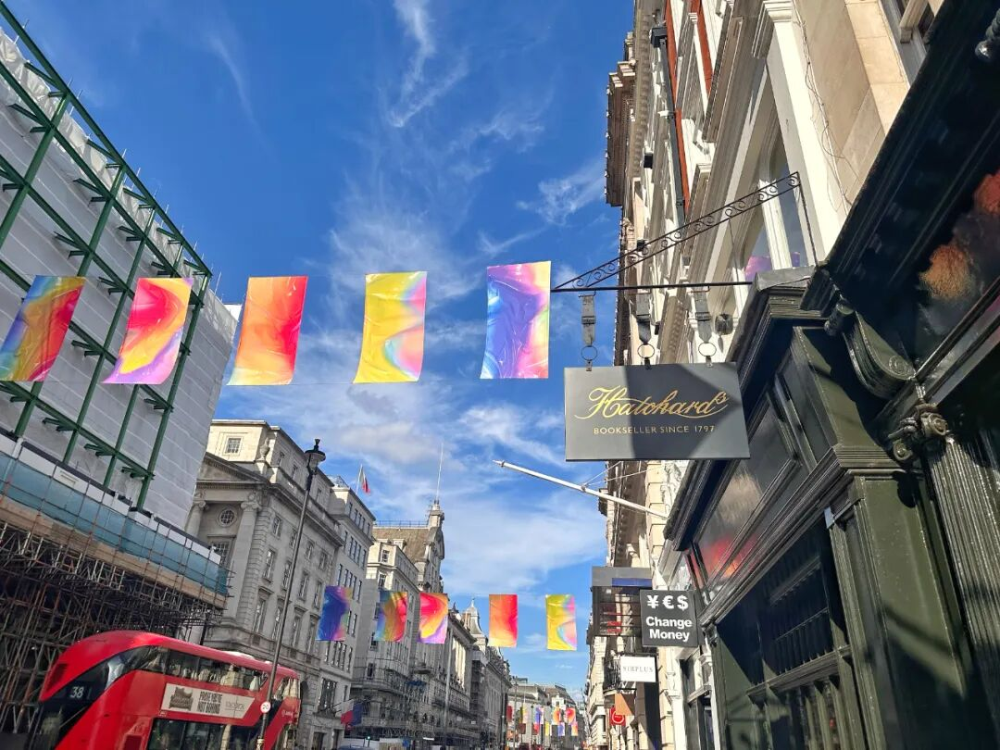

悻悻拐进了人山人海的伦敦第一食品商店

不是，是 Fortnum&Mason。

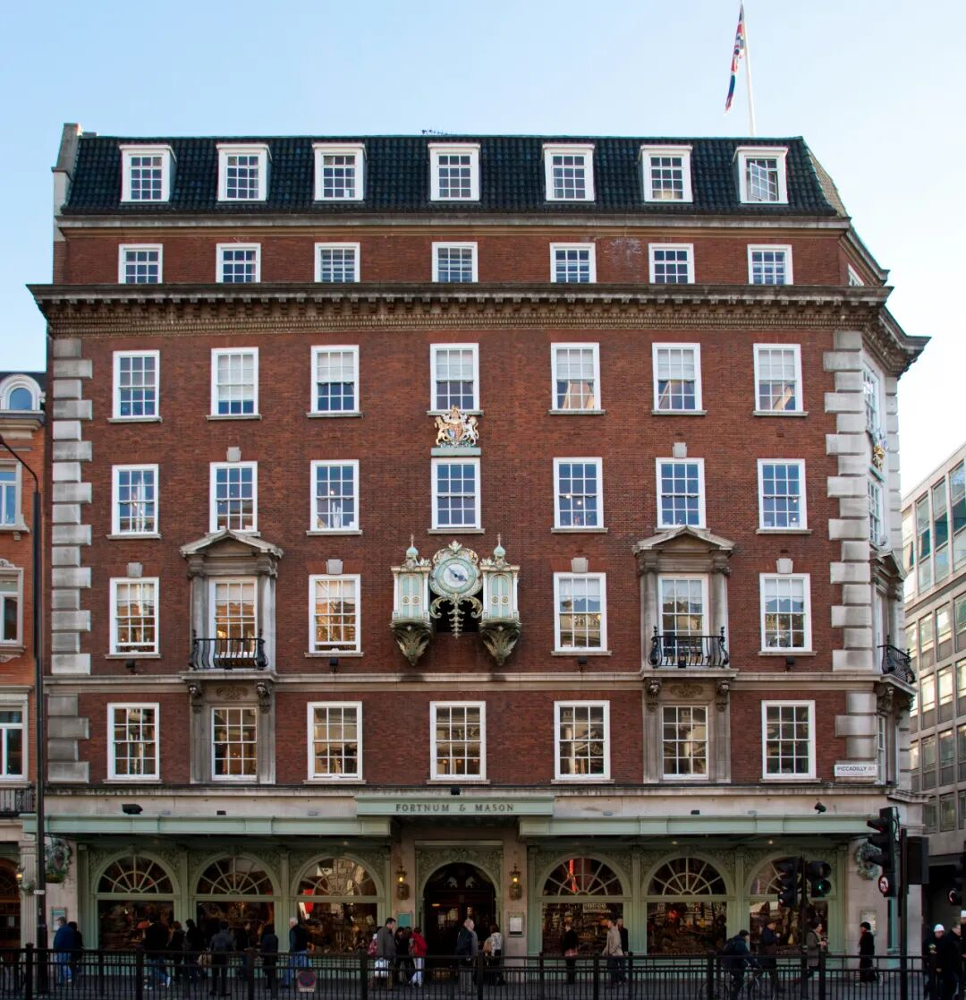

图源：维基百科

找到地下一层的新鲜奶酪柜台，

决定和卖奶酪的大哥开个 Snobbish 的玩笑：

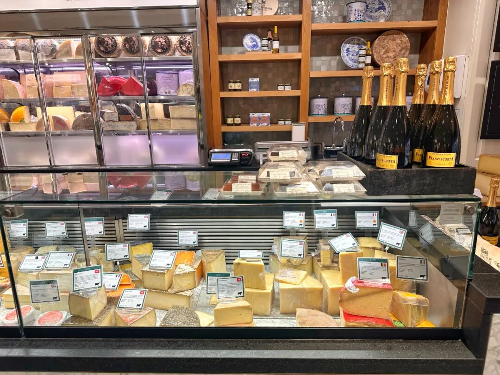

「您好，我第一天到伦敦，

晚上要去朋友家吃饭。

她的丈夫是英国人。。。

他的家庭有名有姓，

持续了几个世纪。。。」

大哥：瞪眼

「请您帮我挑 4-5 种棒棒的奶酪，

我的预算是 40-50 镑。」

大哥：疯狂点头。

然后他给我切了五种硬的瑞士奶酪，

特别跟我说，他一种英国的都没放哈哈哈，

总价也才 30 几镑。

晚上朋友的老公围着奶酪转来转去，

开心得一个不行。

怎么说呢，要讲 Snobbish，

可能这些人都没有以前的时装行业会。

《穿普拉达的女王》真实反映那种时装界势利和 PUA，我也是因为这个原因行业一不好就跑路的，是真不爱

Ritz 的恶劣态度，

我只能归结说伦敦可能更像北京，

而巴黎的气质更接近上海。

北京总体很 chill，

但遇上服务员儿给你喊起来也是有的：

「别喊了别喊了挤挤啊没看到这正忙着呐～～～～」

因为真要讲英式 Snobbish，

操着劳工阶层的英语口音就是真的不行的。

酒店嘛也是不行的，本来就只服务中产，

人家贵族有花园干嘛到你这下午茶不是？

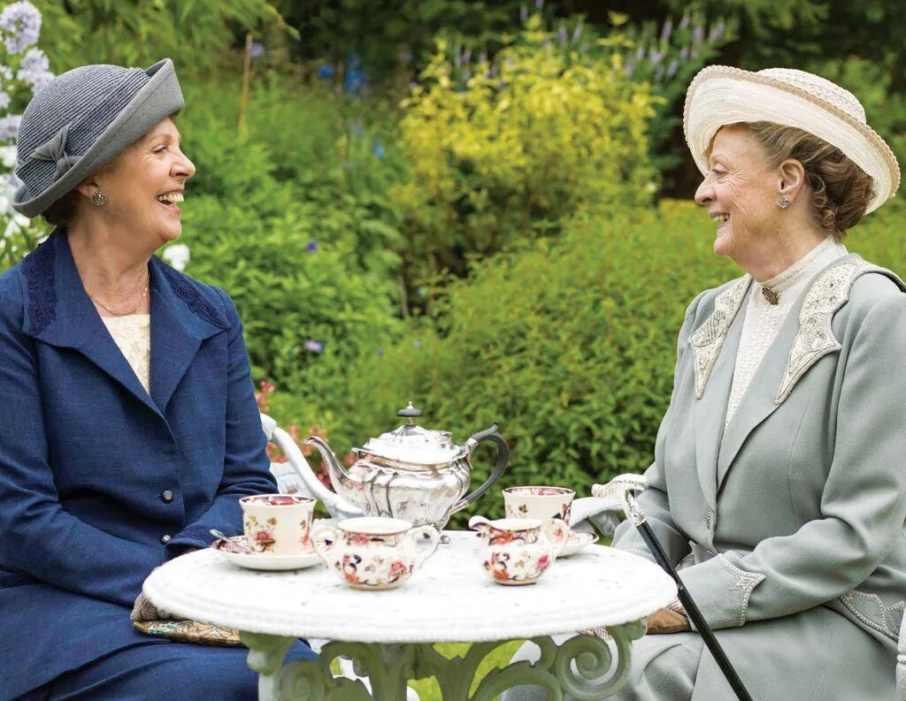

最后，如果还想去 Ritz 的下午茶，

可以去他们官网预订。

除了挤了点，确实还可以。

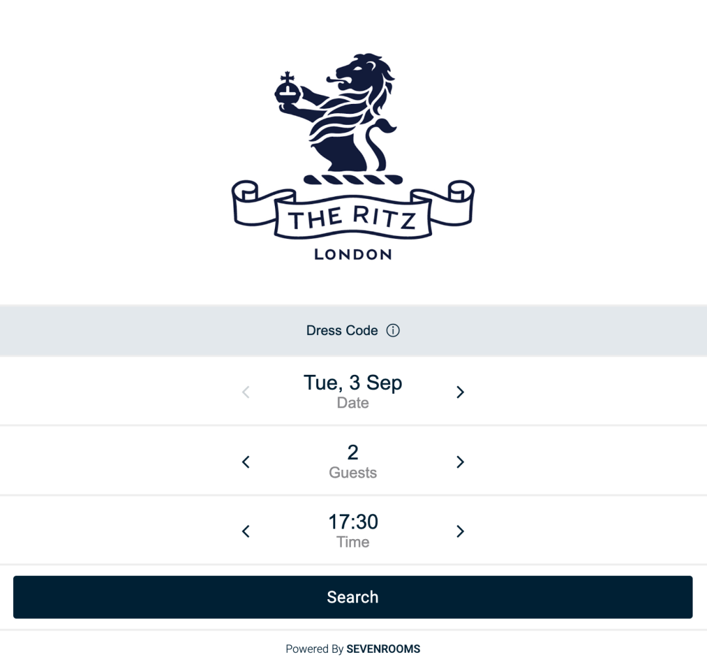

老夫人微笑。

完。

题 外 一

提前看齐天猫大促，

外面买不到的奶黄月饼，

限时 86 折！！

半岛嘉某楼奶黄月饼的创始配方，

邀请米其林大厨调整减糖，

手工烤出来的好吃！

此外卷了三年的云腿酥，

限时 9 折！！！

还有米其林级别的舟山月岙梭子蟹，

天赐山珍云南野菌子四种（鲜的

生吃都鲜甜的香格里拉松茸，

蜜蜜甜的

新疆三色葡萄及海南钦蜜 9 号百香果，

以及用正宗融安滑皮金桔，
融入四川本地土蜂蜜，浸皮萃取来的金桔蜂蜜酒！数不过来，吃得人心满意足！限时 86 折起！

冲吧！

饱记·奶黄月饼礼盒
购买方式如下👇限时 86 折！！
饱记原创配方，外面买不到！
🥮 新鲜手作，外皮酥脆，内里奶香浓郁～
每日限量 100 份。下单后按顺序发货。
戳图买它👇

饱记·滇式云腿小酥
现货！！！限时 9 折！！！
传统滇味经典，新鲜手作，浓情四溢。
🥮四个口味：经典云腿、蛋黄云腿，黑松露云腿、白松露云腿。
🥮三种规格：云腿酥礼盒全家福（四个口味各 2 枚）云腿酥礼盒双拼（经典云腿小酥*4 枚+蛋黄云腿小酥*4 枚）
云腿酥礼盒囤货装
（经典云腿小酥*30 枚）
戳图买它👇

饱记·秋日风味专区
购买方式如下
86 折起！

秋日里的时令好风味。
地下种的，
水里游的，树上长的，
厨房里烤的。
应有尽有，莫要辜负哦～
戳图买它们👇

题 外 二

有时真为一些食物不平，
这么好吃怎么无人问津？？两个口味的招牌梅饼，
天然酸甜的黄桃干与空心山楂球，
越啃越香脆的圆墩墩玉米浪，还有扎扎实实的午餐肉片～以及招牌南乳香葱蛋卷等，含泪临期清仓，都是实打实的折扣！！无需凑满减！⚠️PS：清仓产品临近效期，介意慎拍～

饱记·临期清仓专区
5 折起！

清仓产品临近效期，所以巨折，但自家吃吃没问题！介意慎拍～
「临期清仓」专区，5 折起！！清仓产品临近效期，介意慎拍哦～戳图买它们！！👇

本文的研究员

闻 佳就是那个研究院嘴里「挑剔的老板」。关于食物，不是比你懂得更多一些，只是比你花了更多的冤枉钱。

用好吃的方式吃一生

祖国各地好风物

文章转载请加微信「baojiclub」

