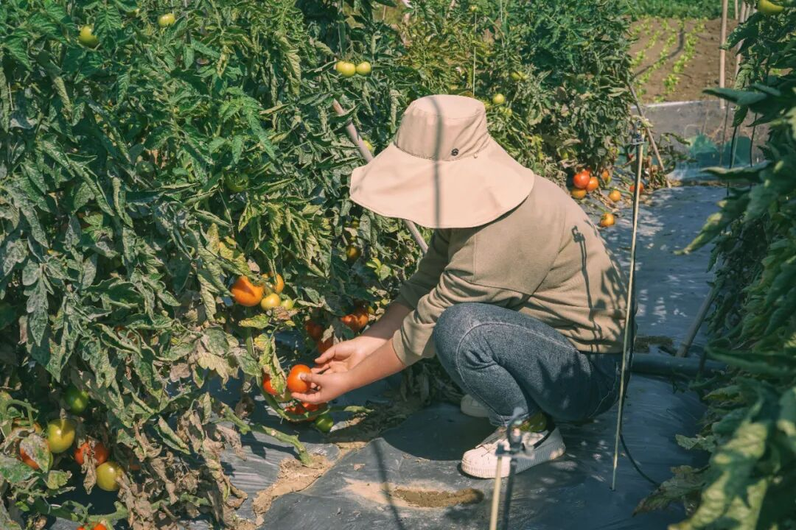
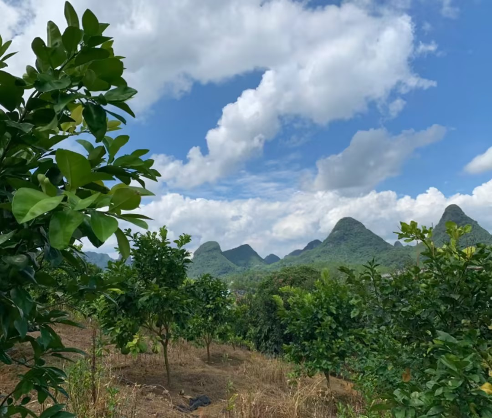

# 啊啊啊啊要不是它突然熟了，谁想上班。。。

- 原文链接: https://mp.weixin.qq.com/s?__biz=MjM5NTYxODQyMA==&mid=2653470629&idx=1&sn=4ca9a28484a7d118af517b0a9cdc07a0&chksm=bc962c0c13c5205669d233a062b388b34bb305811c82e354daaee751b98d6d4cdb4a7cc1cd94&scene=27#wechat_redirect
- 浏览量: N/A
- 点赞数: N/A
- 评论数: N/A
- 转发数: N/A

## 正文

喜讯一则

一个尽情安利自我的公众号

以下是没事干研究院的风物研究报告请放心食用

朋友们回来上班了吗？

勤劳的本薯早已坐在桌前！（内心在尖叫因为云南红河蒙自露天生长的老品种西红柿，它它它突然熟了！！限量 600 份，老价格，老包装，上！

你知道的，靠天吃饭，这一季仍然是限量供应，只有 600 箱！！！如果天气不好，随时可能会中断，西红柿爱好者抓住机会就是冲！！！

就是那种小时候吃的那种番茄，难得有番茄味儿！

长在云南高原上，沐浴着阳光雨露长大，用的是自家改良拼配矿物质含量更高的红沙土，拒绝化肥，羊粪鸡粪天然堆肥长大。

全都是露天果园栽种的老品种，不仅味道和小时候一样，真正还原记忆里的酸甜多汁，

而且种植过程不打农药～

（真的会爆汁。

汁水往下滴。。。。

之前进果园的路上，就看到几只鸡在旁边撒欢。当地的果农大哥，聊着天摘下来就开啃，这要是打了药，谁还敢这么吃啊？

全都是露天种植。你看这一串番茄藤上，有红有绿，个头有大有小，这才是自然生长的标志。

大姐告诉我，其实种番茄不咋挣钱，一开始是不放心外面的品质，为了自己两岁的孩子找的，就一小片。

我们去的那天，大姐也摘了几个回家给孩子做饭
后来发现很多妈妈都有需求，才慢慢扩建到现在十几亩。

都是地里现摘的哦。
但就算是这样，像这种露天自然生长的番茄，产量也有限得很，种几年就得让地休息休息，比不上大棚出产速度快，卖完了，就是没了，没办法补。所以你们赶紧下手！

而且由于我饱记的标准比较高，只要优等果，损耗率也很高。

因为都是都是果园里现摘现发，

所以如果当地下雨，发货时间会顺延！！

云南去年会有连续下十几天雨的，

所以这次也只上有赞！

话不多说！后天开始发货，限时早鸟 86 折！本薯自己也是要抢的！剩下的你们自己看商详，拼手速吧！

饱记·云南西红柿购买方式如下限时早鸟 86 折！！
戳图购买👇

除了这西红柿，我司这颗泰国金柚！也推荐给你，早夏冰箱里镇一颗，美到起飞～芜湖～

咬起来，biubiu 爆汁！口感，好甜好甜，基本是纯甜不带酸味！

不能算便宜，但老板说是比照当年静安久光超市泰国红柚的标准选的。

收到就可以吃啦～品种本身就是青皮，不是还没熟哦～
遥想去年，这柚子刚一上架，就得到了我尊贵的饱记客人们的连连赞叹。

一箱 3 颗，每颗净重在 2-2.2 斤～别看这个外皮青青的，其实是甜果儿！
我饱记约定的发货标准，是到手必须糖度 12 以上，这在柑橘柚子界已算小圣手。本薯拿到手就切了两个，实测糖度：和购买的某山某马的对比！（他们可不比我们便宜，有些还更贵！

秉着公平公正的科学精神！先称出同样的 200g 果肉～～～

（拥有糖度仪的感觉真的好哇现在本薯去水果店装一下都带它。。。（啊不是
顺便把多汁水平也对比了下

这是每 200g 果肉出的果汁量对比，薯制作人宣布饱记一位出道（八卦看多了最近
而这柚子不拆封放两天还会更甜，本薯用数据说话！

上面两张是刚收到的，下面两张是常温避光状态下放了两天的（科学实验薯

发给摄影师拍摄，

她说！！！！

哇何止火锅，我觉得随时都可以炫嘴里一个！请看老板和摄影师的对话！

毕竟老板为了这水果，可是去了泰国。说都是半山坡的果园，每一颗果子都晒得到热带的阳光！

一边切，柚子皮清香四溢，家里香气氛不要钱～

剥完的柚子皮不急着扔，在家里放个一两天当作天然香薰，谁还分得清我和祖某珑呀～
饱记·多汁泰国金柚购买方式如下限时吃水果 9 折！！
戳图购买👇

题 外

朋友们！！！

今年的饱记粽子！买了吗？？除了经典四个口味湖州大粽，还有用了现榨葱油、葱酥的闽南肉粽！泉州妈妈配方！地道得不得了～限时吃粽 9 折！回归的金山鸡这批还有最后 1 只一年老母鸡！！想当包邮区大孝子的速冲！限时 7 折！时令新鲜的春季茶中「梅家坞」和「蒙顶甘露」性价比高！自家喝不心疼！限时单件 86 折/双件 8 折！上好的「狮峰龙井」送人包体面！限时喝春茶 9 折来自湛江的红膏青蟹。不仅有红膏，而且满到蟹壳角角落落。

其他的东海野生海鲜，

肥美银鲳和红膏梭子蟹，

都是高级餐厅水平！

限时吃海鲜 9 折！

还有些只有最近这一阵可吃的水果👇

拿过上海金奖的金山小番茄，

找了七八年才满意的大连蜜甜樱桃，

瓜肉软糯的翡翠冰淇淋甜瓜，

无渣不麻嘴的海南金钻凤梨，

连盐水都不用泡。

卷中卷红玉芒果，

娇艳可人的雷州木瓜，

现在也有限时 9 折！

饱记·口碑湖州大粽&闽南葱香肉粽

现货中！！

限时吃粽 9 折！！！！

戳图买它👇

饱记·云南稀有品种瓢鸡限时吃鸡 7 折！！！
戳图下单购买👇

饱记·梅家坞龙井&蒙顶甘露

限时单件 86 折！！！

两件 8 折！！

戳图购买👇

饱记·狮峰头采明前龙井

购买方式如下👇

限时喝春茶 9 折！！！

戳图下单购买👇

饱记·金山五彩小番茄购买方式如下限时 9 折！！
戳图购买👇

饱记·大连蜜甜红樱桃购买方式如下限时吃水果 9 折！！
戳图购买👇

饱记·翡翠冰淇淋甜瓜购买方式如下限时吃水果 9 折！！
戳图购买👇

饱记·花香脆甜蓝莓购买方式如下限时吃水果 9 折！！
戳图购买👇

饱记·湛江红膏青蟹购买方式如下限时吃海鲜 9 折！！！
戳图下单购买👇

饱记·海南金钻凤梨

购买方式如下

限时吃水果 9 折！！

戳图购买👇

饱记·海南红玉芒果购买方式如下限时吃水果 9 折！！！
戳图购买👇

饱记·湛江雷州木瓜

购买方式如下

限时吃水果 9 折！！

戳图购买👇

本文的研究员

薯角我想我知道夏天的味道

用好吃的方式吃一生

祖国各地好风物

文章转载请加微信「baojiclub」

