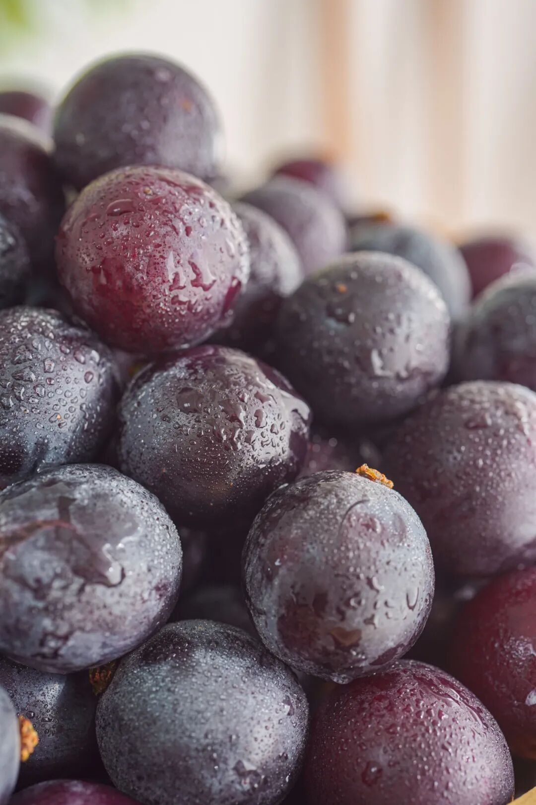
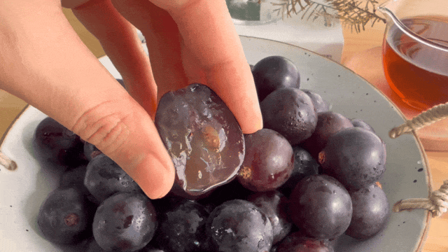
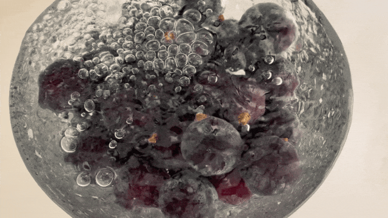
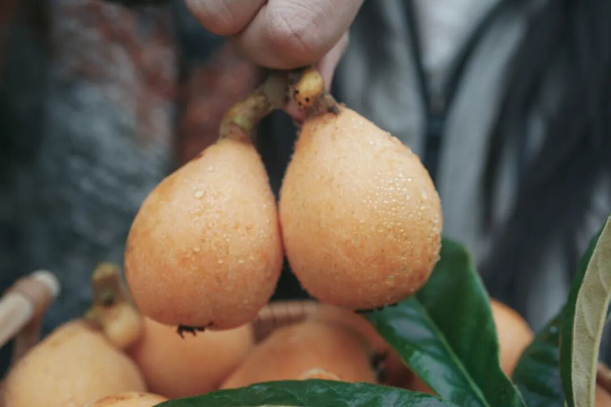
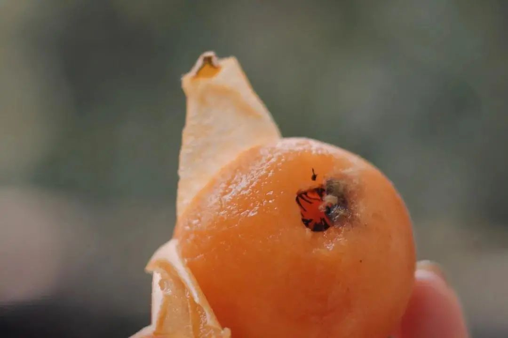
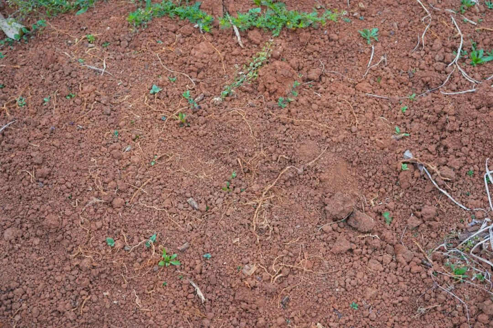
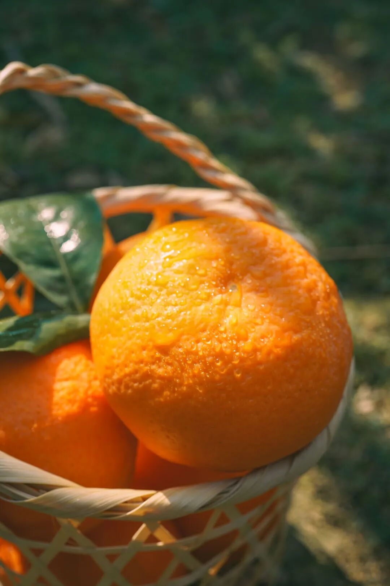
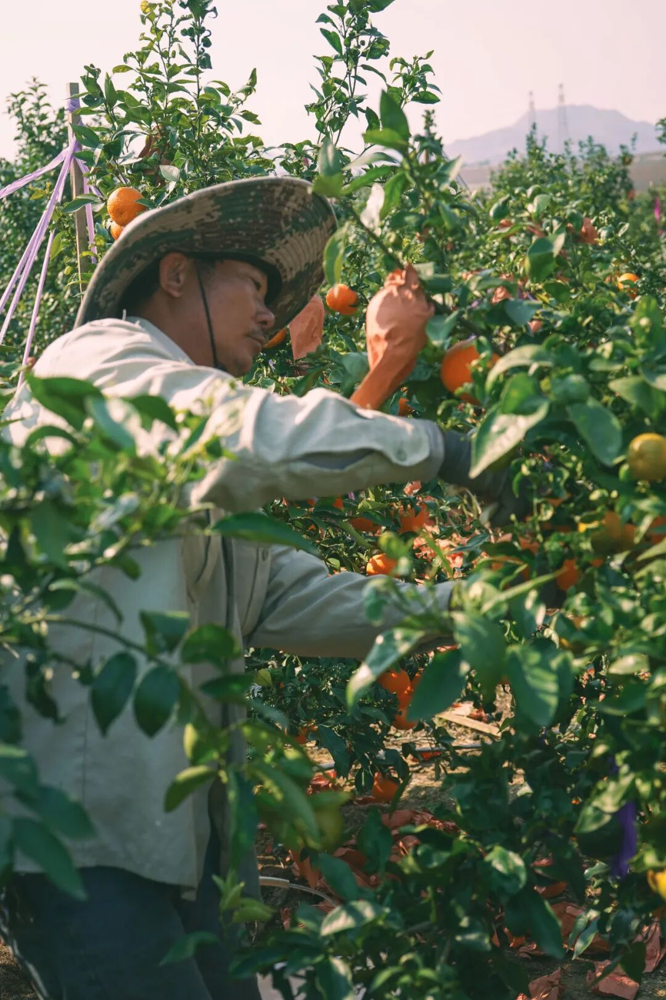

# 嘿嘿，早春三样好东西，蜜蜜甜

- 原文链接: https://mp.weixin.qq.com/s?__biz=MjM5NTYxODQyMA==&mid=2653467021&idx=1&sn=c9efe89c8c688bd34774a95b700960ba&chksm=bc0ca694404d61dcf6963481d463c3fe50124da12da358bd168875471520c760946ed16ccee2&scene=27#wechat_redirect
- 浏览量: N/A
- 点赞数: N/A
- 评论数: N/A
- 转发数: N/A

## 正文

多新鲜呐！

一个尽情安利自我的公众号

以下是没事干研究院的风物研究报告请放心食用
如果你跟我一样，最近偶尔嘴馋，又只想吃点好吃不胖的。建议你整上今天的三样好东西，包你吃完，嘴巴不痒，体重不涨。

看！来自秦岭脚下的蜜蜜甜葡萄！这个季节里的自然恩赐，产品经理找到的时候超惊喜！

每一颗都是爆汁小炸弹！皮薄肉厚，汁水超级足。

甜度高！糖度可达 17 左右，甜中又带着一丝酸，更显得果味浓郁且甜而不腻～

入口除了葡萄本身的果香，还有一层淡淡的玫瑰香，仿佛往嘴巴里喷了花香水，且留香时间还更长

要知道，这个时节有这么好吃的葡萄不容易！感谢田间地头不断钻研的科学家和农人！
这葡萄经多年选育而来，赢在品种本身抗寒耐挂！所以低温天气里也能长！

全程采用科学种植，且施有机肥，老人小孩也可以放心吃哦！

为了更好地运输，这次还采用了单粒包装，先整串修剪下来，
再人工一颗颗拣选，只挑好果、大果👇到手吃起来更方便啦！

老规矩，九分熟发货，大家到手尽快吃！趁现在限时吃水果 9 折！来吧！薅它！

饱记·冬日蜜蜜甜葡萄限时吃水果 9 折！！！新年紫气东来！！！
戳图购买👇

二是好吃到让人拍大腿的蒙自花长虹枇杷！风味好浓甜！我今天必须要好好说道。

都说五月枇杷满树金，

一般枇杷都是在五六月成熟上市，

但是，

云南蒙自这个好山好水好地方，

独特的自然环境造就了能够现在吃的枇杷。

请大家记住它的名字：花长虹！

此物皮薄如纸，

轻轻便可剥开。

内里金黄的果肉，

饱满多汁，娇艳动人。

一口咬下，蜜甜蜜甜的，

美死我也。

不是我说，可与白玉争锋！

（主要最近吃不到嘻嘻

它种在蒙自海拔 1600 米的高原上，之前问过果农大哥：咱为啥非得种这么高啊？大哥微微一笑：海拔高的地方温度低，果子在树时间长，果子才能自然积累糖分啊。。

土呢，看着平平无奇，其实是云南特有的红土地。沙质含量高，还有微量元素，在这样的土里长出来的果子，吸收了更多的营养，才好吃。

给大家看看云南的红土地

树选的是 15 年高山老树，

生态种植，不打农药，

也就是说，

每颗枇杷都是树上挂果，自然成熟！

果农大哥（骄傲脸：

我们只用老树来结果，外面那种小树长出来的果子，不行的。

不打农药，勤劳智慧的云南果农选择把苜蓿花和大豆种在果园里，这些就是天然的氮肥，用来肥地。另外还给每个枇杷果都套了袋，这是为了防止虫子和鸟吃，所以果子上一点农药都没有。

我们辛勤的果农伯伯们，

每日清晨上山采摘，

采摘下来之后，

还要进行二次筛选，

有虫眼的、个头过小的都会被一一筛掉。

所以，

你们拿到手的都是新鲜现摘，

品相最佳，

且个头 19g 以上的精品果子。。。

剥了一颗，啊，真皮薄肉厚又多汁啊。。

总而言之，云南枇杷，不输的。请大家都去买，好吗？（词穷了谁懂？现在还有限时吃水果 9 折！以及，也就卖这一两个月了！外面很难买到的！（反正本薯觉得买不到

饱记·蒙自花长虹枇杷

购买方式如下

限时吃水果 9 折！！！

戳图购买👇

这次还要给大家分享一款

巨好吃巨浓甜的沃柑，

鲜甜，爆汁，

浓浓的橘子味儿。

老板也吃了，当场表示：

开心，红美人有后了！

沃柑主产地在广西，

但是要我说，

云南种出来绝对不输！！！

得天独厚肥沃的红土地，

以及充足毒辣的阳光，

大家都知道，农作物靠天吃饭吧，

阳光强烈的地方，

长出来的果子才好吃。

不仅如此，

我们选用的还是沃柑里面的晚熟品种，

什么意思呢？

就是从结果到成熟，在树时间更长，

给它晒足晒透！果子自然更浓甜！

我们合作的果农来自苗族，

为了让果子更好吃，

他们甚至把中药药材都用上了！

图中这些有黄馑，重楼，白芨等中药药材，铺在树的根部。

中药啥的本薯不懂，

(猜测主要还是起保湿透气作用。。

总之这沃柑就是好吃，汁水巨多，

口感浓甜，还不是那种死甜，

九分甜中带一丝丝酸，

口感层次非常丰富。

之前跟果农大哥还学到过，

表面发亮的沃柑，

其实是泡过保鲜剂的，

新鲜的沃柑表面应该是哑光的。

所以这里再强调一下，

我饱记的沃柑，

除了种植过程绿色环保，

也都是现摘现发的新鲜果，

不说外面绝对买不到吧，

但也是很难买到的品质了。

你们去买啊！

限时吃水果 9 折！！

饱记·云南晚熟沃柑

购买方式如下

限时吃水果 9 折！！！

戳图购买👇

题 外

没吃够的朋友看这里👇

月底就下架的富平柿饼，

再见就是下一个冬天！

尾声限时 85 折！

上周刚冒出来的临安天目山雷笋，

米其林餐厅师傅第三年回购，

不焯水就鲜甜！

现在也有限时 9 折！

刚好配真材实料的饱记腊肠，

限时地板价 8 折！

或者试试好吃不贵的

玫瑰露酒腊肉&腊排骨，

更是限时地板价 7 折！

还有上周刚到的

人称「水果冰淇淋」的凤梨释迦！

限时早鸟 86 折！

回到童年的铁盒蛋卷，

产品经理卷出来的鸭舌、麻花、猪肉脯，

都给一个限时 7 折！！

还有些适合空调房吃吃的水果👇

七彩玲珑的四色小番茄，

清新浓郁的万人迷上海金奖草莓👇

个头基本都在18mm+的云南露天蓝莓，

微甜饱腹、没啥热量的广西双拼芭乐，

现在也有限时 9 折！

此外 90 天短保质期的大师凤梨酥，

也都有限时 9 折冲冲！

饱记·富平柿饼购买方式如下尾声限时 85 折！！！
戳图购买👇

饱记·2025 临安天目山雷笋

购买方式如下

限时 9 折！！！

戳图购买👇

饱记·手工腊肠购买方式如下👇限时地板价 8 折！！！！
戳图下单购买👇或🍑🍑🍑搜索「艾格吃饱了」

饱记·玫瑰露酒腊肉&腊排骨购买方式如下👇限时地板价 7 折！！
戳图下单购买👇或🍑🍑🍑搜索「艾格吃饱了」

饱记·凤梨释迦购买方式如下限时早鸟 86 折！！！
戳图购买👇

饱记·限定铁盒酥酥蛋卷

购买方式如下

限时开门红 7 折！！！

戳图购买👇

饱记·年味零食7 折专区！！
购买方式如下
戳图购买👇

饱记·甜郁四色小番茄

购买方式如下

限时 9 折！！！

戳图购买👇

饱记·云南高原蓝莓限时吃水果 9 折！！！新年莓开眼笑！！！
戳图购买👇

饱记·广西双拼芭乐

限时吃水果 9 折！！

新年健康快乐！！！
戳图购买👇

饱记·红颜草莓限时吃水果 9 折！！！节日莓有烦恼！！
戳图购买👇

饱记·新鲜到货凤梨酥

限时 9 折！！！
戳图购买👇

本文的研究员

薯角啊！赞美春天！

用好吃的方式吃一生

祖国各地好风物

文章转载请加微信「baojiclub」

